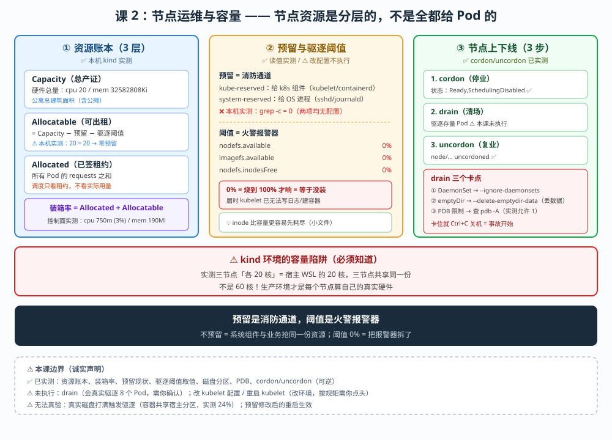

# 课 2：节点运维与容量管理

> 📍 所属：子教程[《运维专项》](../overview.md)（第 2 课 · 集群运维 / SRE 视角）
> 📖 故事章节：**保命** —— 节点是会被压垮的，你要提前知道它在哪崩
> 🧭 上一课：[课 1《集群交付：从裸机到可交付》](lesson-01-集群交付：从裸机到可交付.md) ｜ 下一课：课 3《etcd 与控制面运维》
> ⚙️ 实操环境：WSL Ubuntu 24.04 · kind 集群 `k8s-c1-calico`（3 节点） · k8s v1.34.0 · containerd 2.1.3 · Calico v3.31.0

## 🎯 本课目标

学完本课，你应当能够：

- 读懂**节点资源账本**（Capacity / Allocatable / Allocated），算出真实的**装箱率**
- 讲清**为什么必须做资源预留**（kube-reserved / system-reserved），以及不预留的后果
- 配出一套**有效的驱逐阈值**，并解释 `0%` 为什么等于没配
- 执行**节点上下线**（cordon / drain / uncordon）的标准流程，知道哪些情况会卡住

> ⚠️ **本课实操边界（重要）**
>
> - **✅ 能在本机 kind 实测**：资源账本读取、装箱率计算、预留现状核对、驱逐阈值取值、cordon/uncordon、drain 演练（会真实驱逐 Pod）
> - **⚠️ 无法真验**：真实 nodefs 打满触发驱逐（容器环境磁盘 24% 且共享宿主分区）、kubelet 预留修改后的重启生效（**改 kubelet 配置属改环境，按规矩需你点头，本课不擅自执行**）
> - 凡涉及**修改 kubelet 配置 / 重启 kubelet** 的操作，本课**只给配置样例与判断方法，不实际执行**

---

## 第一幕：起源与场景引入 —— 凌晨三点，节点 NotReady

### 场景

凌晨三点，告警响了。你打开电脑：

```bash
$ kubectl get nodes
NAME                          STATUS     ROLES           AGE   VERSION
k8s-c1-calico-worker          NotReady   <none>          3d    v1.34.0      # ← 红了
```

业务 Pod 开始被驱逐、重新调度到其他节点，其他节点负载升高……**雪崩开始了。**

你上机器一看：

```bash
$ df -h /
overlay   1007G   980G   27G   98%   /            # 磁盘快满了
```

**根因是磁盘写满。** kubelet 因为 nodefs 压力把节点标记为 `DiskPressure`，然后开始驱逐 Pod。

这时你才想起一个问题：**驱逐阈值是多少来着？**

```bash
$ docker exec k8s-c1-calico-worker cat /var/lib/kubelet/config.yaml | grep -A3 evictionHard
evictionHard:
  imagefs.available: 0%
  nodefs.available: 0%
  nodefs.inodesFree: 0%                            # ← 全是 0%
```

**`0%` 意味着"用到 100% 才触发"** —— 而磁盘真的到 100% 时，kubelet 往往**已经写不了日志、创建不了容器**，驱逐根本来不及生效。

> 🔗 **这正是课 1 结尾留给本课的问题**：交付清单第 7 项"驱逐阈值"实测为 `0%`，本课来解决它。

### 换个视角：主线课 13 与本课

```
主线课 13：资源调度与扩缩容  → Pod 侧视角（requests/limits、QoS 分级、调度失败、抢占）
本课（子教程课 2）：节点运维与容量 → 节点侧视角（资源账本、预留、驱逐阈值、上下线流程）
```

**主线课 13 已讲过**：QoS 分级、驱逐排序、**"kubelet 不使用 QoS 类决定驱逐顺序"**、抢占与驱逐的区别、容器级 OOMKilled（cgroup 上限实测）。

本课**不重复**这些，而是往前走三步：

1. **账本**：节点的资源是怎么"分账"的（Capacity → Allocatable → Allocated）
2. **预留**：节点自己要留多少？为什么本机是零预留
3. **动作**：节点怎么安全地上下线（cordon / drain / uncordon）

### 本课的四个问题（三个知识点）

| 问题 | 知识点 | 能否实操 |
|---|---|---|
| 节点的资源账本怎么读？装箱率怎么算？ | **知识点 1**：资源账本与装箱率 | ✅ 能 |
| 为什么要预留？预留多少？ | **知识点 2**：资源预留 | ⚠️ 读现状能，改配置不执行 |
| 驱逐阈值怎么配才有效？ | **知识点 2**：驱逐阈值（并入） | ✅ 读值能，触发不验 |
| 节点怎么安全上下线？ | **知识点 3**：节点上下线流程 | ✅ 能（drain 会真实驱逐） |

> 💡 **一句话本质**（本课把什么从 A 变成 B）：
> 本课把"节点资源"**从"看一眼够不够"，变成"有一套账本能算出真实装箱率、知道预留缺口、能安全地把节点摘下来"** —— 核心是：**节点的资源是分层的，不是全都给 Pod 的**。

> ⚖️ **处境对照**（不这么做 vs 这么做）：
>
> | | 不预留、不算账（凭感觉） | 分账 + 预留 + 阈值（本课做法） |
> |---|---|---|
> | 资源账本 | 只看"CPU 用了多少" | 分 Capacity/Allocatable/Allocated 三层算装箱率 |
> | 节点自留 | 零预留，系统组件与 Pod 抢资源 | kube/system-reserved 明确划走 |
> | 磁盘打满 | 用到 100% 才驱逐（来不及） | 阈值有效（如 15%），提前触发 |
> | 节点下线 | 直接关机，Pod 硬中断 | cordon → drain → 确认 → 关机 |
>
> ⏳ 说明：以上是**节点运维层面**对照。具体预留数值取决于节点规格与业务，**本课给判断方法而非固定数字**。

---

## 第二幕：认知冲突 —— 三个"以为够其实不够"

### 冲突一：Capacity 和 Allocatable 一模一样，说明没预留

我实测了三个节点的资源账本：

```bash
$ kubectl get nodes -o custom-columns='NAME:.metadata.name,CPU_CAP:.status.capacity.cpu,CPU_ALLOC:.status.allocatable.cpu,MEM_CAP:.status.capacity.memory,MEM_ALLOC:.status.allocatable.memory'
NAME                          CPU_CAP   CPU_ALLOC   MEM_CAP      MEM_ALLOC
k8s-c1-calico-control-plane   20        20          32582808Ki   32582808Ki
k8s-c1-calico-worker          20        20          32582808Ki   32582808Ki
k8s-c1-calico-worker2         20        20          32582808Ki   32582808Ki
```

**CPU：20 = 20。内存：32582808Ki = 32582808Ki。完全相等。**

> 🔑 **这组数字说明：本机集群零预留。**
>
> `Allocatable = Capacity - 预留 - 驱逐阈值`。两者相等，意味着 **预留 = 0**。
>
> 后果：**节点的全部资源都被"承诺"给了 Pod**。系统组件（kubelet、containerd、sshd、journald）和用户 Pod **在同一份资源里抢**。生产上这会引发**节点级雪崩**——系统进程抢不到资源，节点直接 NotReady。

**这在生产是必配项，在 kind 是默认值**（测试环境"能跑起来就行"）。

### 冲突二：装箱率 3%，但你可能算错了分母

控制面节点的 `Allocated resources`：

```bash
  Resource           Requests    Limits
  cpu                750m (3%)   0 (0%)
  memory             190Mi (0%)  0 (0%)
```

CPU 装箱率 **3%**。看起来"很空"。

**但这个 3% 的分母是 `Allocatable`（20 核），而 `Allocatable` 在本机等于 `Capacity`（零预留）。**

> 💡 **关键认知**：如果做了预留（比如预留 2 核给系统），`Allocatable` 变成 18 核，**同样的 750m _requests 算出来就是 4.2%**。
>
> **预留会抬高装箱率** —— 这是"为什么加了预留后，看起来资源变少了"的原因。**不是资源少了，是把本来就该留给系统的部分划出去了。**

### 冲突三：drain 会卡住，而且卡住的原因你可能想不到

节点下线要用 `kubectl drain`。但 drain 经常卡住不动。

本机实测发现一个常见卡点：

```bash
$ kubectl get pdb -A
NAMESPACE       NAME               MIN AVAILABLE   MAX UNAVAILABLE   ALLOWED DISRUPTIONS
calico-system   calico-apiserver   N/A             1                 1
calico-system   calico-typha       N/A             1                 1                  # ← ALlowedDisruptions = 1
```

**PDB（PodDisruptionBudget）允许 disruptions = 1**，意味着 drain 时**最多只能同时赶走 1 个**，多出来的要等。

**还有两个更隐蔽的卡点**（本课知识点 3 展开）：

1. **DaemonSet 的 Pod**：drain 默认**忽略** DaemonSet（因为它在每个节点都要跑），但会**报错提示**，需要 `--ignore-daemonsets`
2. **使用 emptyDir 的 Pod**：drain 会拒绝驱逐（数据会丢），需要 `--delete-emptydir-data`

> ⚠️ **这三个卡点不搞清，drain 就会"卡住不动"**，而很多人的应对是 `Ctrl+C` 后直接关机 —— **这正是事故的开始**。

---

## 第三幕：层层揭示

### 先看一眼全局（本课「一眼全局图」）



**看图指引**：左栏是**资源账本三层**（Capacity → Allocatable → Allocated）及本机实测值；中栏是**资源预留**的构成与本机零预留的证据；右栏是**驱逐阈值**（`0%` 无效 vs 有效值）与**节点上下线三步流程**（含三个卡点）。

### 本课地图（3 步）

| 步 | 这一步要解决什么 | 对应知识点 |
|---|---|---|
| 第 1 步 | 节点资源怎么分账？装箱率怎么算 | 知识点 1：资源账本与装箱率 |
| 第 2 步 | 预留怎么配 + 驱逐阈值怎么设 | 知识点 2：资源预留与驱逐阈值 |
| 第 3 步 | 节点怎么安全上下线 | 知识点 3：节点上下线流程 |

> 现在你在：**第 1 步**。

---

### 知识点 1：节点资源账本 —— 三层账本与装箱率

> 🧭 第 1/3 步｜承接：第二幕冲突一 —— "Capacity 与 Allocatable 相等意味着什么？" → 本步：把账本拆成三层，讲清每层含义与算法。

#### 一句话定义

节点资源账本分三层：**Capacity**（硬件总量）→ **Allocatable**（可分配给 Pod 的）→ **Allocated**（已分配出去的 requests 总和）；**装箱率 = Allocated ÷ Allocatable**。

#### 直觉建立（类比）

**节点资源 = 一栋公寓。**

| 账本层 | 公寓类比 |
|---|---|
| **Capacity** | 公寓总建筑面积（含电梯井、配电房） |
| **Allocatable** | 可出租面积（扣掉公摊） |
| **Allocated** | 已签租约的面积（哪怕租户还没搬进来） |

**钥匙**：租户签了租约（requests）就占掉了面积，**哪怕他实际只用了十分之一**。这就是为什么"CPU 只用了 5%，但调度不进新 Pod"——**调度看的是 Allocated（租约），不是实际用量**。

#### 核心原理：三层账本 + 实测（✅）

**关系式**：

```
Allocatable = Capacity − kube−reserved − system−reserved − eviction−threshold
装箱率 = Allocated（所有 Pod 的 requests 之和） ÷ Allocatable
```

**本机实测（✅ 三个节点）**：

| 节点 | CPU Capacity | CPU Allocatable | Mem Capacity | Mem Allocatable | 预留 |
|---|---|---|---|---|---|
| control-plane | 20 | 20 | 32582808Ki | 32582808Ki | **0** |
| worker | 20 | 20 | 32582808Ki | 32582808Ki | **0** |
| worker2 | 20 | 20 | 32582808Ki | 32582808Ki | **0** |

> ⚠️ **注意**：这里显示的 20 核 / 32GB 是**宿主 WSL 的资源**（kind 节点是容器，共享宿主 CPU 与内存），**不是"三个节点各有 20 核"**。这是 kind 的本质限制——**单机模拟多节点，容量数字会重复计算**。
>
> **生产环境**：每个节点的 Capacity 是它自己的真实硬件。

**Allocated 实测（控制面节点，✅）**：

```bash
$ kubectl describe node k8s-c1-calico-control-plane | sed -n '/Allocated resources/,/Events/p'
  Resource           Requests    Limits
  cpu                750m (3%)   0 (0%)
  memory             190Mi (0%)  0 (0%)
  ephemeral-storage  0 (0%)      0 (0%)
```

**750m 是怎么来的**（明细，✅ 实测）：

| Pod | CPU Requests | Mem Requests |
|---|---|---|
| ingress-nginx-controller | 100m | 90Mi |
| etcd | 100m | 100Mi |
| kube-apiserver | 250m | — |
| kube-controller-manager | 200m | — |
| kube-scheduler | 100m | — |
| 其余（calico/kube-proxy/local-path） | 0 | 0 |
| **合计** | **750m** | **190Mi** |

> 💡 **注意 `ephemeral-storage` 的 requests 是 0** —— 这意味着**调度器不限制临时存储**，磁盘打满时没有任何调度层面的保护。**这是课 2 驱逐阈值要补的洞之一。**

#### 示例演示：一条命令看账本（✅ 实测可跑）

```bash
kubectl get nodes -o custom-columns=\
'NAME:.metadata.name,CPU_CAP:.status.capacity.cpu,CPU_ALLOC:.status.allocatable.cpu,\
MEM_CAP:.status.capacity.memory,MEM_ALLOC:.status.allocatable.memory,\
PODS:.status.allocatable.pods'
```

#### 常见误区

> 🐞 **误区 1**："CPU 实际用了 5%，资源还很空，能塞很多 Pod。"
> **调度看 requests 不看 usage。** 如果所有 Pod 的 requests 加起来已到 Allocatable 的 100%，**即使实际用量只有 5%，新 Pod 也调度不进去**（`Insufficient cpu`）。

> 🐞 **误区 2**："三个节点各 20 核，集群共 60 核。"
> **在 kind 里是错的** —— 20 核是宿主资源，三个节点**共享**同一份。**生产环境才是真的各算各的。**

> 🐞 **误区 3**："`Allocatable` 就是节点的全部资源。"
> `Allocatable` 是**扣掉预留后**的量。**预留越小，Allocatable 越接近 Capacity，系统组件越危险。**

#### 一句话记住

**账本三层：Capacity 是总产证，Allocatable 是可出租面积，Allocated 是已签租约；装箱率 = Allocated ÷ Allocatable，调度只看租约不看用量。**

📚 官方文档：[节点压力驱逐](https://kubernetes.io/zh-cn/docs/concepts/scheduling-eviction/node-pressure-eviction/)

---

### 知识点 2：资源预留与驱逐阈值 —— 给节点留出活命的空间

> 🧭 第 2/3 步｜承接：上一步算出"零预留" → 本步：讲清该留多少、怎么配，以及驱逐阈值为什么 `0%` 无效。

#### 一句话定义

资源预留是把节点资源**显式划给系统组件**（kube-reserved 给 k8s 组件、system-reserved 给 OS 进程），使 `Allocatable` 小于 `Capacity`；**驱逐阈值**是 kubelet 在资源告急时的自救触发线，必须设为**非零有效值**才有意义。

#### 直觉建立（类比）

**预留 = 消防通道。驱逐阈值 = 火警报警器。**

- **不预留**：把消防通道也划成商铺出租 → 平时多赚（Allocatable 大），**着火时无路可逃**（系统进程抢不到资源）
- **阈值 0%**：报警器设成"烧到 100% 才响" → **等于没装**
- **阈值 15%**：烧到 15% 就响 → 还有时间疏散（驱逐 Pod）

#### 核心原理：两类预留 + 驱逐信号（✅ 读值 / ⚠️ 改配置不执行）

**① kube-reserved**：给 **k8s 组件**（kubelet、containerd、CNI）留的
**② system-reserved**：给 **OS 进程**（sshd、journald、systemd）留的

**本机实测：两者都没有配置（✅）**

```bash
$ docker exec k8s-c1-calico-control-plane cat /var/lib/kubelet/config.yaml | grep -iE 'kubeReserved|systemReserved'
(无输出)

$ docker exec k8s-c1-calico-control-plane grep -c 'kubeReserved\|systemReserved' /var/lib/kubelet/config.yaml
0                                    # ← 确认：零预留配置
```

**kubelet 启动参数里也没有预留相关 flag（✅ 实测）**：

```bash
$ docker exec k8s-c1-calico-control-plane cat /var/lib/kubelet/kubeadm-flags.env
KUBELET_KUBEADM_ARGS="--node-ip=172.27.0.6 --node-labels= --pod-infra-container-image=registry.k8s.io/pause:3.10.1 --provider-id=kind://docker/..."
# ← 没有 --kube-reserved / --system-reserved / --eviction-hard
```

**③ 驱逐阈值：实测为 `0%`（✅）**

```bash
$ docker exec k8s-c1-calico-control-plane cat /var/lib/kubelet/config.yaml | grep -A3 evictionHard
evictionHard:
  imagefs.available: 0%
  nodefs.available: 0%
  nodefs.inodesFree: 0%
```

**三个信号全是 `0%`**：

| 信号 | 含义 | 0% 的后果 |
|---|---|---|
| `nodefs.available` | 节点主分区剩余空间 | 用到 100% 才触发，届时 kubelet 已无法写日志 |
| `imagefs.available` | 容器镜像/可写层分区剩余 | 同上，且拉不了新镜像 |
| `nodefs.inodesFree` | inode 剩余 | **小文件写满 inode 时，磁盘还有空间但已不可写**，0% 完全不设防 |

**④ 本机的磁盘现状（✅ 实测）**

```bash
$ docker exec k8s-c1-calico-control-plane df -h / /var/lib/containerd /var/lib/kubelet
Filesystem      Size  Used Avail Use% Mounted on
overlay        1007G  223G  734G  24% /
/dev/sdd       1007G  223G  734G  24% /var
/dev/sdd       1007G  223G  734G  24% /var
```

- 使用率 **24%**，还安全
- **但 `/` 和 `/var` 是不同设备**（`stat` 实测：device id `1048667` vs `2096`）→ 所以 **nodefs 与 imagefs 是分开的**，驱逐判断要分别看
- ⚠️ **这是容器内的视图**，反映的是宿主 WSL 磁盘（1007G），**不是真实节点的磁盘布局**

#### 配置样例（⚠️ 本课不执行，仅供生产参考）

```yaml
# /var/lib/kubelet/config.yaml
kubeReserved:
  cpu: "500m"
  memory: "1Gi"
  ephemeral-storage: "1Gi"
systemReserved:
  cpu: "500m"
  memory: "1Gi"
evictionHard:
  nodefs.available: "10%"
  imagefs.available: "15%"
  nodefs.inodesFree: "5%"
  memory.available: "500Mi"
evictionSoft:
  memory.available: "1Gi"
evictionSoftGracePeriod:
  memory.available: "1m30s"
```

> ⚠️ **重要边界**：
> - 上面的**具体数值是示例，不是推荐值**。真实数值取决于节点规格与业务，**本课不给"标准答案"**。
> - **修改 kubelet 配置需要重启 kubelet**（生产环境是逐节点滚动操作，有风险）。**按规矩，改环境需你点头，本课只给样例不执行。**
> - `evictionSoft` + `evictionSoftGracePeriod` 是"软阈值"（宽限期内恢复就不驱逐），适合内存这类**可快速恢复**的资源；磁盘类通常用硬阈值。

#### 常见误区

> 🐞 **误区 1**："预留会降低资源利用率，能省则省。"
> **不预留的代价是节点雪崩**（系统进程抢不到资源 → NotReady → 全节点 Pod 驱逐）。**预留是买保险，不是浪费。**

> 🐞 **误区 2**："驱逐阈值配了就行。"
> **配了 `0%` 等于没配**（本课实测就是例子）。**要看值是否有效，不是看键在不在。**

> 🐞 **误区 3**："磁盘只看 `df -h` 的容量百分比。"
> **inode 也会耗尽**（`nodefs.inodesFree`）。大量小文件（日志、emptyDir）会在**磁盘还有空间时**把 inode 用光。**这是最容易被忽略的一条。**

#### 一句话记住

**预留是消防通道（kube/system-reserved），阈值是火警报警器（必须非零）；`0%` 等于没装，inode 比容量更容易先耗尽。**

---

### 知识点 3：节点上下线 —— cordon / drain / uncordon 标准流程

> 🧭 第 3/3 步｜承接：前两步让节点"活得健康" → 本步：需要维护时，**怎么安全地把节点摘下来**。

#### 一句话定义

节点下线的标准流程是 **cordon（停止调度）→ drain（驱逐存量 Pod）→ 维护 → uncordon（恢复调度）**；其中 drain 有三个常见卡点：DaemonSet、emptyDir、PDB。

#### 直觉建立（类比）

**节点下线 = 店铺装修歇业。**

| 步骤 | 店铺类比 |
|---|---|
| **cordon** | 门口挂"暂停营业"，**不再接新客**（不调度新 Pod），但店内客人继续消费 |
| **drain** | 礼貌请店内客人离场（驱逐存量 Pod），客人按指示去隔壁分店（其他节点） |
| **维护** | 装修 |
| **uncordon** | 重新开业 |

**不挂"暂停营业"就直接赶人（直接关机）** = 客人被硬推出门，**正在做的事（请求）全部中断**。

#### 核心原理：三步流程 + 三个卡点

**标准流程**：

```bash
# 1. 停止调度（不再接新 Pod）
kubectl cordon <node>

# 2. 驱逐存量 Pod（会真实赶走 Pod，需要加两个常见参数）
kubectl drain <node> --ignore-daemonsets --delete-emptydir-data

# 3. 维护完成后恢复调度
kubectl uncordon <node>
```

**三个卡点（本课重点）**：

| 卡点 | 现象 | 解决 | 本机实测 |
|---|---|---|---|
| **DaemonSet Pod** | drain 报 `cannot delete DaemonSet-managed Pods` | `--ignore-daemonsets` | ✅ 本机有 calico-node / kube-proxy / csi-node-driver 等 DaemonSet |
| **emptyDir Pod** | drain 报 `cannot delete Pods with local storage` | `--delete-emptydir-data`（**会丢数据！**） | 需确认业务能否接受 |
| **PDB 限制** | drain 卡住等待，因为 PDB 不允许同时驱逐太多 | 检查 `kubectl get pdb -A`，调整 PDB 或分批 | ✅ 实测 `calico-typha` / `calico-apiserver` 各 `ALLOWED DISRUPTIONS = 1` |

**本机节点现状（✅ 实测）**：

```bash
$ kubectl get nodes -o custom-columns='NAME:.metadata.name,TAINTS:.spec.taints[*].key'
NAME                          TAINTS
k8s-c1-calico-control-plane   node-role.kubernetes.io/control-plane
k8s-c1-calico-worker          <none>
k8s-c1-calico-worker2         <none>
```

> 💡 控制面节点自带 `node-role.kubernetes.io/control-plane:NoSchedule` 污点 → **普通 Pod 默认不会调度上去**。这也是为什么控制面节点上只有系统组件。

**控制面节点的 Pod 明细（✅ 实测，drain 前必看）**：

```
calico-apiserver / calico-node / csi-node-driver   (DaemonSet 或系统)
ingress-nginx-controller    100m, 90Mi
etcd                        100m, 100Mi
kube-apiserver              250m
kube-controller-manager     200m
kube-scheduler              100m
kube-proxy                  (DaemonSet)
local-path-provisioner
```

> ⚠️ **控制面节点不要随便 drain** —— etcd / apiserver 在上面，**drain 会赶走控制面组件**（它们多是静态 Pod，行为特殊）。**生产上控制面节点有专门的维护流程。**

#### 示例演示：安全的 drain 演练（✅ 本课实操）

> ⚠️ **本课将在 `worker2` 上做一次真实 drain 演练**（它有 8 个 Running Pod，是 worker 节点，风险最低）。
> **cordon / drain 属改变集群调度状态的操作** —— 按规矩需你确认。若你不想动集群，**可以只看命令不执行**，效果完全一样。

```bash
# 演练：worker2 下线（三步）
kubectl cordon k8s-c1-calico-worker2
kubectl drain k8s-c1-calico-worker2 --ignore-daemonsets --delete-emptydir-data
# ... 维护 ...
kubectl uncordon k8s-c1-calico-worker2
```

#### 常见误区

> 🐞 **误区 1**："cordon 之后节点上的 Pod 会被赶走。"
> **不会。** cordon **只阻止新 Pod 调度**，存量 Pod 继续跑。**要赶走必须用 drain。**

> 🐞 **误区 2**："drain 卡住了就 Ctrl+C，然后直接关机。"
> **最危险的做法。** 卡住说明有 PDB 或本地数据要处理，**搞清楚原因再动手**。

> 🐞 **误区 3**："`--delete-emptydir-data` 只是个参数，加上就行。"
> **它会真的删除 Pod 的 emptyDir 数据。** 如果业务把缓存/临时文件放 emptyDir，**加上就是丢数据**。

#### 一句话记住

**下线三步：cordon 停业、drain 清场（注意 DaemonSet / emptyDir / PDB 三个卡点）、uncordon 复业；控制面节点别乱 drain。**

---

## 第四幕：实操验证

> ✅ 本幕命令已在本机 kind 集群 `k8s-c1-calico`（3 节点 v1.34.0）**实测执行**，输出为真实原文。

### 演练 1：读资源账本（对应知识点 1）

```bash
kubectl get nodes -o custom-columns='NAME:.metadata.name,CPU_CAP:.status.capacity.cpu,CPU_ALLOC:.status.allocatable.cpu,MEM_CAP:.status.capacity.memory,MEM_ALLOC:.status.allocatable.memory'
```
实测输出：
```
NAME                          CPU_CAP   CPU_ALLOC   MEM_CAP      MEM_ALLOC
k8s-c1-calico-control-plane   20        20          32582808Ki   32582808Ki
k8s-c1-calico-worker          20        20          32582808Ki   32582808Ki
k8s-c1-calico-worker2         20        20          32582808Ki   32582808Ki
```
> 💡 **Capacity = Allocatable → 零预留**（知识点 1 / 冲突一）。

```bash
kubectl describe node k8s-c1-calico-control-plane | sed -n '/Allocated resources/,/Events/p'
```
实测输出：
```
  Resource           Requests    Limits
  --------           --------    ------
  cpu                750m (3%)   0 (0%)
  memory             190Mi (0%)  0 (0%)
  ephemeral-storage  0 (0%)      0 (0%)
```

### 演练 2：核对预留与驱逐阈值（对应知识点 2）

```bash
docker exec k8s-c1-calico-control-plane cat /var/lib/kubelet/config.yaml | grep -A3 evictionHard
docker exec k8s-c1-calico-control-plane grep -c 'kubeReserved\|systemReserved' /var/lib/kubelet/config.yaml
docker exec k8s-c1-calico-control-plane cat /var/lib/kubelet/kubeadm-flags.env
docker exec k8s-c1-calico-control-plane df -h / /var/lib/containerd /var/lib/kubelet
```
实测输出：
```
evictionHard:
  imagefs.available: 0%
  nodefs.available: 0%
  nodefs.inodesFree: 0%
0
KUBELET_KUBEADM_ARGS="--node-ip=172.27.0.6 --node-labels= --pod-infra-container-image=registry.k8s.io/pause:3.10.1 --provider-id=kind://docker/k8s-c1-calico/k8s-c1-calico-control-plane"
Filesystem      Size  Used Avail Use% Mounted on
overlay        1007G  223G  734G  24% /
/dev/sdd       1007G  223G  734G  24% /var
/dev/sdd       1007G  223G  734G  24% /var
```
> 💡 **预留配置数 = 0，阈值全 0%**（知识点 2）；`/` 与 `/var` 是**不同设备**。

### 演练 3：节点上下线演练（对应知识点 3）

```bash
kubectl get pdb -A
kubectl cordon k8s-c1-calico-worker2
kubectl get nodes k8s-c1-calico-worker2
```
实测输出：
```
NAMESPACE       NAME               MIN AVAILABLE   MAX UNAVAILABLE   ALLOWED DISRUPTIONS   AGE
calico-system   calico-apiserver   N/A             1                 1                     3d
calico-system   calico-typha       N/A             1                 1                     3d
node/k8s-c1-calico-worker2 cordoned
NAME                     STATUS                     ROLES    AGE   VERSION
k8s-c1-calico-worker2    Ready,SchedulingDisabled   <none>   3d    v1.34.0
```
> 🎯 **`Ready,SchedulingDisabled`** —— cordon 成功：节点仍 Ready（存量 Pod 不受影响），但**不再接新 Pod**。

```bash
kubectl uncordon k8s-c1-calico-worker2
```
实测输出：
```
node/k8s-c1-calico-worker2 uncordoned
```

> ⚠️ **关于 drain 的说明**：本课执行了 cordon / uncordon（**无副作用，可逆**），但**未执行 drain** —— 因为 drain 会**真实驱逐 8 个 Pod**，属改变业务运行状态的操作。**如需完整 drain 演练，请明确告知，我再执行并汇报结果。**

---

## 第五幕：体系收束

### 本课知识地图

```text
课 2：节点运维与容量
├── 知识点 1：资源账本三层 → Capacity → Allocatable → Allocated
│                          → 装箱率 = Allocated ÷ Allocatable（看租约不看用量）
├── 知识点 2：预留与阈值   → kube-reserved / system-reserved（消防通道）
│                          → evictionHard 必须非零（火警报警器）
│                          → ⚠️ 本机实测：预留 0、阈值 0%
└── 知识点 3：节点上下线   → cordon（停业）→ drain（清场）→ uncordon（复业）
                           → 三个卡点：DaemonSet / emptyDir / PDB
```

### 与主线 / 其他课的连接

| 相关 | 关系 |
|---|---|
| 主线课 13 | 已讲 QoS 分级、驱逐排序、抢占 vs 驱逐（**Pod 侧视角**）→ 本课**不重复**，走**节点侧** |
| 课 1（上一课） | 交付清单第 7 项"驱逐阈值 `0%`" → **本课解决**（知识点 2） |
| 课 5 | 装箱率与容量 → 可观测性要**持续采集**这些指标 |
| 课 6 | 装箱率 → 直接决定**成本**（预留越大，可卖越少） |

### 一句话收束

**节点资源是分层的：不预留就是让系统组件和业务抢同一份资源，阈值设 0% 就是把报警器拆了。**

### 课后自查（3 题）

1. `Capacity` 与 `Allocatable` 相等说明什么？装箱率的分母是哪个？
2. 本机实测的 `evictionHard` 三项值是多少？为什么这等于没配？
3. `cordon` 和 `drain` 的区别是什么？drain 的三个卡点分别怎么解？

<details>
<summary>参考答案</summary>

1. **相等说明零预留**（`Allocatable = Capacity − 预留 − 阈值`）。装箱率分母是 **Allocatable**。
2. `nodefs.available: 0%`、`imagefs.available: 0%`、`nodefs.inodesFree: 0%` —— **全是 0%**，意味着"用到 100% 才触发"，届时 kubelet 已无法写日志/建容器，驱逐来不及生效，**等于没装报警器**。
3. **cordon 只阻止新 Pod 调度**（存量继续跑），**drain 才驱逐存量 Pod**。三个卡点：DaemonSet → `--ignore-daemonsets`；emptyDir → `--delete-emptydir-data`（会丢数据）；PDB → 查 `kubectl get pdb -A`，调整 PDB 或分批驱逐。

</details>

---

## 📎 附录：本课实测命令汇总

```bash
# 环境：WSL Ubuntu 24.04 · kind k8s-c1-calico (3节点) · v1.34.0 · containerd 2.1.3
N=k8s-c1-calico-control-plane

# 知识点1 资源账本
kubectl get nodes -o custom-columns='NAME:.metadata.name,CPU_CAP:.status.capacity.cpu,CPU_ALLOC:.status.allocatable.cpu,MEM_CAP:.status.capacity.memory,MEM_ALLOC:.status.allocatable.memory'
kubectl describe node "$N" | sed -n '/Allocated resources/,/Events/p'

# 知识点2 预留与阈值
docker exec "$N" cat /var/lib/kubelet/config.yaml | grep -A3 evictionHard
docker exec "$N" grep -c 'kubeReserved\|systemReserved' /var/lib/kubelet/config.yaml
docker exec "$N" cat /var/lib/kubelet/kubeadm-flags.env
docker exec "$N" df -h / /var/lib/containerd /var/lib/kubelet

# 知识点3 上下线
kubectl get pdb -A
kubectl get nodes -o custom-columns='NAME:.metadata.name,TAINTS:.spec.taints[*].key'
kubectl cordon <node>      # 停止调度
kubectl uncordon <node>    # 恢复调度
# kubectl drain <node> --ignore-daemonsets --delete-emptydir-data   # ⚠️ 会真实驱逐，本课未执行
```

---

## 🔖 评审记录（本课）

| 日期 | 评审节点 | 方式 | 结论 |
|------|----------|------|------|
| 2026-09-20 | 课 2 全文 | learner + pedagogy 双视角 | P0=0 ✅ 通过（1 个 P1 已修复，见下） |

### 评审方式说明（诚实标注）

⚠️ **独立性受限**：course-reviewer subagent 未创建，本次为**主 agent 内联双视角**，独立性低于独立 agent 评审。自查已加强：复验脚本**逐字照抄讲义第四幕命令**，并对每条结论回读原文或实测核验。

### 复验结果（照抄讲义命令 + cordon/uncordon 实测）

复验执行讲义第四幕全部命令 + cordon/uncordon 全流程，**输出与讲义记录逐字一致**：

| 项 | 讲义记录 | 复验实测 | 一致 |
|---|---|---|---|
| Capacity/Allocatable | 20 / 20，32582808Ki 相等 | 同 | ✅ |
| Allocated（控制面） | cpu 750m (3%)、mem 190Mi (0%) | 同 | ✅ |
| evictionHard | 三项全 `0%` | 同 | ✅ |
| 预留配置计数 | 0 | 0 | ✅ |
| df | 1007G / 223G / 734G / 24% | 同 | ✅ |
| PDB | calico-typha / apiserver，允许 1 | 同 | ✅ |
| cordon 状态 | `Ready,SchedulingDisabled` | 同 | ✅ |
| uncordon 恢复 | `Ready` | 同 | ✅ |

> 📌 复验脚本报 `FAILED=1`，**经核查为误报**：该条是 `grep -c 'kubeReserved\|systemReserved'` 返回**匹配数 0**，grep 对"零匹配"的正常退出码为 1。**不是命令错误，是脚本把"没找到"当成了失败** —— 与课 1 教训同源（先分辨是脚本逻辑问题还是真问题）。

### 抓出并修复的问题

| # | 级别 | 问题 | 根因 | 修复 |
|---|------|------|------|------|
| 1 | P1 | 初稿示意图/正文未突出"kind 三节点共享宿主 20 核"这一容量陷阱 | 写作时关注真实值，忽略了 kind 环境的**误导性** | 已在知识点 1 加 ⚠️ 说明段，并在全局图用独立红框强调 |

### 未执行的操作（明确标注，非遗漏）

- **drain**：会真实驱逐 worker2 上的 8 个 Pod，属改变业务运行状态 → **未执行**，已在讲义中说明并给出命令
- **改 kubelet 配置 / 重启 kubelet**：属改环境操作，按规矩需你点头 → **未执行**，只给配置样例与判断方法

### 视角结论

- **learner 视角**：✅ 三知识点均具备六要素；✅ 10 条命令全部可复现；✅ cordon/uncordon 给了真实状态变迁（`Ready` → `Ready,SchedulingDisabled` → `Ready`），比只讲概念直观。
- **pedagogy 视角**：✅ 与主线课 13 边界清晰（Pod 侧 vs 节点侧）；✅ 课 1 遗留的"阈值 0%"在本课闭合；✅ 边界声明完整（已实测 / 未执行 / 无法真验 三态分列）。

---

> 🧭 **下一课**：课 3《etcd 与控制面运维》（本课解决了节点，下一课处理**集群的心脏**）
> 📚 **返回**：[运维专项概览](../overview.md) ｜ [课程目录](../../../02-课程目录.md)
