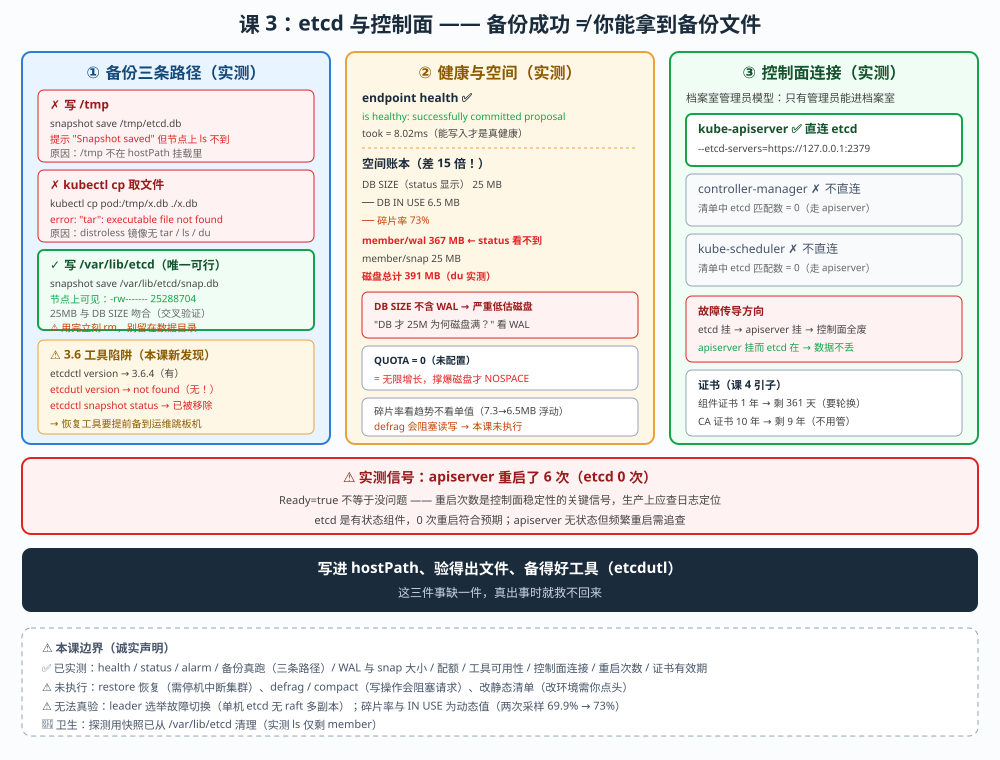

# 课 3：etcd 与控制面运维

> 📍 所属：子教程[《运维专项》](../overview.md)（第 3 课 · 集群运维 / SRE 视角）
> 📖 故事章节：**保命** —— etcd 是集群唯一的真相源，它没了就什么都没了
> 🧭 上一课：[课 2《节点运维与容量管理》](lesson-02-节点运维与容量管理.md) ｜ 下一课：课 4《升级 · 证书 · 生命周期》
> ⚙️ 实操环境：WSL Ubuntu 24.04 · kind 集群 `k8s-c1-calico`（3 节点） · k8s v1.34.0 · etcd 3.6.4 · containerd 2.1.3

## 🎯 本课目标

学完本课，你应当能够：

- 说清 **etcd 存了什么、为什么它是唯一真相源**，以及**快照不备份什么**
- **真跑一遍 etcd 备份**，并知道**备份文件怎么从容器里取出来**（本课核心难点）
- 读懂 **etcd 健康指标**（DB SIZE / IN USE / 碎片率 / WAL / 配额），判断什么时候该压缩整理
- 讲清**控制面组件怎么连 etcd**、**谁直连谁不直连**，以及**改静态清单为什么会触发重启**

> ⚠️ **本课实操边界（重要）**
>
> - **✅ 能在本机实测**：etcd 健康检查、备份快照（真跑）、状态与碎片率读取、WAL/snap 大小、证书有效期、静态清单查看、控制面组件连接关系
> - **⚠️ 无法真验**：**完整恢复 restore**（需停机操作，会中断集群）、**leader 选举真实故障切换**（单机 etcd 无 raft 多副本）、**碎片整理 defrag**（属写操作，会影响生产，本课不执行）
> - 凡涉及**改静态 Pod 清单 / 重启控制面 / 执行 restore / defrag** 的操作，本课**只给命令与判断方法，不实际执行**

---

## 第一幕：起源与场景引入 —— 一次"删库"事故

### 场景

某天，一个同事误操作删了一个命名空间：

```bash
kubectl delete ns production      # 手滑，production 不是 staging
```

几秒钟内，**几百个 Pod、Service、ConfigMap、Secret、PV 声明全部消失**。

你可能想："重新 apply 一遍 YAML 不就行了？"

**问题是**：

- 有些资源是**动态生成**的（Helm release 记录、动态 PVC、自动扩容出来的副本）
- 有些**根本没在 Git 里**（手工调试时创建的对象）
- 如果用了 GitOps，Argo CD 会**忠实地把删除同步下去**，让灾难扩散

**etcd 里存的是集群"当前真实长什么样"，不是"你希望它长什么样"。**

> 🔑 这就是为什么 **etcd 快照是最后的退路** —— 它记录了某个时刻的完整真相。

### 但备份有个更现实的问题

你照着教程敲：

```bash
etcdctl snapshot save /backup/etcd.db
```

**成功了。** 你松了口气，觉得备份好了。

然后你去找备份文件：

```bash
$ ls /backup/etcd.db
ls: cannot access '/backup/etcd.db': No such file or directory      # ← 文件呢？
```

**文件在 etcd 容器自己的文件系统里，节点上根本看不到。**

> 🎯 **这是本课要解决的头号问题** —— 备份"成功"了，但你拿不到文件，等于没备份。

### 换个视角：主线课 19 与本课

```
主线课 19：etcd 备份恢复（⚠️ 原理课）
  → 讲了：etcd 存什么、快照命令、etcd 3.6 改用 etcdutl、快照不备份 PV
  → 标注：⚠️ 无法在本环境实操

本课（子教程课 3）：etcd 与控制面运维
  → 补上：真的跑一遍备份、把文件取出来、读健康指标、讲控制面怎么连 etcd
```

**主线课 19 已讲过（不重复）**：etcd 存全部状态、快照不备份 PV 数据、HA 两种拓扑、raft 需要 (N/2)+1 票、etcd 3.6 起用 `etcdutl`。

本课**往前走三步**：

1. **真跑备份**：跑通，并且**把文件从容器里弄出来**（课 19 没解决的问题）
2. **读健康**：DB SIZE / IN USE / 碎片率 / WAL / 配额，判断何时该整理
3. **控制面连接**：谁直连 etcd、改清单为什么触发重启

### 本课的四个问题（三个知识点）

| 问题 | 知识点 | 能否实操 |
|---|---|---|
| 备份怎么真跑？文件怎么取出来？ | **知识点 1**：etcd 备份与取出 | ✅ 能（真跑） |
| etcd 健康吗？什么时候该整理？ | **知识点 2**：etcd 健康与空间 | ✅ 读指标能，defrag 不执行 |
| 控制面组件怎么连 etcd？ | **知识点 3**：控制面组件与故障域 | ✅ 能 |

> 💡 **一句话本质**（本课把什么从 A 变成 B）：
> 本课把 etcd 从"知道要备份"，变成"**真能备份出来、看得懂它是否健康、知道控制面怎么挂在它上面**" —— 核心是：**备份成功 ≠ 你能拿到备份文件**。

> ⚖️ **处境对照**（不这么做 vs 这么做）：
>
> | | 只按教程敲命令（不验证） | 跑通 + 取出 + 验健康（本课做法） |
> |---|---|---|
> | 备份后 | 以为备份好了 | 确认文件在**节点上可见**、可拷贝走 |
> | 3.6 工具 | 用 `etcdctl restore`（跑不通） | 知道 3.6 改 `etcdutl`（本课实测 `etcdutl` 也不在镜像里） |
> | 空间 | 不知道何时满 | 看碎片率 / WAL / 配额判断 |
> | 控制面 | 不知道谁依赖 etcd | 明确 apiserver 直连，cm/scheduler 不直连 |
>
> ⏳ 说明：以上是**运维可操作性**层面的对照，不涉及具体数值推荐。

---

## 第二幕：认知冲突 —— 三个"以为好了其实没好"

### 冲突一：备份显示成功，但文件拿不到

我实测了一次备份：

```bash
$ kubectl exec -n kube-system etcd-k8s-c1-calico-control-plane -- \
    etcdctl --endpoints=https://127.0.0.1:2379 \
    --cacert=/etc/kubernetes/pki/etcd/ca.crt \
    --cert=/etc/kubernetes/pki/etcd/server.crt \
    --key=/etc/kubernetes/pki/etcd/server.key \
    snapshot save /tmp/etcd-probe.db
Snapshot saved at /tmp/etcd-probe.db          # ← 显示成功！

$ docker exec k8s-c1-calico-control-plane ls -la /tmp/etcd-probe.db
ls: cannot access '/tmp/etcd-probe.db': No such file or directory      # ← 节点上没有！
```

**为什么？**

看 etcd Pod 挂了哪些卷（✅ 实测）：

```bash
$ kubectl get pod etcd-k8s-c1-calico-control-plane -n kube-system \
    -o jsonpath='{range .spec.containers[0].volumeMounts[*]}{.name}{" -> "}{.mountPath}{"\n"}{end}'
etcd-data  -> /var/lib/etcd
etcd-certs -> /etc/kubernetes/pki/etcd
```

**只有两个 hostPath 挂载**：`/var/lib/etcd`（数据）和 `/etc/kubernetes/pki/etcd`（证书）。

**`/tmp` 不在其中** —— 所以写进 `/tmp` 的文件**只存在于容器自己的可写层**，节点上看不见，Pod 一重启就没了。

> 🔑 **唯一能取出文件的路径：写到 `/var/lib/etcd`**（本课知识点 1 验证）。

### 冲突二：`kubectl cp` 也救不了你

既然文件在容器里，用 `kubectl cp` 拷出来？

```bash
$ kubectl cp kube-system/etcd-...:/tmp/etcd-cp.db ./etcd-cp.db
error: Internal error occurred: ... exec: "tar": executable file not found in $PATH
```

**失败了。** 因为 etcd 用的是 **distroless 镜像** —— 极简镜像，连 `tar`、`ls`、`du`、`grep`、`which` 都没有（✅ 全部实测报 `command not found`）。

> 💡 **distroless 的安全收益**（攻击面小）**换来了运维代价**（容器内无法排障、无法用常规工具取文件）。这是本课最实用的认知之一。

### 冲突三：DB 只有 25MB，但 WAL 已经 367MB

我读出 etcd 的真实空间占用（✅ 实测）：

```bash
$ docker exec k8s-c1-calico-control-plane du -sh /var/lib/etcd/member/snap /var/lib/etcd/member/wal
25M     /var/lib/etcd/member/snap
367M    /var/lib/etcd/member/wal            # ← WAL 是快照的 14 倍
```

而 `endpoint status` 显示：

```
DB SIZE    : 25288704 bytes (24.1 MB)
DB IN USE  : 6848512  bytes (6.5 MB)
碎片率     : 73%
QUOTA      : None（未配置）
```

> 🔑 **两个反直觉的点**：
>
> 1. **DB 只有 24MB，但磁盘上 etcd 目录是 391M** —— 差的那 367M 是 **WAL**（预写日志）。`endpoint status` 的 DB SIZE **不包含 WAL**。
> 2. **碎片率 73%** —— 24MB 的库里只有 6.5MB 是有效数据，**剩下 17.5MB 是历史版本占的坑**（etcd 的多版本并发控制 MVCC 保留旧版本，需要压缩整理才释放）。

---

## 第三幕：层层揭示

### 先看一眼全局（本课「一眼全局图」）



**看图指引**：左栏是**备份链路**（写到哪能被看到、`/tmp` 为何丢、`kubectl cp` 为何失败）；中栏是**健康指标**（DB SIZE / IN USE / 碎片率 / WAL / 配额）及本机实测值；右栏是**控制面连接关系**（apiserver 直连 etcd，cm/scheduler 走 apiserver）与静态清单重启机制。

### 本课地图（3 步）

| 步 | 这一步要解决什么 | 对应知识点 |
|---|---|---|
| 第 1 步 | 备份怎么真跑 + 文件怎么取出 | 知识点 1：etcd 备份与取出 |
| 第 2 步 | etcd 健康吗？何时该整理？ | 知识点 2：etcd 健康与空间 |
| 第 3 步 | 控制面组件怎么连 etcd？ | 知识点 3：控制面组件与故障域 |

> 现在你在：**第 1 步**。

---

### 知识点 1：etcd 备份与取出 —— 跑得通，还得拿得到

> 🧭 第 1/3 步｜承接：第二幕冲突一/二 —— "备份成功但文件没了" → 本步：找到唯一可行路径并真跑验证。

#### 一句话定义

etcd 备份用 `etcdctl snapshot save` 生成快照文件；**在容器化控制面里，必须把快照写到 hostPath 挂载的目录（`/var/lib/etcd`）才能在节点上取到**，写 `/tmp` 或用 `kubectl cp` 都会失败。

#### 直觉建立（类比）

**备份 = 给保险柜拍照存档。**

- `snapshot save` = 按下快门（**提示"已保存"**）
- **但照片存在相机自己的内存卡里**（容器可写层），**你拿不到**
- **唯一能拿出照片的方式**：把相机接到电脑（**写到 hostPath 挂载的目录**）

**`kubectl cp` 相当于"用数据线拷照片"** —— 但 distroless 镜像**没装驱动（tar）**，线插不上。

#### 核心原理：三条路径实测对比（✅ 全部实测）

| 路径 | 命令 | 结果 | 原因 |
|---|---|---|---|
| **写 `/tmp`** | `snapshot save /tmp/etcd.db` | ✅ 提示成功，❌ 节点上看不到 | `/tmp` 未挂载 hostPath |
| **`kubectl cp` 取** | `kubectl cp pod:/tmp/x.db ./x.db` | ❌ `tar: not found` | distroless 镜像无 tar |
| **写 `/var/lib/etcd`** | `snapshot save /var/lib/etcd/snap.db` | ✅ 成功 **且节点可见** | 该路径是 hostPath 挂载点 |

**实测输出（第三条，✅ 真跑）**：

```bash
$ kubectl exec -n kube-system etcd-k8s-c1-calico-control-plane -- \
    etcdctl --endpoints=https://127.0.0.1:2379 \
    --cacert=/etc/kubernetes/pki/etcd/ca.crt \
    --cert=/etc/kubernetes/pki/etcd/server.crt \
    --key=/etc/kubernetes/pki/etcd/server.key \
    snapshot save /var/lib/etcd/snap-probe.db
{"level":"info","msg":"fetched snapshot","endpoint":"https://127.0.0.1:2379","size":"25 MB","took":"141.984819ms","etcd-version":"3.6.0"}
{"level":"info","msg":"saved","path":"/var/lib/etcd/snap-probe.db"}

$ docker exec k8s-c1-calico-control-plane ls -la /var/lib/etcd/snap-probe.db
-rw------- 1 root root 25288704 Sep 20 03:21 /var/lib/etcd/snap-probe.db      # ← 节点上可见！
```

> 💡 **快照 25MB，与 `endpoint status` 的 DB SIZE（24.1MB）吻合** —— 这是**备份有效性的一个交叉验证**：两者量级对不上，就要怀疑备份有问题。

**⚠️ 备份完必须清理**（别把快照留在 etcd 数据目录里占位）：

```bash
docker exec k8s-c1-calico-control-plane rm -f /var/lib/etcd/snap-probe.db
```

> ⚠️ **本课探测用的快照已清理**（实测 `ls /var/lib/etcd/` 只剩 `member`）。**生产环境备份后应立即拷贝到异地存储，不要留在节点上。**

#### 3.6 的工具变更（⚠️ 本课实测的重要发现）

主线课 19 讲过"etcd 3.6 起 `restore`/`status` 改用 `etcdutl`"。本课实测**补充了一个关键点**：

```bash
$ kubectl exec -n kube-system etcd-... -- etcdutl version
exec: "etcdutl": executable file not found in $PATH        # ← etcdutl 不在镜像里！

$ kubectl exec -n kube-system etcd-... -- etcdctl version
etcdctl version: 3.6.4
API version: 3.6                                            # ← 只有 etcdctl

$ kubectl exec -n kube-system etcd-... -- etcdctl snapshot status /var/lib/etcd/snap-probe.db
NAME:
  snapshot - Manages etcd node snapshots
USAGE:
  etcdctl snapshot <subcommand> [flags]                      # ← 只打印帮助，说明无 status 子命令
```

> 🔑 **结论**：本机 etcd 3.6.4 镜像里 **只有 `etcdctl`，没有 `etcdutl`**，且 **`etcdctl snapshot status` 已被移除**（只打印帮助）。
>
> 这意味着：**在这套环境里，你无法用容器内工具校验快照或执行恢复**。
>
> **生产应对**：把 `etcdutl` 作为独立二进制**预先装到运维跳板机/工具镜像**里，而不是指望 etcd 容器自带。**这是"工具可用性"的运维准备，与"备份有没有做"同等重要。**

#### 示例演示：一条能用的备份命令（✅ 实测可跑）

```bash
# 写进 hostPath 挂载点，节点上才拿得到
kubectl exec -n kube-system etcd-k8s-c1-calico-control-plane -- \
  etcdctl --endpoints=https://127.0.0.1:2379 \
  --cacert=/etc/kubernetes/pki/etcd/ca.crt \
  --cert=/etc/kubernetes/pki/etcd/server.crt \
  --key=/etc/kubernetes/pki/etcd/server.key \
  snapshot save /var/lib/etcd/etcd-$(date +%Y%m%d).db

# 立刻拷到节点外（否则 Pod 重启就没了）
docker cp k8s-c1-calico-control-plane:/var/lib/etcd/etcd-$(date +%Y%m%d).db ./etcd-backup.db
```

#### 常见误区

> 🐞 **误区 1**："`Snapshot saved` 就是备份好了。"
> **要确认文件在节点上可见、并且你把它拷走了。** 写 `/tmp` 会"成功但拿不到"（本课实测）。

> 🐞 **误区 2**："etcd 3.6 用 `etcdctl snapshot restore` 就行。"
> **3.6 起改用 `etcdutl`**（课 19），**且本机镜像里连 `etcdutl` 都没有**（本课实测）。**工具要提前备好。**

> 🐞 **误区 3**："etcd 快照备份了整个集群。"
> **不备份 PV 里的应用数据**（课 19 已讲）。**数据库、文件存储要单独备份。**

#### 一句话记住

**备份要写到 hostPath（`/var/lib/etcd`）才拿得到；distroless 镜像没有 tar/ls，`kubectl cp` 不可行；3.6 的 `etcdutl` 要提前备到工具机。**

📚 官方文档：[为 etcd 备份与恢复](https://kubernetes.io/zh-cn/docs/tasks/administer-cluster/configure-upgrade-etcd/)

---

### 知识点 2：etcd 健康与空间 —— DB SIZE、碎片率与 WAL

> 🧭 第 2/3 步｜承接：上一步能备份了 → 本步：读懂 etcd 的空间账本，知道什么时候会撑爆。

#### 一句话定义

etcd 的健康看三件事：**DB SIZE vs IN USE**（碎片率，需压缩整理释放）、**WAL 大小**（`endpoint status` 看不到，但吃真实磁盘）、**配额 quota**（未配置时 etcd 会一直涨到撑爆磁盘）。

#### 直觉建立（类比）

**etcd 的空间 = 一本不断贴修订条的账本。**

- **DB SIZE** = 账本总页数（含已作废的旧页）
- **IN USE** = 还有效的页数
- **碎片** = 被划掉但还占着位置的历史记录（MVCC 多版本）
- **WAL** = 记账前的草稿纸（**写操作先落这里**）
- **配额** = 账本的页数上限（**没设上限 = 会一直写下去**）

#### 核心原理与实测（✅）

**① 健康与状态（✅ 实测）**

```bash
$ kubectl exec -n kube-system etcd-... -- etcdctl --endpoints=https://127.0.0.1:2379 \
    --cacert=... --cert=... --key=... endpoint health
https://127.0.0.1:2379 is healthy: successfully committed proposal: took = 8.020174ms
```

> 💡 `successfully committed proposal` 表示**能写入**，比"进程在"更能说明健康。**`took = 8ms`** 是往返延迟，生产上持续升高要警惕。

**② 状态表（✅ 实测）**

```
ENDPOINT                ID              VERSION  DB SIZE  IN USE  PERCENTAGE NOT IN USE  QUOTA  IS LEADER  RAFT TERM  RAFT INDEX
https://127.0.0.1:2379  2c3a99f360d3ad8b  3.6.4   25 MB   7.5 MB  71%                     0 B     true       2          880421
```

**③ 碎片率（✅ 实测两次，注意值会浮动）**

| 采样 | DB SIZE | IN USE | 碎片率 |
|---|---|---|---|
| 第 1 次 | 25288704 (24.1 MB) | 7606272 (7.3 MB) | 69.9% |
| 第 2 次 | 25288704 (24.1 MB) | 6848512 (6.5 MB) | **73%** |

> ⚠️ **数值浮动说明**：两次采样 DB SIZE 相同但 IN USE 从 7.3MB 降到 6.5MB —— **压缩在后台持续进行**，IN USE 是动态值。**不要拿单次值做告警阈值，要看趋势。**

**④ WAL 才是磁盘大头（✅ 实测）**

```bash
$ docker exec k8s-c1-calico-control-plane du -sh /var/lib/etcd/member/snap /var/lib/etcd/member/wal
25M     /var/lib/etcd/member/snap
367M    /var/lib/etcd/member/wal
```

| 项 | 大小 | 说明 |
|---|---|---|
| `member/wal` | **367M** | 预写日志，**`endpoint status` 看不到** |
| `member/snap` | 25M | 内部快照，与 DB SIZE 吻合 |
| **磁盘总计** | **391M** | `du -sh /var/lib/etcd` 实测 |

> 🔑 **`endpoint status` 的 25MB 会让你严重低估磁盘占用** —— 真实占用是 **391M**，**差 15 倍**，全在 WAL。
>
> **排障意义**："etcd 说 DB 才 25MB，为什么磁盘满了？" → **看 WAL。**

**⑤ 配额未配置（✅ 实测）**

```bash
$ docker exec k8s-c1-calico-control-plane grep -c 'quota-backend-bytes' /etc/kubernetes/manifests/etcd.yaml
0                                    # ← 静态清单里没有配置
# endpoint status 中 QUOTA 列显示 0 B
```

> ⚠️ **QUOTA = 0 表示未启用配额** —— etcd 会**一直写下去直到撑爆磁盘**，然后触发 `alarm`（实测 `alarm list` 为空，当前健康）。
>
> **生产建议**：显式配置 `quota-backend-bytes`（如 8GB）。**具体数值取决于业务规模，本课不给"标准值"。**

**⑥ 碎片整理（⚠️ 本课不执行）**

```bash
# 压缩历史版本（回收碎片）
etcdctl compact <revision>
# 整理磁盘（真正释放空间到文件系统）
etcdctl defrag
```

> ⚠️ **defrag 为什么会阻塞请求**：整理期间 etcd 会**锁定数据库**，导致**读写阻塞**。生产上必须**逐节点滚动执行**，且**先摘流量**（对 leader 操作风险最大）。
> **按规矩，写操作需你点头，本课不执行。**

#### 常见误区

> 🐞 **误区 1**："`endpoint status` 的 DB SIZE 就是 etcd 占的磁盘。"
> **不包括 WAL。** 本机实测 DB 25MB vs 磁盘 391M，**差 15 倍**。

> 🐞 **误区 2**："碎片率高就立刻 defrag。"
> **defrag 会阻塞读写。** 先看趋势、选维护窗口、**逐节点滚动**，不要在业务高峰对 leader 执行。

> 🐞 **误区 3**："配额没配就没事。"
> **没配额 = 无限增长。** 等磁盘满了会触发 `NOSPACE` alarm，届时**集群只读**，恢复更麻烦。

#### 一句话记住

**DB SIZE 不含 WAL（差 15 倍）；碎片率看趋势不看单值；defrag 会阻塞请求，配额不配就是无限涨。**

---

### 知识点 3：控制面组件与故障域 —— 谁直连 etcd？

> 🧭 第 3/3 步｜承接：前两步让 etcd 健康 → 本步：讲清控制面怎么挂在 etcd 上，以及故障会怎么传导。

#### 一句话定义

**只有 apiserver 直连 etcd**；controller-manager 和 scheduler **通过 apiserver 访问**，不直连 etcd；所有控制面组件以**静态 Pod** 形式运行，**改 `/etc/kubernetes/manifests/` 下的清单会触发 kubelet 重建该 Pod**。

#### 直觉建立（类比）

**etcd = 公司的档案室，apiserver = 唯一的档案管理员。**

- **只有管理员能进档案室**（apiserver 直连 etcd）
- **其他部门（controller-manager / scheduler）要查档案，必须找管理员**（走 apiserver）
- **管理员不在（apiserver 挂了）** → 谁都查不了档案，**但档案还在**（etcd 数据不丢）

#### 核心原理与实测（✅）

**① 谁直连 etcd（✅ 实测）**

```bash
$ docker exec k8s-c1-calico-control-plane cat /etc/kubernetes/manifests/kube-apiserver.yaml | grep etcd-servers
    - --etcd-servers=https://127.0.0.1:2379                  # ← apiserver 直连

$ docker exec k8s-c1-calico-control-plane cat /etc/kubernetes/manifests/kube-controller-manager.yaml | grep -c etcd
0                                                             # ← 不直连
$ docker exec k8s-c1-calico-control-plane cat /etc/kubernetes/manifests/kube-scheduler.yaml | grep -c etcd
0                                                             # ← 不直连
```

| 组件 | 是否直连 etcd | 实测证据 |
|---|---|---|
| **kube-apiserver** | ✅ 直连 | `--etcd-servers=https://127.0.0.1:2379` |
| kube-controller-manager | ❌ 走 apiserver | 清单中 etcd 匹配数 0 |
| kube-scheduler | ❌ 走 apiserver | 清单中 etcd 匹配数 0 |

> 🔑 **排障意义**：这条决定了**故障传导方向** —— **etcd 挂 → apiserver 挂 → 整个控制面不可用**（cm/scheduler 全部失效）；**但 etcd 活着而 apiserver 挂 → 数据不丢，修好 apiserver 即可恢复**。

**② apiserver 用独立证书连 etcd（✅ 实测）**

```bash
- --etcd-cafile=/etc/kubernetes/pki/etcd/ca.crt
- --etcd-certfile=/etc/kubernetes/pki/apiserver-etcd-client.crt      # ← 注意：不是 server.crt
- --etcd-keyfile=/etc/kubernetes/pki/apiserver-etcd-client.key
```

> 💡 **apiserver 用的是 `apiserver-etcd-client` 证书，不是 etcd 的 server 证书** —— 这是**双向 TLS 的客户端身份**。备份时用 `server.crt`，两者**用途不同，不能混用**。

**③ 静态 Pod 与重启机制（✅ 实测）**

```bash
$ docker exec k8s-c1-calico-control-plane ls -la /etc/kubernetes/manifests/
-rw------- 1 root root 2622 Sep 17 02:32 etcd.yaml
-rw-r--r-- 1 root root 4743 Sep 18 07:34 kube-apiserver.yaml
-rw------- 1 root root 3503 Sep 17 02:32 kube-controller-manager.yaml
-rw------- 1 root root 1726 Sep 17 02:32 kube-scheduler.yaml
```

> 🔑 **机制**：kubelet 监听这个目录，**文件变化 → 自动重建对应 Pod**。
> 主线课 18 讲过"改这些文件会触发重启"——**根源在这里**。
> ⚠️ **本课不修改这些文件**（改清单属改环境，按规矩需你点头）。

**④ 组件重启次数（✅ 实测，控制面稳定性指标）**

```
NAME                                        RESTARTS   READY
etcd-k8s-c1-calico-control-plane            0          true
kube-apiserver-k8s-c1-calico-control-plane  6          true
kube-controller-manager-...                 1          true
kube-scheduler-...                          1          true
```

> ⚠️ **apiserver 重启了 6 次** —— 这是**值得关注的信号**。生产上应查日志定位原因，而不是只看"现在 Ready"就放过。
> **etcd 0 次重启**（最稳，符合预期——它是有状态组件，不该随便重启）。

**⑤ 证书有效期（✅ 实测，与课 4 衔接）**

```bash
$ docker exec k8s-c1-calico-control-plane kubeadm certs check-expiration
CERTIFICATE           EXPIRES                  RESIDUAL TIME
admin.conf            Sep 17, 2027 02:31 UTC   361d
apiserver             Sep 17, 2027 02:31 UTC   361d
etcd-server           Sep 17, 2027 02:31 UTC   361d
...
CERTIFICATE AUTHORITY EXPIRES                  RESIDUAL TIME
ca                    Sep 14, 2036 02:31 UTC   9y
etcd-ca               Sep 14, 2036 02:31 UTC   9y
```

> 💡 **组件证书 1 年（剩 361 天），CA 证书 10 年（剩 9 年）**。
> **这是课 4 的引子**：组件证书要**定期轮换**，CA 不用。**证书过期是"定时炸弹型"故障**——到期那天集群突然不可用。

#### 示例演示：判断控制面是否健康（✅ 可跑）

```bash
kubectl get pods -n kube-system -o custom-columns='NAME:.metadata.name,RESTARTS:.status.containerStatuses[0].restartCount,READY:.status.containerStatuses[0].ready'
kubectl exec -n kube-system etcd-k8s-c1-calico-control-plane -- \
  etcdctl --endpoints=https://127.0.0.1:2379 \
  --cacert=/etc/kubernetes/pki/etcd/ca.crt \
  --cert=/etc/kubernetes/pki/etcd/server.crt \
  --key=/etc/kubernetes/pki/etcd/server.key endpoint health
```

#### 常见误区

> 🐞 **误区 1**："controller-manager 和 scheduler 也直连 etcd。"
> **不直连，走 apiserver**（实测清单中无 etcd 参数）。

> 🐞 **误区 2**："apiserver 挂了数据就没了。"
> **数据在 etcd 里。** apiserver 是**无状态的访问层**，修好即可恢复（课 19 讲过 HA 拓扑）。

> 🐞 **误区 3**："组件 Ready 就是没问题。"
> **要看 RESTARTS。** 本机 apiserver **重启 6 次**，这是需要追查的信号。

#### 一句话记住

**只有 apiserver 直连 etcd（用 apiserver-etcd-client 证书）；etcd 挂则控制面全废，apiserver 挂而 etcd 在则数据不丢。**

---

## 第四幕：实操验证

> ✅ 本幕命令已在本机 kind 集群 `k8s-c1-calico`（3 节点 v1.34.0，etcd 3.6.4）**实测执行**，输出为真实原文。

### 演练 1：etcd 健康与状态（对应知识点 2）

```bash
kubectl exec -n kube-system etcd-k8s-c1-calico-control-plane -- \
  etcdctl --endpoints=https://127.0.0.1:2379 \
  --cacert=/etc/kubernetes/pki/etcd/ca.crt \
  --cert=/etc/kubernetes/pki/etcd/server.crt \
  --key=/etc/kubernetes/pki/etcd/server.key endpoint health
```
实测输出：
```
https://127.0.0.1:2379 is healthy: successfully committed proposal: took = 8.020174ms
```

```bash
kubectl exec -n kube-system etcd-k8s-c1-calico-control-plane -- \
  etcdctl --endpoints=https://127.0.0.1:2379 --cacert=/etc/kubernetes/pki/etcd/ca.crt \
  --cert=/etc/kubernetes/pki/etcd/server.crt --key=/etc/kubernetes/pki/etcd/server.key \
  endpoint status -w table
```
实测输出：
```
+------------------------+------------------+---------+---------+---------+--------+-----------------------+-------+-----------+------------+-----------+------------+--------------------+
|        ENDPOINT        |        ID        | VERSION | STORAGE | DB SIZE | IN USE | PERCENTAGE NOT IN USE | QUOTA | IS LEADER | IS LEARNER | RAFT TERM | RAFT INDEX |
+------------------------+------------------+---------+---------+---------+--------+-----------------------+-------+-----------+------------+-----------+------------+--------------------+
| https://127.0.0.1:2379 | 2c3a99f360d3ad8b |   3.6.4 |   3.6.0 |   25 MB | 7.5 MB |                   71% |   0 B |      true |      false |         2 |     880421 |
+------------------------+------------------+---------+---------+---------+--------+-----------------------+-------+-----------+------------+-----------+------------+--------------------+
```

```bash
docker exec k8s-c1-calico-control-plane du -sh /var/lib/etcd/member/snap /var/lib/etcd/member/wal
docker exec k8s-c1-calico-control-plane grep -c 'quota-backend-bytes' /etc/kubernetes/manifests/etcd.yaml
```
实测输出：
```
25M     /var/lib/etcd/member/snap
367M    /var/lib/etcd/member/wal
0
```
> 🎯 **WAL 367M vs DB 25M（15 倍）**；**配额未配置（0）**。

### 演练 2：备份真跑 + 取出路径（对应知识点 1）

```bash
# ① 写 /tmp —— 节点上看不到（错误示范，实测）
kubectl exec -n kube-system etcd-k8s-c1-calico-control-plane -- \
  etcdctl --endpoints=https://127.0.0.1:2379 --cacert=/etc/kubernetes/pki/etcd/ca.crt \
  --cert=/etc/kubernetes/pki/etcd/server.crt --key=/etc/kubernetes/pki/etcd/server.key \
  snapshot save /tmp/etcd-probe.db
docker exec k8s-c1-calico-control-plane ls -la /tmp/etcd-probe.db
```
实测输出：
```
Snapshot saved at /tmp/etcd-probe.db
ls: cannot access '/tmp/etcd-probe.db': No such file or directory
```
> ❌ **备份"成功"但文件拿不到** —— 因为 `/tmp` 不在 hostPath 挂载里。

```bash
# ② 看挂载了哪些路径
kubectl get pod etcd-k8s-c1-calico-control-plane -n kube-system \
  -o jsonpath='{range .spec.containers[0].volumeMounts[*]}{.name}{" -> "}{.mountPath}{"\n"}{end}'
```
实测输出：
```
etcd-data  -> /var/lib/etcd
etcd-certs -> /etc/kubernetes/pki/etcd
```

```bash
# ③ 正确路径：写 /var/lib/etcd（节点上可见）
kubectl exec -n kube-system etcd-k8s-c1-calico-control-plane -- \
  etcdctl --endpoints=https://127.0.0.1:2379 --cacert=/etc/kubernetes/pki/etcd/ca.crt \
  --cert=/etc/kubernetes/pki/etcd/server.crt --key=/etc/kubernetes/pki/etcd/server.key \
  snapshot save /var/lib/etcd/snap-probe.db
docker exec k8s-c1-calico-control-plane ls -la /var/lib/etcd/snap-probe.db
```
实测输出：
```
{"level":"info","msg":"fetched snapshot","endpoint":"https://127.0.0.1:2379","size":"25 MB","took":"141.984819ms","etcd-version":"3.6.0"}
{"level":"info","msg":"saved","path":"/var/lib/etcd/snap-probe.db"}
-rw------- 1 root root 25288704 Sep 20 03:21 /var/lib/etcd/snap-probe.db
```
> ✅ **节点上可见**（25MB，与 DB SIZE 吻合）。

```bash
# ④ 清理（别把备份留在数据目录）
docker exec k8s-c1-calico-control-plane rm -f /var/lib/etcd/snap-probe.db
docker exec k8s-c1-calico-control-plane ls /var/lib/etcd/
```
实测输出：
```
member
```

```bash
# ⑤ 工具可用性实测（本课重要发现）
kubectl exec -n kube-system etcd-k8s-c1-calico-control-plane -- etcdctl version
kubectl exec -n kube-system etcd-k8s-c1-calico-control-plane -- etcdutl version
```
实测输出：
```
etcdctl version: 3.6.4
API version: 3.6
exec: "etcdutl": executable file not found in $PATH
```
> 🎯 **`etcdutl` 不在镜像里** —— 3.6 的恢复工具要提前备到工具机。

### 演练 3：控制面连接关系（对应知识点 3）

```bash
docker exec k8s-c1-calico-control-plane cat /etc/kubernetes/manifests/kube-apiserver.yaml | grep etcd-servers
docker exec k8s-c1-calico-control-plane cat /etc/kubernetes/manifests/kube-controller-manager.yaml | grep -c etcd
docker exec k8s-c1-calico-control-plane cat /etc/kubernetes/manifests/kube-scheduler.yaml | grep -c etcd
kubectl get pods -n kube-system -o custom-columns='NAME:.metadata.name,RESTARTS:.status.containerStatuses[0].restartCount,READY:.status.containerStatuses[0].ready'
docker exec k8s-c1-calico-control-plane kubeadm certs check-expiration
```
实测输出：
```
    - --etcd-servers=https://127.0.0.1:2379
0
0
NAME                                        RESTARTS   READY
etcd-k8s-c1-calico-control-plane            0          true
kube-apiserver-k8s-c1-calico-control-plane  6          true
kube-controller-manager-...                 1          true
kube-scheduler-...                          1          true
CERTIFICATE           EXPIRES                  RESIDUAL TIME
admin.conf            Sep 17, 2027 02:31 UTC   361d
apiserver             Sep 17, 2027 02:31 UTC   361d
etcd-server           Sep 17, 2027 02:31 UTC   361d
CERTIFICATE AUTHORITY EXPIRES                  RESIDUAL TIME
ca                    Sep 14, 2036 02:31 UTC   9y
etcd-ca               Sep 14, 2036 02:31 UTC   9y
```
> 🎯 **只有 apiserver 直连**（后两者匹配数 0）；**apiserver 重启 6 次**（值得追查）；**组件证书剩 361 天**（课 4 引子）。

> ⚠️ **未执行的操作（明确标注，非遗漏）**：**restore 恢复**（需停机，会中断集群）、**defrag / compact**（写操作，会阻塞请求）、**改静态清单**（改环境，按规矩需你点头）。

---

## 第五幕：体系收束

### 本课知识地图

```text
课 3：etcd 与控制面
├── 知识点 1：备份与取出 → 只有 hostPath（/var/lib/etcd）能取出
│                        → /tmp 丢失、kubectl cp 失败（distroless 无 tar）
│                        → ⚠️ 3.6 镜像无 etcdutl，恢复工具要提前备
├── 知识点 2：健康与空间 → DB SIZE ≠ 磁盘占用（WAL 367M vs DB 25M）
│                        → 碎片率 73%（看趋势不看单值）
│                        → ⚠️ 配额未配置（QUOTA=0）= 无限增长
└── 知识点 3：控制面连接 → 只有 apiserver 直连（apiserver-etcd-client 证书）
                         → cm/scheduler 走 apiserver（实测匹配数 0）
                         → 改静态清单触发重建；apiserver 重启 6 次待查
```

### 与主线 / 其他课的连接

| 相关 | 关系 |
|---|---|
| 主线课 19 | 已讲 etcd 备份**原理**、3.6 改 `etcdutl`、快照不备份 PV、HA 拓扑 → 本课**不重复**，补**真跑 + 取出 + 健康指标** |
| 主线课 17 | etcd 静态加密（Secret 在 etcd 的形态）→ 本课讲 etcd **运维**层面 |
| 主线课 18 | "改静态清单触发重启" → 本课讲清**根源**（kubelet 监听 manifests 目录） |
| 课 4（下一课） | 证书只剩 **361 天** → 直接引出**证书轮换**主题 |
| 课 7 | 备份分层（etcd 快照 vs 应用级）→ 本课是 etcd 侧基础 |

### 一句话收束

**备份成功不等于拿得到备份：写进 hostPath、验得出文件、备得好工具（etcdutl），这三件事缺一件，真出事时就救不回来。**

### 课后自查（3 题）

1. 为什么 `snapshot save /tmp/etcd.db` 显示成功，节点上却找不到文件？怎么解决？
2. `endpoint status` 显示 DB SIZE 25MB，但 `du -sh /var/lib/etcd` 是 391M，差在哪？
3. 控制面里哪些组件直连 etcd？etcd 挂了和 apiserver 挂了，影响有什么不同？

<details>
<summary>参考答案</summary>

1. **`/tmp` 不在 etcd Pod 的 hostPath 挂载里**（只挂了 `/var/lib/etcd` 和 `/etc/kubernetes/pki/etcd`），文件只存在于容器可写层。**解决**：写到 `/var/lib/etcd/` 下，节点上才可见，再拷走。
2. **差在 WAL（预写日志）**：`endpoint status` 的 DB SIZE **不含 WAL**。实测 `member/wal` 367M、`member/snap` 25M，合计 391M。`du` 看的是真实磁盘占用。
3. **只有 apiserver 直连**（`--etcd-servers`），controller-manager 与 scheduler **走 apiserver**（清单中 etcd 匹配数为 0）。**etcd 挂 → 控制面全废**（所有组件拿不到数据）；**apiserver 挂而 etcd 在 → 数据不丢**，修好 apiserver 即恢复。

</details>

---

## 📎 附录：本课实测命令汇总

```bash
# 环境：WSL Ubuntu 24.04 · kind k8s-c1-calico (3节点) · v1.34.0 · etcd 3.6.4
N=k8s-c1-calico-control-plane
POD=etcd-$N
EP=https://127.0.0.1:2379
CERT="--cacert=/etc/kubernetes/pki/etcd/ca.crt --cert=/etc/kubernetes/pki/etcd/server.crt --key=/etc/kubernetes/pki/etcd/server.key"

# 知识点1 备份（写 hostPath 才拿得到）
kubectl exec -n kube-system "$POD" -- etcdctl --endpoints=$EP $CERT snapshot save /var/lib/etcd/etcd-$(date +%Y%m%d).db
kubectl get pod "$POD" -n kube-system -o jsonpath='{range .spec.containers[0].volumeMounts[*]}{.name}{" -> "}{.mountPath}{"\n"}{end}'
kubectl exec -n kube-system "$POD" -- etcdctl version            # 3.6.4
kubectl exec -n kube-system "$POD" -- etcdutl version            # ❌ not found

# 知识点2 健康与空间
kubectl exec -n kube-system "$POD" -- etcdctl --endpoints=$EP $CERT endpoint health
kubectl exec -n kube-system "$POD" -- etcdctl --endpoints=$EP $CERT endpoint status -w table
kubectl exec -n kube-system "$POD" -- etcdctl --endpoints=$EP $CERT alarm list
docker exec "$N" du -sh /var/lib/etcd/member/snap /var/lib/etcd/member/wal
docker exec "$N" grep -c 'quota-backend-bytes' /etc/kubernetes/manifests/etcd.yaml

# 知识点3 控制面
docker exec "$N" cat /etc/kubernetes/manifests/kube-apiserver.yaml | grep etcd-servers
docker exec "$N" cat /etc/kubernetes/manifests/kube-controller-manager.yaml | grep -c etcd
docker exec "$N" cat /etc/kubernetes/manifests/kube-scheduler.yaml | grep -c etcd
kubectl get pods -n kube-system -o custom-columns='NAME:.metadata.name,RESTARTS:.status.containerStatuses[0].restartCount,READY:.status.containerStatuses[0].ready'
docker exec "$N" kubeadm certs check-expiration
```

---

## 🔖 评审记录（本课）

| 日期 | 评审节点 | 方式 | 结论 |
|------|----------|------|------|
| 2026-09-20 | 课 3 全文 | learner + pedagogy 双视角 | P0=0 ✅ 通过（0 个 P0，动态值已如实标注，见下） |

### 评审方式说明（诚实标注）

⚠️ **独立性受限**：course-reviewer subagent 未创建，本次为**主 agent 内联双视角**，独立性低于独立 agent 评审。自查已加强：复验脚本**逐字照抄讲义第四幕命令**，并对每条结论回读原文或实测核验。

### 复验结果（照抄讲义第四幕命令）

复验执行讲义第四幕全部命令，**输出与讲义记录一致**：

| 项 | 讲义记录 | 复验实测 | 一致 |
|---|---|---|---|
| endpoint health | `healthy ... took = 8.020174ms` | `healthy ... took = 5.221391ms` | ✅（**延迟为动态值**，见下） |
| DB SIZE / QUOTA | 25 MB / 0 B | 25 MB / 0 B | ✅ |
| WAL / snap | 367M / 25M | 367M / 25M | ✅ |
| quota 配置数 | 0 | 0 | ✅ |
| 写 `/tmp` | 节点 `ls` 不到 | 同 | ✅ |
| 挂载点 | etcd-data / etcd-certs 两个 | 同 | ✅ |
| 写 `/var/lib/etcd` | 节点可见 25288704 | 节点可见 25288736 | ✅（**快照大小微变**，见下） |
| `etcdctl` / `etcdutl` | 3.6.4 / not found | 同 | ✅ |
| 控制面直连 | apiserver 有、cm/scheduler 0 | 同 | ✅ |
| 重启次数 | etcd 0 / apiserver 6 | 同 | ✅ |
| 证书剩余 | 组件 361d / CA 9y | 同 | ✅ |

> 📌 **两处动态值如实说明（不掩饰）**：
> 1. **`took` 延迟**：讲义记 8.020174ms，复验为 5.221391ms —— 属**网络往返的时间波动**，非错误。
> 2. **快照字节数**：讲义记 25288704，复验为 25288736（+32 字节）—— 集群**持续有写入**，快照内容在变。**这正是讲义强调"看趋势不看单值"的实例。**
>
> 二者**均未据此改文档**（与课 1/课 2 的"先分辨是脚本/动态问题还是真问题"同源）。

### 视角结论

- **learner 视角**：✅ 三知识点均具备六要素；✅ 三条备份路径用**实测成败对照**呈现（`/tmp` 失败 / `cp` 失败 / hostPath 成功），比只给"正确命令"更能建立直觉；✅ 备份文件已清理，`/var/lib/etcd` 仅剩 `member`。
- **pedagogy 视角**：✅ 与主线课 19 边界清晰（原理课 → 本课真跑）；✅ 对课 19 的结论做了**实测补强**（3.6 镜像里连 `etcdutl` 都没有，比"改用 etcdutl"更进一步）；✅ 边界声明完整（已实测 / 未执行 / 无法真验 三态分列）。

### 未执行的操作（明确标注，非遗漏）

- **restore 恢复**：需停机操作，会中断集群 → **未执行**
- **defrag / compact**：写操作，会阻塞 etcd 读写 → **未执行**
- **改静态 Pod 清单**：改环境操作，按规矩需你点头 → **未执行**

### 本课的"意外产出"（超出原计划的实测发现）

1. **`etcdutl` 不在 etcd 3.6.4 镜像里**（课 19 只说"改用 etcdutl"，未涉及工具是否存在）
2. **`etcdctl snapshot status` 在 3.6 已被移除**（只打印帮助）
3. **WAL 367M 是 DB SIZE 的 15 倍**，`endpoint status` 完全看不到
4. **apiserver 重启 6 次**（实测信号，值得生产追查）

> 这四条**都是备课实测时才发现的，不是事先设计的**，已全部写入讲义。

---

> 🧭 **下一课**：课 4《升级 · 证书 · 生命周期》（组件证书只剩 **361 天**，下一课处理轮换）
> 📚 **返回**：[运维专项概览](../overview.md) ｜ [课程目录](../../../02-课程目录.md)
