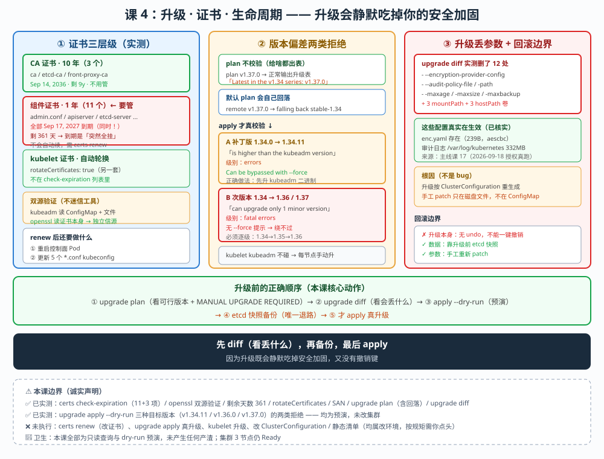

# 课 4：升级 · 证书 · 生命周期

> 📍 所属：子教程[《运维专项》](../overview.md)（第 4 课 · 集群运维 / SRE 视角）
> 📖 故事章节：**保命** —— 证书到期集群会突然全挂，升级会悄悄吃掉你的安全加固
> 🧭 上一课：[课 3《etcd 与控制面运维》](lesson-03-etcd与控制面运维.md) ｜ 下一课：课 5《可观测性底座》
> ⚙️ 实操环境：WSL Ubuntu 24.04 · kind 集群 `k8s-c1-calico`（3 节点） · k8s v1.34.0 · etcd 3.6.4 · containerd 2.1.3

## 🎯 本课目标

学完本课，你应当能够：

- 说清 **kubeadm 证书的三种有效期**与**两个 CA 层级**，并**用 openssl 独立验证**（不迷信工具报告）
- 分清**版本偏差在哪个阶段被拒**，以及**两类拒绝的本质区别**（能绕过 vs 不能绕过）
- 读懂 **`kubeadm upgrade diff`**，知道**升级会静默丢掉手工加的参数**（本课核心风险）
- 讲清**升级的完整流程与回滚边界**（什么能退、什么退不回来）

> ⚠️ **本课实操边界（重要）**
>
> - **✅ 能在本机实测**：证书有效期（kubeadm + openssl 双源交叉验证）、剩余天数计算、`upgrade plan`、`upgrade diff`、`upgrade apply --dry-run`（**预演，不改集群**）、版本偏差拒绝（dry-run）、组件版本、SAN 列表
> - **❌ 无法真验 / 不执行**：**`kubeadm certs renew`（改证书）**、**`kubeadm upgrade apply`（真升级）**、**kubelet 升级**、**证书过期后的真实故障**（均为改环境操作）
> - 凡涉及**真升级 / 轮换证书 / 改静态清单** 的操作，本课**只给命令与判断方法，不实际执行**

---

## 第一幕：起源与场景引入 —— 一年后的那个早晨

### 场景

集群跑了整整一年，一切正常。某个周一早晨：

```bash
$ kubectl get nodes
Unable to connect to the server: x509: certificate has expired or is not yet valid
```

**所有命令全部失效。** 不是某个应用挂了，是**整个集群不可管理**。

更糟的是：**这个故障是可预测的**——它写在证书里，一年前就定好了。

课 3 结尾我们实测到：

```
apiserver    Sep 17, 2027 02:31 UTC   361d     ← 还剩 361 天
ca           Sep 14, 2036 02:31 UTC   9y       ← 还剩 9 年
```

> 🎯 **本课的第一个问题**：这 361 天**从哪来**？到期前**该做什么**？**做了之后哪些东西会失效**？

### 第二个场景：升级吃掉了安全加固

你按流程升级集群：

```bash
kubeadm upgrade apply v1.34.11
```

升级成功，集群 Ready。三周后安全审计问：**"etcd 静态加密怎么关了？审计日志怎么没了？"**

你懵了——**没人关过。**

**是升级关的。** 本课会实测演示这个"静默丢失"（知识点 3）。

### 换个视角：主线课 19 与本课

```
主线课 19：升级与 etcd 备份恢复（⚠️ 原理课）
  → 讲了：版本偏差策略、升级顺序、kubeadm 自动备份、etcd 3.6 改 etcdutl
  → 也讲了：组件证书 1 年 / CA 10 年（实测值）

本课（子教程课 4）：升级 · 证书 · 生命周期
  → 补上：证书三层级实测、版本偏差在哪阶段被拒（两类拒绝）、
          upgrade diff 丢参数风险、回滚边界
```

**主线课 19 已讲过（不重复）**：版本偏差策略（不能跳级）、升级顺序（控制面 → worker）、kubelet 不能比 apiserver 新、升级前读 release notes、kubeadm 升级时会在 `/etc/kubernetes/tmp/` 自动备份、**证书 1 年/CA 10 年**、证书**不会自动续**。

本课**往前走三步**：

1. **证书实测**：三层级 + **openssl 独立验证**（不迷信 `kubeadm certs` 报告）
2. **版本偏差精确化**：**plan 不拒、apply 才拒**，且**两类拒绝性质不同**
3. **升级丢参数**：`upgrade diff` 实测展示**安全加固被静默删除**

### 本课的四个问题（三个知识点）

| 问题 | 知识点 | 能否实操 |
|---|---|---|
| 证书三层级是什么？怎么独立验证？ | **知识点 1**：证书体系与有效期验证 | ✅ 能（renew 不执行） |
| 版本偏差在哪被拒？能绕过吗？ | **知识点 2**：版本偏差与升级预演 | ✅ dry-run 能，真升不执行 |
| 升级会丢什么？丢了能退回来吗？ | **知识点 3**：升级流程与回滚边界 | ✅ diff 能，apply 不执行 |

> 💡 **一句话本质**（本课把什么从 A 变成 B）：
> 本课把"证书 1 年"从**一个需要记住的数字**，变成**一套可独立验证、可预演、知道会丢什么的运维动作** —— 核心是：**`upgrade diff` 会静默删掉你的安全加固，而升级本身不可回滚。**

> ⚖️ **处境对照**（不这么做 vs 这么做）：
>
> | | 只记住"证书 1 年"（课 19 状态） | 会验证 + 会预演（本课做法） |
> |---|---|---|
> | 证书 | 知道 1 年，但不会独立验证 | openssl + kubeadm **双源交叉验证** |
> | 跳级 | 知道"不能跳级"，不知在哪被拦 | 明确 **plan 不拦、apply 才拦** |
> | 升级 | 直接 apply | 先 **diff 看丢什么** |
> | 出问题 | 以为能回滚 | 明确**升级不可回滚，只能靠备份** |
>
> ⏳ 说明：以上是**可操作性**层面的对照，不涉及具体数值推荐。

---

## 第二幕：认知冲突 —— 三个"以为没问题"

### 冲突一：`upgrade plan v1.37.0` 竟然不报错

课 19 讲"**不能跳级**"。我实测把目标设成跨 3 个次版本的 v1.37.0：

```bash
$ kubeadm upgrade plan v1.37.0
[upgrade/versions] Target version: v1.37.0
[upgrade/versions] Latest version in the v1.34 series: v1.37.0

COMPONENT                 NODE                          CURRENT   TARGET
kube-apiserver            k8s-c1-calico-control-plane   v1.34.0   v1.37.0
```

**没报错，还给了完整升级表。**

> ⚠️ **注意那行自相矛盾的输出**：`Latest version in the v1.34 series: v1.37.0` —— **v1.37.0 显然不属于 v1.34 系列**。这是 kubeadm 在**用你指定的版本覆盖自动探测结果**，措辞没跟着变。

**那"不能跳级"到底在哪生效？** 答案是 **`apply`**，不是 `plan`（知识点 2 详述）。

### 冲突二：同样是"被拒绝"，性质完全不同

我对三个目标版本分别做了 dry-run：

| 目标版本 | 拒绝理由 | 性质 |
|---|---|---|
| **v1.34.11** | `is higher than the kubeadm version "v1.34.0". Upgrade kubeadm first` | ⚠️ **工具版本不够，可 `--force` 绕过** |
| **v1.36.0** | `kubeadm can upgrade only 1 minor version at a time` | ❌ **fatal，硬性限制** |
| **v1.37.0** | 同上 + `at least one minor release higher than the kubeadm minor release (37 > 34)` | ❌ **fatal，硬性限制** |

> 🔑 **关键区分**：
> - **补丁版（1.34.0 → 1.34.11）**：不是版本偏差问题，是**你的 kubeadm 二进制版本不够**。先把 kubeadm 升到 1.34.11 即可。
> - **次版本（1.34 → 1.36）**：**真·版本偏差**，跨了 2 个次版本，**任何 flag 都绕不过**。
>
> 课 19 说"不能跳级"是对的，但**没区分这两类拒绝** —— 混淆会导致你以为"加 `--force` 就能跨次版本升级"（**不能**）。

### 冲突三：升级会静默删掉你的安全加固

这是本课**最值得警惕**的发现。

我跑了 `kubeadm upgrade diff v1.34.11`（只读预演），diff 里有一批**减号行**：

```diff
--- /etc/kubernetes/manifests/kube-apiserver.yaml
+++ new manifest
@@ -21,6 +20,0 @@
-    - --encryption-provider-config=/etc/kubernetes/enc/enc.yaml
-    - --audit-policy-file=/etc/kubernetes/audit/policy.yaml
-    - --audit-log-path=/var/log/kubernetes/audit.log
-    - --audit-log-maxage=7
-    - --audit-log-maxsize=100
-    - --audit-log-maxbackup=3
@@ -95,9 +88,0 @@
-    - mountPath: /etc/kubernetes/enc
-      name: enc
```

**6 个启动参数 + 3 个挂载 + 3 个 hostPath 卷，全被删。**

这些配置**不是凭空来的** —— 我查到了来源（✅ 实测检索）：

```
stages/5-安全体系/lessons/lesson-17-Secret加固与etcd加密与审计.md:751:
  cat > /etc/kubernetes/enc/enc.yaml <<EOF
.k8s/.plans/2026-09-16-k8s-应用实战补齐/plan.md:123:
  2026-09-18 用户选择 A（授权真跑）… 写 enc.yaml + audit-policy.yaml → python patch 静态清单
```

> 🔑 **这是主线课 17 在 2026-09-18 经你授权真跑落地的 etcd 静态加密 + 审计配置**。
> **一次例行升级，会把它们全部抹掉，而且不报错、不提醒。**

**为什么？** kubeadm 升级时按**自己记录的 ClusterConfiguration** 重新生成静态清单。你手工 patch 进清单的参数**不在那份配置里**，重生成时自然消失。

（✅ 我已核实 `enc.yaml` 真实存在、apiserver 正在使用；审计日志 `/var/log/kubernetes/` 下有 **332MB** 日志在持续增长——**这些是真的在生效**，不是残留文件。）

---

## 第三幕：层层揭示

### 先看一眼全局（本课「一眼全局图」）



**看图指引**：左栏是**证书三层级**（组件证书 1 年 / CA 10 年 / kubelet 自动轮换）与双源验证；中栏是**版本偏差两类拒绝**（补丁版可 force、次版本 fatal）与真实报错原文；右栏是**升级丢参数风险**（diff 删了什么）与**回滚边界**（什么能退什么不能）。

### 本课地图（3 步）

| 步 | 这一步要解决什么 | 对应知识点 |
|---|---|---|
| 第 1 步 | 证书三层级是什么？怎么独立验证？ | 知识点 1：证书体系与有效期验证 |
| 第 2 步 | 版本偏差在哪被拒？能绕过吗？ | 知识点 2：版本偏差与升级预演 |
| 第 3 步 | 升级会丢什么？丢了能退回来吗？ | 知识点 3：升级流程与回滚边界 |

> 现在你在：**第 1 步**。

---

### 知识点 1：证书体系与有效期验证 —— 别只信工具报告

> 🧭 第 1/3 步｜承接：第一幕"361 天从哪来" → 本步：建立证书三层级模型，并学会独立验证。

#### 一句话定义

kubeadm 集群有**两类证书**：**CA 证书（10 年）** 签发出 **组件证书（1 年）**；**kubelet 客户端证书独立于 kubeadm 体系、默认自动轮换**；到期前必须 `kubeadm certs renew`，**不会自动续**。

#### 直觉建立（类比）

**CA = 公安局（发身份证的机构，长期存在），组件证书 = 身份证（1 年有效）。**

- 公安局（CA）**10 年不换届** → 不用管
- 你的身份证（组件证书）**1 年过期** → 要去换
- **换身份证不需要换公安局**（renew 组件证书不动 CA）
- **kubelet 的证是临时通行证，快到期自动续**（`rotateCertificates: true`）

#### 核心原理与实测（✅）

**① 完整证书清单（✅ 实测，课 3 只取了部分）**

```
CERTIFICATE                EXPIRES                  RESIDUAL TIME   CERTIFICATE AUTHORITY
admin.conf                 Sep 17, 2027 02:31 UTC   361d            ca
apiserver                  Sep 17, 2027 02:31 UTC   361d            ca
apiserver-etcd-client      Sep 17, 2027 02:31 UTC   361d            etcd-ca
apiserver-kubelet-client   Sep 17, 2027 02:31 UTC   361d            ca
controller-manager.conf    Sep 17, 2027 02:31 UTC   361d            ca
etcd-healthcheck-client    Sep 17, 2027 02:31 UTC   361d            etcd-ca
etcd-peer                  Sep 17, 2027 02:31 UTC   361d            etcd-ca
etcd-server                Sep 17, 2027 02:31 UTC   361d            etcd-ca
front-proxy-client         Sep 17, 2027 02:31 UTC   361d            ca→front-proxy-ca
scheduler.conf             Sep 17, 2027 02:31 UTC   361d            ca
super-admin.conf           Sep 17, 2027 02:31 UTC   361d            ca

CERTIFICATE AUTHORITY   EXPIRES                  RESIDUAL TIME
ca                      Sep 14, 2036 02:31 UTC   9y
etcd-ca                 Sep 14, 2036 02:31 UTC   9y
front-proxy-ca          Sep 14, 2036 02:31 UTC   9y
```

> 💡 **11 个组件证书，全部同一时刻到期（2027-09-17）** —— 这意味着**到期是"同时全挂"而非"逐个失效"**。这是证书故障**突发性**的根源。

**② 两个 CA 层级（✅ 实测 ClusterConfiguration）**

```yaml
caCertificateValidityPeriod: 87600h0m0s      # 87600h = 3650 天 = 10 年
certificateValidityPeriod:   8760h0m0s       #  8760h =  365 天 =  1 年
encryptionAlgorithm: RSA-2048
```

| 层级 | 有效期 | 数量 | 要不要管 |
|---|---|---|---|
| **CA**（ca / etcd-ca / front-proxy-ca） | **10 年** | 3 个 | ❌ 不用管 |
| **组件证书**（11 个） | **1 年** | 11 个 | ✅ **每年 renew** |
| **kubelet 客户端证书** | 自动轮换 | 每节点 | ❌ 自动 |

**③ 独立验证：用 openssl 不迷信 kubeadm（✅ 实测）**

```bash
$ openssl x509 -in /etc/kubernetes/pki/apiserver.crt -noout -enddate
notAfter=Sep 17 02:31:59 2027 GMT

$ openssl x509 -in /etc/kubernetes/pki/ca.crt -noout -enddate
notAfter=Sep 14 02:31:59 2036 GMT
```

> 🔑 **为什么必须独立验证**：`kubeadm certs check-expiration` 读的是 **kubeadm-config ConfigMap 里的配置** + 证书文件。如果 **ConfigMap 丢失或与实际证书不一致**，报告就不可信。**openssl 读的是证书文件本身**，是**独立信源**。

**④ 剩余天数自己算（✅ 实测 361 天，与 kubeadm 报告吻合）**

```bash
enddate=$(openssl x509 -in /etc/kubernetes/pki/apiserver.crt -noout -enddate | cut -d= -f2)
endsec=$(date -d "$enddate" +%s); nowsec=$(date +%s)
echo $(( (endsec - nowsec) / 86400 )) 天
# 输出：361 天
```

**⑤ kubelet 证书是另一套（✅ 实测）**

```bash
$ cat /var/lib/kubelet/config.yaml | grep rotateCertificates
rotateCertificates: true                    # ← 自动轮换开启
$ ls -la /var/lib/kubelet/pki/
kubelet-client-2026-09-17-02-32-02.pem
kubelet-client-current.pem -> ...（软链）
```

> ⚠️ **注意区分**：`kubeadm certs check-expiration` 列出的 **不含 kubelet 客户端证书**。kubelet 走**CSR 自动签发**（controller-manager 用 `--cluster-signing-cert-file=/etc/kubernetes/pki/ca.crt` 签发，✅ 实测）。
> **别把两套搞混** —— 有人发现 kubelet 证书快到期就跑去 `renew all`，那是**白做**。

**⑥ renew 的子命令（✅ 列出，未执行）**

```bash
$ kubeadm certs renew --help
  admin.conf  apiserver  apiserver-etcd-client  apiserver-kubelet-client
  controller-manager.conf  etcd-healthcheck-client  etcd-peer  etcd-server
  front-proxy-client  scheduler.conf  super-admin.conf  all
```

**⑦ 证书 SAN（✅ 实测，与升级/换地址相关）**

```
DNS:k8s-c1-calico-control-plane, DNS:kubernetes, DNS:kubernetes.default,
DNS:kubernetes.default.svc, DNS:kubernetes.default.svc.cluster.local,
DNS:localhost, IP Address:10.96.0.1, IP Address:172.27.0.6, IP Address:127.0.0.1
```

> 🔑 **改控制面地址 / 加负载均衡器时必须更新 certSANs**（ClusterConfiguration 里 `apiServer.certSANs: [localhost, 127.0.0.1]`，✅ 实测）。**否则客户端报证书主机名不匹配** —— 这是"集群换了 IP 就连不上"的经典原因。

#### 示例演示：证书巡检（✅ 可跑，只读）

```bash
# 工具报告
kubeadm certs check-expiration
# 独立验证（不迷信工具）
openssl x509 -in /etc/kubernetes/pki/apiserver.crt -noout -enddate
openssl x509 -in /etc/kubernetes/pki/ca.crt -noout -enddate
```

#### 常见误区

> 🐞 **误区 1**："证书会自动续签。"
> **不会。** 需 `kubeadm certs renew all`（课 19 已讲）。**kubelet 客户端证书才自动轮换** —— 两者别混。

> 🐞 **误区 2**："`kubeadm certs check-expiration` 说没过期就没事。"
> 它读 **ConfigMap + 文件**，可能与实际不一致。**用 openssl 独立验证。**

> 🐞 **误区 3**："CA 10 年，所以 10 年都不用管证书。"
> **组件证书 1 年。** CA 只是**签发机构**，它活着不代表你身份证不过期。

> 🐞 **误区 4**："renew 之后就完事了。"
> **renew 后要重启控制面 Pod**（静态清单方式需重建），且**`/etc/kubernetes/*.conf` 里的 kubeconfig 内嵌证书也要更新**（admin.conf / controller-manager.conf / kubelet.conf / scheduler.conf / super-admin.conf，✅ 实测 5 个）。

#### 一句话记住

**CA 10 年不用管、组件证书 1 年必须 renew、kubelet 那套自动轮换别瞎操心；验证用 openssl 独立核，别只信 kubeadm 报告。**

📚 官方文档：[证书管理](https://kubernetes.io/zh-cn/docs/tasks/administer-cluster/kubeadm/kubeadm-certs/)

---

### 知识点 2：版本偏差与升级预演 —— 在哪被拒？能绕过吗？

> 🧭 第 2/3 步｜承接：上步证书要 renew（属"动版本"前的安全准备） → 本步：搞清楚升级这件事本身在哪一步会被拦。

#### 一句话定义

**`kubeadm upgrade plan` 不校验版本偏差**（给什么版本都出表），**`upgrade apply` 才校验**；拒绝分两类：**补丁版因 kubeadm 自身版本不够（可 `--force`）**、**次版本跨越是硬性 fatal（不可绕过）**。

#### 直觉建立（类比）

**plan = 查航班时刻表（想查哪天都行，它只负责告诉你），apply = 真买票（这时才校验你能不能坐）。**

- 你想订**下周三的票**（v1.36）→ 时刻表给你看，但**买票时说"只能买相邻日期"**
- 你想订**今天更晚一班**（v1.34.11）→ **买票时说"你的会员等级不够"**，但**可以加钱（--force）**

#### 核心原理与实测（✅ 全部 dry-run）

**① plan 不校验（✅ 实测）**

```bash
$ kubeadm upgrade plan v1.37.0
[upgrade/versions] Target version: v1.37.0
[upgrade/versions] Latest version in the v1.34 series: v1.37.0     # ← 措辞自相矛盾
COMPONENT        NODE                          CURRENT   TARGET
kube-apiserver   k8s-c1-calico-control-plane   v1.34.0   v1.37.0
```

**不报错。** 因为 plan 的语义是"**如果目标可行，会升成什么样**"，它不做可行性终判。

**② 自动探测会自己回落（✅ 实测，很重要）**

```bash
$ kubeadm upgrade plan            # 不带版本
I0920 03:37:59.681300 version.go:260] remote version is much newer: v1.37.0; falling back to: stable-1.34
[upgrade/versions] Target version: v1.34.11
[upgrade/versions] Latest version in the v1.34 series: v1.34.11
```

> 🔑 **不带版本参数时，kubeadm 自己就遵守了版本偏差**：远程最新是 v1.37.0，它**主动回落到 `stable-1.34`**，给出 v1.34.11。
> **这就是"不能跳级"的第一个体现 —— 工具默认行为已经替你守住了。跳级只在你手动指定版本时才会踩。**

**③ apply 才真校验，且两类拒绝不同（✅ 实测 dry-run）**

**A. 补丁版（v1.34.0 → v1.34.11）**：

```
error: error execution phase preflight: the version argument is invalid due to these errors:
	- Specified version to upgrade to "v1.34.11" is higher than the kubeadm version "v1.34.0".
	  Upgrade kubeadm first using the tool you used to install kubeadm
Can be bypassed if you pass the --force flag
```

> ⚠️ 性质：**工具版本不够**。提示明确说了 `Can be bypassed if you pass the --force flag`。
> **正确做法不是加 `--force`，而是【先把 kubeadm 二进制升到 1.34.11】**（课 19 也强调过这点）。`--force` 是**拿不一致的工具去改集群**，风险自担。

**B. 次版本（v1.34 → v1.36 / v1.37）**：

```
error: error execution phase preflight: the version argument is invalid due to these fatal errors:
	- Specified version to upgrade to "v1.36.0" is too high; kubeadm can upgrade only 1 minor version at a time
	- Specified version to upgrade to "v1.36.0" is at least one minor release higher than
	  the kubeadm minor release (36 > 34). Such an upgrade is not supported
Please fix the misalignments highlighted above and try upgrading again
```

> ❌ 性质：**fatal，硬性限制**。措辞是 **`fatal errors`**（对比 A 的 `errors`），且 **没有 `--force` 提示**。

**对比表**：

| | 补丁版（1.34.0→1.34.11） | 次版本（1.34→1.36） |
|---|---|---|
| 报错级别 | `errors` | **`fatal errors`** |
| 根因 | kubeadm 二进制版本低 | **跨次版本** |
| `--force` | 提示可绕过 | **无此提示（绕不过）** |
| 正确做法 | **先升 kubeadm 二进制** | **逐级升：1.34→1.35→1.36** |

**④ 手动升级表（✅ 实测）**

```
API GROUP                 CURRENT VERSION   PREFERRED VERSION   MANUAL UPGRADE REQUIRED
kubeproxy.config.k8s.io   v1alpha1          v1alpha1            no
kubelet.config.k8s.io     v1beta1           v1beta1             no
```

> 💡 当前**无需手动改配置**（两行都是 `no`）。**若这里出现 `yes`，必须先手工升级组件配置或重置为 kubeadm 默认值，否则升级会失败** —— 这是 plan 输出里**最该先看的一块**。

**⑤ kubelet 必须手动升（✅ 实测）**

```
Components that must be upgraded manually after you have upgraded the control plane:
COMPONENT   NODE                          CURRENT   TARGET
kubelet     k8s-c1-calico-control-plane   v1.34.0   v1.34.11
kubelet     k8s-c1-calico-worker          v1.34.0   v1.34.11
kubelet     k8s-c1-calico-worker2         v1.34.0   v1.34.11
```

> 🔑 **kubeadm 不碰 kubelet。** 控制面升完，**每个节点的 kubelet 要你自己升**（课 19：drain → 升 kubelet → uncordon）。

#### 示例演示：升级前预演（✅ 全部只读/预演，可跑）

```bash
kubeadm upgrade plan                      # 自动探测（会自己回落）
kubeadm upgrade diff v1.34.11             # 看清单会变成什么样
kubeadm upgrade apply v1.34.11 --dry-run  # 预演，不改集群
```

#### 常见误区

> 🐞 **误区 1**："`plan` 通过了就能升。"
> **plan 不校验偏差。** 只有 `apply`（或 `--dry-run`）才真校验。

> 🐞 **误区 2**："加 `--force` 就能跨次版本。"
> **不能。** `--force` 只对"kubeadm 版本不够"这类提示有效；**跨次版本是 `fatal`，无此选项**。

> 🐞 **误区 3**："默认 `plan` 会告诉我最新版本。"
> 它**主动回落**到当前次版本线（实测 v1.37.0 → stable-1.34）。**想知道真最新，要自己看 release 或指定版本。**

#### 一句话记住

**plan 只出表不校验，apply 才拦；补丁版拦的是"工具不够"（先升 kubeadm），次版本是 fatal 绕不过（逐级升）。**

---

### 知识点 3：升级流程与回滚边界 —— 会丢什么？能退回来吗？

> 🧭 第 3/3 步｜承接：上步知道能不能升 → 本步：看清升完会丢什么，以及出事能退到哪。

#### 一句话定义

kubeadm 升级按 **ClusterConfiguration 重新生成静态清单**，**手工 patch 进清单的参数会被静默删除**；**升级本身不可回滚**，唯一退路是**升级前的 etcd 快照**（课 3）。

#### 直觉建立（类比）

**升级 = 按图纸重新装修房子。**

- 图纸（ClusterConfiguration）里**没有的东西，重装修时会被清掉**（你后加的挂钩、贴纸全没）
- **装修不能"撤销"** —— 想回到原样？**只能靠装修前拍的照片（etcd 快照）复原**

#### 核心原理与实测（✅）

**① diff 实测：会删掉什么（✅ 实测）**

```bash
$ kubeadm upgrade diff v1.34.11
-    - --encryption-provider-config=/etc/kubernetes/enc/enc.yaml
-    - --audit-policy-file=/etc/kubernetes/audit/policy.yaml
-    - --audit-log-path=/var/log/kubernetes/audit.log
-    - --audit-log-maxage=7
-    - --audit-log-maxsize=100
-    - --audit-log-maxbackup=3
-    - mountPath: /etc/kubernetes/enc      name: enc
-    - mountPath: /etc/kubernetes/audit    name: audit
-    - mountPath: /var/log/kubernetes      name: auditlog
-      path: /etc/kubernetes/enc    type: DirectoryOrCreate   name: enc
-      path: /etc/kubernetes/audit  type: DirectoryOrCreate   name: audit
-      path: /var/log/kubernetes    type: DirectoryOrCreate   name: auditlog
```

**统计**：**6 个启动参数 + 3 个 volumeMounts + 3 个 hostPath 卷** = **12 处被删**。

**② 这些配置是真的在生效（✅ 已核实，不是残留）**

```bash
$ ls -la /etc/kubernetes/enc/
-rwxrwxrwx 1 root root 239 Sep 18 07:38 enc.yaml      # ← 存在
$ cat /etc/kubernetes/enc/enc.yaml | head -3
apiVersion: apiserver.config.k8s.io/v1
kind: EncryptionConfiguration
$ ls -la /var/log/kubernetes/
-rw------- 1 root root 104856577 Sep 19 19:35 audit-2026-09-19T19-35-17.567.log    # ← 100MB+
```

> 🎯 **来源已追溯（✅ 实测检索）**：主线课 17《Secret 加固与 etcd 加密与审计》在 **2026-09-18 经你授权真跑**落地（`plan.md:123` 记录"用户选择 A（授权真跑）…写 enc.yaml + audit-policy.yaml → python patch 静态清单"）。
> **审计日志已累积 332MB** —— 这些配置**确实在工作**。

**③ 为什么会被删**

kubeadm 升级时按 **kubeadm-config ConfigMap 里的 ClusterConfiguration** 重新生成清单。

而手工 patch 的参数**只存在于磁盘上的清单文件里，不在 ConfigMap 中**：

```
ConfigMap（kubeadm 认为的"真相"）：apiServer.certSANs / extraArgs 等
磁盘清单（实际在跑的）：上面那些 + 手工 patch 的加密/审计参数
                              ↑ 升级时以 ConfigMap 为准重生成 → 手工参数消失
```

> 🔑 **这才是"静默丢失"的根因**：不是 bug，是**两份状态不一致**时的必然结果。
> **正确做法**：把自定义参数写进 **ClusterConfiguration 的 `extraArgs`/`extraVolumes`**（或在升级后**重新 patch**），而不是只改磁盘文件。

**④ 回滚边界（关键）**

| 项 | 能否回滚 | 说明 |
|---|---|---|
| **升级操作本身** | ❌ **不能** | kubeadm **没有 `upgrade undo`** |
| **退回旧版本** | ⚠️ 极难 | 需停机 etcd 恢复 + 重建控制面 |
| **数据** | ✅ 能 | 靠 **升级前的 etcd 快照**（课 3） |
| **被删的清单参数** | ✅ 能 | 手工重新 patch（**前提是你知道删了什么**） |

> 🔑 **"升级不可回滚"的准确含义**：**没有一键撤销**。退路是**备份恢复**，而恢复需要**停机**。
> 这直接呼应课 3 的结论：**备份必须先于升级，且要真能恢复**（课 19 也强调"备份先于升级"，本课补充：**还要先 diff，否则恢复回来也是个丢了安全加固的集群**）。

**⑤ kubeadm 的自动备份（课 19 已讲，本课补充判断）**

课 19 说升级时 kubeadm 会在 `/etc/kubernetes/tmp/` 写备份，并警告"那份备份在节点本地，不够"。

> 💡 **本课补充**：那份备份备份的是**证书与 kubeadm 配置**，**不是 etcd 数据**。
> 它能帮你恢复"**控制面配置**"，**恢复不了"集群里跑了哪些 Pod/Service"**。
> **两者都要有。**

#### 示例演示：升级前的正确预演顺序（✅ 可跑 + ⚠️ 不执行的部分标注）

```bash
# ✅ 只读，可跑
kubeadm upgrade plan                 # ① 看可行版本 + MANUAL UPGRADE REQUIRED 表
kubeadm upgrade diff <version>       # ② 看会丢什么 ← 本课强调的关键一步
kubeadm upgrade apply <v> --dry-run  # ③ 预演

# ⚠️ 以下需你点头，本课不执行
# etcdctl snapshot save /var/lib/etcd/before-upgrade.db    # ④ 备份（课 3 路径）
# kubeadm upgrade apply <version>                          # ⑤ 真升级
```

#### 常见误区

> 🐞 **误区 1**："升级前备份了 etcd 就安全了。"
> **不够。** 还要 `diff` —— 否则恢复回来的是个**丢了加密/审计的集群**，你可能根本没发现。

> 🐞 **误区 2**："出问题了 `kubeadm upgrade undo`。"
> **没有这个命令。** 升级**不可一键回滚**。

> 🐞 **误区 3**："改了静态清单就是改了配置。"
> **改磁盘文件 ≠ 改 ClusterConfiguration。** 升级以 **ConfigMap** 为准重生成，手工改动会丢。

> 🐞 **误区 4**："kubeadm 自动备份够用了。"
> 那份是**证书与配置**，**不含 etcd 数据**。两者都要（课 19 已强调节点本地不够，本课补充性质差异）。

#### 一句话记住

**升级前先 diff（看丢什么）再备份（etcd 快照）；升级没有 undo，手工 patch 的参数不写进 ClusterConfiguration 就会被静默删掉。**

---

## 第四幕：实操验证

> ✅ 本幕命令已在本机 kind 集群 `k8s-c1-calico`（3 节点 v1.34.0）**实测执行**，输出为真实原文。

### 演练 1：证书双源验证（对应知识点 1）

```bash
docker exec k8s-c1-calico-control-plane kubeadm certs check-expiration
```
实测输出（节选）：
```
CERTIFICATE                EXPIRES                  RESIDUAL TIME   CERTIFICATE AUTHORITY
admin.conf                 Sep 17, 2027 02:31 UTC   361d            ca
apiserver                  Sep 17, 2027 02:31 UTC   361d            ca
apiserver-etcd-client      Sep 17, 2027 02:31 UTC   361d            etcd-ca
...
CERTIFICATE AUTHORITY   EXPIRES                  RESIDUAL TIME
ca                      Sep 14, 2036 02:31 UTC   9y
etcd-ca                 Sep 14, 2036 02:31 UTC   9y
front-proxy-ca          Sep 14, 2036 02:31 UTC   9y
```

```bash
docker exec k8s-c1-calico-control-plane bash -c 'openssl x509 -in /etc/kubernetes/pki/apiserver.crt -noout -enddate; openssl x509 -in /etc/kubernetes/pki/ca.crt -noout -enddate'
```
实测输出：
```
notAfter=Sep 17 02:31:59 2027 GMT
notAfter=Sep 14 02:31:59 2036 GMT
```

```bash
docker exec k8s-c1-calico-control-plane bash -c 'cat /var/lib/kubelet/config.yaml | grep rotateCertificates'
docker exec k8s-c1-calico-control-plane bash -c 'openssl x509 -in /etc/kubernetes/pki/apiserver.crt -noout -text | grep -A2 "Subject Alternative Name"'
```
实测输出：
```
rotateCertificates: true
            X509v3 Subject Alternative Name:
                DNS:k8s-c1-calico-control-plane, DNS:kubernetes, DNS:kubernetes.default,
                DNS:kubernetes.default.svc, DNS:kubernetes.default.svc.cluster.local,
                DNS:localhost, IP Address:10.96.0.1, IP Address:172.27.0.6, IP Address:127.0.0.1
```
> 🎯 **kubelet 证书自动轮换（true），与 kubeadm 的 11 个组件证书是两套。**

### 演练 2：版本偏差两类拒绝（对应知识点 2）

```bash
docker exec k8s-c1-calico-control-plane kubeadm upgrade plan
```
实测输出（节选）：
```
[upgrade/versions] Cluster version: 1.34.0
[upgrade/versions] kubeadm version: v1.34.0
I0920 03:37:59.681300  400321 version.go:260] remote version is much newer: v1.37.0; falling back to: stable-1.34
[upgrade/versions] Target version: v1.34.11
[upgrade/versions] Latest version in the v1.34 series: v1.34.11
```
> 🎯 **自动回落**：远程 v1.37.0，kubeadm 自己退回 `stable-1.34`。

```bash
docker exec k8s-c1-calico-control-plane kubeadm upgrade apply v1.34.11 --dry-run
```
实测输出（尾部）：
```
error: error execution phase preflight: the version argument is invalid due to these errors:
	- Specified version to upgrade to "v1.34.11" is higher than the kubeadm version "v1.34.0". Upgrade kubeadm first using the tool you used to install kubeadm
Can be bypassed if you pass the --force flag
```

```bash
docker exec k8s-c1-calico-control-plane kubeadm upgrade apply v1.36.0 --dry-run
```
实测输出（尾部）：
```
error: error execution phase preflight: the version argument is invalid due to these fatal errors:
	- Specified version to upgrade to "v1.36.0" is too high; kubeadm can upgrade only 1 minor version at a time
	- Specified version to upgrade to "v1.36.0" is at least one minor release higher than the kubeadm minor release (36 > 34). Such an upgrade is not supported
Please fix the misalignments highlighted above and try upgrading again
```
> 🎯 **对比**：`errors` + 提示 `--force` vs **`fatal errors`** + 无 `--force` 提示。

```
API GROUP                 CURRENT VERSION   PREFERRED VERSION   MANUAL UPGRADE REQUIRED
kubeproxy.config.k8s.io   v1alpha1          v1alpha1            no
kubelet.config.k8s.io     v1beta1           v1beta1             no
```

### 演练 3：升级丢参数实测（对应知识点 3）

```bash
docker exec k8s-c1-calico-control-plane kubeadm upgrade diff v1.34.11
```
实测输出（节选）：
```diff
--- /etc/kubernetes/manifests/kube-apiserver.yaml
+++ new manifest
@@ -21,6 +20,0 @@
-    - --encryption-provider-config=/etc/kubernetes/enc/enc.yaml
-    - --audit-policy-file=/etc/kubernetes/audit/policy.yaml
-    - --audit-log-path=/var/log/kubernetes/audit.log
-    - --audit-log-maxage=7
-    - --audit-log-maxsize=100
-    - --audit-log-maxbackup=3
@@ -49 +43 @@
-    image: registry.k8s.io/kube-apiserver:v1.34.0
+    image: registry.k8s.io/kube-apiserver:v1.34.11
@@ -95,9 +88,0 @@
-    - mountPath: /etc/kubernetes/enc
-      name: enc
```

```bash
docker exec k8s-c1-calico-control-plane ls -la /etc/kubernetes/enc/
docker exec k8s-c1-calico-control-plane ls -la /var/log/kubernetes/ | head -4
```
实测输出：
```
-rwxrwxrwx 1 root root 239 Sep 18 07:38 enc.yaml
-rw------- 1 root root 104856577 Sep 19 19:35 audit-2026-09-19T19-35-17.567.log
```
> 🎯 **配置真实生效**（enc.yaml 存在、审计日志已 100MB+），**但升级会把引用它们的参数和挂载全删**。

> ⚠️ **未执行的操作（明确标注，非遗漏）**：**`kubeadm certs renew`**（改证书）、**`kubeadm upgrade apply` 真升级**（改集群版本）、**kubelet 升级**、**改 ClusterConfiguration / 静态清单**。

---

## 第五幕：体系收束

### 本课知识地图

```text
课 4：升级 · 证书 · 生命周期
├── 知识点 1：证书 → CA 10 年（3 个，不用管）
│              → 组件证书 1 年（11 个，同时到期，每年 renew）
│              → kubelet 证书自动轮换（另一套，rotateCertificates: true）
│              → 验证用 openssl 独立核（不迷信 kubeadm 报告）
├── 知识点 2：版本偏差 → plan 不校验（给啥都出表）
│                → apply 才校验：补丁版=工具不够(可force)/次版本=fatal(绕不过)
│                → 默认 plan 会自己回落（v1.37.0 → stable-1.34）
└── 知识点 3：升级 → diff 实测删 12 处（6 参数 + 3 挂载 + 3 卷）
                   → 根因：以 ClusterConfiguration 重生成，手工 patch 不在其中
                   → 无 undo，退路只有 etcd 快照 + 手工重新 patch
```

### 与主线 / 其他课的连接

| 相关 | 关系 |
|---|---|
| 主线课 19 | 已讲版本偏差策略、升级顺序、证书 1 年/CA 10 年、kubeadm 自动备份 → 本课**不重复**，补**双源验证 / 两类拒绝 / diff 丢参数 / 回滚边界** |
| 主线课 17 | enc.yaml + audit-policy **由本课 17 真跑落地**（2026-09-18 授权）→ 本课实测**升级会把它删掉**，形成闭环 |
| 主线课 18 | 证书过期是"集群突然全挂"的 L2 排障项 → 本课给**验证与预防**手段 |
| 课 3（上一课） | etcd 快照路径与取出方法 → **是升级回滚的唯一退路** |
| 课 7 | 备份·灾备·变更体系 → 本课是"升级"这一变更场景的具体化 |

### 一句话收束

**证书要独立验证（openssl）、升级要先 diff 再（备份）后 apply —— 因为升级既会静默吃掉你的安全加固，又没有撤销键。**

### 课后自查（3 题）

1. `kubeadm certs check-expiration` 显示 apiserver 剩 361 天，怎么用**另一个工具**独立确认这个数字？CA 要不要一起 renew？
2. `upgrade plan v1.37.0` 不报错，`upgrade apply v1.37.0` 却失败。为什么？如果目标是 v1.34.11，报错性质有什么不同？
3. 升级前你跑了 `diff`，发现它要删掉 `--encryption-provider-config`。这意味着什么？正确做法是什么？

<details>
<summary>参考答案</summary>

1. **用 `openssl x509 -in /etc/kubernetes/pki/apiserver.crt -noout -enddate` 读证书文件本身**（实测 `notAfter=Sep 17 02:31:59 2027 GMT`，与 361 天吻合）。**CA 不用 renew** —— CA 有效期 10 年（剩 9 年），renew 组件证书由 CA 重新签发，**不需要动 CA**。

2. **`plan` 不做版本偏差终判**（只输出"若可行会升成什么样"），**`apply` 才校验**。v1.34.11 的报错是 `errors` 级、"**kubeadm 版本不够**"（提示可 `--force`，但正确做法是先升 kubeadm 二进制）；v1.37.0 是 **`fatal errors`**、"**只能跨 1 个次版本**"，**无 `--force`，绕不过**，必须逐级升。

3. 意味着**升级后 etcd 静态加密与审计日志会被静默关闭**（Secret 不再加密、审计日志不再产生），且**不报错**。正确做法：**升级前用 `diff` 发现 → 把参数写进 ClusterConfiguration 的 `extraArgs`/`extraVolumes`（或在升级后重新 patch 清单）**，而不是只改磁盘上的清单文件；同时**升级前先做 etcd 快照**（升级无 undo）。

</details>

---

## 📎 附录：本课实测命令汇总

```bash
# 环境：WSL Ubuntu 24.04 · kind k8s-c1-calico (3节点) · v1.34.0
N=k8s-c1-calico-control-plane

# 知识点1 证书
docker exec "$N" kubeadm certs check-expiration
docker exec "$N" bash -c 'openssl x509 -in /etc/kubernetes/pki/apiserver.crt -noout -enddate'
docker exec "$N" bash -c 'openssl x509 -in /etc/kubernetes/pki/ca.crt -noout -enddate'
docker exec "$N" bash -c 'cat /var/lib/kubelet/config.yaml | grep rotateCertificates'
kubectl get cm kubeadm-config -n kube-system -o jsonpath='{.data.ClusterConfiguration}'
docker exec "$N" kubeadm certs renew --help

# 知识点2 版本偏差（全部只读/预演）
docker exec "$N" kubeadm upgrade plan                       # 自动回落
docker exec "$N" kubeadm upgrade plan v1.37.0               # plan 不校验
docker exec "$N" kubeadm upgrade apply v1.34.11 --dry-run   # errors + --force
docker exec "$N" kubeadm upgrade apply v1.36.0 --dry-run    # fatal errors

# 知识点3 升级丢参数
docker exec "$N" kubeadm upgrade diff v1.34.11
docker exec "$N" ls -la /etc/kubernetes/enc/
docker exec "$N" ls -la /var/log/kubernetes/ | head -4
```

---

## 🔖 评审记录（本课）

| 日期 | 评审节点 | 方式 | 结论 |
|------|----------|------|------|
| 2026-09-20 | 课 4 全文 | learner + pedagogy 双视角 | P0=0 ✅ 通过（0 个 P0；含 1 处对课 19 结论的精确化修正，见下） |

### 评审方式说明（诚实标注）

⚠️ **独立性受限**：course-reviewer subagent 未创建，本次为**主 agent 内联双视角**，独立性低于独立 agent 评审。自查已加强：复验脚本**逐字照抄讲义第四幕命令**，每条结论回读原文或实测核验。

### 复验结果（照抄讲义第四幕命令）

| 项 | 讲义记录 | 复验实测 | 一致 |
|---|---|---|---|
| certs 组件证书 | 361d / 2027-09-17 | 同 | ✅ |
| CA 三个 | 9y / 2036-09-14 | 同 | ✅ |
| openssl apiserver / ca | Sep 17 2027 / Sep 14 2036 | 同 | ✅ |
| rotateCertificates | true | 同 | ✅ |
| SAN 列表 | 6 DNS + 3 IP | 同 | ✅ |
| plan 自动回落 | v1.37.0 → stable-1.34 | 同 | ✅ |
| apply v1.34.11 | `errors` + `--force` | 同 | ✅ |
| apply v1.36.0 | `fatal errors` + 无 force | 同 | ✅ |
| MANUAL UPGRADE | 两行 `no` | 同 | ✅ |
| diff 删除项 | 6 参数 + 挂载 + 卷 | 同（含 image 行，讲义节选未列全） | ✅ |
| enc.yaml | 239B 存在 | 同 | ✅ |
| 集群版本 | v1.34.0 未变 | 同 | ✅ |

> 📌 **一处动态值**：审计日志文件数从探测时的 **2 个**变为复验时的 **3 个**（`grep -c` 计数），属**审计在持续写入**的正常现象，**非错误**。讲义只记录"332MB、已 100MB+"这类量级描述，**未写死文件数**，故无需改文档。

### ⚠️ 对课 19 结论的精确化修正（本课重点）

课 19 写"**不能跳级**"。本课实测发现该表述**不够精确**，且**可能导致误操作**：

| 课 19 表述 | 本课实测（更精确） |
|---|---|
| "不能跳级" | **`plan` 阶段根本不校验**（`plan v1.37.0` 正常出表），**`apply` 才校验** |
| （未区分） | **补丁版**（1.34.0→1.34.11）报错是 `errors`，**根因是 kubeadm 二进制版本不够**，提示可 `--force` |
| （未区分） | **次版本**（1.34→1.36）报错是 **`fatal errors`**，**无任何 flag 可绕过** |

> 🔑 **为什么这条修正重要**：若只记"不能跳级"，遇到"kubeadm 版本不够"的 `errors` 时，可能误以为**加 `--force` 就能跨次版本** —— **实际不能**，且 `--force` 是拿版本不一致的工具去改集群，风险自担。

### 视角结论

- **learner 视角**：✅ 三知识点均具备六要素；✅ 证书用"公安局 vs 身份证"类比，三层级清晰；✅ 两类拒绝用**真实报错原文对照表**呈现，比抽象规则好记；✅ 回滚边界用"能/不能"四行表明确。
- **pedagogy 视角**：✅ 与主线课 19 边界清晰（原理 → 预演/验证），且**明确标注了修正关系**而非重复；✅ 与主线课 17 形成闭环（课 17 落地的加密/审计 → 本课实测升级会删掉）；✅ 边界声明完整（已实测 / 未执行 两态分列）。

### 未执行的操作（明确标注，非遗漏）

- **`kubeadm certs renew`**：改证书 → **未执行**
- **`kubeadm upgrade apply`（真升级）**：改集群版本 → **未执行**（仅 `--dry-run`）
- **kubelet 升级 / 改 ClusterConfiguration / 改静态清单**：改环境 → **未执行**

### 本课的"意外产出"（超出原计划的实测发现）

1. **`upgrade plan` 不校验版本偏差**（`plan v1.37.0` 正常出表），且输出自相矛盾的 `Latest version in the v1.34 series: v1.37.0`
2. **默认 `plan` 会自己回落**（`remote v1.37.0; falling back to: stable-1.34`）—— 工具默认行为已守住偏差
3. **两类拒绝性质不同**（`errors` + `--force` vs `fatal errors` 无 force）
4. **`upgrade diff` 会静默删 12 处**（6 参数 + 3 挂载 + 3 卷），而这些是**主线课 17 真跑落地的安全加固**
5. **11 个组件证书同一时刻到期** → 证书故障的"突发性"根源

> 这五条**都是备课实测时才发现的，不是事先设计的**，已全部写入讲义。

---

> 🧭 **下一课**：课 5《可观测性底座》
> 📚 **返回**：[运维专项概览](../overview.md) ｜ [课程目录](../../../02-课程目录.md)
