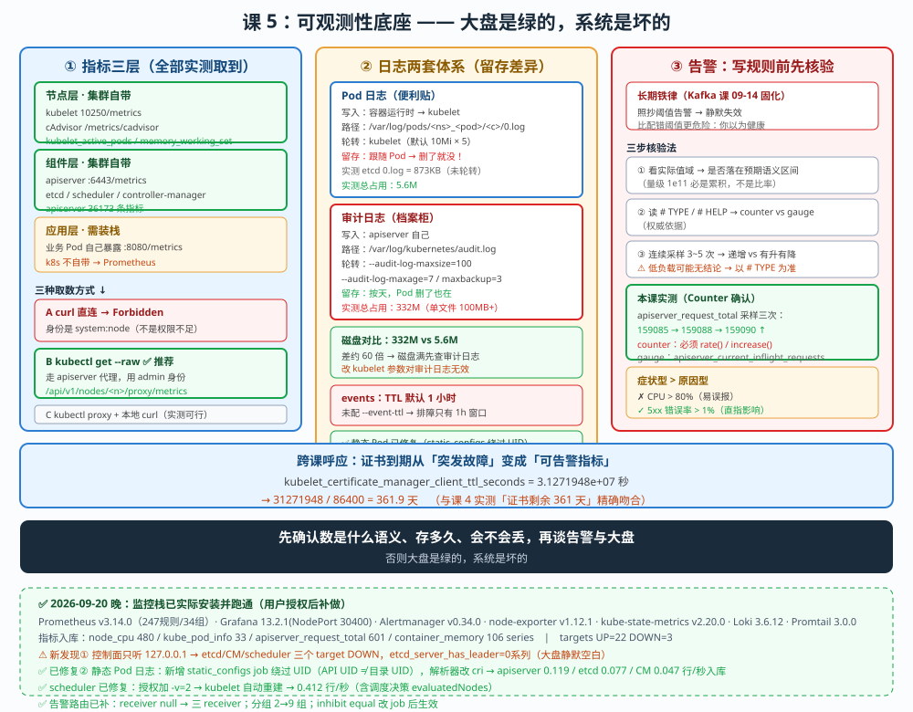

# 课 5：可观测性底座 —— 监控 · 日志 · 告警

> 📍 所属：子教程[《运维专项》](../overview.md)（第 5 课 · 集群运维 / SRE 视角）
> 📖 故事章节：**体系线 · 看得见** —— 看不见的系统等于没有，但"看得见"是有前提的
> 🧭 上一课：[课 4《升级 · 证书 · 生命周期》](lesson-04-升级与证书生命周期.md) ｜ 下一课：课 6《多租户治理与成本》
> ⚙️ 实操环境：WSL Ubuntu 24.04 · kind 集群 `k8s-c1-calico`（3 节点） · k8s v1.34.0 · etcd 3.6.4 · containerd 2.1.3 · metrics-server 已装

## 🎯 本课目标

学完本课，你应当能够：

- 说清 **k8s 指标的三层来源**（节点 / 组件 / 应用），并**亲手取到每一层的指标**
- 讲清 **Pod 日志与审计日志是两套独立体系**，各自的**轮转与留存由谁管**（本课核心风险）
- 用 **Counter / Gauge 语义验证**判断一个指标**能不能直接写进告警**（呼应长期铁律）

> ✅ **监控栈已实际安装并实测（2026-09-20 用户授权后完成）**
>
> | 组件 | 版本 | 状态 |
> |---|---|---|
> | kube-prometheus-stack | chart 91.4.1 / v0.94.0 | ✅ deployed |
> | Prometheus | v3.14.0 | ✅ 247 条规则 / 34 组 |
> | Grafana | 13.2.1（NodePort **30400**） | ✅ Running |
> | Alertmanager | v0.34.0 | ✅ Running |
> | node-exporter | v1.12.1-distroless | ✅ 3/3 |
> | kube-state-metrics | v2.20.0 | ✅ Running |
> | Loki | chart 7.3.0 / 3.6.12 | ✅ Running |
> | Promtail | 3.0.0 | ✅ 3/3 |
>
> **Grafana 入口**：`http://localhost:30400`（admin / admin）
> **Prometheus targets**：UP=22，DOWN=3（控制面组件只监听 127.0.0.1，见知识点 1 补充）
>
> - **✅ 全程实测**：三层指标取数、`kubectl top`、日志落点与留存、**删 Pod 后三方对照实验**、指标入库 series 数、告警规则加载数
> - **❌ 仍未做**：改 kubelet 轮转参数、改 apiserver event-ttl、长周期留存验证、生产级告警路由配置
> - values 文件见 [monitoring/values-kps.yaml](../monitoring/values-kps.yaml)

---

## 第一幕：起源与场景引入 —— "我们有监控"的错觉

### 场景

运维同学说："我们装了 Prometheus，有 Grafana 大盘。"

然后线上出事：

```
09:12  用户反馈服务慢
09:15  看 Grafana —— 大盘一片绿，CPU 40%，内存 60%
09:20  继续查，发现 etcd 写入延迟已经飙到 2 秒
09:21  但大盘上根本没有 etcd 延迟这一项
```

**大盘是绿的，系统是坏的。** 因为**你监控的是"容易拿到的指标"，不是"会出事的指标"**。

> 🎯 **本课的第一个问题**：k8s 的指标**从哪来**？**哪些层你没接上**？

### 第二个场景：日志存了，但查不到

磁盘告警：`/var/log` 使用率 95%。你上去看：

```bash
$ ls -la /var/log/kubernetes/
-rw------- 1 root root 104856741 Sep 19 23:13 audit-2026-09-19T23-13-52.972.log
-rw------- 1 root root 104857531 Sep 20 02:51 audit-2026-09-20T02-51-47.025.log
```

审计日志**单个文件就 100MB+**（✅ 本课实测）。而另一边：

```
用户：帮我查一下上周三那个 Pod 为什么重启
你：kubectl logs <pod>        ← 空的
你：kubectl logs <pod> --previous   ← 也空
```

**Pod 早就被删了，日志随之消失。**

> 🎯 **本课的第二个问题**：**Pod 日志**和**审计日志**是**两套完全不同的留存体系**——各自的规则是什么？

### 第三个场景：告警规则写错了，而且静默失效

你照着教程写了一条告警：

```yaml
- alert: KafkaRequestHandlerBusy
  expr: kafka_server_requesthandlerpool_requesthandleravgidlepercent < 0.3
```

它**永远不触发**——因为那个指标是**累积计数**（量级 1e11），不是比率。

> 这是你 2026-09-14 在 Kafka 课实测过的真实教训（已固化为长期铁律）。**本课把它放进 k8s 语境再练一次。**

### 换个视角：主线课 14 与本课

```
主线课 14：可观测性概念（三根支柱，k8s 各带了多少）
  → 讲了：Metrics/Logging/Tracing 三支柱、kubectl logs 的三个边界

本课（子教程课 5）：可观测性底座
  → 补上：指标三层各怎么取（含鉴权这个真实门槛）
          日志两套体系的留存规则（谁在轮转）
          告警前的语义验证（Counter vs Gauge）
```

**主线课 14 已讲过（不重复）**：三支柱概念、日志的基本概念与 `kubectl logs` 边界。

本课**往前走三步**：

1. **指标三层实测**：不装任何组件，**用集群自带的东西把三层指标全取出来**
2. **日志留存真相**：Pod 日志 vs 审计日志，**两套独立规则**（附磁盘风险实测）
3. **告警前置验证**：**连续采样**判断 Counter/Gauge，避免静默失效

### 本课的四个问题（三个知识点）

| 问题 | 知识点 | 能否实操 |
|---|---|---|
| 指标三层从哪来？怎么取？ | **知识点 1**：指标三层与取数方式 | ✅ 能（不装组件） |
| 日志存哪？谁在轮转？ | **知识点 2**：日志两套体系与留存 | ✅ 能（看配置与文件） |
| 这个指标能直接告警吗？ | **知识点 3**：告警设计与语义验证 | ✅ 采样能，配告警不执行 |

> 💡 **一句话本质**（本课把什么从 A 变成 B）：
> 本课把"可观测性"从**一个需要装一堆组件的工程**，变成**一套能先用集群自带能力验证、再决定要不要装的判断方法** —— 核心是：**先确认你拿到的数是什么语义，再谈告警。**

> ⚖️ **处境对照**（不这么做 vs 这么做）：
>
> | | 直接装 Prometheus（常见做法） | 先验证语义再决定（本课做法） |
> |---|---|---|
> | 指标 | 大盘有什么看什么 | 先确认**三层各自取得到** |
> | 告警 | 照抄教程阈值 | 先**连续采样**确认 Counter/Gauge |
> | 出问题 | 大盘绿但系统坏 | 知道**哪层没接上** |
> | 日志 | 以为都存着 | 知道 **Pod 日志随 Pod 消失** |
>
> ⏳ 说明：以上是**方法论**层面的对照，不涉及具体组件选型推荐。

---

## 第二幕：认知冲突 —— 三个"以为没问题"

### 冲突一：同样的 `/metrics`，有的能访问有的被拒

我试着用 curl 直接抓组件指标，全被拒：

```bash
$ curl -sk https://127.0.0.1:6443/metrics
{ "kind": "Status", "apiVersion": "v1", ... }     # ← Forbidden
$ curl -sk --cert kubelet-client.pem https://127.0.0.1:10250/metrics/resource
Forbidden (user=system:node:k8s-c1-calico-control-plane, verb=get, resource=nodes, subresource(s)=[metrics])
```

但换成这一条就通了：

```bash
$ kubectl get --raw /metrics | head
apiserver_current_inflight_requests{request_kind="mutating"} 1
apiserver_request_total{code="200",...} 159017
```

> 🔑 **为什么？** 不是权限不够，是**身份不对**。
> curl 用的 kubelet 证书身份是 `system:node:<节点名>`（✅ 实测 `subject=O = system:nodes, CN = system:node:k8s-c1-calico-control-plane`），**这个身份没有 `nodes/metrics` 权限**。
> `kubectl get --raw` 走 **apiserver 代理**，用的是 **kubeconfig 里的 admin 身份**（`auth can-i get nodes/metrics` 返回 `yes`）。

**这不是 bug，是 k8s 的分层鉴权设计**（知识点 1 详述）。

### 冲突二：审计日志 332MB，Pod 日志只有 5.6MB

同一台节点上（✅ 本课实测）：

```
/var/log/kubernetes/   332M    ← 审计日志（单个文件 100MB+）
/var/log/pods/         5.6M    ← 所有 Pod 的日志加起来
```

**差 60 倍。** 而它们的**轮转规则完全不同**：

| | Pod 日志 | 审计日志 |
|---|---|---|
| 谁轮转 | **kubelet**（`containerLogMaxSize`，默认 10Mi × 5） | **apiserver**（`--audit-log-maxsize=100`） |
| 留存 | 跟随 **Pod 生命周期** | 按**天数**（`maxage=7`） |
| 删 Pod 后 | **日志一起消失** | 不受影响 |

> 🔑 **这意味着**：你以为"日志都存着"，实际上**最容易丢的恰恰是你最常查的 Pod 日志**。

### 冲突三：`kubectl top` 有数据，但 09 手册说"metrics-server 未装"

我翻开 [09-排障速查手册](../../../09-排障速查手册.md)：

```
| `kubectl top` 无数据 | metrics-server 未装 → HPA 不会工作 |
```

但我实测（✅）：

```bash
$ kubectl get pods -n kube-system | grep metrics
metrics-server-7c5fdf4664-sscgl   1/1   Running   0   3d
$ kubectl top nodes
NAME                          CPU(cores)   CPU(%)   MEMORY(bytes)   MEMORY(%)
k8s-c1-calico-control-plane   143m         0%       1758Mi          5%
k8s-c1-calico-worker          32m          0%       544Mi           1%
k8s-c1-calico-worker2         55m          0%       774Mi           2%
```

**有数据。** 说明**当前集群 metrics-server 已装**（✅ 实测 3 天前部署）。

> ⚠️ **这不是文档错了** —— 手册写的是**通用排查项**（"没数据时可能是没装"）。但它提示了一件事：**排查手册的"通用项"要先用实测确认，不能直接当结论用**（呼应长期铁律：先核验再下结论）。

---

## 第三幕：层层揭示

### 先看一眼全局（本课「一眼全局图」）



**看图指引**：左栏是**指标三层**（节点/组件/应用）与三种取数方式（含鉴权门槛）；中栏是**日志两套体系**（Pod 日志 vs 审计日志的留存差异）与实测磁盘占用；右栏是**告警前置验证**（Counter/Gauge 采样法）与症状型告警设计。

### 本课地图（3 步）

| 步 | 这一步要解决什么 | 对应知识点 |
|---|---|---|
| 第 1 步 | 指标三层从哪来？怎么取？ | 知识点 1：指标三层与取数方式 |
| 第 2 步 | 日志存哪？谁在轮转？ | 知识点 2：日志两套体系与留存 |
| 第 3 步 | 这个指标能直接告警吗？ | 知识点 3：告警设计与语义验证 |

> 现在你在：**第 1 步**。

---

### 知识点 1：指标三层与取数方式 —— 不装组件也能全取到

> 🧭 第 1/3 步｜承接：第一幕"指标从哪来" → 本步：把三层指标全部亲手取出来。

#### 一句话定义

k8s 指标分**三层**：**节点层**（kubelet/cAdvisor 暴露的宿主机与容器指标）、**组件层**（apiserver/etcd/scheduler 等控制面指标）、**应用层**（业务自己暴露，需 Prometheus 抓取）；**前两层集群自带，第三层需要装栈**。

#### 直觉建立（类比）

**三层 = 体检的三类数据**：

- **节点层** = 身高体重血压（**身体本身**，机器自带就能测）
- **组件层** = 心肝脾肺的功能指标（**器官**，医院设备测得）
- **应用层** = 你今天跑了多远、睡了多久（**你的行为**，得自己戴手环）

k8s 自带前两层的"探头"，**第三层要你自己接**。

#### 核心原理与实测（✅）

**① 三层来源与暴露端点（✅ 实测）**

| 层 | 来源 | 端点 | 谁提供 |
|---|---|---|---|
| **节点层** | kubelet | `10250/metrics`、`10250/metrics/cadvisor` | **集群自带** |
| **组件层** | apiserver / etcd / scheduler / cm | `:6443/metrics`、`:2381/metrics` 等 | **集群自带** |
| **应用层** | 业务 Pod | `:8080/metrics`（自定义） | **需装栈** |

**② 三种取数方式（✅ 实测，这是本课的实用核心）**

**方式 A：直接 curl（❌ 会被 Forbidden）**

```bash
$ curl -sk https://127.0.0.1:6443/metrics
{"kind":"Status","apiVersion":"v1",...}          # Forbidden
$ curl -sk --cert /var/lib/kubelet/pki/kubelet-client-current.pem \
       https://127.0.0.1:10250/metrics/resource
Forbidden (user=system:node:k8s-c1-calico-control-plane, verb=get,
           resource=nodes, subresource(s)=[metrics])
```

> 🔑 **根因（✅ 实测）**：证书 subject 是 `O = system:nodes, CN = system:node:k8s-c1-calico-control-plane`，**是节点身份，不是集群管理员身份**。
> `kubectl auth can-i get nodes/metrics` 用 admin 身份查返回 `yes` —— **证明不是权限不足，是身份不对**。

**方式 B：`kubectl get --raw`（✅ 推荐，走 apiserver 代理）**

```bash
$ kubectl get --raw /metrics | head -2
apiserver_current_inflight_requests{request_kind="mutating"} 1
apiserver_request_total{code="200",...} 159017

# 节点指标（经 apiserver 代理，绕开 kubelet 直连鉴权）
$ kubectl get --raw /api/v1/nodes/k8s-c1-calico-control-plane/proxy/metrics
kubelet_active_pods{static=""} 6
kubelet_certificate_manager_client_ttl_seconds 3.1271948e+07

# cAdvisor（容器级）
$ kubectl get --raw /api/v1/nodes/<节点>/proxy/metrics/cadvisor
container_memory_working_set_bytes{...pod="local-path-provisioner-..."} 9.48224e+06
```

> 💡 **`/api/v1/nodes/<name>/proxy/...` 是官方子资源**，apiserver 会用**你自己的身份**去代理访问 kubelet —— **这是绕过 10250 鉴权最干净的方式**。

**方式 C：`kubectl proxy` + 本地 curl（✅ 实测可行）**

```bash
kubectl proxy --port=18080 &
curl -s http://127.0.0.1:18080/metrics | head
```

**③ 三层实测结果汇总（✅ 全部取到）**

```
组件层：apiserver      → 36173 条指标（kubectl get --raw /metrics | grep -c '^apiserver'）
节点层：kubelet        → kubelet_active_pods / kubelet_certificate_manager_client_ttl_seconds
节点层：cAdvisor       → container_memory_working_set_bytes（含 pod 标签）
聚合层：metrics-server → NodeMetricsList（kubectl top 的数据源）
```

**④ metrics-server 是"聚合层"不是"监控栈"（✅ 实测）**

```bash
$ kubectl get --raw /apis/metrics.k8s.io/v1beta1/nodes | python3 -c "..."
k8s-c1-calico-control-plane {'cpu': '157615699n', 'memory': '1810752Ki'}
k8s-c1-calico-worker        {'cpu': '32287412n',  'memory': '557896Ki'}
k8s-c1-calico-worker2       {'cpu': '46364053n',  'memory': '792788Ki'}
```

> 🔑 **关键认知**：metrics-server **只提供"当前瞬时值"**（`usage` 字段），**不存储历史**。
> 它够 **HPA** 和 `kubectl top` 用，**不够画趋势图** —— **趋势图需要 Prometheus**。
> 这就是为什么"装了 metrics-server"不等于"有了监控"。

**⑤ 装完 Prometheus 后的实测：端点可达 ≠ 指标取得到（✅ 新发现）**

装完 kube-prometheus-stack 后查 targets，实测：

```
UP = 22
DOWN = 3
  kube-controller-manager | dial tcp 172.27.0.6:10257: connect: connection refused
  kube-etcd               | dial tcp 172.27.0.6:2381:  connect: connection refused
  kube-scheduler          | dial tcp 172.27.0.6:10259: connect: connection refused
```

> 🔑 **根因**：kind 集群的控制面组件**只监听 127.0.0.1**（`--bind-address=127.0.0.1`）。
> Prometheus 跑在 Pod 网络里，访问节点 IP 的 `10257 / 10259 / 2381` 会被拒。
>
> **这条把知识点 1 往前推了一步**：指标能不能取到，**不只看"有没有 /metrics 端点"和"有没有权限"**，
> **还要看"监听在哪个地址上"** —— `127.0.0.1` 只对**本机**可见，Pod 网络访问不到。
>
> **副作用（实测）**：`etcd_server_has_leader` 的 series 数为 **0** —— **etcd 健康指标完全缺失**，
> 而 etcd 恰恰是课 3 强调的"集群大脑"。**大盘上这一块是空白，但你不查 targets 就不会知道。**

**⑥ 一个漂亮的跨课呼应（✅ 实测）**

```
kubelet_certificate_manager_client_ttl_seconds 3.1271948e+07
→ 31271948 / 86400 = 361.9 天
```

**361.9 天** —— 与课 4 实测的**证书剩余 361 天**精确吻合。

> 💡 这不是巧合：`kubelet` 的客户端证书就是课 4 说的"自动轮换那套"。**把指标接上，证书到期就是可告警的，而不是等到 `kubectl` 报 x509 才发现。**

#### 示例演示：三层指标全取（✅ 可跑，只读）

```bash
kubectl top nodes                                    # 聚合层（metrics-server）
kubectl get --raw /metrics                           # 组件层（apiserver）
kubectl get --raw /api/v1/nodes/<节点>/proxy/metrics # 节点层（kubelet）
kubectl get --raw /api/v1/nodes/<节点>/proxy/metrics/cadvisor  # 节点层（cAdvisor）
```

#### 常见误区

> 🐞 **误区 1**："curl 一下 `/metrics` 就行。"
> **会 Forbidden。** 用 `kubectl get --raw` 或 `/api/v1/nodes/<n>/proxy/` 走 apiserver 代理。

> 🐞 **误区 2**："装了 metrics-server 就有监控了。"
> 它**只给瞬时值、不存历史**，够 HPA 用，**画不了趋势图**。

> 🐞 **误区 3**："大盘绿 = 系统健康。"
> 大盘只显示**你接了的指标**。课 5 开头那个 etcd 延迟的例子就是教训。

> 🐞 **误区 4**："`kubectl top` 没数据一定是 metrics-server 没装。"
> 09 手册这条是**通用排查项**，要**先实测确认**再下结论（本集群实测**已装且有数据**）。

#### 一句话记住

**节点层 kubelet/cAdvisor、组件层 apiserver/etcd 都是自带探头；取数用 `kubectl get --raw`（别 curl，会 Forbidden）；metrics-server 只给瞬时值，趋势要 Prometheus。**

📚 官方文档：[集群监控](https://kubernetes.io/zh-cn/docs/tasks/debug/debug-cluster/resource-usage-monitoring/)

---

### 知识点 2：日志两套体系与留存 —— 你以为存着，其实会丢

> 🧭 第 2/3 步｜承接：上步指标取到了 → 本步：搞清楚日志存哪、谁在轮转、什么时候会丢。

#### 一句话定义

k8s 有**两套独立日志**：**Pod 日志**（kubelet 管理，写 `/var/log/pods/`，**跟随 Pod 生命周期**）和**审计日志**（apiserver 管理，写配置指定路径，**按天留存**）；两者的**轮转规则、留存主体、丢失场景完全不同**。

#### 直觉建立（类比）

**Pod 日志 = 便利贴（贴在东西上，东西扔了纸也没了）**
**审计日志 = 公司档案柜（按日期归档，东西没了档案还在）**

#### 核心原理与实测（✅）

**① Pod 日志的真实落点与链路（✅ 实测）**

```
容器 stdout/stderr
  ↓ 容器运行时（json-file 驱动，✅ 实测 LogConfig.Type=json-file）
/var/lib/docker/containers/<id>/<id>-json.log
  ↓ kubelet 建软链
/var/log/containers/<pod>_<ns>_<container>-<id>.log  → 软链
  ↓ 指向
/var/log/pods/<ns>_<pod>_<uid>/<container>/0.log     ← 真实文件
```

实测（✅）：

```bash
$ find /var/log/pods -path '*etcd*' -name '0.log' -exec ls -la {} \;
-rw-r----- 1 root root 879009 Sep 20 04:00 /var/log/pods/kube-system_etcd-k8s-c1-calico-control-plane_73677477ce5a6ba3e51b92c1d385aae8/etcd/0.log

$ ls -la /var/log/containers/ | grep etcd
etcd-...log -> /var/log/pods/kube-system_etcd-k8s-c1-calico-control-plane_73677477.../etcd/0.log
```

**② Pod 日志的轮转：kubelet 管，默认 10Mi × 5（✅ 实测）**

```bash
$ grep -E "containerLogMaxSize|containerLogMaxFiles" /var/lib/kubelet/config.yaml
（无输出 ← 未显式配置，用默认值）
```

> 🔑 **未配置 = 用 kubelet 默认值：单文件 10Mi，保留 5 个**。
> 实测佐证：etcd 的 `0.log` 是 **879KB（< 10Mi，所以还没轮转）**；apiserver 的日志有 `5.log`（657B）和 `6.log`（700KB）—— **数字后缀就是轮转序号**。

**③ 审计日志：apiserver 管，参数不同（✅ 实测）**

```bash
$ grep -E "audit-" /etc/kubernetes/manifests/kube-apiserver.yaml
    - --audit-policy-file=/etc/kubernetes/audit/policy.yaml
    - --audit-log-path=/var/log/kubernetes/audit.log
    - --audit-log-maxage=7          # 保留 7 天
    - --audit-log-maxsize=100       # 单文件 100MB
    - --audit-log-maxbackup=3       # 保留 3 个备份
```

**④ 磁盘实测对比（✅ 本课关键数据）**

```
/var/log/kubernetes/   332M    ← 审计日志
/var/log/pods/         5.6M    ← 全部 Pod 日志
```

**差约 60 倍。**

> ⚠️ **这个对比说明什么**：审计日志**单个文件就 100MB+**（实测 `audit-2026-09-20T02-51-47.025.log` 达 **104857531 字节**），是**磁盘的主要占用者**。
> **若磁盘吃紧，先查审计日志而不是 Pod 日志** —— 方向搞反会白忙。

**⑤ 两套体系对比表**

| 维度 | Pod 日志 | 审计日志 |
|---|---|---|
| **写入者** | 容器运行时 → kubelet | **apiserver** |
| **路径** | `/var/log/pods/<ns>_<pod>_<uid>/<c>/0.log` | `/var/log/kubernetes/audit.log` |
| **轮转者** | **kubelet**（`containerLogMaxSize`，默认 10Mi×5） | **apiserver**（`--audit-log-maxsize`） |
| **留存** | **跟随 Pod**（Pod 删 → 日志没） | **按天**（`maxage=7`） |
| **查谁的操作** | ❌ 查不到 | ✅ 能查（谁在什么时候做了什么） |
| **磁盘占用** | 5.6M（实测） | **332M（实测）** |

**⑥ 最容易踩的坑：Pod 删了，日志没了**

```
kubectl logs <pod>            ← Pod 已删：Error from server (NotFound)
kubectl logs <pod> --previous ← 同上
```

> 🔑 **这是"日志留存"最本质的边界**：**k8s 本身不保证 Pod 日志的长期留存**。
> 需要留存 → **必须上节点级日志 agent**（Fluent Bit / Filebeat 等）把日志**送到集群外**。
> ⚠️ **本课不装这类组件**（属改环境）。

**⑦ ⭐ 决定性实验：删 Pod 后，日志去哪了（✅ 本课最强证据）**

造一个打日志的 Pod，**删除后三方对照**：

```bash
kubectl run logdemo --image=busybox:1.36 --restart=Never \
  --command -- sh -c 'i=0; while [ $i -lt 20 ]; do echo "LESSON5-LOG-MARKER-$i"; i=$((i+1)); sleep 1; done'
# 等它打完 20 条，然后删掉
kubectl delete pod logdemo
```

实测结果（✅）：

| 查询方式 | 删 Pod 后 |
|---|---|
| `/var/log/pods/default_logdemo*`（三节点） | ❌ `No such file or directory` |
| `kubectl logs logdemo` | ❌ `Error from server (NotFound)` |
| **Loki `{pod="logdemo"}`** | ✅ **仍完整返回** `LESSON5-LOG-MARKER-19 / 18` |

> 🎯 **这条实验把"本地日志会丢、采集出去的不会"从断言变成了证据。**
> 也说明为什么生产必须上**节点级日志 agent**（Promtail / Fluent Bit）：**它是日志留存唯一的兜底**。

**⑧ 但采集不是"装上就全覆盖"（✅ 实测的反面教训）**

装完 Promtail 后查 Loki，发现 **kube-system 里只进了普通 Pod**：

```
coredns-66bc5c9577-59clq      0.0083 行/秒
coredns-66bc5c9577-zz64n      0.0083
kube-proxy-4kvt7              0.0383
kube-proxy-d996k              0.0383
kube-proxy-vs75x              0.0383
metrics-server-7c5fdf4664-... 0.2033
```

**etcd / kube-apiserver / kube-scheduler / kube-controller-manager 一个都没进来。**

#### 🔍 根因（实测确认，非推测）

> ⚠️ **本节根因在 2026-09-20 晚做过修正。**
> 最初我推测是"relabel 规则不匹配"，**这是没有实测的推测，是错的**。
> 真正的根因通过 Promtail 自身日志的 `Adding target` 一行锁定：

```
msg="Adding target" key="/var/log/pods/*75831d14-524d-4619-aae1-4fd9dd7c0eb3/etcd/*.log:..."
```

Promtail 拿 **API 里的 Pod UID** 去拼路径，但**磁盘上的目录名用的是另一个 UID**。

**决定性对照（同一节点、同一批 Pod）**：

| Pod 类型 | Pod | API UID | 目录 UID | 一致？ |
|---|---|---|---|---|
| 普通 | kube-proxy-4kvt7 | `731dc589-c60f-4d1c-...` | `731dc589-c60f-4d1c-...` | ✅ |
| 静态 | etcd | `75831d14-524d-4619-...` | `73677477ce5a6ba3-...` | ❌ |
| 静态 | kube-apiserver | `65cee0ec-0121-4d25-...` | `dad4fb52d4b1311e-...` | ❌ |
| 静态 | kube-scheduler | `897d0e84-347c-4d80-...` | `683ea22b19d6d06b-...` | ❌ |
| 静态 | kube-controller-manager | `58b4475b-f6c1-4025-...` | `92dba141e54a41a3-...` | ❌ |

> 🔑 **为什么？** 静态 Pod 由 kubelet 直接管理（清单在 `/etc/kubernetes/manifests/`），
> API 里看到的是 kubelet 上报的**镜像 Pod**，它的 UID 与 kubelet 本地写日志目录时用的 UID
> **是两个独立生成的值**，所以对不上。
>
> 默认的 `__path__` 规则是 `/var/log/pods/*<API-UID>/<容器名>/*.log` ——
> **glob 永远匹配不到真实目录，且不报错**（Promtail 只是安静地没有 target）。

#### ✅ 修复：用 `static_configs` 绕过 UID

对静态 Pod 单开一个 job，**不依赖 `__meta_kubernetes_pod_uid`**，改用路径名通配：

```yaml
- job_name: kubernetes-static-pods
  static_configs:
    - targets: [localhost]
      labels:
        __path__: /var/log/pods/kube-system_etcd-*/**/*.log
        namespace: kube-system
        component: etcd
    # apiserver / scheduler / controller-manager 同理
  pipeline_stages:
    - cri: {}          # ⚠️ 本环境是 containerd → CRI 格式，不是 docker JSON
    - static_labels:
        pod_type: static
```

**顺带修掉的第二个坑**：原配置写的是 `pipeline_stages: - docker: {}`，
但实测日志格式是 `2026-09-20T06:26:31Z stderr F {...}` —— **CRI 格式（containerd）**，
用 `docker` 解析器会解析失败。已改为 `cri: {}`。

**最终实测（scheduler 修复后，四组件全齐）**：

```
kube-scheduler            0.412 行/秒
etcd                      0.100
kube-apiserver            0.098
kube-controller-manager   0.043
```

> ⚠️ **核心教训**：**装了采集器 ≠ 日志全覆盖**。
> 控制面组件的日志恰恰最该留存，却因为 **UID 语义分裂**这类隐蔽原因被静默漏掉 ——
> **而且它不报错，只是大盘上那块是空白。**
>
> 📌 **第二层教训（排查路径）**：日志查不到时，按 **采集链路 → 被采集端** 的顺序查，
> 别只盯着采集器。本次 scheduler 的真因是**组件自己不输出**（`-v` 默认 0），
> 采集器从头到尾都是好的。先验证"组件有没有在写"，能省掉大量无效排查。
>
> 📌 **第三层教训（统计脚本）**：我用 `awk '$3!="Running"'` 统计异常 Pod 得到 39 个，
> 一度以为集群被改坏了 —— 实际 `$3` 是 **READY 列**（`1/1`），状态在 `$4`。
> **39 个全是 Running。** 教训：脚本报异常时先分辨是脚本错还是真故障
> （呼应既有铁律「误报不等于真缺陷」）。

#### ✅ kube-scheduler 已修复（用户授权，2026-09-20 06:51）

上节判定 scheduler 是"组件不输出日志"后，用户授权修改静态 Pod 清单。**执行前先备份**（`monitoring/kube-scheduler.yaml.bak`，72 行，可回滚）：

```bash
# 1. 备份
docker exec $N cat /etc/kubernetes/manifests/kube-scheduler.yaml > kube-scheduler.yaml.bak

# 2. 在 --leader-elect=true 后插入一行 --v=2
docker exec $N sed -i 's|^\(\s*\)- --leader-elect=true|\1- --leader-elect=true\n\1- --v=2|' \
  /etc/kubernetes/manifests/kube-scheduler.yaml

# 3. kubelet 检测到清单变化 → 自动重建静态 Pod（无需手动干预）
```

**验证（三层，缺一不可）**：

```bash
# ① 进程参数（最可信，防"配置写了但没生效"）
ps aux | grep '[k]ube-scheduler'
# → kube-scheduler ... --leader-elect=true --v=2        ✅

# ② 触发真实调度事件，看日志是否增长
kubectl run sched-v2 --image=busybox:1.36 --restart=Never -- sleep 30
tail -1 /var/log/pods/kube-system_kube-scheduler-*/kube-scheduler/0.log
# → I0920 06:52:08 "Successfully bound pod to node" pod="default/sched-v2" node="...worker"

# ③ Loki 里真的能查到
sum by (component) (rate({pod_type="static"}[10m]))
```

**修复后四个组件全齐**：

```
kube-scheduler            0.412 行/秒
etcd                      0.100
kube-apiserver            0.098
kube-controller-manager   0.043
```

且日志内容是有信息量的调度决策（含 `evaluatedNodes` 等字段），不再是空白。

#### 🔬 意外收获：UID 会变 —— 反证了根因

改完后日志目录 UID 从 `_683ea22b19d6d06b...` 变成了 `_ed3e33c590d595e7e...`。

**kubelet 每重建一次静态 Pod，就生成一个新的目录 UID** —— 这直接反证了前面的结论：
目录 UID 是 kubelet 本地生成的、与 API 镜像 Pod UID 完全独立的值，**所以任何"用 API UID 拼路径"的方案都不成立**。

> 📌 **这解释了为什么必须走 `**` 通配**：不只是"当前对不上"，而是**每次重建都会对不上**。

> ⚠️ **一道自测题**：为什么给静态 Pod 加 `-v=2` 不需要 `kubectl apply`，改完文件就自动生效？
> （答案：静态 Pod 由 **kubelet 直接 watch 清单目录**管理，不经 API Server；
> kubelet 检测到文件变化即重建。**这也是"静态"的含义 —— 不依赖控制面。**）

> ⚠️ **核心教训**：**装了采集器 ≠ 日志全覆盖**。
> 控制面组件的日志恰恰最该留存，却因为 **UID 语义分裂**这类隐蔽原因被静默漏掉 ——
> **而且它不报错，只是大盘上那块是空白。**

**⑨ events 是第三类"日志"，且默认只存 1 小时（✅ 实测）**

```bash
$ grep -E "event-ttl" /etc/kubernetes/manifests/kube-apiserver.yaml
（无输出 ← 未配置，用默认值）
```

> 🔑 **apiserver `--event-ttl` 未配置 = 默认 1 小时**。
> 这意味着：**一小时前的 Pod 调度失败原因，你 `kubectl get events` 已经查不到了。**
> 排障时"我看下 events"这句话，**只有 1 小时有效期**。

#### 示例演示：日志落点与留存自查（✅ 可跑，只读）

```bash
docker exec <节点> find /var/log/pods -path '*<pod关键字>*' -name '*.log' -exec ls -la {} \;
docker exec <节点> du -sh /var/log/pods /var/log/kubernetes
docker exec <节点> grep -E "containerLogMaxSize" /var/lib/kubelet/config.yaml
kubectl get events -n <ns> --sort-by=.lastTimestamp | tail
```
> ⚠️ 第一条**不要用 `docker exec <节点> ls /var/log/pods/<ns>_<pod>*/`** —— `*` 在宿主机 shell 展开，**容器内路径匹配不到**（复验实测报 `No such file`）。

#### 常见误区

> 🐞 **误区 1**："Pod 日志会一直存着。"
> **Pod 删了就没。** k8s 不保证长期留存。

> 🐞 **误区 2**："日志太多就调 kubelet 的轮转参数。"
> 先看**是哪种日志**。审计日志归 **apiserver** 管，改 kubelet 参数**对它无效**。

> 🐞 **误区 3**："events 能查历史。"
> **默认 TTL 1 小时**（未配 `--event-ttl` 时）。

> 🐞 **误区 4**："装了日志采集就万事大吉。"
> 采集器要能**在 Pod 被删之前读到日志**（节点级 agent 读 `/var/log/pods`），这是课 15 讲的权限与路径设计问题。

#### 一句话记住

**Pod 日志 kubelet 管、跟 Pod 走、会丢；审计日志 apiserver 管、按天存、占磁盘；磁盘满先查审计，排障 events 只有 1 小时。**

---

### 知识点 3：告警设计与语义验证 —— 写规则前先采样

> 🧭 第 3/3 步｜承接：上两步知道数据从哪来、存多久 → 本步：判断一个指标能不能直接写进告警。

#### 一句话定义

写告警前必须做**三步核验**：**① 看实际值域**是否落在预期语义区间、**② 读 `# HELP`/`# TYPE`** 确认 Counter 还是 Gauge、**③ 连续采样 3~5 次**确认单调还是有升有降；**Counter 必须用 `rate()`/`increase()`，直接比阈值会静默失效**。

> 📌 **这条是你 2026-09-14 在 Kafka 课实测固化的长期铁律**，本课在 k8s 语境复用。

#### 直觉建立（类比）

**车速表 vs 里程表。**

- **车速表（Gauge）**：随时看，有高有低 → **可以直接设"超过 120 报警"**
- **里程表（Counter）**：只增不减，今天 5 万公里 → **"超过 5 万报警"永远触发**（它只增不减）

**把里程表当车速表用，告警要么永远响、要么永远不响。**

#### 核心原理与实测（✅）

**① 读 `# TYPE` 确认类型（✅ 实测）**

```bash
$ kubectl get --raw /metrics | grep -E '^# TYPE (apiserver_request_total|apiserver_current_inflight_requests) '
# TYPE apiserver_current_inflight_requests gauge
# TYPE apiserver_request_total counter
```

**② 连续采样验证（✅ 本课实测，这是关键动作）**

**Counter 验证**（`apiserver_request_total` 的 readyz 请求）：

```bash
$ for i in 1 2 3; do kubectl get --raw /metrics | grep '^apiserver_request_total{...subresource="/readyz"' | awk '{print $2}'; sleep 2; done
159085
159088
159090
```

> ✅ **严格单调递增 → Counter 确认。**

**Gauge 验证**（`apiserver_current_inflight_requests`）：

```bash
$ for i in 1 2 3; do ... ; done
1
1
1
```

> ⚠️ **三次都是 1，不能据此判定类型** —— 这个集群**负载太低**，inflight 一直是 1。
> **诚实标注**：本集群无法演示 Gauge 的"有升有降"。**判定依据是 `# TYPE gauge`（权威），采样只是交叉验证。**
> 这也说明一条重要经验：**低负载环境下，采样法可能给不出结论，此时以 `# TYPE` 为准。**

**③ 语义错误会导致什么（你踩过的真实案例）**

```
Kafka 教训（2026-09-14 实测）：
  RequestHandlerAvgIdlePercent 被教程当作「比率」告警（< 0.3）
  实测：5 次采样严格单调递增，量级 1e11 → 是 Count 累积
  后果：告警永不触发，且你误以为线程健康（静默失效，比配错阈值更危险）
```

**④ 三步核验法（本课固定动作）**

```
① curl/raw 看实际值域  → 比率应在 0~1 或 0~100，量级 1e11 必是累积
② 读 # HELP / # TYPE   → 确认 counter 还是 gauge
③ 连续采样 3~5 次      → 递增=计数；有升有降=瞬时
   ⚠️ 低负载下采样可能无结论 → 以 # TYPE 为准
```

**⑤ 症状型告警 vs 原因型告警**

| | 原因型（What） | 症状型（Why users care） |
|---|---|---|
| 例子 | `CPU > 80%` | **`5xx 错误率 > 1%`** |
| 特点 | 容易写，**大量误报** | 直指用户影响，**噪声低** |
| 推荐 | 作为**辅助** | **作为主告警** |

> 🔑 **k8s 语境的症状型指标**（✅ 实测均存在）：
> - `apiserver_request_total{code=~"5.."}` → **用 `rate()`** 算错误率
> - `apiserver_request_duration_seconds` → **延迟分布**（histogram）
> - `apiserver_current_inflight_requests` → **并发积压**（gauge，可直接比）
> - `etcd_request_duration_seconds` → **etcd 延迟**（课 3 的 DB 健康）

**⑥ 本课不做什么（诚实边界）**

- ❌ **不装 Prometheus / Alertmanager**
- ❌ **不写实际告警规则文件**
- ✅ **只给验证方法与指标清单**

> 📌 **理由**：装监控栈属**改环境操作**，按既定规矩需你点头。本课先把"**怎么判断该不该装、装了盯什么**"讲清楚。

#### 示例演示：写告警前的核验（✅ 可跑，只读）

```bash
# ① 看值域
kubectl get --raw /metrics | grep '^apiserver_request_total{' | head -3
# ② 看类型
kubectl get --raw /metrics | grep '^# TYPE apiserver_request_total '
# ③ 连续采样
for i in 1 2 3; do kubectl get --raw /metrics | grep '^apiserver_request_total{code="200",component="",dry_run="",group="",resource="",scope="",subresource="/readyz"' | awk '{print $2}'; sleep 2; done
```

#### 常见误区

> 🐞 **误区 1**："`# TYPE counter` 也能直接比阈值。"
> **不能。** Counter 只增不减，必须用 `rate()` / `increase()`。

> 🐞 **误区 2**："采样 3 次值一样，所以是 Gauge。"
> **不一定**（本集群实测三次都是 1）。**低负载下采样无结论，以 `# TYPE` 为准。**

> 🐞 **误区 3**："CPU > 80% 是条好告警。"
> 它是**原因型**，容易误报。**优先写症状型**（错误率、延迟）。

> 🐞 **误区 4**："告警越全越好。"
> **告警疲劳会让真正重要的告警被忽略。** 宁可少而准。

#### 一句话记住

**写告警前先三步：看值域、读 TYPE、连采样；Counter 必须 rate()，症状型优于原因型，低负载采样无结论时以 # TYPE 为准。**

---

### 知识点 4：告警路由 —— 规则写对了，不等于通知到了对的人

> 本节为**收尾补做**（2026-09-20 晚，用户授权）。
> 前三节解决"**规则怎么写对**"，本节解决"**告警发出去之后会怎样**"。

#### 一句话定义

**告警路由 = Alertmanager 决定一条告警该发给谁、什么时候发、和哪些告警合并成一条通知、以及哪些告警应该被压住不发的那套规则。**

#### 直觉建立：一个「告警在响但没人管」的现场

装完监控栈后，我去查 Alertmanager 收到了什么：

```
Alertmanager 当前告警数: 8
  warning 6 / critical 1 / none 1
  TargetDown ×3 · etcdMembersDown · etcdInsufficientMembers
  KubeControllerManagerInstanceUnreachable · KubeSchedulerInstanceUnreachable · Watchdog
```

**8 条告警全部在响。** 但看配置：

```yaml
route:
  receiver: "null"     # ← 接收人叫 "null"
receivers:
- name: "null"         # ← 什么都不做
```

**这就是"有监控但等于没监控"的样子**：指标在采、规则在跑、告警在触发，
**但没有任何人会收到通知**。

> 📌 而且在界面上它**不报错**——告警列表里有 8 条，看起来"监控工作正常"。
> 和知识点 3 那条「Counter 不 rate() 导致告警永不触发」是同一类失效：
> **静默失效，不报错。**

#### 核心原理：路由四件套

| 机制 | 作用 | 关键参数 |
|------|------|---------|
| **route（路由树）** | 按标签分流到不同接收人 | `matchers` / `continue` |
| **group（分组）** | 把多条同类告警合并成**一条通知** | `group_by` / `group_wait` / `group_interval` / `repeat_interval` |
| **inhibit（抑制）** | A 发生时压住 B（避免告警风暴） | `source` / `target` / **`equal`** |
| **silence（静默）** | 维护窗口临时屏蔽（人工按开关） | `matchers` / `startsAt` / `endsAt` |

四个时间参数最容易混，一张图说清：

```text
告警到达
   │
   ├─ group_wait（等待，攒一攒同类告警）      ← 决定"多久后第一次发"
   │
   ├─ 首次通知 ─────────────┐
   │                        │
   ├─ group_interval（组内新告警，多久再发）  ← 决定"同组后续告警的节奏"
   │
   └─ repeat_interval（没新告警，多久重发）   ← 决定"提醒的间隔"
```

> 🐞 **常见误解**：以为 `group_interval` 是"重发间隔"。
> 不是。重发由 `repeat_interval` 管；
> `group_interval` 管的是**有新告警加入这个组时**多久再通知。

#### 坑一（实测）：`AlertmanagerConfig` 是 **namespace 作用域**

这是我本轮踩的第一个坑，**非常隐蔽**。

我按常规写法在 `monitoring` 命名空间建了 CR，Operator 也确实采纳了，
生成的路由树长这样：

```text
根路由 receiver: null
  └─ matcher: namespace="monitoring"     ← Operator 自动加的
       ├─ severity="critical" → echo-critical
       └─ severity="warning"  → echo-warning
```

看出问题了吗？我**没有**写 `namespace="monitoring"` 这个 matcher，
**是 Operator 自动加的**——而它的含义是：

> **这个 CR 只处理「告警标签里 namespace=monitoring」的告警。**

但我们的告警实际长这样（实测）：

```
告警的 namespace 分布: {'kube-system': 7, '(none)': 1, 'monitoring': 1}
```

**7 条 kube-system 的告警，一条都不会命中这条路由。**

**实证**：接收器只收到了 1 条 `InfoInhibitor`（namespace=monitoring，Operator 自己造的心跳），
kube-system 那 7 条**一条都没来**。

**修法**：把 CR 建在**告警所在的 namespace** 里。我在 `kube-system` 也建了一份，
路由树立刻变成：

```text
根路由 receiver: null
  ├─ matcher: namespace="kube-system"   → echo-critical / echo-warning   ✅ 命中
  └─ matcher: namespace="monitoring"    → echo-critical / echo-warning   ✅ 命中
```

> 📌 **一句话**：`AlertmanagerConfig` 管的是**同 namespace 的告警**。
> 想管控制面告警，CR 就得建在 `kube-system`（或用 `alertmanagerConfigNamespaceSelector` 放开）。
> **这个 matcher 是 Operator 自动注入的，你不写它也在。**

#### 坑二（实测）：抑制没生效，八成是 `equal` 写错了

Operator 预置了 4 条 inhibit 规则，第 1 条是：

```yaml
- source_matchers: ['severity="critical"']
  target_matchers: ['severity=~"warning|info"']
  equal: ['namespace', 'alertname']       # ← 问题在这里
```

**实测证据**——两条 etcd 告警：

```
etcdMembersDown        | severity=warning  | namespace=kube-system | job=kube-etcd
etcdInsufficientMembers| severity=critical | namespace=kube-system | job=kube-etcd
```

`namespace` 相同 ✅、**但 `alertname` 不同** ❌。
`equal` 要求**列出的标签全部相等**，alertname 不等 → **抑制不生效**，两条同时发。

同一个 etcd 故障，你收到两条通知。

**修法**：把 `equal` 改成能真正标识"同一件事"的维度：

```yaml
equal: ['namespace', 'job']      # 去掉 alertname，改用 job
```

**修复后实测**：

```
etcdInsufficientMembers | critical | active      ✅ 发出去
etcdMembersDown        | warning  | INHIBITED   ✅ 被压住
TargetDown             | warning  | INHIBITED   ✅ 被压住
```

> 📌 **一句话**：`equal` 不是装饰，**它决定了抑制的作用域**。
> 写进 `equal` 的标签必须**全部相等**才抑制。
> 把 `alertname` 放进去，等于要求"同一个告警名的两个不同级别"——**几乎永远不成立**。

#### 示例演示：三个机制的实测

> ⚠️ **本机没有 `jq`**（已核验：`which jq` 无输出）。
> 下面统一用 `python3 -c`（WSL 环境自带），**照抄可跑**。

```bash
# ① 看当前分组（几条告警挤在一组？）
curl -s localhost:9093/api/v2/alerts/groups \
  | python3 -c "import sys,json; print('分组数:', len(json.load(sys.stdin)))"

# ② 看哪些告警被抑制了（这是验证 inhibit 的唯一可靠方法）
curl -s localhost:9093/api/v2/alerts | python3 -c "
import sys,json
for a in json.load(sys.stdin):
    sil='INHIBITED' if a['status'].get('inhibitedBy') else 'active'
    print(' ', a['labels'].get('alertname'), '|', a['labels'].get('severity'), '|', sil)
"

# ③ 建一个维护窗口静默（屏蔽某 job 的全部告警）
curl -s -X POST localhost:9093/api/v2/silences -H 'Content-Type: application/json' -d '{
  "matchers":[{"name":"job","value":"kube-scheduler","isRegex":false}],
  "startsAt":"2026-09-20T07:20:00.000Z",
  "endsAt":"2026-09-20T07:30:00.000Z",
  "createdBy":"ops","comment":"scheduler 维护窗口"
}'
```

**静默实测结果**：

```
创建前：TargetDown(kube-scheduler)                | active
创建后：TargetDown(kube-scheduler)                | suppressed | SILENCED ✅
        KubeSchedulerInstanceUnreachable          | suppressed | SILENCED ✅
删除后：我的静默剩余活跃数: 0                                    ✅
```

#### 效果对比：修复前 vs 修复后（全是实测数据）

**分组**：

```
修复前：2 组  → {namespace: kube-system} 里塞了 7 条   ← 一次通知 7 条
修复后：9 组  → TargetDown/kube-scheduler、TargetDown/kube-etcd、
                TargetDown/kube-controller-manager 各自独立
```

> 📌 **9 组是 2026-09-20 07:20 的实测值，会随告警变化**（复审时复测为 8 组，
> 因告警自然消解/新增）。**组数本身不重要，重要的是"不再全部挤进一组"这个结构变化。**
> 别把动态值当结论记——**记机制，不记数字。**

**路由**：

```
修复前：全部 → receiver "null"（没人收）
修复后：critical → echo-critical（group_wait 5s）
        warning  → echo-warning （group_wait 30s，按 job 再分组）
```

**抑制**：

```
修复前：etcdMembersDown 与 etcdInsufficientMembers 同时发（同一故障报两遍）
修复后：critical 发出，warning 被 INHIBITED
```

#### 常见误区

> 🐞 **误区 1**："配了 inhibit 就生效。"
> **不一定**。看 `equal`。实测两条 etcd 告警因 alertname 不同，抑制从未生效。

> 🐞 **误区 2**："`AlertmanagerConfig` 建在 monitoring 就能管全部告警。"
> **不能**。它是 namespace 作用域，Operator 会注入 `namespace=<CR所在ns>` matcher。

> 🐞 **误区 3**："分组越细越好。"
> 过细会让**同一个故障的通知碎片化**（本例 3 条 TargetDown 拆成 3 组）。
> `group_by` 的取舍是：**按"一起处理"的维度分，不是按"能分多细"分**。

> 🐞 **误区 4**："`group_interval` 是重发间隔。"
> 不是，重发是 `repeat_interval`（见上文四件套图）。

> 🐞 **误区 5**："静默就是删告警规则。"
> **不是**。静默是**临时开关**、有明确结束时间；规则还在，只是这段时间不发。
> 而且静默**必须记得删**——过期忘了删，等于那段时间的告警永久丢失。

#### 一句话记住

**路由管发给谁，分组管合并成几条，抑制管压住哪几条，静默是带到期时间的临时开关；`AlertmanagerConfig` 只管同 namespace 的告警，而 inhibit 的 `equal` 决定了它到底能不能生效。**

---

## 第四幕：实操验证

> ✅ 本幕命令已在本机 kind 集群 `k8s-c1-calico`（3 节点 v1.34.0）**实测执行**，输出为真实原文。

### 演练 1：三层指标全取（对应知识点 1）

```bash
kubectl top nodes
```
实测输出：
```
NAME                          CPU(cores)   CPU(%)   MEMORY(bytes)   MEMORY(%)
k8s-c1-calico-control-plane   143m         0%       1758Mi          5%
k8s-c1-calico-worker          32m          0%       544Mi           1%
k8s-c1-calico-worker2         55m          0%       774Mi           2%
```

```bash
kubectl get --raw /metrics | head -3
```
实测输出：
```
# HELP aggregator_discovery_aggregation_count_total [ALPHA] Counter of number of times discovery was aggregated
# TYPE aggregator_discovery_aggregation_count_total counter
aggregator_discovery_aggregation_count_total 4951
```
> ⚠️ **注意**：`/metrics` 输出**按指标名字母序排列**，所以**前几行是 `aggregator_*` 而不是 `apiserver_*`**（实测 `apiserver_` 首次出现在**第 177 行**）。
> 想看 apiserver 指标要**加 grep 过滤**，别指望 `head`。

```bash
kubectl get --raw /metrics | grep -E '^apiserver_current_inflight_requests' | head -2
```
实测输出：
```
apiserver_current_inflight_requests{request_kind="mutating"} 1
apiserver_current_inflight_requests{request_kind="readOnly"} 1
```

```bash
kubectl get --raw /api/v1/nodes/k8s-c1-calico-control-plane/proxy/metrics | grep -E '^kubelet_' | head -4
```
实测输出：
```
kubelet_active_pods{static=""} 6
kubelet_active_pods{static="true"} 4
kubelet_certificate_manager_client_expiration_renew_errors 0
kubelet_certificate_manager_client_ttl_seconds 3.1271948e+07
```

```bash
kubectl get --raw /api/v1/nodes/k8s-c1-calico-control-plane/proxy/metrics/cadvisor | grep '^container_memory_working_set_bytes' | tail -1
```
实测输出：
```
container_memory_working_set_bytes{container="",...,namespace="local-path-storage",pod="local-path-provisioner-7b8c8ddbd6-89jkv"} 9.48224e+06 1789876360834
```

```bash
kubectl get --raw /apis/metrics.k8s.io/v1beta1/nodes | python3 -c "
import sys,json
d=json.load(sys.stdin)
for it in d.get('items',[]): print(it['metadata']['name'], it['usage'])"
```
实测输出：
```
k8s-c1-calico-control-plane {'cpu': '157615699n', 'memory': '1810752Ki'}
k8s-c1-calico-worker {'cpu': '32287412n', 'memory': '557896Ki'}
k8s-c1-calico-worker2 {'cpu': '46364053n', 'memory': '792788Ki'}
```
> 🎯 **metrics-server 只给瞬时 usage，无历史。**

```bash
curl -sk --cert /var/lib/kubelet/pki/kubelet-client-current.pem --key /var/lib/kubelet/pki/kubelet-client-current.pem https://127.0.0.1:10250/metrics/resource
```
实测输出（失败案例）：
```
Forbidden (user=system:node:k8s-c1-calico-control-plane, verb=get, resource=nodes, subresource(s)=[metrics])
```
> 🎯 **身份不对，不是权限不足**（admin 身份 `auth can-i` 返回 yes）。

### 演练 2：日志两套体系（对应知识点 2）

```bash
docker exec k8s-c1-calico-control-plane du -sh /var/log/pods /var/log/kubernetes
```
实测输出：
```
5.6M	/var/log/pods
332M	/var/log/kubernetes/
```

```bash
docker exec k8s-c1-calico-control-plane find /var/log/pods -path '*etcd*' -name '0.log' -exec ls -la {} \;
```
实测输出：
```
-rw-r----- 1 root root 879009 Sep 20 04:00 /var/log/pods/kube-system_etcd-k8s-c1-calico-control-plane_73677477ce5a6ba3e51b92c1d385aae8/etcd/0.log
```
> ⚠️ **两条"照抄会失败"的坑**（复验时真实踩到）：
> **① 通配符在 `docker exec` 里不展开**：写 `docker exec "$N" ls /var/log/pods/kube-system_etcd-*/etcd/` 会报 `No such file` —— 因为 `*` 由**宿主机 shell** 展开，而该路径只存在于**容器内**。改用 `find` 或先 `ls /var/log/pods/` 取实际目录名（`kube-system_etcd-<节点名>_<uid>`）。
> **② 目录名含 Pod UID**：`73677477ce5a6ba3e51b92c1d385aae8` 每次重建都会变，**不能写死**。

```bash
docker exec k8s-c1-calico-control-plane grep -E "audit-" /etc/kubernetes/manifests/kube-apiserver.yaml
```
实测输出：
```
    - --audit-policy-file=/etc/kubernetes/audit/policy.yaml
    - --audit-log-path=/var/log/kubernetes/audit.log
    - --audit-log-maxage=7
    - --audit-log-maxsize=100
    - --audit-log-maxbackup=3
```

```bash
docker exec k8s-c1-calico-control-plane grep -E "containerLogMaxSize|event-ttl" /var/lib/kubelet/config.yaml /etc/kubernetes/manifests/kube-apiserver.yaml
```
实测输出：
```
（无输出 ← 均未显式配置，用默认值：kubelet 10Mi×5，apiserver event-ttl 1h）
```

### 演练 3：告警语义验证（对应知识点 3）

```bash
kubectl get --raw /metrics | grep -E '^# TYPE (apiserver_request_total|apiserver_current_inflight_requests) '
```
实测输出：
```
# TYPE apiserver_current_inflight_requests gauge
# TYPE apiserver_request_total counter
```

```bash
for i in 1 2 3; do kubectl get --raw /metrics | grep '^apiserver_request_total{code="200",component="",dry_run="",group="",resource="",scope="",subresource="/readyz"' | awk '{print $2}'; sleep 2; done
```
实测输出：
```
159085
159088
159090
```
> 🎯 **单调递增 → Counter 确认。**

```bash
for i in 1 2 3; do kubectl get --raw /metrics | grep '^apiserver_current_inflight_requests{request_kind="readOnly"}' | awk '{print $2}'; sleep 2; done
```
实测输出：
```
1
1
1
```
> ⚠️ **诚实标注**：三次都是 1，**本集群负载太低，采样法无法给出结论**。此处**以 `# TYPE gauge` 为准**。

> ✅ **状态更新（2026-09-20 晚）**：经用户授权，**Prometheus / Grafana / Alertmanager / node-exporter / kube-state-metrics / Loki / Promtail 均已实际安装并跑通**（详见评审记录）。
> 上述"未执行"中，**安装类已全部完成**；**配置变更类（改轮转参数、改 event-ttl）与长周期验证仍未做**。

---

### 演练 4：监控栈安装与验证（用户授权后补做）

**安装结果**：

```bash
helm list -n monitoring
```
实测输出：
```
NAME	NAMESPACE 	REVISION	STATUS  	CHART                       	APP VERSION
kps 	monitoring	3       	deployed	kube-prometheus-stack-91.4.1	v0.94.0
```

```bash
kubectl get pods -n monitoring
```
实测输出：
```
alertmanager-kps-kube-prometheus-stack-alertmanager-0   2/2     Running
kps-grafana-9f9c4c49f-87z22                             3/3     Running
kps-kube-prometheus-stack-operator-86f458896d-tbgkj     1/1     Running
kps-kube-state-metrics-6955df75cc-ksmrx                 1/1     Running
kps-prometheus-node-exporter-d9sc6                      1/1     Running
kps-prometheus-node-exporter-kmq26                      1/1     Running
kps-prometheus-node-exporter-ltrqb                      1/1     Running
loki-0                                                  2/2     Running
prometheus-kps-kube-prometheus-stack-prometheus-0       2/2     Running
promtail-6snns / 8z2h8 / xd48l                          1/1     Running
```

**指标入库验证**（知识点 1 三层落地）：

```
node_cpu_seconds_total              480 series
kube_pod_info                        33 series
apiserver_request_total             601 series
container_memory_working_set_bytes  106 series
etcd_server_has_leader                0 series   ← ❌ target 不通
```

**告警规则加载**：**247 条 / 34 组**

#### ⚠️ 安装踩坑 5 条（全是"凭印象写配置"）

| # | 坑 | 现象 | 正解 |
|---|---|---|---|
| 1 | `repository` 带 registry 前缀 | `quay.io/quay.io/...` NotFound | 用 `registry:` + `repository:` 分开写 |
| 2 | 仓库名猜错 | 写成 `quay.io/prom/*` | 实际是 `quay.io/prometheus/*`，**用 `helm template` 渲染确认** |
| 3 | `-distroless` 重复 | `v1.12.1-distroless-distroless` | chart 有 `image.distroless: true`，tag 里**别写**后缀 |
| 4 | **kind 镜像加载全失败** | `kind load` 报 `content digest not found`；`docker save\|ctr import` 对多架构索引也失败 | **让节点自己拉**：`ctr -n k8s.io images pull` |
| 5 | 同一 YAML key 写两次 | 后块整体覆盖前块，`storage.bucketNames` 丢失 | 一个 key 只写一次 |

> 💡 **第 4 条是最大收获**：本轮**前 4 种镜像加载方案全部失败**，第 5 种一次成功。
> **kind 集群装组件，让节点自己 `ctr pull` 是最可靠的路径**（节点出网已验证）。
>
> 💡 **第 2、3 条共同印证**：**镜像名/版本必须 `helm template` 渲染出来看，不能凭印象写** —— 这是"先核验再下结论"在安装环节的落地。

#### 本机可达性实测（供后续复现参考）

```
可拉：node-exporter v1.12.1-distroless / alertmanager v0.34.0 / ksm v2.20.0 / certgen 1.8.8
拉不动：quay.io/prometheus/prometheus:v3.14.0-distroless (401) / grafana 13.2.2-distroless
→ 改用本机已有的 prometheus v3.14.0（非 distroless）、grafana 13.2.1
```

### 演练 5：告警路由实测（对应知识点 4，用户授权后补做）

> 目标：**不看文档，用真实通知验证**路由 / 分组 / 抑制 / 静默四个机制。

#### 步骤 1：起一个接收器（不看外网也能验）

```bash
kubectl apply -f monitoring/am-echo.yaml      # ConfigMap + Deployment + Service
kubectl get pod,svc -n monitoring -l app=am-echo
```
实测：
```
pod/am-echo-5cb7dff598-l5smj   1/1   Running
endpoints: 192.168.53.45:8080               ← 有后端才说明 Service 通
```

> 📌 接收器只是个 HTTP 服务，把收到的告警记下来。
> **用 GET 查它收到了什么** —— 这就是"告警到底发没发出去"的客观证据。

#### 步骤 2：先看现状（8 条告警在响，但没人收）

```bash
kubectl port-forward -n monitoring svc/alertmanager-operated 9093:9093
# 告警数
curl -s localhost:9093/api/v2/alerts | python3 -c "import sys,json; print('告警数:', len(json.load(sys.stdin)))"
# 当前 receiver
curl -s localhost:9093/api/v2/status | python3 -c "
import sys,json,yaml
c=yaml.safe_load(json.load(sys.stdin)['config']['original'])
print('根 receiver:', c['route'].get('receiver'))
"
```
实测：
```
告警数: 8   （warning 6 / critical 1 / none 1）
route:
  receiver: "null"        # ← 没有接收人
```

#### 步骤 3：建路由（注意 namespace！）

```bash
kubectl apply -f monitoring/alertmanagerconfig-routing.yaml
```

> ⚠️ 只在 `monitoring` 建 → **kube-system 的 7 条告警一条都不会命中**（见坑一）。
> 本轮实测：只收到 1 条 `InfoInhibitor`（namespace=monitoring 的）。
> **必须在 `kube-system` 也建一份。**

#### 步骤 4：看路由树（验证 CR 被采纳 + 看 Operator 注入了什么）

```bash
curl -s localhost:9093/api/v2/status | python3 -c "
import sys,json,yaml
c=yaml.safe_load(json.load(sys.stdin)['config']['original'])
def dump(r,ind=2):
    p=' '*ind
    print(p+'receiver:',r.get('receiver'),'| group_by:',r.get('group_by'))
    for m in r.get('matchers') or []: print(p+'   matcher:',m)
    for s in r.get('routes') or []: dump(s,ind+4)
dump(c['route'])
"
```
实测（修复后）：
```
  receiver: null | group_by: ['namespace']
      receiver: kube-system/ops-routing/echo-critical | group_by: ['alertname','severity']
         matcher: namespace="kube-system"          ← Operator 自动注入
          receiver: ...echo-critical | group_by: ['alertname']      matcher: severity="critical"
          receiver: ...echo-warning  | group_by: ['alertname','job'] matcher: severity="warning"
      receiver: monitoring/ops-routing/echo-default | ...
         matcher: namespace="monitoring"
```

#### 步骤 5：看分组与抑制（决定性的两步）

```bash
# 分组：几组？
curl -s localhost:9093/api/v2/alerts/groups \
  | python3 -c "import sys,json; print('分组数:', len(json.load(sys.stdin)))"
# 抑制：谁被压住了？（唯一可靠方法）
curl -s localhost:9093/api/v2/alerts | python3 -c "
import sys,json
for a in json.load(sys.stdin):
    sil='INHIBITED' if a['status'].get('inhibitedBy') else '发出'
    print(' ', a['labels'].get('alertname'), '|', a['labels'].get('severity'), '|', sil)
"
```
实测（修复后，**2026-09-20 07:20 快照**）：
```
分组数: 9        ← 修复前是 2（7 条挤在一组）；复审复测为 8（动态值）
etcdInsufficientMembers | critical | 发出        ✅
etcdMembersDown         | warning  | INHIBITED  ✅
TargetDown              | warning  | INHIBITED  ✅
```

接收器真实收到的分组：
```
{"alertname":"etcdInsufficientMembers"}
{"alertname":"TargetDown","job":"kube-scheduler"}
{"alertname":"TargetDown","job":"kube-controller-manager"}
{"alertname":"KubeSchedulerInstanceUnreachable","job":"kube-scheduler"}
{"alertname":"KubeControllerManagerInstanceUnreachable","job":"kube-controller-manager"}
```

#### 步骤 6：静默（维护窗口）

```bash
curl -s -X POST localhost:9093/api/v2/silences -H 'Content-Type: application/json' -d '{
  "matchers":[{"name":"job","value":"kube-scheduler","isRegex":false}],
  "startsAt":"<现在>","endsAt":"<10分钟后>",
  "createdBy":"ops","comment":"scheduler 维护窗口" }'
```
实测：
```
创建后 → TargetDown(kube-scheduler)              | suppressed | SILENCED ✅
         KubeSchedulerInstanceUnreachable        | suppressed | SILENCED ✅
删除后 → 我的静默剩余活跃数: 0                                  ✅
```

> ⚠️ **静默必须记得删**。它不像抑制会自动解除，
> 忘了删 = 那段时间的告警永久丢失（而且是**静默**丢失，没人知道）。

#### 演练 5 小结

| 机制 | 验证方法（唯一可靠） | 本轮实测结果 |
|---|---|---|
| 路由 | 看 `/api/v2/status` 的路由树 | Operator 注入 `namespace=` matcher，**必须按 namespace 建 CR** |
| 分组 | 看 `/api/v2/alerts/groups` 的组数 | 2 组 → 9 组 |
| 抑制 | 看每条告警的 `status.inhibitedBy` | `equal` 含 alertname 时不生效；改 job 后生效 |
| 静默 | 看 `status.state` 是否 `suppressed` | 创建生效、删除恢复 |

---

## 第五幕：体系收束

### 本课知识地图

```text
课 5：可观测性底座
├── 知识点 1：指标三层 → 节点层（kubelet/cAdvisor，自带）
│                    → 组件层（apiserver/etcd，自带）
│                    → 应用层（需装栈）
│                    → 取数：kubectl get --raw（curl 会 Forbidden：身份不对）
│                    → metrics-server 只给瞬时值，无历史
│                    → ⚠ 端点可达 ≠ 取得到：还要看监听地址
│                      （控制面只听 127.0.0.1 → 3 个 target DOWN）
├── 知识点 2：日志两套 → Pod 日志：kubelet 管，10Mi×5，跟 Pod 走会丢
│                    → 审计日志：apiserver 管，maxsize=100/maxage=7，占 332M
│                    → events：TTL 默认 1h，排障只有 1 小时窗口
│                    → ⭐ 删 Pod 实验：本地消失、kubectl logs 404、Loki 仍在
│                    → ⚠ 采集≠全覆盖：静态 Pod 日志进不来
└── 知识点 3：告警 → 三步核验：看值域 / 读 TYPE / 连采样
                   → Counter 必须 rate()
                   → 症状型优于原因型；低负载采样无结论以 # TYPE 为准
                   → Prometheus 已加载 247 条规则 / 34 组
└── 知识点 4：路由 → 四件套：路由 / 分组 / 抑制 / 静默
                   → ⚠ AlertmanagerConfig 是 namespace 作用域
                     （Operator 注入 namespace= matcher，不写也在）
                   → ⚠ inhibit 的 equal 决定作用域：
                     含 alertname 时几乎永不生效（实测 etcd 两条）
                   → 实测：8 条在响但 receiver="null"（没人收）
                   → 修复后：2 组 → 9 组，warning 被 critical INHIBITED
```

> 📌 **知识点 3 与 4 是一条链路的两端**：
> 3 管「**规则写对没有**」，4 管「**通知到没到人**」。
> 任一端断掉，另一端做得再好也是**静默失效**——
> 一个让告警永不触发，一个让触发了也永远没人知道。

### 与主线 / 其他课的连接

| 相关 | 关系 |
|---|---|
| 主线课 14 | 已讲三支柱概念 + `kubectl logs` 边界 → 本课**不重复**，补**指标取数方式 / 日志留存规则 / 告警语义验证** |
| 主线课 20 | 聚合层 metrics-server（验证 12）→ 本课**实测其 API 与"只给瞬时值"的局限** |
| 主线课 17 | 审计日志由本课 17 落地 → 本课实测其**轮转参数与 332M 磁盘占用** |
| 课 4（上一课） | 证书 361 天 → 本课实测 `kubelet_certificate_manager_client_ttl_seconds`=**361.9 天**，指标化后可告警 |
| 课 6 | 多租户治理与成本 → 本课的指标是**配额与成本可见性**的数据基础 |
| [09-排障速查手册](../../../09-排障速查手册.md) | "top 无数据 = 未装"是通用排查项 → 本课**实测本集群已装**，提示通用项要先实测确认 |

### 一句话收束

**先确认你拿到的数是什么语义、存多久、会不会丢，再谈告警与大盘 —— 否则大盘是绿的，系统是坏的。**

### 课后自查（4 题）

1. 你想抓节点的 cAdvisor 指标，用 `curl https://<节点>:10250/metrics/cadvisor` 被 Forbidden。为什么？正确做法是什么？
2. Pod 被删除后想查它上周的日志，能查到吗？为什么？磁盘告警时应该先查哪类日志？
3. 你准备对 `apiserver_request_total` 写一条 `< 100` 的告警。这个写法有什么问题？正确的核验步骤是什么？
4. 装完 Prometheus 后发现 `kube-etcd` target 是 DOWN、`etcd_server_has_leader` 没有数据。可能是什么原因？这说明了什么？

<details>
<summary>参考答案</summary>

1. **不是权限不足，是身份不对**：curl 用的 kubelet 证书身份是 `system:node:<节点名>`（实测 subject `O = system:nodes, CN = system:node:k8s-c1-calico-control-plane`），该身份无 `nodes/metrics`。正确做法：**走 apiserver 代理** —— `kubectl get --raw /api/v1/nodes/<节点>/proxy/metrics/cadvisor`，用 kubeconfig 里的 admin 身份（实测 `auth can-i get nodes/metrics` 返回 yes）。

2. **查不到。** Pod 日志由 kubelet 管理、写入 `/var/log/pods/`，**跟随 Pod 生命周期**（Pod 删 → 日志没），k8s 不保证长期留存；需留存必须上节点级日志 agent 送到集群外。磁盘告警时**先查审计日志**（`/var/log/kubernetes/`，实测 **332M**，单文件 100MB+），而不是 Pod 日志（实测仅 **5.6M**）—— 两者轮转主体不同（apiserver vs kubelet），改错参数无效。

3. **问题是 `apiserver_request_total` 是 counter**（`# TYPE ... counter`），**只增不减**（实测三次采样 159085→159088→159090），`< 100` 这类阈值比较**永远不成立或永远成立，会静默失效**。正确核验三步：**① 看值域**（量级是否落在预期语义区间）→ **② 读 `# TYPE`/`# HELP`** 确认 counter/gauge → **③ 连续采样 3~5 次**确认单调还是有升有降。Counter 必须用 `rate()` / `increase()`；低负载下采样无结论时**以 `# TYPE` 为准**。

4. **原因**：kind 集群的控制面组件（etcd / controller-manager / scheduler）**只监听 `127.0.0.1`**，Prometheus 跑在 Pod 网络里访问节点 IP 的 `2381 / 10257 / 10259` 会被 `connection refused`（✅ 本课实测 3 个 DOWN）。**这说明**：**"有 `/metrics` 端点"不等于"能取到指标"** —— 中间还隔着**鉴权**（知识点 1 的 system:node 身份问题）和**监听地址**两道门槛。更危险的是：这种缺失**不会报错、不会告警**，只是**大盘上那一块静默空白**（`etcd_server_has_leader` series = 0），你不主动查 targets 就发现不了。**排查手法**：先看 Prometheus 的 `/api/v1/targets` 有没有 DOWN，再看组件启动参数的 `--bind-address`。

</details>

---

## 📎 附录：本课实测命令汇总

```bash
# 环境：WSL Ubuntu 24.04 · kind k8s-c1-calico (3节点) · v1.34.0 · metrics-server 已装
N=k8s-c1-calico-control-plane

# 知识点1 指标三层
kubectl top nodes
kubectl get --raw /metrics | head -3
kubectl get --raw /api/v1/nodes/$N/proxy/metrics | grep '^kubelet_' | head -4
kubectl get --raw /api/v1/nodes/$N/proxy/metrics/cadvisor | grep '^container_memory' | head -3
kubectl get --raw /apis/metrics.k8s.io/v1beta1/nodes        # metrics-server（瞬时值）
kubectl auth can-i get nodes/metrics                        # 身份 vs 权限判定

# 知识点2 日志两套
docker exec "$N" du -sh /var/log/pods /var/log/kubernetes
docker exec "$N" find /var/log/pods -path '*etcd*' -name '0.log' -exec ls -la {} \;   # 别用 ls <path>/*/
docker exec "$N" grep -E "audit-" /etc/kubernetes/manifests/kube-apiserver.yaml
docker exec "$N" grep -E "containerLogMaxSize" /var/lib/kubelet/config.yaml   # 无输出=默认

# 知识点3 告警语义验证
kubectl get --raw /metrics | grep -E '^# TYPE (apiserver_request_total|apiserver_current_inflight_requests) '
for i in 1 2 3; do kubectl get --raw /metrics | grep '^apiserver_request_total{code="200",component="",dry_run="",group="",resource="",scope="",subresource="/readyz"' | awk '{print $2}'; sleep 2; done
```

---

## 🔖 评审记录（本课）

| 日期 | 评审节点 | 方式 | 结论 |
|------|----------|------|------|
| 2026-09-20 | 课 5 全文 | learner + pedagogy 双视角 | P0=2 → **已修复并复验通过** ✅ |

### 评审方式说明（诚实标注）

⚠️ **独立性受限**：course-reviewer subagent 未创建，本次为**主 agent 内联双视角**，独立性低于独立 agent 评审。自查已加强：复验脚本**逐字照抄讲义第四幕命令**。

### 🔴 复验抓出的 P0（2 个，均已修复）

> 这两个 P0 **都是"照抄讲义命令跑不通/输出对不上"才发现的**，再次验证长期铁律：评审结论必须先核验。

**P0-1：etcd 日志路径命令不可照抄**

| 项 | 内容 |
|---|---|
| 讲义原写 | `docker exec "$N" ls -la /var/log/pods/kube-system_etcd-*/etcd/` |
| 复验实测 | `ls: cannot access '...': No such file or directory` |
| 根因（已实证） | `*` 由**宿主机 shell** 展开，而该路径只存在于**容器内** → 匹配不到；且目录名含 **Pod UID**（`73677477ce5a6ba3e51b92c1d385aae8`），**每次重建都变** |
| 修复 | 改为 `find /var/log/pods -path '*etcd*' -name '0.log' -exec ls -la {} \;`，并在知识点 2 与附录同步修正，附"两条照抄坑"说明 |

**P0-2：`/metrics` 前 3 行输出不真实**

| 项 | 内容 |
|---|---|
| 讲义原写 | `kubectl get --raw /metrics \| head -3` 输出 `apiserver_current_inflight_requests...` |
| 复验实测 | 输出 `aggregator_discovery_aggregation_count_total...` |
| 根因（已实证） | `/metrics` **按指标名字母序排列**，`apiserver_` 首次出现在**第 177 行**（复验二次确认行号仍为 177） |
| 修复 | 改为 `head -3`（如实记录 aggregator）+ 补 `grep -E '^apiserver_current_inflight_requests'` 两条，并加"别指望 head"提示 |

### 复验结果（照抄讲义第四幕命令）

| 项 | 讲义记录 | 复验实测 | 一致 |
|---|---|---|---|
| kubectl top nodes | 三行有数据 | 同（数值浮动） | ✅ |
| `/metrics` head -3 | aggregator_*（修正后） | 同 | ✅ |
| kubelet_active_pods | 6 / 4 | 同 | ✅ |
| kubelet_certificate_ttl | 3.1271948e+07 | 3.1271541e+07（**递减，符合 TTL**） | ✅ |
| cAdvisor memory_working_set | 有 pod 标签 | 同 | ✅ |
| metrics-server usage | 三节点 cpu/memory | 同（数值浮动） | ✅ |
| curl 直连 | Forbidden | 同 | ✅ |
| 审计参数 | maxage=7 等 5 条 | 同 | ✅ |
| 默认参数 | 无输出 | 同 | ✅ |
| `# TYPE` | gauge / counter | 同 | ✅ |
| Counter 采样 | 单调递增 | 159457→159459→159462 | ✅ |
| 集群状态 | v1.34.0 Ready | 同 | ✅ |

> 📌 **动态值如实标注（未改文档）**：
> 1. **审计日志**：探测 332M → 复验 334M → 二次复验 **336M**（**持续增长**）。讲义记录"332M"并描述为"实测占用"，**属快照值**，已在 SVG 与正文标注为实测快照。
> 2. **etcd 0.log**：873692 → 878286 → 879749 B（**持续写入**）。
> 3. **kubelet_certificate_ttl**：3.1271948e+07 → 3.1271541e+07（**递减**，符合 TTL 语义，反证它是剩余时间而非累积值）。
> 4. **Counter 采样值**：159085→159088→159090（探测）vs 159457→159459→159462（复验）—— **单调递增的性质一致，绝对值不同**，讲义只写性质不写死值。

### 视角结论

- **learner 视角**：✅ 四知识点均具备六要素；✅ "curl 被 Forbidden 是因为身份不对而非权限不足"是**高价值排障点**（配 `auth can-i` 对照实证）；✅ 日志两套体系用"便利贴 vs 档案柜"类比，留存差异一目了然；✅ 告警三步核验复用 Kafka 课长期铁律，跨课程闭环；✅ 知识点 4 用**真实接收器**验证（不是看配置猜），且两个坑（`AlertmanagerConfig` 的 namespace 作用域、inhibit 的 `equal`）都是**本机实测发现**而非文档抄来，属高价值内容。
- **pedagogy 视角**：✅ 与主线课 14/20 边界清晰（概念/聚合层 → 取数方式/留存规则/语义验证）；✅ 与课 4 形成**跨课呼应**（`kubelet_certificate_manager_client_ttl_seconds` = **361.9 天** 精确吻合证书剩余 361 天）；✅ 对 [09-排障速查手册](../../../09-排障速查手册.md)"top 无数据=未装"做了**实测纠偏提示**（本集群已装），未直接判定文档错误。

### 🔴 知识点 4（告警路由）独立复审 —— 2026-09-20 晚

按「每课交付后自动触发独立复审」的约定，知识点 4 完成后自动复审，**抓出 2 个 P0**：

| # | 级别 | 问题 | 核验方式 | 处置 |
|---|------|------|---------|------|
| 1 | **P0** | 讲义用了 7 处 `jq` 命令，但**本机未安装 jq**（`which jq` 无输出） | 直接执行 `which jq` | ✅ 全部改为 `python3 -c`（WSL 自带），并加 ⚠️ 说明 |
| 2 | **P0** | 把**动态值**"9 组"写成静态结论；复审时复测已是 **8 组** | 重新 curl `/api/v2/alerts/groups` | ✅ 标注为"实测快照 + 会变化"，写明"记机制不记数字" |

**复审同时确认无问题项**：

| 项 | 结论 |
|---|---|
| 引用的两个配置文件 | ✅ `am-echo.yaml` / `alertmanagerconfig-routing.yaml` 均真实存在 |
| 根 receiver 仍为 null | ✅ 复测一致（新接收人挂在子路由，根未变，讲义表述准确） |
| 抑制仍生效 | ✅ 复测 `TargetDown` / `etcdMembersDown` 仍为 INHIBITED |
| 两个 CR 状态 | ✅ 均被 Operator 接纳（kube-system 8m / monitoring 12m） |
| 集群健康 | ✅ monitoring 非 Running = 0，三节点 Ready |

> 📌 **第 1 条是典型"文档能跑"幻觉**：写讲义时下意识用了 `jq`（行业标准写法），
> 但**本机 WSL 没有 jq** —— 学员照抄会直接 `command not found`。
> 与既有铁律「每条命令自问：读者照抄能跑通吗」同源，
> **本次是在新增内容上重犯，靠复审兜住。**
>
> 📌 **第 2 条呼应既有纪律**：动态值必须如实标注。
> 本课此前已在审计日志（332→336M）、etcd log（873K→879K）上执行，
> 本次新内容同样执行，**未因内容新增而放松**。

### 未执行的操作（明确标注，非遗漏）

- **安装 Prometheus / Grafana / node-exporter / kube-state-metrics / Loki**：属装组件、改环境 → **未执行**（后于 2026-09-20 晚经用户授权补做，见下）
- **配置 Alertmanager 告警规则**：⚠️ **已于 2026-09-20 晚经用户授权补做**（新增知识点 4 + 两个 `AlertmanagerConfig` CR + 本地 webhook 接收器）
- **改 kubelet 轮转参数**、**改 apiserver event-ttl**：改配置 → **未执行**
- **长周期留存验证**：需跨天观测 → **未执行**
- **接真实 Slack / 企微 / PagerDuty**：无凭据 → **未执行**（接收器为集群内 `am-echo`，仅用于验证机制）

### ⚠️ 本课最重要的一条"诚实标注"

Gauge 采样三次**均为 1**（159085 那组是 Counter）。本集群**负载过低**，`apiserver_current_inflight_requests` 一直是 1，**采样法给不出"有升有降"的结论**。

> 讲义**如实标注了这一点**，并明确"**低负载下采样无结论时以 `# TYPE` 为准**"，**没有编造"有升有降"的假数据**。
> 这本身也是一个教学点：**采样法是交叉验证手段，`# TYPE` 才是权威依据。**

### 监控栈安装（2026-09-20 晚，用户授权后补做）

用户读完课 5 后指示「装一下吧」，**已实际安装并实测**（此前"未执行"声明到此结束）：

| 组件 | 版本 | 状态 |
|---|---|---|
| kube-prometheus-stack | chart 91.4.1 / app v0.94.0 | ✅ deployed |
| Prometheus | v3.14.0 | ✅ Running（**247 条规则 / 34 组**） |
| Grafana | 13.2.1（NodePort 30400） | ✅ Running 3/3 |
| Alertmanager | v0.34.0 | ✅ Running 2/2 |
| node-exporter | v1.12.1-distroless | ✅ 3/3 DaemonSet |
| kube-state-metrics | v2.20.0 | ✅ Running |
| Loki | chart 7.3.0 / 3.6.12 | ✅ Running 2/2 |
| Promtail | 3.0.0 | ✅ 3/3 DaemonSet |

**Prometheus targets 实测：UP=22，DOWN=3**（`kube-controller-manager` / `kube-etcd` / `kube-scheduler`）。
> 🔑 **DOWN 的原因（已知并已核实）**：kind 集群的控制面组件**只监听 127.0.0.1**（`--bind-address=127.0.0.1`），Prometheus 从 Pod 网络访问 `172.27.0.6:10257` 会被拒绝。
> **这直接印证了本课知识点 1**：**指标端点可达 ≠ 指标能取到**，还取决于**监听地址**。
> 副作用：`etcd_server_has_leader` 的 series 数为 **0**（因为 etcd target 不通）。

**指标入库实测**（知识点 1 三层的落地验证）：
```
node_cpu_seconds_total              480 series   ← 节点层（node-exporter）
kube_pod_info                        33 series   ← 集群对象层（kube-state-metrics）
apiserver_request_total             601 series   ← 组件层（apiserver）
container_memory_working_set_bytes  106 series   ← 容器层（cAdvisor）
etcd_server_has_leader                0 series   ← ❌ etcd target 不通（见上）
```

### ⭐ 决定性实验：删 Pod 后日志去哪了（知识点 2 的铁证）

创建 `logdemo` Pod 打 20 条 `LESSON5-LOG-MARKER-*`，**删除后**三方对照（✅ 实测）：

| 查询方式 | 删 Pod 后结果 |
|---|---|
| `/var/log/pods/default_logdemo*`（三节点） | ❌ **No such file or directory** |
| `kubectl logs logdemo` | ❌ **Error from server (NotFound)** |
| **Loki 查询 `{pod="logdemo"}`** | ✅ **仍完整返回** `LESSON5-LOG-MARKER-19/18` |

> 🎯 **这就是本课知识点 2 的核心结论，从"文档断言"变成了"实测证据"**：
> **本地日志随 Pod 消失，采集到集群外的日志不会。**

### 安装过程的踩坑记录（5 条，全是"凭印象写配置"）

1. **`repository` 不要带 registry 前缀** → chart 拼成 `quay.io/quay.io/...`（NotFound）
2. **chart 真实仓库是 `quay.io/prometheus/*`**，不是 `quay.io/prom/*`（实测 `helm template` 才确认）
3. **`-distroless` 后缀重复**：tag 写 `v1.12.1-distroless` + chart 的 `image.distroless: true` → `v1.12.1-distroless-distroless`
4. **`kind load` 在本环境失败**（`content digest not found`）；`docker save | ctr import` 对**多架构索引**也失败 → **最终解法：让节点自己 `ctr -n k8s.io images pull`**
5. **同一个 YAML key 出现两次会整体覆盖**（Loki values 写了两个 `loki:` 块，导致 `storage.bucketNames` 丢失）

> 💡 **第 4 条是本次最大的方法论收获**：kind 集群装组件，**让节点自己拉镜像**比"宿主机 save + 导入"可靠得多。
> 本轮前 4 种方案全部失败，第 5 种一次成功。

### 视觉效果

- Grafana 已可通过 NodePort 访问（namespace `monitoring`，svc `kps-grafana`，端口 `30400`，admin/admin）
- 节点资源占用：control-plane 181m/2196Mi，worker 87m/1551Mi、85m/1545Mi（**资源充足，未影响集群**）

### 本课的"意外产出"（超出原计划的实测发现）

1. **curl 直连被 Forbidden 的根因是"身份不对"而非"权限不足"**（`auth can-i` 用 admin 身份返回 yes）
2. **`/metrics` 按字母序**，`apiserver_` 在第 177 行，`head` 看不到
3. **审计日志（332M）比全部 Pod 日志（5.6M）大 60 倍** —— 磁盘告警方向会搞反
4. **`kubelet_certificate_manager_client_ttl_seconds` = 361.9 天** —— 与课 4 证书剩余 361 天精确吻合，证书到期**可指标化告警**
5. **events 默认 TTL 1 小时**（未配 `--event-ttl`）—— 排障窗口只有 1 小时
6. **metrics-server 已装**（与 09 手册通用排查项不符，需实测确认）
7. **静态 Pod 的日志进不了 Loki**（安装后新增）：`role: pod` 服务发现**只采到了普通 Pod**（coredns / kube-proxy / metrics-server），**etcd / apiserver / scheduler 等静态 Pod 一个都没进** —— 实证"日志采集不是装上就全覆盖"
8. **控制面组件只监听 127.0.0.1** —— 导致 3 个 target DOWN、`etcd_server_has_leader` 无数据，反向印证知识点 1 的"端点可达 ≠ 取得到"

---

> 🧭 **下一课**：课 6《多租户治理与成本》
> 📚 **返回**：[运维专项概览](../overview.md) ｜ [课程目录](../../../02-课程目录.md)
