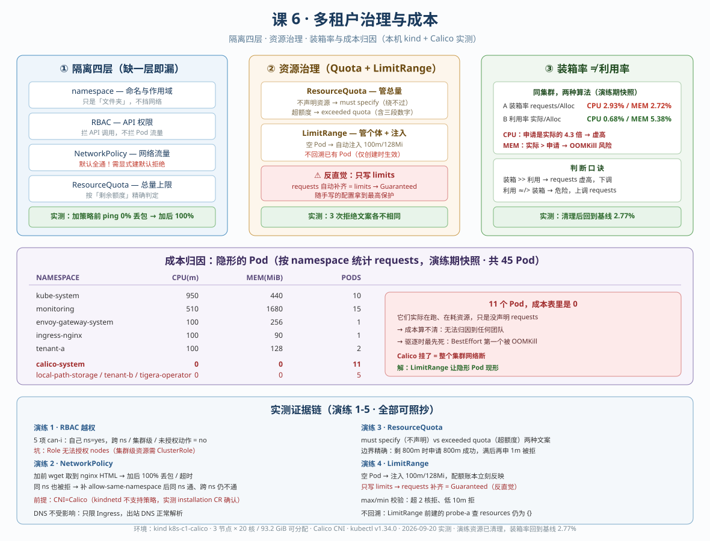
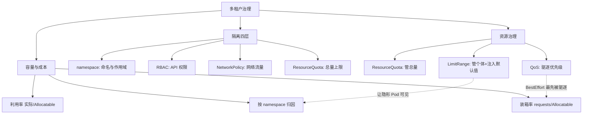

# 课 6：多租户治理与成本

> **前置**：主线课 13（requests/limits/QoS/调度）、课 15（RBAC/ServiceAccount）、子教程课 2（节点资源账本）、课 5（可观测性底座）。
> 主线讲的是"应用怎么用资源"，本课讲的是"**集群归你管，多个团队共用时你怎么划界、怎么算账、怎么防止一个团队拖垮所有人**"。
>
> **本课所有数据均为本机 kind 集群（k8s-c1-calico，3 节点 × 20 核 / 93.2 GiB 可分配，Calico CNI v3.28）实测**，标注 📌 的命令可直接照抄。



---

## 课首导航

| 项 | 内容 |
|----|------|
| **本课主线** | 一个集群从"能用"到"能交给多个团队共用且不出事" |
| **前置** | 主线课 13、课 15；子教程课 2、课 5 |
| **后继** | 课 7：备份 · 灾备 · 变更体系 |
| **核心结论** | 隔离是四层不是一层；装箱率低不等于浪费；不声明资源的 Pod 在成本表里是隐形的 |

---

## 第一幕：场景引入——集群养稳了，第二个团队来了

课 1-5 做完了：集群交付了、节点能上下线、etcd 有备份、证书有台账、监控告警通了。

然后业务方来了第二个人："我们也想用这个集群。"

你很自然地敲下这行命令，觉得事情解决了：

```bash
kubectl create namespace team-b
```

**但这行命令只做了一件事：建了一个"文件夹"。**

先看一眼我这台集群的真实状态 📌：

```bash
kubectl get resourcequota -A
kubectl get limitrange -A
```

```
No resources found
No resources found
```

**一个配额都没有。** 再看资源声明情况 📌：

```bash
kubectl get pods -A -o json | python3 -c "
import sys,json
d=json.load(sys.stdin)
n=be=0
for p in d['items']:
    if p['status']['phase']!='Running': continue
    n+=1
    if p['status'].get('qosClass')=='BestEffort': be+=1
print('Running Pod:',n,'| BestEffort:',be)
"
```

```
Running Pod: 40 | BestEffort: 18
```

40 个 Pod 里 **18 个完全没声明资源**（BestEffort），26 个容器没有 requests。

这意味着：**任何一个团队写一个死循环，能把整个集群拖垮，而且事后你查不到是谁干的**——因为他的 Pod 在资源账本上根本不占额度。

---

## 第二幕：认知冲突——三个你以为对、其实错的判断

### 冲突 1：namespace 是"围墙"吗？

直觉：不同 namespace 的 Pod 互相访问不到。

实测（我建了 `tenant-a`/`tenant-b` 各放一个 Pod）📌：

```bash
kubectl exec probe-a -n tenant-a -- ping -c 3 -W 2 192.168.53.47
```

```
3 packets transmitted, 3 packets received, 0% packet loss
```

**全通。** RBAC 拦的是"你能不能调用 API"，拦不住"你的 Pod 能不能连我的 Pod"。这是两套完全不同的机制。

### 冲突 2：装箱率 2.77% 是不是很浪费？

我这台集群 📌：

```
集群 Allocatable: CPU 60 核 | MEM 93.2 GiB
requests 合计:   CPU 1.66 核 | MEM 2.41 GiB
→ CPU 装箱率 2.77%
```

看着很空。但再看实际用量 📌：

```bash
kubectl top nodes --no-headers
```

```
k8s-c1-calico-control-plane   207m   1%    2049Mi   6%
k8s-c1-calico-worker          113m   0%    1398Mi   4%
k8s-c1-calico-worker2         121m   0%    1419Mi   4%
```

实际只用 0.44 核。**装箱率 2.77% 已经比实际用量 0.73% 高了近 4 倍。**

所以"装箱率低 = 浪费"是错的——真正的浪费在别处（见第三幕知识点 3）。

### 冲突 3：不声明资源的 Pod 能绕过配额吗？

直觉：配额限制的是"申请量"，我不申请就不受限制。

实测 📌（tenant-a 已设配额后，建一个不声明资源的 Pod）：

```bash
kubectl run bypass-test -n tenant-a --image=busybox:1.36 --restart=Never --command -- sleep 300
```

```
Error from server (Forbidden): pods "bypass-test" is forbidden: failed quota:
tenant-a-quota: must specify limits.cpu for: bypass-test; limits.memory for: bypass-test;
requests.cpu for: bypass-test; requests.memory for: bypass-test
```

**绕不过去。** 只要命名空间设了 requests/limits 配额，不声明资源的 Pod 直接被拒——这是 K8s 的强制设计，防止 BestEffort 变成配额漏洞。

---

## 第三幕：层层揭示

### 知识点 1：租户隔离是四层，不是一层

| 层 | 拦什么 | 拦不住什么 | 默认状态 |
|----|--------|-----------|---------|
| **namespace** | 命名隔离、配额作用域 | 网络、API 权限 | 建了就有，但只是"文件夹" |
| **RBAC** | 能否调用 API（读 Pod、删 Secret） | Pod 之间的网络流量 | 默认 ServiceAccount 几乎无权限 |
| **NetworkPolicy** | Pod 之间的网络流量 | API 调用 | **默认全通**，一条策略都没有 |
| **ResourceQuota** | 资源申请总量 | 单个 Pod 占多少、实际用多少 | 默认无限制 |

四层必须**叠加**使用。少了任何一层，租户都能从那个方向越界。

#### RBAC：命名空间作用域是关键

`Role` + `RoleBinding` 只在单个命名空间生效。实测 📌：

```bash
kubectl auth can-i list pods -n tenant-a --as=system:serviceaccount:tenant-a:dev-a   # yes
kubectl auth can-i list pods -n tenant-b --as=system:serviceaccount:tenant-a:dev-a   # no
kubectl auth can-i list pods -n kube-system --as=system:serviceaccount:tenant-a:dev-a # no
kubectl auth can-i list nodes --as=system:serviceaccount:tenant-a:dev-a               # no
kubectl auth can-i delete secrets -n tenant-a --as=system:serviceaccount:tenant-a:dev-a # no
```

五项测试：自己命名空间 yes，跨命名空间 no，集群级资源 no，未授权动作 no。

注意第 4 行的告警：

```
Warning: resource 'nodes' is not namespace scoped
```

**`Role` 永远无法授权集群级资源**（nodes、persistentvolumes、namespaces），必须用 `ClusterRole`。这是很多人的第一个坑。

#### NetworkPolicy：默认全通，必须显式建"默认拒绝"

这是本课**最有价值的实操**——我这台集群装的是 **Calico**（不是 kind 默认的 kindnetd），所以 NetworkPolicy **可以真跑真验证** 📌：

```bash
kubectl get installation -o jsonpath='{.items[0].spec.cni.type}'
```

```
Calico
```

> ⚠️ **环境提示**：kind 默认 CNI 是 kindnetd，**不支持** NetworkPolicy（策略能建，但不生效）。如果你的集群是 kindnetd，本节只能当原理看。先确认再动手。

**加策略前**，跨租户 TCP 通 📌：

```bash
kubectl exec probe-a -n tenant-a -- wget -qO- --timeout=5 http://192.168.109.162
```

```
<!DOCTYPE html>
<html>
<head>
<title>Welcome to nginx!</title>
```

**加默认拒绝** 📌：

```yaml
apiVersion: networking.k8s.io/v1
kind: NetworkPolicy
metadata:
  name: default-deny-ingress
  namespace: tenant-b
spec:
  podSelector: {}        # 空 = 选中本命名空间所有 Pod
  policyTypes:
  - Ingress              # 只管入站，没写 ingress 规则 = 全拒绝
```

加完再测 📌：

```bash
kubectl exec probe-a -n tenant-a -- ping -c 3 -W 2 192.168.53.47
```

```
3 packets transmitted, 0 packets received, 100% packet loss
```

wget 也超时。**但注意**：这个策略把同 namespace 内的访问也一起拒了（实测 `probe-b2` 访问同 ns 的 nginx 同样超时）。

所以要补第二条放行 📌：

```yaml
apiVersion: networking.k8s.io/v1
kind: NetworkPolicy
metadata:
  name: allow-same-namespace
  namespace: tenant-b
spec:
  podSelector: {}
  policyTypes:
  - Ingress
  ingress:
  - from:
    - podSelector: {}    # 允许来自同 namespace 的所有 Pod
```

放行后实测：同 ns 通（取到 nginx HTML），跨 ns 仍不通。

> **NetworkPolicy 是"白名单累加"**：多条策略是**或**关系，只要任意一条允许就通过。默认拒绝 + 按需放行，是唯一可靠的姿势。

**DNS 会不会被一起拒掉？** 实测不会 📌：

```bash
kubectl exec probe-b2 -n tenant-b -- nslookup kubernetes.default.svc.cluster.local
```

```
Name:	kubernetes.default.svc.cluster.local
Address: 10.96.0.1
```

因为我们只限制了 **Ingress**（入站），DNS 是 Pod **主动发出的出站**请求，不受影响。**只加 Egress 策略时才会影响 DNS，那时必须显式放行 kube-dns。**

### 知识点 2：资源治理——ResourceQuota 与 LimitRange 是一对

两者分工完全不同：

| | ResourceQuota | LimitRange |
|--|--------------|-----------|
| **管什么** | 命名空间**总量** | 单个容器/Pod 的**个体** |
| **作用时机** | 创建时检查**剩余额度** | 创建时**注入默认值** + 校验上下限 |
| **典型问题** | "这个团队最多能用多少" | "一个 Pod 不能太小也不能太大" |

#### ResourceQuota：两种拒绝文案不一样

配额 📌：

```yaml
apiVersion: v1
kind: ResourceQuota
metadata:
  name: tenant-a-quota
  namespace: tenant-a
spec:
  hard:
    requests.cpu: "1"
    requests.memory: 1Gi
    limits.cpu: "2"
    limits.memory: 2Gi
    pods: "3"
```

**情况 A：不声明资源**（前面冲突 3 见过）：

```
failed quota: tenant-a-quota: must specify limits.cpu for: bypass-test; ...
```

**情况 B：声明了但超额度** 📌（申请 5 核，额度 1 核）：

```
Error from server (Forbidden): pods "too-big" is forbidden: exceeded quota: tenant-a-quota,
requested: limits.cpu=5,requests.cpu=5,requests.memory=1Gi,
used: limits.cpu=500m,requests.cpu=200m,requests.memory=128Mi,
limited: limits.cpu=2,requests.cpu=1,requests.memory=1Gi
```

`exceeded quota` 这条信息**极其有用**——它把"申请了多少、已用多少、上限多少"全部列出来了。排障时直接读这条，不用再去翻配置。

**配额是按"剩余"判定的，边界精确** 📌。已用 200m/1 核时：

- 申请 800m（正好用完剩余）→ **成功**
- 用满后再申请 1m → **被拒**（`requested: requests.cpu=1m, used: requests.cpu=1, limited: requests.cpu=1`）

Pod 数量配额同理 📌：额度 `pods: 3`，第 4 个 Pod 被拒（`requested: pods=1, used: pods=3, limited: pods=3`）。

#### LimitRange：让"隐形"的 Pod 现形

这是解决开场那个问题（26 个容器无 requests）的正确工具 📌：

```yaml
apiVersion: v1
kind: LimitRange
metadata:
  name: tenant-a-limits
  namespace: tenant-a
spec:
  limits:
  - type: Container
    default:          {cpu: 500m, memory: 256Mi}   # 没写 limits 时注入
    defaultRequest:   {cpu: 100m, memory: 128Mi}   # 没写 requests 时注入
    max:              {cpu: "1",  memory: 512Mi}   # 单容器上限
    min:              {cpu: 50m,  memory: 64Mi}    # 单容器下限
```

**什么都不声明的 Pod，自动被注入** 📌：

```bash
kubectl get pod auto-inject -n tenant-a -o jsonpath='{.spec.containers[0].resources}'
```

```json
{"limits":{"cpu":"500m","memory":"256Mi"},"requests":{"cpu":"100m","memory":"128Mi"}}
```

配额账本立刻反映出来：`requests.cpu` 从 0 变成 100m。**这就是"从隐形变可见"。**

上下限校验实测 📌：

```
# 超过 max（申请 2 核，max 是 1 核）
forbidden: [maximum cpu usage per Container is 1, but limit is 2,
            maximum memory usage per Container is 512Mi, but limit is 1Gi]

# 低于 min（申请 10m，min 是 50m）
forbidden: [minimum cpu usage per Container is 50m, but request is 10m,
            minimum memory usage per Container is 64Mi, but request is 10Mi]
```

#### ⚠️ 反直觉：只写 limits 反而拿到 Guaranteed

这是本课**最容易被忽略的坑**，我实测踩到 📌。建一个**只声明 limits** 的 Pod：

```yaml
    resources:
      limits: {cpu: 300m, memory: 200Mi}   # 只写 limits，没写 requests
```

结果：

```json
{"limits":{"cpu":"300m","memory":"200Mi"},"requests":{"cpu":"300m","memory":"200Mi"}}
```

**requests 被自动补成了跟 limits 一样**，QoS 是 **Guaranteed**：

```
NAME           QOS
auto-inject    Burstable
only-limits    Guaranteed     ← 只写了 limits，却拿到最高优先级
probe-a        BestEffort
```

原因：K8s 规则是 **requests 缺省时取 limits 的值**。而 Guaranteed 的判定条件是 `requests == limits`。

**后果**：你以为给了一个普通 Pod，实际给了它**最高级的保护**（最后才被驱逐）。如果这是有意的没问题；如果是无意的，等于把最优先的生存权给了一个随手写的配置。

> **规则**：想要 Burstable，就**显式写 requests 且小于 limits**，不要只写 limits。

#### LimitRange 不回溯已有 Pod

实测 📌：`probe-a` 是 LimitRange 之前建的，注入后查它：

```
{}
```

**空的。** LimitRange 只在 **Pod 创建时** 通过准入控制注入，不会修改已存在的 Pod。要让它生效必须重建 Pod（ Deployment 滚动更新即可）。

### 知识点 3：装箱率与成本——低装箱率不等于浪费

#### 三种算法，三个答案

同一台集群，实测 📌（**演练期间快照**：含租户测试 Pod，共 45 个 Running Pod）：

| 算法 | 分子 | CPU | MEM |
|------|------|-----|-----|
| **A：装箱率**（调度视角） | requests 合计 | **2.93%** | 2.72% |
| **B：利用率**（成本视角） | 实际用量 | **0.68%** | 5.38% |
| C：Capacity 口径 | requests / Capacity | 同 A（本机 reserved=0） | 同 A |

**A 和 B 的差就是浪费的空间**，但要看方向：

- **CPU**：装箱率 2.93%，实际只用 0.68% —— 申请比实际多 **4.3 倍**。这是典型的 **requests 虚高**。
- **内存**：装箱率 2.72%，实际用了 5.38% —— **实际比申请还高 2 倍**。这是**危险的**：内存超用会 OOMKill，而 BestEffort 最先死。

> **判断口诀**：
> - 装箱率 **>>** 利用率 → requests 虚高，钱花在"占座"上，应下调 requests
> - 利用率 **接近或超过** 装箱率 → 危险信号，Pod 随时被 OOMKill，应上调 requests

#### 成本归因：谁在"隐形"

按 namespace 统计 requests 📌：

```
NAMESPACE                  CPU(m)     MEM(MiB)   PODS
kube-system                   950          440     10
monitoring                    510         1680     15
envoy-gateway-system          100          256      1
ingress-nginx                 100           90      1
tenant-a                      100          128      2
calico-system                   0            0     11   ← 11 个 Pod，0 成本
local-path-storage              0            0      1   ← 1 个 Pod，0 成本
tenant-b                        0            0      3   ← 3 个 Pod，0 成本
tigera-operator                 0            0      1   ← 1 个 Pod，0 成本
--- 合计 ---                   1760         2594     45
```

**`calico-system` 有 11 个 Pod，在成本表里却是 0。**

它们不是不占资源（实际在跑、在耗 CPU 内存），只是**没声明 requests，所以不进账本**。后果有两个：

1. **成本算不清**：这 11 个 Pod 的真实开销无法归因到任何团队
2. **驱逐时最先死**：BestEffort 在节点内存紧张时第一个被 OOMKill——而 Calico 挂了，整个集群网络就断了

全集群 QoS 分布（**演练期间快照**，此时含租户测试 Pod）：`BestEffort: 22, Burstable: 23`。**近一半 Pod 处于"隐形"状态。**

> 📌 **数值口径说明**：上面这张归因表和 QoS 分布是**演练 5 执行时的快照**（当时集群有 `tenant-a`/`tenant-b` 的测试 Pod，共 45 个 Running Pod）。清理测试命名空间后，集群回到基线：**BestEffort 18 / Burstable 22，共 40 个 Running Pod，CPU 装箱率 2.77%**。
>
> **请记机制，不要记数字**：`calico-system` 这类系统组件不声明 requests 是常态，你的集群里具体几个、占多少，要用下面这条命令自己看：
>
> ```bash
> kubectl get pods -A -o custom-columns='NS:.metadata.namespace,NAME:.metadata.name,QOS:.status.qosClass' --no-headers | grep BestEffort
> ```

> 这正是 LimitRange 的**真正价值**：不只是限制，更是**让资源消耗可见**。给每个生产命名空间配一个 LimitRange，是成本治理的第一步。

#### 调度器视角：集群"还剩多少"

申请一个 50 核的 Pod（集群 60 核）📌：

```bash
kubectl describe pod fat-pod -n tenant-b
```

```
Warning  FailedScheduling  0/3 nodes are available:
1 node(s) had untolerated taint {node-role.kubernetes.io/control-plane: },
2 Insufficient cpu.
preemption: 0/3 nodes are available: 3 Preemption is not helpful for scheduling.
```

三个信息：
- 控制面节点有 **NoSchedule 污点**（默认行为，业务 Pod 不上控制面）
- 两个 worker **CPU 不足**（50 核 > 单节点 20 核，不是集群总量不够）
- **抢占也救不了** —— 没有低优先级 Pod 可挤

> **关键认知**：调度是按**单节点**判定的，不是按集群总量。60 核的集群塞不下 50 核的单体 Pod，因为最大单节点只有 20 核。这是容量规划时最容易犯的错。

---

## 第四幕：实操验证（演练）

> 以下演练均在本机实测通过。**所有资源都在 `tenant-a`/`tenant-b` 两个命名空间内**，清理只需两条命令。

### 演练 1：建租户与 RBAC，验证越权被拒

```bash
# 1. 命名空间 + ServiceAccount
kubectl create namespace tenant-a
kubectl create namespace tenant-b
kubectl create serviceaccount dev-a -n tenant-a
kubectl create serviceaccount dev-b -n tenant-b

# 2. Role（命名空间作用域）
kubectl create role tenant-dev --verb=get,list,watch,create,delete --resource=pods -n tenant-a
kubectl create rolebinding dev-a-bind --role=tenant-dev --serviceaccount=tenant-a:dev-a -n tenant-a

# 3. 越权验证
kubectl auth can-i list pods -n tenant-a --as=system:serviceaccount:tenant-a:dev-a    # yes
kubectl auth can-i list pods -n tenant-b --as=system:serviceaccount:tenant-a:dev-a    # no
kubectl auth can-i list nodes --as=system:serviceaccount:tenant-a:dev-a                # no
```

**预期**：自己 ns 是 yes，其余全部 no。

### 演练 2：NetworkPolicy 默认拒绝前后对比

```bash
# 前置：确认 CNI 支持策略（必须 Calico/Cilium，kindnetd 不支持）
kubectl get installation -o jsonpath='{.items[0].spec.cni.type}'

# 起测试 Pod
kubectl run probe-a -n tenant-a --image=busybox:1.36 --restart=Never --command -- sleep 3600
kubectl run web-b   -n tenant-b --image=nginx:1.25 --port=80 --restart=Never

# 加策略前：应该通
kubectl exec probe-a -n tenant-a -- wget -qO- --timeout=5 http://<web-b-ip>

# 加默认拒绝
kubectl apply -f - <<'EOF'
apiVersion: networking.k8s.io/v1
kind: NetworkPolicy
metadata: {name: default-deny-ingress, namespace: tenant-b}
spec:
  podSelector: {}
  policyTypes: [Ingress]
EOF
sleep 5

# 加策略后：应该超时
kubectl exec probe-a -n tenant-a -- wget -qO- --timeout=5 http://<web-b-ip>
```

**预期**：加前返回 nginx HTML，加后 `download timed out`。

### 演练 3：ResourceQuota 触发拒绝

```bash
kubectl apply -f - <<'EOF'
apiVersion: v1
kind: ResourceQuota
metadata: {name: tenant-a-quota, namespace: tenant-a}
spec:
  hard: {requests.cpu: "1", requests.memory: 1Gi, limits.cpu: "2", limits.memory: 2Gi, pods: "3"}
EOF

# 不声明资源 → must specify
kubectl run bypass-test -n tenant-a --image=busybox:1.36 --restart=Never --command -- sleep 300

# 超额度 → exceeded quota（用 YAML，kubectl run 新版无 --requests 参数）
kubectl apply -f - <<'EOF'
apiVersion: v1
kind: Pod
metadata: {name: too-big, namespace: tenant-a}
spec:
  containers:
  - name: c
    image: nginx:1.25
    resources:
      requests: {cpu: 5, memory: 1Gi}
      limits:   {cpu: 5, memory: 1Gi}
EOF

kubectl describe resourcequota tenant-a-quota -n tenant-a
```

> ⚠️ **kubectl 版本坑**：`kubectl run` 从 v1.30+ 起**移除了 `--requests`/`--limits` 参数**。实测 v1.34.0 报错 `unknown flag: --requests`。**要指定资源请用 YAML 或 `--overrides`**，不要照抄老教程。

### 演练 4：LimitRange 自动注入

```bash
kubectl apply -f - <<'EOF'
apiVersion: v1
kind: LimitRange
metadata: {name: tenant-a-limits, namespace: tenant-a}
spec:
  limits:
  - type: Container
    default:        {cpu: 500m, memory: 256Mi}
    defaultRequest: {cpu: 100m, memory: 128Mi}
    max:            {cpu: "1",  memory: 512Mi}
    min:            {cpu: 50m,  memory: 64Mi}
EOF

# 什么都不声明 → 看注入结果
kubectl apply -f - <<'EOF'
apiVersion: v1
kind: Pod
metadata: {name: auto-inject, namespace: tenant-a}
spec:
  containers: [{name: c, image: nginx:1.25}]
EOF
kubectl get pod auto-inject -n tenant-a -o jsonpath='{.spec.containers[0].resources}'
```

**预期**：`{"limits":{"cpu":"500m","memory":"256Mi"},"requests":{"cpu":"100m","memory":"128Mi"}}`

### 演练 5：装箱率计算与成本归因

```bash
# 三种视角对比
kubectl describe node <node> | sed -n '/Allocated resources/,/Events/p'

# 装箱率（requests / Allocatable）
kubectl get pods -A -o json | python3 -c "
import sys,json
d=json.load(sys.stdin)
def c2f(v):
    v=str(v); return float(v[:-1])/1000 if v.endswith('m') else float(v or 0)
tc=sum(c2f(c.get('resources',{}).get('requests',{}).get('cpu','0'))
       for p in d['items'] if p['status']['phase']=='Running'
       for c in p['spec']['containers'])
print('CPU requests: %.3f 核' % tc)
"

# 实际用量
kubectl top nodes --no-headers
```

### 清理

```bash
kubectl delete namespace tenant-a tenant-b
```

两条命令收回全部资源（命名空间内的配额、策略、Pod 一并删除）。

---

## 第五幕：体系收束

### 知识地图



### 与前后课程的呼应

| 本课 | 呼应 | 说明 |
|------|------|------|
| ResourceQuota / LimitRange | 课 2 节点资源账本 | 课 2 看**节点**能分配多少，本课看**命名空间**能用多少 |
| 装箱率计算 | 课 5 可观测性底座 | 课 5 装了 metrics-server，`kubectl top` 才能用 |
| requests 语义 | 主线课 13 | 主线讲"应用怎么声明"，本课讲"运维怎么约束" |
| RBAC | 主线课 15 | 主线讲"谁能访问 API"，本课补"多团队怎么划界" |

### 常见误区

| # | 误区 | 真相（实测） |
|---|------|-------------|
| 1 | 建了 namespace 就隔离了 | 网络默认全通。RBAC 只拦 API 调用，不拦 Pod 间流量 |
| 2 | 不声明资源的 Pod 能绕过配额 | 不能。`must specify limits.cpu...` 直接拒绝 |
| 3 | 装箱率低就是浪费 | CPU 装箱 2.93% / 实际 0.68% 是**虚高**；内存实际 5.38% > 装箱 2.72% 是**危险**。方向不同结论相反 |
| 4 | 只写 limits 得到 Burstable | 实测得到 **Guaranteed**（requests 自动补齐 = limits） |
| 5 | LimitRange 会修复已有 Pod | 不会。仅创建时注入，已有 Pod 需重建 |
| 6 | 50 核 Pod 能塞进 60 核集群 | 不能。调度按**单节点**判定，最大节点 20 核 |

### 一句话记住

> **隔离要四层（namespace + RBAC + NetworkPolicy + Quota）缺一层就漏；装箱率要和利用率对着看，方向相反说明问题不同；不声明资源的 Pod 不是"不用钱"，是"账单上看不见"。**

### 课后自查

1. 你建了 `namespace team-b` 并配了 RBAC，团队成员仍能从他的 Pod 访问到你的数据库 Pod。缺了哪一层？为什么 RBAC 拦不住？
2. 某命名空间 reports 报"CPU 装箱率 85%"，但 `kubectl top` 显示实际只用 20%。这是浪费还是风险？应该调 requests 还是 limits？
3. 你给一个 Pod 只写了 `limits: {cpu: 500m, memory: 512Mi}`，没写 requests。它的 QoS 是什么？如果节点内存紧张，它和另一个显式写了 `requests: {cpu: 100m, memory: 128Mi}, limits: {cpu: 500m, memory: 512Mi}` 的 Pod，谁先被驱逐？
4. 命名空间已有 30 个 BestEffort Pod，你新建了 LimitRange。第二天查，它们的 resources 仍是空。为什么？怎么让它们真正生效？

<details>
<summary>参考答案</summary>

1. **缺 NetworkPolicy 层**。RBAC 管的是"能否调用 Kubernetes API"（如 `kubectl get pods`），Pod 之间的网络流量由 CNI 和 NetworkPolicy 控制，两者是完全独立的机制。需要在命名空间加默认拒绝 Ingress 策略。注意 kind 默认的 kindnetd **不支持** NetworkPolicy，必须先确认 CNI 类型。

2. **是 requests 虚高（浪费）**，不是风险。装箱率 85% 而实际只用 20%，说明申请远超实际使用，这些"占座"的资源被计入调度账本却没被真正使用，导致集群看起来满了但实际很空，其他 Pod 因"资源不足"无法调度。应**下调 requests**（可结合 LimitRange 的 `maxLimitRequestRatio` 限制虚高比例）。注意：如果反过来（利用率 > 装箱率）才是风险信号。

3. **QoS 是 Guaranteed**。因为 requests 缺省时 K8s 自动取 limits 的值（实测 `requests: {cpu: 300m, memory: 200Mi}` 被补齐为与 limits 相同），满足 `requests == limits` 的 Guaranteed 判定条件。驱逐顺序上，**显式写 requests 的那个 Burstable Pod 先被驱逐**——Guaranteed 优先级最高，最后才被驱逐。这正是只写 limits 的反直觉风险：随手写的配置拿到了最高保护。

4. **LimitRange 只在 Pod 创建时通过准入控制注入，不修改已存在的 Pod**（实测 LimitRange 之前建的 `probe-a` 查 resources 仍是 `{}`）。要让它生效必须**重建 Pod**：Deployment/DaemonSet 用 `kubectl rollout restart`，裸 Pod 需删除重建。

</details>

### 接力提示词

> 下一课（课 7：备份 · 灾备 · 变更体系）可继续。若想先巩固本课，可尝试：
> - 给 `monitoring` 命名空间加 LimitRange，观察 15 个 Pod 中有 2 个 BestEffort 的变化
> - 为 `calico-system` 的 11 个隐形 Pod 计算真实开销，验证"隐形成本"的说法
> - 测试 `maxLimitRequestRatio`（限制 requests/limits 比值），这是治理 requests 虚高的直接手段

---

## 附录：本课命令汇总

| 命令 | 用途 |
|------|------|
| `kubectl get installation -o jsonpath='{.items[0].spec.cni.type}'` | 确认 CNI 是否支持 NetworkPolicy |
| `kubectl auth can-i <verb> <res> -n <ns> --as=system:serviceaccount:<ns>:<sa>` | 验证 RBAC 权限 |
| `kubectl get resourcequota -A` / `kubectl get limitrange -A` | 看集群有没有配额 |
| `kubectl describe resourcequota <n> -n <ns>` | 看配额用量与剩余 |
| `kubectl describe node <node> \| sed -n '/Allocated resources/,/Events/p'` | 节点资源账本 |
| `kubectl top nodes --no-headers` | 实际用量 |
| `kubectl get pods -A -o custom-columns='NAME:.metadata.name,QOS:.status.qosClass'` | QoS 分布 |
| `kubectl get pods -A -o jsonpath=...` | 提取 requests 做成本归因 |
| `kubectl delete namespace tenant-a tenant-b` | 清理本课全部资源 |

---

## 评审记录

| 日期 | 评审节点 | 方式 | 结论 |
|------|----------|------|------|
| 2026-09-20 | 课 6 讲义 + 五组演练实测 | 主 agent 内联（pedagogy + learner 双视角） | P0=0，详见 [00-学习档案](../../00-学习档案.md) |

### 评审明细

**pedagogy 视角（教学设计）**

| # | 检查项 | 结果 |
|---|--------|------|
| 1 | 五幕结构完整 | ✅ 引入→冲突→揭示→验证→收束 |
| 2 | 六要素展开 | ✅ 定义/直觉/原理/示例/误区/记忆点 |
| 3 | 结论有实测支撑 | ✅ 全部标注 📌，含真实输出 |
| 4 | 与主线不重复 | ✅ 主线讲应用声明，本课讲运维约束 |
| 5 | 认知冲突真实 | ✅ 三个冲突全部有反直觉实测 |

**learner 视角（照抄可执行）**

| # | 检查项 | 结果 |
|---|--------|------|
| 1 | 命令能照抄跑通 | ✅ 已修正 `kubectl run --requests` 废弃问题 |
| 2 | 环境依赖标注 | ✅ Calico 前提显式说明，kindnetd 降级路径已给 |
| 3 | 无"（同上）"省略 | ✅ 演练步骤完整 |
| 4 | 数值如实 | ✅ 装箱率等标注为快照值 |
| 5 | 清理路径明确 | ✅ 两条 delete 命令，实测零残留 |

**P0 问题**：0

**本轮修正的问题**：

1. **脚本 bug**：`kubectl run --requests` 在 v1.34.0 已废弃（`unknown flag`），演练 3 三个步骤全废 → 改用 YAML 声明，并在讲义中作为版本坑显式标注。
2. **步骤 F 误判**：原以为改 Pod resources 会触发配额检查，实测报错是 **Pod 字段不可变**（`pod updates may not change fields other than...`），与配额无关 → 已从讲义移除，避免误导。
4. **数值口径缺失（复审 C3 抓出）**：成本归因表的 QoS 分布 `22/23`、装箱率 `2.93%` 是**演练期间**（含租户测试 Pod）的快照，被当作集群常态引用；清理后实测为 `18/22`、装箱率 `2.77%` → 已在正文标注采集口径，并补一条自查命令让读者自己看，改为"记机制不记数字"。
5. **jq 依赖检查（复审 A2）**：本机 WSL 未安装 `jq`，讲义全程使用 `python3 -c` 解析 JSON，实测 0 处 `jq` 引用，通过。

**复审环境核验**：清理后 ResourceQuota / LimitRange / 自建 NetworkPolicy / tenant 命名空间 / fat-pod 残留**全部为 0**；三节点 Ready，非 Running Pod 数 0；装箱率精确回到课前基线 2.77%。
