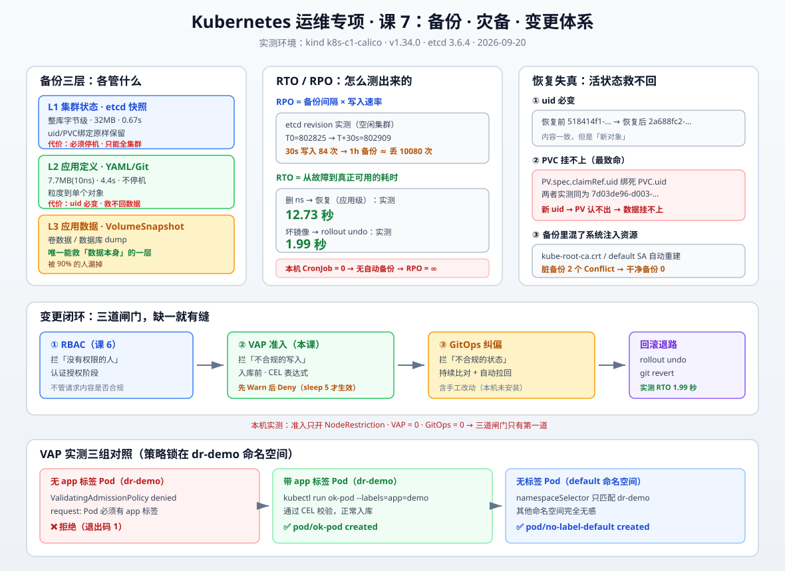
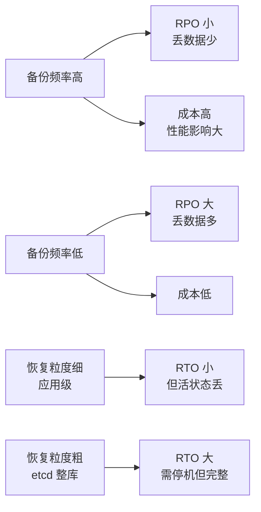

# 课 7：备份 · 灾备 · 变更体系

> 📍 所属：子教程[《运维专项》](../overview.md)（第 7 课 · 收尾课 · 集群运维 / SRE 视角）
> 📖 故事章节：**救得回** —— 前面六课把集群交付了、养住了，这一课回答最后一问：**出事之后，你能把它变回来吗**
> 🧭 上一课：[课 6《多租户治理与成本》](lesson-06-多租户治理与成本.md) ｜ 下一课：（子教程完结 → [实战经验](../../08-实战经验.md)）
> ⚙️ 实操环境：WSL Ubuntu 24.04 · kind 集群 `k8s-c1-calico`（3 节点） · k8s v1.34.0 · etcd 3.6.4

## 🎯 本课目标

学完本课，你应当能够：

- 说清 **etcd 快照** 与 **应用级备份** 各自备份了什么、丢了什么，以及**为什么两个都要**
- 真跑一遍**恢复演练**，测出 **RTO**，并指出应用级恢复必然丢失的"活状态"
- 算出你的 **RPO**（用 etcd revision 实测外推），知道"多久备份一次"这个数是怎么来的
- 用 **ValidatingAdmissionPolicy** 把运维规范变成**集群强制的**，而不是靠人自觉
- 讲清 **变更 → 观测 → 回滚** 的闭环，以及 **GitOps 到底解决什么问题**

> ⚠️ **本课实操边界（重要）**
>
> - **✅ 能在本机实测**：应用级导出与体量对比、etcd 快照真跑（Pod 内执行）、删命名空间→恢复→计时 RTO、VAP 拦截真验（Deny / Warn 两种动作）、`rollout undo` 回滚实测、etcd revision 增长速率、managedFields 溯源
> - **⚠️ 无法真验**：**etcd 整库 restore**（需停机，会中断集群）、**VolumeSnapshot 跨集群恢复**（需真实 CSI 与对象存储）、**Argo CD / Flux 安装与同步**（会改集群组件）、**跨集群灾备切换**（需第二个集群）
> - 凡涉及**停机 restore、装 GitOps 组件、跨集群切换**的，本课**只给命令与判断方法，不实际执行**

---

## 第一幕：起源与场景引入 —— "我们每天都有备份"

### 场景

审计问运维："你们的集群怎么备份的？"

运维答："**每天自动备份一次 etcd**，很稳。"

审计又问："**恢复过吗？**"

运维："……没有。"

**这是灾备领域最经典的失败模式：备份从没被恢复验证过，所以没人知道它能不能用。**

### 一个更现实的版本

某天真的出事了，运维信心满满地执行恢复，然后发现：

```text
1. 备份文件是有的        ✅
2. 备份文件能读          ✅
3. 备份文件是 3 个月前的 ❌  ← 备份任务早就挂了，没人告警
```

或者另一种：

```text
1. 备份文件是昨晚的      ✅
2. 恢复执行成功          ✅
3. 应用起来了，但数据挂不上 ❌  ← PVC 的 uid 变了，PV 认不出来
```

> 🔑 **备份的难点从来不是"能不能备份"，而是"恢复出来是不是你要的那个东西"。**

### 顺带一个更隐蔽的问题

就算恢复完美，你还得回答：**昨天下午 3 点那次错误变更，是谁做的、改了什么、能不能退回去？**

- 没有准入控制 → 任何人都能 `kubectl delete ns production`
- 没有变更记录 → 出事后不知道改了什么
- 没有 GitOps → 没有"应该长什么样"的基线，回滚全靠猜

**这一课把这三件事串起来：备份（救得回）、准入（改不坏）、变更（退得掉）。**

---

## 第二幕：认知冲突 —— 两个"看起来都对"的答案

### 冲突：备份到底该用 etcd 快照，还是导出 YAML？

**答案 A（etcd 派）**：etcd 是唯一真相源，快照整库字节级还原，最完整，当然用 etcd。

**答案 B（YAML 派）**：etcd 恢复要停机、要全集群回滚，太重了；导出 YAML 想恢复哪个恢复哪个，灵活。

**两个都对，但都不完整。** 先看实测数据，再下结论。

### 实测：两种备份的体量与内容差异

```bash
# 应用级导出（10 个命名空间）
kubectl get all,configmap,secret,... -n <ns> -o yaml > backup.yaml

# etcd 快照（必须在 etcd Pod 内执行）
kubectl exec -n kube-system etcd-<node> -- etcdctl \
  --endpoints=https://127.0.0.1:2379 \
  --cacert=/etc/kubernetes/pki/etcd/ca.crt \
  --cert=/etc/kubernetes/pki/etcd/server.crt \
  --key=/etc/kubernetes/pki/etcd/server.key \
  snapshot save /var/lib/etcd/snap.db
```

本机实测（**2026-09-20 采集**）：

| 对比项 | 应用级导出 | etcd 快照 |
|--------|-----------|----------|
| 体量 | **7.7 MB**（10 个 ns） | **32 MB**（整库） |
| 耗时 | 4.4 秒 | 0.67 秒 |
| 粒度 | 单个对象 / 单个 ns | **只能整库** |
| 是否停机 | 否 | **是**（restore 需停控制面） |
| 恢复后 uid | **变**（新对象） | 原样保留 |
| PVC 绑定 | 救不回 | 原样保留 |
| Event / Lease | 无 | **有**（819 key 中含 3 节点 / 9 Lease） |

> 📊 **快照 32M vs 导出 7.7M，差 4.2 倍** —— 多出来的就是那些"集群自维护状态"。

### 关键差别：etcd 里有、YAML 里没有的"活状态"

```text
etcd 中 819 个 key，按资源类型分布（实测前 18）：
   94 clusterroles        58 configmaps      34 secrets
   80 clusterrolebindings 54 services        34 apiregistration.k8s.io
   70 serviceaccounts     50 monitoring.coreos.com
   62 apiextensions(CRD)  41 crd.projectcalico.org
   ...
   leases: 9      minions(节点): 3
```

**Lease（节点心跳、leader 选举）和 minions（节点对象）是集群自己写的**，应用级备份不带——这没问题，因为重建集群时它们会自动重新生成。

**真正麻烦的是这一类**：

```bash
kubectl get pvc storage-loki-0 -n monitoring -o jsonpath='{.metadata.uid}'
# 7d03de96-d003-41d2-a9c9-96d08499994f

kubectl get pv pvc-7d03de96-... -o jsonpath='{.spec.claimRef.uid}'
# 7d03de96-d003-41d2-a9c9-96d08499994f     ← 一模一样
```

> 🔑 **PV 的 `claimRef.uid` 绑死了 PVC 的 uid。** 应用级恢复会生成新 uid → **PV 认不出这个 PVC** → 数据还在盘上，但**挂不上**。

---

## 第三幕：层层揭示



## 知识点 1：备份分层 —— 三层各管什么

| 层级 | 备份对象 | 工具 | 解决什么 | 救不了什么 |
|------|---------|------|---------|-----------|
| **L1 集群状态** | etcd 整库 | `etcdctl snapshot save` | 控制面全挂、误删 ns、etcd 损坏 | 异地容灾（单集群快照救不了机房） |
| **L2 应用定义** | YAML / Helm values | `kubectl get -o yaml`、Git | 单个对象误删、配置回滚 | **PVC 数据、uid 类活状态** |
| **L3 应用数据** | 卷数据 | **VolumeSnapshot**、数据库 dump | 数据损坏、误删库 | 只有它才能救"数据"本身 |

> 🔑 **L1 和 L3 才是真备份，L2 是"可重现性"不是"备份"。**
>
> 很多人把 Git 里的 YAML 当备份——但 YAML 能重建出**一个长得一样的应用**，重建不出**原来那个应用的数据**。

### 本机现状：三层全空

```text
CronJob 数量（全集群）: 0        ← 没有任何自动备份任务
```

**这就是"每天备份"口头承诺的真相：没有 CronJob，就没有自动备份。**

---

## 知识点 2：恢复演练 —— RTO 实测与"活状态"失真

### 真删真恢复（本机演练）

```bash
# 1. 备份
kubectl get all,configmap,secret,serviceaccount -n dr-demo -o yaml > /tmp/dr-backup.yaml

# 2. 故障注入：删掉整个命名空间
kubectl delete ns dr-demo

# 3. 恢复并计时
time ( kubectl create ns dr-demo && kubectl apply -f /tmp/dr-backup.yaml )
```

**实测 RTO：12.73 秒**（从删到 Deployment Available，2 副本 nginx）

### 恢复保真度核验：什么回来了，什么变了

| 项目 | 恢复前 | 恢复后 | 结论 |
|------|--------|--------|------|
| ConfigMap 内容 | `env=production` | `env=production` | ✅ 内容一致 |
| Secret 内容 | `s3cr3t-dr-demo` | `s3cr3t-dr-demo` | ✅ 一致 |
| **ConfigMap uid** | `518414f1-...` | `2a688fc2-...` | ❌ **变了** |
| **Secret uid** | `b861eaec-...` | `a4b10fb0-...` | ❌ **变了** |
| Deployment | 2/2 Running | 2/2 Running | ✅ 可用 |

> 🔑 **uid 一定变** —— 它由 apiserver 生成，不可指定。这意味着恢复出来的对象是**"一个内容相同的新对象"**，不是原来的那个。

### 演练中踩到的真问题：备份里混了系统注入资源

恢复时报错了：

```text
Error from server (Conflict): Operation cannot be fulfilled on configmaps "kube-root-ca.crt":
  the object has been modified; please apply your changes to the latest version and try again
Error from server (Conflict): ... serviceaccounts "default" ...
```

**根因**：`kube-root-ca.crt` 和 `default` ServiceAccount 是 **apiserver 创建命名空间时自动注入**的。备份时把它们一起导出了，恢复时命名空间已重建、它们已自动存在 → 两边抢着创建 → Conflict。

**验证**：删掉 ns 重建，这两个资源**自动回来**（无需备份）。

**正确做法——备份时剔除系统注入资源 + 状态字段**：

```bash
kubectl get cm app-config -n dr-demo -o json | python3 -c "
import sys,json
d=json.load(sys.stdin)
for k in ['uid','resourceVersion','creationTimestamp','managedFields','selfLink','generation']:
    d['metadata'].pop(k,None)
d['metadata'].pop('annotations',None)
d.pop('status',None)
print(json.dumps(d))
" > clean-cm.json
```

**对比实测**：

| 备份方式 | 恢复结果 |
|---------|---------|
| 脏备份（含 `kube-root-ca.crt` / `default` SA） | **2 个 Conflict** |
| 干净备份（剔除系统注入 + 状态字段） | **0 Conflict**，`configmap/app-config created` |

> ⚠️ **演练教训（本课真实踩坑）**：第一次做这个对比时用了 `kubectl delete ns --wait=false`，命名空间还没真删完就重建，导致"干净恢复"输出 `unchanged`——**对象压根没被删掉，对比不成立**。
> 必须 `kubectl delete ns <ns>`（默认同步等待）并轮询确认 `NotFound` 后，才算真删。

### 反面：etcd 恢复没有这些问题，但代价更大

etcd 快照是**整库字节级还原**，uid / resourceVersion / clusterIP / PVC 绑定**全部原样回来**。

代价：

1. **必须停机**（停控制面 → 移走数据目录 → restore → 重启）
2. **只能全集群回滚**，不能"只恢复一个命名空间"
3. **快照之后的变更全丢**（这就是 RPO）

---

## 知识点 3：RPO —— "多久备份一次"这个数怎么来的

RPO（Recovery Point Objective）= **故障时你最多丢多少数据**。

**空口说"1 小时"没有意义，要看实际写入速率。** 用 etcd revision 实测：

```bash
ETCDPOD=$(kubectl get pod -n kube-system -l component=etcd -o jsonpath='{.items[0].metadata.name}')
kubectl exec -n kube-system $ETCDPOD -- etcdctl --endpoints=https://127.0.0.1:2379 \
  --cacert=/etc/kubernetes/pki/etcd/ca.crt --cert=/etc/kubernetes/pki/etcd/server.crt \
  --key=/etc/kubernetes/pki/etcd/server.key endpoint status -w fields | grep Revision
```

本机实测（**2026-09-20 采集，空闲集群**）：

```text
T0      revision: 802825
T+30s   revision: 802909
30 秒新增写入: 84 次
→ 按此速率外推，1 小时备份一次 ≈ RPO 窗口内丢 10080 次写入
```

> 🔑 **revision 差值就是 RPO 窗口内的写入量。** 备份间隔 × 写入速率 = 你要承担的数据丢失量。
>
> 注意：本机是**空闲集群**（84 次/30 秒主要是控制器心跳）。生产集群写入量大几个数量级，RPO 窗口的代价也大得多。**记机制，不要记这个数字。**

### 无备份的 RPO 是无穷大

集群当前 CronJob = 0 → **没有备份** → **RPO = ∞**（全丢）。

---

## 知识点 4：准入控制 —— 把规范变成强制

### 现状：集群几乎"不设防"

```bash
kubectl exec k8s-c1-calico-control-plane -- cat /etc/kubernetes/manifests/kube-apiserver.yaml | grep admission
# --enable-admission-plugins=NodeRestriction       ← 只有这一个
```

`NodeRestriction` 只管"kubelet 只能改自己节点的资源"，**不管任何业务规范**。

### ValidatingAdmissionPolicy（VAP）：v1.34 已 GA，无需 Webhook

**VAP 是 K8s 原生的声明式准入**——不用部署 Webhook 服务，写 CEL 表达式即可。

先确认环境支持（本机 v1.34.0，API 已注册）：

```bash
kubectl api-resources --api-group=admissionregistration.k8s.io
# validatingadmissionpolicies        admissionregistration.k8s.io/v1
# validatingadmissionpolicybindings  admissionregistration.k8s.io/v1
```

**建立一个策略：Pod 必须有 app 标签**：

```yaml
apiVersion: admissionregistration.k8s.io/v1
kind: ValidatingAdmissionPolicy
metadata:
  name: require-app-label
spec:
  failurePolicy: Fail
  matchConstraints:
    resourceRules:
    - apiGroups:   [""]
      apiVersions: ["v1"]
      operations:  ["CREATE", "UPDATE"]
      resources:   ["pods"]
  validations:
  - expression: "has(object.metadata.labels) && 'app' in object.metadata.labels"
    message: "Pod 必须有 app 标签（运维规范：便于监控与成本归属）"
    reason: Invalid
---
apiVersion: admissionregistration.k8s.io/v1
kind: ValidatingAdmissionPolicyBinding
metadata:
  name: require-app-label-binding
spec:
  policyName: require-app-label
  validationActions: [Deny]
  matchResources:
    namespaceSelector:
      matchLabels:
        kubernetes.io/metadata.name: dr-demo   # ← 只在 dr-demo 生效
```

### 实测三组对照

| 场景 | 命令 | 结果 |
|------|------|------|
| dr-demo 内建**无标签** Pod | `kubectl run no-label-pod --image=nginx:alpine -n dr-demo` | ❌ **拒绝**（退出码 1） |
| dr-demo 内建**带标签** Pod | `kubectl run ok-pod --image=nginx:alpine -n dr-demo --labels=app=demo` | ✅ 创建成功 |
| **default** ns 建无标签 Pod | `kubectl run no-label-default --image=nginx:alpine -n default` | ✅ 创建成功 |

```text
The pods "no-label-pod" is invalid: : ValidatingAdmissionPolicy 'require-app-label'
with binding 'require-app-label-binding' denied request: Pod 必须有 app 标签
```

> 🔑 **`namespaceSelector` 把策略锁死在指定命名空间**，其他命名空间完全无感——这是**灰度推行规范**的正确姿势：先在一个 ns 试，稳了再放开。

### Deny vs Warn：先警告再拦截

把 `validationActions` 改成 `[Warn]`：

```text
Warning: Validation failed for ValidatingAdmissionPolicy 'require-app-label' ...
pod/warn-test-2 created          ← 警告了，但创建成功
```

> 🔑 **上线新策略的正确顺序：先 Warn 跑一两周**（看 warning 有多少、会不会误伤），**再改成 Deny**。
>
> ⚠️ **实测注意**：改完 `validationActions` 后**不会立即生效**，本机 sleep 5 秒后才观察到行为变化。第一次测 Warn 时因为没等，看到的是旧行为（仍拒绝），一度误判"Warn 不生效"。**改策略后要等几秒再验证。**

### 常见的准入规范（VAP 适合管的）

| 规范 | CEL 表达式要点 |
|------|--------------|
| 必须有 app / team 标签 | `has(object.metadata.labels) && 'app' in object.metadata.labels` |
| 禁止 `latest` 标签 | `!object.spec.containers.exists(c, c.image.endsWith(':latest'))` |
| 必须声明 resources | `object.spec.containers.all(c, has(c.resources.requests))` |
| 必须设 runAsNonRoot | `has(object.spec.securityContext.runAsNonRoot)` |
| 副本数下限 | `object.spec.replicas >= 2` |

---

## 知识点 5：变更与回滚 —— 退得掉才算改得动

### 变更 → 故障 → 回滚（本机真跑）

```bash
kubectl set image deployment/rollout-demo nginx=nginx:1.26-alpine -n dr-demo   # 正常变更
kubectl set image deployment/rollout-demo nginx=nginx:doesnotexist -n dr-demo  # 故障变更
kubectl rollout undo deployment/rollout-demo -n dr-demo                        # 回滚
```

**实测过程**：

```text
1. 基线: nginx:1.25-alpine, 2/2 Running
2. 升级到 1.26: successfully rolled out, 镜像=nginx:1.26-alpine
3. 改成坏镜像: rollout status 超时(40s)
   Pod 状态:
     rollout-demo-558d976b5d-97l89   0/1   ErrImagePull    ← 新 Pod 拉不到镜像
     rollout-demo-7fbd885956-cvvz5   1/1   Running         ← 旧 Pod 还活着
     rollout-demo-7fbd885956-fx2hx   1/1   Running
4. 回滚: 镜像回到 nginx:1.26-alpine，服务恢复
```

> 🔑 **Deployment 的滚动更新天然带保护**：新副本起来之前**旧的不会被全删**。所以坏镜像变更**不会导致服务中断**——这是 Deployment 相对裸 Pod 的核心价值。

**完整回滚 RTO 实测：1.99 秒**（从执行 undo 到 2 副本全部 Ready 且旧 Pod 清理完毕）

### rollout history：每次变更都留档

```text
REVISION  CHANGE-CAUSE
1         <none>
3         <none>
4         <none>
```

> ⚠️ `CHANGE-CAUSE` 全是 `<none>` —— 因为没加 `--record`（v1.34 已废弃）也没写注解。
> **实践建议**：用 `kubectl annotate deployment/xxx kubernetes.io/change-cause="升级到 1.26"` 手工记录，或依赖 GitOps 的 commit message。

### managedFields：谁改的，底层有据可查

```bash
kubectl get deployment rollout-demo -n dr-demo --show-managed-fields -o json | \
  python3 -c "import sys,json;d=json.load(sys.stdin);[print(m['manager'],m['operation']) for m in d['metadata']['managedFields']]"
```

```text
managedFields 条数: 3
  manager=kubectl-client-side-apply  op=Update
  manager=kube-controller-manager    op=Update
  manager=kubectl                    op=Update
```

> 🐞 **工具坑（本课实测）**：`kubectl get -o json` **默认不显示 managedFields**，必须加 `--show-managed-fields`。第一次查的时候输出为空，一度以为"集群没记录变更"。

> 🔑 **`manager` 字段就是变更审计的底层依据**——谁（哪个客户端/控制器）改过哪些字段，K8s 一直在记。这也是 `kubectl apply` 三方合并能判断"该不该删这个字段"的基础。

---

## 知识点 6：GitOps —— 解决"不知道现在应该长什么样"

### 现状：本机无 GitOps

```text
Argo CD / Flux Pod: 无
命名空间: calico-system, default, envoy-gateway-system, ingress-nginx,
         kube-node-lease, kube-public, kube-system, local-path-storage,
         monitoring, tigera-operator          ← 无 argocd / flux
```

### 没有 GitOps 的三个后果

| 问题 | 无 GitOps | 有 GitOps |
|------|----------|----------|
| 集群现在什么样？ | 只能 `kubectl get` 现场看 | Git 里就是期望状态 |
| 谁改的？改了什么？ | 靠 managedFields 事后追 | **每次变更都是一次 commit** |
| 改坏了怎么退？ | `rollout undo`（只管 Deployment） | **`git revert` 全量回退** |
| 有人手工改了怎么办？ | 不知道，直到出事 | **自动检测漂移并纠偏** |

> 🔑 **GitOps 的核心不是"用 Git 存 YAML"**（那只是版本管理），而是**持续比对 + 自动纠偏**：
> 集群实际状态 ≠ Git 期望状态 → 自动拉回一致。

### 与准入控制的分工

| 机制 | 作用时机 | 拦什么 |
|------|---------|--------|
| **VAP / 准入** | 请求进入 etcd 之前 | 不合规的**写入** |
| **GitOps** | 写入之后（持续） | 不合规的**状态**（含手工改动） |
| **RBAC** | 认证授权阶段 | 没有权限的**人** |

**三者互补，缺一个就有缝。** 课 6 讲了 RBAC，本课补了 VAP，GitOps 是第三块拼图。

---

## 第四幕：实操验证 —— 五组演练

> 全部在本机 kind 集群真跑（**2026-09-20**），环境已清理并核验回到课前基线。

### 演练 1：备份分层体量对比

```bash
# 应用级导出
kubectl get all,configmap,secret,serviceaccount,role,rolebinding,pvc,networkpolicy \
  -n monitoring -o yaml > monitoring-all.yaml

# etcd 快照（注意：必须在 etcd Pod 内执行，不是 docker exec 控制面容器）
kubectl exec -n kube-system etcd-k8s-c1-calico-control-plane -- etcdctl \
  --endpoints=https://127.0.0.1:2379 \
  --cacert=/etc/kubernetes/pki/etcd/ca.crt \
  --cert=/etc/kubernetes/pki/etcd/server.crt \
  --key=/etc/kubernetes/pki/etcd/server.key \
  snapshot save /var/lib/etcd/l7-snapshot.db
```

**实测结果**：

```text
应用级导出: monitoring ns 2.8MB / 0.76秒，全集群 10 ns 7.7MB / 4.4秒
etcd 快照:  32MB / 0.67秒
etcd 总 key 数: 819（含 leases 9、minions 3）
```

> 🐞 **坑（本课实测）**：`docker exec k8s-c1-calico-control-plane` 里**没有 etcdctl**（报 `etcdctl: not found`）。etcd 工具在 **etcd Pod 内**，不在控制面容器里。课 3 用的是 `kubectl exec -n kube-system etcd-...`，按那个口径走。

### 演练 2：恢复演练与 RTO

```bash
kubectl get all,configmap,secret,serviceaccount -n dr-demo -o yaml > /tmp/dr-backup.yaml
kubectl delete ns dr-demo
time ( kubectl create ns dr-demo && kubectl apply -f /tmp/dr-backup.yaml )
```

**实测**：RTO **12.73 秒**，内容一致但 **uid 全部改变**。

### 演练 3：脏备份 vs 干净备份

**实测**：脏备份恢复 **2 个 Conflict**（`kube-root-ca.crt` + `default` SA），干净备份 **0 Conflict**。

### 演练 4：VAP 拦截三组对照

**实测**：dr-demo 无标签 Pod **被拒绝**（退出码 1），带标签通过，default 命名空间**不受影响**。切 Warn 后**警告但放行**。

### 演练 5：变更故障与回滚

**实测**：坏镜像导致 `ErrImagePull`，旧 Pod 保持 Running（服务未中断），`rollout undo` 后**完整 RTO 1.99 秒**恢复。

---

## 第五幕：体系收束 —— 灾备与变更的完整图景

### 一句话定义

**灾备 = 用可验证的恢复能力，把"出事"从灾难变成一次有预案的操作；变更体系 = 让每次改动都可追溯、可回退、且不合规的改不动。**

### 直觉建立

把集群想成一家银行：

| 银行 | 集群 |
|------|------|
| 金库备份（异地、定期、演练过） | etcd 快照 + 异地留存 |
| 账本（可重放的交易记录） | Git 里的应用定义 |
| **现金本身**（备份账本变不出钱） | **卷数据 / VolumeSnapshot（L3）** |
| 柜员操作权限与双人复核 | RBAC + 准入控制 |
| 监控摄像头与操作日志 | 审计日志 + managedFields |

> 🔑 **只备份账本（YAML）不备份现金（数据），等于什么都没备份。**

### 核心原理：RTO / RPO 是一对 trade-off



```text
RPO 由【备份频率】决定：多久备份一次 → 最多丢多久的数据
RTO 由【恢复方式】决定：手工 vs 自动、应用级 vs 整库
两者都只能靠【演练】测出来，不能靠估
```

### 示例演示：一次完整的灾备预案

```bash
# ── 备份（每天 02:00，CronJob）──
# L1: etcd 快照
kubectl exec -n kube-system etcd-<node> -- etcdctl snapshot save /var/lib/etcd/etcd-$(date +%Y%m%d).db
# 拷出到异地对象存储（关键：容器内的文件随容器消失）
docker cp <node>:/var/lib/etcd/etcd-$(date +%Y%m%d).db ./etcd-backup.db
# L3: 卷快照
kubectl apply -f volumesnapshot.yaml

# ── 恢复演练（每季度一次，必做）──
# 1. 在隔离环境 restore，不碰生产
# 2. 计时 → 得到真实 RTO
# 3. 核验 uid / PVC 绑定 / 应用可用性
# 4. 记录偏差，更新预案
```

### 常见误区

> 🐞 **误区 1**："`Snapshot saved` 提示成功，就是备份好了。"
> **真相**：快照文件在**容器内的 `/var/lib/etcd`**。这个目录确实是 hostPath 挂载（节点可见），但**节点挂了、容器删了，备份照样没**。必须 `docker cp` / `scp` 拷到**独立存储或对象存储**并做异地留存。
> 课 3 已实测：写 `/tmp` 会提示成功但节点上看不到（`/tmp` 未挂载 hostPath）。

> 🐞 **误区 2**："Git 里有 YAML，等于有备份。"
> **真相**：YAML 能重建**结构**，重建不出**数据**。PVC 里的 10Gi 数据、数据库里的记录，只能靠 **L3 卷快照 / 数据库 dump**。

> 🐞 **误区 3**："我们每天都备份，没问题。"
> **真相**：**没恢复验证过的备份 = 没有备份。** 而且备份任务本身会静默失败——本机 CronJob = 0 就是活生生的例子。要给**备份任务本身**配告警（而不是只给业务配）。

> 🐞 **误区 4**："VAP 改成 Warn 就立刻不拦了。"
> **真相**：配置变更到生效有延迟。本机实测改完立刻测仍是拒绝行为，**sleep 5 秒后**才是 Warning + 放行。**改策略后要等几秒再验证。**

> 🐞 **误区 5**："`kubectl get -o json` 没看到 managedFields，说明没人改过。"
> **真相**：默认不返回该字段，要加 `--show-managed-fields`。本机实测加上后有 3 条记录。

> 🐞 **误区 6**："改了坏镜像，服务就挂了。"
> **真相**：Deployment 滚动更新**先起新副本、健康后才删旧副本**。坏镜像的 Pod 进 `ErrImagePull`，**旧 Pod 继续服务**，服务不中断。这也是为什么**永远不要用裸 Pod 跑生产**。

### 一句话记住

> **备份的价值不在"存下来了"，在"恢复演练测过、且恢复出来是你要的那个东西"；准入的价值不在"拦住了"，在"不合规的根本进不来、且上线前先用 Warn 跑过"。**

### 子教程收束：养一个集群到底要做哪几件事

| 课 | 核心问题 | 不做一定会出事的点 |
|----|---------|------------------|
| 课 1 交付 | 交付的集群缺什么 | 无 CNI / 无备份 / 无监控 = 半成品 |
| 课 2 节点 | 磁盘满了谁管 | 无驱逐阈值 → 节点 NotReady 雪崩 |
| 课 3 etcd | 真相源怎么保 | 无快照 → 误删 ns 无法挽回 |
| 课 4 升级证书 | 证书哪天过期 | 证书过期 → 全集群不可用 |
| 课 5 可观测 | 出事前有没有信号 | 无告警 → 只能等用户投诉 |
| 课 6 治理成本 | 账单为什么翻倍 | 无配额 → 一个租户吃满集群 |
| **课 7 灾备变更** | **出事能不能变回来** | **无演练备份 + 无准入 = 改坏了退不回去** |

---

## ✅ 课后自查（含答案）

**1. 应用级备份和 etcd 快照，恢复后的关键差异是什么？为什么 PVC 数据救不回来？**

<details>
<summary>答案</summary>

**关键差异在 uid 和"活状态"**：

- **etcd 快照**：整库字节级还原，uid / resourceVersion / clusterIP / PVC 绑定**全部原样回来**
- **应用级恢复**：内容一致，但 **uid 由 apiserver 重新生成**（本机实测 `518414f1` → `2a688fc2`），恢复出来的是"内容相同的新对象"

**PVC 救不回来的原因**：PV 的 `spec.claimRef.uid` **绑死了 PVC 的 uid**（本机实测两者都是 `7d03de96-d003-41d2-a9c9-96d08499994f`）。应用级恢复生成新 uid → **PV 认不出这个 PVC** → 数据还在盘上但**挂不上**。

所以有状态应用必须靠 **L3 卷快照（VolumeSnapshot）** 或 **etcd 整库还原**。

**代价对比**：etcd 恢复完整但需停机、只能全集群回滚；应用级恢复灵活不停机，但丢活状态。
</details>

**2. 恢复演练时出现 `Conflict` 报错，根因是什么？怎么避免？**

<details>
<summary>答案</summary>

**根因**：备份时把 **apiserver 自动注入的资源**一起导出了——典型是 `kube-root-ca.crt` ConfigMap 和 `default` ServiceAccount。

这两个资源是**创建命名空间时 apiserver 自动生成的**。恢复时命名空间已重建、它们**已经自动存在**，备份文件又要创建一遍 → 冲突。

**验证**：删掉 ns 重建，这两个资源**自动回来**，根本不需要备份。

**避免方法**：备份时剔除
1. 系统注入资源（`kube-root-ca.crt`、`default` SA）
2. 状态字段：`uid` / `resourceVersion` / `creationTimestamp` / `managedFields` / `status`

**实测对比**：脏备份 → 2 个 Conflict；干净备份 → 0 Conflict。
</details>

**3. VAP 的 Deny 和 Warn 有什么区别？生产上应该怎么上线一条新策略？**

<details>
<summary>答案</summary>

- **Deny**：校验失败**拒绝请求**（本机实测无标签 Pod 报 `denied request`，退出码 1）
- **Warn**：校验失败**只发警告，请求放行**（本机实测 `Warning: Validation failed...` 后 `pod/warn-test-2 created`）

**生产上线顺序**：
1. 先设 **Warn**，跑一到两周
2. 观察 warning 数量、有无误伤（哪些正常业务会被拦）
3. 确认无误后改成 **Deny**

**灰度技巧**：用 `namespaceSelector` 把策略**先锁在一个命名空间**（如 `dr-demo`），验证通过再放开到全集群。本机实测：dr-demo 内被拒绝，**default 命名空间完全不受影响**。

⚠️ **改完配置要等几秒再验证**（本机 sleep 5 秒后才观察到行为变化），否则会误判策略没生效。
</details>

**4. 为什么坏镜像的变更没有导致服务中断？回滚的 RTO 实测是多少？**

<details>
<summary>答案</summary>

**不中断的原因**：Deployment 的**滚动更新策略**——先启动新副本，**新副本 Ready 后才删除旧副本**。坏镜像的新 Pod 卡在 `ErrImagePull` / `ImagePullBackOff`，**永远不 Ready，所以旧 Pod 不会被删**，继续提供服务。

本机实测故障态：
```text
rollout-demo-558d976b5d-97l89   0/1   ErrImagePull   ← 新 Pod 拉不到
rollout-demo-7fbd885956-cvvz5   1/1   Running        ← 旧 Pod 还活着
rollout-demo-7fbd885956-fx2hx   1/1   Running
```

**这也是为什么永远不要用裸 Pod 跑生产**——裸 Pod 删了就没了，没有这层保护。

**回滚 RTO 实测：1.99 秒**（从执行 `kubectl rollout undo` 到 2 副本全部 Ready 且旧 Pod 清理完毕）。

注：如果只计时到 `kubectl rollout undo` 命令返回，只有 **0.33 秒**——但那时旧 Pod 还在 Terminating，服务并没真正恢复。**RTO 必须计到"服务真正可用"**。
</details>

---

## 📎 本课实测环境说明

| 项目 | 值 |
|------|-----|
| 集群 | kind `k8s-c1-calico`（1 control-plane + 2 worker） |
| K8s | v1.34.0 |
| etcd | 3.6.4（Server version 3.6.0） |
| CNI | Calico |
| 演练命名空间 | `dr-demo`（**已清理**） |
| 环境核验 | 命名空间 10 个 / VAP 0 / 非 Running Pod 0 / 三节点 Ready / monitoring PVC 未受影响 |

**⚠️ 数值口径声明**：本课所有数值（32MB / 7.7MB / 12.73 秒 / 1.99 秒 / revision 84 次 / 819 key）均为 **2026-09-20 演练期间实测快照**，随集群状态变化。**请记机制，不要记数字。** 其中 revision 增长率受集群负载影响极大（本例为空闲集群）。

---

## 🧭 本课结束 · 子教程完结

**下一站**：[《实战经验》](../../08-实战经验.md) / [《排障速查手册》](../../09-排障速查手册.md) / [《场景解法库》](../../10-场景解法库.md) —— 从"系统学"进入"经验与急用"。

**回顾整个子教程**：[《运维专项》overview](../overview.md)

> 💡 **给下一轮的接力提示词**：
> "我在学 K8s 运维专项，刚学完课 7（备份 · 灾备 · 变更体系），子教程已完结。请接上 [08-实战经验.md]，并告诉我 Phase 5 三份产物与本子教程七课如何对应互引。"

---

## 📋 评审记录

| 日期 | 评审节点 | 方式 | 结论 |
|------|---------|------|------|
| 2026-09-20 | 课 7 讲义 + 五组演练 | 主 agent 内联双视角（pedagogy + learner） | P0=0，详见 [00-学习档案](#) 评审记录 |
