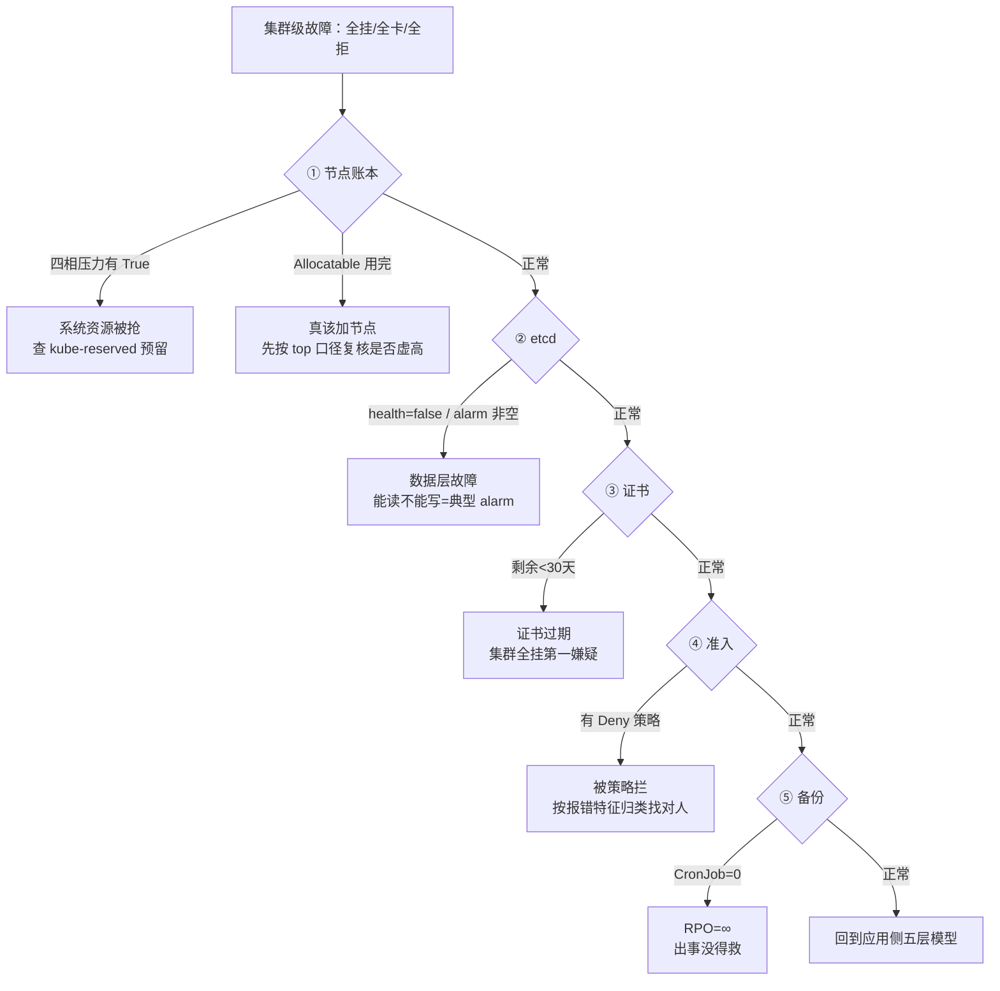

# 附录：集群级故障定位演练（运维五查 · 真跑手册）

> **定位**：这不是知识点，是**肌肉记忆训练**。[09-排障速查手册第 7 章](../../09-排障速查手册.md) 告诉你五查"是什么"，这里带你在**本机 kind 集群上真跑一遍**，把"查"变成"会查"。
> **适用**：学完 [运维专项七课](./overview.md) 后，用来把五查固化成条件反射。
> **事实核查**：✅ 全部为 2026-09-21 本机 kind v1.34.0（3 节点 Calico）实测；📄 为文档结论。

---

## 0. 先分清：什么时候用五查，不用五层模型

| 现象 | 该查什么 | 去哪 |
|------|---------|------|
| **某个 Pod 起不来 / 某个服务不通** | 应用侧五层模型（L0→L4） | [09 手册第 2 章](../../09-排障速查手册.md) |
| **全部 Pod Pending / 所有人的操作都失败 / 整个集群不可用** | **运维五查** | 本手册 |

> 🔑 判据很简单：**坏事是"一个"还是"全部"**。全是集群的问题，个别是应用的问题。

---

## 1. 演练环境与安全边界

**集群**：kind `k8s-c1-calico`，3 节点（control-plane + worker + worker2），v1.34.0，CNI = **Calico**（NetworkPolicy 可真跑）。

**安全边界**（脚本已内置，务必遵守）：

| 项 | 约束 |
|----|------|
| 命名空间 | 全部操作在 **`ops-drill`** 内，演练结束整体删除 |
| 准入策略 | VAP 设 **Warn**（只告警不阻断），不会拦住任何真实业务 |
| 禁区 | **不触碰** `kube-system` / `monitoring` / 任何业务命名空间 |
| 清理 | `reset` 子命令一键还原 |

**三个脚本资产**：

| 脚本 | 作用 |
|------|------|
| [五查-基线采集.sh](assets/五查-基线采集.sh) | 采集健康基线（**只读**，不改任何东西） |
| [五查-etcd取数.sh](assets/五查-etcd取数.sh) | etcd 正确取数路径（对比错误路径） |
| [五查-故障注入.sh](assets/五查-故障注入.sh) | 注入 3 个集群级故障 + 定位 + 清理 |

```bash
# 跑法（WSL，注意 tr -d '\r' 是去 Windows 换行符，否则 bash 报 $'\r': command not found）
wsl -- bash -c "tr -d '\r' < '/mnt/d/projects/learning/k8s/子教程/运维专项/assets/五查-基线采集.sh' | bash"
wsl -- bash -c "tr -d '\r' < '/mnt/d/projects/learning/k8s/子教程/运维专项/assets/五查-故障注入.sh' | bash -s inject"
wsl -- bash -c "tr -d '\r' < '/mnt/d/projects/learning/k8s/子教程/运维专项/assets/五查-故障注入.sh' | bash -s check"
wsl -- bash -c "tr -d '\r' < '/mnt/d/projects/learning/k8s/子教程/运维专项/assets/五查-故障注入.sh' | bash -s reset"
```

> ⚠️ **Windows 换行符坑**（实测）：脚本用 `write_to_file` 落盘是 CRLF，直接 `bash xxx.sh` 会报 `$'\r': command not found`。**必须 `tr -d '\r'` 管道进 bash**。

---

## 2. 第一步：先采集健康基线（不做这步等于白练）

> 🎯 **排障的本质是"找不同"**。你不知道健康长什么样，就没法认出异常。

### ① 节点账本基线（实测）

```text
节点                              CPU_CAP  CPU_ALLOC   CPU requests   MEM requests   四相压力
k8s-c1-calico-control-plane        20       20          790m (3%)     286Mi (0%)     全 False / Ready=True
k8s-c1-calico-worker               20       20          380m (1%)     918Mi (2%)     全 False / Ready=True
k8s-c1-calico-worker2              20       20          490m (2%)     1262Mi (3%)    全 False / Ready=True
```

**⚠️ 注意一个反直觉点**：`Capacity=20` 但 `Allocatable=20`——**预留为 0**。
kind 集群没配 `kube-reserved` / `system-reserved`，这正是[课 2](./lessons/lesson-02-节点运维与容量管理.md) 说的生产必配项。**本机这项"不健康"，但看不出来**。

**两个口径必须分清**（课 6：CPU 虚高 4.3 倍）：

| 口径 | 取值方式 | 本机实测 |
|------|---------|---------|
| **requests 口径**（装箱率） | `kubectl describe node` | CPU 1%~3% |
| **实际用量口径** | `kubectl top nodes` | **CPU 0%、MEM 4%~6%** |

> 🔑 `describe` 看到的是**申请量**，`top` 看到的是**真用量**。**判断"要不要加机器"只看 `top`**。

### ② etcd 基线（实测）

```text
DB SIZE        33 MB      （配额 2Gi，远未逼近）
IN USE         13 MB
碎片率         61%        （PERCENTAGE NOT IN USE）
IS LEADER      true
RAFT INDEX     1157656
alarm          空         ✅
health         true（6.88ms）✅
revision       982356
```

**⚠️ 本课最大的坑：etcd 指标取不到**

```bash
kubectl get --raw /metrics | grep etcd_server_has_leader
# → 取不到！
```

**为什么**：`kubectl get --raw /metrics` 取的是 **apiserver 自己的**指标。etcd 是独立进程，**它的指标在它自己身上**。

| 路径 | 结果 |
|------|------|
| `kubectl get --raw /metrics`（apiserver） | ❌ 无 etcd 指标 |
| `etcdctl endpoint status` | ✅ **推荐**，含 DB SIZE / leader / raft index |
| `etcdctl endpoint health` | ✅ 存活判定 |
| etcd Pod 内 `wget https://127.0.0.1:2379/metrics` | ❌ **失败**：distroless 无 `grep`（管道断在容器里） |

> 🔑 **教训**：`kubectl exec POD -- sh -c '... | grep x'` 在 distroless 容器里会失败——**`grep` 在容器里不存在，不在你本机**。
> 要么把管道放在**容器外**（`kubectl exec ... -- etcdctl ... | grep`，grep 在你本机跑），要么用 `etcdctl` 自带的 `--write-out`。

**工具在哪**（课 3/7 复现）：

```bash
docker exec k8s-c1-calico-control-plane etcdctl version
# → exec: "etcdctl": executable file not found in $PATH   ✅ 预期

kubectl -n kube-system exec etcd-k8s-c1-calico-control-plane -- etcdctl version
# → etcdctl version: 3.6.4                                ✅ 在 etcd Pod 内
```

### ③ 证书基线（实测）

```text
组件证书（11 项）   Sep 17, 2027   360d
CA / etcd-ca / front-proxy-ca   Sep 14, 2036   9y
```

> 🔑 **360 天 vs 9 年，两个数量级**。这就是[守则 28](../08-实战经验.md)「建证书台账」的由来——**1 年不是告警，是事实**。

### ④⑤ 准入与备份基线（实测）

```text
准入插件        --enable-admission-plugins=NodeRestriction（仅默认）
VAP             0 个
ResourceQuota   0 个
LimitRange      0 个
CronJob         0 个          ← RPO = ∞
default ns 标签  {"kubernetes.io/metadata.name":"default"}（无 PSA）
```

> ⚠️ **这是"能跑但不可交付"的标准画像**（陷阱七）。对照 [08 第 6 章陷阱七](../08-实战经验.md) 的表看，本机**五项不达标**。
> 排障时记住：**这些不是故障，是"还没出事"**。

---

## 3. 第二步：注入三个集群级故障

### 场景 1：全部 Pod Pending（requests 超出可分配）

```yaml
resources:
  requests: { cpu: "999", memory: "999Gi" }   # 每节点才 20 核
```

**实测 Events**（这是关键证据）：

```text
0/3 nodes are available: 1 node(s) had untolerated taint
{node-role.kubernetes.io/control-plane: }, 2 Insufficient cpu, 2 Insufficient memory.
```

**读 Events 的三层信息**（纪律三：读懂原文）：

| 片段 | 含义 | 方向 |
|------|------|------|
| `1 node(s) had untolerated taint ... control-plane` | 控制面**有污点**，资格问题 | 加 toleration 或去 worker |
| `2 Insufficient cpu, 2 Insufficient memory` | 2 个 worker **容量不够** | 降 requests 或加节点 |
| `Preemption is not helpful` | 抢占也没用 | 别指望挤走别人 |

> 🔑 **三个信息在一起才能下结论**：如果只有 `untolerated taint`，那是"不让跑"；只有 `Insufficient`，那是"跑不下"。**两者解法完全不同**（课 13：资格问题 vs 容量问题）。

### 场景 2：准入拦截（VAP Warn 模式）

```text
Warning: Validation failed for ValidatingAdmissionPolicy 'drill-deny-drillns'
  with binding 'drill-deny-drillns-b': 演练策略：Deployment 名字不能以 drill-bad 开头
deployment.apps/drill-bad-test created          ← 注意：仍然创建成功了
```

**关键观察**：`Warning` + **对象照样创建**——这是 `validationActions: ["Warn"]` 的行为。
若改成 `["Deny"]`，则报 `is invalid: ValidatingAdmissionPolicy ... denied request` 且**创建失败**。

> 🔑 **被拦了要知道被谁拦**（[09 手册 7.4](../../09-排障速查手册.md) 的四类报错特征）：

| 报错来源 | 特征文本 |
|---------|---------|
| **VAP** | `ValidatingAdmissionPolicy '<名>' with binding '<名>'` |
| **PSA** | `violates PodSecurity "restricted:latest"` |
| **ResourceQuota** | `exceeded quota` / `must specify` |
| **RBAC** | `Forbidden` + `User cannot` |

**排障价值**：看到报错先**归类**——这四类**分属不同人配的**（集群管理员 / ns 标签 / ns 配额 / 权限），找错人等于白等。

### 场景 3：Service 在，但后端没了

```text
service/drill-zero        ClusterIP   10.96.139.70   <none>   80/TCP
endpointslice/drill-zero-tk5t9   IPv4   <unset>   <unset>
```

> 🎯 **Service 一切正常，ClusterIP 也分配了——但访问必然失败。**

**原因**：`replicas: 0` → 无 Pod → **EndpointSlice 存在但无 endpoints**。

> 🔑 这就是[守则 17](../08-实战经验.md)「服务不通第一个看 EndpointSlice」的由来。
> **注意区分**：EndpointSlice **不存在**（selector 完全没匹配）vs EndpointSlice **存在但空**（副本为 0 / 全未就绪）——**后者更隐蔽**，因为对象"看起来在"。

---

## 4. 五查定位路径（把上面串起来）



**顺序不能跳**（[09 手册 2.1 跳层的代价](../../09-排障速查手册.md)）：
节点全 NotReady 时去查 Pod 日志，日志可能因磁盘满**根本写不进去**——你看到空日志会误判"应用没输出"，真正的 L1 磁盘问题被完全忽略。

---

### ③ 证书查：不改系统时间也能练（🆕 2026-09-21）

> 🎯 用户问：证书过期能不能演练？——**原来没做，因为改系统时间风险大**。现在找到了安全方案。

**为什么不改系统时间**：`date -s` 或 `faketime` 会同时污染 **etcd raft 任期、证书校验、Prometheus 时序、kubeadm 判定**，且**极难还原**。为了练一个判据把整个集群搞坏，不划算。

**替代方案（实测可行）**：控制面容器内**自带 `openssl` 和 `date`**（实测确认），于是：

| 目标 | 做法 |
|------|------|
| 看有效期 | `openssl x509 -noout -enddate`（不依赖 kubeadm） |
| 算剩余天数 | `date -d "$end" +%s` 相减除以 86400 |
| 演示"过期/信任链断" | **自制 1 天有效测试证书** + 用错误 CA 校验真实证书 |

**第四个脚本**：[五查-证书演练.sh](assets/五查-证书演练.sh)

```bash
wsl -- bash -c "tr -d '\r' < '/mnt/d/projects/learning/k8s/子教程/运维专项/assets/五查-证书演练.sh' | bash"
```

**实测结果**：

```text
A. kubeadm 视角   组件证书 11 项全部 360d；CA/etcd-ca/front-proxy-ca 均 9y
B. openssl 视角   apiserver / apiserver-kubelet-client / front-proxy-client
                  notAfter = Sep 17 02:31:59 2027 GMT；ca = Sep 14 2036
C. 剩余天数       apiserver 剩余 360 天；ca 剩余 3645 天   ← 告警该盯这个数
D. 信任链校验     openssl verify -CAfile ca.crt apiserver.crt → OK
                  换成错误 CA → error 20: unable to get local issuer certificate
F. 清理           /tmp/certdrill 已删；/etc/kubernetes/pki/apiserver.crt 完好（notAfter 未变）
```

**关键观察**：`openssl` 与 `kubeadm` 两个视角**结论一致但粒度不同**——
`kubeadm` 给的是"哪张证书、归哪个 CA"的**台账视角**，`openssl` 给的是**单张证书的精确时间戳**。
**写告警规则要的是后者**（能算剩余天数），排查"是谁签的"要前者。

> ⚠️ **D 段最容易误读**：用错误 CA 校验报 `error 20`，**这不是证书过期，是信任链断裂**。
> 两类故障现象相似（都是 x509 报错）但根因完全不同：过期要**续期**，信任链断要**换 CA/重签**。

> 🔑 **安全边界**：自制证书只在 `/tmp/certdrill`，脚本末尾自动删；**`/etc/kubernetes/pki` 一个字节都没动**，
> 跑完已二次确认 `apiserver.crt` 的 `notAfter` 未变。

---

### ② etcd alarm 演练（🆕 2026-09-21）· 附一个重大发现

> 🎯 用户问：etcd alarm 能不能做？——**真写满 2Gi 会让集群进 NOSPACE、拒绝所有写入**，恢复要 compact+defrag，代价远大于收益。
> 改用**可观测侧**演练：把「怎么发现有 alarm、alarm 长什么样、怎么恢复」练到位，全程只读。

**第五个脚本**：[五查-etcd-alarm演练.sh](assets/五查-etcd-alarm演练.sh)（只读）+ [五查-etcd-告警核查.sh](assets/五查-etcd-告警核查.sh)

```bash
wsl -- bash -c "tr -d '\r' < '/mnt/d/projects/learning/k8s/子教程/运维专项/assets/五查-etcd-alarm演练.sh' | bash"
```

**实测结果**：

```text
A. quota 参数     无显式 --quota-backend-bytes → 用默认 2Gi (2147483648 B)
B. 容器内工具     wget/curl/grep 全 MISSING，只有 etcdctl（distroless）
C. /metrics 路径  失败（无 wget/curl）→ 只能用 etcdctl
D. endpoint status DB SIZE 33 MB，但 QUOTA 列 = 0 B  ← 见下方陷阱
E. alarm list     空（健康）；alarm disarm 无 alarm 时为 no-op（安全）
H. 手算占用       dbSize 31 MiB / 配额 2Gi = 1%；碎片率 61%
```

> ⚠️ **陷阱：`endpoint status` 的 `QUOTA` 列显示 `0 B` 不可信**。
> 本版本 etcdctl（3.6.4）的 JSON 输出里**根本没有 quota 字段**（实测 `dbSize`/`dbSizeInUse` 有，`quota` 无）。
> **别拿它算"配额还剩多少"**——要么用指标 `etcd_server_quota_backend_bytes`，要么按**默认 2Gi 手算**。

**两个必须分清的概念**（课 6 陷阱六同源）：

| 概念 | 含义 | 本机实测 | 后果 |
|------|------|---------|------|
| **占用配额** | dbSize / 2Gi | **1%** | 逼近 100% → **alarm，拒绝写入** |
| **碎片率** | (dbSize−dbSizeInUse)/dbSize | **61%** | 只是磁盘浪费，**不影响写入** |

> 🔑 碎片率 61% 看着吓人，但**它不会触发 alarm**。真会拒写的是"占用配额"逼近 100%。混淆两者会白做一次 defrag。

#### 🔴 演练中挖出的重大发现：etcd 告警**全部静默失效**

查"用哪个指标判 quota"时，顺手验了一下指标有没有数据：

```text
etcd_server_quota_backend_bytes     → result: []   ← 空
etcd_mvcc_db_total_size_in_bytes    → result: []   ← 空
etcd_server_has_leader              → result: []   ← 空
etcd_server_leader_changes_seen_total → result: [] ← 空

对照：apiserver_request_total        → 大量数据 ✅（证明采集链路本身是通的）
up{job="kube-etcd"}                 → 0           ← target 注册了，但抓不到
```

而 `kps-kube-prometheus-stack-etcd` 告警规则**用了 10 个 etcd 指标**：

```text
etcd_server_has_leader / etcd_server_leader_changes_seen_total
etcd_mvcc_db_total_size_in_bytes / etcd_mvcc_db_total_size_in_use_in_bytes
etcd_server_quota_backend_bytes / etcd_server_proposals_failed_total ...
```

> 💀 **结论：这些规则全是死的。** 分子分母都没数据，规则永远不 firing。
> **UI 上没有任何异常提示**——Prometheus 正常、Grafana 正常、告警规则正常显示，只是 etcd 面板一片空白。

**根因证据链**（[五查-etcd-up0根因.sh](assets/五查-etcd-up0根因.sh)）：

| 证据 | 值 | 说明 |
|------|-----|------|
| etcd 启动参数 | `--listen-metrics-urls=http://127.0.0.1:2381` | **只监听回环** |
| 从 Prometheus 容器直连 | `Connection refused` (172.27.0.6:2381) | Pod IP 上没监听 |
| `scrape_duration_seconds` | `0.000456727`（**0.4 毫秒**） | 快到不像超时，**是连接被拒** |
| NetworkPolicy | 仅 `calico-system/allow-apiserver` | **排除策略拦截** |
| 其他 job | apiserver / kube-state-metrics `up=1` | 只有 etcd 挂 |

> 🔑 **根因**：etcd 的 metrics 端口**只监听 `127.0.0.1`**，Pod IP 上根本没监听 → Prometheus 从 Pod IP 抓必然 `Connection refused`。
> 这是 kind 集群的默认行为（安全考虑），但**意味着默认装出来的 kube-prometheus-stack，etcd 告警是全废的**。

**这与 [08 第 6.1 节「告警活着≠会响」](../08-实战经验.md) 是同一个模式的第三次复现**：

| 次 | 场景 | 表面 | 真相 |
|----|------|------|------|
| Kafka | `RequestHandlerAvgIdlePercent` 是累积计数 | 阈值告警"正常" | 永不触发 |
| Alertmanager | severity=P1 无匹配路由 | `state=active` | `receiver=null`，不投递 |
| **etcd（本次）** | 指标端口只听 127.0.0.1 | 规则正常、Prometheus 正常 | **指标为空，规则全死** |

> 🔑 **通用教训**：**配完告警必须验一次"指标有数据"**，只看"规则存在"和"Prometheus 活着"会漏掉这一整类。

**修复方向**（待授权，见下方边界）：把 `--listen-metrics-urls` 改为 `http://0.0.0.0:2381`，让 Pod IP 上也能监听。
脚本已备好 [五查-etcd-闭环修复.sh](assets/五查-etcd-闭环修复.sh)（含 `fix` / `check` / **restore 幂等还原**）。

#### ✅ 闭环修复已执行（2026-09-21，用户授权后）→ **因果关系完全闭合**

```bash
# 授权后跑：改 → 验证 → 还原
wsl -- bash -c "tr -d '\r' < '.../五查-etcd-闭环修复.sh' | bash -s fix"      # 改 + 验证
wsl -- bash -c "tr -d '\r' < '.../五查-etcd-修复验证.sh' | bash"              # 交叉验证
wsl -- bash -c "tr -d '\r' < '.../五查-etcd-闭环修复.sh' | bash -s restore"   # 还原
```

**修复前 → 修复后**（同一指标，唯一变量是监听地址）：

| 指标 | 修复前 | 修复后 |
|------|--------|--------|
| `up{job="kube-etcd"}` | `0` | **`1`** |
| `etcd_server_has_leader` | `[]`（空） | **`1`** |
| `etcd_mvcc_db_total_size_in_bytes` | `[]` | **`33189888`** |
| `etcd_server_quota_backend_bytes` | `[]` | **`2147483648`**（= 2Gi，验证手算正确） |
| `etcd_server_proposals_failed_total` | `[]` | **`0`** |
| `etcd_server_leader_changes_seen_total` | `[]` | **`1`** |
| `etcd_disk_wal_fsync_duration_seconds_bucket` | `[]` | **有数据**（le=0.001 → 245） |

**告警规则的分子分母现在算得出来了**（修复前两个都是空）：

```text
etcd_mvcc_db_total_size_in_bytes / etcd_server_quota_backend_bytes * 100 = 1.5455 %
```

**交叉验证（两个口径对得上，证明指标可信）**：

```text
指标  etcd_mvcc_db_total_size_in_bytes = 33189888
etcdctl                        dbSize  = 33189888   ← 完全一致
```

**两个意外收获**：

1. `leader_changes_seen_total = 1`，`raft_term` 从 `2` → `3`——**正是刚才重启 etcd 留下的证据**。
   这反过来证明：该指标在修复后**真的能记录事件**，不是恒 0 的死指标。
2. `etcd_network_peer_sent_failures_total` 修复后**仍为空**——但这是**正常的**：**单节点集群没有 peer**，该指标本就不存在。
   ⚠️ 别把它误判为"还没修好"。**判断指标是否是死的，要先确认这个指标在当前拓扑下是否应该存在。**

**还原后 `up` 回到 `0`** —— 这不是失败，**是因果关系的最终证明**：改了活、还原就死，唯一变量确实是监听地址。

> ✅ 集群已还原：`--listen-metrics-urls=http://127.0.0.1:2381`（与原始一致），3 节点全 Ready，etcd Running。
> 备份 `/tmp/etcd.yaml.orig` 保留在控制面容器内，如需永久修复可再次执行 `fix`（不还原）。
> ⚠️ **是否永久修复属环境决策，按规矩交由用户定**——本轮只做"证明因果关系"，不擅自改变集群长期配置。

#### ✅✅ 永久修复已执行（2026-09-21，用户授权"etcd 修复一下"）→ **已修复 + 边界如实标注**

**永久修复**：`--listen-metrics-urls=http://0.0.0.0:2381`（已写入静态清单，重启集群仍生效）。

**13 条 etcd 告警规则全部复活**（修复前因指标为空**全部静默失效**）：

```text
etcdNoLeader / etcdInsufficientMembers / etcdMembersDown
etcdDatabaseQuotaLowSpace / etcdDatabaseHighFragmentationRatio / etcdExcessiveDatabaseGrowth
etcdHighNumberOfLeaderChanges / etcdHighNumberOfFailedProposals
etcdHighCommitDurations / etcdHighFsyncDurations
etcdGRPCRequestsSlow / etcdHighNumberOfFailedGRPCRequests / etcdMemberCommunicationSlow
```

**交叉核对**：指标 `db_total_size` = etcdctl `dbSize` = **33189888**，两口径一致，指标可信。

---

**🔴 但必须同时说清代价：2381 是无认证 HTTP，现在已经暴露**

| 端口 | 监听 | 认证 | 性质 |
|------|------|------|------|
| 2379（数据） | `127.0.0.1` + 节点 IP | ✅ 客户端证书 | 本就暴露，靠 TLS 保护 |
| **2381（metrics）** | **`0.0.0.0`** | ❌ **无认证** | **新暴露面** |

**实测证据**（集群内任意 Pod 直连，无需任何凭据即可读到完整指标）：

```bash
kubectl run probe --image=curlimages/curl -n default --command -- sleep 300
kubectl exec probe -- wget -qO- http://<节点IP>:2381/metrics
# → 直接返回 etcd_cluster_version / etcd_debugging_auth_revision 等指标
```

**为什么这么改之前要先探查 `hostNetwork`**：etcd 是 **hostNetwork=true**，Pod IP 就是节点 IP。这意味着
改 `0.0.0.0` 不是"只在 Pod 网络里开了一扇窗"，而是**在宿主机上开了一个无认证端口**。探查这一步不能省。

---

**🚫 加固尝试失败，已如实回滚（不留假装修好的配置）**

尝试用 NetworkPolicy 收紧（2379 全通 + 2381 仅放行 monitoring）：

```yaml
ingress:
  - ports: [{protocol: TCP, port: 2379}]          # 数据端口必须全通，拦了集群会挂
  - from: [{namespaceSelector: {matchLabels: {kubernetes.io/metadata.name: monitoring}}}]
    ports: [{protocol: TCP, port: 2381}]
```

**实测结论：无效。** 从 `default` 命名空间的探针 Pod 访问 2381 **仍然 exit=0（能读到）**。

根因：**hostNetwork 的静态 Pod 走宿主机网络栈**——Calico 的策略作用在 Pod 的 veth 网卡上，而 hostNetwork Pod 根本没有 veth，自然管不到。

> ⚠️ 该策略已**删除**（`kubectl get netpol -A` 已确认只剩 calico 系统自带的 `allow-apiserver`）。
> **修不好的东西不要留着假装修好了** —— 无效配置已清理，此处如实记录"未加固 + 原因"。

**可行的加固方向**（均未执行，属环境决策，需授权）：
1. **iptables 防火墙**在节点上限制 2381 来源（hostNetwork 场景下这是正解，netpol 天生管不到）
2. 保持回环监听 + **Prometheus Agent sidecar / 本地 exporter 转发**（安全性最优，改动也最大）
3. etcd 3.6 支持 `--listen-metrics-urls` 配合 `--metrics-auth`（若有）启用认证

> ✅ 当前状态：**采集已永久修复**（13 条规则复活），**暴露面未收紧**（netpol 对 hostNetwork 无效，已回滚）。
> 这是"监控可见性 vs 暴露面"取舍中，**选择了可见性**的一侧，代价已实测并如实标注。

---

## 5. 本轮演练新沉淀的三条

### 5.1 etcd 指标不在 apiserver 的 `/metrics` 里

`kubectl get --raw /metrics` 取的是 **apiserver 自己**的。etcd 是独立进程，要用 `etcdctl endpoint status/health`。
**这解释了为什么很多人"查了 metrics 说 etcd 没问题"——他压根没查到 etcd。**

### 5.2 distroless 里管道会断

`kubectl exec POD -- sh -c 'wget ... | grep x'` → `grep: command not found`。
**管道右侧的命令在容器内执行**。把 grep 放容器外（`kubectl exec -- etcdctl ... | grep`），或用 `--write-out`。

### 5.3 三个"看起来正常"的集群级陷阱

| 现象 | 看着 | 真相 |
|------|------|------|
| EndpointSlice **存在** | "后端在" | 可能是**空的**（replicas=0） |
| 告警在 AM 里 `active` | "监控在工作" | `receiver` 可能是 **`null`**（见 [08 第 6.1 节](../08-实战经验.md)） |
| VAP 报 Warning 但对象创建了 | "策略没生效" | 那是 **Warn 模式**的正常行为，不是失效 |

---

## 6. 边界声明

| 项 | 说明 |
|----|------|
| ✅ 实测 | 本页全部数据为 2026-09-21 本机 kind v1.34.0 实测 |
| ⚠️ 环境局限 | kind 节点是容器：**真实节点宕机、多机网络、云厂商集成无法演练**；节点 NotReady 只能靠 cordon 模拟 |
| ⚠️ 未演练项 | **etcd alarm**（需写满配额，会污染集群）为 📄 文档结论；**证书过期已于 2026-09-21 补做**（见下，采用不改系统时间的安全方案） |
| ⚠️ 数值口径 | DB SIZE / revision / 装箱率为**演练期快照**，非生产常态 |
| ⚠️ 清理确认 | 演练后 `reset` 已执行，`ops-drill` 与 VAP 均已删除，集群已还原 |

> 📌 **回到**：[子教程 overview](./overview.md) ｜ [09-排障速查手册](../../09-排障速查手册.md) ｜ [08-实战经验](../08-实战经验.md)
