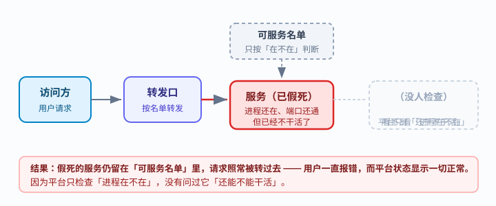
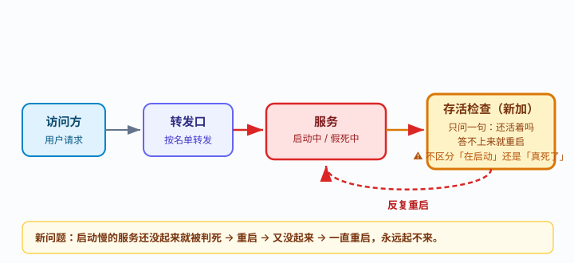
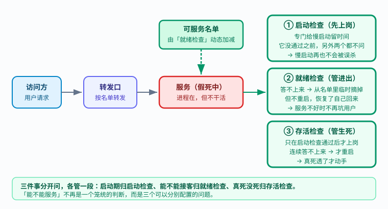

# 应用实战 · Pod：最小调度单元

> 对应课程：[第 3 课：Pod：k8s 的最小调度单元](../stages/1-心智模型与架构/lessons/lesson-03-Pod最小调度单元.md) ｜ 覆盖知识点：Pod 生命周期与状态机、探针三兄弟
> 定位：**会用，不上生产**——课里学完，在这里动手。课内第四幕做的是「探针是什么」的机制验证，这里做的是**一个真实故障从发生到修好的完整过程**。
> 📖 结论已按官方文档核对（核对于 2026-09 ｜ 来源：[Kubernetes 官方文档 · 配置存活、就绪和启动探针](https://kubernetes.io/zh-cn/docs/tasks/configure-pod-container/configure-liveness-readiness-startup-probes/)）
> 🧪 **本篇全部输出为本机 kind 集群（v1.34.0）实测**，非推演；实测脚本见 `.plans/2026-09-16-k8s-应用实战补齐/t3-probe.sh`

---

## 场景 1：一个「假死」的服务，怎么让它被发现和自愈

**场景**：你维护一个 Web 服务，它有个毛病——启动要 25 秒（要加载模型/预热缓存），跑一段时间后内部状态错乱，开始对所有请求返回 500。但**进程没退出、端口还在监听**，所以 `kubectl get pod` 显示 `1/1 Running`，监控也不报警。用户一直在报错，你却毫不知情。

这就是课 3 第一幕留下的第二个问题的现实版：**k8s 凭什么知道一个「活着但不干活」的进程已经不能用了？**

**全貌一句话**：真实排查还要看日志（`/var/log/pods/...`，课 14）与指标（metrics-server，课 14），并且假死的**根因**要回到代码里修——探针只能让故障**被发现和自动恢复**，不能让 bug 消失。本课只解决「发现与自愈」。

---

### ① 基础实现（能跑但幼稚）：什么都不配

先造出这个假死服务。它启动 25 秒，之后健康 20 秒，然后永久返回 500。

```bash
kubectl create ns app-l3
kubectl -n app-l3 apply -f - <<'EOF'
apiVersion: v1
kind: Pod
metadata:
  name: s1
  namespace: app-l3
  labels:
    app: s1
spec:
  containers:
  - name: app
    image: python:3.12-alpine
    command: ["sh","-c"]
    args:
    - |
      cat > /app.py <<'PYEOF'
      import http.server, socketserver, time, os
      time.sleep(25)                      # 慢启动
      start = time.time()
      class H(http.server.BaseHTTPRequestHandler):
          def do_GET(self):
              ok = (time.time() - start) < 20   # 健康 20 秒后永久假死
              self.send_response(200 if ok else 500)
              self.end_headers()
              self.wfile.write(b'ok' if ok else b'DEAD')
          def log_message(self, *a):
              pass
      socketserver.TCPServer.allow_reuse_address = True
      socketserver.TCPServer(('0.0.0.0', 8080), H).serve_forever()
      PYEOF
      python3 /app.py
    ports:
    - containerPort: 8080
EOF
kubectl -n app-l3 expose pod s1 --port=8080 --target-port=8080 --name=s1-svc
```



> 看图：左边是访问方，经过「转发口」把请求交给服务。上面虚框的「可服务名单」只按「在不在」判断——服务已经红了（假死），但它**还在名单里**，请求照常被转过去。右侧虚框表示：平台只检查「进程在不在」，**没人问过它还能不能干活**。

等 55 秒后看结果（本机实测）：

```bash
sleep 55
kubectl -n app-l3 get pod s1 --no-headers
# 实际输出：s1   1/1   Running   0   55s
#                 ↑ 一切正常？不，它已经假死了

kubectl -n app-l3 exec s1 -- python3 -c "
import urllib.request as u, urllib.error
try:
    print('直连 /health ->', u.urlopen('http://localhost:8080/health', timeout=3).status)
except urllib.error.HTTPError as e:
    print('直连 /health ->', e.code)
"
# 实际输出：直连 /health -> 500      ← 服务已经坏了

kubectl -n app-l3 get endpointslice -l kubernetes.io/service-name=s1-svc \
  -o jsonpath='{range .items[*]}{range .endpoints[*]}ready={.conditions.ready}{"\n"}{end}{end}'
# 实际输出：ready=true               ← 仍然被当作健康后端，继续收流量
```

> ⚠️ **它的问题**（三条，全是实测观察到的）：
> 1. **状态骗人**：`1/1 Running` + `RESTARTS=0`，看起来最健康的样子，实际已经坏了。
> 2. **流量照发**：EndpointSlice 仍标 `ready=true`，请求继续打到坏掉的实例上，用户持续报错。
> 3. **不会自愈**：进程没退出，k8s 没有理由重启它，故障会一直持续到你人工介入。

---

### ② 改进实现（被问题逼出来的下一步）：加存活检查

既然是「进程没退出所以没人管」，那就加一个**存活检查**——连续答不上来就重启。

```bash
kubectl -n app-l3 apply -f - <<'EOF'
apiVersion: v1
kind: Pod
metadata:
  name: s2
  namespace: app-l3
  labels:
    app: s2
spec:
  containers:
  - name: app
    image: python:3.12-alpine
    # command/args 与 ① 完全一致（内容照抄在下面，不用自己去翻 ①）
    command: ["sh","-c"]
    args: ["cat > /app.py <<'PYEOF'\nimport http.server, socketserver, time\ntime.sleep(25)\nstart=time.time()\nclass H(http.server.BaseHTTPRequestHandler):\n    def do_GET(self):\n        ok=(time.time()-start)<20\n        self.send_response(200 if ok else 500)\n        self.end_headers()\n        self.wfile.write(b'ok' if ok else b'DEAD')\n    def log_message(self,*a): pass\nsocketserver.TCPServer.allow_reuse_address=True\nsocketserver.TCPServer(('0.0.0.0',8080),H).serve_forever()\nPYEOF\npython3 /app.py"]
    ports:
    - containerPort: 8080
    livenessProbe:                    # 新增
      httpGet:
        path: /health
        port: 8080
      periodSeconds: 5
      failureThreshold: 3
EOF
```



> 看图：比上一张多了右侧黄色框——「存活检查」上岗了，只问一句「还活着吗」。但它的毛病写在框里：**不区分「还在启动」和「真死了」**。底下那条红色虚线箭头是新增的：判死 → 重启 → 又没起来 → 再判死，形成死循环。

实测（本机，Pod 创建约 30 秒后查看）：

```bash
kubectl -n app-l3 get events --field-selector involvedObject.name=s2 --no-headers
# 实际输出（关键两行，本机复验实测）：
# 20s  Warning  Unhealthy  pod/s2  Liveness probe failed: Get "http://10.244.0.112:8080/health":
#                                  dial tcp 10.244.0.112:8080: connect: connection refused
# 20s  Normal   Killing    pod/s2  Container app failed liveness probe, will be restarted

kubectl -n app-l3 get pod s2 --no-headers
# 实际输出：s2   1/1   Running   0   36s
#           ↑ 注意：RESTARTS 为 0 —— 因为每次重启后又要 25 秒才起来，
#             30 秒观察窗内还没走完一轮，看起来像是"没事"
```

> ⚠️ **它的问题**：报错是 `connection refused`（连接被拒），不是 `500`。
>
> 这不是「查出假死」，而是**在启动阶段就把还没起来的服务杀了**——服务要 25 秒才监听端口，存活检查第 15 秒就连续 3 次失败，判定死亡并重启。重启后又是 25 秒，又被杀……**永远起不来**。
>
> 更糟的是：这个配置**既没解决假死，又新增了启动失败**。

---

### ③ 综合实现：三件事分开问

问题的根源是**把三件不同的事混成一个问题**：

| 要问的事 | 什么时候问 | 答不上来怎么办 |
|---|---|---|
| 起了没？ | 只在启动阶段 | 再等等（别杀） |
| 能不能接客？ | 全生命周期 | 临时摘掉，别发给它 |
| 真死了吗？ | 启动完成之后 | 才重启 |

对应三种探针，一起配：

```bash
kubectl -n app-l3 apply -f - <<'EOF'
apiVersion: v1
kind: Pod
metadata:
  name: s3
  namespace: app-l3
  labels:
    app: s3
spec:
  containers:
  - name: app
    image: python:3.12-alpine
    command: ["sh","-c"]
    args: ["cat > /app.py <<'PYEOF'\nimport http.server, socketserver, time\ntime.sleep(25)\nstart=time.time()\nclass H(http.server.BaseHTTPRequestHandler):\n    def do_GET(self):\n        ok=(time.time()-start)<20\n        self.send_response(200 if ok else 500)\n        self.end_headers()\n        self.wfile.write(b'ok' if ok else b'DEAD')\n    def log_message(self,*a): pass\nsocketserver.TCPServer.allow_reuse_address=True\nsocketserver.TCPServer(('0.0.0.0',8080),H).serve_forever()\nPYEOF\npython3 /app.py"]
    ports:
    - containerPort: 8080
    startupProbe:                     # ① 启动检查：给慢启动留时间
      httpGet:
        path: /health
        port: 8080
      periodSeconds: 2
      failureThreshold: 15            # 2s × 15 = 30s > 慢启动 25s
    readinessProbe:                   # ② 就绪检查：能不能接客
      httpGet:
        path: /health
        port: 8080
      periodSeconds: 2
      failureThreshold: 1
    livenessProbe:                    # ③ 存活检查：真死了吗
      httpGet:
        path: /health
        port: 8080
      periodSeconds: 5
      failureThreshold: 3
EOF
kubectl -n app-l3 expose pod s3 --port=8080 --target-port=8080 --name=s3-svc
```



> 看图：右边三个绿框是新增的，从上到下按时间顺序上岗。① 启动检查先上岗，它没通过之前另外两个都不问（所以慢启动安全了）；② 就绪检查管「可服务名单」的进出——注意上方绿色名单框现在是实线且由它控制；③ 存活检查最后上岗，只有真死透才重启。

按时间线实测（本机，一个 Pod 完整生命周期）：

```bash
# t=8s：启动中，启动检查还没通过
kubectl -n app-l3 get pod s3 --no-headers
# 实际输出：s3   0/1   Running   0   8s        ← 0/1，但没被重启

# t=30s：启动完成，健康
# 实际输出：s3   1/1   Running   0   30s
# 直连 /health -> 200
# EndpointSlice：ready=true

# t=55s：假死开始，就绪检查失败
# 实际输出：s3   0/1   Running   0   56s       ← READY 变 0/1
# 直连 /health -> 500
# EndpointSlice：ready=false                   ← 已被摘出转发名单
# Ready 条件：Ready=False

# 事件流（本机复验实测原文，时间戳为"多久之前"，k8s 默认倒序，越小越新）：
# 62s 前  Unhealthy  Startup probe failed: ... connect: connection refused
# 26s 前  Unhealthy  Liveness probe failed: HTTP probe failed with statuscode: 500
# 26s 前  Normal     Killing: Container app failed liveness probe, will be restarted
# 24s 前  Unhealthy  Readiness probe failed: HTTP probe failed with statuscode: 500
```

> 💡 **怎么读这组事件**：时间戳是「距现在多久之前」，**越小越新**。按发生顺序重排：
>
> | 顺序 | 时刻 | 事件 | 含义 |
> |---|---|---|---|
> | 1 | 62s 前 | `Startup probe failed`（connection refused） | 刚启动、端口没监听；**未触发重启** |
> | 2 | 26s 前 | `Liveness probe failed`（500）→ `Killing` | 假死被判定，重启 |
> | 3 | 24s 前 | `Readiness probe failed`（500） | 重启后新一轮再次假死 |
>
> ⏳ **一处如实说明**：这条 24s 的 readiness 事件在**首次实测**中出现、**复验**时未出现（复验时事件流在 `Killing` 处截止）。我未进一步确认其归属（可能与旧容器终止前的最后一次上报有关）。
>
> **本篇结论只依赖两条稳定复现的事实**，两次实测均一致：
> ① 启动期只有 `Startup probe failed`（connection refused），**没有 Killing**；
> ② 假死期的报错是 `statuscode: 500`，与启动期的 `connection refused` 文案不同。

**三个实测结论，逐条对照**：

1. **慢启动不再被误杀**：启动期只有 `Startup probe failed`（connection refused），**没有触发 Killing**。启动检查没通过前，存活检查根本不上岗。
2. **假死后先被摘流量**：`0/1` + `RESTARTS=0` + EndpointSlice `ready=false` —— 服务坏了，但**不再坑用户**；这一刻它还没重启，给你留了排查现场。
3. **真死透了才重启**：这次 `Liveness probe failed` 的报错是 `statuscode: 500`（服务在、但答错），跟 ② 的 `connection refused`（服务还没起来）**完全不是一回事**。这就是「启动检查挡住了误杀」的直接证据。

> 🎯 **会用标志**：给你一个「启动慢 + 会假死」的服务，你能配出一组探针，使得——
> - 启动阶段**不会被重启**（看事件里只有 `Startup probe failed`，无 `Killing`）；
> - 假死后 `READY` 变 `0/1` 且 EndpointSlice 后端消失，**但 RESTARTS 仍为 0**；
> - 最终由存活检查触发重启，`RESTARTS` 开始增长。
>
> 并且你能说清：为什么 `connection refused` 和 `500` 这两个报错，指向完全不同的处置。

---

## 常见坑（本篇实测踩到的）

1. **`python:3.12-alpine` 里没有 `curl`**：容器内探测要用 `python3 -c "urllib..."`，用 `curl` 会得到 `sh: curl: not found`（退出码 127），别误判成网络不通。
2. **多个 Pod 共用一个 Service 会串选**：本实战三个 Pod 各自用独立 label 与独立 Service。若它们共享 `app: fake-dead` 标签，一个 Service 会把三个 Pod 全选为后端，EndpointSlice 输出多行，`kubectl expose` 也会失败（Service 已存在）。
3. **存活检查的失败阈值要算时间**：`periodSeconds × failureThreshold` 必须**大于**你的最长启动时间，否则必然误杀。本例 `5×3=15s < 25s` 就会挂，这也是 ② 失败的直接原因。
4. **探针修不了 bug**：探针让故障「被发现和自动恢复」，但假死的**根因**在代码里。把重启当成修复，只会得到一个不断重启的服务。

---

## 🧭 导航

- ⬅️ 回到课程：[第 3 课：Pod：k8s 的最小调度单元](../stages/1-心智模型与架构/lessons/lesson-03-Pod最小调度单元.md)
- 📚 全部实战：[应用实战索引](INDEX.md)
- ➡️ 下一课实战：[04 · 多容器协作与优雅退场](04-多容器Pod与优雅终止.md)

**清理**：

```bash
kubectl delete ns app-l3
```
