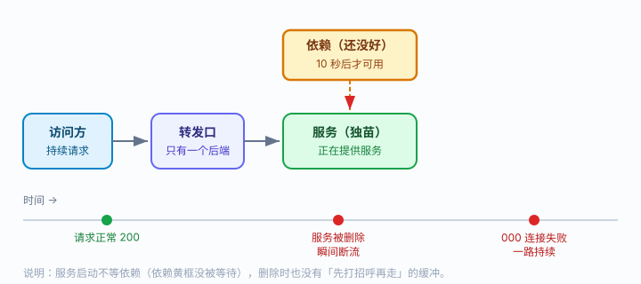
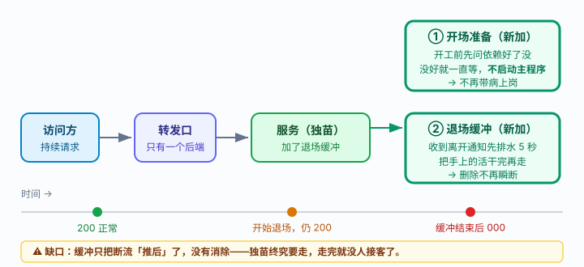
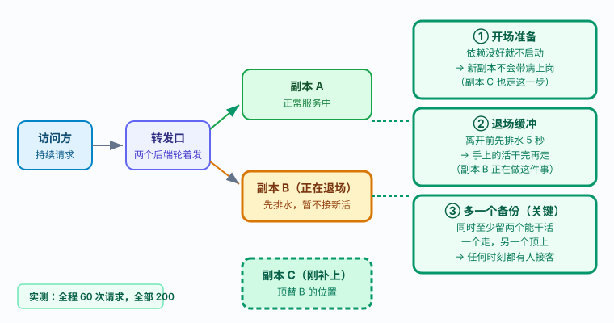

# 应用实战 · 多容器 Pod 与优雅终止

> 对应课程：[第 4 课：多容器 Pod：init、sidecar 与优雅终止](../stages/1-心智模型与架构/lessons/lesson-04-多容器Pod与优雅终止.md) ｜ 覆盖知识点：init 容器、优雅终止与生命周期钩子（sidecar 见课内第四幕）
> 定位：**会用，不上生产**——课里学完，在这里动手。课内验证的是「init / preStop 各自是什么」，这里做的是**一次「更新上线不丢请求」的完整改造**。
> 📖 结论已按官方文档核对（核对于 2026-09 ｜ 来源：[Kubernetes 官方文档 · Pod 的终止](https://kubernetes.io/zh-cn/docs/concepts/workloads/pods/pod-lifecycle/#pod-termination)、[容器生命周期回调](https://kubernetes.io/zh-cn/docs/concepts/containers/container-lifecycle-hooks/)）
> 🧪 **本篇全部输出为本机 kind 集群（v1.34.0）实测**，非推演；脚本见 `.plans/2026-09-16-k8s-应用实战补齐/t4-lifecycle*.sh`

---

## 场景 1：更新上线时，用户的请求一个都不许丢

**场景**：你的服务依赖一个后端（数据库/配置中心/另一个微服务），后端启动要 30 秒。你的服务一启动就要连它，连不上就崩。同时，每次发版或缩容都要删 Pod，删除瞬间总有用户请求失败（返回连接失败）。

两个问题其实是同一个：**一头一尾两个交接时刻没人管**——进来时依赖没好就上岗，离开时手上的活没干完就走。

**全貌一句话**：真实生产还要 PDB 控制并发删除数量（课 19）、滚动更新策略控制节奏（课 5）、就绪检查保证新副本可用后才接流量（课 3）。本课只解决「单个 Pod 的一进一出」，多副本带来的调度与并发控制不在这里展开。

---

### 准备：先放一个「会晚 30 秒才可用」的依赖

后面三步都要用到它，先建好。它启动 30 秒后 `/ready` 才返回 200，用来模拟「依赖还没起来」。

```bash
kubectl create ns app-l4
kubectl -n app-l4 apply -f - <<'EOF'
apiVersion: v1
kind: Pod
metadata:
  name: dep-slow
  namespace: app-l4
  labels:
    app: dep-slow
spec:
  containers:
  - name: dep
    image: python:3.12-alpine
    command: ["python3","-c"]
    args:
    - |
      import http.server, socketserver, time
      t0 = time.time()
      class H(http.server.BaseHTTPRequestHandler):
          def do_GET(self):
              r = (time.time() - t0) >= 30          # 30 秒后才"就绪"
              self.send_response(200 if r else 503)
              self.end_headers()
              self.wfile.write(b'ready' if r else b'no')
          def log_message(self, *a):
              pass
      socketserver.TCPServer.allow_reuse_address = True
      socketserver.TCPServer(('0.0.0.0', 8080), H).serve_forever()
    ports:
    - containerPort: 8080
---
apiVersion: v1
kind: Service
metadata:
  name: dep-slow
  namespace: app-l4
spec:
  selector:
    app: dep-slow
  ports:
  - port: 8080
    targetPort: 8080
EOF
kubectl -n app-l4 wait --for=condition=Ready pod/dep-slow --timeout=60s
# 实际输出：pod/dep-slow condition met
```

```bash
# 确认依赖此刻确实"还没好"（返回 503）
kubectl -n app-l4 run depcheck --image=curlimages/curl:8.7.1 --restart=Never -q -- \
  sh -c 'for i in 1 2 3 4 5 6 7 8; do printf "%s " "$(curl -s -o /dev/null -w "%{http_code}" http://dep-slow:8080/ready)"; sleep 2; done; echo'
sleep 18
kubectl -n app-l4 logs depcheck
# 实际输出（本机实测）：000 503 503 503 503 503 503 503
#                        ↑ 第一个 000 是压测 Pod 自身还在启动，还没发出请求
#                          后面全是 503 —— 这 14 秒内依赖一直没准备好

kubectl -n app-l4 delete pod depcheck
```

> 💡 **这 14 秒全是 503 是对的**：依赖要 30 秒才就绪，而这次探测只覆盖前 14 秒，所以看不到 200。想看到 `503 → 200` 的转折，把循环次数加到 20 次（覆盖 40 秒）即可。
>
> **别把第一个 `000` 误读成"依赖挂了"**——它是压测 Pod 自己还没起来。判断依赖状态要看稳定后的状态码。

---

### ① 基础实现（能跑但幼稚）：裸 Pod，一把梭

```bash
kubectl -n app-l4 apply -f - <<'EOF'
apiVersion: v1
kind: Pod
metadata:
  name: s1
  namespace: app-l4
  labels:
    app: s1
spec:
  containers:
  - name: web
    image: nginx:1.27-alpine
    ports:
    - containerPort: 80
EOF
kubectl -n app-l4 expose pod s1 --port=80 --target-port=80 --name=s1-svc
```



> 看图：上方黄框「依赖（还没好）」与主程序之间没有等待关系——服务直接就起来了。下方时间轴是重点：删除命令发出的那一刻（红点），请求**立刻**从 200 变成 000（连接失败），并且一直持续。

实测（本机，删除期间每 0.5 秒打一次，共 20 次）：

```bash
# 删除 Pod 的同时持续访问
kubectl -n app-l4 delete pod s1 --wait=true
# 实际输出：删除耗时：1 秒

# 删除期间的访问码序列（实测）：
# 200 200 200 200 200 200 000 000 000 000 000 000 000 000 000 000 000 000 000 000
#                            ↑ 第 7 次起全部失败，之后再没恢复
```

> ⚠️ **它的问题**（三条）:
> 1. **不等依赖**：服务一启动就调依赖，依赖没好就崩——实测退出码 1，`wget: bad address`，进入 `Error` 并反复重启（实测 40 秒内 `RESTARTS` 涨到 2）。
> 2. **删除瞬断**：`1 秒`就删完了，快是快，代价是第 7 次请求起**全部连接失败**。
> 3. **没有退场缓冲**：服务收到离开通知后立刻停止接收，正在处理的请求直接断掉。

---

### ② 改进实现：加开场准备 + 退场缓冲

既然问题是「进来不等、走得太急」，那就两头各加一道：

```bash
kubectl -n app-l4 apply -f - <<'EOF'
apiVersion: v1
kind: Pod
metadata:
  name: s2
  namespace: app-l4
  labels:
    app: s2
spec:
  terminationGracePeriodSeconds: 30
  initContainers:                        # ① 开场准备：依赖没好就不启动主程序
  - name: wait-dep
    image: busybox:1.36
    command: ["sh","-c","until wget -q -O- http://dep-slow:8080/ready >/dev/null 2>&1; do echo '等待依赖...'; sleep 3; done; echo '依赖就绪，放行'"]
  containers:
  - name: web
    image: nginx:1.27-alpine
    ports:
    - containerPort: 80
    lifecycle:                           # ② 退场缓冲：先排水再走
      preStop:
        exec:
          command: ["sh","-c","sleep 5"]
EOF
```



> 看图：右侧两个绿框是新增的。① 开场准备卡在主程序前面，依赖没好就不放行；② 退场缓冲让服务离开前先排水。但注意底部时间轴的**橙色警示**：断流只是被推后了，没有消除。

**开场准备实测**（依赖在准备阶段已启动，此刻它的 30 秒倒计时已经走了一部分）：

```bash
kubectl -n app-l4 get pod s2 --no-headers
# t=5s  ：s2   0/1   Init:0/1   0   5s     ← 卡在准备阶段
# t=15s ：s2   1/1   Running    0   15s    ← 依赖就绪，主容器启动
# t=45s ：s2   1/1   Running    0   45s

kubectl -n app-l4 logs s2 -c wait-dep
# 实际输出：
# 等待依赖...
# 等待依赖...
# 依赖就绪，放行
```

> 💡 **为什么 t=15s 就 Running 了，而不是等到 30 秒？** 因为依赖 Pod 在「准备」步骤就已创建，到你跑这一步时，它的 30 秒倒计时**已经走掉了十几秒**。init 只需等剩余的几秒。
>
> 想看到完整的 30 秒阻塞，请在建完依赖后**立刻**执行本步；或者直接把依赖的就绪时间改长（改 `>= 30` 为更大值）。无论如何，`Init:0/1` 这个状态与「依赖就绪，放行」这条日志，是判断阻塞发生的可靠依据。

> ✅ 主容器在依赖就绪前**完全没有启动**，这就是 `Init:0/1` 的含义。

**退场缓冲实测**（单副本，每 0.5 秒打一次，共 40 次）：

```bash
kubectl -n app-l4 delete pod s2 --wait=true
# 实际输出：删除耗时：6 秒（对比无缓冲的 1 秒）

# 访问码序列（实测）：
# 200 200 200 200 200 200 200 200 200 200 200 200 200 200 200 200
# 000 000 000 000 000 ...（之后 24 次全失败）
```

> ⚠️ **它的问题**：缓冲把断流从第 7 次推到了第 17 次，**但断流依然存在**。
>
> 这是一个非常容易误解的点，请务必看清：**preStop 不是「不丢请求」的解法，它只是把「立刻断」变成「等一会儿再断」**。因为自始至终只有这一个副本——它走完了，就真的没人接客了。

---

### ③ 综合实现：多一个备份，才是真正的解

要让请求真的不丢，必须满足一条：**任何时刻都至少有一个能干活的副本在线**。所以要有两个副本，并且退场缓冲的时间要足够让流量切走。

```bash
kubectl -n app-l4 apply -f - <<'EOF'
apiVersion: apps/v1
kind: Deployment
metadata:
  name: web2
  namespace: app-l4
spec:
  replicas: 2                            # ③ 关键：至少两个
  selector:
    matchLabels:
      app: web2
  template:
    metadata:
      labels:
        app: web2
    spec:
      terminationGracePeriodSeconds: 30
      initContainers:                    # ① 开场准备
      - name: wait-dep
        image: busybox:1.36
        command: ["sh","-c","until wget -q -O- http://dep-slow:8080/ready >/dev/null 2>&1; do sleep 2; done"]
      containers:
      - name: web
        image: nginx:1.27-alpine
        ports:
        - containerPort: 80
        readinessProbe:                  # 配套：让自己能判断"能不能接客"
          httpGet:
            path: /
            port: 80
          periodSeconds: 1
          failureThreshold: 1
        lifecycle:                       # ② 退场缓冲
          preStop:
            exec:
              command: ["sh","-c","sleep 5"]
---
apiVersion: v1
kind: Service
metadata:
  name: web2
  namespace: app-l4
spec:
  selector:
    app: web2
  ports:
  - port: 80
    targetPort: 80
EOF
kubectl -n app-l4 rollout status deployment/web2 --timeout=180s
# 实际输出：deployment "web2" successfully rolled out
# ⏳ 注意：依赖 30 秒后才就绪，两个副本都要等完 init，首次就绪约需 40~60 秒
```

> 💡 **为什么这里要多等一会儿**：每个副本的 init 容器都在等依赖，依赖 30 秒才可用，所以 `rollout status` 会比平时慢。这是**预期行为**，不是卡死。



> 看图：中间三个框是同一时刻的三件事——副本 A 正常服务、副本 B 正在退场（黄色，先排水）、副本 C 刚补上（虚线绿框）顶替 B。右侧三个绿框是对应的机制，其中 ③「多一个备份」被标为关键：只有一个副本时，前两条做得再好也没用。

**实测对照（本机，删除一个副本期间每 0.5 秒打一次）**：

| 配置 | 删除耗时 | 请求结果（实测） |
|---|---|---|
| 单副本 · 无缓冲 | 1 秒 | 前 6 次 200，**之后 14 次全 000** |
| 单副本 · 有缓冲 | 6 秒 | 前 16 次 200，**之后 24 次全 000** |
| **两副本 · 有缓冲 + 就绪检查** | 6 秒 | **60 次全部 200，零失败** |

```bash
# 两副本实测：先查自己的 Pod 名，再删其中一个（名字每次都不同，别照抄我这里的）
kubectl -n app-l4 get pod -l app=web2 --no-headers
# 实际输出（示例）：
# web2-6cfc94bdd4-8gb2m   1/1   Running   0   30s
# web2-6cfc94bdd4-fnn49   1/1   Running   0   30s

kubectl -n app-l4 delete pod web2-6cfc94bdd4-8gb2m --wait=true
# 剩余副本（自动补了一个）：
# web2-6cfc94bdd4-fnn49   1/1   Running   0   6s
# web2-6cfc94bdd4-qpctm   1/1   Running   0   11s

# 全程 60 次访问码（实测）：
# 200 200 200 ... （60 个 200，无一个 000）
```

> 🎯 **会用标志**：给你一个「有依赖 + 会更新」的服务，你能搭出一组配置，使得——
> - 依赖未就绪时，Pod 停在 `Init:0/1` 而**主容器不启动**（不是起来又崩）；
> - 删掉一个副本时，**全程零失败**（连续 60 次访问全部 200）；
> - 并且能说清：为什么单副本加 `preStop` 仍然会断流，多副本为什么才是关键。
>
> 顺带能回答：为什么「删除耗时从 1 秒变成 6 秒」不是变慢了，而是**把不可避免的断流窗口，挪到了有人接客的时候**。

---

## 一个反面教材：无超时的死等

课内知识点 1 提醒过「init 别写无超时死循环」，实测一下它到底多危险：

```bash
# init 容器等一个永远不存在的依赖
kubectl -n app-l4 apply -f - <<'EOF'
apiVersion: v1
kind: Pod
metadata:
  name: s-stuck
  namespace: app-l4
spec:
  initContainers:
  - name: wait-forever
    image: busybox:1.36
    command: ["sh","-c","while true; do wget -q -T 2 -O- http://dep-notexist:8080/ready >/dev/null 2>&1 && break; echo '还在等...'; sleep 3; done"]
  containers:
  - name: web
    image: nginx:1.27-alpine
EOF
```

实测（本机）：

```bash
kubectl -n app-l4 get pod s-stuck --no-headers
# t=12s：s-stuck   0/1   Init:0/1   0   12s
# t=30s：s-stuck   0/1   Init:0/1   0   30s     ← 永远卡住，不会失败、不会重启、不会超时
```

> ⚠️ **这个 Pod 会永远卡在 `Init:0/1`**。没有超时、没有报错、没有事件告警——它不会像崩溃那样用 `CrashLoopBackOff` 提醒你，只会静静地占着一个调度位。
>
> **正确做法**：给等待加超时上限（如 `timeout 60 sh -c 'until ...'`）或限制重试次数，让它在依赖不可达时**失败退出**，用明确的 `Init:Error` 暴露问题。

---

## 常见坑（本篇实测踩到的）

1. **压测日志取不到**：用 `kubectl run ... --restart=Never` 跑压测时，Pod 跑完是 `Succeeded` 而非 `Ready`，用 `kubectl wait --for=condition=Ready` 会一直等。正确做法是轮询 `status.phase` 直到 `Succeeded`/`Failed` 再取日志。
2. **别在被删的 Pod 里跑压测**：早期版本我把压测进程放在即将被删除的 Pod 内部，进程随 Pod 一起消失，日志拿不到。压测必须放在**独立的 Pod** 里。
3. **依赖不存在时 `wget` 报错是 `bad address`**：这是 DNS 解析失败（Service 不存在），不是网络不通；退出码 1，会让主容器进入 `Error` 并反复重启。
4. **`preStop` 的时间要计入宽限期**：`preStop` 的 `sleep` 消耗的是 `terminationGracePeriodSeconds`（默认 30 秒）。若 `sleep` 超过宽限期，进程会被 `SIGKILL` 强杀，缓冲等于白配。

---

## 🧭 导航

- ⬅️ 回到课程：[第 4 课：多容器 Pod 与优雅终止](../stages/1-心智模型与架构/lessons/lesson-04-多容器Pod与优雅终止.md)
- 📚 全部实战：[应用实战索引](INDEX.md)
- ⬅️ 上一课实战：[03 · 探针三件套](03-Pod最小调度单元.md)
- ➡️ 下一课实战：[05 · 上线不中断与回滚](05-Deployment无状态应用.md)（未编写）

**清理**：

```bash
kubectl delete ns app-l4
```
