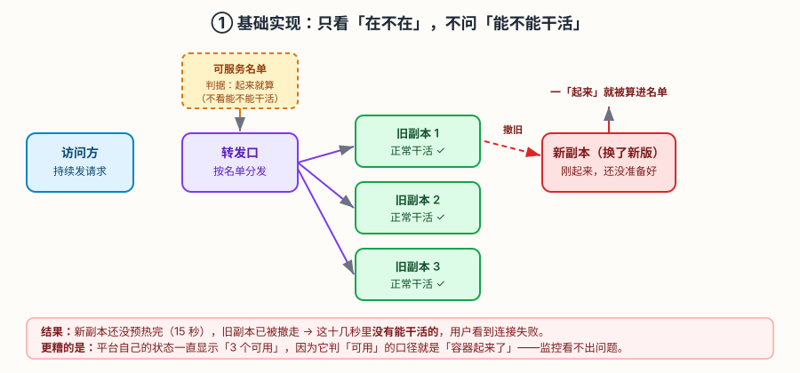
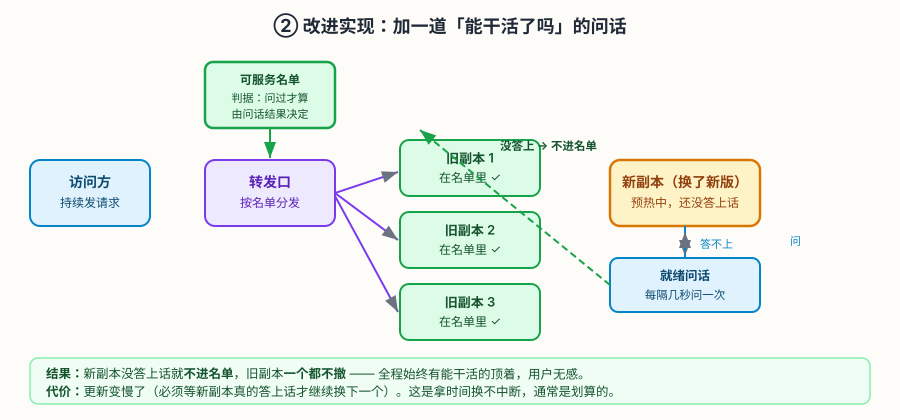
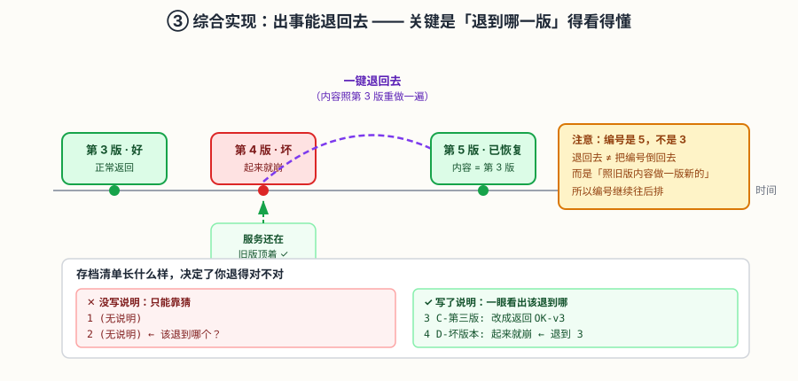

# 应用实战 · Deployment：无状态应用的自愈与更新

> 对应课程：[第 5 课：Deployment：无状态应用的自愈与更新](../stages/2-工作负载与控制器/lessons/lesson-05-Deployment无状态应用.md) ｜ 覆盖知识点：滚动更新、回滚与版本历史、垃圾回收
> 定位：**会用，不上生产**——课里学完，在这里动手。课内第四幕做的是「滚动更新和回滚是什么」的机制验证，这里做的是**一次真实的发布事故：从用户投诉、到定位、到修复、到能退回去**。
> 📖 结论已按官方文档核对（核对于 2026-09 ｜ 来源：[Kubernetes 官方文档 · Deployment](https://kubernetes.io/zh-cn/docs/concepts/workloads/controllers/deployment/)）
> 🧪 **本篇全部输出为本机 kind 集群（v1.34.0）实测**，非推演；实测脚本见 `.plans/2026-09-16-k8s-应用实战补齐/t5-rollout{,2,3}.sh`

---

## 场景：一次「明明没报错」的发布事故

**场景**：你维护一个下单服务，它启动要 **15 秒**（要预热缓存、建连接池）。某天你发布了新版本，发布过程一切顺利——`kubectl get deploy` 全程显示 `3/3`，没有任何报错。

但发布那十几秒里，客服收到了一波投诉：「下单失败」。

你回头查：`kubectl rollout status` 说成功了，Pod 都是 `Running`，副本数也对。**哪里断了？**

这就是课 5 第五幕埋下的那个伏笔的现实版：**如果应用启动慢，又没配就绪探针，新副本还没准备好就被算作可用，旧副本就被撤走了。**

**全貌一句话**：真实发布还要考虑数据库的向后兼容（旧版本能不能读新版本写的数据）、以及流量切换的比例控制（灰度发布，课 8）。本课只解决「发布那几十秒别断流 + 出事能退回去」。

---

### ① 基础实现（能跑但幼稚）：只说要几个，别的都不管

先造出这个服务：3 个副本，启动 15 秒，不带任何探针。

```bash
kubectl create ns app-l5

kubectl -n app-l5 apply -f - <<'EOF'
apiVersion: apps/v1
kind: Deployment
metadata:
  name: shop
spec:
  replicas: 3
  selector:
    matchLabels:
      app: shop
  template:
    metadata:
      labels:
        app: shop
    spec:
      containers:
      - name: app
        image: python:3.12-alpine
        command: ["sh","-c"]
        args:
        - |
          cat > /app.py <<'PYEOF'
          import http.server, socketserver, time
          time.sleep(15)                 # 慢启动：预热 15 秒
          class H(http.server.BaseHTTPRequestHandler):
              def do_GET(self):
                  self.send_response(200)
                  self.end_headers()
                  self.wfile.write(b'OK-v1')
              def log_message(self, *a):
                  pass
          socketserver.TCPServer.allow_reuse_address = True
          socketserver.TCPServer(('0.0.0.0', 8080), H).serve_forever()
          PYEOF
          python3 /app.py
        ports:
        - containerPort: 8080
---
apiVersion: v1
kind: Service
metadata:
  name: shop
spec:
  selector:
    app: shop
  ports:
  - port: 8080
    targetPort: 8080
EOF

kubectl -n app-l5 rollout status deployment/shop --timeout=180s
# 实际输出：deployment "shop" successfully rolled out
```



> 看图：可服务名单的判据是「容器起来了」——**没问过它能不能干活**。所以新版本一「起来」就被算进名单，旧副本同时被撤走；而新副本还要 15 秒才能真正应答，中间这段**没有能干活的**。

现在启动一个持续打请求的观察员，然后发布新版本：

```bash
kubectl -n app-l5 apply -f - <<'EOF'
apiVersion: v1
kind: Pod
metadata:
  name: loader
spec:
  restartPolicy: Never
  containers:
  - name: c
    image: python:3.12-alpine
    command: ["sh","-c"]
    args:
    - |
      python3 - <<'PYEOF'
      import urllib.request, time, collections
      cnt = collections.Counter()
      end = time.time() + 75
      while time.time() < end:
          try:
              r = urllib.request.urlopen("http://shop:8080/", timeout=3)
              cnt[str(r.status)] += 1
          except Exception as e:
              cnt[type(e).__name__] += 1
          time.sleep(0.3)
      print("RESULT-1 " + " ".join(f"{k}={v}" for k,v in sorted(cnt.items())))
      PYEOF
EOF

# 换掉启动命令，触发一次滚动更新（等价于发布新版本）
kubectl -n app-l5 patch deployment shop --type=json -p='[
  {"op":"replace","path":"/spec/template/spec/containers/0/args","value":["cat > /app.py <<PYEOF\nimport http.server, socketserver, time\ntime.sleep(15)\nclass H(http.server.BaseHTTPRequestHandler):\n    def do_GET(self):\n        self.send_response(200)\n        self.end_headers()\n        self.wfile.write(b\"OK-v2\")\n    def log_message(self,*a): pass\nsocketserver.TCPServer.allow_reuse_address=True\nsocketserver.TCPServer((\"0.0.0.0\",8080),H).serve_forever()\nPYEOF\npython3 /app.py"]}
]'
```

更新过程中观察（本机实测，每 5 秒一次）：

```
[t=5s]   shop-5dd7b54b7d-9rvzw 1/1 Running      ← 旧
         shop-5dd7b54b7d-gqfkd 1/1 Running      ← 旧
         shop-5dd7b54b7d-l4hns 1/1 Running      ← 旧
         shop-7f785f6996-b74jf 0/1 ContainerCreating   ← 新，刚起
         deploy: shop   3/3   1     3     3s

[t=10s]  shop-5dd7b54b7d-9rvzw 1/1 Terminating  ← 旧，开始撤
         shop-5dd7b54b7d-gqfkd 1/1 Terminating
         shop-5dd7b54b7d-l4hns 1/1 Terminating
         shop-7f785f6996-4qhzg 1/1 Running      ← 新，显示 1/1！
         shop-7f785f6996-b74jf 1/1 Running
         shop-7f785f6996-c7g2f 1/1 Running
         deploy: shop   3/3   3     3     8s
```

等观察员跑完（本机实测）：

```
RESULT-1 200=197 URLError=52
```

> ⚠️ **它的问题**（三条，全是实测观察到的）：
> 1. **真的断了**：75 秒内 249 次请求，**52 次失败**（约 21%）。按每次 0.3 秒算，断流持续约 **16 秒**——正好是那 15 秒预热时间。
> 2. **平台看不出来**：整个过程中 `deploy` 一直是 `3/3`，新 Pod 也显示 `1/1 Running`。**它认为一切正常**，因为它判「可用」的口径就是「容器起来了」。
> 3. **失败原因不是 500，是连不上**：失败项是 `URLError`（连接层错误），不是 HTTP 错误码——说明**根本没有能应答的后端**。

> ⏳ **关于数值浮动（如实说明）**：失败次数在**多次实测中并不固定**——首轮 55 次、复验 52 次，成功数 194 ↔ 197。原因是每次运行的调度时机、旧副本终止速度略有差异。**你跑出来的具体数字可能不同，但「有几十次失败、断流约 15 秒」这个结论是稳定的。**
>
> **怎么判断自己跑对了**：只要看到 `RESULT-1` 里**出现失败项**（`URLError=N`，N > 几十），就复现了问题。如果全是 200，说明你的集群副本调度很快或应用启动太快，把 `time.sleep(15)` 调大即可。

**为什么会这样**：新副本容器一启动就被标记为「就绪」，立刻进可服务名单；同时旧副本开始撤。但应用还要 15 秒才监听端口——**这 15 秒里名单上全是「起来了但答不上话」的副本**。

> 🎯 **一句话点破**：**「容器起来了」≠「能干活了」。** 不把这句话告诉平台，它就会按字面意思理解。

---

### ② 改进实现（被问题逼出来的下一步）：加一道「能干活了吗」的问话

既然问题是「没问过它能不能干活」，那就加一个**就绪探针**——定期问一句，答不上来就不算进名单。

```bash
kubectl -n app-l5 patch deployment shop --type=json -p='[
  {"op":"add","path":"/spec/template/spec/containers/0/readinessProbe",
   "value":{"httpGet":{"path":"/","port":8080},"periodSeconds":2,"failureThreshold":1}}
]'
kubectl -n app-l5 rollout status deployment/shop --timeout=240s
```



> 看图：名单框从虚线变实线，判据改成「问过才算」。右侧黄色框是新增的问话角色——它每隔几秒问一次，答不上来的副本**不进名单**，旧副本也因此**一个都不撤**。

再用同样的观察员跑一次发布（本机实测，每 8 秒采样）：

```
[t=8s]   shop-7f785f6996-b74jf 1/1 Terminating     ← 旧，才开始撤
         shop-86789dcc66-lcxhp 0/1 ContainerCreating  ← 新，未就绪
         shop-fd596d7c5-25d7k 1/1 Running          ← 旧，仍在服务
         shop-fd596d7c5-7mvvl 1/1 Running
         shop-fd596d7c5-snbr7 1/1 Running
         deploy: shop   3/3   1     3

[t=16s]  shop-86789dcc66-lcxhp 0/1 Running          ← 新副本 0/1！还没答上话
         shop-fd596d7c5-25d7k 1/1 Running          ← 旧的 3 个全在
         ...
[t=32s]  shop-86789dcc66-lcxhp 1/1 Running          ← 新副本答上话了
         shop-86789dcc66-hwqpm 0/1 Running          ← 才开始起第二个
         shop-fd596d7c5-7mvvl 1/1 Terminating       ← 这才撤掉一个旧的
```

观察员结果（本机实测）：

```
RESULT-2 200=332
```

> ✅ **零失败**：332 次请求全部 200，一次都没断。
>
> **关键区别就在 `0/1` 那几行**：新副本显示为 `0/1`（还没准备好），**旧副本因此一个都不撤**。等它变成 `1/1`，才撤掉一个旧的、起下一个新的。全程始终有能干活的顶着。

> ⚠️ **它的问题**：**更新变慢了**。
>
> 从实测时间线能看出：加探针后，一次 3 副本更新要 50 秒左右（每个副本都得等 15 秒预热完才继续）；不加时 10 秒就"完成"了——**代价是断了 16 秒**。
>
> 这是拿时间换不中断，通常是划算的。但还有个**更隐蔽的问题**留着：

```bash
kubectl -n app-l5 rollout history deployment/shop
# 实际输出（本机实测）：
# REVISION  CHANGE-CAUSE
# 1         <none>
# 2         <none>
# 3         <none>
# 4         <none>
```

> **四个版本全是 `<none>`**。如果你现在发现新版本有 bug，你知道该退到哪一版吗？**只能靠猜，或者一个个试。**

---

### ③ 综合实现：让「退到哪一版」看得懂

问题分两半：**能退** + **知道退到哪**。

**先说「知道退到哪」——这部分我实测踩了坑，值得细看。**

直觉做法是在发布时给 Deployment 加个说明注解。但**加在哪、什么时候加，效果完全不同**：

| 写法 | 实测结果 |
|---|---|
| 写进 Pod 模板的注解 | ❌ **无效**，且会清掉 `labels` 导致报错：`selector does not match template labels` |
| 先 `annotate` 再改模板（两步） | ⚠️ **污染上一版**：实测 revision 1、2 都显示成同一个说明 |
| **一次 `apply` 里同时改注解 + 改模板** | ✅ **干净**：每一版各自显示自己的说明 |

第三种写法的实测效果（本机）：

```bash
# 一次 apply，同时写注解和改模板
kubectl -n app-l5 apply -f - <<'EOF'
apiVersion: apps/v1
kind: Deployment
metadata:
  name: shop
  annotations:
    kubernetes.io/change-cause: "C-第三版: 改成返回 OK-v3"   # ← 本版说明
spec:
  replicas: 3
  selector:
    matchLabels:
      app: shop
  template:
    metadata:
      labels:
        app: shop
    spec:
      containers:
      - name: app
        image: python:3.12-alpine
        command: ["sh","-c"]
        args: ["cat > /app.py <<PYEOF\nimport http.server, socketserver, time\ntime.sleep(15)\nclass H(http.server.BaseHTTPRequestHandler):\n    def do_GET(self):\n        self.send_response(200)\n        self.end_headers()\n        self.wfile.write(b'OK-v3')\n    def log_message(self,*a): pass\nsocketserver.TCPServer.allow_reuse_address=True\nsocketserver.TCPServer(('0.0.0.0',8080),H).serve_forever()\nPYEOF\npython3 /app.py"]
        ports:
        - containerPort: 8080
        readinessProbe:                    # ← ② 的成果别丢
          httpGet:
            path: /
            port: 8080
          periodSeconds: 2
          failureThreshold: 1
EOF
```

> ⚠️ **这段命令较长是为了能直接照抄**：`args` 里塞的是一段完整的脚本（用 `\n` 换行）。如果你觉得难读，也可以像 ① 那样用 `args:` 的多行写法——**效果完全一样**，这里用单行是为了让「一次 apply 同时改注解和模板」这件事看起来更紧凑。

然后故意发布一个坏版本，验证「服务不断 + 能一键退」：

```bash
# 坏版本：起来 2 秒就崩
kubectl -n app-l5 apply -f - <<'EOF'
apiVersion: apps/v1
kind: Deployment
metadata:
  name: shop
  annotations:
    kubernetes.io/change-cause: "D-坏版本: 启动2秒后崩溃（故意的）"
spec:
  replicas: 3
  selector:
    matchLabels:
      app: shop
  template:
    metadata:
      labels:
        app: shop
    spec:
      containers:
      - name: app
        image: python:3.12-alpine
        command: ["sh","-c"]
        args: ["echo BOOM-v4; sleep 2; exit 1"]
        ports:
        - containerPort: 8080
        readinessProbe:
          httpGet:
            path: /
            port: 8080
          periodSeconds: 2
          failureThreshold: 1
EOF

sleep 30
kubectl -n app-l5 get deployment shop --no-headers
# 实际输出：shop   3/3   1     3     2m12s
#                  ↑ 可用仍是 3 —— 服务没断！
```

**坏版本发布中的实测状态**：

| 观察项 | 实测输出 |
|---|---|
| Deployment | `3/3`（可用 3 个，服务正常） |
| 旧版本 Pod | `shop-5c4cf987db-*` 三个都是 `1/1 Running` |
| 坏版本 Pod | `0/1 Error`（起不来） |
| `rollout status` | `error: timed out waiting for the condition`（卡住，符合预期） |
| 实际应答 | 连打 3 次，全部返回 `OK-v3` |

**现在存档清单长这样**（本机复验实测）：

```
REVISION  CHANGE-CAUSE
1         <none>
2         <none>
3         <none>
4         <none>
5         C-第三版: 改成返回 OK-v3
6         D-坏版本: 启动2秒后崩溃（故意的）
```

> ⏳ **编号为什么是 5、6 而不是 3、4**：因为你在前面 ①②③ 已经发布过好几次，**每发布一次就多一个编号**。编号是累计的，**你跑出来的具体数字取决于此前发布过几次**——不用纠结数字，重点看**说明文字对不对得上**。
>
> 🎯 **一眼就能看出该退到「C-第三版」那一行**。这就是写说明的全部价值——**不是为了好看，是为了出事时不用猜。**

一键退回去：

```bash
GOOD=$(kubectl -n app-l5 rollout history deployment/shop | grep 'C-第三版' | awk '{print $1}')
echo "目标 revision = $GOOD"          # 复验实测输出：目标 revision = 5

kubectl -n app-l5 rollout undo deployment/shop --to-revision=$GOOD
kubectl -n app-l5 rollout status deployment/shop --timeout=240s

kubectl -n app-l5 get deployment shop --no-headers
# 复验实测输出：shop   3/3   3     3     5m27s
# 直连返回：OK-v3                    ← 服务恢复
```

> 🎯 **这段命令的关键在 `grep 'C-第三版'`**：不是靠数字定位，而是**靠说明文字定位**。这也再次说明写说明的价值——**让机器也能帮你找到该退到哪**。



> 看图：下面那张对照表是核心——**左边没写说明，你不知道该退到哪；右边写了说明，一眼定位**。另外注意编号：退回后是**第 5 版**而不是回到第 3 版。

回滚后的存档清单（本机复验实测）：

```
REVISION  CHANGE-CAUSE
1         <none>
2         <none>
3         <none>
4         <none>
6         D-坏版本: 启动2秒后崩溃（故意的）
7         C-第三版: 改成返回 OK-v3        ← 内容=第5版，但编号是 7
```

> ⚠️ **两个反直觉事实**（课内知识点 3 讲过，这里实测印证）：
> 1. **编号继续往后排**（5 → 7），不是倒回 5
> 2. **被退掉的那一版（6）还留在清单里**，但内容已被重新采纳的 5 不再单独列出

> 🎯 **会用标志**：给你一个「启动慢」的服务，你能配出一套发布方式，使得——
> - 发布全程**零失败请求**（观察员 `RESULT` 里没有失败项）；
> - 发布一个坏版本时，Deployment 仍是 `3/3`，旧版本继续应答；
> - 存档清单**每版都有人话说明**，你能凭说明一眼指出该退到哪；
> - 说清为什么退回后编号是 5 而不是 3。

---

## 收尾：删的时候，下面的会跟着消失吗

发布能回滚了，最后一步是清理。这里有个课内知识点 4 的结论值得实测确认：

```bash
kubectl -n app-l5 delete deployment shop --cascade=orphan
sleep 5
kubectl -n app-l5 get rs -l app=shop --no-headers
# 实际输出（本机实测）：
# shop-5dd7b54b7d   0  0  0
# shop-7f785f6996   0  0  0
# shop-86789dcc66   3  3  3     ← 还在，且仍有 3 个副本
# shop-fd596d7c5    0  0  0

kubectl -n app-l5 get pod -l app=shop --no-headers
# 实际输出：三个 Pod 仍是 Running
```

> 🎯 **实测印证**：`--cascade=orphan` **只删了你指定的那一层**（Deployment），下面的 ReplicaSet 和 Pod **都完整保留并继续运行**。这就是课内说的「解除管理，但保留运行中的 workload」——常用于调试：Pod 留着慢慢查，又不会被控制器干扰。
>
> 想彻底清干净，得再删 RS 和 Pod：
> ```bash
> kubectl -n app-l5 delete rs -l app=shop
> kubectl -n app-l5 delete pod -l app=shop
> ```

---

## 常见坑（本篇实测踩到的）

1. **写说明注解的位置很关键**：写进 Pod 模板**无效**且会清掉 `labels` 导致 `selector does not match template labels` 报错；先 `annotate` 再改模板会**污染上一版**的说明。正确做法是**一次 `apply` 同时改注解和模板**。
2. **`kubectl set image` / `patch` 不会自动写说明**：命令行更新默认不写 `kubernetes.io/change-cause`，这是存档全是 `<none>` 的根因。想留说明就得用 `apply` 或手动 `annotate`。
3. **别只看 `deploy` 的 `3/3`**：本实战①中，断流 16 秒期间 `deploy` 一直是 `3/3`。**判断发布是否平滑，要真的打请求**，不能只看副本数。
4. **`URLError` vs HTTP 错误码**：连接层失败（`URLError`）通常意味着**根本没有能应答的后端**（本实战①）；HTTP 5xx 是后端在但处理失败（课 3 的假死）。两者处置完全不同。
5. **就绪探针会让更新变慢**：本实战从 10 秒变成约 50 秒。这是**必要的代价**——想快可以调大 `maxUnavailable`，但那等于允许更少的可用副本。
6. **回滚不是万能的**：只在旧 ReplicaSet 还在时有效。超出 `revisionHistoryLimit`（默认 10）的版本已被清理，退不回去。

---

## 🧭 导航

- ⬅️ 回到课程：[第 5 课：Deployment：无状态应用的自愈与更新](../stages/2-工作负载与控制器/lessons/lesson-05-Deployment无状态应用.md)
- 📚 全部实战：[应用实战索引](INDEX.md)
- ➡️ 下一课实战：[06 · 三种命运的工作负载](06-StatefulSet与DaemonSet与Job.md)

**清理**：

```bash
kubectl delete ns app-l5
```
