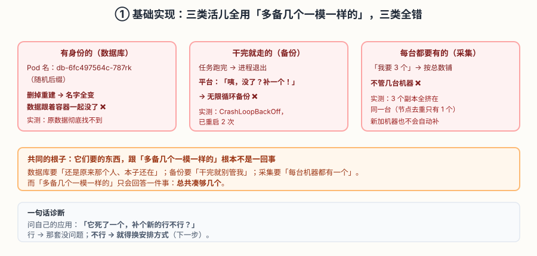
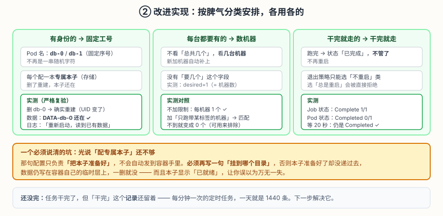
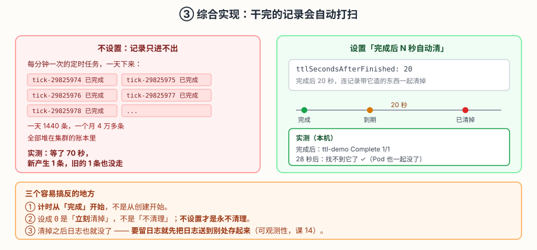

# 应用实战 · 三种命运的工作负载

> 对应课程：[第 6 课：StatefulSet / DaemonSet / Job：三种不同命运的工作负载](../stages/2-工作负载与控制器/lessons/lesson-06-StatefulSet与DaemonSet与Job.md) ｜ 覆盖知识点：StatefulSet、DaemonSet、Job 与 CronJob、TTL 清理
> 定位：**会用，不上生产**——课里学完，在这里动手。课内第四幕做的是「三种控制器各自是什么」的机制验证，这里做的是**一个接手新系统的完整过程：先犯错，再分类安排，最后收尾**。
> 📖 结论已按官方文档核对（核对于 2026-09 ｜ 来源：[StatefulSet](https://kubernetes.io/zh-cn/docs/concepts/workloads/controllers/statefulset/)、[DaemonSet](https://kubernetes.io/zh-cn/docs/concepts/workloads/controllers/daemonset/)、[Job](https://kubernetes.io/zh-cn/docs/concepts/workloads/controllers/job/)、[TTL 控制器](https://kubernetes.io/zh-cn/docs/concepts/workloads/controllers/ttlafterfinished/)）
> 🧪 **本篇全部输出为本机 kind 集群（v1.34.0）实测**，非推演；实测脚本见 `.plans/2026-09-16-k8s-应用实战补齐/t6-workloads.sh`、`t6-redo.sh`、`t6-redo2.sh`

---

## 场景：接手一个系统，三类东西要部署

**场景**：你接手了一个新系统，要部署三种东西：

- **一个 2 节点的数据库**——每个实例有自己的数据
- **一个每天凌晨的备份任务**——跑完就该结束
- **一个日志采集 agent**——每台机器上都要有

你刚学完课 5，Deployment 用得很顺手，于是**三种全用 Deployment 部署了**。

然后三件事陆续出问题。

**全貌一句话**：真实的有状态服务还要考虑主从选举、故障转移、备份恢复（通常由 Operator 实现）。本课只解决「选对控制器」这件事——**它提供的是身份和存储的基础设施，不保证数据一致**。

---

### ① 基础实现（能跑但幼稚）：一律「多备几个一模一样的」

三种都按「我要 N 个」来部署。

**①a 数据库：写数据 → 删一个 → 数据没了**

```bash
kubectl create ns app-l6

kubectl -n app-l6 apply -f - <<'EOF'
apiVersion: apps/v1
kind: Deployment
metadata:
  name: db
spec:
  replicas: 2
  selector:
    matchLabels: {app: db}
  template:
    metadata:
      labels: {app: db}
    spec:
      containers:
      - name: c
        image: busybox:1.36
        command: ["sh","-c"]
        args:
        - |
          mkdir -p /data
          echo "DATA-$(hostname | tail -c 6)" > /data/whoami
          sleep 3600
EOF
kubectl -n app-l6 rollout status deployment/db --timeout=180s
```

写入并干掉一个（本机实测）：

```
--- 初始两个 Pod ---
   db-b99d87bc6-dh2s7 -> DATA-dh2s7
   db-b99d87bc6-ftfhw -> DATA-ftfhw

--- 干掉 db-b99d87bc6-dh2s7（数据 DATA-dh2s7）---
   t=27s：旧 Pod 已彻底消失
--- 重建后 ---
   db-764566d968-4ffcm -> DATA-4ffcm
   db-764566d968-7zr99 -> DATA-7zr99

--- 判定 ---
   ❌ 原数据 [DATA-dh2s7] 在任何 Pod 上都找不到了 —— 数据丢了
```

**①b 备份任务：跑完就退出 → 被无限重启**

```bash
kubectl -n app-l6 apply -f - <<'EOF'
apiVersion: apps/v1
kind: Deployment
metadata:
  name: backup
spec:
  replicas: 1
  selector:
    matchLabels: {app: backup}
  template:
    metadata:
      labels: {app: backup}
    spec:
      containers:
      - name: c
        image: busybox:1.36
        command: ["sh","-c","echo '备份完成'; exit 0"]
EOF
sleep 35
kubectl -n app-l6 get pod -l app=backup --no-headers
# 实际输出：backup-7c6b9dc476-p9b78   0/1   CrashLoopBackOff   2 (21s ago)   35s
#                                            ↑ 已经重启 2 次了
```

**①c 采集 agent：3 个副本全挤在一台机器**

```bash
kubectl -n app-l6 apply -f - <<'EOF'
apiVersion: apps/v1
kind: Deployment
metadata:
  name: agent
spec:
  replicas: 3
  selector:
    matchLabels: {app: agent}
  template:
    metadata:
      labels: {app: agent}
    spec:
      containers:
      - name: c
        image: busybox:1.36
        command: ["sh","-c","sleep 3600"]
EOF
kubectl -n app-l6 get pod -l app=agent -o custom-columns='NAME:.metadata.name,NODE:.spec.nodeName'
# 实际输出（本机单节点集群）：
#   agent-66695c59d-48rnt   k8s-c1-control-plane
#   agent-66695c59d-hhhs9   k8s-c1-control-plane
#   agent-66695c59d-xc69h   k8s-c1-control-plane
#   节点去重: k8s-c1-control-plane        ← 3 个全在同一台
```



> 看图：三个红框是三类活儿各自的翻车方式。**根子是同一个**——它们要的东西跟「总共凑够几个」不是一回事。

> ⚠️ **它的问题**（三条，全是实测观察到的）：
> 1. **数据库**：名字是随机的（`db-b99d87bc6-dh2s7`），重建后变成 `db-764566d968-4ffcm`——**新来的不认识、也没带数据**，原数据彻底找不到。
> 2. **备份**：跑完退出，平台认为「没了=异常」，于是重启 → 再跑 → 再退出，**无限循环**（实测已重启 2 次且会一直下去）。
> 3. **采集**：`replicas: 3` 只保证「总共 3 个」，**不保证每台机器都有**——实测 3 个全在同一台。多节点集群上这意味着**其他机器漏采集**。
>
> ⚠️ **关于本环境的说明**：本机是 **kind 单节点集群**，所以「挤在一台」看起来无害（反正只有一台）。**多节点集群上这个问题会真正暴露**：你以为铺满了，实际只有部分机器有 agent。这正是它危险的原因——**在单机上测不出来**。

---

### ② 改进实现（被问题逼出来的下一步）：按脾气分类安排

先清掉错误的部署，然后各用各的。

**②a 数据库 → 固定工号 + 专属本子（StatefulSet）**

```bash
kubectl -n app-l6 apply -f - <<'EOF'
apiVersion: v1
kind: Service
metadata:
  name: db-hs
spec:
  clusterIP: None              # ← 无头服务：让「点名找人」成为可能
  selector: {app: db}
  ports:
  - port: 5432
---
apiVersion: apps/v1
kind: StatefulSet
metadata:
  name: db
spec:
  serviceName: db-hs           # ← 必须指向那个无头服务
  replicas: 2
  selector:
    matchLabels: {app: db}
  template:
    metadata:
      labels: {app: db}
    spec:
      containers:
      - name: c
        image: busybox:1.36
        command: ["sh","-c"]
        args:
        - |
          if [ ! -f /data/whoami ]; then
            echo "DATA-$(hostname)" > /data/whoami
            echo "首次启动，写入: $(cat /data/whoami)"
          else
            echo "重新启动，读到已有数据: $(cat /data/whoami)"
          fi
          sleep 3600
        volumeMounts:              # ← 关键：必须写，否则本子准备好了却没递过来
        - name: data
          mountPath: /data
  volumeClaimTemplates:          # ← 这只是「准备本子」
  - metadata:
      name: data
    spec:
      accessModes: ["ReadWriteOnce"]
      resources:
        requests:
          storage: 50Mi
EOF
kubectl -n app-l6 rollout status statefulset/db --timeout=240s
```

**严格复验：这次必须确认 Pod 是真的被重建了**（本机实测）：

```
删除前: 数据=DATA-db-0  IP=10.244.0.172
--- 轮询直到出现【新的】db-0（UID 变化才算真重建）---
   t=33s：新 db-0 就绪（UID 已变化 → 确实是重建）
删除后: 数据=DATA-db-0  IP=10.244.0.173
   UID: fb131115... -> a12ca197...

--- 日志 ---
   重新启动，读到已有数据: DATA-db-0

--- 判定 ---
   ✅ 严格通过：Pod 确实是新建的（UID 变了），但数据仍是同一份
```

> 🎯 **注意这里为什么要用 UID 判定**：我第一轮实测时，删掉 Pod 后它 3 秒就 `1/1`、IP 也没变、日志仍显示「首次启动」——**那其实是同一个 Pod 没被真正重建**，数据当然"还在"，但**这不能作为持久化的证据**。
>
> 改用 UID 变化作判据后，才拿到可信结论：UID 变了（真重建）、IP 从 `.172` 变 `.173`、日志明确打印「重新启动，读到已有数据」。
>
> ⚠️ **同时注意**：**IP 是会变的**（172 → 173）。所谓"稳定"的是**名字和 DNS**，不是 IP。所以配置里**必须写 DNS 名字，绝不能写 IP**。

DNS 点名（本机实测）：

```
Name:	db-0.db-hs.app-l6.svc.cluster.local
Address: 10.244.0.173          ← 指向新的 IP
```

> 🔑 **这就是「点名找人」**：名字不变，DNS 会自动跟到新 IP。写死名字永远有效，写死 IP 一重建就失效。

**②b 备份 → 干完就走（Job）**

```bash
kubectl -n app-l6 apply -f - <<'EOF'
apiVersion: batch/v1
kind: Job
metadata:
  name: backup
spec:
  template:
    spec:
      containers:
      - name: c
        image: busybox:1.36
        command: ["sh","-c","echo '备份完成'; exit 0"]
      restartPolicy: Never       # ← 不能用 Always，会被直接拒绝
EOF
kubectl -n app-l6 wait --for=condition=Complete job/backup --timeout=120s
```

本机实测：

```
   Job 状态: backup   Complete   1/1   4s    4s
   Pod 状态: backup-h44xl   0/1   Completed   0     4s
--- 等 20 秒看会不会被重启 ---
   20秒后: backup-h44xl   0/1   Completed   0     24s      ← 没被重启 ✓
```

**②c 采集 → 按机器铺（DaemonSet）**

```bash
kubectl -n app-l6 apply -f - <<'EOF'
apiVersion: apps/v1
kind: DaemonSet
metadata:
  name: agent
spec:
  selector:
    matchLabels: {app: agent}
  template:
    metadata:
      labels: {app: agent}
    spec:
      containers:
      - name: c
        image: busybox:1.36
        command: ["sh","-c","sleep 3600"]
EOF
kubectl -n app-l6 rollout status daemonset/agent --timeout=120s
```

本机实测：

```
--- DaemonSet 的 Pod 与节点 ---
   agent-9lrhx   k8s-c1-control-plane
--- 没有「要几个」这个字段，副本数由节点数决定 ---
   desired=1 ready=1
--- 加个「只跑带某标签的机器」的限制后 ---
   agent   0   0   0   0   0   disktype=ssd    ← 匹配不到就变 0 个
   剩余Pod: agent-9lrhx Terminating
```



> 看图：三张绿卡各有各的管法。**黄框那个坑特别值得看**：「准备本子」和「把本子挂上去」是两件事，漏了后者，本子显示已就绪但没递到容器手里。

> ⚠️ **它的问题**：**干完的记录不会自己消失**。
>
> ```bash
> kubectl -n app-l6 get job --no-headers
> # 实际输出：backup   Complete   1/1   4s    44s
> #           ↑ 跑完 44 秒了，还在
> ```
>
> 一个任务留一条记录不算什么。但**每分钟执行一次**的定时任务呢？

---

### ③ 综合实现：干完的记录会自动打扫

先看不打扫会怎样（本机实测，造一个每分钟的定时任务）：

```bash
kubectl -n app-l6 apply -f - <<'EOF'
apiVersion: batch/v1
kind: CronJob
metadata:
  name: tick
spec:
  schedule: "*/1 * * * *"        # 每分钟
  jobTemplate:
    spec:
      template:
        spec:
          containers:
          - name: c
            image: busybox:1.36
            command: ["sh","-c","echo tick-$(date +%H%M%S)"]
          restartPolicy: OnFailure
EOF
sleep 70
kubectl -n app-l6 get job --no-headers
# 实际输出：
#   backup          Complete   1/1   4s    114s     ← 一直留着
#   tick-29825974   Complete   1/1   3s    12s      ← 新产生一条
#   ↑ 每分钟多一条，永不清理
```

加上自动清理：

```bash
kubectl -n app-l6 apply -f - <<'EOF'
apiVersion: batch/v1
kind: Job
metadata:
  name: ttl-demo
spec:
  ttlSecondsAfterFinished: 20      # ← 完成后 20 秒自动清掉
  template:
    spec:
      containers:
      - name: c
        image: busybox:1.36
        command: ["sh","-c","echo ttl-test"]
      restartPolicy: Never
EOF
kubectl -n app-l6 wait --for=condition=Complete job/ttl-demo --timeout=120s

# 本机实测
#   完成后: ttl-demo   Complete   1/1   3s    3s
#   等 28 秒...
#   28秒后 Job: Error from server (NotFound): jobs.batch "ttl-demo" not found   ← 已清掉
#   28秒后 Pod: No resources found in app-l6 namespace.                          ← 连它造的 Pod 一起
```

定时任务也要加（写在定时任务模板里才会对每个任务生效）：

```bash
kubectl -n app-l6 patch cronjob tick --type=merge -p \
  '{"spec":{"jobTemplate":{"spec":{"ttlSecondsAfterFinished":20}}}}'
```



> 看图：左边是「只进不出」，右边是「到期连记录带它造的东西一起清掉」。**下面三个易搞反的地方尤其要看**。

> 🎯 **会用标志**：给你三类活儿（有身份的 / 每台都要有的 / 干完就走的），你能——
> - 各自选对控制器，并说清**为什么另外两个不行**；
> - 让有身份的那个在重建后**数据仍在**，且能用 **UID 变化**证明它是真重建而非没重建；
> - 解释为什么配置里要写 **DNS 名字而不是 IP**；
> - 给定时任务配上自动清理，并说清 `0` 与「不设置」的区别。

---

## 常见坑（本篇实测踩到的）

1. **「准备本子」≠「把本子挂上去」**：`volumeClaimTemplates` 只创建存储声明，必须另外写 `volumeMounts` 才会真正挂进容器。漏了的话存储显示「已就绪」，但数据写在容器临时层，一删就没——**而且看起来一切正常**。
2. **验证持久化时，先确认 Pod 真的重建了**：我第一轮就踩了——删完 3 秒就 `1/1`、IP 没变、日志还是「首次启动」，那其实**是同一个 Pod**。用 `metadata.uid` 变化作判据才可信。
3. **稳定的是名字和 DNS，不是 IP**：实测 IP 从 `.172` 变 `.173`。**配置里写死 IP，重建后一定连不上。**
4. **单节点集群测不出「挤在一台」**：本机是单节点，3 个副本全在一台看起来无害。**多节点集群上这才是真问题**——其他机器会漏采集。
5. **定时任务默认不会自动打扫**：每分钟一次、跑三个月就是十几万条记录堆在集群账本里，**查东西会变慢甚至撑爆**。这是生产环境真实发生过的事故。
6. **`ttlSecondsAfterFinished: 0` 是立刻清，不是禁用**：**不设置才是永不清理**。
7. **清掉之后日志也没了**：想留日志，得先把日志送到别处存起来（可观测性，课 14）。

---

## 🧭 导航

- ⬅️ 回到课程：[第 6 课：StatefulSet / DaemonSet / Job](../stages/2-工作负载与控制器/lessons/lesson-06-StatefulSet与DaemonSet与Job.md)
- 📚 全部实战：[应用实战索引](INDEX.md)
- ⬅️ 上一课实战：[05 · 上线不中断与一键回退](05-Deployment无状态应用.md)

**清理**：

```bash
kubectl -n app-l6 patch cronjob tick -p '{"spec":{"suspend":true}}' --type=merge 2>/dev/null
kubectl delete ns app-l6
```

> 💡 StatefulSet 的存储声明**不会**随 StatefulSet 删除而删除（故意的安全设计）。上面直接删整个命名空间才会连存储一起清掉——**这也是云盘费用的常见坑**：只删了 StatefulSet，磁盘还在计费。
