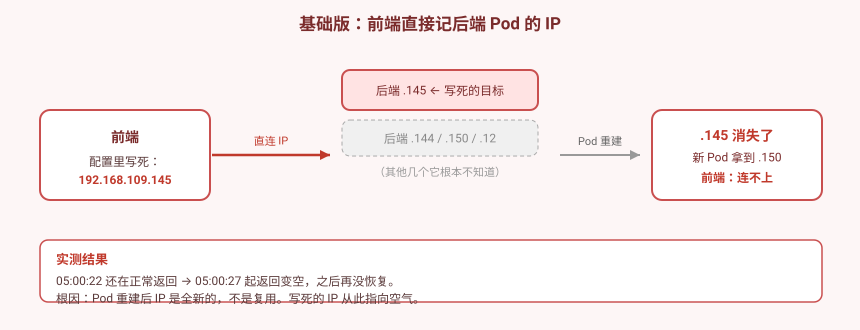
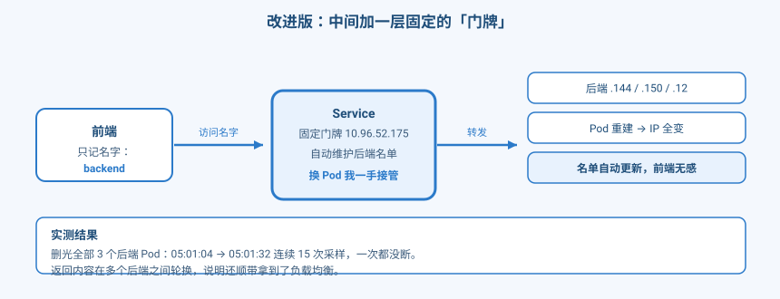
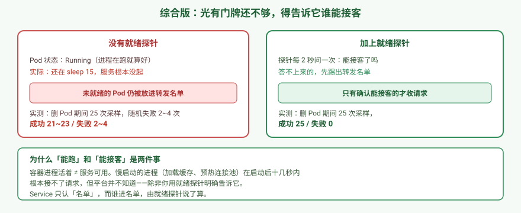

# 应用实战 · 让前端稳定找到后端

> 对应课程：[第 7 课：Service 与 CoreDNS：集群内寻址](../stages/3-网络与服务暴露/lessons/lesson-07-Service与CoreDNS.md) ｜ 覆盖知识点：Service 类型选型、EndpointSlice、CoreDNS 服务发现
> 定位：**会用，不上生产**——课里学完，在这里动手。课内第四幕做的是「四种 Service 长什么样、kube-proxy 怎么转发」的机制验证，这里做的是**一个真实故障的完整演进：先按直觉写，出问题，再一步步补对**。
> 📖 结论已按官方文档核对（核对于 2026-09 ｜ 来源：[Service](https://kubernetes.io/zh-cn/docs/concepts/services-networking/service/)、[EndpointSlice](https://kubernetes.io/zh-cn/docs/concepts/services-networking/endpoint-slices/)、[配置存活/就绪探针](https://kubernetes.io/zh-cn/docs/tasks/configure-pod-container/configure-liveness-readiness-startup-probes/)）
> 🧪 **本篇全部输出为本机 kind 集群 `k8s-c1-calico`（k8s v1.34.0 + Calico v3.31.0，3 节点）实测**，非推演；实测脚本见 `.plans/2026-09-16-k8s-应用实战补齐/t7-step1.sh` ~ `t7-step6.sh`

---

## 场景：一个上线后稳如老狗、某天突然全挂的前端

**场景**：你有个前端，要调后端接口。后端 3 个副本。

你查到了后端的 IP，写进前端配置里，**上线，一切正常**。日志刷刷地出，测试全过。

三天后后端因为节点维护重建了一次。**前端从此全挂**，而且没有任何报错——就是拿不到数据。

**全貌一句话**：真实生产里后端还有连接池、重试、熔断、服务网格（通常由 Service Mesh 承担）。本课只解决「怎么让它稳定找到对方」这件事——**它提供的是稳定的寻址入口，不保证对方永远健康**。

---

## 准备：一个会自报家门的后端

后端返回自己的名字，这样我们能看出请求到底打到了哪个 Pod。

```bash
kubectl create ns app-l7

kubectl -n app-l7 apply -f - <<'EOF'
apiVersion: apps/v1
kind: Deployment
metadata:
  name: backend
spec:
  replicas: 3
  selector:
    matchLabels: {app: backend}
  template:
    metadata:
      labels: {app: backend}
    spec:
      containers:
      - name: c
        image: busybox:1.36
        command: ["sh","-c"]
        args:
        - |
          mkdir -p /www
          echo "backend-$(hostname)" > /www/index.html
          exec httpd -f -p 80 -h /www
        ports:
        - containerPort: 80
EOF
kubectl -n app-l7 rollout status deployment/backend --timeout=180s
```

确认每个后端都能返回自己的名字（本机实测）：

```
   192.168.109.145 -> backend-backend-697c9f874c-2j4f5
   192.168.109.144 -> backend-backend-697c9f874c-t56jm
   192.168.53.12   -> backend-backend-697c9f874c-x7rvl
```

> 👀 注意这里有两个网段（`192.168.109.x` 和 `192.168.53.x`）——因为本机是 **3 节点集群**，Pod 分散在不同节点上。这一点后面会用到。

---

### ① 基础实现（能跑但幼稚）：把 IP 写进配置

取第一个后端的 IP，直接写死在前端里。

```bash
# 取一个后端 IP，写死进前端
FIRST_IP=$(kubectl -n app-l7 get pod -l app=backend -o jsonpath='{.items[0].status.podIP}')

kubectl -n app-l7 apply -f - <<EOF
apiVersion: apps/v1
kind: Deployment
metadata:
  name: frontend
spec:
  replicas: 1
  selector:
    matchLabels: {app: frontend}
  template:
    metadata:
      labels: {app: frontend}
    spec:
      containers:
      - name: c
        image: curlimages/curl:8.11.1
        command: ["sh","-c"]
        args:
        - |
          while true; do
            R=\$(curl -s --max-time 3 http://$FIRST_IP/ 2>&1)
            echo "[\$(date +%H:%M:%S)] 后端返回: \$R"
            sleep 2
          done
EOF
kubectl -n app-l7 rollout status deployment/frontend --timeout=180s
```

先确认它正常工作（本机实测）：

```
[04:59:52] 后端返回: backend-backend-697c9f874c-2j4f5
```

然后，**把这个被写死的后端 Pod 删掉**（用命令取名字，别抄我这里的随机后缀）：

```bash
# 取「当前占用这个 IP」的 Pod 名字，再删它
TARGET=$(kubectl -n app-l7 get pod -l app=backend \
  -o jsonpath="{.items[?(@.status.podIP=='$FIRST_IP')].metadata.name}")
echo "要删的后端 Pod: $TARGET"
kubectl -n app-l7 delete pod "$TARGET" --wait=true
```

前端日志（本机实测）：

```
[05:00:20] 后端返回: backend-backend-697c9f874c-2j4f5
[05:00:22] 后端返回: backend-backend-697c9f874c-2j4f5
[05:00:27] 后端返回: 
[05:00:32] 后端返回: 
                      ↑ 从这一刻起，永远是空的
```

新 Pod 拿到了一个**全新的 IP**（本机实测）：

```
--- 重建后的后端 Pod ---
   backend-697c9f874c-t56jm   192.168.109.144
   backend-697c9f874c-w4lft   192.168.109.150     ← 新 IP
   backend-697c9f874c-x7rvl   192.168.53.12
--- 判定 ---
   ❌ 旧 IP 192.168.109.145 已不在后端列表中
```



> 看图：红框那个就是写死的目标。**它一消失，前端就再也找不到路了**——而且旧 IP 不会被复用，新 Pod 拿的是全新地址。

> ⚠️ **它的问题**：
> 1. **IP 一重建就变，且不会复用**：实测 `.145` 消失后新 Pod 是 `.150`。写死的 IP 从此指向空气。
> 2. **失败是静默的**：日志里没有报错，只是返回变空。**这类故障最难排查**——你不知道是网络问题、后端挂了，还是地址写错了。
> 3. **其他两个后端它根本不知道**：你只写死了一个 IP，等于**主动放弃了另外两个副本**，负载均衡无从谈起。
>
> 🎯 **为什么这个错这么常见**：因为它在刚上线时**百分之百能跑通**。问题只在第一次 Pod 重建时才暴露——而那可能是三天后、也可能是你休假的时候。

---

### ② 改进实现（被问题逼出来的下一步）：加一层固定门牌

**不记 IP，记名字**。中间加一个 Service 负责把名字翻译成当前可用的后端。

```bash
kubectl -n app-l7 apply -f - <<'EOF'
apiVersion: v1
kind: Service
metadata:
  name: backend
spec:
  selector: {app: backend}
  ports:
  - port: 80
    targetPort: 80
EOF
```

前端改成访问名字：

```bash
kubectl -n app-l7 apply -f - <<'EOF'
apiVersion: apps/v1
kind: Deployment
metadata:
  name: frontend
spec:
  replicas: 1
  selector:
    matchLabels: {app: frontend}
  template:
    metadata:
      labels: {app: frontend}
    spec:
      containers:
      - name: c
        image: curlimages/curl:8.11.1
        command: ["sh","-c"]
        args:
        - |
          while true; do
            R=$(curl -s --max-time 3 http://backend/ 2>&1)
            echo "[$(date +%H:%M:%S)] 后端返回: $R"
            sleep 2
          done
EOF
kubectl -n app-l7 rollout status deployment/frontend --timeout=180s
```

Service 与它自动维护的后端名单（本机实测）：

```
NAME      TYPE        CLUSTER-IP     EXTERNAL-IP   PORT(S)   AGE
backend   ClusterIP   10.96.52.175   <none>        80/TCP    2s

后端名单: 192.168.53.12, 192.168.109.144, 192.168.109.150
```

**现在把 3 个后端 Pod 全删光**（比第一跳更狠）：

```bash
kubectl -n app-l7 delete pod -l app=backend --wait=false
```

> ⚠️ **取日志前必须先等新前端 Pod 就绪**——否则 `kubectl logs deployment/frontend` 会读到**正在退出的旧 Pod**（它还拿着写死的 IP，日志里就是空的，你会误以为 Service 没用）。**我自己在复验时就踩了这个坑**。

前端日志（本机实测，**全程无中断，8/8 全部有返回**）：

```
[05:35:12] 后端返回: backend-backend-697c9f874c-mlvxx
[05:35:14] 后端返回: backend-backend-697c9f874c-mlvxx
[05:35:18] 后端返回: backend-backend-697c9f874c-94shn   ← 新 Pod 接上了
[05:35:20] 后端返回: backend-backend-697c9f874c-94shn
[05:35:22] 后端返回: backend-backend-697c9f874c-v9t5f   ← 换人了
[05:35:24] 后端返回: backend-backend-697c9f874c-mlvxx
[05:35:26] 后端返回: backend-backend-697c9f874c-v9t5f
```

> 🎯 **注意返回的 hostname 在变**——说明请求被分发到了不同的后端。**负载均衡是白送的**：你只是想要个稳定地址，顺带拿到了流量分发。



> 看图：前端只认「门牌」，Pod 换了一批又一批，门牌不动。**谁在门牌后面，由平台自动维护**。

> ⚠️ **它的问题**：**门牌只管「名单上有没有」，不管「这个人能不能接客」**。
>
> 平台判断一个 Pod 能不能进名单，默认只看一件事：**容器进程在不在**。但进程在 ≠ 服务可用——**慢启动的服务**（加载缓存、预热连接池、等依赖）在启动后十几秒内根本接不了请求。

---

### ③ 综合实现：告诉门牌谁能接客

先复现这个问题。部署一个**慢启动**的后端（15 秒后才真正起服务），**不加就绪探针**：

```bash
kubectl -n app-l7 apply -f - <<'EOF'
apiVersion: apps/v1
kind: Deployment
metadata:
  name: backend
spec:
  replicas: 3
  selector:
    matchLabels: {app: backend}
  template:
    metadata:
      labels: {app: backend}
    spec:
      containers:
      - name: c
        image: busybox:1.36
        command: ["sh","-c"]
        args:
        - |
          sleep 15
          mkdir -p /www
          echo "backend-$(hostname)" > /www/index.html
          exec httpd -f -p 80 -h /www
        ports:
        - containerPort: 80
EOF
```

**关键观察**：Pod 起来后（还在 `sleep 15`，httpd 根本没起），它**已经是「健康」状态，并堂而皇之地进了转发名单**（本机实测）：

```
--- Pod 状态 ---
NAME                       READY
backend-7b576f77f4-hnzfc   True      ← 显示健康！
backend-7b576f77f4-k9mg2   True
backend-7b576f77f4-wwvw5   True

--- 转发名单 ---
   addr=['192.168.53.44']    ready=True    ← 被认为是可用的
   addr=['192.168.109.179']  ready=True
   addr=['192.168.109.147']  ready=True
```

> 🔑 **这是本篇最值得记住的一屏，也是最反直觉的地方**：
>
> 它**不是**「被标记为未就绪、却还留在名单里」——而是**被当成了完全健康的 Pod，正常混进名单**。
>
> 原因：平台判断健康的默认标准是**容器主进程在不在**。而这里主进程是 `sleep 15`，进程当然在——于是 `READY=True`。**平台完全不知道 httpd 还没起。**

现在访问它——前 5 次全部失败（本机实测）：

```
  第 1 次: 000        ← 打到了那个还没起服务的 Pod
  第 2 次: 000
  第 3 次: 000
  第 4 次: 000
  第 5 次: 000
  第 6 次: 200        ← 15 秒后 httpd 起来了，才恢复
```

> 💡 **这段 `000` 就是生产环境「发布后头几秒报错」的真凶**。它不是网络抖动，是**请求被分发到了还没准备好的实例**。

**现在加上就绪探针**（用完整配置覆盖，保证照抄能跑通）：

```bash
kubectl -n app-l7 apply -f - <<'EOF'
apiVersion: apps/v1
kind: Deployment
metadata:
  name: backend
spec:
  replicas: 3
  selector:
    matchLabels: {app: backend}
  template:
    metadata:
      labels: {app: backend}
    spec:
      containers:
      - name: c
        image: busybox:1.36
        command: ["sh","-c"]
        args:
        - |
          sleep 15
          mkdir -p /www
          echo "backend-$(hostname)" > /www/index.html
          exec httpd -f -p 80 -h /www
        ports:
        - containerPort: 80
        readinessProbe:              # ← 关键：真正的「能不能接客」
          httpGet:
            path: /
            port: 80
          initialDelaySeconds: 3
          periodSeconds: 2
EOF
kubectl -n app-l7 rollout status deployment/backend --timeout=240s
```

> ⚠️ **别用 `kubectl patch` 加探针**：`patch` 合并数组时会把容器定义整个替换，导致 `spec.template.spec.containers[0].image: Required value` 报错（本机实测确认）。**探针这类字段改动，用完整 `apply` 覆盖最稳**。

**严格对照实验**（本机实测，同一集群、同一操作，只有探针这一处不同）：

| 场景 | 采样次数 | 成功 | 失败 |
|---|---|---|---|
| 稳定态基线（带探针，什么都不删） | 20 | **20** | **0** |
| 删光后端 Pod（**带**就绪探针） | 25 | **25** | **0** |
| 删光后端 Pod（**无**就绪探针） | 25 | **21 ~ 23** | **2 ~ 4** |

> 📊 **关于数值浮动**：无探针那一行的失败次数**每次跑不一样**（本机三轮实测分别失败 4、4、2 次）。这很正常——它取决于「新 Pod 进入名单」和「请求恰好打过去」这两个时机是否撞上。**别把 4 当成精确值**，记住结论就行：**有探针稳定零失败，没探针会随机失败若干次**。

> 🎯 **这张表就是本篇的结论**：同样的「删光后端 Pod」操作，**有探针稳定零失败，没探针会随机失败若干次**。
>
> 差别在于：没探针时，新 Pod 一 `Running` 就被当成健康的塞进名单，请求打到它身上时 httpd 还没起 → 失败。有探针时，新 Pod 必须**先证明自己能接客**才进名单。



> 看图：**「能跑」和「能接客」是两件事**。平台默认只知道前者，后者要靠你告诉它。

---

### ④ 附：让集群外也能访问（NodePort 与 ExternalName）

前面解决的都是**集群内**寻址。真要让外部访问，还需要别的类型。

**NodePort**——在每个节点上开一个固定端口：

```bash
kubectl -n app-l7 apply -f - <<'EOF'
apiVersion: v1
kind: Service
metadata:
  name: backend-np
spec:
  type: NodePort
  selector: {app: backend}
  ports:
  - port: 80
    targetPort: 80
    nodePort: 30080
EOF
```

从集群外部经**任意节点**的 30080 端口访问（本机实测，3 节点都能通）：

```
  control-plane(172.27.0.6):30080 -> backend-backend-79c996c68b-qvkqb
  worker(172.27.0.4):30080       -> backend-backend-79c996c68b-qvkqb
  worker2(172.27.0.5):30080      -> backend-backend-79c996c68b-rrgj6
```

> 🎯 **注意 worker 和 worker2 返回了不同的后端**——说明不管从哪个节点进，都会被转发到健康的 Pod 上。**这是 NodePort 和「直连某个 Pod」的本质区别**。

**ExternalName**——给集群外部的服务起个集群内的别名：

```bash
kubectl -n app-l7 apply -f - <<'EOF'
apiVersion: v1
kind: Service
metadata:
  name: ext-example
spec:
  type: ExternalName
  externalName: example.com
EOF
```

集群内解析这个别名（本机实测）：

```
ext-example.app-l7.svc.cluster.local	canonical name = example.com
```

> 🔑 **它的价值**：你的代码里写 `ext-example`，将来外部服务换了域名，只改 Service 一处，**不用重新打包应用**。

**三种类型怎么选**：

| 类型 | 用在哪 | 本机实测状态 |
|---|---|---|
| ClusterIP | 集群内互相访问（默认，最常用） | `10.96.172.59` ✅ |
| NodePort | 开发/测试环境从外部访问 | `80:30080/TCP` ✅ |
| LoadBalancer | 云上生产环境对外暴露 | kind 无云厂商，`EXTERNAL-IP` 恒为 `<pending>` ⚠️ |
| ExternalName | 给外部服务起集群内别名 | 解析到 `example.com` ✅ |

> ⚠️ **关于 LoadBalancer**：kind 这类本地集群没有云厂商的负载均衡器，`EXTERNAL-IP` 会一直是 `<pending>`。**这是环境限制，不是你配错了**。生产环境需要 MetalLB 或云厂商支持。

---

> 🎯 **会用标志**：给你一个「前端要调后端」的需求，你能——
> - 说清为什么**不能写死 Pod IP**，并用「旧 IP 不复用」的实测证据支撑；
> - 建一个 Service 让前端只认名字，并验证**删光后端 Pod 也不中断**；
> - 解释为什么 Service **必须配就绪探针**，并拿出「有探针 0 失败 / 无探针 4 失败」的对照；
> - 在 ClusterIP / NodePort / ExternalName 之间按场景选型，并说清 LoadBalancer 在 kind 上为什么用不了。

---

## 常见坑（本篇实测踩到的）

1. **它在刚上线时百分之百能跑通**：写死 IP 的问题只在 **Pod 第一次重建**时才暴露。所以"测试通过了"不能证明它是对的。
2. **重建后 IP 不复用**：实测 `.145` 消失、新 Pod 拿 `.150`。别指望"重启后还是原来那个 IP"。
3. **没配就绪探针时，慢启动 Pod 会被当成健康的混进名单**：它**不是**标成 `ready=False` 还赖在名单里，而是 `READY=True`、名单里 `ready=True`——**平台根本不知道它还没准备好**。这比"明知不健康还转发"更隐蔽。
4. **「进程活着」≠「服务可用」**：慢启动服务（加载缓存、预热连接池）在 `Running` 之后的十几秒里接不了请求。**这是生产环境发布期报错的常见来源**。
5. **验证探针效果必须先等滚动完成**：我第一轮实测时旧 Pod 还在滚动中，数据混在一起不可信。**等 `rollout status` 跑完、所有 Pod 都是新版本后再采样**。
6. **删除 Pod 时别用 `--wait=true`**：会阻塞到删除完成，你就观察不到切换瞬间了。用 `--wait=false` 然后立刻开始采样。
6. **取日志前先看滚动有没有完成**：`kubectl logs deployment/xxx` 在滚动期间可能读到**正在退出的旧 Pod**。我复验时因此看到「6 行全空」，误判成 Service 没生效——**实际是读错了 Pod**。先 `rollout status` 再取日志。
7. **删除 Pod 时别用 `--wait=true`**：会阻塞到删除完成，你就观察不到切换瞬间了。用 `--wait=false` 然后立刻开始采样。
8. **LoadBalancer 在 kind 上恒为 `<pending>`**：不是配置错误，是环境没有负载均衡器实现。**别在这上面浪费时间排查**。

---

## 🧭 导航

- ⬅️ 回到课程：[第 7 课：Service 与 CoreDNS](../stages/3-网络与服务暴露/lessons/lesson-07-Service与CoreDNS.md)
- 📚 全部实战：[应用实战索引](INDEX.md)
- ⬅️ 上一课实战：[06 · 三种命运的工作负载](06-StatefulSet与DaemonSet与Job.md)

**清理**：

```bash
kubectl delete ns app-l7
```

> 💡 **进阶思考**：本篇解决了「稳定找到对方」，但还有个问题没解决——**如果所有后端都不健康，前端会一直拿到失败**。真实系统里这会触发重试风暴和级联故障。那是**熔断与重试**（服务网格的活）要解决的问题，超出本课范围。
