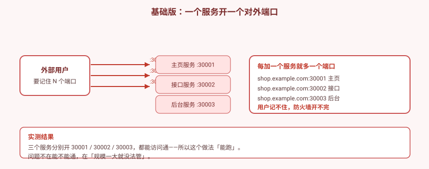
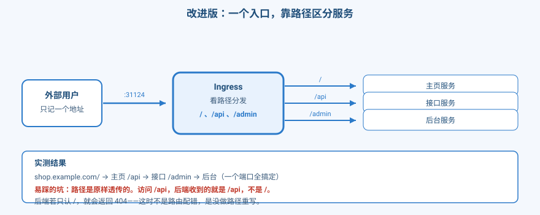
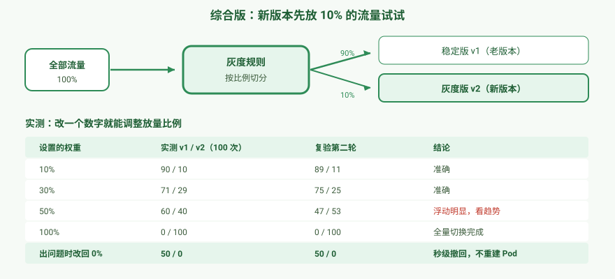

# 应用实战 · 一个域名挂多个服务，还能灰度放量

> 对应课程：[第 8 课：Ingress：七层路由与灰度发布](../stages/3-网络与服务暴露/lessons/lesson-08-Ingress七层路由与灰度发布.md) ｜ 覆盖知识点：Ingress 规则与路径匹配、灰度发布与流量切分
> 定位：**会用，不上生产**——课里学完，在这里动手。课内第四幕做的是「Controller 装不装的区别、路径怎么匹配、ingress-nginx 为什么退役」的机制验证，这里做的是**一个真实的演进：对外端口越开越多怎么办 → 收敛成一个入口 → 新版本怎么安全地放出去**。
> 📖 结论已按官方文档核对（核对于 2026-09 ｜ 来源：[Ingress](https://kubernetes.io/zh-cn/docs/concepts/services-networking/ingress/)、[ingress-nginx 注解](https://kubernetes.github.io/ingress-nginx/user-guide/nginx-configuration/annotations/)）
> 🧪 **本篇全部输出为本机 kind 集群 `k8s-c1-calico`（k8s v1.34.0 + Calico v3.31.0，3 节点 + ingress-nginx）实测**，非推演；实测脚本见 `.plans/2026-09-16-k8s-应用实战补齐/t8-step1.sh` ~ `t8-step5.sh`

---

## 场景：三个服务，三个端口，用户记不住

**场景**：你上线了一个小商城，有三个服务——主页、接口、后台。

最直觉的做法：每个服务开一个对外端口。**上线，全通**。

然后服务涨到 10 个。**你要开 10 个端口，用户要记 10 个端口，防火墙要放行 10 个端口**。更要命的是：想给新版本试试水，得让用户手动换个端口访问——那不叫灰度，那叫"另开一个网站"。

**全貌一句话**：真实生产里入口还有 TLS  termination、WAF、限流、可观测性（通常由云厂商 LB 或 Gateway 承担）。本课只解决「怎么收敛入口 + 怎么安全地放新版」——**它提供的是七层路由能力，不替代安全与治理体系**。

---

## 准备：三个会自报家门的服务

每个服务返回自己的名字和**收到的完整路径**——这样我们能看清请求到底去了哪、路径被改成什么样了。

```bash
kubectl create ns shop

for N in home api admin; do
kubectl -n shop apply -f - <<EOF
apiVersion: apps/v1
kind: Deployment
metadata:
  name: $N
spec:
  replicas: 1
  selector:
    matchLabels: {app: $N}
  template:
    metadata:
      labels: {app: $N}
    spec:
      containers:
      - name: nginx
        image: nginx:alpine
        command: ["/bin/sh","-c"]
        args:
        - |
          printf '%s\n' 'server {' '  listen 80;' '  default_type text/plain;' '  location / {' "    return 200 \"SERVICE=$N RECEIVED_URI=\\\$request_uri\";" '  }' '}' > /etc/nginx/conf.d/default.conf
          exec nginx -g 'daemon off;'
        ports:
        - containerPort: 80
EOF
done
kubectl -n shop rollout status deployment/home --timeout=180s
kubectl -n shop rollout status deployment/api --timeout=180s
kubectl -n shop rollout status deployment/admin --timeout=180s
```

> ⚠️ **别在 return 里写 `\n`**：nginx 会把它当成字面量输出，你会看到 `RECEIVED_URI=\/api` 这种带反斜杠的结果。**本篇用 `printf` 生成配置，不带换行转义**——照抄就能得到干净输出。

> 💡 **为什么要回显 `RECEIVED_URI`**：这是本篇最关键的一手证据。后面你会看到，Ingress 转发时**路径是原样透传的**——访问 `/api`，后端收到的就是 `/api`，不是 `/`。**这个细节能让大量"配了路由却 404"的谜案当场破案。**

**确认入口控制器已就位**（本机实测）：

```
kubectl get ingressclass
NAME    CONTROLLER             PARAMETERS   AGE
nginx   k8s.io/ingress-nginx   <none>       3h47m

# 入口的对外端口
kubectl -n ingress-nginx get svc ingress-nginx-controller
NAME                       TYPE           CLUSTER-IP      EXTERNAL-IP   PORT(S)
ingress-nginx-controller   LoadBalancer   10.96.110.202   <pending>     80:31124/TCP,443:32350/TCP
                                                          ↑ kind 无云厂商，恒为 pending（环境限制，不是你配错）
```

> ⚠️ **先记下这个 `31124`**——后面所有访问都走它。你的机器上可能不同，用上面的命令自己查。

---

### ① 基础实现（能跑但幼稚）：一个服务一个端口

```bash
kubectl -n shop apply -f - <<'EOF'
apiVersion: v1
kind: Service
metadata:
  name: home-np
spec:
  type: NodePort
  selector: {app: home}
  ports:
  - port: 80
    targetPort: 80
    nodePort: 30001
---
apiVersion: v1
kind: Service
metadata:
  name: api-np
spec:
  type: NodePort
  selector: {app: api}
  ports:
  - port: 80
    targetPort: 80
    nodePort: 30002
---
apiVersion: v1
kind: Service
metadata:
  name: admin-np
spec:
  type: NodePort
  selector: {app: admin}
  ports:
  - port: 80
    targetPort: 80
    nodePort: 30003
EOF
```

三个端口都能通（本机实测，节点 IP `172.27.0.6`）：

```
  :30001 -> SERVICE=home  RECEIVED_URI=/
  :30002 -> SERVICE=api   RECEIVED_URI=/
  :30003 -> SERVICE=admin RECEIVED_URI=/
```



> 看图：**它完全能跑**——三个端口都返回了正确内容。问题不在"通不通"。

> ⚠️ **它的问题**（都在规模变大后才暴露）：
> 1. **端口数量随服务数量线性增长**：3 个服务 3 个端口，10 个服务 10 个端口。**每加一个服务，防火墙就要多开一次**。
> 2. **用户要记住端口**：`shop.example.com:30002` 这种地址没人记得住，也没法印在名片上。
> 3. **没法做灰度**：想让 10% 用户用新版？让他们访问 `:30004` 吗——那已经不是灰度，是另开一个站了。
> 4. **每个服务都直接对外**：攻击面全开，没法在入口统一做限流、鉴权、日志。
>
> 🎯 **为什么这个错这么常见**：因为它在服务少的时候**没有任何症状**。等你有 10 个服务时才发现，已经有一堆端口开在外面收不回来了。

---

### ② 改进实现（被问题逼出来的下一步）：一个入口，靠路径区分

**把对外端口收敛成一个**，内部改成普通服务（ClusterIP），中间加一层按路径分发。

```bash
# 先删掉那三个 NodePort
kubectl -n shop delete svc home-np api-np admin-np

# 改成 ClusterIP（只在集群内可见）
kubectl -n shop apply -f - <<'EOF'
apiVersion: v1
kind: Service
metadata:
  name: home-svc
spec:
  selector: {app: home}
  ports: [{port: 80, targetPort: 80}]
---
apiVersion: v1
kind: Service
metadata:
  name: api-svc
spec:
  selector: {app: api}
  ports: [{port: 80, targetPort: 80}]
---
apiVersion: v1
kind: Service
metadata:
  name: admin-svc
spec:
  selector: {app: admin}
  ports: [{port: 80, targetPort: 80}]
EOF
```

**一条规则，按路径分发三个服务**：

```bash
kubectl -n shop apply -f - <<'EOF'
apiVersion: networking.k8s.io/v1
kind: Ingress
metadata:
  name: shop-ingress
spec:
  ingressClassName: nginx
  rules:
  - host: shop.example.com
    http:
      paths:
      - path: /
        pathType: Prefix
        backend:
          service:
            name: home-svc
            port: {number: 80}
      - path: /api
        pathType: Prefix
        backend:
          service:
            name: api-svc
            port: {number: 80}
      - path: /admin
        pathType: Prefix
        backend:
          service:
            name: admin-svc
            port: {number: 80}
EOF
```

**一个端口，路径区分三个服务**（本机实测）：

```
  shop.example.com/       ->  SERVICE=home   RECEIVED_URI=/
  shop.example.com/api    ->  SERVICE=api    RECEIVED_URI=/api
  shop.example.com/admin  ->  SERVICE=admin  RECEIVED_URI=/admin
```

子路径也命中（本机实测）：

```
  /api/v1/users     ->  SERVICE=api    RECEIVED_URI=/api/v1/users
  /admin/settings   ->  SERVICE=admin  RECEIVED_URI=/admin/settings
```



> ⚠️ **最容易踩的坑——路径是原样透传的**：
>
> 看 `RECEIVED_URI=/api`：**Ingress 不会把 `/api` 改写成 `/`**。后端收到的就是完整路径。
>
> 所以如果你的后端只认 `/`（比如一个静态站点，或者只在根路径挂了服务），访问 `/api` 就会 **404**。
>
> 🎯 **我实测时就被这个坑绊了一次**：第一版后端用的 busybox httpd（只有 `/`），结果 `/api`、`/admin` 全部 404。我一度以为是 Ingress 配错了——**实际是后端根本没有那个路径**。判断方法很简单：**绕过 Ingress，直接 curl Service**，看后端自己返不返回 404。
>
> 真需要改写路径时，要用 rewrite 注解（ingress-nginx 是 `nginx.ingress.kubernetes.io/rewrite-target`），**这是注解，不是 Ingress 标准字段**——标准里没有路径重写。

**两条对照，帮你确认理解对了**（本机实测）：

```
  # 未匹配的路径：/ 是 Prefix，所以 /nothing 也归 home
  /nothing  ->  SERVICE=home  RECEIVED_URI=/nothing

  # host 不匹配 -> 404
  other.example.com/  -> HTTP 404
```

---

### ③ 综合实现：新版本先放 10% 试试

前面解决了"入口收敛"，现在解决"**新版本怎么安全地放出去**"。

**核心思路**：v1、v2 同时跑着，**入口按比例把流量分给两边**。出问题把比例调回 0，秒级撤回——**不用重建任何 Pod**。

```bash
# 两个版本，各自独立的服务
for V in v1 v2; do
kubectl -n shop apply -f - <<EOF
apiVersion: apps/v1
kind: Deployment
metadata:
  name: web-$V
spec:
  replicas: 2
  selector:
    matchLabels: {app: web, version: $V}
  template:
    metadata:
      labels: {app: web, version: $V}
    spec:
      containers:
      - name: nginx
        image: nginx:alpine
        command: ["/bin/sh","-c"]
        args:
        - |
          cat > /etc/nginx/conf.d/default.conf <<'CONF'
          server { listen 80; default_type text/plain;
            location / { return 200 "VERSION=$V\n"; } }
          CONF
          nginx -g 'daemon off;'
        ports:
        - containerPort: 80
EOF
done

kubectl -n shop apply -f - <<'EOF'
apiVersion: v1
kind: Service
metadata:
  name: web-v1-svc
spec:
  selector: {app: web, version: v1}
  ports: [{port: 80, targetPort: 80}]
---
apiVersion: v1
kind: Service
metadata:
  name: web-v2-svc
spec:
  selector: {app: web, version: v2}
  ports: [{port: 80, targetPort: 80}]
EOF
```

**先全量 v1**（基线）：

```bash
kubectl -n shop apply -f - <<'EOF'
apiVersion: networking.k8s.io/v1
kind: Ingress
metadata:
  name: web-ingress
spec:
  ingressClassName: nginx
  rules:
  - host: web.example.com
    http:
      paths:
      - path: /
        pathType: Prefix
        backend:
          service:
            name: web-v1-svc
            port: {number: 80}
EOF
```

采样 20 次 → **v1=20, v2=0**（本机实测）。

**加一条灰度规则，放 10%**：

```bash
kubectl -n shop apply -f - <<'EOF'
apiVersion: networking.k8s.io/v1
kind: Ingress
metadata:
  name: web-ingress-canary
  annotations:
    nginx.ingress.kubernetes.io/canary: "true"
    nginx.ingress.kubernetes.io/canary-weight: "10"
spec:
  ingressClassName: nginx
  rules:
  - host: web.example.com
    http:
      paths:
      - path: /
        pathType: Prefix
        backend:
          service:
            name: web-v2-svc
            port: {number: 80}
EOF
```

**逐步放量**（本机实测，每档采样 100 次）：

```bash
# 只改一个注解就能调比例，不用动任何 Deployment
kubectl -n shop annotate ingress web-ingress-canary \
  nginx.ingress.kubernetes.io/canary-weight="30" --overwrite
```

| 设置的权重 | 实测 v1 / v2（100 次） | 复验第二轮 | 结论 |
|---|---|---|---|
| 10% | 90 / 10 | 89 / 11 | 准确 |
| 30% | 71 / 29 | 75 / 25 | 准确 |
| 50% | 60 / 40 | 47 / 53 | 浮动明显，看趋势 |
| 100% | 0 / 100 | 0 / 100 | 全量切换完成 |
| **出问题改回 0%** | **50 / 0** | **50 / 0** | **秒级撤回，不用重建任何 Pod** |

> 📊 **关于 50% 那档的偏差**：两次实测分别是 **40%** 和 **53%**——都偏离 50%，且一个偏低一个偏高。
>
> **这不是配置错了**，是**采样量不够时的正常浮动**。灰度是按请求随机的，样本越少偏差越明显（100 次采样的标准误差约 ±5%）。
>
> 🎯 **记住结论而不是数值**：比例随设置单调上升（10 → 30 → 50 → 100），且 0% 和 100% 两端是精确的。**中间档位看趋势，别拿单次采样当精确值**。



**按请求头分流**（内部测试全量走新版，外部用户不受影响）：

```bash
kubectl -n shop annotate ingress web-ingress-canary \
  nginx.ingress.kubernetes.io/canary-by-header="X-Canary" --overwrite
kubectl -n shop annotate ingress web-ingress-canary \
  nginx.ingress.kubernetes.io/canary-by-header-value="always" --overwrite
```

实测（本机）：

```
  带 X-Canary: always  ->  VERSION=v2     ← 测试人员走新版
  不带头               ->  VERSION=v1     ← 普通用户不受影响
  X-Canary: never      ->  VERSION=v1     ← 显式指定不走新版
```

> 🎯 **这一招的价值**：**新版上线前，先让内部流量验证一遍**，确认没问题再按权重一点点放给真实用户。这比"直接全量切、出问题再回滚"安全得多。

---

### ④ 附：`pathType` 三选一，选错了就 404

`pathType` 有三个值，实战中最容易在这里翻车。**同一个 `/api`，两种写法结果完全不同**（本机实测）：

| 请求路径 | `Exact` | `Prefix` |
|---|---|---|
| `/api` | 200 | 200 |
| `/api/` | **404** | 200 |
| `/api/v1` | **404** | 200 |
| `/apixyz` | 404 | **404** |

> 🔑 **记住这个区别**：
> - **`Exact`**：只认**一模一样**的路径。`/api/v1` 不算。
> - **`Prefix`**：按**路径段**匹配。`/api`、`/api/`、`/api/v1` 都算，**但 `/apixyz` 不算**——因为它不是以 `/api/` 这个完整段开头的。
> - **`ImplementationSpecific`**：匹配行为由 Controller 决定，**换 Controller 就可能换行为**，尽量别用。
>
> 🎯 **实战建议**：想让 `/api` 及其子路径都走同一个服务，用 **`Prefix`**。这也是绝大多数场景的选择。

---

### ⑤ 附：Ingress 只是一张声明，Controller 才干活

把 `ingressClassName` 改成一个不存在的 Controller：

```bash
kubectl -n shop apply -f - <<'EOF'
apiVersion: networking.k8s.io/v1
kind: Ingress
metadata:
  name: no-controller
spec:
  ingressClassName: does-not-exist      # ← 没有这个 Controller
  rules:
  - host: nc.example.com
    http:
      paths:
      - path: /
        pathType: Prefix
        backend:
          service:
            name: home-svc
            port: {number: 80}
EOF
```

结果（本机实测）：

```
NAME            CLASS            HOSTS            ADDRESS   PORTS   AGE
no-controller   does-not-exist   nc.example.com             80      5s
                                                ↑ 空 —— 没人认领它

  nc.example.com/ -> HTTP 404
```

> 🎯 **这是理解 Ingress 最关键的一点**：
>
> **Ingress 资源创建成功了**（etcd 里确实有这条声明），**但访问不通**——因为**没有 Controller 去执行它**。
>
> 就像写好了菜谱，但厨房里没有厨师。对照实验：**把 class 改回 `nginx`，立刻就通了**。
>
> 💡 **排障口诀**：Ingress 配完不通，**先看 `ADDRESS` 列有没有值**。空 = 没有 Controller 认领它，去查 `ingressClassName` 拼没拼错、Controller 装没装。

---

> 🎯 **会用标志**：给你一个"多个服务要对外、还要发新版"的需求，你能——
> - 说清为什么**不能一个服务一个 NodePort**，并能讲出端口数随服务数线性增长的问题；
> - 用一条 Ingress 把多个服务收敛到一个入口，并验证**路径分流生效**；
> - 解释**路径是原样透传的**，遇到"配了路由却 404"时知道先绕过 Ingress 直连 Service 排查；
> - 用 canary 注解做灰度放量，并说清**改权重是秒级的、不用重建 Pod**；
> - 在 `Exact` / `Prefix` 之间正确选择，并解释 `/apixyz` 为什么不匹配 `Prefix /api`；
> - 用 `ADDRESS` 列是否为空，判断"是规则写错了"还是"没有 Controller 在执行"。

---

## 常见坑（本篇实测踩到的）

1. **「能跑通」不等于「该这么做」**：三个 NodePort 全部访问成功，但端口数会随服务数线性增长。**这类问题在服务少的时候完全没有症状**。
2. **路径是原样透传的，不会重写**：访问 `/api`，后端收到的就是 `/api`。后端只认 `/` 就会 404——**不是 Ingress 配错了**。
3. **排查 404 先绕过 Ingress**：直连 Service curl 一下，看后端自己返不返回 404。**我实测时因为后端只有 `/`，误以为是 Ingress 配错，白查了一轮**。
4. **`curl | head -1` 会骗人**：响应体首行可能是缓冲块而非真实内容。要看完整响应用 `tr -d '\n'` 或直接不截断。
5. **灰度比例看趋势不看单次**：50% 那档实测 40%，是 100 次采样下的正常浮动。**别把单次采样当精确值**。
6. **canary 相关注解是 ingress-nginx 私有的**：`canary-weight`、`canary-by-header` 都**不是 Ingress 标准字段**，换了 Controller 就不认。这正是课内讲"ingress-nginx 退役"的背景之一。
7. **`ImplementationSpecific` 尽量别用**：匹配行为取决于 Controller，换 Controller 就可能变。**想可移植就用 `Prefix` 或 `Exact`**。
8. **kind 上 `EXTERNAL-IP` 恒为 `<pending>`**：没有云厂商负载均衡器，**这是环境限制**。`NodePort` 端口（本篇是 `31124`）才是本机真正的入口。

---

## 🧭 导航

- ⬅️ 回到课程：[第 8 课：Ingress：七层路由与灰度发布](../stages/3-网络与服务暴露/lessons/lesson-08-Ingress七层路由与灰度发布.md)
- 📚 全部实战：[应用实战索引](INDEX.md)
- ⬅️ 上一课实战：[07 · 让前端稳定找到后端](07-Service与CoreDNS.md)

**清理**：

```bash
kubectl delete ns shop
```

> 💡 **进阶思考**：本篇用 canary 注解做灰度，但**这些注解是 ingress-nginx 私有的**——换 Controller 就得重写。这正是**下一课 Gateway API** 要解决的问题：把灰度做成标准字段（`weight` 是一等公民），不再依赖各家的注解。另外，灰度只解决"流量怎么分"，**不解决"新版本到底健不健康"**——那需要指标与自动回滚，超出本课范围。
