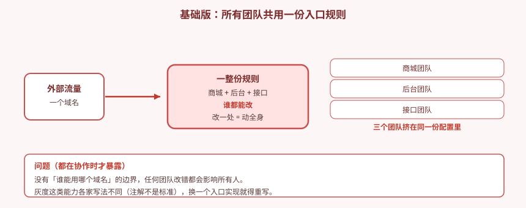
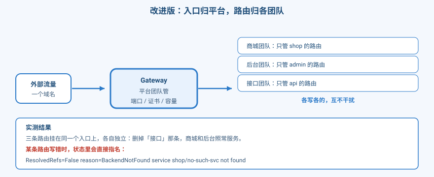
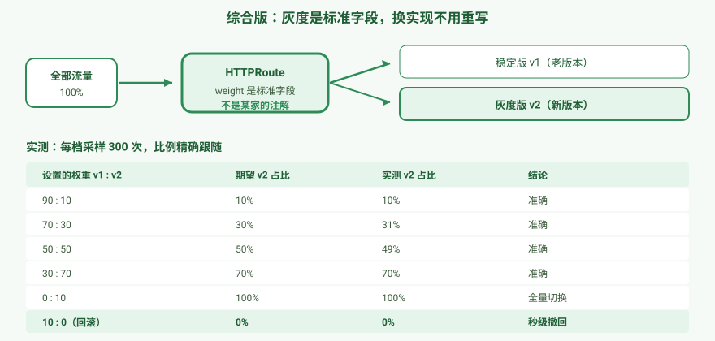

# 应用实战 · 多团队共用一个入口，还能各管各的

> 对应课程：[第 9 课：Gateway API：下一代入口标准](../stages/3-网络与服务暴露/lessons/lesson-09-GatewayAPI下一代入口标准.md) ｜ 覆盖知识点：Gateway API 三层模型、HTTPRoute 与流量治理
> 定位：**会用，不上生产**——课里学完，在这里动手。课内第四幕做的是「三层模型的状态传播、跨命名空间与 ReferenceGrant」的机制验证，这里做的是**一个真实的协作场景：多个团队共用一个入口，怎么做到互不干扰**，以及**灰度从"各家的注解"变成"标准字段"意味着什么**。
> 📖 结论已按官方文档核对（核对于 2026-09 ｜ 来源：[Gateway API 流量分割](https://gateway.envoyproxy.io/v0.5/user/http-traffic-splitting)、[Envoy WeightedCluster](https://www.envoyproxy.io/docs/envoy/latest/api-v3/config/route/v3/route_components.proto)）
> 🧪 **本篇全部输出为本机 kind 集群 `k8s-c1-calico`（k8s v1.34.0 + Calico v3.31.0，3 节点 + Envoy Gateway）实测**，非推演；实测脚本见 `.plans/2026-09-16-k8s-应用实战补齐/t9-step1.sh` ~ `t9-order.sh`

---

## 场景：三个团队挤在同一份入口配置里

**场景**：公司一个入口，三个团队共用——商城、后台、接口。

**全貌一句话**：真实生产里入口还牵扯 TLS 卸载、WAF、限流、多集群容灾。**本课只解决「多团队怎么安全地共用入口」和「灰度怎么不绑定某一家实现」**——它提供的是标准化的七层路由能力，不替代安全与治理体系。

---

## 准备：先把入口立起来

```bash
kubectl create ns shop

# 两个版本的应用（后面灰度用）
for V in v1 v2; do
kubectl -n shop apply -f - <<EOF
apiVersion: apps/v1
kind: Deployment
metadata:
  name: web-$V
spec:
  replicas: 2
  selector:
    matchLabels: {app: web, version: $V}
  template:
    metadata:
      labels: {app: web, version: $V}
    spec:
      containers:
      - name: nginx
        image: nginx:alpine
        command: ["/bin/sh","-c"]
        args:
        - |
          printf '%s\n' 'server {' '  listen 80;' '  default_type text/plain;' '  location / {' "    return 200 \"VERSION=$V\";" '  }' '}' > /etc/nginx/conf.d/default.conf
          exec nginx -g 'daemon off;'
        ports:
        - containerPort: 80
EOF
done

kubectl -n shop apply -f - <<'EOF'
apiVersion: v1
kind: Service
metadata:
  name: web-v1-svc
spec:
  selector: {app: web, version: v1}
  ports: [{port: 80, targetPort: 80}]
---
apiVersion: v1
kind: Service
metadata:
  name: web-v2-svc
spec:
  selector: {app: web, version: v2}
  ports: [{port: 80, targetPort: 80}]
EOF
```

**Gateway 由平台团队建一次**（业务团队不用碰它）：

```bash
kubectl -n shop apply -f - <<'EOF'
apiVersion: gateway.envoyproxy.io/v1alpha1
kind: EnvoyProxy
metadata:
  name: nodeport-config
  namespace: shop
spec:
  provider:
    type: Kubernetes
    kubernetes:
      envoyService:
        type: NodePort
---
apiVersion: gateway.networking.k8s.io/v1
kind: Gateway
metadata:
  name: eg-gateway
  namespace: shop
spec:
  gatewayClassName: eg
  infrastructure:
    parametersRef:
      group: gateway.envoyproxy.io
      kind: EnvoyProxy
      name: nodeport-config
  listeners:
  - name: http
    protocol: HTTP
    port: 80
    allowedRoutes:
      namespaces:
        from: All
EOF
```

> ⚠️ **kind 环境必须指定 `NodePort`**：没有云厂商负载均衡器，默认的 `LoadBalancer` 会一直卡在 `Programmed=False`。**这不是你配错了**，是环境限制。

等它就绪（本机实测约 30 秒）：

```bash
kubectl -n shop get gateway eg-gateway \
  -o jsonpath='{range .status.conditions[*]}{.type}={.status} reason={.reason}{"\n"}{end}'
```
```
Accepted=True reason=Accepted
Programmed=True reason=Programmed
```

**取到入口端口**（每次创建都会变，**别照抄数字**）：

```bash
GW_SVC=$(kubectl -n envoy-gateway-system get svc -o name | grep 'envoy-shop')
NP=$(kubectl -n envoy-gateway-system get "$GW_SVC" \
  -o jsonpath='{.spec.ports[?(@.port==80)].nodePort}')
echo "NodePort = $NP"      # 本机实测：31357
```

---

### ① 基础实现（能跑但幼稚）：所有团队共用一份规则

先用最直觉的方式——**把所有团队的路由都写在一起**，谁都能改。



> ⚠️ **它的问题**（都在协作时才暴露）：
> 1. **没有边界**：商城团队手滑改错一处，后台和接口一起挂。
> 2. **出事互相甩锅**：一条巨大的规则文件，看不出哪段是谁的。
> 3. **灰度靠各家注解**：`canary-weight` 这类是**某一家实现的私货**（[上一篇](08-Ingress七层路由与灰度发布.md)已经踩过），换一个入口实现就得全部重写。
>
> 🎯 **为什么这个错这么常见**：因为**只有你一个人干活的时候，它完全没问题**。等到三四个团队往同一份配置里塞东西，冲突才开始。

---

### ② 改进实现：入口归平台，路由归各团队

Gateway API 的核心思路是**把"基础设施"和"业务路由"拆成两层**：

- **`Gateway`**（平台团队管一次）：端口、证书、容量、允许谁接入。
- **`HTTPRoute`**（各团队自己管）：我的域名、我的路径、我的后端。

**三个团队各写各的**（本机实测）：

```bash
for T in shop admin api; do
kubectl -n shop apply -f - <<EOF
apiVersion: gateway.networking.k8s.io/v1
kind: HTTPRoute
metadata:
  name: route-$T
  namespace: shop
spec:
  parentRefs:
  - name: eg-gateway
  hostnames:
  - "$T.example.com"
  rules:
  - matches:
    - path:
        type: PathPrefix
        value: /
    backendRefs:
    - name: web-v1-svc
      port: 80
EOF
done
```

三条路由各自独立（本机实测）：

```
  shop.example.com   ->  VERSION=v1
  admin.example.com  ->  VERSION=v1
  api.example.com    ->  VERSION=v1
  other.example.com  -> HTTP 404
```



**故障隔离——删掉一条，其他两条照常**（本机实测）：

```bash
kubectl -n shop delete httproute route-api
```
```
  shop.example.com   ->  VERSION=v1      ← 不受影响
  admin.example.com  ->  VERSION=v1      ← 不受影响
  api.example.com    -> HTTP 404         ← 只有被删的那条断了
```

**写错时，状态里直接指名道姓**（本机实测）：

```bash
# 故意引用一个不存在的 Service
kubectl -n shop apply -f - <<'EOF'
apiVersion: gateway.networking.k8s.io/v1
kind: HTTPRoute
metadata:
  name: route-broken
  namespace: shop
spec:
  parentRefs:
  - name: eg-gateway
  hostnames:
  - "broken.example.com"
  rules:
  - matches:
    - path:
        type: PathPrefix
        value: /
    backendRefs:
    - name: no-such-svc          # ← 不存在
      port: 80
EOF

kubectl -n shop get httproute route-broken \
  -o jsonpath='{range .status.parents[*]}{range .conditions[*]}{.type}={.status} reason={.reason} msg={.message}{"\n"}{end}{end}'
```
```
Accepted=True reason=Accepted msg=Route is accepted
ResolvedRefs=False reason=BackendNotFound msg=Failed to process route rule 0 backendRef 0: service shop/no-such-svc not found.
```

> 🎯 **这条状态信息就是 Gateway API 相对 Ingress 的核心价值**：
>
> `msg` 里**直接写出**「第 0 条规则的第 0 个后端，service shop/no-such-svc 找不到」——**不用猜就知道是谁错了**。而且这个错误**只影响这一条路由**，其他团队的路由照常服务（实测确认）。
>
> 💡 **排障口诀**：路由不通，**先看 `ResolvedRefs`**。它是 `False` 就说明后端引用有问题，`msg` 里会写清楚是哪一个。

---

### ③ 综合实现：灰度是标准字段，不是某家的注解

[上一篇](08-Ingress七层路由与灰度发布.md)做灰度用的 `nginx.ingress.kubernetes.io/canary-weight`——**那是 ingress-nginx 的私有注解**，换个入口实现就全废了。

Gateway API 把 `weight` 做成了**一等公民字段**：

```bash
kubectl -n shop apply -f - <<'EOF'
apiVersion: gateway.networking.k8s.io/v1
kind: HTTPRoute
metadata:
  name: canary-route
  namespace: shop
spec:
  parentRefs:
  - name: eg-gateway
  hostnames:
  - "canary.example.com"
  rules:
  - backendRefs:
    - name: web-v1-svc
      port: 80
      weight: 90
    - name: web-v2-svc
      port: 80
      weight: 10
EOF
```

**逐步放量**（本机实测，每档采样 300 次）：

| 设置的权重 v1 : v2 | 期望 v2 占比 | 实测 v2 占比 | 结论 |
|---|---|---|---|
| 90 : 10 | 10% | **10%** | 准确 |
| 70 : 30 | 30% | **31%** | 准确 |
| 50 : 50 | 50% | **49%** | 准确 |
| 30 : 70 | 70% | **70%** | 准确 |
| 0 : 10 | 100% | **100%** | 全量切换 |
| **10 : 0（回滚）** | **0%** | **0%** | **秒级撤回** |



> 🔑 **`weight` 是相对值，不用凑 100**：设 `1 : 1` 实测 **50%**，和 `50 : 50` 完全等价。官方文档的说法是「单个后端的比例 = 它的 weight ÷ 所有 weight 之和」。

**按请求头分流**（同样是标准字段）：

```bash
kubectl -n shop apply -f - <<'EOF'
apiVersion: gateway.networking.k8s.io/v1
kind: HTTPRoute
metadata:
  name: header-route
  namespace: shop
spec:
  parentRefs:
  - name: eg-gateway
  hostnames:
  - "hdr.example.com"
  rules:
  - matches:
    - headers:
      - type: Exact
        name: X-Canary
        value: always
    backendRefs:
    - name: web-v2-svc
      port: 80
  - backendRefs:
    - name: web-v1-svc
      port: 80
EOF
```

实测（本机）：

```
  带 X-Canary: always  ->  VERSION=v2     ← 测试人员走新版
  不带头               ->  VERSION=v1     ← 普通用户不受影响
  X-Canary: other      ->  VERSION=v1     ← 值不匹配，走兜底规则
```

**路径重写——这次也是标准的**（对比上一篇要写各家私有注解）：

```bash
kubectl -n shop apply -f - <<'EOF'
apiVersion: gateway.networking.k8s.io/v1
kind: HTTPRoute
metadata:
  name: rewrite-route
  namespace: shop
spec:
  parentRefs:
  - name: eg-gateway
  hostnames:
  - "rw.example.com"
  rules:
  - matches:
    - path:
        type: PathPrefix
        value: /api
    filters:
    - type: URLRewrite
      urlRewrite:
        path:
          type: ReplacePrefixMatch
          replacePrefixMatch: /
    backendRefs:
    - name: echo-svc
      port: 80
EOF
```
```
  rw.example.com/api/xxx  -> HTTP 200     ← /api 前缀被替换成 /
  rw.example.com/         -> HTTP 404     ← 不匹配 /api，无兜底规则
```

> 🎯 **回顾上一篇**：Ingress 里"路径原样透传、不会被重写"导致过 404，要改写只能靠各家私有的 `rewrite-target` 注解。这里 `URLRewrite` 是**标准 filter**，换任何支持 Gateway API 的实现都能用。

---

### ④ 陷阱：两条路由抢同一个 host，先建的赢

这是**我实测时踩的坑**，值得单独说——因为它**从状态里完全看不出来**。

**现象**：我怎么改 `canary-route` 的 weight，流量都恒定在 90% v2，纹丝不动。我一度以为是 Envoy 有权重精度问题，还去翻了官方文档和 Envoy 源码——**方向全错**。

**真实原因**：我之前创建过一条 `only-v2` 路由，**它也用了 `canary.example.com`**，权重是 `1:9`。它先建，所以一直生效；我后面改的那条根本没被采用。

**严格对照实验**（本机实测，每档 300 次）：

| 实验 | 创建顺序 | 结果 v2 占比 | 谁生效 |
|---|---|---|---|
| A | 先 A(90:10) → 后 B(10:90) | **10%** | 先建的 A |
| B | 先 B(10:90) → 后 A(90:10) | **89%** | 先建的 B |
| C | 只有 A(90:10) | 8% | 基线正确 |
| D | 只有 B(10:90) | 90% | 基线正确 |

而**两条路由的状态都是 `Accepted=True`**，看不出任何冲突：

```
  canary-route:  Accepted=True  ResolvedRefs=True
  route-b:       Accepted=True  ResolvedRefs=True
```

> ⚠️ **结论**：**同一个 host 上挂多条路由时，先创建的那条胜出，后建的被静默忽略，且状态里不报冲突**。
>
> 💡 **排查方法**：改了 weight 却不生效，**先查有没有多条路由匹配同一个 host**：
> ```bash
> kubectl get httproute -o custom-columns='NAME:.metadata.name,HOSTNAMES:.spec.hostnames'
> ```
>
> 🎯 **教训**：我在这上面绕了一大圈，原因是**先怀疑工具、后怀疑自己的环境**。正确的顺序是反过来——**先确认环境里有没有残留，再怀疑实现**。

---

> 🎯 **会用标志**：给你一个"多团队共用入口"的需求，你能——
> - 说清为什么**不能把所有团队的路由写在一起**，并能讲出"没有边界、出事甩锅"的问题；
> - 用 `Gateway`（平台管一次）+ 多条 `HTTPRoute`（各团队自管）搭出职责分离的入口；
> - 用 `ResolvedRefs=False` 的 `msg` **直接定位**是哪个 backend 引用错了；
> - 用标准 `weight` 字段做灰度放量，并说清它**是相对值、不用凑 100**；
> - 用标准 `URLRewrite` filter 做路径重写，并对比出它相对私有注解的优势；
> - 遇到"改了权重不生效"，知道**先查是否有多条路由抢同一个 host**。

---

## 常见坑（本篇实测踩到的）

1. **kind 上 Gateway 必须指定 `NodePort`**：默认 `LoadBalancer` 会卡在 `Programmed=False`（无云厂商 LB）。**这是环境限制，不是配错**。
2. **NodePort 每次创建都变**：务必用命令动态取，别照抄数字（本机实测 `31357`，你的机器上一定不同）。
3. **两条路由抢同一 host，先建的赢**：后建的被静默忽略，**且状态都是 `Accepted=True`，看不出冲突**。改权重不生效时先查这个。
4. **先怀疑环境，再怀疑工具**：我因为没查残留路由，把"先建者胜出"误判成"Envoy 权重精度问题"，白查了一轮官方文档和源码。
5. **`weight` 不用凑 100**：`1:1` 等价 `50:50`。它是相对值。
6. **`0:10` 是全量切换、`10:0` 是回滚**：保留 weight=0 的后端，回滚时只改数字、不改结构。
7. **无兜底规则时匹配不上就是 404**：按头分流那条，头值不匹配（`X-Canary: other`）就落到最后一条兜底规则——**别忘了写兜底**。
8. **采样量要够**：100 次采样的浮动约 ±5%。本篇每档 300 次，比例才稳定可信。

---

## 🧭 导航

- ⬅️ 回到课程：[第 9 课：Gateway API：下一代入口标准](../stages/3-网络与服务暴露/lessons/lesson-09-GatewayAPI下一代入口标准.md)
- 📚 全部实战：[应用实战索引](INDEX.md)
- ⬅️ 上一篇：[08 · 一个入口收敛多服务与灰度放量](08-Ingress七层路由与灰度发布.md)
- ➡️ 下一篇：[10 · 只让该连的连上，数据库不再裸奔](10-NetworkPolicy微隔离.md)

**清理**：

```bash
kubectl delete ns shop
```

> 💡 **进阶思考**：本篇用 Gateway API 解决了"入口的标准化"，但**它只管南北向（外部进来）流量**。**服务之间（东西向）谁能访问谁，Gateway 管不着**——那要靠网络策略在 IP/端口层做隔离。这正是**下一篇 NetworkPolicy** 要解决的问题：当"谁能访问谁"这件事发生在集群内部时，怎么做最小权限。
