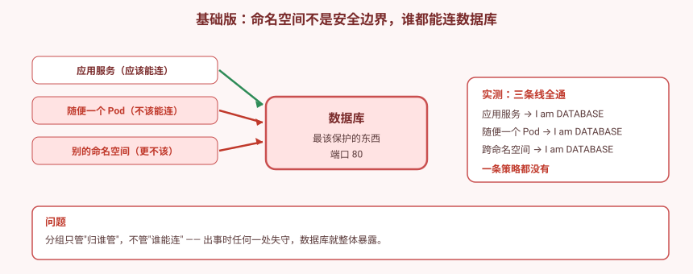
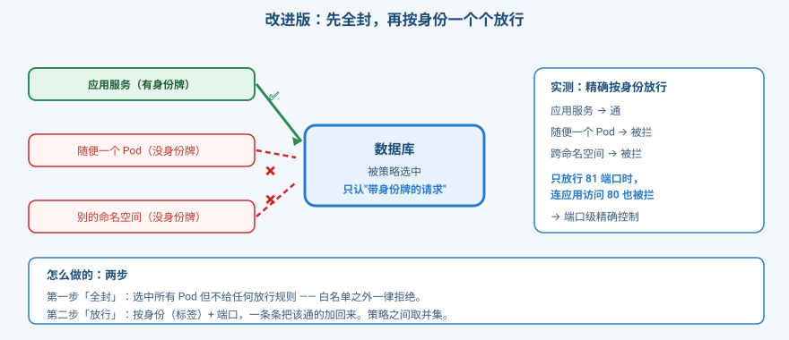
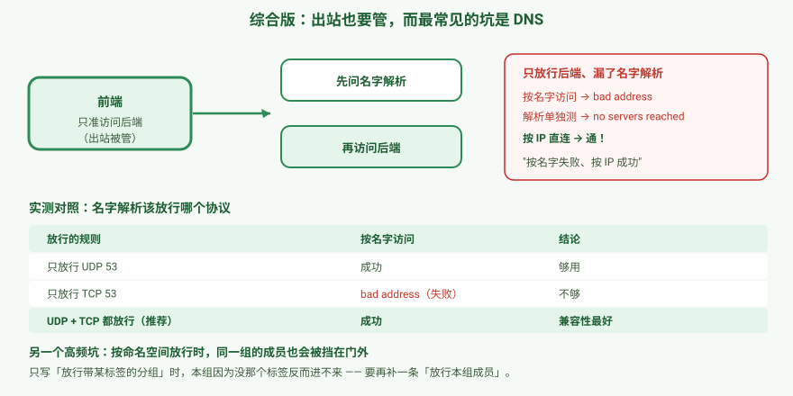

# 应用实战 · 只让该连的连上，数据库不再裸奔

> 对应课程：[第 10 课：NetworkPolicy：集群内防火墙](../stages/3-网络与服务暴露/lessons/lesson-10-NetworkPolicy集群内防火墙.md) ｜ 覆盖知识点：NetworkPolicy 白名单模型、selector 与 ipBlock
> 定位：**会用，不上生产**——课里学完，在这里动手。课内第四幕做的是「default-deny、策略叠加、DNS 陷阱」的机制验证（单节点 kindnet）；这里做的是**一个真实的防护场景：三层应用里数据库只允许应用访问**，并在**三节点 + Calico** 环境下补上课内无法验证的部分：跨节点、按命名空间放行、按网段放行。
> 📖 结论已按官方文档核对（核对于 2026-09 ｜ 来源：[NetworkPolicy 官方文档](https://kubernetes.io/docs/concepts/services-networking/network-policies/)、[Calico NetworkPolicy](https://docs.tigera.io/calico/latest/network-policy/get-started/kubernetes-policy)）
> 🧪 **本篇全部输出为本机 kind 集群 `k8s-c1-calico`（k8s v1.34.0 + Calico v3.31.0，1 control-plane + 2 worker）实测**，非推演；实测脚本见 `.plans/2026-09-16-k8s-应用实战补齐/t10-step1.sh` ~ `t10-ipblock.sh`

---

## 场景：数据库谁都能连

**场景**：一个三层应用——应用服务、数据库，外加一个"本来不该碰数据库"的服务。

**全貌一句话**：真实生产里网络隔离还牵扯东西向全部流量、Service Mesh、零信任、审计合规。**本课只解决「谁能连谁」这一层的最小连通**——它提供的是**三层/四层（IP + 端口）**的访问控制，**不理解 HTTP 路径、不校验身份**，也不是完整的安全体系。

> ⚠️ **先确认你的环境支持**：NetworkPolicy 由 **CNI 插件**执行。不装支持的 CNI，策略**配了完全没反应**（`apply` 成功但不生效，且资源**没有 status 字段**可以看）。先跑下面这条：
> ```bash
> kubectl -n kube-system get pod -o name | grep -iE 'calico|cilium|kindnet|flannel'
> ```
> 常见情况：**Calico / Cilium / kindnet 支持**，**Flannel 不支持**。本篇实测环境为 Calico v3.31.0。

---

## 准备：搭一个三层应用

```bash
kubectl create ns np

# 数据库：最该被保护的东西
kubectl -n np apply -f - <<'EOF'
apiVersion: apps/v1
kind: Deployment
metadata:
  name: db
spec:
  replicas: 1
  selector:
    matchLabels: {app: db, tier: data}
  template:
    metadata:
      labels: {app: db, tier: data}
    spec:
      containers:
      - name: nginx
        image: nginx:alpine
        command: ["/bin/sh","-c"]
        args:
        - |
          printf '%s\n' 'server {' '  listen 80;' '  default_type text/plain;' '  location / {' \
            '    return 200 "I am DATABASE\n";' '  }' '}' > /etc/nginx/conf.d/default.conf
          exec nginx -g 'daemon off;'
        ports:
        - containerPort: 80
---
apiVersion: v1
kind: Service
metadata:
  name: db-svc
spec:
  selector: {app: db}
  ports: [{port: 80, targetPort: 80}]
EOF

# 应用服务：应该能连数据库
kubectl -n np apply -f - <<'EOF'
apiVersion: apps/v1
kind: Deployment
metadata:
  name: api
spec:
  replicas: 1
  selector:
    matchLabels: {app: api, tier: app}
  template:
    metadata:
      labels: {app: api, tier: app}
    spec:
      containers:
      - name: nginx
        image: nginx:alpine
        command: ["/bin/sh","-c"]
        args:
        - |
          printf '%s\n' 'server {' '  listen 80;' '  default_type text/plain;' '  location / {' \
            '    return 200 "I am API\n";' '  }' '}' > /etc/nginx/conf.d/default.conf
          exec nginx -g 'daemon off;'
        ports:
        - containerPort: 80
---
apiVersion: v1
kind: Service
metadata:
  name: api-svc
spec:
  selector: {app: api}
  ports: [{port: 80, targetPort: 80}]
EOF

# 一个"不该碰数据库"的服务
kubectl -n np apply -f - <<'EOF'
apiVersion: apps/v1
kind: Deployment
metadata:
  name: attacker
spec:
  replicas: 1
  selector:
    matchLabels: {app: attacker, tier: other}
  template:
    metadata:
      labels: {app: attacker, tier: other}
    spec:
      containers:
      - name: sh
        image: alpine:3.20
        command: ["sleep","3600"]
EOF
```

> 💡 **为什么用 `tier` 标签**：后面放行规则要按"身份"而不是按"名字"来放行。用 `tier: app / data / other` 表达角色，是最小权限的常用写法。

---

### ① 基础实现（能跑但幼稚）：什么都不配

先看看**不写任何策略**时是什么样（本机实测）：

```bash
API=$(kubectl -n np get pod -l app=api -o jsonpath='{.items[0].metadata.name}')
ATK=$(kubectl -n np get pod -l app=attacker -o jsonpath='{.items[0].metadata.name}')

kubectl -n np exec $API -- wget -q -T 5 -O - "http://db-svc/"
kubectl -n np exec $ATK -- wget -q -T 5 -O - "http://db-svc/"
```
```
I am DATABASE      ← 应用服务，应该能连
I am DATABASE      ← 不该连的，也连上了
```

**再试跨命名空间**（本机实测）：

```bash
kubectl create ns other
kubectl -n other run outsider --image=alpine:3.20 --restart=Never --command -- sleep 3600
kubectl -n other wait --for=condition=Ready pod/outsider --timeout=120s
kubectl -n other exec outsider -- wget -q -T 5 -O - "http://db-svc.np/"
```
```
I am DATABASE      ← 别的命名空间也连上了
```



> ⚠️ **它的问题（三条线全通）**：
> 1. **命名空间不是网络边界**——它只是"归谁管"的分组，管不了"谁能连"。
> 2. **一个 Pod 失守 = 数据库整体暴露**——没有任何收敛。
> 3. **出事无法止损**——你想隔离，却没有任何手段。
>
> 🎯 **为什么这个错这么常见**：因为**默认行为就是全通**，而全通的时候一切正常。只有出了安全事件，才会发现"原来谁都能连"。

---

### ② 改进实现：先全封，再按身份一个个放行

NetworkPolicy 是**白名单模型**：只能写"允许"，不能写"拒绝"。所以做法是**两步**——

**第一步：全封**（选中所有 Pod，但不给任何放行规则）

```bash
kubectl -n np apply -f - <<'EOF'
apiVersion: networking.k8s.io/v1
kind: NetworkPolicy
metadata:
  name: default-deny-ingress
  namespace: np
spec:
  podSelector: {}          # 空 = 选中本命名空间所有 Pod
  policyTypes:
  - Ingress                # 只管入站
EOF
```

**第二步：按身份放行**（只放该通的）

```bash
kubectl -n np apply -f - <<'EOF'
apiVersion: networking.k8s.io/v1
kind: NetworkPolicy
metadata:
  name: db-allow-from-app
  namespace: np
spec:
  podSelector:
    matchLabels:
      app: db              # 这条策略作用在数据库上
  policyTypes:
  - Ingress
  ingress:
  - from:
    - podSelector:
        matchLabels:
          tier: app        # 只允许带"应用"身份牌的来
    ports:
    - protocol: TCP
      port: 80
EOF
```

**实测结果**（本机）：

```
    api      -> db-svc : ✅ 通 (I am DATABASE)
    attacker -> db-svc : ❌ 被拦 (timed out)
    outsider -> db-svc : ❌ 被拦 (timed out)
```



**端口级精确控制**（本机实测）：把放行端口改成 `81` 再测 `80`——

```
    api -> db-svc:80（只放行 81）: ❌ 被拦
```

> 🔑 **策略是并集（OR），不是覆盖**：`default-deny` 还在，但叠加的放行策略让它恢复。**没有优先级、没有"拒绝优先"**。想收紧只能**删策略**。

**因果对照**（证明确实是策略在起作用）：

```bash
kubectl -n np delete netpol db-allow-from-app
sleep 6
# → 连应用服务也被拦（回到全封）
# 加回来 → 应用服务恢复，其他仍被拦
```

> 💡 **排障：失败现象要会区分**
> - `Connection refused` → 端口没监听，**不是**策略问题
> - `download timed out` → 被策略丢弃（DROP）的典型特征
> - `bad address` / `no servers could be reached` → 名字解析被拦，查出站策略

---

### ③ 综合实现：出站也要管，而最常见的坑是名字解析

前面管的是**入站**（谁能连数据库）。现在管**出站**（数据库之外的服务能主动连谁）。

**场景**：前端只允许访问后端，其他一律不准出去。

```bash
kubectl create ns npe

# 后端（目标）+ 前端（要出站）
kubectl -n npe apply -f - <<'EOF'
apiVersion: apps/v1
kind: Deployment
metadata:
  name: backend
spec:
  replicas: 1
  selector:
    matchLabels: {app: backend}
  template:
    metadata:
      labels: {app: backend}
    spec:
      containers:
      - name: nginx
        image: nginx:alpine
        command: ["/bin/sh","-c"]
        args:
        - |
          printf '%s\n' 'server {' '  listen 80;' '  default_type text/plain;' '  location / {' \
            '    return 200 "I am BACKEND\n";' '  }' '}' > /etc/nginx/conf.d/default.conf
          exec nginx -g 'daemon off;'
        ports:
        - containerPort: 80
---
apiVersion: v1
kind: Service
metadata:
  name: backend-svc
spec:
  selector: {app: backend}
  ports: [{port: 80, targetPort: 80}]
---
apiVersion: apps/v1
kind: Deployment
metadata:
  name: frontend
spec:
  replicas: 1
  selector:
    matchLabels: {app: frontend}
  template:
    metadata:
      labels: {app: frontend}
    spec:
      containers:
      - name: sh
        image: alpine:3.20
        command: ["sleep","3600"]
EOF

for D in backend frontend; do
  kubectl -n npe rollout status deployment/$D --timeout=180s
done
```

**只放行到后端**（不放出站的名字解析，坑就在这里）：

```bash
kubectl -n npe apply -f - <<'EOF'
apiVersion: networking.k8s.io/v1
kind: NetworkPolicy
metadata:
  name: egress-to-backend-only
  namespace: npe
spec:
  podSelector:
    matchLabels:
      app: frontend
  policyTypes:
  - Egress                 # 管出站
  egress:
  - to:
    - podSelector:
        matchLabels:
          app: backend
    ports:
    - protocol: TCP
      port: 80
EOF
```

**然后坑就来了**（本机实测）：

```
  【A】按 Service 名访问:
  wget: bad address 'backend-svc'

  【B】按 Pod IP 直连:
  I am BACKEND              ← 成功！

  【C】名字解析单独测:
  ;; connection timed out; no servers could be reached
```

> 🎯 **「按名字失败、按 IP 成功」= 名字解析被拦的诊断信号**。这是 NetworkPolicy **最高频的坑**，没有之一。
>
> 原因很直白：按名字访问要**先问名字解析**（DNS，端口 53），你只放行了到后端的 80，**没放行 53**。

**修复：补一条放行名字解析**

```bash
kubectl -n npe apply -f - <<'EOF'
apiVersion: networking.k8s.io/v1
kind: NetworkPolicy
metadata:
  name: egress-allow-dns
  namespace: npe
spec:
  podSelector:
    matchLabels:
      app: frontend
  policyTypes:
  - Egress
  egress:
  - to:
    - namespaceSelector:
        matchLabels:
          kubernetes.io/metadata.name: kube-system
      podSelector:
        matchLabels:
          k8s-app: kube-dns
    ports:
    - protocol: UDP
      port: 53
    - protocol: TCP
      port: 53
EOF
```
```
  【A】按 Service 名访问（补 DNS 后）:
  I am BACKEND              ← 恢复
```

**严格单变量对照：到底该放行 UDP 还是 TCP？**（本机实测）

| 放行的规则 | 按名字访问 | 结论 |
|---|---|---|
| 只放行 UDP 53 | ✅ 成功 | 够用 |
| 只放行 TCP 53 | ❌ `bad address` | **不够** |
| UDP + TCP 都放行 | ✅ 成功 | 推荐（兼容性最好） |

> 🔑 **名字解析默认走 UDP 53**，TCP 53 只在响应较大时才回退使用。所以**只放 UDP 通常能通，但只放 TCP 一定失败**。生产环境建议两个都放。
>
> 💡 `kubernetes.io/metadata.name` 是**系统自动给命名空间打的标签**，不用手动打，直接就能用。



---

### ④ 陷阱：按命名空间放行时，本组成员也会被挡在门外

这是**我实测时抓到的**，非常反直觉——是"配了策略却大面积断连"的典型原因。

**现象**：我只放行"带 `team=a` 标签的命名空间"，结果**同命名空间的服务也连不上了**（本机实测）：

```
  [只放行 team=a 的命名空间]
    同命名空间 samens    : ❌ 被拦
    跨命名空间 teammate  : ✅ 通
```

**原因**：`namespaceSelector` **只看命名空间的标签**。本命名空间如果没有 `team=a` 这个标签，它就不在放行范围内——**哪怕请求就在同一个命名空间里**。

**修复：两条都要写**

```bash
kubectl -n npx apply -f - <<'EOF'
apiVersion: networking.k8s.io/v1
kind: NetworkPolicy
metadata:
  name: server-allow-both
  namespace: npx
spec:
  podSelector:
    matchLabels:
      app: server
  policyTypes:
  - Ingress
  ingress:
  - from:
    - podSelector:
        matchLabels:
          app: samens          # ① 本组成员
  - from:
    - namespaceSelector:
        matchLabels:
          team: a              # ② 跨命名空间的团队
EOF
```
```
  [放行 samens + team=a]
    同命名空间 samens    : ✅ 通
    跨命名空间 teammate  : ✅ 通
```

> ⚠️ **记住**：**`namespaceSelector` 和 `podSelector` 是"与"关系（写在一起就是同时满足），而多条 `from` 之间是"或"关系。** 想让两组都能进，就写两条 `from`。

**按网段放行（`ipBlock`）**（本机实测，严格单变量）：

| 规则 | 53 段来源 | 109 段来源 |
|---|---|---|
| 只放行 `192.168.53.0/24` | ❌ 被拦 | ❌ 被拦 |
| 只放行 `192.168.109.0/24` | ✅ 通 | ✅ 通 |
| 放行 `0.0/16` 但 `except` 排除 `53.0/24` | ✅ 通（未被排除） | ✅ 通 |

> 💡 `ipBlock` 按**来源 IP 网段**放行，适合管"集群外的流量"。但 **Pod IP 会变**，管集群内部流量请优先用 `podSelector` / `namespaceSelector`。

---

> 🎯 **会用标志**：给你一个"数据库不能裸奔"的需求，你能——
> - 说清为什么**命名空间不是安全边界**，并能用实测证明「默认全通」；
> - 用「先全封 + 再按身份放行」两步做出最小连通，并验证**端口级精确控制**；
> - 用**因果对照法**（删→恢复、改端口→再拦）证明是策略在起作用，而不是别的原因；
> - 遇到"按名字失败、按 IP 成功"，立刻判断是**名字解析被拦**，并补放行规则；
> - 说清**只放 UDP 53 够用、只放 TCP 53 一定失败**；
> - 遇到"按命名空间放行后本组也断了"，知道要**补一条 `podSelector`**。

---

## 常见坑（本篇实测踩到的）

1. **不装支持的 CNI，策略配了完全没反应**——`apply` 成功但**资源没有 status 字段**，看不出是否生效。先确认 CNI（Calico/Cilium/kindnet 支持，Flannel 不支持）。
2. **策略是并集（OR），残留策略会污染结论**——我实测时因未清理前序策略，导致新策略"看起来不生效"。**每次测新策略前先 `kubectl delete netpol --all -n <ns>`**，确认输出为空再加新策略、等 5~6 秒。
3. **管出站必须放行名字解析**——否则"按名字失败、按 IP 成功"。**这是最高频的坑。**
4. **只放 UDP 53 够用，只放 TCP 53 必失败**——名字解析默认走 UDP。
5. **只写 `namespaceSelector` 会把本组成员也挡在门外**——要再补一条 `podSelector`。
6. **失败现象要会区分**：`timed out`=被策略丢包；`Connection refused`=端口没监听（不是策略问题）；`bad address`=名字解析被拦。
7. **`policyTypes` 务必显式写**——只写 `Ingress` 时，被管 Pod 的**出站仍然全通**。
8. **`ipBlock` 别用来管 Pod 之间**——Pod IP 会变，优先用标签选择器。
9. **别用 Kustomize 的 `commonLabels` 碰 NetworkPolicy**——注入的标签会让 `podSelector` 匹配不到目标，**策略静默失效**，且 Deployment selector 不可变会导致二次 apply 报错。

---

## 🧭 导航

- ⬅️ 回到课程：[第 10 课：NetworkPolicy：集群内防火墙](../stages/3-网络与服务暴露/lessons/lesson-10-NetworkPolicy集群内防火墙.md)
- 📚 全部实战：[应用实战索引](INDEX.md)
- ⬅️ 上一篇：[09 · 多团队共用入口与标准灰度](09-GatewayAPI与流量治理.md)

**清理**：

```bash
kubectl delete ns np npe npx other team-a
```

> 💡 **阶段 3 收尾回顾**：课 7 让 Pod 互相**找得到**，课 8/9 让外部流量**进得来**，课 10 让进来之后**只通该通的**——到这里，"一个服务从能跑到稳稳跑在集群里"的网络部分就完整了。下一步进入**阶段 4：配置、存储与资源**。
