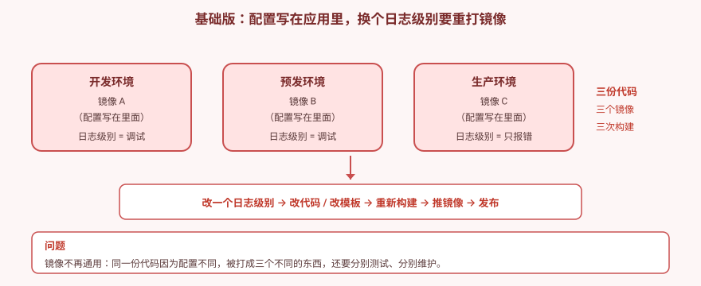
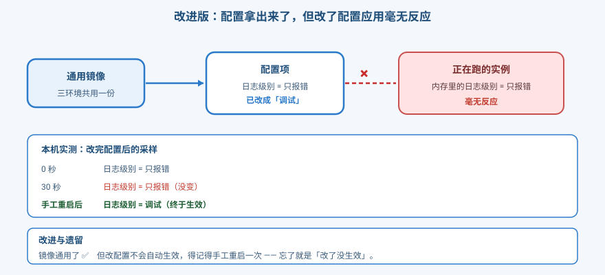
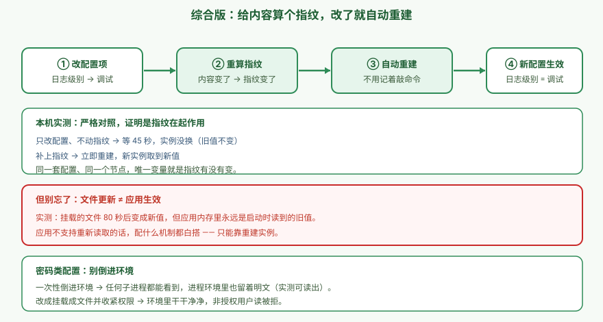

# 应用实战 · 配置拿出来了，改完还得能生效

> 对应课程：[第 11 课：ConfigMap 与 Secret](../stages/4-配置存储资源工程化/lessons/lesson-11-ConfigMap与Secret.md) ｜ 覆盖知识点：ConfigMap / Secret / 投射卷 / 配置变更与滚动更新联动
> 定位：**会用，不上生产**——课里学完，在这里动手。课内第四幕做的是**机制验证**（卷挂载会不会更新、环境变量会不会更新、subPath 有什么不同）；这里做的是**一个真实的交付场景：同一份代码跑在三个环境，改配置要能可靠生效**。
> 📖 结论已按官方文档核对（核对于 2026-09 ｜ 来源：[ConfigMap 官方文档](https://kubernetes.io/docs/concepts/configuration/configmap/)、[Secret 官方文档](https://kubernetes.io/docs/concepts/configuration/secret/)、[Secret 安全最佳实践](https://kubernetes.io/docs/concepts/security/secrets-good-practices/)）
> 🧪 **本篇全部输出为本机 kind 集群 `k8s-c1-calico`（k8s v1.34.0 + Calico v3.31.0，1 control-plane + 2 worker）实测**，非推演；实测脚本见 `.plans/2026-09-16-k8s-应用实战补齐/t11-step1.sh` ~ `t11-final.sh`

---

## 场景：改个日志级别，要重打一次镜像

**场景**：一个应用要跑在开发、预发、生产三个环境，三个环境的日志级别和连接数都不一样。

**全貌一句话**：配置与代码分离是十二要素应用的一条原则，真实生产还牵扯配置中心、密钥管理系统、动态下发。**本课只解决「配置放在哪、改了怎么生效」这一层**。ConfigMap / Secret 是 k8s 原生的配置载体，也是理解配置注入的基础。

> ⚠️ **先记住两个硬约束**：ConfigMap 和 Secret 都有 **1MB 上限**；**Secret 默认不是加密的**，它只是 base64 编码——一行命令就能还原。真正的加密要开 etcd 静态加密（阶段 5 展开）。

---

## 准备

```bash
kubectl create ns cfg

# 密码类配置（后面陷阱二要用）
kubectl -n cfg create secret generic dbsecret \
  --from-literal=username=admin \
  --from-literal=password='P@ssw0rd-Demo!'
```

> 💡 **先记住这个事实**：Secret 存进去之后是 base64，**不是加密**。现在就能验证：
> ```bash
> kubectl -n cfg get secret dbsecret -o jsonpath='{.data.password}' | base64 -d
> # P@ssw0rd-Demo!
> ```

---

### ① 基础实现（能跑但幼稚）：配置写在应用里

最省事的做法——把值直接写进启动命令（生产里就是写在代码或镜像里）：

```bash
kubectl -n cfg apply -f - <<'EOF'
apiVersion: apps/v1
kind: Deployment
metadata:
  name: hardcoded
spec:
  replicas: 2
  selector:
    matchLabels: {app: hardcoded}
  template:
    metadata:
      labels: {app: hardcoded}
    spec:
      containers:
      - name: app
        image: alpine:3.20
        command: ["/bin/sh","-c"]
        args:
        - |
          LOG_LEVEL=info
          MAX_CONN=100
          while true; do
            echo "[$(date +%H:%M:%S)] level=$LOG_LEVEL maxconn=$MAX_CONN"
            sleep 5
          done
EOF

kubectl -n cfg rollout status deployment/hardcoded --timeout=180s
kubectl -n cfg logs -l app=hardcoded --tail=1
```
```
[08:13:05] level=info maxconn=100
```



> ⚠️ **它的问题（三个环境 = 三个镜像）**：
> 1. **改一个值要重走整条发布链**——改代码 / 改模板 → 重新构建 → 推镜像 → 发布。
> 2. **镜像不再通用**——同一份代码因为配置不同被打成三个不同的东西，要分别测试、分别维护。
> 3. **密码也写在里面**——比配置写死更糟，明文进镜像层，谁拉到镜像谁就有密码。
>
> 🎯 **为什么这个错这么常见**：因为"配置跟着代码走"在开发时最省事，且**一切正常**。直到要同时维护多个环境，成本才暴露。

---

### ② 改进实现：把配置拿出来

用 ConfigMap 存配置，应用启动时从里面读：

```bash
kubectl -n cfg create configmap appconf \
  --from-literal=LOG_LEVEL=info \
  --from-literal=MAX_CONN=100

kubectl -n cfg apply -f - <<'EOF'
apiVersion: apps/v1
kind: Deployment
metadata:
  name: cmapp
spec:
  replicas: 2
  selector:
    matchLabels: {app: cmapp}
  template:
    metadata:
      labels: {app: cmapp}
    spec:
      containers:
      - name: app
        image: alpine:3.20
        command: ["/bin/sh","-c"]
        args:
        - |
          while true; do
            echo "[$(date +%H:%M:%S)] level=$LOG_LEVEL maxconn=$MAX_CONN"
            sleep 5
          done
        envFrom:
        - configMapRef:
            name: appconf
EOF

kubectl -n cfg rollout status deployment/cmapp --timeout=180s
```
```
[08:13:07] level=info maxconn=100
```

**✅ 镜像通用了**：同一份镜像，换一份 ConfigMap 就能跑在另一个环境。

#### 但改了配置，应用毫无反应

```bash
OLD=$(kubectl -n cfg get pod -l app=cmapp -o jsonpath='{.items[0].metadata.name}')
kubectl -n cfg exec $OLD -- sh -c 'echo "LOG_LEVEL=$LOG_LEVEL"'

kubectl -n cfg patch configmap appconf --type merge -p '{"data":{"LOG_LEVEL":"debug"}}'
sleep 30
kubectl -n cfg exec $OLD -- sh -c 'echo "LOG_LEVEL=$LOG_LEVEL"'
kubectl -n cfg get pod -l app=cmapp
```

**本机实测**：

```
改前:
LOG_LEVEL=info

configmap/appconf patched
30 秒后:
LOG_LEVEL=info            ← 没变

Pod 列表（AGE 未重置 = 没重建）:
cmapp-65f4cd6d5-vctv2   1/1   Running   0     32s
cmapp-65f4cd6d5-z2gjd   1/1   Running   0     32s
```

> 🔑 **环境变量是「抄给容器的纸条」，创建时就固化了，永远不更新。** 改 ConfigMap 不会、也**不可能**影响已运行的 Pod。

**手工重启能解决，但要记得做**：

```bash
kubectl -n cfg rollout restart deployment/cmapp
kubectl -n cfg rollout status deployment/cmapp --timeout=180s

# 等旧 Pod 真正消失（见下方说明）
kubectl -n cfg wait --for=delete pod -l app=cmapp --timeout=60s 2>/dev/null
sleep 5

NEW=$(kubectl -n cfg get pod -l app=cmapp -o jsonpath='{.items[0].metadata.name}')
kubectl -n cfg exec $NEW -- sh -c 'echo "LOG_LEVEL=$LOG_LEVEL"'
```
```
LOG_LEVEL=debug           ← 生效了
```

> ⚠️ **取 Pod 的坑（本机实测踩到）**：`rollout status` 返回成功时，**旧 Pod 还在 `Terminating`，但它的 `status.phase` 仍然是 `Running`**——
> ```bash
> # ❌ 这样会取到旧 Pod，读到旧值 info
> kubectl -n cfg get pod -l app=cmapp --field-selector=status.phase=Running
> #    cmapp-65f4cd6d5-6mbx6   1/1   Terminating   0     44s   ← phase 仍是 Running
> #    cmapp-6894ffdc84-nrnw8  1/1   Running       0     12s
> # items[0] 取到的是第一行（旧 Pod）→ 读到 info
> ```
> **`--field-selector=status.phase=Running` 过滤不掉正在退场的 Pod。** 要么等旧 Pod 真正消失（上面 `wait --for=delete` 的做法），要么按 ReplicaSet 代际挑新 Pod。课内讲义用的是 `sleep 15` + `--field-selector`，实测下来**仍可能取到旧 Pod**，这里换成显式等待更可靠。



> ⚠️ **遗留问题**：改配置的人必须**记得**敲一次 `rollout restart`。忘了就是经典的"我明明改了配置，怎么没生效"。

---

### ③ 综合实现：给配置内容算个指纹，改了就自动重建

**思路**：把 ConfigMap 内容的**哈希值**写进 Pod 模板的注解里。内容一变 → 哈希变 → 模板变 → **自动触发滚动**，不需要人记得敲命令。

```bash
# ① 算出当前配置的指纹
CKSUM=$(kubectl -n cfg get configmap appconf -o jsonpath='{.data}' | sha256sum | cut -c1-16)
echo $CKSUM

# ② 写进 Pod 模板注解
kubectl -n cfg apply -f - <<EOF
apiVersion: apps/v1
kind: Deployment
metadata:
  name: autoapp
spec:
  replicas: 2
  selector:
    matchLabels: {app: autoapp}
  template:
    metadata:
      labels: {app: autoapp}
      annotations:
        checksum/config: $CKSUM      # ← 关键就这一行
    spec:
      containers:
      - name: app
        image: alpine:3.20
        command: ["/bin/sh","-c"]
        args:
        - |
          while true; do
            echo "[$(date +%H:%M:%S)] level=\$LOG_LEVEL"
            sleep 5
          done
        envFrom:
        - configMapRef:
            name: appconf
EOF

kubectl -n cfg rollout status deployment/autoapp --timeout=180s
```

**以后每次改配置，就是这两行**（CI 里也是这两行）：

```bash
kubectl -n cfg patch configmap appconf --type merge -p '{"data":{"LOG_LEVEL":"error"}}'

NEWCK=$(kubectl -n cfg get configmap appconf -o jsonpath='{.data}' | sha256sum | cut -c1-16)
kubectl -n cfg patch deployment autoapp --type merge -p \
  "{\"spec\":{\"template\":{\"metadata\":{\"annotations\":{\"checksum/config\":\"$NEWCK\"}}}}}"
```

**本机实测**：

```
初始 checksum = dcffef624a71041a
 初始 Pod:  autoapp-5d454687db-gjqk5 / -wmsmp

configmap/appconf patched
新 checksum = 8cd573b4076dc8d4
deployment.apps/autoapp patched

滚动后 Pod（Pod 名哈希变化 + AGE 重置）:
autoapp-5d454687db-gjqk5   1/1   Terminating   0     12s
autoapp-5d454687db-wmsmp   1/1   Terminating   0     12s
autoapp-8f4d58567-b4gwx    1/1   Running       0     9s
autoapp-8f4d58567-fkvtj    1/1   Running       0     10s

新 Pod 里的值:
LOG_LEVEL=debug
```

#### 严格对照：到底是不是指纹在起作用？

光看到"滚动了"不能证明因果——**必须证明"不动指纹就不会滚动"**（本机实测）：

```
--- 只改配置，不动指纹 ---
ConfigMap 已改为 trace；ReplicaSet(前) = autoapp-5d454687db ... autoapp-8f4d58567
45 秒后 ReplicaSet(后)              = autoapp-5d454687db ... autoapp-8f4d58567
✅ 未滚动
Pod 内值（应仍为旧值）: LOG_LEVEL=fatal

--- 补上指纹 ---
新 checksum = f67564dd6598b763
补指纹后 ReplicaSet = ... autoapp-85699d779f ...    ← 新副本集出现
✅ 滚动发生
```

> 🔑 **同一套配置、同一个节点，唯一变量就是指纹有没有变。** 这就坐实了因果关系。
>
> 💡 **判据怎么选**：我第一版用 Pod 名做判据，结果滚到一半时前后取到不同代的 Pod，误判成"意外滚动"。**改用 ReplicaSet 列表做判据**才拿到可信结论。测滚动相关的事，优先看副本集代际，别只看 Pod 名。

#### 陷阱一：文件更新了 ≠ 应用生效

就算用卷挂载（文件会自动更新），**应用不重新读文件照样用旧值**（本机实测）：

```
--- 改配置为 V2，采样 ---
    累计 10s: 磁盘文件=V1   应用内存=V1
    累计 70s: 磁盘文件=V1   应用内存=V1
    累计 80s: 磁盘文件=V2   应用内存=V1     ← 文件变了！
    >>> 文件第 80s 已更新

文件更新后，再等 30 秒看应用：
    磁盘文件: V2
    应用内存: [08:22:26] 应用内存 level=V1   ← 还是旧值
```

**对照：会重读的应用**（每次循环重新读文件）在同样条件下 80 秒后拿到了新值。

> 🎯 **这才是生产最常见的「改了没生效」**：不是 k8s 没更新，是**应用自己只在启动时读一次**。
> 卷挂载能保证"文件会变"，但**不能**保证"应用会用"。应用不支持 reload，就只能靠重建实例——这也是为什么 checksum 方案比"等它自动更新"更可靠。

#### 陷阱二：密码别倒进环境

Secret 用 `envFrom` 一次性倒进环境很方便，但**泄密面比想象的大**（本机实测）：

```bash
# ❌ 反面：一次性倒进环境
kubectl -n cfg apply -f - <<'EOF'
apiVersion: v1
kind: Pod
metadata:
  name: leaky
spec:
  containers:
  - name: c
    image: alpine:3.20
    command: ["sleep","3600"]
    envFrom:
    - secretRef:
        name: dbsecret
EOF

kubectl -n cfg exec leaky -- env | grep -i pass
kubectl -n cfg exec leaky -- sh -c 'tr "\0" "\n" < /proc/1/environ | grep -i pass'
```
```
password=P@ssw0rd-Demo!        ← env 里直接可见
password=P@ssw0rd-Demo!        ← 进程环境里也留着明文
```

**✅ 正面：挂载成文件 + 收紧权限**

```bash
kubectl -n cfg apply -f - <<'EOF'
apiVersion: v1
kind: Pod
metadata:
  name: safe
spec:
  securityContext:
    runAsUser: 1000
    runAsGroup: 1000
  containers:
  - name: c
    image: alpine:3.20
    command: ["sleep","3600"]
    volumeMounts:
    - name: s
      mountPath: /etc/secret
      readOnly: true
  volumes:
  - name: s
    secret:
      secretName: dbsecret
      defaultMode: 0400
EOF

kubectl -n cfg exec safe -- env | grep -i pass   # 干净
kubectl -n cfg exec safe -- cat /etc/secret/password
```

**本机实测（权限对照）**：

| 配置 | 真实文件权限 | 非 root(1000) 读取 |
|---|---|---|
| `defaultMode: 0400` | `-r--------` | ❌ `Permission denied` |
| 不写（默认 0644） | 默认权限 | ✅ 直接读到明文 |

> 💡 **看权限别被表象骗了**：`ls -la` 看到的 `lrwxrwxrwx` 是**软链接本身**的权限，永远是 777。要看真实文件权限去 `..data/` 目录里看，或用 `stat`。
>
> ⚠️ **`defaultMode` 只在非 root 运行时才有意义**——以 root 运行时 `0400` 照样能读。真正的安全要配合 `runAsUser` 非 root（阶段 5 展开）。



---

> 🎯 **会用标志**：给你"配置与代码分离"的需求，你能——
> - 说清为什么**配置写死会让镜像不再通用**，并能用三个环境类比说明；
> - 用 ConfigMap 让**同一镜像跑在多环境**，并验证**改配置不会自动生效**；
> - 用 **checksum 注解**让配置变更自动触发重建，并用**严格对照**证明是指纹在起作用；
> - 解释**文件更新 ≠ 应用生效**，知道应用要支持 reload 或靠重建；
> - 说清 `envFrom` 的泄密面（**进程环境里也留明文**），并会用**卷挂载 + `defaultMode: 0400`** 收紧；
> - 至少能说出两个硬约束：**1MB 上限**、**Secret 默认不加密**。

---

## 常见坑（本篇实测踩到的）

1. **改了 ConfigMap 以为会生效**——环境变量**永不更新**；卷挂载会更新但**延迟 10~100 秒不稳定**（课内四次实测跨越一个数量级）。生产别依赖这个机制。
2. **应用不重读文件**——文件更新了应用还在用旧值，**这是「改了没生效」的头号原因**。要么让应用支持 reload，要么用 checksum 重建。
3. **密码用 `envFrom` 倒进环境**——`env` 和 `/proc/<pid>/environ` 里都是明文，任何子进程都能看到。用卷挂载 + `0400`。
4. **看文件权限被软链接骗了**——`ls -la` 显示 `lrwxrwxrwx`（软链接本身），真实权限要去 `..data/` 里看或 `stat`。
5. **`defaultMode: 0400` 对 root 无效**——以 root 运行照样读得到。要配合 `runAsUser` 非 root。
6. **测滚动用 Pod 名当判据会误判**——滚到一半时新旧 Pod 混在一起。**改用 ReplicaSet 列表看代际**。（我本篇就踩了这个坑，误判成"意外滚动"。）
7. **Secret 不是加密的**——只是 base64，`kubectl get secret -o jsonpath='{.data.xxx}' | base64 -d` 一行还原。
8. **ConfigMap/Secret 有 1MB 上限**，且**只能被同命名空间引用**——跨命名空间要复制一份。
9. **键名拼错不是"得到空串"，是 Pod 起不来**——第一现场是 `CreateContainerConfigError`，`describe` 里会直接告诉你是哪个键名（`couldn't find key XXX`）。
10. **`subPath` 挂载永不更新**——停在创建时的值，别用在需要更新的配置上。

---

## 🧭 导航

- ⬅️ 回到课程：[第 11 课：ConfigMap 与 Secret](../stages/4-配置存储资源工程化/lessons/lesson-11-ConfigMap与Secret.md)
- 📚 全部实战：[应用实战索引](INDEX.md)
- ⬅️ 上一篇：[10 · 只让该连的连上，数据库不再裸奔](10-NetworkPolicy微隔离.md)
**清理**：

```bash
kubectl delete ns cfg
```

> 💡 **下一站**：课 11 解决"配置从哪来"，课 12 解决**更难的一半——数据放哪**。配置丢了可以重建，**数据丢了就真没了**。
