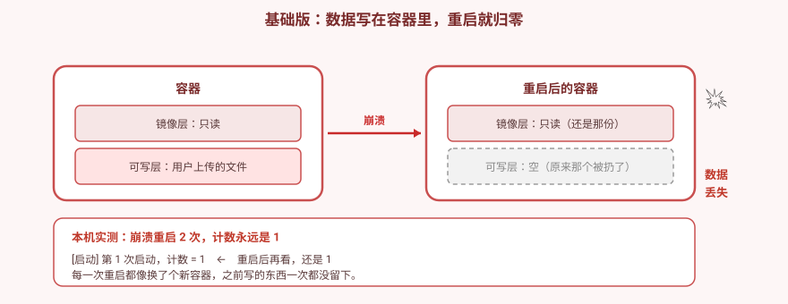
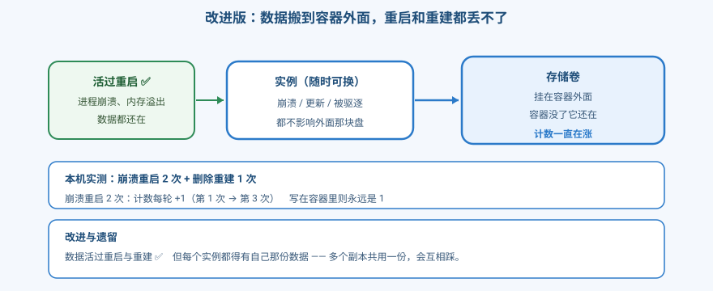
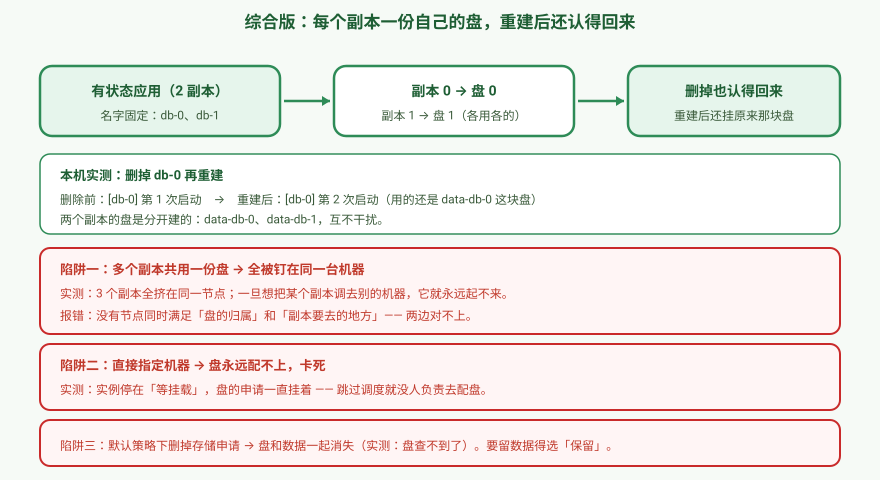

# 应用实战 · 数据活过容器：从重启即丢到各存各的

> 对应课程：[第 12 课：Volume 与 PV/PVC](../stages/4-配置存储资源工程化/lessons/lesson-12-Volume与PVPVC.md) ｜ 覆盖知识点：Volume / emptyDir / hostPath / PV / PVC / StorageClass / 回收策略
> 定位：**会用，不上生产**——课里学完，在这里动手。课内第四幕做的是**机制验证**（四类存储的存活边界、静态/动态绑定、回收策略）；这里做的是**一个真实的交付场景：一个有状态应用，要能扛住崩溃、更新、重建，数据都不丢**。
> 📖 结论已按官方文档核对（核对于 2026-09 ｜ 来源：[Volumes](https://kubernetes.io/docs/concepts/storage/volumes/)、[Persistent Volumes](https://kubernetes.io/docs/concepts/storage/persistent-volumes/)、[Storage Classes](https://kubernetes.io/docs/concepts/storage/storage-classes/)）
> 🧪 **本篇全部输出为本机 kind 集群 `k8s-c1-calico`（k8s v1.34.0 + Calico v3.31.0，1 control-plane + 2 worker，默认 StorageClass 为 `standard` / `rancher.io/local-path`）实测**，非推演；实测脚本见 `.plans/2026-09-16-k8s-应用实战补齐/t12-step1.sh` ~ `t12-reclaim.sh`

---

## 场景：用户上传的文件，凌晨没了

**场景**：一个应用把用户上传的文件写在容器里。某天凌晨内存泄漏触发重启，或者你滚动更新了一版代码——**文件全没了**。

**全貌一句话**：容器存储是 k8s 里最贴近"生产事故"的一环，真实生产还牵扯 CSI 驱动、快照、备份、跨可用区复制。**本课只解决「数据放在哪、能活过什么」这一层**。判断标准只有一句：**这份数据需要活过什么？**

> ⚠️ **先记住三个硬约束**：
> 1. 容器的可写层**随容器消失**——写在里面的东西，重启就没。
> 2. `ReadWriteOnce` 限制的是**节点**，不是 Pod（本篇实测会证明）。
> 3. 默认回收策略是 `Delete`——**删掉存储申请，盘和数据一起消失**。

---

## 准备

```bash
kubectl create ns store
```

---

### ① 基础实现（能跑但幼稚）：数据写在容器里

用一个"启动计数"应用：每次启动把计数写进文件，重启后读回来看还在不在。

```bash
kubectl -n store apply -f - <<'EOF'
apiVersion: v1
kind: Pod
metadata:
  name: crash
spec:
  containers:
  - name: app
    image: alpine:3.20
    command: ["/bin/sh","-c"]
    args:
    - |
      if [ -f /uploads/counter ]; then
        N=$(cat /uploads/counter); N=$((N+1))
      else
        mkdir -p /uploads; N=1
      fi
      echo "$N" > /uploads/counter
      echo "[启动] 第 $N 次启动，计数 = $N"
      echo "  （3 秒后模拟崩溃）"
      sleep 3
      echo "  崩溃！exit 1"
      exit 1
EOF

kubectl -n store wait --for=condition=Ready pod/crash --timeout=120s
sleep 25
kubectl -n store get pod crash -o jsonpath='{.status.containerStatuses[0].restartCount}'; echo
kubectl -n store logs crash
```

**本机实测**：

```
restartCount: 2          ← 确实崩溃重启了 2 次

[启动] 第 1 次启动，计数 = 1
  （3 秒后模拟崩溃）
  崩溃！exit 1
```

> 🔑 **重启了 2 次，但计数永远是 1。** 每次重启都换一个新的可写层，之前写的全没了。



> ⚠️ **它的问题**：
> 1. **进程崩溃就没**——OOM、panic、健康检查失败重启，全丢。
> 2. **滚动更新也没**——更新一次等于换一批新容器。
> 3. **被驱逐也没**——节点资源紧张时 Pod 被赶走重建。
>
> 💡 **实测踩坑**：我一开始用 `kubectl exec` 里 `kill 1` 模拟崩溃，结果 **`restartCount` 是 0，根本没重启**。原因是这个容器的 PID 1 就是 shell 本身，杀它等于自杀但重启策略没生效。**模拟崩溃要让应用自己 `exit 1`**，别用 `kill 1`。

---

### ② 改进实现：把数据搬到容器外面

用 PVC 存数据。注意 PVC 刚建时是 **Pending**——这是正常的（`WaitForFirstConsumer` 延迟绑定）：

```bash
kubectl -n store apply -f - <<'EOF'
apiVersion: v1
kind: PersistentVolumeClaim
metadata:
  name: data
spec:
  accessModes: [ReadWriteOnce]
  storageClassName: standard
  resources:
    requests: {storage: 100Mi}
EOF
kubectl -n store get pvc data -o jsonpath='{.status.phase}'; echo    # Pending ← 正常
```

创建使用它的 Pod（同样的崩溃逻辑，但数据写在卷里）：

```bash
kubectl -n store apply -f - <<'EOF'
apiVersion: v1
kind: Pod
metadata:
  name: crashpvc
spec:
  containers:
  - name: app
    image: alpine:3.20
    command: ["/bin/sh","-c"]
    args:
    - |
      if [ -f /data/counter ]; then
        N=$(cat /data/counter); N=$((N+1))
      else
        N=1
      fi
      echo "$N" > /data/counter
      echo "[启动] 第 $N 次启动，计数 = $N"
      echo "  （3 秒后模拟崩溃）"
      sleep 3
      echo "  崩溃！exit 1"
      exit 1
    volumeMounts:
    - name: d
      mountPath: /data
  volumes:
  - name: d
    persistentVolumeClaim: {claimName: data}
EOF

kubectl -n store wait --for=condition=Ready pod/crashpvc --timeout=120s
sleep 25
kubectl -n store get pod crashpvc -o jsonpath='{.status.containerStatuses[0].restartCount}'; echo
kubectl -n store logs crashpvc
```

**本机实测（与 ① 严格对照）**：

```
restartCount: 2

[启动] 第 3 次启动，计数 = 3      ← 一直在涨
```

| | 崩溃重启 2 次后 |
|---|---|
| 写在容器里（①） | `第 1 次启动，计数 = 1` ← **永远是 1** |
| 写在 PVC 里（②） | `第 3 次启动，计数 = 3` ← **每轮 +1** |

> 💡 **数字对不上是正常的**：`3` 是因为前面 ① 那轮崩溃也写进过这块盘（同一个 PVC）。**判据是"有没有在涨"，不是"是不是 3"**。

**再验证"活过 Pod 删除重建"**——把上面的崩溃 Pod 换成常驻 Pod，删掉再建一个：

```bash
kubectl -n store delete pod crashpvc --wait=true

kubectl -n store apply -f - <<'EOF'
apiVersion: v1
kind: Pod
metadata:
  name: reborn
spec:
  containers:
  - name: app
    image: alpine:3.20
    command: ["/bin/sh","-c"]
    args:
    - |
      if [ -f /data/counter ]; then
      if [ -f /data/counter ]; then
        N=$(cat /data/counter); N=$((N+1))
      else
        N=1
      fi
      echo "$N" > /data/counter
      echo "[启动] 第 $N 次启动，计数 = $N"
      while true; do sleep 5; done
    volumeMounts:
    - name: d
      mountPath: /data
  volumes:
  - name: d
    persistentVolumeClaim: {claimName: data}     # 还是同一个 PVC
EOF

kubectl -n store wait --for=condition=Ready pod/reborn --timeout=120s
kubectl -n store logs reborn
```

**本机实测**：

```
重建后: [启动] 第 4 次启动，计数 = 4      ← 比上一轮 +1
```

> 🔑 **重点不是具体数字，是"每次都比上一次 +1"**。你在自己环境跑出来的数字会和这里不同（取决于前面崩溃了几次），**只要它在涨，就说明数据活过了删除重建**。
> 对照 ① 的容器写法：无论重启几次，那个数字**永远是 1**。

> 🔑 **数据活过了崩溃重启与删除重建。** 卷挂在容器外面，容器换了卷还在。



> ⚠️ **遗留问题**：一份盘给多个副本用会互相踩（数据库尤其致命）。而且——**数据活过 Pod，不代表活过"删掉存储申请"**。

---

### ③ 综合实现：每个副本一份自己的盘

有状态应用要用 **StatefulSet**（不是 Deployment）——它给每个副本建**独立的 PVC**，副本重建后**还挂原来那块**：

```bash
kubectl -n store apply -f - <<'EOF'
apiVersion: apps/v1
kind: StatefulSet
metadata:
  name: db
spec:
  serviceName: db
  replicas: 2
  selector:
    matchLabels: {app: db}
  template:
    metadata:
      labels: {app: db}
    spec:
      containers:
      - name: app
        image: alpine:3.20
        command: ["/bin/sh","-c"]
        args:
        - |
          if [ -f /data/counter ]; then
            N=$(cat /data/counter); N=$((N+1))
          else
            N=1
          fi
          echo "$N" > /data/counter
          echo "[$(hostname)] 第 $N 次启动"
          while true; do sleep 5; done
        volumeMounts:
        - name: data
          mountPath: /data
  volumeClaimTemplates:            # ← 关键：每副本一份
  - metadata:
      name: data
    spec:
      accessModes: [ReadWriteOnce]
      storageClassName: standard
      resources:
        requests: {storage: 100Mi}
EOF

kubectl -n store rollout status statefulset/db --timeout=240s
kubectl -n store get pvc -l app=db
```

**本机实测**：

```
--- 每个副本的独立数据 ---
  db-0: [db-0] 第 1 次启动  (节点 k8s-c1-calico-worker2)
  db-1: [db-1] 第 1 次启动  (节点 k8s-c1-calico-worker)

--- 自动生成的 PVC（每个副本一份）---
data-db-0   Bound   pvc-a4bdd89b-...   100Mi   RWO   standard
data-db-1   Bound   pvc-8e5b42ab-...   100Mi   RWO   standard

--- 删掉 db-0，看它重建后数据还在不在 ---
  db-0 重建后: [db-0] 第 2 次启动
  db-0 用的 PVC: data-db-0      ← 还是原来那块
```

> 🔑 **StatefulSet 的三个保障**：名字固定（`db-0`）、盘固定（`data-db-0`）、**按顺序启停**。删掉副本重建，它认得回自己的盘——这是 Deployment 做不到的（Deployment 所有副本共用同一份模板）。



---

## 三个必踩的坑（全部实测）

### 陷阱一：多个副本共用一份盘 → 全被钉在同一台机器

`ReadWriteOnce` 常被理解成"只能一个 Pod 写"。**实测证明：限制的是节点，不是 Pod**。

```bash
# 3 副本 Deployment 共用同一个 PVC
kubectl -n store get pod -l app=multi \
  -o custom-columns='NAME:.metadata.name,NODE:.spec.nodeName,STATUS:.status.phase'
```

**本机实测**：

```
multi-57ff5cddc9-2tqhf   k8s-c1-calico-worker2   Running
multi-57ff5cddc9-7rv7v   k8s-c1-calico-worker2   Running
multi-57ff5cddc9-j6wg6   k8s-c1-calico-worker2   Running
```

三个副本**都起来了**，而且都往同一个文件写了：

```
multi-57ff5cddc9-7rv7v 08:51:42
multi-57ff5cddc9-2tqhf 08:51:43
multi-57ff5cddc9-j6wg6 08:51:43
```

**但代价是：它们全被钉死在同一台机器。** 一旦想把某个副本调去别的节点：

```
multi-77c5c96b4b-kqqgw   <none>   Pending
Events:
  Warning  FailedScheduling  0/3 nodes are available:
    1 node(s) didn't match PersistentVolume's node affinity,
    1 node(s) didn't match Pod's node affinity/selector,
    1 node(s) had untolerated taint {node-role.kubernetes.io/control-plane: }
```

> 🎯 **为什么这是坑**：表面上"跑起来了"，实际上**失去了多副本的意义**——那台机器一挂，三个副本全挂。而且副本数越多，越调度不开。
> 真正的多副本有状态服务，要用 **StatefulSet**（各存各的）；要共享读写得用 `ReadWriteMany`，但那需要 NFS 之类的存储支持，本地盘做不到。

### 陷阱二：直接指定机器 → 盘永远配不上

想让 Pod 跑在指定节点，很多人第一反应是 `nodeName`：

```yaml
spec:
  nodeName: k8s-c1-calico-worker     # ← 这样写会死锁
```

**本机实测**：

```
Pod 状态: Pending
PVC 状态: Pending        ← 永远绑不上

Events:
  Warning  FailedMount   Unable to attach or mount volumes: unmounted volumes=[d],
    failed to process volumes=[d]: error processing PVC store/stuck: PVC is not bound
```

> 🔑 **死锁原因**：`WaitForFirstConsumer` 模式下，**是调度器在调度时顺便触发卷的创建与绑定**。`nodeName` 直接指定了节点、**绕过了调度器**——没人去触发绑定，PVC 就永远 Pending。
>
> ✅ **正确做法**：用 `nodeSelector` 让调度器正常参与：
> ```yaml
> spec:
>   nodeSelector:
>     kubernetes.io/hostname: k8s-c1-calico-worker
> ```
> 这样调度器还能报出明确原因（`didn't match PersistentVolume's node affinity`），而不是无声卡死。

### 陷阱三：删掉存储申请 → 盘和数据一起消失

默认 StorageClass 的回收策略是 `Delete`。

```bash
kubectl get pv $PV -o jsonpath='{.spec.persistentVolumeReclaimPolicy}'; echo
kubectl -n rec delete pod w --wait=true
kubectl -n rec delete pvc important
sleep 12
kubectl get pv $PV
```

**本机实测**：

```
回收策略: Delete
数据: IMPORTANT-DATA
落盘路径: /var/local-path-provisioner/pvc-c75bf8e4-..._rec_important

删掉 PVC 后:
Error from server (NotFound): persistentvolumes "pvc-c75bf8e4-..." not found
```

**对照：`Retain` 策略下盘保住，但有另一个坑**

```
删掉 PVC 后 PV 状态: Released      ← 盘还在，数据还在

但 Released 的 PV 不能直接复用（卡着旧的归属记录）：
  pvc-reuse 状态: Pending          ← 新 PVC 绑不上去
```

> ⚠️ **`Released` 的坑**：盘保住了，但因为它记着"我属于上一个 PVC"，新 PVC 绑不上。**得先手工清掉那段归属记录**才能重新可用。
> 生产上处理 `Released` 盘的标准流程是：确认数据已备份 → 清归属 → 让盘回到 `Available`。
>
> 💡 **别指望扩容救急**：本机默认 StorageClass 的**扩容开关是关的**（`allowVolumeExpansion` 为空），实测扩容请求被直接拒绝：
> ```
> Error from server (Forbidden): ... only dynamically provisioned pvc can be resized
>   and the storageclass that provisions the pvc must support resize
> ```
> **容量要在建的时候就规划好。**

---

> 🎯 **会用标志**：给你"数据不能丢"的需求，你能——
> - 先问**"这份数据要活过什么"**，再选存储层次，而不是随手写在容器里；
> - 用**崩溃对照**证明：写在容器里计数归 1，写在 PVC 里计数递增；
> - 用 **StatefulSet** 让每个副本各存各的，并验证**删掉副本重建后还挂原来那块盘**；
> - 说清 `ReadWriteOnce` 限制的是**节点**，并用实测解释"3 副本全挤一台机器"的后果；
> - 知道 **`nodeName` 会绕过调度器导致卷永不绑定**，改用 `nodeSelector`；
> - 说清 **`Delete` 会连带删数据**、`Retain` 会留下 `Released` 盘需要手工清理；
> - 至少能说出三个硬约束：**容器可写层随容器消失**、**RWO 限节点**、**默认策略删 PVC 即删数据**。

---

## 常见坑（本篇实测踩到的）

1. **以为"跑起来了"就等于配对了**——3 副本共用一份 RWO 盘确实能跑，但**全挤在一台机器**，多副本形同虚设。
2. **用 `nodeName` 指定节点**——绕过调度器，卷永远绑不上，Pod 卡在 `FailedMount`。用 `nodeSelector`。
3. **以为 `RWO` 是"一个 Pod 独占"**——实测同节点多个 Pod 都能写。限制的是**节点**。
4. **删 PVC 前没确认回收策略**——`Delete` 下盘和数据一起消失，且**不可恢复**。
5. **`Released` 状态的盘不能直接复用**——记着旧归属，得手工清理。
6. **指望临时扩容**——本机默认 StorageClass 不支持扩容，实测直接拒绝。容量要提前规划。
7. **用 `kill 1` 模拟崩溃不生效**——容器的 PID 1 往往就是 shell，**让应用自己 `exit 1`** 才是可靠的崩溃模拟。
8. **PVC 一直是 Pending 就慌**——`WaitForFirstConsumer` 模式下，**没有 Pod 用它时 Pending 是正常的**，Pod 建了才绑定。
9. **emptyDir 当持久存储用**——它只活过容器重启，**活不过 Pod 删除**（课内验证 2 已实测）。
10. **hostPath 以为跨节点通用**——它绑死在单个节点的文件系统上，Pod 漂到别的节点就读不到。

---

## 🧭 导航

- ⬅️ 回到课程：[第 12 课：Volume 与 PV/PVC](../stages/4-配置存储资源工程化/lessons/lesson-12-Volume与PVPVC.md)
- 📚 全部实战：[应用实战索引](INDEX.md)
- ⬅️ 上一篇：[11 · 配置拿出来了，改完还得能生效](11-配置与密钥管理.md)

**清理**：

```bash
kubectl delete ns store
# 若有 Released 的 PV 残留
kubectl get pv --no-headers | awk '{print $1}' | xargs -r kubectl delete pv
```

> 💡 **下一站**：课 11、12 解决了"配置从哪来、数据放哪"。课 13 解决**它们要占多少**——不设资源边界，一个应用能吃掉整台机器。
