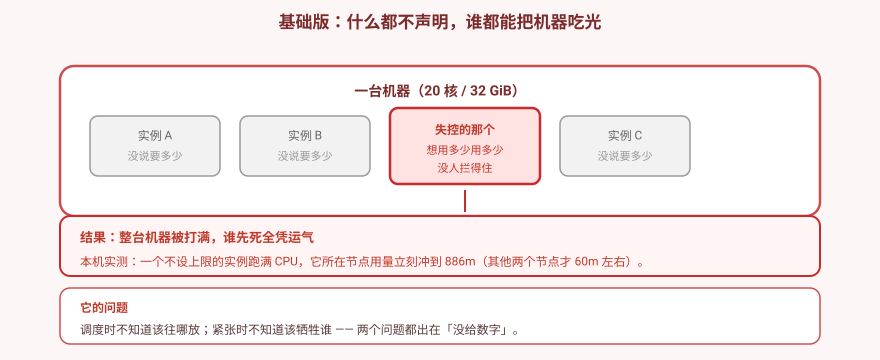
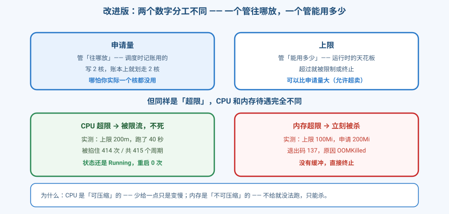
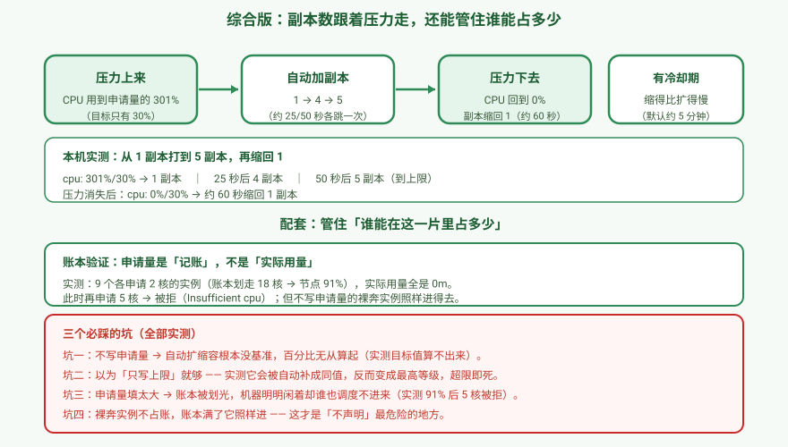

# 应用实战 · 不设资源边界，一个应用能吃掉整台机器

> 对应课程：[第 13 课：资源 · 调度 · 扩缩容](../stages/4-配置存储资源工程化/lessons/lesson-13-资源调度扩缩容.md) ｜ 覆盖知识点：requests/limits、QoS、污点容忍、亲和性、HPA、ResourceQuota、LimitRange
> 定位：**会用，不上生产**——课里学完，在这里动手。课内第四幕做的是**机制验证**（QoS 分类、ResourceQuota、LimitRange）；这里做的是**一个真实的交付场景：一个服务从"跑就行"到"跑得稳、跑得省"**。
> 📖 结论已按官方文档核对（核对于 2026-09 ｜ 来源：[Resource Management for Pods](https://kubernetes.io/docs/concepts/configuration/manage-resources-containers/)、[Horizontal Pod Autoscaling](https://kubernetes.io/docs/tasks/run-application/horizontal-pod-autoscale/)、[Taints and Tolerations](https://kubernetes.io/docs/concepts/scheduling-eviction/taint-and-toleration/)）
> 🧪 **本篇全部输出为本机 kind 集群 `k8s-c1-calico`（k8s v1.34.0 + Calico v3.31.0，1 control-plane + 2 worker，各 20 核 / 32 GiB，metrics-server v0.9.0 已装）实测**，非推演；实测脚本见 `.plans/2026-09-16-k8s-应用实战补齐/t13-step1.sh` ~ `t13-quota.sh`

---

## 场景：半夜三点，服务挂了

**场景**：一个服务你用 `kubectl create deployment` 跑起来，一直很稳。业务涨了加到 5 副本，也还行。直到某天半夜——5 个 Pod 里 3 个 `CrashLoopBackOff`，整台机器内存被打满，**连 SSH 都快登不进去了**。

**全貌一句话**：本课只解决「**要多少、最多多少、紧张时谁先死**」这一层。真实生产还牵扯节点池弹性、成本优化、容量建模。判断标准只有一句：**你有没有把"需要多少"这个数字告诉 k8s？**

> ⚠️ **先记住三个硬约束**：
> 1. **`requests` 是账本，不是用量**——写 2 核就划走 2 核，哪怕你一个核都没用。
> 2. **CPU 超限只是变慢，内存超限直接被杀**——前者可压缩，后者不可压缩。
> 3. **不写 `requests` 的 Pod 不占账**——账本满了它照样能进，这是最危险的地方。

---

## 准备

```bash
kubectl create ns res
kubectl top nodes          # 确认 metrics-server 可用（本篇 ③ 依赖它）
```

---

### ① 基础实现（能跑但幼稚）：什么都不声明

先看"裸奔"时代：不写任何资源字段，调度器怎么放、运行时能吃到多少。

```bash
kubectl -n res apply -f - <<'EOF'
apiVersion: apps/v1
kind: Deployment
metadata:
  name: naked
spec:
  replicas: 6
  selector: {matchLabels: {app: naked}}
  template:
    metadata: {labels: {app: naked}}
    spec:
      containers:
      - name: c
        image: alpine:3.20
        command: ["sleep","3600"]
EOF

kubectl -n res get pod -l app=naked \
  -o custom-columns='NAME:.metadata.name,NODE:.spec.nodeName'
```

**本机实测**——6 个副本的分布：

```
naked-5c464c97bf-7pr4j   k8s-c1-calico-worker2
naked-5c464c97bf-8n5f2   k8s-c1-calico-worker2
naked-5c464c97bf-h5hvb   k8s-c1-calico-worker
naked-5c464c97bf-k9vrm   k8s-c1-calico-worker
naked-5c464c97bf-mt8qk   k8s-c1-calico-worker
naked-5c464c97bf-rss68   k8s-c1-calico-worker2
```

```
QOS
BestEffort      ← 全部是 BestEffort
```

**再看一个不设上限的 Pod 能吃掉多少**：

```bash
kubectl -n res apply -f - <<'EOF'
apiVersion: v1
kind: Pod
metadata:
  name: hog
spec:
  containers:
  - name: c
    image: alpine:3.20
    command: ["/bin/sh","-c"]
    args: ["while true; do :; done"]      # 死循环，吃满一个核
EOF
sleep 30
kubectl top nodes
```

**本机实测**：

```
NAME                          CPU(cores)   CPU(%)
k8s-c1-calico-control-plane   229m         1%
k8s-c1-calico-worker          235m         1%
k8s-c1-calico-worker2         886m         4%     ← hog 在这台

hog 所在节点: k8s-c1-calico-worker2
```

> 🔑 **它想吃多少就吃多少，没人拦着。** 一个死循环就把这台机器的用量从 60m 顶到 886m（本机多次实测在 **825~886m** 之间浮动，取决于当时节点上还有什么）。如果它吃的是内存而不是 CPU，结局就是整台机器 OOM。



> ⚠️ **它的问题**：
> 1. **调度时不知道该往哪放**——没有 `requests`，调度器算不出"还剩多少空间"，只能大致平摊（这次刚好 3:3，纯属运气）。
> 2. **紧张时不知道该牺牲谁**——全是 `BestEffort`，内核 OOM killer 随机挑一个杀。
> 3. **没有天花板**——单个 Pod 能吃光整台机器。

---

### ② 改进实现：给出两个数字

`requests` 管**往哪放**，`limits` 管**能用多少**。这两个数字分工完全不同。

```yaml
resources:
  requests: {cpu: "100m"}     # 调度时记账
  limits:   {cpu: "200m"}     # 运行时天花板
```

#### CPU 超限：被限流，不死

```bash
kubectl -n res apply -f - <<'EOF'
apiVersion: v1
kind: Pod
metadata:
  name: cpulimit
spec:
  containers:
  - name: c
    image: alpine:3.20
    command: ["/bin/sh","-c"]
    args: ["while true; do :; done"]
    resources:
      requests: {cpu: "100m"}
      limits:   {cpu: "200m"}
EOF

kubectl -n res wait --for=condition=Ready pod/cpulimit --timeout=120s
sleep 40
kubectl top pod -n res cpulimit
# 看 cgroup 里的限流统计
kubectl -n res exec cpulimit -- cat /sys/fs/cgroup/cpu.stat
```

**本机实测**：

```
NAME       CPU(cores)   MEMORY(bytes)
cpulimit   201m         0Mi

restartCount: 0
状态: Running
```

```
cpu.max:  20000 100000       ← 上限 200m（20000/100000 核）
cpu.stat:
  nr_periods      415
  nr_throttled    414         ← 415 个周期里 414 个被掐住
  throttled_usec  24556764    ← 累计被掐了 24.5 秒
```

> 🔑 **415 个周期里 414 个被限流，但状态还是 `Running`，重启 0 次。** 这就是 CPU 的"可压缩"——少给你一点，你只是变慢，不会死。

#### 对照：内存超限，立刻被杀

```bash
kubectl -n res apply -f - <<'EOF'
apiVersion: v1
kind: Pod
metadata:
  name: memlimit
spec:
  containers:
  - name: c
    image: alpine:3.20
    command: ["/bin/sh","-c"]
    args:
    - |
      echo "开始：上限 100Mi，我每次吃 20Mi"
      i=0
      while true; do
        i=$((i+1))
        eval "B$i=$(head -c 20000000 /dev/zero | tr '\0' 'x')"
        echo "  第 $i 次，已吃约 $((i*20))Mi"
        sleep 1
      done
    resources:
      requests: {memory: "64Mi"}
      limits:   {memory: "100Mi"}
EOF
sleep 25
kubectl -n res get pod memlimit \
  -o jsonpath='{.status.containerStatuses[0].lastState.terminated}'
```

**本机实测**：

```
restarts: 2
reason: OOMKilled
exitCode: 137
```

| | 超限后 |
|---|---|
| CPU（上限 200m） | `Running`，restarts 0 —— **被限流** |
| 内存（上限 100Mi） | `OOMKilled`，exitCode **137** —— **直接被杀** |

> 🔑 **为什么待遇不同**：CPU 是**可压缩资源**（compressible）——少给一点只是变慢，不会出错。内存是**不可压缩**的——已经分配出去的内存没法"收回一点"，要么有，要么进程就崩了。



> 💡 **实测踩坑**：我一开始用 `dd if=/dev/zero of=/dev/shm/eat` 测内存超限，结果**Pod 一直 Running，根本没触发 OOM**。原因是 `/dev/shm` 是 tmpfs，不计入容器内存 cgroup。**要触发 OOM 必须真的占用进程堆内存**（上面的 `eval` 撑大 shell 变量，或用 `awk` 分配大数组）。

> ⚠️ **遗留问题**：手写副本数跟不上流量变化。半夜来一波流量，等你看监控再加副本，服务早挂了。

---

### ③ 综合实现：副本数跟着压力走

用 HPA 让副本数自动跟随 CPU 使用率。**注意 `requests` 是必须的**——没有它，百分比无从算起。

```bash
kubectl -n res apply -f - <<'EOF'
apiVersion: apps/v1
kind: Deployment
metadata:
  name: web
spec:
  replicas: 1
  selector: {matchLabels: {app: web}}
  template:
    metadata: {labels: {app: web}}
    spec:
      containers:
      - name: c
        image: alpine:3.20
        command: ["/bin/sh","-c"]
        args: ["while true; do :; done"]     # 吃满 CPU
        resources:
          requests: {cpu: "100m"}            # ← HPA 的基准，必须有
          limits:   {cpu: "300m"}
---
apiVersion: autoscaling/v2
kind: HorizontalPodAutoscaler
metadata:
  name: web
spec:
  scaleTargetRef: {apiVersion: apps/v1, kind: Deployment, name: web}
  minReplicas: 1
  maxReplicas: 5
  metrics:
  - type: Resource
    resource: {name: cpu, target: {type: Utilization, averageUtilization: 30}}
EOF
```

观察扩容：

```bash
kubectl -n res get hpa web        # 多敲几次
```

**本机实测**：

```
NAME   REFERENCE        TARGETS         MINPODS   MAXPODS   REPLICAS   AGE
web    Deployment/web   cpu: 301%/30%   1         5         1          15s
web    Deployment/web   cpu: 300%/30%   1         5         4          40s
web    Deployment/web   cpu: 300%/30%   1         5         5          65s     ← 到上限
```

**再观察缩容**——把压力真正撤掉（重建 Deployment，命令换成 `sleep`），并给 HPA 加一段缩短冷却的配置：

```bash
kubectl -n res apply -f - <<'EOF'
apiVersion: apps/v1
kind: Deployment
metadata:
  name: web
spec:
  replicas: 3
  selector: {matchLabels: {app: web}}
  template:
    metadata: {labels: {app: web}}
    spec:
      containers:
      - name: c
        image: alpine:3.20
        command: ["sleep","3600"]            # 不吃 CPU
        resources:
          requests: {cpu: "100m"}
          limits:   {cpu: "300m"}
---
apiVersion: autoscaling/v2
kind: HorizontalPodAutoscaler
metadata:
  name: web
spec:
  scaleTargetRef: {apiVersion: apps/v1, kind: Deployment, name: web}
  minReplicas: 1
  maxReplicas: 5
  metrics:
  - type: Resource
    resource: {name: cpu, target: {type: Utilization, averageUtilization: 30}}
  behavior:
    scaleDown:
      stabilizationWindowSeconds: 0          # ← 本次为了观察，缩短缩容冷却
EOF
```

**本机实测**：

```
起始副本: 3
[30s]  web   Deployment/web   cpu: 1%/30%   1   5   3      ← 还在等冷却
[60s]  web   Deployment/web   cpu: 0%/30%   1   5   1      ← 缩到 1
最终副本: 1
```

> 🔑 **1 → 4 → 5（约 25 秒一次），压力消失后 30 秒内缩回 1。** 注意 `TARGETS` 里的 `301%` 是**实际用量 / requests**——`requests` 填 100m，实际用 300m，就是 300%。**没有 `requests` 这个分母，这个百分比根本算不出来。**
>
> ⚠️ **两个照抄要点**：① 撤压力要**重建 Deployment 让 Pod 真的换掉**（只 `patch` 命令，旧 Pod 还在跑满 CPU，缩不下来）；② 默认缩容冷却约 **5 分钟**，上面加 `stabilizationWindowSeconds: 0` 是为了让观察在几十秒内完成。生产**不要**设成 0——冷却期是防止抖动导致反复扩缩的保护。
>
> 💡 **数字会浮动**：本机多次实测，扩容节奏、限流次数、账本百分比都有小幅差异（如限流 414~415 次 / 415 周期，账本 91%~92%）。**看趋势，不看绝对值。**



---

## 四个必踩的坑（全部实测）

### 陷阱一：不写 `requests` → 自动扩缩容没有基准

HPA 的 `averageUtilization` 是相对 `requests` 的百分比。**不写 `requests`，HPA 就没有分母**。

实测新建 HPA 后的头 25 秒，`TARGETS` 是 `<unknown>`：

```
web    Deployment/web   cpu: <unknown>/30%   1   5   1   25s
web    Deployment/web   cpu: 301%/30%        1   5   1   50s    ← 拿到指标后才算出百分比
```

> ⚠️ **别指望"只写 limits 就行"**——实测 k8s 会把 `requests` 自动补成和 `limits` 同值：
> ```
> 只写 limits: {cpu: "300m", memory: "128Mi"}
> → QoS: Guaranteed
> → 实际 resources: {"limits":{...},"requests":{"cpu":"300m","memory":"128Mi"}}
> ```
> 💡 **这条我一开始判断错了**：我凭印象写成"只有 limits 时是 Burstable"，实测才是 Guaranteed。**判断 QoS 要看 `status.qosClass`，不要凭 spec 里写了几个字段去猜。**

### 陷阱二：`requests` 填太大 → 账本被划光，机器闲着也调度不进

**`requests` 是记账，不是用量。** 先用 9 个各申请 2 核的 Pod 把账本划走 18 核（用 `nodeSelector` 精确投放到同一台机器）。

> ⚠️ **下面用到的 `WORKER` 请换成你自己的 worker 节点名**，用 `kubectl get nodes` 查。

```bash
WORKER=k8s-c1-calico-worker      # ← 改成你的 worker 节点名

kubectl -n res apply -f - <<EOF
apiVersion: apps/v1
kind: Deployment
metadata:
  name: fill-w1
spec:
  replicas: 9
  selector: {matchLabels: {app: fill-w1}}
  template:
    metadata: {labels: {app: fill-w1}}
    spec:
      nodeSelector: {kubernetes.io/hostname: $WORKER}
      containers:
      - name: c
        image: alpine:3.20
        command: ["sleep","3600"]          # 什么都不干，只占账
        resources:
          requests: {cpu: "2"}             # 9 × 2 = 18 核
EOF

kubectl -n res rollout status deployment/fill-w1 --timeout=240s
kubectl describe node $WORKER | grep -A5 'Allocated resources'
```

**本机实测**：

```
k8s-c1-calico-worker 账本：cpu  18200m (91%)
```

> 💡 本机多次实测在 **91%~92%** 之间浮动（取决于节点上残留的其他负载），**看"接近满"这个趋势即可**。

此时再申请 5 核：

```bash
kubectl -n res apply -f - <<EOF
apiVersion: v1
kind: Pod
metadata:
  name: noway
spec:
  nodeSelector: {kubernetes.io/hostname: $WORKER}
  containers:
  - name: c
    image: alpine:3.20
    command: ["sleep","3600"]
    resources:
      requests: {cpu: "5"}
EOF

kubectl -n res get pod noway -o jsonpath='{.status.phase}'; echo
kubectl -n res describe pod noway | sed -n '/Events:/,$p'
```

**本机实测**：

```
状态: Pending
Events:
  Warning  FailedScheduling  0/3 nodes are available: 1 Insufficient cpu,
    1 node(s) didn't match Pod's node affinity/selector,
    1 node(s) had untolerated taint {node-role.kubernetes.io/control-plane: }.
```

> 🎯 **最讽刺的是**：这时候节点**实际 CPU 用量几乎是 0**：
> ```
> k8s-c1-calico-worker   57m   0%
> 
> fill-w1-5665dd8d7f-2kzbv   0m    0Mi
> fill-w1-5665dd8d7f-7tll9   0m    0Mi
> ```
> **账本上划走了 18 核，实际一个核都没用。** 所以 `requests` 要按**实际用量**填，不是按"我怕不够"填。

### 陷阱三：裸奔 Pod 不占账 → 账本满了它照样进

紧接着陷阱二，在账本已 91% 的节点上，建一个**不写 `requests`** 的 Pod：

```bash
kubectl -n res apply -f - <<EOF
apiVersion: v1
kind: Pod
metadata:
  name: free
spec:
  nodeSelector: {kubernetes.io/hostname: $WORKER}
  containers:
  - name: c
    image: alpine:3.20
    command: ["sleep","3600"]        # 注意：没有任何 resources 字段
EOF

kubectl -n res get pod free \
  -o jsonpath='{.status.phase}{"  QoS: "}{.status.qosClass}'
```

**本机实测**：

```
状态: Running   QoS: BestEffort
Events:
  Normal  Scheduled  Successfully assigned res/free to k8s-c1-calico-worker
```

> 🔑 **这才是"不声明"最危险的地方**：守规矩的 Pod 因为账本满了被拒，不守规矩的反而畅通无阻。它不占账，也就不受账本保护——节点真紧张时，它第一个被杀。

### 陷阱四：节点可以"不欢迎你"——污点与容忍

节点资源充足也可能调度不上去。给节点打个污点：

```bash
kubectl taint nodes $WORKER dedicated=lab:NoSchedule
```

此时普通 Pod 会被拒（实测它跑去了另一个节点），除非声明容忍：

```bash
kubectl -n res apply -f - <<EOF
apiVersion: v1
kind: Pod
metadata:
  name: tolerated
spec:
  tolerations:
  - key: dedicated
    operator: Equal
    value: lab
    effect: NoSchedule
  nodeSelector: {kubernetes.io/hostname: $WORKER}
  containers:
  - name: c
    image: alpine:3.20
    command: ["sleep","3600"]
    resources: {requests: {cpu: "100m"}}
EOF

kubectl -n res wait --for=condition=Ready pod/tolerated --timeout=120s
kubectl -n res get pod tolerated -o jsonpath='{.spec.nodeName}'
```

**本机实测**：

```
落在: k8s-c1-calico-worker      ← 加了容忍就能进去
```

**记得清理污点**：

```bash
kubectl taint nodes $WORKER dedicated=lab:NoSchedule-
```

> ⚠️ **污点只负责"排不排斥"，不保证"一定去那"**。上面加了 `nodeSelector` 才确保落在目标节点——正是因为它"不保证"，所以才需要 `nodeSelector` / `nodeAffinity` 配合。

---

> 🎯 **会用标志**：给你"服务要跑得稳"的需求，你能——
> - 说清 `requests` 管**调度**、`limits` 管**运行**，并能用 cgroup 数据证明 CPU 被限流了多少次；
> - 解释**为什么 CPU 超限不死、内存超限必死**，并说出"可压缩 / 不可压缩"；
> - 配出一个能真正扩容的 HPA，并知道**没有 `requests` 它就没基准**；
> - 判断 QoS 时看 `status.qosClass` 而不是凭 spec 猜（**只写 limits 实际是 Guaranteed**）；
> - 用"9 个 Pod 划走 18 核、实际用量 0"说明 **requests 是账本**；
> - 说清**裸奔 Pod 不占账**，账本满了照样进、紧张时第一个死；
> - 用污点/容忍把节点圈起来专用，并知道它不保证"一定去那"。

---

## 常见坑（本篇实测踩到的）

1. **`requests` 当"实际用量"填**——它是账本，填大了机器闲着也调度不进（实测 91% 后 5 核被拒）。
2. **以为"只写 limits"就够**——实测会被自动补成同值，反而变成 Guaranteed。
3. **靠 `spec` 猜 QoS**——要看 `status.qosClass`。
4. **用 `dd` 写 `/dev/shm` 测 OOM**——tmpfs 不计入 cgroup，**根本测不出来**。要真占堆内存。
5. **给 HPA 的 Deployment 不写 `requests`**——百分比没有分母，目标值算不出来。
6. **以为缩容和扩容一样快**——缩容有冷却期（默认约 5 分钟），本篇为了观察把它设成了 0。
7. **以为污点能保证"一定落在这"**——它只管排不排斥，精确投放要靠 `nodeSelector` / 亲和性。
8. **`limits` 当"预留"填**——它是天花板，不是保底。真正保底的是 `requests`。
9. **`kubectl version --short` 在本机不可用**——新版 kubectl 已移除该参数，改用 `kubectl version`。
10. **不看 `kubectl top` 就调 HPA**——metrics-server 没装或没就绪时，HPA 的 `TARGETS` 会一直是 `<unknown>`。

---

## 🧭 导航

- ⬅️ 回到课程：[第 13 课：资源 · 调度 · 扩缩容](../stages/4-配置存储资源工程化/lessons/lesson-13-资源调度扩缩容.md)
- 📚 全部实战：[应用实战索引](INDEX.md)
- ⬅️ 上一篇：[12 · 数据活过容器](12-数据活过容器.md)

**清理**：

```bash
kubectl delete ns res
```

> 💡 **下一站**：课 11–13 解决了"配置从哪来、数据放哪、资源怎么给"。课 14 解决**这些 YAML 怎么管**——十几份清单手写复制粘贴，一次发布改八个地方。
