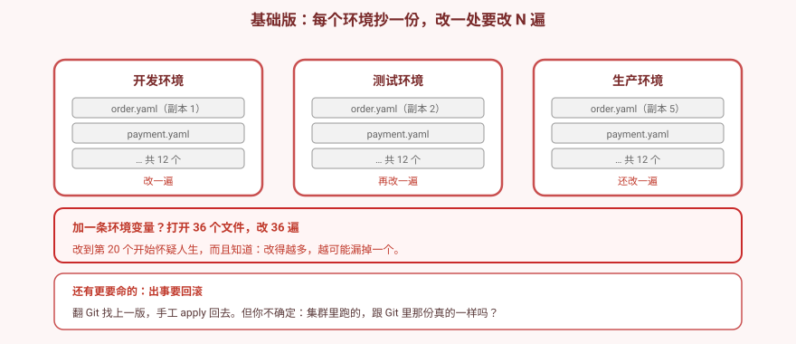
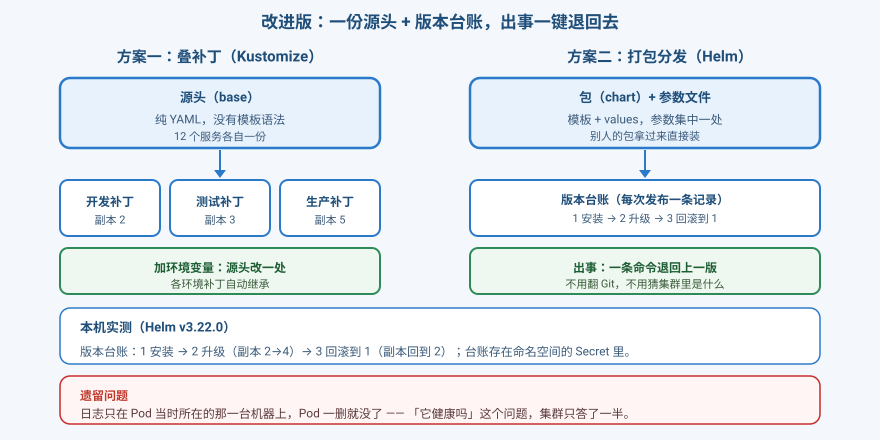
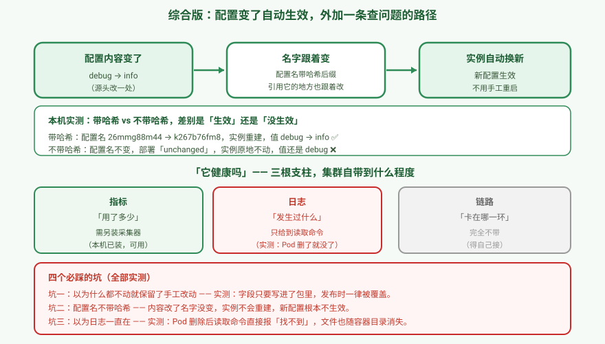

# 应用实战 · 12 个服务 × 3 套环境，改一处要改 36 遍

> 对应课程：[第 14 课：Helm · Kustomize · 可观测性](../stages/4-配置存储资源工程化/lessons/lesson-14-Helm与Kustomize与可观测性.md) ｜ 覆盖知识点：Helm 生命周期、release 存储、三向合并、values 优先级、Kustomize 多环境、可观测性三支柱
> 定位：**会用，不上生产**——课里学完，在这里动手。课内第四幕做的是**机制验证**（生命周期、优先级、哈希变化、日志落点）；这里做的是**一个真实的交付场景：36 份 YAML 怎么收敛成一份源头，以及出事怎么退回去**。
> 📖 结论已按官方文档核对（核对于 2026-09 ｜ 来源：[Using Helm](https://helm.sh/docs/intro/using_helm/)、[Changes Since Helm 2](https://v3.helm.sh/docs/faq/changes_since_helm2/)、[Kustomize](https://kustomize.io/)、[Logging Architecture](https://kubernetes.io/zh-cn/docs/concepts/cluster-administration/logging/)）
> 🧪 **本篇全部输出为本机 kind 集群 `k8s-c1-calico`（k8s v1.34.0 + Calico v3.31.0，1 control-plane + 2 worker，helm v3.22.0、kubectl 内置 kustomize v5.7.1、metrics-server v0.9.0）实测**，非推演；实测脚本见 `.plans/2026-09-16-k8s-应用实战补齐/t14-helm.sh` ~ `t14-3way2.sh`

---

## 场景：业务方说，给所有服务加一条环境变量

**场景**：你负责 12 个服务，要在**开发 / 测试 / 生产**三套环境部署。目录里躺着 36 份 YAML。现在业务方说：**给所有服务加一条环境变量 `TRACE_ID`**。

你打开 36 个文件，改 36 遍。改到第 20 个开始怀疑人生——而且你知道，改得越多，越可能**漏掉一个**。

更糟的是第二个场景：**生产刚发的版本有问题，要回滚**。你翻 Git 找上一版 YAML，然后 `kubectl apply`。但你不确定：集群里现在跑的，跟 Git 里那份真的一样吗？万一上周有人 `kubectl edit` 手工改过呢？

**全貌一句话**：本课只解决「**一堆 YAML 怎么管、出事怎么退**」这一层。真实生产还牵扯 GitOps（Argo CD / Flux）、密钥管理、多集群分发。判断标准只有一句：**改一处，你要动几个地方？**

> ⚠️ **先记住三个硬约束**：
> 1. **Helm 管着的字段，发布时一律被覆盖**——与你"这次改没改它"无关（本篇最大的坑，见陷阱一）。
> 2. **配置名不带哈希，改了内容也不会生效**——名字没变，实例就不会重建。
> 3. **日志只在 Pod 当时所在的那一台机器上**——Pod 一删就没了，这是可观测性的硬边界。

---

## 准备

```bash
helm version --short                 # 期望 v3.22.0+
kubectl version --client -o yaml | grep -i kustomize   # 期望 v5.7.1
kubectl top nodes                    # 确认 metrics-server 可用
```

> 💡 **Kustomize 不用单独装**：`kubectl` 从 v1.14 起内置，`kubectl kustomize <dir>` / `kubectl apply -k <dir>` 直接可用。

---

### ① 基础实现（能跑但幼稚）：每个环境抄一份

先看"手工时代"的代价。三个环境各 12 份，同一件事写三遍。

```
manifests/
├── dev/       order.yaml（副本 1）payment.yaml … 共 12 个
├── staging/   order.yaml（副本 2）payment.yaml … 共 12 个
└── prod/      order.yaml（副本 5）payment.yaml … 共 12 个
```

加一条环境变量 = 改 36 遍。而**真正致命的是回滚**：翻 Git 找上一版，手工 apply 回去——但你没法确认集群里现在跑的就是 Git 里那份。



> ⚠️ **它的问题**：① 改一处动 N 处，越改越可能漏；② 环境间差异**埋在整份文件里**，看不出哪几行不同；③ **没有版本台账**——出事只能翻 Git，且无法确认集群现状。

---

### ② 改进实现：一份源头 + 版本台账

两条路，哲学完全不同。

#### 方案一：Kustomize —— 叠补丁，YAML 还是纯 YAML

`base` 写大家一样的，每个环境只写**自己的差异**：

```bash
mkdir -p /tmp/l14kus/{base,overlays/dev,overlays/prod} && cd /tmp/l14kus

cat > base/deployment.yaml <<'EOF'
apiVersion: apps/v1
kind: Deployment
metadata:
  name: myapp
spec:
  replicas: 1
  selector: {matchLabels: {app: myapp}}
  template:
    metadata: {labels: {app: myapp}}
    spec:
      containers:
      - name: c
        image: nginx:1.27
        env:
        - name: LOG_LEVEL
          valueFrom:
            configMapKeyRef: {name: app-config, key: log_level}
EOF
echo "resources: [deployment.yaml]" > base/kustomization.yaml
```

```bash
cat > overlays/prod/kustomization.yaml <<'EOF'
resources: [../../base]
namePrefix: prod-                      # 名字自动加前缀
patches:
- target: {kind: Deployment}
  patch: |
    - op: replace
      path: /spec/replicas
      value: 5
    - op: replace
      path: /spec/template/spec/containers/0/image
      value: nginx:1.25.3
configMapGenerator:
- name: app-config
  literals: [log_level=warn]
EOF

kubectl kustomize overlays/prod/
```

**本机实测**：

```
      name: prod-myapp           ← 前缀自动加上
      replicas: 5                ← 补丁生效
            image: nginx:1.25.3  ← 镜像被换掉
      name: prod-app-config-b5gkg66gb5   ← 配置名带哈希
```

> 💡 哈希后缀**只由内容决定**，跟环境名无关。本机复验时 prod 得到 `b5gkg66gb5`（内容为 `log_level=warn`）；你改了内容它就是另一个值——**看"有没有后缀"和"改内容后会不会变"，不要抄这个具体值**。

> 🔑 **源头仍是纯 YAML，没有任何模板语法**——这是它和 Helm 最本质的区别。

#### 方案二：Helm —— 打包分发，带版本台账

```bash
cd /tmp && rm -rf l14helm && mkdir l14helm && cd l14helm
helm create myapp
kubectl create ns ns-helm

helm upgrade --install myapp ./myapp -n ns-helm --set replicaCount=2 --wait --timeout 180s
helm upgrade myapp ./myapp -n ns-helm --set replicaCount=4 --wait --timeout 180s
helm rollback myapp 1 -n ns-helm --wait --timeout 180s
```

**本机实测**——这就是手工 YAML 没有的东西：

```
REVISION  UPDATED                  STATUS      DESCRIPTION
1         Fri Sep 18 09:36:19 2026 superseded  Install complete
2         Fri Sep 18 09:36:31 2026 superseded  Upgrade complete
3         Fri Sep 18 09:36:34 2026 deployed    Rollback to 1

回滚后副本数: 2      ← 回到了第 1 版的状态
```

**台账存在哪？** 在命名空间的 Secret 里：

```bash
kubectl get secret -n ns-helm -l owner=helm
```

```
NAME                          TYPE               DATA   AGE
sh.helm.release.v1.myapp.v1   helm.sh/release.v1 1      12s
sh.helm.release.v1.myapp.v2   helm.sh/release.v1 1      10s
sh.helm.release.v1.myapp.v3   helm.sh/release.v1 1      8s
```

> 🔑 **每发布一次存一个 Secret，里面是当时的完整快照**（manifest + values）。**回滚为什么能工作？因为它把历史版本整个存下来了**——不是靠 Git 猜。

**values 优先级**（实测）：

```
默认:            1
-f f.yaml(3):    3
-f f.yaml --set 5:  5      ← --set 最高
-f f.yaml -f g.yaml(7):  7  ← 多个 -f，后面的覆盖前面的
```



> ⚠️ **遗留问题**：配置改了，怎么让实例真的用上新配置？以及——**"它健康吗"这个问题，集群只答了一半**。

---

### ③ 综合实现：配置变了自动生效

#### 配置名带哈希 → 改内容自动触发重建

Kustomize 的 `configMapGenerator` **默认给名字加内容哈希**。内容变了，名字就变，引用它的 Deployment 也跟着变 → 实例自动重建。

> 💡 下面用 `alpine` 建一份**独立的** base（跟上一段的 nginx 示例分开目录，避免混淆）。

```bash
mkdir -p /tmp/l14k2/{base,overlays/dev} && cd /tmp/l14k2

cat > base/deployment.yaml <<'EOF'
apiVersion: apps/v1
kind: Deployment
metadata:
  name: myapp
spec:
  replicas: 2
  selector: {matchLabels: {app: myapp}}
  template:
    metadata: {labels: {app: myapp}}
    spec:
      containers:
      - name: c
        image: alpine:3.20
        command: ["sleep","3600"]
        env:
        - name: LOG_LEVEL
          valueFrom:
            configMapKeyRef: {name: app-config, key: log_level}
EOF
echo "resources: [deployment.yaml]" > base/kustomization.yaml

cat > overlays/dev/kustomization.yaml <<'EOF'
resources: [../../base]
namePrefix: dev-
configMapGenerator:
- name: app-config
  literals:
  - log_level=debug
EOF

kubectl create ns ns-kus
kubectl apply -k overlays/dev/ -n ns-kus
kubectl -n ns-kus rollout status deployment/dev-myapp --timeout=180s
kubectl -n ns-kus exec deployment/dev-myapp -- printenv LOG_LEVEL
```

**本机实测**——带哈希：

```
configmap/dev-app-config-26mmg88m44 created
deployment.apps/dev-myapp created

改前 CM:  dev-app-config-26mmg88m44
改前 值:  debug
```

把 `log_level` 改成 `info` 再 apply：

```bash
cat > overlays/dev/kustomization.yaml <<'EOF'
resources: [../../base]
namePrefix: dev-
configMapGenerator:
- name: app-config
  literals:
  - log_level=info
EOF

kubectl apply -k overlays/dev/ -n ns-kus
kubectl -n ns-kus rollout status deployment/dev-myapp --timeout=180s
kubectl -n ns-kus exec deployment/dev-myapp -- printenv LOG_LEVEL
```

```
configmap/dev-app-config-k267b76fm8 created   ← 名字变了
deployment.apps/dev-myapp configured

改后 CM:  dev-app-config-k267b76fm8   ← 名字变了
改后 值:  info                        ← 新配置生效
```

> 🔑 名字一变，Deployment 里引用的名字也跟着变，于是**实例自动重建**——不用你手工重启。

**对照**——关掉哈希（`disableNameSuffixHash: true`）：

```bash
mkdir -p /tmp/l14k3/{base,overlays/dev} && cd /tmp/l14k3
cp /tmp/l14k2/base/deployment.yaml base/
echo "resources: [deployment.yaml]" > base/kustomization.yaml

cat > overlays/dev/kustomization.yaml <<'EOF'
resources: [../../base]
namePrefix: dev-
configMapGenerator:
- name: app-config
  literals:
  - log_level=debug
generatorOptions:
  disableNameSuffixHash: true
EOF

kubectl create ns ns-kus2
kubectl apply -k overlays/dev/ -n ns-kus2
kubectl -n ns-kus2 rollout status deployment/dev-myapp --timeout=180s
kubectl -n ns-kus2 exec deployment/dev-myapp -- printenv LOG_LEVEL
```

```
configmap/dev-app-config created        ← 没有哈希
改前 值: debug
```

同样把 `debug` 改成 `info` 再 apply（**改法同上，只多一行 `disableNameSuffixHash: true`**）：

```
configmap/dev-app-config configured
deployment.apps/dev-myapp unchanged   ← 部署「没有变化」
改后 值: debug                        ← 还是旧值！
```

> 🔑 **名字没变 → Deployment 没变 → 实例不重建 → 新配置根本不生效。** 这类问题最阴险的地方在于：**apply 显示成功，没有任何报错**，但线上跑的还是旧配置。

#### 「它健康吗」——三根支柱，集群自带到什么程度

| 支柱 | 回答什么 | k8s 自带到哪 |
|---|---|---|
| 指标 | 用了多少 | **需另装采集器**（本机已装 metrics-server，`kubectl top` 可用） |
| 日志 | 发生过什么 | **只给到读取命令**（`kubectl logs`），不做存储 |
| 链路 | 卡在哪一环 | **完全不带**，得自己接 |

**日志的真实落点**（本机实测，登录 kind 节点看）：

```bash
kubectl create ns ns-log

kubectl apply -f - <<'EOF'
apiVersion: v1
kind: Pod
metadata: {name: logdemo, namespace: ns-log}
spec:
  nodeSelector: {kubernetes.io/hostname: k8s-c1-calico-control-plane}
  tolerations:                                   # ← control-plane 有污点，不加会一直 Pending
  - {key: node-role.kubernetes.io/control-plane, operator: Exists, effect: NoSchedule}
  containers:
  - name: c
    image: alpine:3.20
    command: ["sh","-c"]
    args: ["i=0; while true; do echo \"line-$i\"; i=$((i+1)); sleep 2; done"]
EOF

kubectl wait --for=condition=Ready pod/logdemo -n ns-log --timeout=120s
sleep 8
kubectl logs logdemo -n ns-log | head -3
```

**本机实测**：

```
pod/logdemo condition met
logs: line-0

/var/log/pods/ns-log_logdemo_052aa49c-0522-4d62-984b-45f30f4350c7/c/0.log
```

> ⚠️ **照抄要点**：`nodeSelector` 和 `tolerations` **两个都要**——只写 `nodeSelector` 会因 control-plane 的 `NoSchedule` 污点而一直 Pending（本篇复验时踩到）。`nodeSelector` 决定"去哪台"，`tolerations` 决定"能不能进"。

> ⚠️ `docker exec` 进 kind 节点是**教学环境专用手段**。真实集群用 `ssh` 或 `kubectl debug node/<name> -it --image=busybox`。

**边界实测**——Pod 删掉后（用 `--wait=true` 确保真的删完）：

```bash
kubectl delete pod logdemo -n ns-log --wait=true
kubectl logs logdemo -n ns-log
```

```
  error: error from server (NotFound): pods "logdemo" not found in namespace "ns-log"
```

节点上的文件也一并消失：

```
删除前: /var/log/pods/ns-log_logdemo_71a1ef20-.../c/0.log
删除后: （空）
```

> ⚠️ **照抄要点**：必须用 `--wait=true`（或删完 `sleep` 几秒）。用 `--wait=false` 时 Pod 还在终止中，`kubectl logs` **仍能读到旧内容**——你会误以为"日志还在"。本篇复验时正踩了这个坑。

**另一个边界**——日志只存在于**当时所在的那台机器**。建一个跑在 worker 上的 Pod：

```bash
kubectl apply -f - <<'EOF'
apiVersion: v1
kind: Pod
metadata: {name: logdemo2, namespace: ns-log}
spec:
  nodeSelector: {kubernetes.io/hostname: k8s-c1-calico-worker}
  containers:
  - name: c
    image: alpine:3.20
    command: ["sh","-c"]
    args: ["echo 'from worker'; sleep 300"]
EOF

kubectl wait --for=condition=Ready pod/logdemo2 -n ns-log --timeout=120s
kubectl logs logdemo2 -n ns-log
```

**本机实测**：

```
logdemo2 在: k8s-c1-calico-worker
logs: from worker
```

再到**两台**机器上分别找：

```bash
docker exec k8s-c1-calico-control-plane sh -c 'find /var/log/pods -path "*logdemo2*" 2>/dev/null'
docker exec k8s-c1-calico-worker         sh -c 'find /var/log/pods -path "*logdemo2*" -name "*.log" 2>/dev/null'
```

```
在 control-plane 上找: （空）
在 worker 上找:       /var/log/pods/ns-log_logdemo2_3da8fc95-.../c/0.log
```

> 🔑 **Pod 重建或调度到别的机器，你在原节点上就再也找不到它的日志了。** 这就是"要接日志平台"的全部理由。



---

## 四个必踩的坑（全部实测）

### 陷阱一：以为"值没变"就保留了手工改动 —— **错的**

这是本篇**最重要**的一条，也是我实测中**推翻了课内说法**的一条。

课内讲三向合并时说："字段 Helm 管着，但新旧版本**值没变** → 保留手工改动"。**实测不是这样。**

用 Helm 官方维护者的实验精确复现（来源：[helm/helm issue #13411](https://github.com/helm/helm/issues/13411)）——造一个只管注解 `a` 的 chart：

```bash
# chart 里：annotations: {a: "1"}
# 现场手工改成：a=2，并加一个 chart 不管的 b=3
kubectl annotate cm myapp-anno a=2 b=3 --overwrite

# 然后 upgrade，chart 里 a 仍然是 "1"（值没变！）
helm upgrade myapp ./myapp
```

**本机实测**：

```
现场:   {"a":"2","b":"3",...}
upgrade 后: {"a":"1","b":"3",...}
          ↑ a 被覆盖回 1    ↑ b 保留
```

> 🔑 **真实规则**：**字段只要出现在 chart 里（Helm 管着），upgrade 时就会被 chart 值覆盖——与"这次改没改它"无关。** 只有 **chart 完全不管的字段**（别人注入的 sidecar、注解）才会保留。
>
> Helm 官方维护者 `bacongobbler` 在该 issue 中确认：*"a is specified in helm chart, even though the value is not changed between original and target helm chart, the live state is not preserved."*
>
> **实践含义**：别指望"我没动这个字段所以手工改动会留着"。想保留现场改动，**唯一可靠的办法是这个字段不要写进 chart**。

**顺带**：`--force` 会改用 PUT 替换而非 PATCH，**连带把 chart 不管的字段也清掉**（实测 `b=3` 被一并删除）。

### 陷阱二：配置名不带哈希 → 改了内容也不生效

见 ③ 的对照实测：**`deployment unchanged`，值还是 `debug`，而 apply 全程无报错**。

> ⚠️ 如果你**手动**给 ConfigMap 起名（不通过 `configMapGenerator`），改内容后必须**自己**重启实例，否则新配置永远不会生效。

### 陷阱三：以为日志一直在 —— Pod 一删就没了

实测 `kubectl logs` 直接报 `NotFound`，节点上的文件也随容器目录消失。而且**日志只存在于当时所在的那一台机器**。

> 🔑 这意味着"查昨天那个报错"在原生 k8s 里**根本做不到**——必须接日志平台（Loki / ES 等）。

### 陷阱四：`--set` 的点号，KEY 和 VALUE 待遇不同

**VALUE 里的点号**：转不转义都一样（课内已验证）。

**KEY 里的点号**：必须转义，否则被当成层级分隔符：

```bash
# 错误：nginx → ingress → kubernetes → io/x
helm template a ./myapp --set 'podAnnotations.nginx.ingress.kubernetes.io/x=/foo'

# 正确
helm template b ./myapp --set 'podAnnotations.nginx\.ingress\.kubernetes\.io/x=/foo'
```

> 💡 这类"看起来对但静默出错"的参数，用 `-f values.yaml` 比 `--set` 安全得多。

---

> 🎯 **会用标志**：给你"十几个服务、三套环境"的需求，你能——
> - 说清 Helm 与 Kustomize 的**本质差异**（打包分发 vs 叠补丁），而不是背语法；
> - 装、升、回滚一个应用，并**指出台账存在命名空间的 Secret 里**、说明回滚为什么能工作；
> - 用实测推翻"值没变就保留手工改动"的说法，说出**真实规则是"chart 管着的字段一律覆盖"**；
> - 解释**为什么关掉哈希后配置改了不生效**，并知道这类问题**不会报错**；
> - 说清**日志只存在 Pod 当时所在的那一台机器**，Pod 一删就没，所以要接日志平台；
> - 判断场景选型：装第三方组件用 Helm，自家多环境配置用 Kustomize。

---

## 常见坑（本篇实测踩到的）

1. **以为"值没变"就保留手工改动**——实测一律被覆盖（陷阱一，本篇最大坑）。
2. **`configMapGenerator` 用 `files:` 时键名是文件名**——写 `files: [app.properties]`，生成的键是 `app.properties` **不是** `log_level`。我在这上面连栽两次，误判成"镜像拉不到"。要直接生成 `log_level` 键请用 `literals:`。
3. **关掉哈希后改配置不生效**——apply 无报错，最阴险。
4. **`--force` 会清掉 chart 不管的字段**——它用 PUT 替换，别人的 sidecar 也没了。
5. **heredoc 里写 `\$VAR` 会让 YAML 解析失败**——`found unknown escape character`。要输出 shell 变量请用 `command: ["sleep","3600"]` 这类写法绕开。
6. **以为日志永久保存**——Pod 删了就没，且只在那台机器上。
7. **control-plane 有污点**——日志演示 Pod 不加容忍/`nodeSelector` 会一直 Pending。
8. **`--set` 的 KEY 含点号要转义**——VALUE 不用，两者待遇不同。
9. **多个 `-f` 后面的覆盖前面的**——实测 `-f f(3) -f g(7)` 得 7。
10. **release Secret 会一直累积**——每次发布多一个，`helm history` 默认只显示最近若干条。

---

## 🧭 导航

- ⬅️ 回到课程：[第 14 课：Helm · Kustomize · 可观测性](../stages/4-配置存储资源工程化/lessons/lesson-14-Helm与Kustomize与可观测性.md)
- 📚 全部实战：[应用实战索引](INDEX.md)
- ⬅️ 上一篇：[13 · 资源边界与自动扩缩容](13-资源边界与自动扩缩容.md)

**清理**（务必执行）：

```bash
helm uninstall myapp -n ns-helm
kubectl delete ns ns-helm ns-log
rm -rf /tmp/l14helm /tmp/l14kus
```

> 💡 **下一站**：阶段 4 到此收官。课 15 起进入阶段 5《安全体系》——现在谁都能对你的集群为所欲为，得管起来了。
