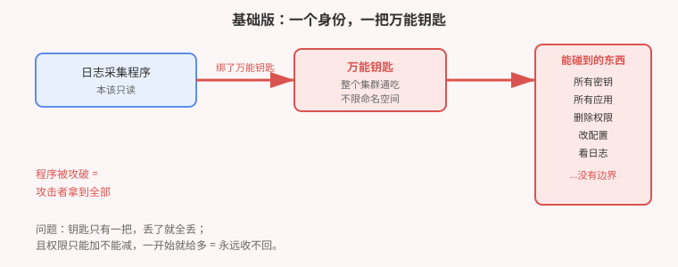
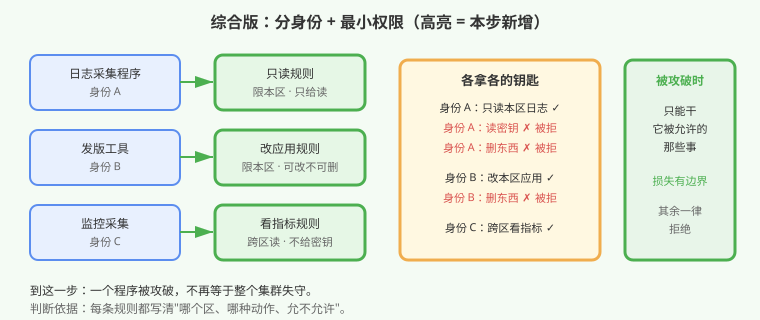

# 应用实战 · 一个日志采集器，差点让整个集群失守

> 对应课程：[第 15 课：认证 · 授权 · 准入 —— RBAC 与 ServiceAccount](../stages/5-安全体系/lessons/lesson-15-RBAC与ServiceAccount.md) ｜ 覆盖知识点：API 三段式、RBAC 白名单模型、Role 与 ClusterRole 作用域、ServiceAccount 身份
> 定位：**会用，不上生产**——课里学完，在这里动手。课内第四幕做的是**机制验证**（新建账号零权限、Role 不跨区、报错对照）；这里做的是**一个真实的授权场景：三个程序要访问集群，怎么给权限才不会一失守全丢**。
> 📖 结论已按官方文档核对（核对于 2026-09，来源：[Using RBAC Authorization](https://kubernetes.io/zh-cn/docs/reference/access-authn-authz/rbac/)、[Service Accounts](https://kubernetes.io/docs/concepts/security/service-accounts/)）
> 🧪 **本篇全部输出为本机 kind 集群 `k8s-c1-calico`（k8s v1.34.0 + Calico，1 control-plane + 2 worker）实测**，非推演

---

## 场景：三个程序要进集群，权限怎么给？

**场景**：你接手一个集群，有三个程序要跑起来：

1. **日志采集器**——读容器日志，发到后端
2. **发版工具**——更新应用版本
3. **监控采集器**——收集全集群指标

上一个维护者留下一句"先跑通再说"，给这三个程序**共用了一把钥匙**。现在安全同事问你一个问题：**如果日志采集器被攻破，攻击者能拿到什么？**

你查了一下，答案是：**全部**。因为共用的是同一把万能钥匙。

**全貌一句话**：本篇只解决「**程序身份怎么分、权限怎么给到最小**」这一层。真实生产还牵扯人的身份（证书 / OIDC）、准入控制（拦截不合规请求）、密钥轮转。判断标准只有一句：**这个程序被攻破，损失边界在哪？**

> ⚠️ **先记住三个硬约束**：
> 1. **默认是拒绝的**——新建的身份什么都不给，它什么都干不了。危险从来都是"给多了"造成的。
> 2. **权限只能加不能减**——没有"拒绝规则"这回事，所以**一开始就别给多**。
> 3. **Role 只在自己的区生效**——想跨区必须用另一种角色，这条最容易配错。

---

## 准备

```bash
kubectl auth can-i get pods          # 你自己（管理员），期望 yes
kubectl get nodes                    # 确认集群可用
```

> 💡 本篇命令都可直接复制执行，命名空间统一用 `shop`，结束后一条命令清干净。

---

### ① 基础实现（能跑但危险）：一个身份，一把万能钥匙

先复现上一任的做法。建一个身份，绑定一把通吃全集群的钥匙：

```bash
kubectl create ns shop
kubectl create sa log-agent -n shop
kubectl create clusterrolebinding log-admin \
  --clusterrole=cluster-admin \
  --serviceaccount=shop:log-agent
```

现在问那个关键问题——这个"只读"的采集器，到底能干什么：

```bash
kubectl auth can-i get secrets --all-namespaces --as=system:serviceaccount:shop:log-agent
kubectl auth can-i delete pods --all-namespaces --as=system:serviceaccount:shop:log-agent
```

**本机实测**：

```
yes          ← 全集群的密钥，它全能读
yes          ← 全集群的应用，它全能删
```

一个本该只读日志的程序，拿到了**删库级**的权限。



> ⚠️ **它的问题**：① 三个程序**共用一个身份**——分不清谁干了什么；② 权限**跨全部命名空间**，一个区被攻破等于全部失守；③ 一旦给出就**收不回来**（只能删掉重绑，期间服务中断）。

---

### ② 改进实现：分开身份 + 按需授权

改成三个身份，各拿各的规则。先看规则怎么定义——**规则只写"允许什么"，没写的一律拒绝**。

#### 第一步：给日志采集器一条"只读本区"的规则

```bash
# 先拆掉万能钥匙
kubectl delete clusterrolebinding log-admin

cat <<'EOF' | kubectl apply -f -
apiVersion: rbac.authorization.k8s.io/v1
kind: Role
metadata:
  name: log-reader
  namespace: shop
rules:
- apiGroups: [""]
  resources: ["pods", "pods/log"]
  verbs: ["get", "list"]
EOF

kubectl create rolebinding log-reader-bind \
  --role=log-reader \
  --serviceaccount=shop:log-agent -n shop
```

再问同样的问题：

```bash
kubectl auth can-i get pods    -n shop    --as=system:serviceaccount:shop:log-agent
kubectl auth can-i get secrets -n shop    --as=system:serviceaccount:shop:log-agent
kubectl auth can-i get pods    -n default --as=system:serviceaccount:shop:log-agent
kubectl auth can-i delete pods -n shop    --as=system:serviceaccount:shop:log-agent
```

**本机实测**（与上面那组 `yes / yes` 形成对照）：

```
yes    ← 本区读应用：允许（这是它的本职工作）
no     ← 本区读密钥：拒绝
no     ← 其他区读应用：拒绝（Role 不跨区，这是易错点）
no     ← 删除：拒绝（规则里只写了 get / list）
```

> 💡 **这四行就是本篇的核心**：同一个身份，从"什么都行"变成"只干本职"。而拒绝是**默认发生**的——你只写了允许什么，没写的自动拒绝。

#### 第二步：三个程序各自的规则

发版工具需要改应用，监控要跨区看指标。写法上的差别值得注意：

```bash
# 发版工具：本区内可改应用，但不允许删
cat <<'EOF' | kubectl apply -f -
apiVersion: rbac.authorization.k8s.io/v1
kind: Role
metadata:
  name: deployer
  namespace: shop
rules:
- apiGroups: ["apps"]
  resources: ["deployments"]
  verbs: ["get", "list", "patch", "update"]
EOF
```

```bash
# 监控采集器：要跨区，必须用 ClusterRole + RoleBinding
#   ClusterRole = 规则模板，跨不跨区取决于用哪种 binding 绑
kubectl create clusterrole metrics-reader \
  --verb=get,list \
  --resource=pods,nodes,nodes/metrics

kubectl create rolebinding metrics-bind \
  --clusterrole=metrics-reader \
  --serviceaccount=shop:metrics-agent \
  -n shop
```

> ⚠️ **最容易配错的一点**：`ClusterRole` 本身**不代表跨区权限**。
> - `ClusterRole` + `RoleBinding` → 只在 RoleBinding 所在的那个区生效
> - `ClusterRole` + `ClusterRoleBinding` → 才真正全集群生效
>
> 想让监控只采集某个区，用前者；想让它看全集群，才用后者。这个组合容易记反。

#### 第三步：顺手关掉一个默认风险

默认情况下，每个 Pod 都会被自动塞一把身份钥匙。不需要的程序应该关掉：

```yaml
apiVersion: v1
kind: Pod
metadata:
  name: no-token
spec:
  automountServiceAccountToken: false    # 不自动挂载
  containers:
  - name: c
    image: nginx:1.27
```

```bash
kubectl exec no-token -- ls /var/run/secrets/kubernetes.io/serviceaccount/
# 期望：No such file or directory   ← 容器里根本没有钥匙
```



---

## 常见坑

**坑 1：用 `cluster-admin` 省事。** 这是本篇开头那个反例。代价是"一次攻破，全盘失守"。正确做法是**先给零权限，看它报什么错，再按报错补**——因为默认是拒绝的，报错会精确告诉你缺哪一条。

**坑 2：以为 `Role` 能跨区。** 实测第三行 `no` 就是证据。`Role` 定义的规则**只在它自己那个命名空间里存在**，绑给别的区的账号也无效。要跨区请用 `ClusterRole`。

**坑 3：混淆 `ClusterRole` 和"跨区权限"。** 见第二步说明——跨不跨区由 **binding 类型**决定，不由角色类型决定。

**坑 4：忘了程序身份默认会被塞进容器。** 每个 Pod 默认挂一把钥匙。不需要调 API 的程序请关掉 `automountServiceAccountToken`，否则它就是"攻击者进容器后捡到的第一件东西"。

**坑 5：想靠"加一条拒绝"来收紧。** 没有拒绝规则——授权模型是白名单，只能加允许。所以**给之前多想十秒**，比事后补救容易得多。

---

## 排障速查

```bash
# 这个身份到底能干什么？（最实用的一条）
kubectl auth can-i --list --as=system:serviceaccount:shop:log-agent -n shop

# 谁绑了这个角色？
kubectl get rolebinding,clusterrolebinding -A -o wide | grep log-agent
```

> 📌 **报错对照**：`Unauthorized`（401）= 没通过身份核验，钥匙本身有问题；`Forbidden`（403）= 身份认出来了但没权限，去补规则。两者排查方向完全不同。

---

## 清理

```bash
kubectl delete ns shop --timeout=180s
```

---

> 🎯 **会用标志**：拿到一个"某程序需要访问集群"的需求，能写出现状四问（`get` / `get secrets` / 跨区 / 删除）的答案，并说清为什么默认是 `no`、以及 `Role` 与 `ClusterRole` 的跨区差别由什么决定。

---

- ⬅️ 上一课实战：[14-一份源头多套环境](./14-一份源头多套环境.md)
- ➡️ 下一课实战：[16-合规检查把应用卡住了](./16-合规检查把应用卡住了.md)
- 📚 全部实战：[应用实战索引](INDEX.md)
