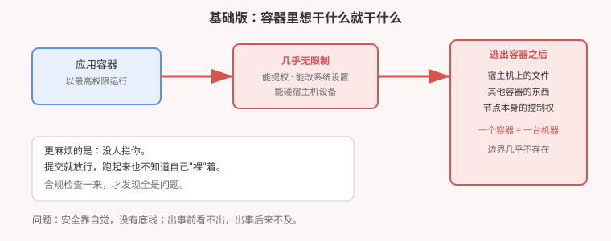
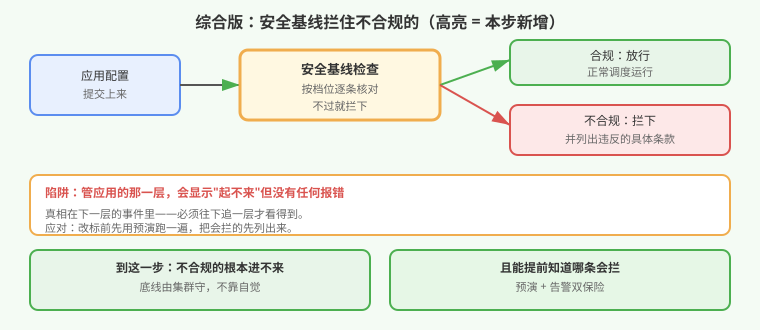

# 应用实战 · 合规检查把应用卡住了

> 对应课程：[第 16 课：Pod 安全 PSA 与 securityContext](../stages/5-安全体系/lessons/lesson-16-Pod安全PSA与securityContext.md) ｜ 覆盖知识点：Pod 安全标准三档、命名空间级基线、securityContext 加固项、warn 与 enforce
> 定位：**会用，不上生产**——课里学完，在这里动手。课内第四幕做的是**机制验证**（逐项看哪条被拦、capabilities 丢光的效果）；这里做的是**一个真实的推进场景：要给存量区上安全基线，怎么做到不把业务搞挂**。
> 📖 结论已按官方文档核对（核对于 2026-09，来源：[Pod Security Standards](https://kubernetes.io/zh-cn/docs/concepts/security/pod-security-standards/)、[Pod Security Admission](https://kubernetes.io/zh-cn/docs/concepts/security/pod-security-admission/)）
> 🧪 **本篇全部输出为本机 kind 集群 `k8s-c1-calico`（k8s v1.34.0 + Calico）实测**，非推演

---

## 场景：安全同事要求上基线，但业务不能停

**场景**：你的集群里跑着一个应用，一直好好的。某天安全同事发来要求：**所有命名空间必须启用 `restricted` 安全基线**。

你查了文档，加个标签就行：

```bash
kubectl label ns myapp pod-security.kubernetes.io/enforce=restricted
```

打完标签，应用**起不来了**。更糟的是——**没有任何报错**。你看到的是副本数 `0/1`，然后就是漫长的排查。

这就是本篇要处理的真实问题：**上基线本身只要一条命令，难的是"怎么上才不出事"**。

**全貌一句话**：本篇只解决「**命名空间级安全底线的落地与预演**」这一层。真实生产还牵扯准入控制组件、自定义策略、镜像签名验证。判断标准只有一句：**不合规的应用是"进不来"，还是"偷偷混进去了"？**

> ⚠️ **先记住三个硬约束**：
> 1. **基线是"全或无"**——五条条款差一条也不放行，不存在"差不多合规"。
> 2. **管应用的那一层不会告诉你被拦了**——它只显示"起不来"，真相藏在下一层。
> 3. **改标签前一定要预演**——否则你是在生产上做盲测。

---

## 准备

```bash
kubectl version --short 2>/dev/null | head -1    # 期望 v1.25+（PSA 在该版本起正式可用）
kubectl create ns psa-demo
```

---

### ① 基础实现（能跑但危险）：默认就是"想干什么干什么"

先看不加任何约束时，一个容器有多"自由"：

```bash
cat <<'EOF' | kubectl apply -f -
apiVersion: apps/v1
kind: Deployment
metadata:
  name: risky
  namespace: psa-demo
spec:
  replicas: 1
  selector:
    matchLabels: {app: risky}
  template:
    metadata:
      labels: {app: risky}
    spec:
      containers:
      - name: c
        image: registry.k8s.io/pause:3.10
        securityContext:
          privileged: true
EOF
```

```
deployment.apps/risky created     ← 提交成功，没人拦
```

**它的问题不是"会立刻出事"，而是"没人拦"**——这个容器拿到了几乎等同宿主机的能力，逃出容器的边界几乎不存在。而平台层面**不会有任何提示**。



> ⚠️ **它的问题**：① 安全**靠自觉**，没有底线；② 出事前**看不出问题**；③ 合规检查一来，是**一次性发现几十个**——改起来的成本远高于当初多写几行。

---

### ② 改进实现：上基线，但先预演

现在给这个区上 `restricted` 基线。**不要直接打 enforce**——先看如果打了会拦什么：

```bash
kubectl label ns psa-demo pod-security.kubernetes.io/enforce=restricted --overwrite
```

**本机实测**：

```
Warning: existing pods in namespace "psa-demo" violate the new PodSecurity enforce level "restricted:latest"
Warning: risky-688d4bbf59-95lmz: privileged, allowPrivilegeEscalation != false,
         unrestricted capabilities, runAsNonRoot != true, seccompProfile
namespace/psa-demo labeled
```

> 💡 **这里的条数取决于应用写了什么**：上面那个 `privileged: true` 的容器违反 **5 条**；而一个普通容器（如 `kubectl run probe`）只违反 **3 条**（少了 privileged 与其中一项）。**看"列了哪几条"，不要记"一定是五条"**。

平台**已经告诉你了**：存量的那个应用违反五条。但注意——这只是一个 `Warning`，**应用不会自己消失，新副本也起不来**。

#### 陷阱：管应用的那一层显示"起不来"，但没有报错

这是本篇最实用的一点。你去看应用状态：

```bash
kubectl get deploy risky -n psa-demo
kubectl get pod -n psa-demo
```

**本机实测**：

```
risky   0/1   1   0   0s            ← 副本数 0/1，就这样
risky-688d4bbf59-95lmz   0/1   ContainerCreating   0   0s
```

**没有任何一行说"被安全基线拦了"**。你看到的是"起不来"，原因得自己找。

真相在下一层的事件里：

```bash
kubectl describe rs -n psa-demo | grep -A5 'Events'
```

```
Events:
  Normal  SuccessfulCreate  0s  replicaset-controller  Created pod: risky-688d4bbf59-95lmz
```

> 💡 事件里也只有"创建成功"——**因为被拦的是 Pod 这一层，不是控制器**。要看到真正的拒绝原因，得直接提交一个 Pod（而不是 Deployment）：
>
> ```bash
> kubectl run probe --image=registry.k8s.io/pause:3.10 -n psa-demo
> # Error from server (Forbidden): ... violates PodSecurity "restricted:latest": ...
> ```
>
> **记住这个排查路径**：应用显示 `0/1` → 去看下一层事件 → 还看不出就**手动提交一个 Pod**，报错会直接打在脸上。

#### 正确的加固姿势：五条一起改

`restricted` 是"全或无"的，改一条没用。合规写法长这样：

```yaml
apiVersion: apps/v1
kind: Deployment
metadata:
  name: safe
  namespace: psa-demo
spec:
  replicas: 1
  selector:
    matchLabels: {app: safe}
  template:
    metadata:
      labels: {app: safe}
    spec:
      securityContext:
        runAsNonRoot: true
        seccompProfile:
          type: RuntimeDefault
      containers:
      - name: c
        image: registry.k8s.io/pause:3.10
        securityContext:
          allowPrivilegeEscalation: false
          capabilities:
            drop: ["ALL"]
        # 注意：restricted 不强制 readOnlyRootFilesystem，
        # 但生产建议加上，配合 emptyDir 解决可写目录需求
```

> ⚠️ **易错点**：`runAsNonRoot` 和 `seccompProfile` 是**命名空间级**的（写在 `spec.securityContext`），另外两条是**容器级**的（写在 `containers[].securityContext`）。写错位置等于没写。

**本机实测**：这样写的 Deployment 在 `restricted` 区**能正常起来**：

```
safe-b5bfcc98f-cj8xz   1/1   Running   0    8s
```

（对照：上面那个 `privileged` 的同区 Deployment 停在 `0/1`。）

#### 上线前必做：用 warn 模式先跑一遍

这是避免"打标签即事故"的关键——**只告警不拦截**：

```bash
kubectl label ns psa-demo pod-security.kubernetes.io/warn=restricted --overwrite
kubectl label ns psa-demo pod-security.kubernetes.io/enforce=baseline --overwrite
```

这样配置的好处：

- `enforce=baseline`：底线较低，**存量应用大概率能跑**
- `warn=restricted`：每次提交都告诉你"离最高档还差什么"，但**不拦**

跑一段时间、把告警都修完，再把 `enforce` 提到 `restricted`。**这是从"能跑"走到"合规"的唯一稳妥路径。**



---

## 常见坑

**坑 1：直接打 `enforce=restricted` 而不预演。** 就是本篇开头的场景——存量应用全部起不来，且**没有直接报错**。先 `warn` 再 `enforce`。

**坑 2：看到 `0/1` 就以为是镜像或资源问题。** 忘查事件、更忘手动提交 Pod 验证。记住：安全拦截的报错**只出现在直接提交 Pod 的时候**。

**坑 3：改一条就以为够了。** `restricted` 一次列出全部违规项，实测那个 Pod 违反**五条**——它不会因为你改了一条就放行。

**坑 4：配置写错层级。** 命名空间级和容器级的 `securityContext` 字段不同，写错位置不报错也不生效。

**坑 5：以为 `enforce` 会清理存量。** 实测显示它只发 Warning，**存量 Pod 不会被删除**——但副本一旦重建就起不来。这个"半死不活"状态最容易误判。

---

## 排障速查

```bash
# 这个区当前什么档位？
kubectl get ns psa-demo -o jsonpath='{.metadata.labels}'

# 手动提交 Pod，拿真正的拒绝原因（最有 diagnostic 价值的一条）
kubectl run probe --image=nginx:1.27 -n psa-demo

# 打标前预演： Server 端试算，不真正写入
kubectl label ns psa-demo pod-security.kubernetes.io/enforce=restricted --dry-run=server
```

---

## 清理

```bash
kubectl delete ns psa-demo --timeout=180s
```

---

> 🎯 **会用标志**：拿到"给某区上 `restricted`"的要求，能说出先 `warn` 后 `enforce` 的推进顺序，能在应用显示 `0/1` 时定位到"被安全基线拦了"，并写出五条加固项的完整配置。

---

- ⬅️ 上一课实战：[15-最小权限授权](./15-最小权限授权.md)
- ➡️ 下一课实战：[17-密钥放在哪才算安全](./17-密钥放在哪才算安全.md)
- 📚 全部实战：[应用实战索引](INDEX.md)
