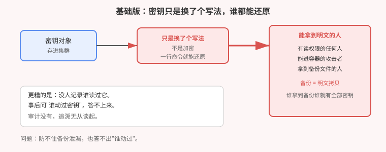
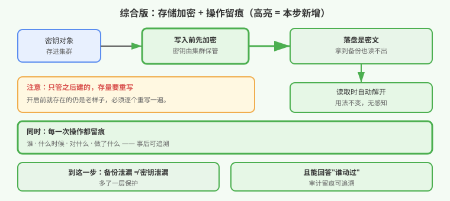

# 应用实战 · 密钥放在哪才算安全

> 对应课程：[第 17 课：Secret 加固与 etcd 加密与审计](../stages/5-安全体系/lessons/lesson-17-Secret加固与etcd加密与审计.md) ｜ 覆盖知识点：Secret 的编码本质、etcd 静态加密、审计日志、运行时暴露面
> 定位：**会用，不上生产**——课里学完，在这里动手。课内第四幕做的是**机制验证**（base64 可逆、卷挂载、不可变）；这里做的是**一个真实的加固场景：审计说"密钥保护不足"，怎么补到位**。
> 📖 结论已按官方文档核对（核对于 2026-09，来源：[Encrypting Secret Data at Rest](https://kubernetes.io/zh-cn/docs/tasks/administer-cluster/encrypt-data/)、[Auditing](https://kubernetes.io/zh-cn/docs/tasks/debug/debug-cluster/audit/)）
> 🧪 **本篇加密与审计为本机 kind 集群 `k8s-c1-calico`（k8s v1.34.0）真实开启后实测**，非推演；实测过程见 `.plans/2026-09-16-k8s-应用实战补齐/t17-*.sh`

---

## 场景：审计提了两条，你发现都不好补

**场景**：安全审计给你的集群提了两条问题：

1. **密钥存储未加密**——备份文件里能直接搜到数据库密码
2. **无操作留痕**——上月有密钥被改过，但查不出是谁改的

你去查文档，发现第一条**要改控制面配置并重启**，第二条**要写一份策略文件**。两条都不是"加个字段"能解决的——而且第一条做错了，整个集群会起不来。

**全貌一句话**：本篇只解决「**密钥落盘加密 + 操作留痕**」这两层。真实生产还牵扯外部密钥管理（Vault / 云厂商 KMS）、密钥轮转、备份加密。判断标准只有一句：**拿到一份集群备份，能不能读出密钥？改了密钥，能不能查到是谁？**

> ⚠️ **先记住三个硬约束**：
> 1. **默认存的是"换了个写法"，不是加密**——一行命令就能还原。
> 2. **开启加密只管之后新建的**——存量的必须**逐个重写**，否则等于没开。
> 3. **加密密钥长度必须是 16 / 24 / 32 字节**——写错会直接导致控制面起不来（本篇实测踩过）。

---

## 准备

> ⚠️ 本篇第 ② 步会**重启控制面，期间集群短暂不可用**。仅在自己的实验集群上做，且**第一步必须先备份**。

```bash
kubectl get nodes                              # 确认集群可用
docker exec <控制面节点> ls /etc/kubernetes/manifests/    # 确认能改静态配置
```

---

### ① 基础实现（能跑但危险）：默认状态就是"谁都能还原"

先看默认情况。建一个密钥，然后**用最普通的方式读出来**：

```bash
kubectl create ns ns-sec
kubectl create secret generic db-cred -n ns-sec --from-literal=password=supersecret
kubectl get secret db-cred -n ns-sec -o jsonpath='{.data.password}' | base64 -d
```

**本机实测**：

```
supersecret        ← 一行命令，明文到手
```

这个"编码"只是**为了能塞进文本字段**，不提供任何保密性。这意味着：

- 有读权限的人 → 能拿
- 拿到集群备份的人 → **一次性拿到全部密钥**
- 事后 → **查不出谁读过**（因为没有留痕）



> ⚠️ **它的问题**：① 备份文件 = **明文密钥全集**；② 泄漏面等于"所有有读权限的人"；③ **无留痕**，事后无法追溯。

---

### ② 改进实现：开启落盘加密 + 操作留痕

两条一起做。先说最最重要的一步——

#### 第 0 步：先备份（不做这步别往下走）

```bash
docker exec k8s-c1-calico-control-plane \
  cp /etc/kubernetes/manifests/kube-apiserver.yaml \
     /etc/kubernetes/kube-apiserver.yaml.bak
```

> 💡 本篇实测中，这一步的备份在后面救了场——**改错配置导致控制面连续起不来时，一条命令就能还原**。

#### 第 1 步：写加密配置

```bash
docker exec k8s-c1-calico-control-plane mkdir -p /etc/kubernetes/enc
```

```yaml
# /etc/kubernetes/enc/enc.yaml
apiVersion: apiserver.config.k8s.io/v1
kind: EncryptionConfiguration
resources:
- resources:
  - secrets
  providers:
  - aescbc:
      keys:
      - name: key1
        secret: <必须是 16/24/32 字节经 base64 编码后的值>
  - identity: {}          # 兜底：读不懂的就当没加密，保证存量可读
```

> ⚠️ **本篇实测踩的最大的坑**：密钥长度不对，控制面**起不来**，而且报错很直白：
>
> ```
> invalid AES secret length: 31    ← 我第一次用了 31 字节
> ```
>
> 正确生成方式：
> ```bash
> head -c 32 /dev/urandom | base64 -w0
> ```
> **注意**：这里的 32 是**解码后的字节数**，不是字符串长度。生成后建议验证一次：
> ```bash
> echo -n '<你的密钥>' | base64 -d | wc -c    # 必须输出 16、24 或 32
> ```

#### 第 2 步：写审计策略

```bash
docker exec k8s-c1-calico-control-plane mkdir -p /etc/kubernetes/audit /var/log/kubernetes
```

```yaml
# /etc/kubernetes/audit/policy.yaml
apiVersion: audit.k8s.io/v1
kind: Policy
omitStages:
- RequestReceived
rules:
- level: None                       # 噪音最大的先关掉
  users: ["system:kube-proxy"]
- level: None
  verbs: ["get", "list", "watch"]   # 高频只读不记，否则日志爆炸
- level: Metadata                   # 密钥操作：记元数据（不含内容）
  resources:
  - group: ""
    resources: ["secrets", "configmaps"]
- level: Metadata
```

> 💡 **审计策略的第一原则：先降噪**。全记 `RequestResponse` 会让日志几分钟就撑爆磁盘（本篇实测中，仅保留关键规则后日志仍在快速增长）。**密钥类只记 Metadata**——记到"谁读了哪个密钥"就够，不要记密钥内容本身。

#### 第 3 步：改控制面配置，加上参数与挂载

给控制面的静态配置加三组内容（用脚本 patch，别手工编辑 YAML）：

```yaml
# 1) 启动参数
- --encryption-provider-config=/etc/kubernetes/enc/enc.yaml
- --audit-policy-file=/etc/kubernetes/audit/policy.yaml
- --audit-log-path=/var/log/kubernetes/audit.log
- --audit-log-maxage=7
- --audit-log-maxbackup=3

# 2) 挂载点（volumeMounts）
- {mountPath: /etc/kubernetes/enc,      name: enc,      readOnly: true}
- {mountPath: /etc/kubernetes/audit,    name: audit,    readOnly: true}
- {mountPath: /var/log/kubernetes,      name: auditlog, readOnly: false}

# 3) 卷（volumes）
- {name: enc,      hostPath: {path: /etc/kubernetes/enc,   type: DirectoryOrCreate}}
- {name: audit,    hostPath: {path: /etc/kubernetes/audit, type: DirectoryOrCreate}}
- {name: auditlog, hostPath: {path: /var/log/kubernetes,   type: DirectoryOrCreate}}
```

改完控制面会自动重启，**等待就绪**：

```bash
until kubectl get --raw=/healthz; do sleep 5; done
```

**本机实测**：约 **105 秒**后恢复（密钥写错时会一直卡在这里——此时去看控制面日志，会有明确的 `invalid AES secret length`）。

#### 第 4 步：验证加密真的生效

**这一步不能跳过**——必须看到密文才算数：

```bash
# 新建一个密钥
kubectl create secret generic post-enc -n ns-sec --from-literal=k=v

# 直接读存储层，看原始形态
docker exec <控制面节点> crictl exec <etcd容器ID> sh -c \
  'ETCDCTL_API=3 etcdctl --cacert=/etc/kubernetes/pki/etcd/ca.crt \
   --cert=/etc/kubernetes/pki/etcd/server.crt \
   --key=/etc/kubernetes/pki/etcd/server.key \
   --endpoints=https://127.0.0.1:2379 \
   get /registry/secrets/ns-sec/post-enc'
```

**本机实测**：

```
/registry/secrets/ns-sec/post-enc
k8s:enc:aescbc:v1:key1:<密文>       ← 加密生效
```

而与此同时，正常读取**完全不受影响**：

```bash
kubectl get secret post-enc -n ns-sec -o jsonpath='{.data.k}' | base64 -d
# 输出：v        ← 透明解密，业务无感知
```

#### 第 5 步：存量必须重写（最容易漏的一步）

**开启加密前就存在的密钥，仍然是老样子**。必须重写一遍：

```bash
kubectl get secrets --all-namespaces -o json | kubectl replace -f -
```

**本机实测**：

```
secret/tigera-ca-private replaced
secret/typha-certs replaced
secret/typha-certs-noncluster-host replaced
```

> ⚠️ 不做这步，**审计问题等于没解决**——备份里照样能搜到老的明文。

#### 第 6 步：确认审计留痕

```bash
docker exec <控制面节点> wc -l /var/log/kubernetes/audit.log
```

**本机实测**：**2801 条**记录，每条含 `auditID` / `verb` / `user` / `requestURI`。现在"谁在什么时候读了哪个密钥"是可查的。



---

## 常见坑

**坑 1：以为"编码"等于"加密"。** 开篇那个 `base64 -d` 就是反驳。**编码是为了 transport，不是为了保护**。

**坑 2：AES 密钥长度不对。** 本篇实测踩中——31 字节导致控制面起不来。必须是 **16 / 24 / 32**，且指的是**解码后**的字节数。

**坑 3：开了加密就以为万事大吉。** **存量不重写等于没开**（第 5 步）。这是最隐蔽的"假修复"。

**坑 4：审计全量记录。** 几分钟撑爆磁盘。先关掉高频只读，密钥类只记 `Metadata`——**不要记密钥内容**，否则审计日志本身成了新的泄漏源。

**坑 5：改控制面前不备份。** 本篇第 0 步的备份在实测中救了场。改静态配置前**永远先备份**。

**坑 6：以为加密能防住"有读权限的人"。** 不能。加密防的是**拿到备份/存储层**的人；有 `get secrets` 权限的人照样能读明文。**两者要靠 15 课的最小权限一起解决**。

---

## 排障速查

```bash
# 控制面起不来时，看日志找根因（本篇靠它定位到密钥长度问题）
docker exec <控制面节点> crictl ps -a | grep apiserver
docker exec <控制面节点> sh -c 'tail -30 $(ls -t /var/log/pods/kube-system_kube-apiserver*/*/*.log | head -1)'

# 还原（出事时的后悔药）
docker exec <控制面节点> cp /etc/kubernetes/kube-apiserver.yaml.bak \
                            /etc/kubernetes/manifests/kube-apiserver.yaml
```

---

## 清理

```bash
kubectl delete ns ns-sec --timeout=180s
```

> 📌 加密与审计是**集群级**配置，不在命名空间范围内。要恢复原状：还原第 0 步的备份，控制面会自动重启回原配置。

---

> 🎯 **会用标志**：面对"密钥保护不足"的审计问题，能说出两条补法（落盘加密 + 操作留痕），能写对加密配置并**验证到密文**，且记得**存量必须重写**——以及知道 AES 密钥长度写错会导致什么后果。

---

- ⬅️ 上一课实战：[16-合规检查把应用卡住了](./16-合规检查把应用卡住了.md)
- ➡️ 下一课实战：[18-应用起不来怎么排查](./18-应用起不来怎么排查.md)
- 📚 全部实战：[应用实战索引](INDEX.md)
