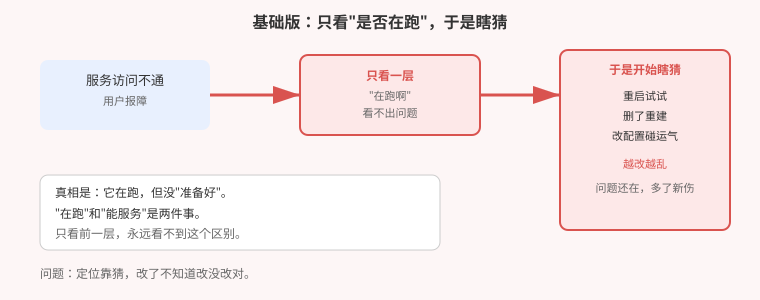

# 应用实战 · 应用明明在跑，服务为什么不通

> 对应课程：[第 18 课：系统化排障：分层定位法](../stages/6-排障运维与扩展/lessons/lesson-18-系统化排障分层定位法.md) ｜ 覆盖知识点：五层定位模型、四条判据、退出码、退出原因与"工具骗人"
> 定位：**会用，不上生产**——课里学完，在这里动手。课内第四幕做的是**单项故障的机制验证**（逐个制造 Pending / 拉镜像失败 / 反复重启 / 探针失败，各读一次原文）；这里做的是**一次真实的综合排查：一个故障同时骗过两层，怎么一层层剥出来**。
> 📖 结论已按官方文档核对（核对于 2026-09，来源：[Troubleshooting Applications](https://kubernetes.io/zh-cn/docs/tasks/debug/debug-application/)、[Debug Services](https://kubernetes.io/zh-cn/docs/tasks/debug/debug-application/debug-service/)）
> 🧪 **本篇全部输出为本机 kind 集群 `k8s-c1-calico`（k8s v1.34.0，1 control-plane + 2 worker）实测**，非推演

---

## 场景：它明明"在跑"，用户却说访问不了

**场景**：业务同事报障"服务访问不通"。你上去一看：

```
web-8787688b6-7jsp6   0/1   Running   0     18s
web-8787688b6-jxpvf   0/1   Running   0     18s
```

状态是 `Running`——**在跑啊**。于是你开始试：重启一下？删了重建？改改配置？

**先停。这个状态列已经在告诉你答案了**，只是你没看第二列。

**全貌一句话**：本篇只解决「**从"不通"这个症状，定位到根因在哪一层**」。真实生产还牵扯日志聚合、链路追踪、指标回溯。判断标准只有一句：**你是"猜"出来的，还是"每层都有判据"推出来的？**

> ⚠️ **先记住三个硬约束**：
> 1. **"在跑"不等于"能服务"**——状态列显示 `Running`，就绪列可能是 `0/1`。这是本篇的头号陷阱。
> 2. **症状层和根因层常常不是同一层**——用户看到"网络不通"，根因可能在应用配置。
> 3. **一次只改一处，改完立刻验证**——同时改三处，好了也不知道是哪处起的作用。

---

## 准备

```bash
kubectl get nodes                      # 期望全部 Ready
kubectl get pod -A | grep -v Running   # 先看有没有明显异常
```

---

### ① 基础实现（能跑但危险）：只看"在不在跑"，然后瞎猜

先看大多数人会怎么查：

```bash
kubectl get pod -n app-down
```

**本机实测**：

```
web-8787688b6-7jsp6   0/1   Running   0     18s
web-8787688b6-jxpvf   0/1   Running   0     18s
```

看到 `Running`，很容易得出"应用没问题"的结论，然后转向怀疑网络、怀疑 DNS、怀疑 Service 配置——**方向从第一步就偏了**。



> ⚠️ **它的问题**：① `Running` 只说明**容器进程活着**，不说明**能对外服务**；② 不分层就动手改，等于**蒙眼射击**；③ 改了三处，就算好了也不知道是哪处起作用——**下次还不会**。

---

### ② 改进实现：逐层往下问，每层都有判据

#### L1 / L2：先排除，再深入

```bash
kubectl get nodes                                    # L1：节点都就绪吗
kubectl get pod -n kube-system -o wide | head        # L2：控制面都在吗
```

**本机实测**：3 节点全部 `Ready`，控制面组件齐备 → **L1 / L2 排除**。

> 💡 这两层 30 秒就能看完。**先排除再深入**，比一上来就扎进应用省得多——节点都挂了，看应用日志是白费力气。

#### L3：真相在这一层

**关键动作：看 READY 那一列，不是 STATUS 那一列。**

```bash
kubectl get pod -n app-down -o wide
kubectl describe pod -n app-down -l app=web | grep -A3 'Warning'
```

**本机实测**：

```
web-8787688b6-7jsp6  READY=0/1  STATUS=Running

Warning  Unhealthy  1s (x6 over 16s)  kubelet
  Readiness probe failed: HTTP probe failed with statuscode: 404
```

**就是这一行**。健康检查去访问 `/healthz`，服务返回了 **404**——所以应用**一直没被判定为"可以接客"**。

而 `STATUS` 仍然是 `Running`，因为**进程确实没崩**。

#### L4：症状在这一层显现

应用没就绪，后果会传导到网络层：

```bash
kubectl get endpointslice -n app-down -o jsonpath='{.items[0].endpoints}'
```

**本机实测**：

```json
[{"addresses":["192.168.53.60"],
  "conditions":{"ready":false,"serving":false,"terminating":false}, ...}]
```

地址在，但 **`ready: false`** —— 转发列表里**没有可用后端**。于是访问必然失败：

```bash
kubectl exec -n app-down curl -- curl -s -m 5 -o /dev/null -w '%{http_code}' http://web
```

**本机实测**：

```
000        ← 不通（000 = 根本没连上）
```

> 💡 **这就是"症状层 ≠ 根因层"**：用户在 L4 看到"网络不通"，根因却在 L3 的一个路径配置。**在网络层怎么查都查不出来**。

#### 修复：一次改一处，改完立刻验

```bash
kubectl patch deploy web -n app-down --type='json' \
  -p='[{"op":"replace","path":"/spec/template/spec/containers/0/readinessProbe/httpGet/path","value":"/"}]'
```

**本机实测（改完等 20 秒再验）**：

```
web-55b65c8cd8-ff4zx   1/1   Running   0     20s     ← READY 变 1/1
web-55b65c8cd8-mqfwb   1/1   Running   0     17s

200                                                   ← 通了
```


---

## 四条判据（可直接照抄）

| 看到什么 | 说明什么 | 下一步 |
|---|---|---|
| `Running` 但 `0/1` | 进程活着，但没准备好 | 看事件里的健康检查失败原因 |
| 后端列表 `ready: false` | 不会被转发到 | **往上追一层**找为什么没就绪 |
| `CrashLoopBackOff` | 起来就退出 | 看退出码 + 上一次的日志 |
| `Pending` | 调度不上去 | 看调度失败事件的原文 |

> 💡 **退出码速记**：`1` = 程序自己报错退出；`137` = 被强制杀掉（多半是内存超了）；`143` = 收到终止信号（正常关闭也会）。

---

## 常见坑

**坑 1：把 `Running` 当成"服务正常"。** 本篇的核心反例。`0/1 Running` 是**最常见也最容易被忽略**的状态。

**坑 2：在症状层找根因。** 网络不通就一直查网络，查到怀疑人生——根因在上一层的应用配置。

**坑 3：同时改好几处。** 改好了不知道谁起作用，下次照样不会。**一次一处，改完立刻验**。

**坑 4：不看事件原文。** `Warning Unhealthy ... statuscode: 404` 已经把答案写出来了。事件是第一现场。

**坑 5：用会误报的工具下结论。** 实测中 `nslookup` 一直在报"找不到"，但用 `curl` 实测是通的（详见第 19 篇）——**工具会骗人，要用最终链路确认**。

---

## 排障速查

```bash
# 30 秒摸清全局
kubectl get nodes && kubectl get pod -A | grep -vE 'Running|Completed'

# 应用没就绪？看事件（第一现场）
kubectl describe pod <名字> -n <区> | grep -A5 'Events'

# 反复重启？看上一次的日志（当前这次可能还没来得及输出）
kubectl logs <名字> -n <区> --previous

# 服务不通？先看有没有可用后端
kubectl get endpointslice -n <区> -o wide
```

---

## 清理

```bash
kubectl delete ns app-down --timeout=180s
```

---

> 🎯 **会用标志**：面对"服务访问不通"，能按 节点 → 控制面 → 应用 → 网络 的顺序逐层排除，说出 `Running` 与 `0/1` 的区别意味着什么，并能在网络层看到症状时**往上追一层**找到根因。

---

- ⬅️ 上一课实战：[17-密钥放在哪才算安全](./17-密钥放在哪才算安全.md)
- ➡️ 下一课实战：[19-一次维护引发的连锁故障](./19-一次维护引发的连锁故障.md)
- 📚 全部实战：[应用实战索引](INDEX.md)
