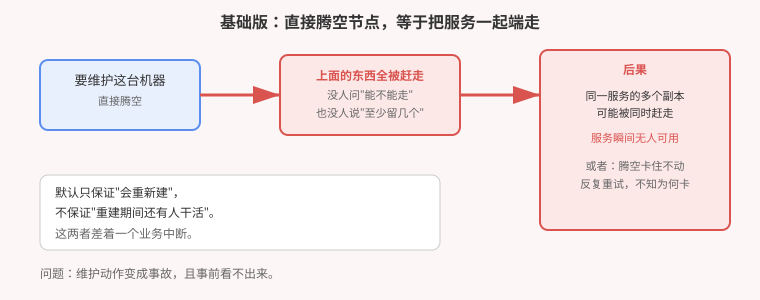
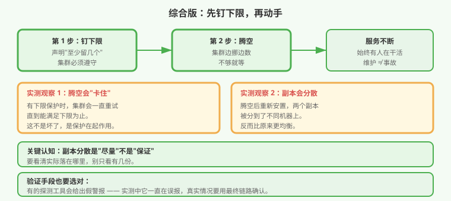

# 应用实战 · 一次维护引发的连锁故障

> 对应课程：[第 19 课：集群运维与生命周期](../stages/6-排障运维与扩展/lessons/lesson-19-集群运维与生命周期.md) ｜ 覆盖知识点：节点维护三件套、中断预算保护、优雅关闭、副本分散
> 定位：**会用，不上生产**——课里学完，在这里动手。课内第四幕做的是**单项机制验证**（封节点 / 解封 / 中断预算挡驱逐 / 挡不住直接删）；这里做的是**一次真实的维护推演：动手之前，先想清楚"这个动作会带走什么"**。
> 📖 结论已按官方文档核对（核对于 2026-09，来源：[Safely Drain a Node](https://kubernetes.io/zh-cn/docs/tasks/administer-cluster/safely-drain-node/)、[Pod Disruption Budgets](https://kubernetes.io/zh-cn/docs/concepts/workloads/pods/disruptions/)）
> 🧪 **本篇全部输出为本机 kind 集群 `k8s-c1-calico`（k8s v1.34.0，1 control-plane + 2 worker）实测**，非推演

---

## 场景：只是想维护一台机器

**场景**：你要给一台机器打补丁，标准操作是把上面的东西挪走，维护完再放回来。命令只有两条：

```bash
kubectl drain <节点> --ignore-daemonsets
# ...维护...
kubectl uncordon <节点>
```

问题是：**"挪走"这个动作，会带走什么？**

你去查了一下，发现一个不太舒服的事实：集群内置的域名解析服务有 **2 个副本，两个都跑在同一台机器上**——正是你要维护的那台。

**全貌一句话**：本篇只解决「**节点维护动作的影响面评估与保护**」这一层。真实生产还牵扯集群升级、证书轮转、备份恢复。判断标准只有一句：**维护窗口内，服务还有没有人干活？**

> ⚠️ **先记住三个硬约束**：
> 1. **默认只保证"会重新建"，不保证"重建期间还有人干活"** —— 这两者差着一个业务中断。
> 2. **副本分散是"尽量"，不是"保证"** —— 要实际看落在哪台机器上，不能只看份数。
> 3. **维护会"卡住"不一定是坏了** —— 可能是保护在起作用。

---

## 准备

```bash
kubectl get nodes
kubectl get pod -n kube-system -l k8s-app=kube-dns -o wide   # 看清副本实际在哪
kubectl get pdb -A                                            # 有没有保护
```

**本机实测（这是本篇的起点，也是真实集群的常见状态）**：

```
coredns-66bc5c9577-c944v -> k8s-c1-calico-worker      ← 两个副本
coredns-66bc5c9577-x696j -> k8s-c1-calico-worker      ← 挤在同一台
```

> 💡 它明明设置了"尽量分散"（软策略），却仍然挤在一起——**软策略只是"尽量"，资源紧张或被调度时就不保证了**。

---

### ① 基础实现（能跑但危险）：直接腾空，等于把服务一起端走

```bash
kubectl drain k8s-c1-calico-worker --ignore-daemonsets --delete-emptydir-data
```

**本机实测**（这里出现了两个真实现象）：

**现象一：它卡住了**

```
error when evicting pods/"calico-apiserver-ddd86bcb9j7lq" -n "calico-system"
  (will retry after 5s): Cannot evict pod as it would violate the pod's disruption budget.
evicting pod calico-system/calico-apiserver-ddd86bcb9j7lq
error when evicting pods/"calico-apiserver-ddd86bcb9j7lq" ... (will retry after 5s)
...（重试 4 次后）
node/k8s-c1-calico-worker drained
```

有中断预算保护的东西，集群**会一直重试直到能满足下限**。**这不是坏了，是保护在起作用**。

**现象二：域名解析反而更均衡了**

```
coredns-66bc5c9577-bw27t -> k8s-c1-calico-worker2        ← 分开了
coredns-66bc5c9577-xffb2 -> k8s-c1-calico-control-plane
```

> ⚠️ **这里我原本的预判是"两个副本被同时赶走、DNS 全挂"——实测推翻了它。** 因为驱逐是**逐个进行**的：第一个被赶走后会在别处重建，然后才轮到第二个。**逐个驱逐 ≠ 同时消失**。
>
> 这个反直觉的结果值得记住：**不要想当然地推导故障，要实测**。



> ⚠️ **它的问题**：① **没有任何保护时**，逐个驱逐确实可能让服务短暂无人可用；② 卡住时**不知道为什么卡**（其实错误信息里写了）；③ **事前不知道影响面**——哪个服务有几份、都在哪台机器上，全靠临时查。

---

### ② 改进实现：先钉下限，再动手

#### 第一步：给关键服务钉一个"至少留几个"

```yaml
apiVersion: policy/v1
kind: PodDisruptionBudget
metadata:
  name: coredns-pdb
  namespace: kube-system
spec:
  minAvailable: 1              # 无论发生什么，至少留 1 个在干活
  selector:
    matchLabels:
      k8s-app: kube-dns
```

```bash
kubectl apply -f coredns-pdb.yaml
kubectl get pdb -n kube-system
```

**本机实测**（集群里已有的保护长这样，可作对照）：

```
NAMESPACE       NAME               MIN AVAILABLE   MAX UNAVAILABLE   ALLOWED DISRUPTIONS
calico-system   calico-apiserver   N/A             1                 1
calico-system   calico-typha       N/A             1                 1
```

> ⚠️ **一个必须知道的边界**：中断预算**只管"自愿"的腾挪**（drain、驱逐），**管不住直接删除**（`kubectl delete pod`）。实测中直接删会立刻生效、预算形同虚设。**所以维护要用 drain，不要图快用 delete。**

#### 第二步：动手前先看清楚影响面

```bash
# 这个节点上跑着什么？按服务分组看
kubectl get pod -A -o wide --field-selector spec.nodeName=<节点> | \
  awk '{print $1, $4}' | sort | uniq -c
```

```bash
# 每个服务有几份、分散在哪
kubectl get pod -n <区> -l app=<服务> -o wide | awk '{print $7}' | sort | uniq -c
```

#### 第三步：真的中断一次，看看是什么样

为了**亲眼确认**"解析服务没了会怎样"（而不是想象），做一次真实演练：

```bash
kubectl scale deploy coredns -n kube-system --replicas=0
```

**本机实测——用对工具才看得出真相**：

| 探测方式 | 正常时 | 全部停掉后 |
|---|---|---|
| `nslookup` | NXDOMAIN ❌（**一直在误报**） | NXDOMAIN |
| `getent hosts` | 正常解析出地址 ✅ | 无输出 |
| `curl` | `HTTP=403` ✅ | `HTTP=000` ❌ |

> ⚠️ **这是本篇第二个反直觉点**：`nslookup` **在服务完全正常时也报"找不到"**（它构造的查询域名与集群搜索域不匹配）。**它是假警报**——用 `getent` 或 `curl` 才靠谱。
>
> 这与第 18 课的"工具会骗人"是同一条纪律：**下结论前，换一个更接近真实链路的工具再确认一次。**

恢复：

```bash
kubectl scale deploy coredns -n kube-system --replicas=2
# 实测约 15 秒后恢复，curl 重新返回 403
```

#### 第四步：让副本真正分散（治本）

软策略不够，就用硬策略：

```yaml
spec:
  template:
    spec:
      affinity:
        podAntiAffinity:
          requiredDuringSchedulingIgnoredDuringExecution:     # 硬要求，不是"尽量"
          - labelSelector:
              matchExpressions:
              - {key: k8s-app, operator: In, values: [kube-dns]}
            topologyKey: kubernetes.io/hostname
```

> 💡 `required` vs `preferred`：**`preferred` 是"尽量"**（实测中两个副本仍挤在一起）；**`required` 是"必须"**，不满足就宁可待调度。**关键服务用 `required`**。



---

## 常见坑

**坑 1：以为"会重新建"就等于"不会中断"。** 重建需要时间，期间可能一个都没有。**要钉下限，不能指望重建速度**。

**坑 2：以为副本多就安全。** 实测：2 个副本**都在同一台机器上**。份数不等于分散度，**要看实际落在哪**。

**坑 3：维护时图快用 `delete`。** 中断预算**管不住直接删除**。要中断可控，必须用 drain。

**坑 4：drain 卡住就以为坏了。** 实测重试 4 次后成功——错误信息里明确写了"会违反中断预算"。**读懂原文再动手**。

**坑 5：用 `nslookup` 判断解析是否正常。** 实测**正常时也报失败**。用 `getent` 或 `curl`。

**坑 6：靠推导想象故障。** 本篇我预判"两个副本会被同时赶走、DNS 全挂"，实测**不成立**（逐个驱逐）。**故障要实测，不要想当然**。

---

## 排障速查

```bash
# 为什么 drain 卡住？看这条命令的输出
kubectl get pdb -A -o wide

# 这个节点上有什么
kubectl get pod -A -o wide --field-selector spec.nodeName=<节点>

# 副本到底分散了没（看机器名列）
kubectl get pod -n <区> -l app=<服务> -o wide | awk '{print $7}' | sort | uniq -c

# 解析到底通不通（别用 nslookup）
kubectl exec <pod> -- getent hosts kubernetes.default
```

---

## 清理

```bash
kubectl uncordon <节点>                              # 务必：把节点放回来
kubectl delete pdb coredns-pdb -n kube-system        # 如不再需要
kubectl get nodes                                    # 确认没有节点处于不可调度
```

> ⚠️ **最容易忘的一步**：`uncordon`。节点会一直处于"不可调度"，新应用全都上不去，**这个坑能埋很久才被发现**。

---

> 🎯 **会用标志**：拿到"维护某台机器"的任务，能先查清这台机器上有什么、每个服务有几份在哪，能给关键服务钉下限，知道中断预算管得住什么管不住什么，以及**不会用 `nslookup` 判断解析是否正常**。

---

- ⬅️ 上一课实战：[18-应用起不来怎么排查](./18-应用起不来怎么排查.md)
- ➡️ 下一课实战：[20-要不要自建一个资源类型](./20-要不要自建一个资源类型.md)
- 📚 全部实战：[应用实战索引](INDEX.md)
