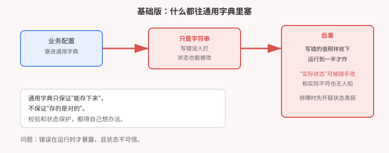
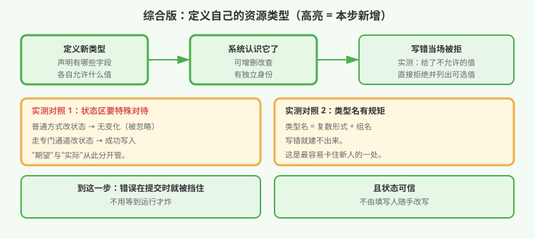

# 应用实战 · 要不要自建一个资源类型

> 对应课程：[第 20 课：扩展机制与决策收口](../stages/6-排障运维与扩展/lessons/lesson-20-扩展机制与决策收口.md) ｜ 覆盖知识点：自定义资源定义、模式校验、状态子资源、扩展方式选型
> 定位：**会用，不上生产**——课里学完，在这里动手。课内第四幕做的是**机制逐项验证**（建类型 / 校验 / 字段裁剪 / 状态子资源 / 世代）；这里做的是**一次真实的选型：团队想让集群管"数据库"，到底该怎么落地**。
> 📖 结论已按官方文档核对（核对于 2026-09，来源：[Custom Resources](https://kubernetes.io/zh-cn/docs/concepts/extend-kubernetes/api-extension/custom-resources/)、[CustomResourceDefinitions](https://kubernetes.io/zh-cn/docs/tasks/extend-kubernetes/custom-resources/custom-resource-definitions/)）
> 🧪 **本篇全部输出为本机 kind 集群 `k8s-c1-calico`（k8s v1.34.0）实测**，非推演

---

## 场景：想让集群也管"数据库"

**场景**：你们团队希望像管应用一样管数据库——写一份声明，集群就把它建出来。第一反应是：

> "用配置字典存一下不就行了？"

存是能存。但很快你会遇到三个问题：

1. 有人把规格写成了 `huge`，**没人拦**，直到半夜任务跑挂
2. 有人手改了"当前状态"字段，**和实际对不上**，排障时先得怀疑状态真假
3. 想列出现有数据库，只能去翻一堆**没有统一结构**的配置

**全貌一句话**：本篇只解决「**什么时候该自建资源类型、建了能得到什么**」这一层。真实生产还牵扯控制器开发、版本升级、权限模型。判断标准只有一句：**写错了，是在提交时被拦下，还是半夜才炸？**

> ⚠️ **先记住三个硬约束**：
> 1. **自建类型不是必需的**——能用现成资源表达时，优先用现成的。
> 2. **它只提供"存得对"，不提供"真去做"**——声明了数据库，不等于数据库被建出来（那需要额外的控制器）。
> 3. **类型名有硬性规矩**——写错建不出来，这是最容易卡住新人的地方。

---

## 准备

```bash
kubectl version --short 2>/dev/null | head -1    # 期望 v1.16+（当前 CRD 版本自此稳定）
kubectl api-resources | head -5                  # 看看系统已有哪些类型
```

---

### ① 基础实现（能跑但危险）：往通用配置里塞

先看"用配置字典存"的做法：

```yaml
apiVersion: v1
kind: ConfigMap
metadata:
  name: shop-db
data:
  engine: postgres
  size: huge          # ← 这个值根本不该存在
  phase: Running      # ← "当前状态"也混在里面
```

```bash
kubectl apply -f shop-db.yaml
```

```
configmap/shop-db created       ← 收下了，没有任何警告
```

**它的问题不是"不能存"，而是"存什么都要"**：`size: huge` 照样收下，`phase: Running` 任何人都能改。



> ⚠️ **它的问题**：① **无校验**——错值要等到用的时候才暴露，往往在半夜；② **状态可随手改**——"期望"和"实际"混在一起，排障时先得判断状态真假；③ **无统一结构**——想"列出所有数据库"只能靠命名约定。

---

### ② 改进实现：定义自己的类型

#### 第一步：建一个类型，声明字段和取值范围

```yaml
apiVersion: apiextensions.k8s.io/v1
kind: CustomResourceDefinition
metadata:
  name: databases.demo.example.com        # 命名规矩见下方说明
spec:
  group: demo.example.com
  names:
    kind: Database
    listKind: DatabaseList
    plural: databases
    singular: database
  scope: Namespaced
  versions:
  - name: v1
    served: true
    storage: true
    schema:
      openAPIV3Schema:
        type: object
        properties:
          spec:
            type: object
            properties:
              engine: {type: string}
              size:
                type: string
                enum: [small, medium, large]     # ← 只允许这三个
          status:
            type: object
            properties:
              phase: {type: string}
    subresources:
      status: {}                                  # ← 状态区独立保护
```

**本机实测**：

```
customresourcedefinition.apiextensions.k8s.io/databases.demo.example.com created

NAME        SHORTNAMES   APIVERSION            NAMESPACED   KIND
databases                demo.example.com/v1   true         Database
```

> ⚠️ **命名规矩（最容易卡住的一处）**：`metadata.name` 必须是 **`<复数形式>.<组名>`**，即 `databases` + `demo.example.com`。这里写成 `Database` 或 `database.demo.example.com` 都会失败。

#### 第二步：写错会被当场拒绝

```bash
kubectl apply -f bad-db.yaml      # size: huge
```

**本机实测**：

```
The Database "bad-db" is invalid: spec.size: Unsupported value: "huge":
supported values: "small", "medium", "large"
```

对比第 ① 步那个"默默收下"的配置字典——**错误从"半夜才炸"提前到了"提交时就挡"**。

#### 第三步：状态区不再能被随手改

```bash
# 用普通方式改状态 → 无效
kubectl patch database shop-db --type=merge -p '{"status":{"phase":"Running"}}'
kubectl get database shop-db -o jsonpath='{.status}'
```

**本机实测**：

```
database.demo.example.com/shop-db patched (no change)     ← 明确告诉你：没改
                                                          ← 状态仍为空
```

必须走**专门通道**：

```bash
kubectl patch database shop-db --subresource=status --type=merge \
  -p '{"status":{"phase":"Running"}}'
kubectl get database shop-db -o jsonpath='{.status.phase}'
```

**本机实测**：

```
Running        ← 写入成功
```

> 💡 **这解决了第 ① 步最隐蔽的问题**：`期望值`（spec）由人填写，`实际状态`（status）只有控制器能写。两者分开后，**看到的状态是可信的**。



---

## 到底该不该自建（决策判据）

| 信号 | 倾向 |
|---|---|
| 现成资源能表达 | **别建**，用现成的 |
| 需要**校验**取值范围 | 建，值域约束能挡住大部分低级错误 |
| 需要**区分期望与实际** | 建，`status` 子资源是关键 |
| 需要**"列出全部"并按字段筛选** | 建，统一结构才有统一查询 |
| 需要**真的去创建资源** | 建类型**不够**，还要写控制器 |
| 只是几个配置项 | **别建**，用配置字典 |

> ⚠️ **最重要的一条边界**：自建类型**只解决"怎么存、存得对不对"**。声明一个 `Database`，**不会真的创建出数据库**——那需要额外的程序（控制器）去监听并执行。很多人在这里期望落空。

---

## 常见坑

**坑 1：把自建类型当成"会自动干活"。** 它只管存。要真的执行，得写控制器。这是最大的期望落差。

**坑 2：类型名写错。** 必须是 `<复数>.<组名>`，实测中这是最容易卡住的一步。

**坑 3：以为有了它就万事大吉。** 校验靠你**声明得够不够**。没声明 `enum`，写 `huge` 照样收。

**坑 4：忘开状态子资源。** 不开的话状态区谁都能改，回到第 ① 步的老问题。

**坑 5：什么都想建类型。** 判断表第一条：**现成资源能表达就别建**。类型泛滥的维护成本远高于收益。

**坑 6：删不掉。** 实例上挂着清理逻辑（finalizer）时会卡在删除中——与第 18 课判据 3 同构，需要清理后才能删掉。

---

## 排障速查

```bash
# 系统认识这个类型了吗
kubectl api-resources --api-group=<组名>

# 为什么建不出来（多半是命名或字段不合规）
kubectl describe crd <名字>

# 状态为什么改不动 → 检查有没有开 status 子资源
kubectl get crd <名字> -o jsonpath='{.spec.versions[0].subresources}'

# 删不掉 → 看有没有挂着清理逻辑
kubectl get <类型> <名字> -o jsonpath='{.metadata.finalizers}'
```

---

## 清理

```bash
kubectl delete database shop-db -n crd-demo
kubectl delete ns crd-demo --timeout=180s
kubectl delete crd databases.demo.example.com
```

> ⚠️ **删除类型会连带删除所有该类型的实例**。生产环境执行前务必确认。

---

> 🎯 **会用标志**：面对"要不要自建类型"，能用判断表给出结论；能写对一个类型定义并**实测到校验生效**；能说清「自建类型只管存、不负责执行」这条边界，以及为什么状态区要独立。

---

- ⬅️ 上一课实战：[19-一次维护引发的连锁故障](./19-一次维护引发的连锁故障.md)
- 📚 全部实战：[应用实战索引](INDEX.md)
- 🎓 全课程实战至此收官（18 / 18）
