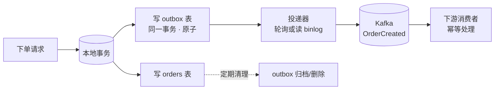
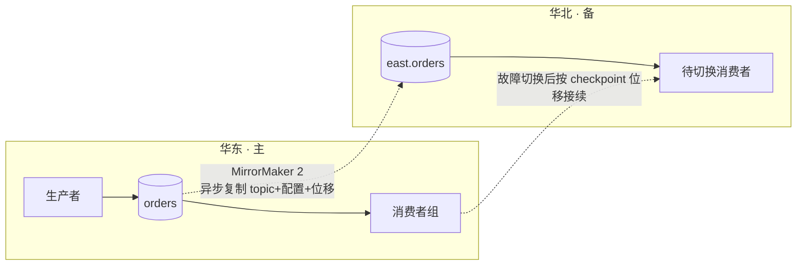
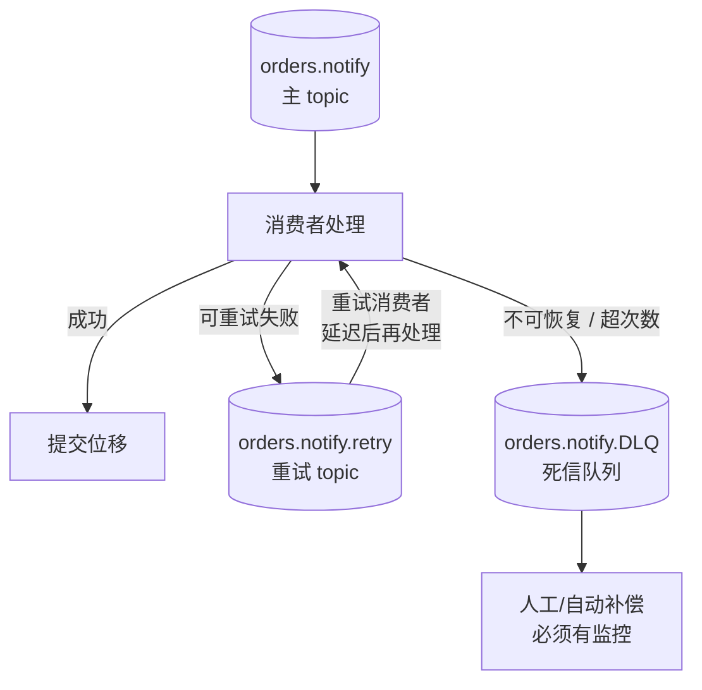

# Kafka 场景解法库

> **怎么用**：每个场景是一道**开放设计题**。先自己想 30 秒，再展开看解法——**先想后看，能力才长出来**。
> 配套：[08-实战经验.md](08-实战经验.md)（为什么会崩，学习态）｜ [09-排障速查手册.md](09-排障速查手册.md)（出错了怎么办，使用态）｜本文件（新要求来了怎么设计，设计态）。
> 证据纪律：每条解法均可溯源（Apache Kafka 官方文档 / Confluent 官方文档 / 官方 KIP / 领域公认实践），核查于 2026-08。配置默认值以 **Kafka 4.3** 官方文档为准（当前最新稳定版 4.3.1）。

## 场景索引

| # | 场景 | 核心矛盾 | 主要考点 |
|---|------|---------|---------|
| [1](#场景-1流量涨-10-倍消费者追不上) | 流量涨 10 倍，消费者追不上 | 并行度被分区数锁死，而**分区数只能加不能减** | 分区数 · 消费者组 · 扩分区代价 |
| [2](#场景-2既要保序又要并发) | 既要保序又要并发 | 保序要求固定分区，扩容必然改变 key→分区映射 | 分区策略 · 保序粒度 · 迁移 |
| [3](#场景-3数据库写--发消息的一致性) | 数据库写 + 发消息的一致性 | 本地事务与消息投递是**两个系统**，Kafka 事务管不到数据库 | 交付语义 · outbox · CDC |
| [4](#场景-4新业务要消费全部历史数据) | 新业务要消费全部历史数据 | 默认只保留 7 天，"重放"需要提前设计 | 保留策略 · 位移 · 分层存储 |
| [5](#场景-5消息体太大) | 消息体太大（5MB 订单快照） | Kafka 为**小消息高吞吐**优化，1MB 上限是官方强烈建议 | 生产者批次 · claim check · 压缩 |
| [6](#场景-6跨机房容灾与多活) | 跨机房容灾与多活 | 单集群副本只抗单机故障，抗不了整个地域 | 副本/ISR · 机架感知 · MirrorMaker 2 |
| [7](#场景-7事件结构要升级) | 事件结构要升级，下游不能同时上线 | 事件是**跨服务契约**，改它比改接口更危险 | EDA · 兼容演进 · Schema Registry |
| [8](#场景-8我要任务队列语义) | 我要"任务队列"语义 | Kafka 是**分区绑定的流式消费**，不是单条确认的任务队列 | 消费模型 · 重试 · share groups |

> 每个场景的末尾都有「做错会踩的坑」，回指 [08-实战经验.md](08-实战经验.md) 的故障模式编号——**设计与故障是一体两面**。

---

## 场景 1：流量涨 10 倍，消费者追不上

**场景描述**：`orders` topic 12 个分区，消费组 `order-processor` 有 3 个实例。大促开始后 40 分钟，`records-lag-max` 从 1 万涨到 50 万且仍在上涨，下游报表延迟超过 1 小时。

**🔒 先自己想 30 秒**：第一反应是"加机器"吗？加到几个才有效？如果加了 20 个还不够呢？

💡 提示（分层 / 分维度想）

- **量**：当前并行度是多少？并行度的上限由什么决定？
- **质**：是"每个消费者都慢"，还是"只有个别分区特别慢"？
- **不可逆性**：分区数这个开关，按下去了还能退回来吗？

📖 展开解法

### 解法一览

| 解法 | 能解决到 | 代价 | 适用边界 |
|------|---------|------|---------|
| **A · 扩消费者实例** | 并行度提升到**分区数**为止 | 超过分区数的实例完全闲置（一个分区在同一组内只能被一个消费者消费）；加实例会触发再均衡 | 分区数有余量 && 消费逻辑本身不慢 |
| **B · 优化单条消费逻辑** | 单条耗时降下来，吞吐等比提升 | 开发改造成本；需要定位瓶颈（批量写库 / 异步 IO / 减少同步远程调用） | 消费者是"真慢"而非"不够多"时，收益最大 |
| **C · 扩分区（12→36）** | 突破并行度上限 | **不可逆**（官方明确：Kafka 不支持减少分区数）；改变 key→分区映射破坏保序；元数据传播延迟；`auto.offset.reset=latest` 的消费者可能漏读新分区；更多分区 = 更长的 leader 故障切换时间 | 确认**长期**容量需求且不依赖 key 保序时 |
| **D · 拆出独立消费组** | 慢下游不再拖累快下游 | 同一份数据被读多遍，带宽与 broker 负载上升 | 一个 topic 有多个速度差异大的下游消费者 |
| **E · 生产端限流 / 消费端降级** | 止血，让 LAG 停止上涨 | 业务受损（丢弃非关键步骤 / 拒绝部分流量） | 仅作为**止血手段**，不是根治方案 |

> **扩分区的具体副作用**（Confluent 官方最佳实践文档，核查于 2026-08）：
> ① `hash(key) % 分区数` 的映射逻辑随分区数变化，同一个 key 扩容后可能落到不同分区，**已有 key 的顺序保证会被破坏**，且 Kafka **不会**自动重排已有数据；
> ② 配置为 `auto.offset.reset=latest` 的存量消费者，在"新分区建成"到"消费者发现新分区"的窗口内可能漏消息；
> ③ 分区数变多会拉长 leader 故障切换时间。

### 推荐路径（递进，不是一次全上）

1. **先分诊**：按 [故障模式 1](08-实战经验.md) 判断是全局性积压还是热分区——**热分区加实例完全无效**。
2. **优化消费逻辑**（B）：批量写库、异步 IO、把非关键步骤挪出主链路。这是性价比最高的一步。
3. **扩消费者到分区数**（A）：3 → 12 个实例，注意观察再均衡是否稳定。
4. **仍不够再考虑扩分区**（C）：若必须保序，改走**新建高分区 topic + 双写迁移**（见场景 2 的解法 D），而不是原地 `--alter`。
5. **全程保留 E 作为止血开关**：限流让 LAG 先停住，赢得排查时间。

### 知识点挂钩

- 分区数决定最大消费并行度 → 阶段 2 · [课 4 Topic、Partition 与 Broker](stages/2-核心架构/lessons/lesson-04-Topic、Partition与Broker.md)
- 一个分区在组内只被一个消费者消费、再均衡 → 阶段 2 · [课 6 消费者与消费者组](stages/2-核心架构/lessons/lesson-06-消费者与消费者组.md)
- key → 分区的映射、粘性分区 → 阶段 2 · [课 5 生产者 Producer](stages/2-核心架构/lessons/lesson-05-生产者Producer.md)

### 什么情况下此方案不适用

- **要求全局严格保序**：扩分区会直接破坏保序，只能先优化消费逻辑或走双写迁移（见场景 2）。
- **瓶颈在下游数据库**：消费再快，写库慢也是白搭——先解决下游容量，否则只是把积压从 Kafka 搬到应用内存。

### 做错会踩的坑

- 未分诊就加机器 → 热分区场景白加（[故障模式 1](08-实战经验.md)）。
- 单批处理时间超过 `max.poll.interval.ms` → 消费者被踢出组引发再均衡，越加越乱（[故障模式 7](08-实战经验.md)）。
- 原地扩分区 → 保序被破坏且无法回退（本场景解法 C）。

---

## 场景 2：既要保序又要并发

**场景描述**：订单状态机严格要求"同一订单的 `Created → Paid → Shipped` 必须按顺序处理"，乱序会导致状态回退。同时业务量要求至少 30 个并发消费者。当前 topic 只有 12 个分区。

**🔒 先自己想 30 秒**：保序的**粒度**是什么？是"所有订单全局有序"，还是"单个订单内有序"？这两句话对应完全不同的设计。

💡 提示（分维度想）

- **粒度**：先确认要的是"全局全序"还是"按 key 有序"——大多数业务其实只要后者。
- **约束**：保序要求 key→分区映射稳定，那"扩容"和"保序"的冲突点在哪？
- **退路**：如果投递顺序保证不了，能不能在消费端补救？

📖 展开解法

### 解法一览

| 解法 | 能解决到 | 代价 | 适用边界 |
|------|---------|------|---------|
| **A · 按业务键分区（key = order_id）+ 分区数一次建够** | 单 key 内严格有序，并发度 = 分区数 | 分区数在建 topic 时就锁死（后续扩容会破坏映射）；key 基数太低会造成热分区 | 绝大多数"按实体保序"场景的正解 |
| **B · 单分区（1 个分区）** | 全局全序 | 吞吐完全无法扩展，单点上限 | 只有配置变更、全局序列号这类低吞吐强全序场景 |
| **C · 消费端重排（按版本号/序号缓冲）** | 允许投递乱序，在消费端排序后处理 | 消费端复杂度显著上升；需要定义"乱序窗口"（等多久算齐） | 生产者无法控制分区策略，或需要容忍乱序的高吞吐场景 |
| **D · 新建高分区 topic + 双写迁移** | 既扩了容量又保住了 key 序 | 需要双写一段时间、迁移期数据双份、切换有风险 | 原 topic 分区数不够且必须保序时的**唯一稳妥扩容路径** |
| **E · 按维度拆分 topic**（如按 region 拆 `orders-cn`、`orders-us`） | 每个子 topic 内保序，整体并发度 = 各 topic 分区数之和 | topic 数量膨胀；跨 region 的查询/重放变复杂 | key 本身有天然的高层分类维度 |

### 推荐路径

1. **先确认保序粒度**：要"全局全序"就只能 B（1 分区），别挣扎；要"按订单有序"就走 A。
2. **A 是默认解**：建 topic 时就把分区数按"预期最大并发 × 2-3"建够——因为分区数只能加不能减，**建的时候多留余量的成本，远低于事后迁移的成本**。
3. **分区不够且必须保序** → 走 D：新建 `orders-v2`（36 分区）→ 生产者双写 v1+v2 → 消费者组切换到 v2 且从 earliest 消费验证 → 观察无误后停写 v1。
4. **C 是兜底**：只有当生产者不可控（第三方发送）时才考虑消费端重排。

### 知识点挂钩

- key → 分区映射、粘性分区器 → 阶段 2 · [课 5 生产者 Producer](stages/2-核心架构/lessons/lesson-05-生产者Producer.md)
- 分区内有序、分区是并行度单位 → 阶段 2 · [课 4 Topic、Partition 与 Broker](stages/2-核心架构/lessons/lesson-04-Topic、Partition与Broker.md)
- 消费端幂等与重复处理 → 阶段 3 · [课 8 交付语义与幂等](stages/3-可靠性与高可用/lessons/lesson-08-交付语义与幂等.md)

### 什么情况下此方案不适用

- **真·全局全序**：任何多分区方案都给不了，只有 1 分区或消费端重排。
- **key 分布极度不均**（如 90% 流量来自同一个大客户）：保序和负载均衡会直接打架，此时需要给 key 加后缀打散，但**打散后就不再保序**——这是必须做取舍的地方。

### 做错会踩的坑

- 原地扩分区 → key 映射改变，保序静默失效（Confluent 官方明确警告，见场景 1 引用）。
- key 基数太低（用常量 / `None` / 布尔值当 key）→ 所有消息挤进少数分区，形成热分区（[故障模式 1](08-实战经验.md)）。
- 本地同步重试导致分区阻塞 → 再均衡（[故障模式 7](08-实战经验.md)）。

---

## 场景 3：数据库写 + 发消息的一致性

**场景描述**：下单服务要"写 MySQL 订单表"并"发 `OrderCreated` 事件"。上线后出现过两次事故：一次是数据库写成功但发消息前进程崩溃，下游永远不知道有这个订单；一次是消息发出去了但本地事务回滚，下游处理了一个不存在的订单。

**🔒 先自己想 30 秒**："把写库和发消息放进一个事务"——这个想法能实现吗？Kafka 的事务能管到 MySQL 吗？

💡 提示（分维度想）

- **边界**：Kafka 事务的作用域到底覆盖哪些东西？
- **顺序**：先写库还是先发消息？两种顺序各自在什么时刻会出错？
- **兜底**：如果允许"短暂不一致"，靠什么收敛？

📖 展开解法

### 解法一览

| 解法 | 能解决到 | 代价 | 适用边界 |
|------|---------|------|---------|
| **A · 双写 + 消费端幂等 + 定时对账** | 不消除不一致，但保证**最终一致** | 需要一个对账/补偿任务；存在分钟级不一致窗口 | 流量不大、能接受短暂不一致的绝大多数业务 |
| **B · 事务性发件箱（Transactional Outbox）** | 写库与"待发消息"在同一本地事务内，原子 | 多一张 outbox 表（会膨胀，需定期清理）；需要一个投递器（轮询或 CDC） | **通用正解**：要求"不丢"且不允许凭空多出消息 |
| **C · CDC 直连 binlog（如 Debezium）** | 不改业务代码即可把数据变更变成事件 | 引入 CDC 组件与运维复杂度；表结构变更需要同步维护；捕获的是"数据变更"而非"业务意图" | 多表/遗留系统，或希望业务代码零侵入 |
| **D · Kafka 事务** | 仅保证 **Kafka 内部** 多 topic + 位移的原子性 | **管不到数据库**——写库与发消息分属两个系统，它无法把它们绑成一个事务 | 消费-处理-再生产（Kafka → Kafka）的流式链路 |
| **E · 先发消息、后写库**（或反之） | 简化顺序，仍需幂等兜底 | 两个动作之间的崩溃必然产生不一致，只是方向不同 | 只能作为 A 的变体，不是独立解法 |

**关键认知**：**Kafka 事务只覆盖 Kafka 内部的 topic 与 `__consumer_offsets`**（阶段 3 课 8 已讲）。它保证不了"数据库事务 + 消息投递"的原子性。想用 Kafka 事务解决跨系统一致性，是把工具的边界记错了。

**B · 事务性发件箱**的做法（microservices.io 的 Transactional Outbox 模式，Debezium 官方文档亦收录其 outbox 实现，核查于 2026-08）：

> 解读：业务只负责"把消息写进本地库"，投递交给独立进程。**写库成功 = 消息最终一定会被发出**（投递器可重试），因为两者在同一个本地事务里。

### 推荐路径

1. **先接受现实**：跨系统强一致是不可能的，目标是**最终一致 + 可观测**。
2. **起步用 A**：双写 + 消费端幂等（业务主键去重）+ 对账补偿任务。成本最低，能覆盖 80% 场景。
3. **要求"绝不丢"时用 B**：引入 outbox 表，投递器用轮询（简单）或 CDC（更实时、更低侵入）。
4. **多表/遗留系统用 C**：Debezium 捕获 binlog，业务代码零改动。
5. **D 只用在 Kafka 内部的流式链路**（如风控消费订单事件后写回另一个 topic），不要拿它跨数据库。

### 知识点挂钩

- 三种交付语义、幂等 producer、事务边界 → 阶段 3 · [课 8 交付语义与幂等](stages/3-可靠性与高可用/lessons/lesson-08-交付语义与幂等.md)
- 先处理后提交、重复是必然 → 阶段 2 · [课 6 消费者与消费者组](stages/2-核心架构/lessons/lesson-06-消费者与消费者组.md)
- 事件驱动中的事件契约 → 阶段 4 · [课 10 项目架构设计落地](stages/4-实战与架构落地/lessons/lesson-10-项目架构设计落地.md)

### 什么情况下此方案不适用

- **要求跨系统的强一致（要么都成功要么都失败）**：Kafka 给不了，也不该由消息系统给——应改用同步事务 + 事件补偿，或重新审视这个需求本身是否成立。
- **outbox 表写入量极大且无人运维**：表膨胀会拖垮主库，必须配套清理任务与监控。

### 做错会踩的坑

- 用 Kafka 事务试图覆盖数据库 → 边界记错，问题依旧（[故障模式 6](08-实战经验.md)）。
- 消费端没有幂等 → 至少一次语义下重复必然发生，重复扣款/重复发货（[故障模式 6](08-实战经验.md)）。
- outbox 表无清理策略 → 主库表无限膨胀。

---

## 场景 4：新业务要消费全部历史数据

**场景描述**：新上的风控服务需要"过去 90 天的全部订单"来训练与回溯。但 `orders` topic 用的默认保留策略（broker 默认 `log.retention.hours=168`，即 7 天），最早的 83 天数据早就被 Kafka 删掉了。

**🔒 先自己想 30 秒**：能不能把现有消费者组的位移重置到 90 天前，让它重新读一遍？这样做会发生什么？

💡 提示（分维度想）

- **安全性**：位移是**消费者组级别**的——重置它会影响到谁？
- **可行性**：数据还在吗？保留窗口之外的数据去哪了？
- **代价**：一次性读 90 天全量数据，会占用什么资源？对在线消费有什么影响？

📖 展开解法

### 解法一览

| 解法 | 能解决到 | 代价 | 适用边界 |
|------|---------|------|---------|
| **A · 新建独立 `group.id` + `auto.offset.reset=earliest` 重放** | 读全量历史（在保留窗口内） | 全量读取会占用 broker 带宽与磁盘 IO，**可能影响在线消费者**；处理量大时追平需要很久 | 紧急回溯，且数据在保留窗口内 |
| **B · 提前调长保留期**（`retention.ms` / `retention.bytes`） | 让历史数据留得住 | 磁盘成本线性上升；需在容量规划内 | 已知未来会有回溯需求的 topic |
| **C · 分层存储（Tiered Storage）** | 本地只留热数据，冷数据下沉到远程存储（如 S3），保留期大幅延长且成本更低 | 需 broker 端配置 `remote.log.storage.system.enable=true` 并**自行提供 RemoteStorageManager 实现**（Apache Kafka 不提供开箱即用实现）；**不支持 compacted topic**；远程读取每个请求只服务一个分区，可能成为吞吐瓶颈 | 数据量大、保留期长、且能接受引入远程存储组件 |
| **D · 归档到外部存储 + 离线回放** | 保留期无限，成本最低 | 需要额外的归档链路（Connect Sink / 自研）；离线回放与在线消费是两套代码 | 审计/训练类场景，不要求通过 Kafka 回放 |
| **E · compact topic 维护"最新状态"** | 新消费者从快照开始，不必读全部历史 | 只保留每个 key 的最新值，**会丢掉中间状态变化历史** | 状态同步类（如用户资料缓存）而**非**事件流场景 |

> **重放的铁律**：回溯必须用**新的 `group.id`**。直接把在线消费者组的位移 seek 回去，会让生产环境的消费者停止处理新数据——这属于"为了修数据把线上业务搞挂"。

### 推荐路径

1. **先确认数据是否还在**：用控制台消费者从最早位置试读（`kafka-console-consumer.sh --topic orders --from-beginning --max-messages 1`），看最早一条的时间戳落在哪天。保留窗口外的数据**已经物理删除**，任何配置都找不回来。
2. **数据还在 → 用 A 紧急回溯**：新建 `group.id=risk-backfill`，`auto.offset.reset=earliest`，从 earliest 开始读。
3. **重放要限流**：全量读取会打满 broker 带宽。通过限制消费者实例数、`max.poll.records` 或在低峰期执行来降低对在线消费的冲击。
4. **长期规划**：明确每个 topic 的"回溯需求窗口"，用 B（调长保留）或 C（分层存储）落地；审计类数据用 D 归档。
5. **若只需要"当前状态"**：考虑 E（compact topic），但要先确认能否接受丢掉历史变更。

### 知识点挂钩

- offset 与位移提交、`auto.offset.reset` → 阶段 2 · [课 6 消费者与消费者组](stages/2-核心架构/lessons/lesson-06-消费者与消费者组.md)
- 日志分段、顺序写与保留策略 → 阶段 2 · [课 4 Topic、Partition 与 Broker](stages/2-核心架构/lessons/lesson-04-Topic、Partition与Broker.md)
- `__consumer_offsets` 是位移的存储载体 → 阶段 3 · [课 7 副本机制与故障转移](stages/3-可靠性与高可用/lessons/lesson-07-副本机制与故障转移.md)

### 什么情况下此方案不适用

- **保留窗口外的数据**：没有任何 Kafka 侧的方案能找回，只能从归档（D）或上游数据库重建。
- **要求重放且不影响在线消费**：全量读取必然消耗带宽，必须用独立消费组 + 限流 + 低峰期执行，做不到"零影响"。

### 做错会踩的坑

- 重置在线消费者组的位移 → 线上消费停滞，业务中断（[故障模式 1](08-实战经验.md)）。
- 全量重放不限流 → 打满带宽，拖垮同集群的其他 topic。
- 对 compacted topic 启用分层存储 → 官方明确**不支持**。

---

## 场景 5：消息体太大

**场景描述**：订单服务要把"订单完整快照"（含商品明细、优惠明细，JSON 约 5MB）发到 Kafka。生产者直接报 `RecordTooLargeException`，或者消费者报 `RecordTooLargeException`（消息能发但取不回来）。

**🔒 先自己想 30 秒**：第一反应是不是"把 `message.max.bytes` 调大"？调大之后，Kafka 的哪些设计假设会被破坏？

💡 提示（分维度想）

- **本质**：Kafka 的高吞吐建立在"大量小消息批量传输"之上。5MB 的消息破坏了什么？
- **配置面**：要改的不止一个参数——生产者、broker、topic、消费者各要改哪些？
- **替代**：消息里真的必须带全部内容吗？

📖 展开解法

### 解法一览

| 解法 | 能解决到 | 代价 | 适用边界 |
|------|---------|------|---------|
| **A · 消息瘦身：只发变更字段 / 只发 ID** | 消息降到 KB 级，问题从根上消失 | 下游需要回查（增加一次查询）；需要约定"事件携带什么"的规范 | **首选**：事件应是"发生了什么"，不是"数据快照" |
| **B · Claim Check（大 payload 存对象存储，消息只放引用）** | 消息体保持小，payload 可任意大 | 引入对象存储依赖；消费端多一次拉取；需要清理策略 | 确实需要传输大对象（文件、图片、报表） |
| **C · 拆分消息**（拆成多条带序号的小消息，消费端按 key+序号组装） | 突破单条上限，保持流式语义 | 消费端要维护组装状态；部分消息丢失会导致组装卡住；与保序/重试交互复杂 | 大对象本身可切分（如分片上传、大批量明细） |
| **D · 压缩**（`compression.type=lz4` / `zstd`） | 对文本/JSON 通常能显著减小体积 | 对已压缩内容（图片/视频）几乎无效；增加 CPU 开销 | 消息是文本且未压缩 |
| **E · 调大上限**（topic `max.message.bytes` + producer `max.request.size`/`batch.size`/`buffer.memory` + consumer `fetch.max.bytes`/`max.partition.fetch.bytes`） | 让 5MB 消息能正常收发 | **官方强烈建议保持 1MB 默认上限**；大消息会导致 broker 堆碎片、页缓存命中率下降、客户端缓冲区需全部重调 | 最后的妥协手段，且必须在**topic 级**设置而非 broker 级 |

> **官方立场**（Confluent 生产最佳实践文档，核查于 2026-08）：强烈建议遵守 **1MB** 的默认消息上限。必须调大时要注意三类影响——broker 堆碎片、脏页缓存（大消息让页缓存能容纳的消息数骤减）、客户端缓冲区（默认按 <1MB 调优）。配套配置为：topic 级 `max.message.bytes`、producer 级 `max.request.size`/`batch.size`/`buffer.memory`、consumer 级 `fetch.max.bytes`/`max.partition.fetch.bytes`。
> 相关默认值（Kafka 4.3 官方 broker/producer 配置文档）：broker `message.max.bytes` 默认 **1048588**；producer `max.request.size` 默认 **1048576**、`batch.size` 默认 **16384**。

### 推荐路径

1. **先做 A**：问一句"这条消息里有多少字段是消费者真正需要的"。事件驱动里的事件是**事实通知**——`OrderCreated { order_id, user_id, amount }` 就够了，明细让下游按需回查。
2. **大对象走 B**（claim check）：payload 写对象存储，Kafka 消息里放 `{"order_id": "...", "snapshot_url": "s3://..."}`。
3. **可切分的内容用 C**：拆成多条 + 序号，消费端组装。
4. **文本消息叠一层 D**：压缩是纯收益（CPU 换带宽），可以和 A/B/C 叠加。
5. **E 只在无法改动生产者/无法引入外部存储时**使用，且必须 topic 级设置，并把生产者/消费者缓冲区同步调大——**只改一端会报出看起来莫名其妙的错**。

### 知识点挂钩

- 批次累积与 `batch.size`/`linger.ms`、压缩 → 阶段 2 · [课 5 生产者 Producer](stages/2-核心架构/lessons/lesson-05-生产者Producer.md)
- 页缓存与顺序写、为什么小消息更契合 → 阶段 2 · [课 4 Topic、Partition 与 Broker](stages/2-核心架构/lessons/lesson-04-Topic、Partition与Broker.md)
- 单条超大消息会阻塞分区 → 阶段 2 · [课 6 消费者与消费者组](stages/2-核心架构/lessons/lesson-06-消费者与消费者组.md)

### 什么情况下此方案不适用

- **生产者完全不可控**（第三方系统直写）：A/B/C 都用不上，只能走 E，并接受其性能代价。
- **要求消息自带完整上下文且不可回查**（跨组织事件契约）：此时 C 或 B 更合适，不要让 broker 扛 5MB 消息。

### 做错会踩的坑

- 只改 broker 不改生产/消费端 → 一边能发一边取不回，报错信息与根因相距甚远。
- 单条超大消息处理超时 → 触发再均衡（[故障模式 7](08-实战经验.md)）。
- 大消息导致页缓存效率下降 → 整体吞吐下降，且表现为"莫名其妙变慢"而非报错。
- 缓冲区参数只改一端 → 生产者能发、消费者取不回，报错信息（如 `RecordTooLargeException`）与根因相距甚远。

---

## 场景 6：跨机房容灾与多活

**场景描述**：公司在华东有完整机房。监管要求"机房级故障后消息服务仍可用"，同时希望华北用户就近接入以降低延迟。当前所有 broker 都在华东单机房。

**🔒 先自己想 30 秒**：副本因子设为 3，能扛住"整个机房断电"吗？副本是跨机架还是跨机房？

💡 提示（分维度想）

- **故障域**：单机故障 / 单机架故障 / 单机房故障 —— 三种故障域各自对应什么机制？
- **复制方向**：数据是"异步复制"还是"同步复制"？机房故障时会不会丢最后几条？
- **切换成本**：备用机房起来后，消费者从哪个位移继续消费？

📖 展开解法

### 解法一览

| 解法 | 能解决到 | 代价 | 适用边界 |
|------|---------|------|---------|
| **A · 单集群跨机架/跨 AZ + `broker.rack` 机架感知 + RF≥3 + `min.insync.replicas≥2`** | 抗**单机、单机架、单可用区**故障 | 只抗机房**内部**故障域，抗不了整个地域故障；跨 AZ 网络延迟会体现在写入延迟上 | 绝大多数"高可用"需求的**第一步**，必须先做扎实 |
| **B · MirrorMaker 2 主备复制（`A->B`）** | 抗**整个地域**故障 | 异步复制，主集群故障时**未复制完的数据会丢**；目标端 topic 名默认带源集群前缀（`us-west.orders`），切换时消费者要改 topic 名；需运维一套 MM2 集群（基于 Kafka Connect） | 有明确 RPO 容忍度的异地容灾 |
| **C · 双活（`A->B, B->A`）** | 两地都可写，就近接入 | 需要处理复制环路（同一配置文件定义双向流时 MM2 会自动避免，但跨配置需显式排除）；**同名 topic 的冲突与因果顺序难以保证** | 有强就近写入需求且能接受冲突处理的复杂组织 |
| **D · 应用双写**（应用同时写两个集群） | 实现简单直白 | 一致性与重试逻辑全部落在应用侧；写失败处理复杂 | 只有少量关键 topic 需要异地冗余 |
| **E · 边缘聚合**（边缘集群 → 中心集群，`A->K, B->K, C->K`） | 多分支数据汇总到中心 | 中心集群成为单点；边缘到中心链路需监控 | 分支/门店/ IoT 数据上收 |

**MirrorMaker 2 的关键事实**（Apache Kafka 4.3 官方 Geo-Replication 文档，核查于 2026-08）：

- MM2 **基于 Kafka Connect 框架**构建，通过 connector 从源集群消费、向目标集群生产。
- 可复制 **topic 数据 + topic 配置 + 消费者组及其位移 + ACL**，并保持分区不变。
- 目标端 topic 默认命名为 **`{源集群别名}.{原 topic 名}`**（`DefaultReplicationPolicy`，分隔符可用 `replication.policy.separator` 改）。
- 消费位移由 **MirrorCheckpointConnector** 负责复制，并提供 `checkpoint-latency-ms` 指标——**切换后能不能接着消费，全看这条链路**。
- 推荐部署姿势："**远端消费、本地生产**"——把 MM2 进程部署在**目标集群**所在机房（生产者对高延迟网络比消费者更敏感），并用 `--clusters` 参数声明本地集群。
- 专有 MM2 集群自 **3.5.0** 起支持 exactly-once（需配置 `exactly.once.source.support` 与 `dedicated.mode.enable.internal.rest`）。

> 解读：MM2 把"数据"和"消费位移"一起搬过去，备用集群才具备"接得上"的能力。只复制数据不复制位移，切换后要么全量重放要么丢数据。

### 推荐路径

1. **先做 A**：`broker.rack` 打上机架/AZ 标签，让副本跨故障域分布；RF≥3、`min.insync.replicas≥2`、`unclean.leader.election.enable=false`（宁可短暂不可用，不要数据不一致）。这一步能解决 90% 的"高可用"诉求。
2. **有异地容灾硬性要求再上 B**：先主备（`A->B`），把切换演练做扎实（改 topic 名、按 checkpoint 位移接续、回切流程）。
3. **双活（C）是组织级决策**：需要明确"同一业务键只在一个地域写入"的路由规则，否则冲突无解。
4. **多分支汇总用 E**，避免把中心集群变成双活冲突场。

### 知识点挂钩

- 副本、ISR、leader 选举、`min.insync.replicas`、unclean 选举 → 阶段 3 · [课 7 副本机制与故障转移](stages/3-可靠性与高可用/lessons/lesson-07-副本机制与故障转移.md)
- broker 与集群、分区分布 → 阶段 2 · [课 4 Topic、Partition 与 Broker](stages/2-核心架构/lessons/lesson-04-Topic、Partition与Broker.md)
- 事件驱动的多集群拓扑 → 阶段 4 · [课 10 项目架构设计落地](stages/4-实战与架构落地/lessons/lesson-10-项目架构设计落地.md)

### 什么情况下此方案不适用

- **要求零数据丢失的异地容灾**：MM2 是异步复制，RPO 不为 0。要 RPO=0 就得同步复制，代价是写入延迟与可用性——这是 CAP 层面的取舍，不是配置能绕过的。
- **单集群跨地域部署**（broker 分散在两地但同属一个集群）：跨地域网络延迟会让 KRaft 元数据同步与 ISR 维护变得极其脆弱，**不推荐**；宁可用 MM2 做两个集群。

### 做错会踩的坑

- 以为 RF=3 就能抗机房故障 → 三个副本可能都在同一机架/同一 AZ（未配 `broker.rack`）。
- 只复制数据不复制消费位移 → 切换后无法接续（本场景 B）。
- 忽略目标端 topic 名前缀 → 切换后消费者订阅不到 topic。
- 打开 `unclean.leader.election` 追求"可用性" → 换来数据不一致（机制见 [课 7 副本机制与故障转移](stages/3-可靠性与高可用/lessons/lesson-07-副本机制与故障转移.md)，排障见 [09-排障速查手册.md · 8. 分区不可用](09-排障速查手册.md)）。

---

## 场景 7：事件结构要升级

**场景描述**：`OrderCreated` 事件要改造：把 `amount` 字段从"整数分"改成"decimal 字符串"，并新增 `currency` 字段。下游有 5 个消费服务、3 个团队，**不可能在同一时刻全部上线**。

**🔒 先自己想 30 秒**：事件和 REST 接口有什么本质区别？为什么"发个通知让大家周五晚上一起上线"在事件驱动里行不通？

💡 提示（分维度想）

- **契约**：事件的消费者是**未知且分散**的，生产者改结构时下游没有任何协商环节。
- **兼容方向**：加字段、删字段、改类型——哪些改动旧消费者能容忍？哪些会让旧消费者直接崩？
- **治理**：能不能让"不兼容的变更"在**发布前**就被拦下来，而不是等下游崩溃？

📖 展开解法

### 解法一览

| 解法 | 能解决到 | 代价 | 适用边界 |
|------|---------|------|---------|
| **A · 只做向后兼容变更**（加可选字段并给默认值、新增而非修改、废弃字段保留一段时间） | 新旧消费者可同时工作，随时回滚 | 字段"只增不减"，事件会渐渐臃肿；需要约定废弃字段的下线流程 | **默认要求**：能用兼容变更解决的，绝不做破坏性变更 |
| **B · 版本号字段 + 消费端多版本分支** | 同一 topic 内并存多版本结构 | 消费端代码要长期维护多套解析分支 | 变更频率高、无法统一节奏的中期过渡 |
| **C · Schema Registry + 兼容性校验** | 在**生产端注册时**就拦截不兼容变更（支持 backward / forward / full 等兼容策略） | 引入一个额外组件（Confluent Schema Registry，开源替代有 Karapace、Apicurio 等 ⏳ 置信度：中，开源方案生态变化快，选型前请核实）；序列化需切换到 Avro/Protobuf/JSON Schema | 服务数量多、事件契约需要强治理的组织 |
| **D · 新建 `orders-v2` topic + 双写 + 灰度迁移 + 下线 v1** | 彻底摆脱历史包袱 | 双写期数据双份、迁移周期长、切换需要严密的验证 | **确实无法兼容**的破坏性变更 |
| **E · 治理手段：事件即公共契约** | 从流程上减少破坏性变更 | 需要跨团队协作与评审机制，不是技术手段 | 所有场景的配套要求 |

### 推荐路径

1. **先判断能否兼容**：加字段、给默认值、新增字段替代旧字段（旧字段保留并标注 deprecated）→ 走 A。这是成本最低的路径。
2. **明确升级顺序**：向后兼容（新消费者能读旧数据）时，**先升级所有消费者，再升级生产者**。顺序反了，旧消费者会先遇到读不懂的新数据。
3. **服务多了上 C**：Schema Registry 把"兼容性"从口头约定变成**发布前的强制校验**——不兼容的 schema 根本注册不上去，风险前移。
4. **真不兼容就走 D**：新建 `orders-v2` topic → 生产者双写 v1 + v2 → 各下游逐个切到 v2 并验证 → 确认无消费者订阅 v1 后停写。
5. **E 贯穿全程**：事件是跨团队的公共契约，变更应有评审与公告。

### 知识点挂钩

- 事件驱动中的事件设计与契约 → 阶段 4 · [课 10 项目架构设计落地](stages/4-实战与架构落地/lessons/lesson-10-项目架构设计落地.md)
- 序列化器的作用与配置 → 阶段 4 · [课 9 代码开发实战](stages/4-实战与架构落地/lessons/lesson-09-代码开发实战.md)
- 消费端必须幂等、坏消息要有出口 → 阶段 3 · [课 8 交付语义与幂等](stages/3-可靠性与高可用/lessons/lesson-08-交付语义与幂等.md)

### 什么情况下此方案不适用

- **存在完全不可控的消费者**（外部合作方直连你的 topic，无法协调升级）：只能走 D，并且**永远不要下线旧 topic**，或者为外部方提供独立的出口 topic。
- **消费端对未知字段直接报错**（如严格模式的 JSON 反序列化）：A 的"加字段"也会出问题——先修消费端的严格模式，再谈演进。

### 做错会踩的坑

- 破坏性变更直接上线 → 旧消费者批量崩溃，且因为"不提交位移"形成**毒药消息阻塞分区**（[故障模式 2](08-实战经验.md)）。
- 升级顺序搞反（先升生产者）→ 旧消费者读到新结构，同样触发毒药消息。
- 消费端反序列化失败且无异常出口 → 死循环重试（[故障模式 2](08-实战经验.md)）。

---

## 场景 8：我要"任务队列"语义

**场景描述**：通知服务要消费"发送短信/推送"任务。需求是：① 处理失败的**单条**任务要重试，而不是整个分区卡住；② 消费者要能扩到 50 个实例，而 topic 只有 12 个分区；③ 失败的任务要能延迟 5 分钟后重投。

**🔒 先自己想 30 秒**：50 个消费者订阅 12 个分区的 topic，会有多少消费者在空转？"单条确认"在 Kafka 的位移模型里靠什么近似实现？

💡 提示（分维度想）

- **模型**：Kafka 的消费进度是**分区级位移**，不是"每条消息一个状态"。这个差别决定了什么？
- **阻塞**：一条消息失败就在本地无限重试，对同一分区后面的消息意味着什么？
- **新工具**：Kafka 4.x 有没有补上"队列语义"的官方方案？

📖 展开解法

### 解法一览

| 解法 | 能解决到 | 代价 | 适用边界 |
|------|---------|------|---------|
| **A · 重试 topic + 死信队列（DLQ）** | 失败任务不阻塞主分区；可延迟重投；最终失败有出口 | 需要额外 topic 与投递逻辑；重试 topic 的延迟靠"消费者定时暂停/恢复"或分级 topic 近似实现，不是精确定时 | **通用正解**，几乎所有需要失败重试的场景都该有 |
| **B · Share Groups（KIP-932）** | 消费者数**可超过分区数**；**单条确认**；内置投递次数上限（broker 默认 `group.share.delivery.count.limit=5`，取值范围 2-10） | 需 Kafka **4.2+**（4.0 EA → 4.1 Preview → 4.2 GA）；生产案例仍在积累；语义与传统 consumer group 不同，客户端需按 share group 协议接入 | 新版本集群 + 明确的队列型负载 |
| **C · 换用传统 MQ 承接任务语义** | 天然支持单条确认、延迟队列、优先级 | 多一个组件；事件流与任务队列分离，架构复杂度上升 | 任务语义是核心诉求（精确延迟、优先级、超高并发实例数） |
| **D · 消费者 `pause()` / `resume()` + 本地重试队列** | 保序的同时重试失败消息 | **会阻塞该分区**——暂停期间后面的消息全部等待，与吞吐直接冲突 | 必须严格保序的小流量场景 |
| **E · 分级延迟 topic**（`retry-1m`、`retry-5m`、`retry-30m` + 到点才消费） | 实现"延迟重投" | 延迟粒度固定，不精确；需要按等级建 topic 并控制消费时机 | 可接受固定档位延迟的重试策略 |

**重试链路（A）的典型形态**：

> 解读：主 topic 的消费者**永远不因单条失败而停下**——失败就转投别处并继续前进。这是与"本地死循环重试"最本质的区别。

### 推荐路径

1. **先把 A 做扎实**：主 topic + 重试 topic + DLQ 三件套，配合"失败 N 次进 DLQ 并提交位移"的检测逻辑。这是**无论用不用 share groups 都该有的基线**。
2. **确认瓶颈是分区数限制**再考虑 B：如果消费者需要显著超过分区数，且集群已是 4.2+，可以评估 share groups（注意它改变的是消费模型，不只是"多几个实例"）。
3. **延迟需求**：E（分级延迟 topic）够用就用；需要精确到秒的任意延迟 → 走 C。
4. **D 仅限必须严格保序的小流量**：务必算清楚暂停时间对 `max.poll.interval.ms` 的影响。

### 知识点挂钩

- 消费者数与分区数的约束、位移提交、再均衡 → 阶段 2 · [课 6 消费者与消费者组](stages/2-核心架构/lessons/lesson-06-消费者与消费者组.md)
- 分区是并行度单位、分区数只能加不能减 → 阶段 2 · [课 4 Topic、Partition 与 Broker](stages/2-核心架构/lessons/lesson-04-Topic、Partition与Broker.md)
- 事件 vs 命令、什么时候不该用 Kafka → 阶段 4 · [课 10 项目架构设计落地](stages/4-实战与架构落地/lessons/lesson-10-项目架构设计落地.md) 与 [08-实战经验.md · 适用边界](08-实战经验.md)

### 什么情况下此方案不适用

- **需要精确延迟（任意时间）/ 优先级队列 / 大量消费者实例**：这些是传统 MQ 的主场。硬用 Kafka 实现会得到一堆脆弱的自制组件——回看 [08-实战经验.md](08-实战经验.md) 的适用边界表，Kafka 在"纯任务队列"上本就不是最优解。
- **要求严格的逐条确认且不重复**：share groups 提供单条确认，但仍需消费端幂等兜底（至少一次语义下重复是必然）。

### 做错会踩的坑

- 失败就在本地无限重试 → 超过 `max.poll.interval.ms` 被踢出组，再均衡把停顿扩散到全组（[故障模式 7](08-实战经验.md)）。
- 异常路径不提交位移 → 毒药消息死循环，整个分区卡死（[故障模式 2](08-实战经验.md)）。
- DLQ 没有监控与告警 → 换个地方静默丢弃，问题被推迟到业务投诉时才暴露。
- 加消费者实例到 50 个却发现只有 12 个在工作 → 超出分区数的实例完全闲置（[故障模式 1](08-实战经验.md)）。

---

## 🧭 遇到没见过的场景？六问思考框架

上面 8 个场景会过时，框架不会。新要求来了，按这六个维度依次过一遍：

| # | 维度 | 要问的问题 | 回指场景 |
|---|------|-----------|---------|
| 1 | **量** | 吞吐/并发的上限由什么决定？这个开关可逆吗？ | 场景 1 |
| 2 | **序** | 需要什么粒度的顺序？全局全序还是按 key 有序？ | 场景 2 |
| 3 | **一致性** | 跨几个系统？Kafka 事务的边界在哪？靠什么收敛？ | 场景 3 |
| 4 | **时间** | 要保留多久？会不会需要重放？重放时谁受影响？ | 场景 4 |
| 5 | **形态** | 消息多大？消息里该装什么？ | 场景 5、7 |
| 6 | **语义** | 是事件流还是任务队列？需要单条确认/延迟/优先级吗？ | 场景 8 |

> 可用性维度（场景 6）贯穿全部六问——每个方案都要问一句"这个故障域挂了会怎样"。

---

## 📚 官方文档

- [Apache Kafka 4.3 官方文档](https://kafka.apache.org/documentation/)
- [Broker Configs](https://kafka.apache.org/43/configuration/broker-configs/)（`message.max.bytes`、`log.retention.*`、`broker.rack`、`group.share.*`）
- [Producer Configs](https://kafka.apache.org/43/configuration/producer-configs/)（`max.request.size`、`batch.size`、`linger.ms`、`compression.type`、`delivery.timeout.ms`）
- [Tiered Storage](https://kafka.apache.org/41/operations/tiered-storage/)（分层存储的启用方式与限制）
- [Geo-Replication（MirrorMaker 2）](https://kafka.apache.org/43/operations/geo-replication-cross-cluster-data-mirroring/)
- [Confluent · 生产部署最佳实践](https://docs.confluent.io/platform/current/kafka/post-deployment.html)（分区数调整、大消息、机架感知）
- [KIP-932：Queues for Kafka（share groups）](https://cwiki.apache.org/confluence/display/KAFKA/KIP-932%3A+Queues+for+Kafka)
- [microservices.io · Transactional Outbox](https://microservices.io/patterns/data/transactional-outbox.html) ｜ [Debezium · Outbox Event Router](https://debezium.io/documentation/reference/stable/transformations/outbox-event-router.html)

---

## 🚀 接下来可以做什么

- **检验设计能力**：复制"考我一下 Kafka，重点考分区设计、交付语义与容灾"——进入知识点对齐（Phase 6）。
- **把设计落地**：对照 [projects/电商订单事件中心](projects/电商订单事件中心/README.md)，试着用本库的场景改造它（如：加一条 outbox 链路 / 加重试与 DLQ）。
- **查漏补缺**：回看 [08-实战经验.md](08-实战经验.md) 的上线 Checklist，确认你的设计在投产前每一条都答得上。
