# Kafka 系统学习 · 课程手册

> 本手册汇总 `kafka-basics/` 全部教学内容：4 个阶段 10 课 + 综合实战项目 + 实战经验与排障速查手册。
> **定位**：复习与速查用的"一本书"。想系统学请回到各课原文（本手册每课都给了链接），想查问题直接翻 [实战与排障](#四实战与排障)。
> 汇总完成时间：2026-08-31

## 怎么用这本手册

| 你的目的 | 看哪里 |
|---------|--------|
| 快速回忆全课讲了什么 | [一、阶段总览](#一阶段总览) → 各阶段章节 |
| 忘了某一课的细节 | [二、全部课时汇总](#二全部课时汇总)，按阶段找到该课的一图总结 + 链接 |
| 想知道"我该不该用 Kafka" | [课 10 决策清单](#课-10项目架构设计落地) + [适用边界](08-实战经验.md) |
| 线上出问题了 | [四、实战与排障](#四实战与排障)（排障手册按症状倒查） |
| 想动手练 | [三、综合实战项目](#三综合实战项目电商订单事件中心) |

## 故事主线

- **主角**：消息的流动（数据 / 事件如何在系统之间流转）
- **冲突**：系统之间直接调用导致耦合、积压、丢失、扛不住流量峰值
- **收束**：能基于 Kafka 设计事件驱动架构，并写出生产级的生产者 / 消费者代码

---

## 一、阶段总览

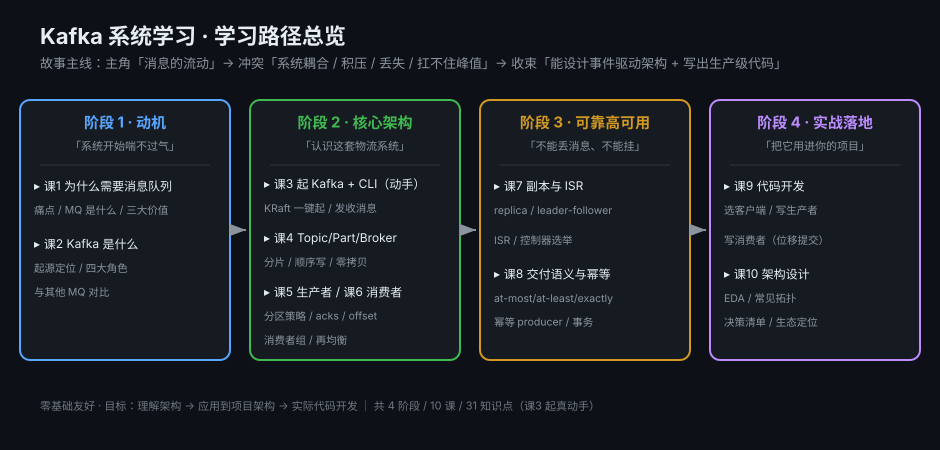

| 阶段 | 主题 | 目标 | 必须掌握 | 对应课 |
|------|------|------|---------|--------|
| 1 | 为什么需要 Kafka（动机） | 搞懂「为什么需要消息队列」，说清 Kafka 的定位与四大角色 | 能解释「为什么不能直接同步调用」「Kafka 是哪四个角色在协作」 | 课 1-2 |
| 2 | Kafka 核心架构（真动手） | 用真集群动手，说清 Topic/Partition/Broker 存储模型，讲透生产者与消费者机制 | 能跑通"建 Topic → 发 → 收"；能画出数据流并解释 offset 与再均衡 | 课 3-6 |
| 3 | 可靠性与高可用 | 理解副本如何保证不丢数据，说清三种交付语义与幂等 | 能说清「ISR 缩小时会不会丢消息」「为什么默认至少一次会重复」 | 课 7-8 |
| 4 | 实战与架构落地 | 写生产/消费代码、设计事件驱动架构 | 跑通最小可用 demo；能画出基于 Kafka 的项目架构图 | 课 9-10 |

> 四个阶段一条主线：**动机（为什么）→ 机制（怎么工作）→ 保障（怎么可靠）→ 落地（怎么用对）**。

---

## 二、全部课时汇总

## 阶段 1：为什么需要 Kafka

### 课 1：为什么需要消息队列

**知识点**：直接同步调用的痛点 · 消息队列是什么 · 削峰/异步/解耦三大价值

**一图总结**

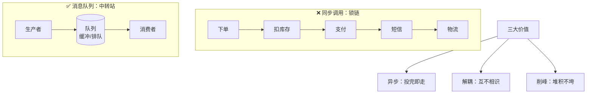

**核心结论**：同步调用是锁链，任一环节超时会拖死整条链路（雪崩）。消息队列把锁链拆成"投递 + 排队 + 处理"，换来三大价值——**异步**（投完即走）、**解耦**（互不相识）、**削峰**（堆积不垮，洪峰过后慢慢追）。

> 📖 [课 1 全文](stages/1-为什么需要Kafka/lessons/lesson-01-为什么需要消息队列.md)

### 课 2：Kafka 是什么 & 起源与定位

**知识点**：Kafka 起源与定位 · 四大角色全景 · Kafka vs 其他 MQ（直觉对比）

**一图总结**

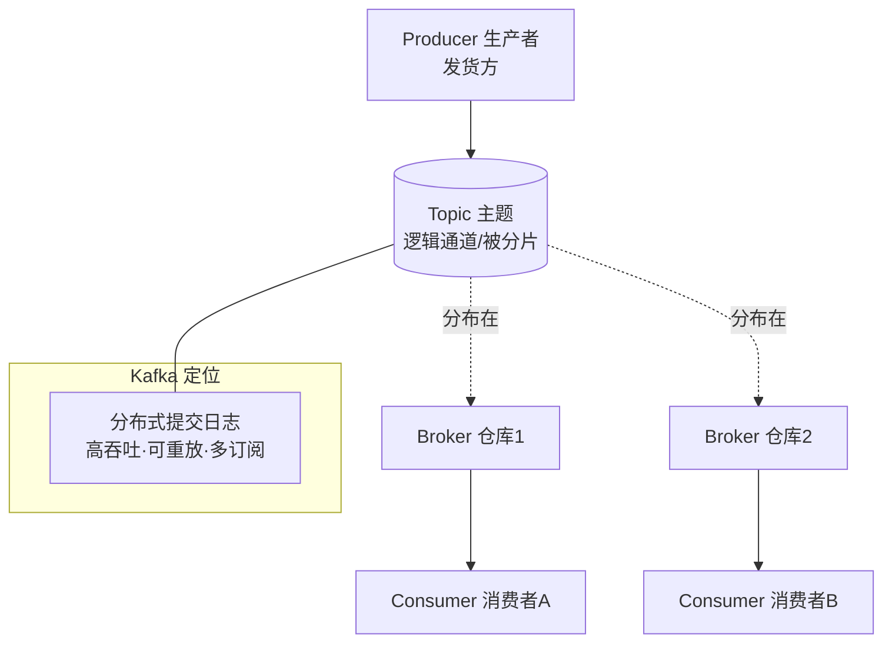

**核心结论**：Kafka 的本质是**分布式提交日志**——消息读后不删（受 retention 控制），每个消费者各自维护 offset，因此可重放、多订阅。四大角色：Producer / Topic / Broker / Consumer。**选型直觉**：Kafka 强在海量事件流与可重放；RabbitMQ 强在复杂路由的业务解耦；需要按规则分发且吞吐中等时，别硬上 Kafka。

> 📖 [课 2 全文](stages/1-为什么需要Kafka/lessons/lesson-02-Kafka是什么与起源定位.md)

## 阶段 2：Kafka 核心架构

### 课 3：本地起 Kafka + CLI 快速上手

**知识点**：KRaft 一键起（Docker） · 创建 Topic + 生产消费一条消息 · 用 CLI 观察 Partition

**一图总结**

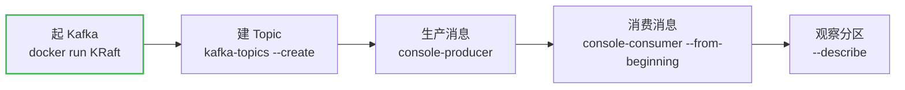

**核心结论**：Kafka 4.0 已**彻底移除 ZooKeeper**，默认 KRaft 模式，单节点用 `KAFKA_PROCESS_ROLES='broker,controller'` 一个节点兼两职。看历史消息必须加 `--from-beginning`（默认只消费启动后的新消息）。

> 📖 [课 3 全文](stages/2-核心架构/lessons/lesson-03-本地起Kafka与CLI快速上手.md)

### 课 4：Topic、Partition 与 Broker

**知识点**：Topic 与 Partition（分片思想） · 顺序写磁盘（为什么快 · 上） · 零拷贝（为什么快 · 下） · Broker 与集群

**一图总结**

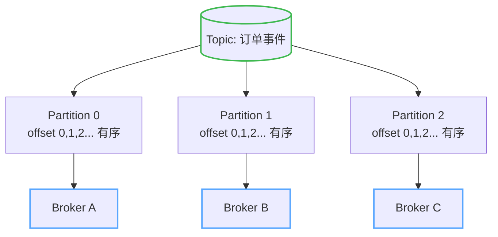

**核心结论**：Topic 是逻辑通道，**Partition 才是真家伙**——分片带来并行，分区数 = 并行度上限。Kafka 快的两根支柱：**顺序写磁盘**（避免随机寻道）+ **零拷贝**（数据不经过用户态，直接从页缓存发到网卡）。有序性是**分区级**的：分区内严格有序，跨分区不保证。

> 📖 [课 4 全文](stages/2-核心架构/lessons/lesson-04-Topic、Partition与Broker.md)

### 课 5：生产者 Producer

**知识点**：生产者发送流程 · 分区策略 · acks 与发送可靠性

**一图总结**

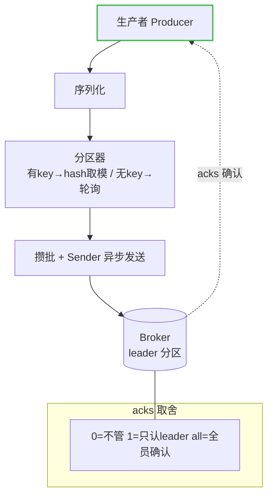

**核心结论**：发送链路是 **序列化 → 分区器 → 攒批 → Sender 异步发送**。指定 key 时用 murmur2 哈希取模固定分区（**同 key 必同分区，这是保序的手段**），无 key 则轮询。`acks=1` 只等 leader 写本地日志就返回，那段「未同步窗口」正是 leader 宕机丢消息的根源——**真正不丢要 `acks=all`**。

> 📖 [课 5 全文](stages/2-核心架构/lessons/lesson-05-生产者Producer.md)

### 课 6：消费者与消费者组

**知识点**：消费模型与位移 offset · 消费者组与再均衡 · 位移提交与重复/丢失

**一图总结**

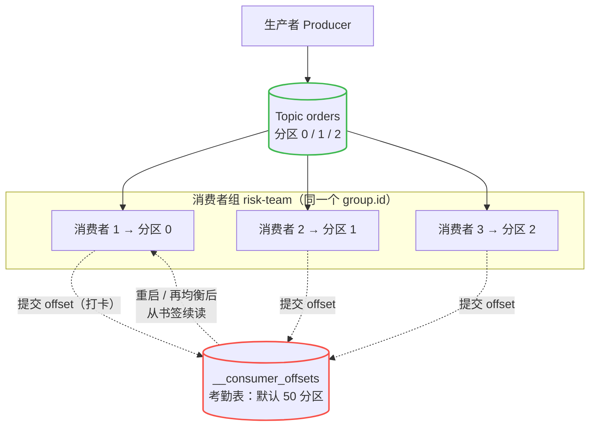

**核心结论**：口诀是**组内分工、组间广播**——竞争只发生在组内（一个分区同一时刻只能被组内一个消费者消费，所以并行上限 = 分区数），不同组各自拿到全量、各自记账。位移存在 `__consumer_offsets` 里当"书签"。**位移提交时机决定语义**：先处理后提交 = 不丢但可能重复；先提交后处理 = 可能丢。

> 📖 [课 6 全文](stages/2-核心架构/lessons/lesson-06-消费者与消费者组.md)

## 阶段 3：可靠性与高可用

### 课 7：副本机制与故障转移

**知识点**：副本与 leader/follower · ISR 机制 · 控制器选举与故障转移

**一图总结**

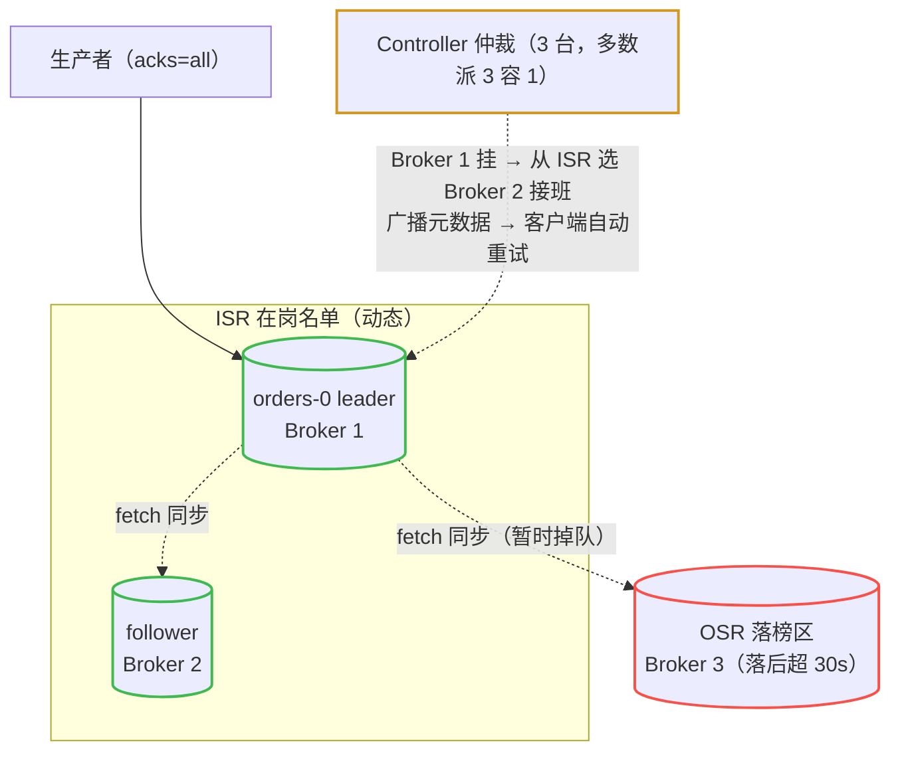

**核心结论**：**单 leader 模型**——读写都走 leader（保证 offset 由唯一权威编号），follower 是"特殊的消费者"，持续 fetch 同步待命。ISR 是在岗名单，接班只从 ISR 选；掉队的进 OSR，追上可回归。**最反直觉的一点**：`min.insync.replicas=1`（默认）时 ISR 只剩 leader 也能写入，`acks=all` 照常成功——但保障已**静默退化**（"all"实际只等到 1 份确认）。生产推荐 `min.insync.replicas=2`，让退化为**显式拒绝**而非带病运行。

> 📖 [课 7 全文](stages/3-可靠性与高可用/lessons/lesson-07-副本机制与故障转移.md)

### 课 8：交付语义与幂等

**知识点**：三种交付语义 · 幂等 producer · 事务简介

**一图总结**

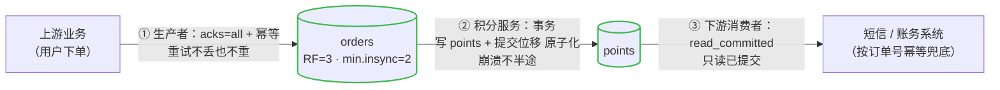

**核心结论**：Kafka 3.x 默认配置（acks=all + 无限重试 + 先处理后自动提交位移）的端到端语义是 **at-least-once**，不是 exactly-once——两处都可能重复。**每一跳的保障加起来才是不丢不重，任何一环掉链子就退化到那一环的水平**。
**幂等最容易误解的边界**：去重键是「PID + 分区 + 序列号」，它只挡**客户端内部对同一次发送的自动重试**；应用代码手动再调一次 `send()` 会拿到新序列号，broker 当成新消息正常写入。exactly-once 要显式拼装幂等 + 事务，且**事务只覆盖 Kafka 内部**（topic + `__consumer_offsets`），一旦要写数据库就失效，仍需业务幂等兜底。

> 📖 [课 8 全文](stages/3-可靠性与高可用/lessons/lesson-08-交付语义与幂等.md)

## 阶段 4：实战与架构落地

### 课 9：代码开发实战

**知识点**：选客户端与环境 · 写生产者 · 写消费者

**一图总结**

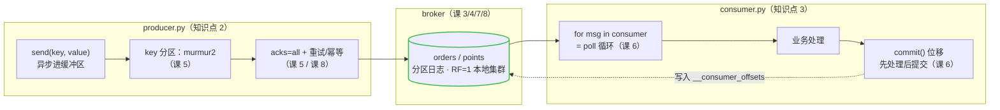

**核心结论**：**每一处关键代码都对应前几课的一个机制**——发送侧管"进"（分区 + 可靠性），消费侧管"出"（进度 + 语义）。客户端选型：学习/中小吞吐用 **kafka-python**（纯 pip 零编译），Python 高吞吐用 **confluent-kafka**（librdkafka C 内核），企业核心链路用 **Java**（新特性第一时间落地）。
**"Kafka 丢消息"的头号原因**：`send()` 是异步的，消息还在本地缓冲区；进程退出时没有 `flush()`/`close()`，缓冲区里的消息根本没发出。修复：退出前 `flush()` + `close()`，关键消息用 `future.get(timeout=10)` 逐条确认。

> 📖 [课 9 全文](stages/4-实战与架构落地/lessons/lesson-09-代码开发实战.md)

### 课 10：项目架构设计落地

**知识点**：事件驱动架构 EDA · 常见拓扑 · 决策清单

**一图总结**

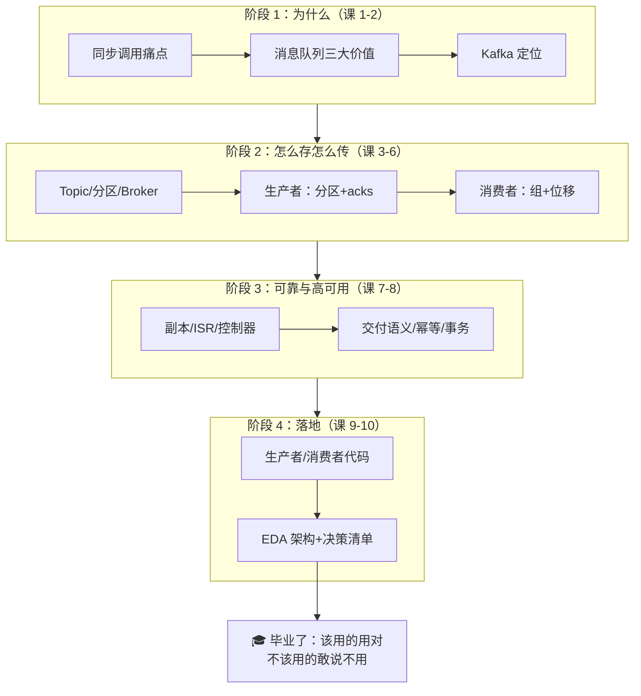

**核心结论**：**事件是过去式的事实陈述，命令是祈使句**。`UserRegistered` 是事件（发布者不关心谁处理），`SendWelcomeEmail` / `UpdatePoints` / `CallRiskEngine` 都是命令——把它们发进事件主干，等于**把同步调用的耦合包了个异步的皮**。正确姿势：积分服务订阅 `UserRegistered` 自己决定加多少分。
**技术选型的答案永远是"看清单"，不是"看热度"**：日均 2000 万事件多下游、大促削峰、需要重放历史——适合 Kafka；每天 500 条、按部门路由、处理完流转下一环节的审批流——不该用 Kafka（那是工作流引擎的活）。

> 📖 [课 10 全文](stages/4-实战与架构落地/lessons/lesson-10-项目架构设计落地.md)

---

## 三、综合实战项目：电商订单事件中心

> 📦 [项目根目录](projects/电商订单事件中心/)

**一句话需求**：订单服务把 `OrderCreated` / `OrderPaid` / `OrderCancelled` 三类事件发进 Kafka，下游的**积分、风控、审计**三个服务各自独立消费同一份数据，且必须做到**不丢消息、不重复记账、坏消息不阻塞主链路**。

**完成即达成**：一份事件流被 3 个下游独立消费（各自有独立进度）· 积分服务不重复加分 + 坏消息进 DLQ · 风控服务用事务保证「读-处理-写」原子 · 一个命令看清各服务消费进度与积压。

### 跨阶段整合（4 个阶段全覆盖）

| 阶段 | 覆盖知识点 | 项目落点 |
|------|-----------|---------|
| 阶段 1（3 点） | 三大价值 · MQ 对比 · Kafka 定位 | 订单服务改发事件；选 Kafka 因为一份数据 3 下游 + 可回放 |
| 阶段 2（5 点） | Topic 与分区 · 分区策略 · acks · 消费者组 · 位移提交 | `user_id` 作 key 保序；`acks='all'`；3 个服务 = 3 个 group；手动提交 |
| 阶段 3（3 点） | ISR · 交付语义 · 幂等 / 事务 | 取「至少一次 + 消费端幂等」；风控用事务实现原子 |
| 阶段 4（5 点） | 生产者/消费者代码 · EDA · 拓扑 · 决策清单 | 代码基于课 9 骨架；事件命名用过去式；按业务事件建 topic |

### 代码结构

```
projects/电商订单事件中心/
├── README.md           # 需求、覆盖地图、运行方式
├── 设计决策.md          # 两个真权衡点（含候选方案对比与代价）
├── 反例对照.md          # "能跑但很糟"的版本，逐条对照
├── 验收清单.md          # 逐项勾选的验收标准
└── 实现/
    ├── init_topics.py      # 初始化 orders / orders.DLQ / orders.retry
    ├── order_producer.py   # 订单服务：三种事件 + 故意制造的坏消息
    ├── points_consumer.py  # 积分服务：幂等记账 + 坏消息进 DLQ
    ├── risk_consumer.py    # 风控服务：事务消费-处理-生产
    ├── audit_consumer.py   # 审计服务：全量留痕（事件溯源雏形）
    └── common.py           # 公共配置
```

### 运行方式

> Windows 避坑同课 9：用 `python3.11.exe` 运行、PowerShell 用 `;` 分隔命令。

```powershell
docker ps
python3.11.exe 实现\init_topics.py
python3.11.exe 实现\order_producer.py
```

再开**三个**终端分别跑下游：

```powershell
python3.11.exe 实现\points_consumer.py
python3.11.exe 实现\risk_consumer.py
python3.11.exe 实现\audit_consumer.py
```

看全局进度：

```powershell
docker exec kafka /opt/kafka/bin/kafka-consumer-groups.sh --bootstrap-server localhost:9092 --describe --group points-service
```

**建议路径**：先读 [设计决策.md](projects/电商订单事件中心/设计决策.md)（理解为什么这么选）→ 再读 [反例对照.md](projects/电商订单事件中心/反例对照.md)（看"能跑但很糟"长什么样）→ 跑起来后逐项勾选 [验收清单.md](projects/电商订单事件中心/验收清单.md)。

### 两个设计决策（本项目的精华）

**决策 1：整体取「至少一次 + 消费端幂等」，事务只用于风控服务。**
理由是**事务的边界决定了它不能包打天下**——Kafka 事务只覆盖 topic 与 `__consumer_offsets`，积分服务要写数据库、审计服务要写对象存储，事务的原子性到不了这些外部系统，用了照样得写幂等，白付吞吐代价（约降 15%–30%）。风控是例外：它是纯 Kafka 内闭环，事务能真正生效，且判定结果重复会造成误拦截。
代价：正确性从"不重复"**降格为"重复无害"**——只能承诺"重复了结果也对"，需要向上下游说清楚。

**决策 2：坏消息失败 3 次后进 DLQ，不原地重试。**
理由是原地重试的失败模式**灾难性且反直觉**：一条毒药消息卡死消费者 → 超过 `max.poll.interval.ms` 被踢出组 → 触发再均衡 → 该组所有分区全部暂停 → 积压扩散 → 坏消息分给下一个消费者再次卡死，正反馈死循环。DLQ 的额外好处是**积压量本身就是"有多少坏消息"的指标**，且数据没丢，修好后可重放。
判据：**消息内容有问题（必然重复失败）→ DLQ；环境有问题（重试可能成功）→ 退避重试**。生产常两者结合，本项目即先退避重试 3 次再进 DLQ。

---

## 四、实战与排障

两份产物互补：**08 是学习态**（理解为什么），**09 是使用态**（出事时按症状倒查）。

### [08 实战经验](08-实战经验.md)（学习态）

- **适用边界与反模式**：明确别用的场景 · 三个高频反模式（用了 Kafka 但用错了）
- **7 个高频故障模式**（五段式：症状 → 根因 → 检测 → 修复 → 预防）：消费者积压 · 毒药消息 · 批次过期 · 连不上/元数据 · NOT_LEADER_OR_FOLLOWER 刷屏 · 位移提交时机 · 再均衡风暴
- **上线 Checklist**：生产者 / 消费者 / Topic 与集群 / 可观测性 四组投产前必查项

### [09 排障速查手册](09-排障速查手册.md)（使用态 · 机长 QRH 式）

每条按「一眼识别 → 止血 → 定位 → 修复 → 若无效」组织，按症状倒查：

| # | 症状 | 首要止血动作 |
|---|------|-------------|
| 1 | 消费者积压 | 先看 Lag 是否持续上涨，扩容消费者（≤ 分区数）或提吞吐 |
| 2 | 毒药消息阻塞分区 | 定位卡住的分区与 offset，旁路到 DLQ 后恢复主链路 |
| 3 | 生产者批次过期 | 调 `linger.ms` / `batch.size` 或降发送速率 |
| 4 | 连不上或拿不到元数据 | 查 `bootstrap.servers` 与网络/鉴权，别急着改业务代码 |
| 5 | NOT_LEADER_OR_FOLLOWER | 多数是正常leader切换，**不要告警轰炸**，确认是否持续 |
| 6 | 重复消费或消息丢失 | 先定位是"提交时机"还是"重试"导致，再对症处理 |
| 7 | 再均衡风暴 | 查 `max.poll.interval.ms` 与处理耗时，先稳住组成员 |
| 8 | 分区不可用 | 查 ISR 与 `unclean.leader.election`，确认是否要人工介入 |

> 手册末尾还有**通用命令速查**，可直接复制执行。

---

## 五、知识点总索引

| 课 | 阶段 | 知识点 |
|----|------|--------|
| 课 1 | 1 | 直接同步调用的痛点 · 消息队列是什么 · 削峰/异步/解耦三大价值 |
| 课 2 | 1 | Kafka 起源与定位 · 四大角色全景 · Kafka vs 其他 MQ |
| 课 3 | 2 | KRaft 一键起（Docker） · 创建 Topic + 生产消费 · CLI 观察 Partition |
| 课 4 | 2 | Topic 与 Partition · 顺序写磁盘 · 零拷贝 · Broker 与集群 |
| 课 5 | 2 | 生产者发送流程 · 分区策略 · acks 与发送可靠性 |
| 课 6 | 2 | 消费模型与位移 · 消费者组与再均衡 · 位移提交与重复/丢失 |
| 课 7 | 3 | 副本与 leader/follower · ISR 机制 · 控制器选举与故障转移 |
| 课 8 | 3 | 三种交付语义 · 幂等 producer · 事务简介 |
| 课 9 | 4 | 选客户端与环境 · 写生产者 · 写消费者 |
| 课 10 | 4 | 事件驱动架构 EDA · 常见拓扑 · 决策清单 |

> 全课程合计 **10 课 · 31 个知识点 · 4 个阶段**，另有 1 个综合实战项目 + 实战经验 + 排障速查手册。

---

## 🚀 接下来可以做什么

- **避坑**：复制"给我讲讲 Kafka 的实战经验与排障手册"，进入 Phase 5。
- **复盘**：复制"考我一下 Kafka，针对 {薄弱点}"进行知识点对齐。
- **进阶**：告诉我下一步想深入的方向，我会基于当前档案调整大纲继续。
