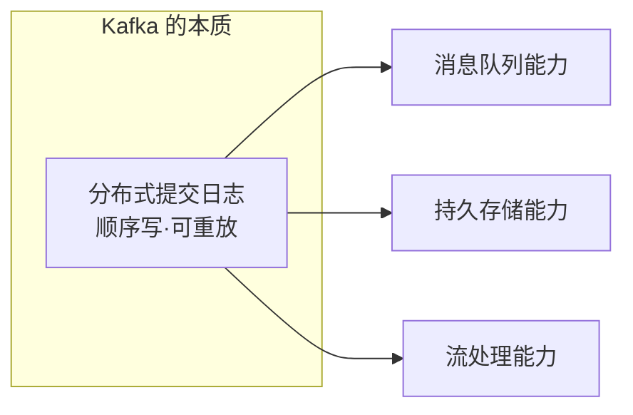
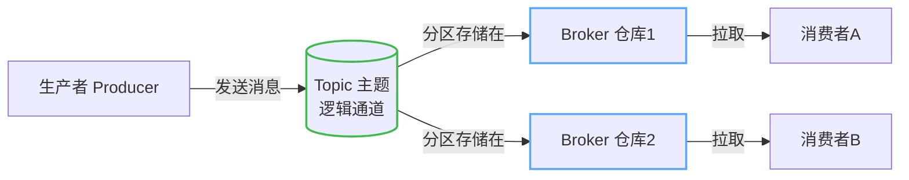
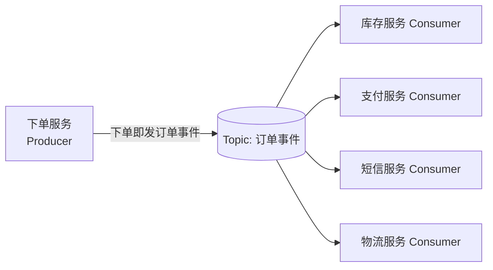
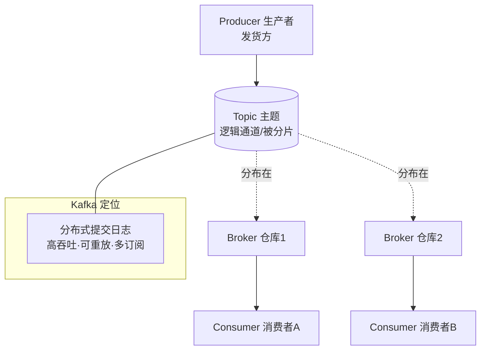

# 第 2 课：Kafka 是什么 & 起源与定位

> 所属阶段：阶段 1《为什么需要 Kafka》｜ 水平：零基础 ｜ 本课知识点：Kafka 起源与定位 / 四大角色全景 / Kafka vs 其他 MQ
> 故事情节：痛点清楚了，主角终于登场——Kafka 这个"物流中心"是什么来头、内部哪四个角色在协作、和别的快递公司差在哪

## 🎯 本课目标

- 说清 Kafka 的诞生背景与定位（分布式事件流平台 / 分布式提交日志）
- 画出 Producer / Consumer / Broker / Topic 四大角色的协作关系
- 对 Kafka 与 RabbitMQ、Redis 队列建立直觉对比与选型感

---

## 第一幕：起源与场景引入

> 🏛️ **起源（核查于 2026-08）**：Kafka 诞生于 LinkedIn。2010 年前后，LinkedIn 的工程师 Jay Kreps、Neha Narkhede、Jun Rao 面临一个真实麻烦——公司内部有几十上百个系统要互相传数据（用户行为、日志、关系链…）。2011 年初他们把这套内部系统开源，2012 年 10 月 23 日成为 Apache 顶级项目；2014 年三人又创立了 Confluent 公司专门做 Kafka 生态。名字取自作家 Franz Kafka，因为 Kreps 觉得"这是个为写入（writing）优化的系统"，且他很喜欢卡夫卡的作品。

把第一幕那个"传话锁链"的问题放大到公司级：假设有 **M 个生产数据的系统**（订单、点击、日志…）和 **N 个消费数据的系统**（数仓、推荐、监控…）。

如果不加中介，它们之间要建 **M × N** 条点对点管道——10 个生产方 × 10 个消费方 = 100 条直接连线，任何一边一变就全乱套。

> 🎬 **场景**：LinkedIn 当年就是被这 "M×N 条管道" 活活拖垮的。他们想要的其实很简单：**一个中央中转站，让管道数量从 M×N 降到 M+N**——生产方只管往里写，消费方只管从里读。Kafka 就是为这个而生的。

---

## 第二幕：认知冲突

你可能会问："市面上不是有消息队列（MQ）了吗？直接用不行？"

这正是当年的矛盾点：

- **传统 MQ（如早期的 ActiveMQ）**：能解耦，但**吞吐不够大**，且消息被消费后通常就删了，**无法 replay（重放）**。
- **他们需要的是**：既能扛住海量实时数据（高吞吐），又能把数据**持久保留、让不同消费方按需反复读**（可重放、多订阅）。
- **矛盾**：当时的工具被迫二选一——要么快但不留底，要么留底但慢。

> ❓ **问题**：有没有一种东西，既能像"日志"一样把数据一字排开、永久留存、随便谁从任意位置读，又能像"高速公路"一样扛住每秒几十万条？Kafka 的答案：把消息队列**重做成"分布式的提交日志（commit log）"**。

---

## 第三幕：层层揭示

### 知识点 1：Kafka 起源与定位

#### 直觉建立（类比）

把 Kafka 想成一座**超大型中央物流枢纽 + 全程监控的传送带**：

- 所有包裹（数据）被**按顺序**码放在一条条传送带上；
- 传送带 24 小时录像（持久化），谁想看都能从任意一刻回放；
- 无数家快递公司（消费者）同时各看各的，互不影响。

它不是"取一件少一件"的邮箱，而是一条**可回放的流水账**。

> 💡 **类比的边界**：真实物流包裹取走就没了；Kafka 的"日志"是**只追加（append-only）且保留**，消费者读的是"自己看到第几格"的进度，不删数据。这点正是它和传统队列最大的不同。

#### 概念与原理

Kafka 的官方定位是 **分布式事件流平台（distributed event streaming platform）**，底层本质是一个**分布式的提交日志**——数据按到达顺序写成日志，分区内严格有序。它同时干三件事：

1. **消息队列**（解耦生产/消费）
2. **存储系统**（数据落盘、可保留很久）
3. **流处理底座**（数据可在流动中被实时计算）



> 一句话：**Kafka = 一条能扛海量、能回放、能被很多人同时订阅的"数据流水账"。**

#### 一句话记住

**Kafka 是"为写入优化"的分布式流水账——顺序落盘、可重放、多订阅。**

---

### 知识点 2：四大角色全景

#### 直觉建立（类比）

| 角色 | 生活类比 | 干什么 |
|------|----------|--------|
| **Producer 生产者** | 发货方 | 把消息投进 Kafka |
| **Topic 主题** | 按品类分的"传送带/货架" | 消息的逻辑分类通道（如"订单事件"） |
| **Broker 仓库** | 仓库服务器 | 真正存消息的机器，多个组成集群 |
| **Consumer 消费者** | 收货方 | 从 Topic 读取并处理消息 |

#### 概念与原理

四大角色协作，构成一个"生产 → 中转 → 消费"的闭环：



关键点（零基础先记住这 3 条）：

1. **Topic 是"逻辑概念"**，真正的数据被切成若干 **Partition（分区）**，分散存在不同 Broker 上——这叫"分片"，是 Kafka 能横向扩展的根本（下节课细讲）。
2. **Broker 是服务器进程**，一堆 Broker 凑成**集群**，挂掉几个也不影响整体。
3. **Consumer 自己记录"读到哪了"**（这个进度叫 offset，第 6 课讲消费者时会细说），所以多个消费者可以**各读各的、互不打扰、还能从开头重读**。

> 💡 历史小注：早期 Kafka 依赖 ZooKeeper 管理集群元数据；**Kafka 4.0（2025 发布）已彻底移除 ZooKeeper，改用内置的 KRaft 模式**（第 3 课实操会用到）。你只需知道：现在 Kafka 自己管自己，不用再养一个 ZooKeeper 了。

#### 一句话记住

**Producer 发、Topic 分、Broker 存、Consumer 拉——四个角色各管一摊，靠 Topic 串起来。**

---

### 知识点 3：Kafka vs 其他 MQ（直觉对比）

光说定义太虚，直接上对比。三种你最可能听到的"队列"：

| 维度 | Redis 队列 | RabbitMQ | Kafka |
|------|-----------|----------|-------|
| **定位** | 内存数据库"顺手"做的队列 | 传统消息代理（任务分发） | 分布式事件流 / 提交日志 |
| **持久化** | 弱（内存为主，怕丢） | 强 | 强（磁盘日志，默认保留） |
| **消费模型** | 取走即删 | 通常"一条消息给一个消费者" | 发布-订阅，多消费者**独立读、可重放** |
| **吞吐** | 高（但受内存限制） | 中 | **极高**（顺序写磁盘） |
| **擅长场景** | 轻量、低重要级任务 | 业务系统解耦、复杂路由 | 事件流、日志、大数据管道、高吞吐 |

**怎么选（直觉版）**：

- 只是"发个通知、丢了也无所谓"→ Redis 队列够用、最简单；
- 业务系统之间解耦、还要复杂路由规则（A 类消息给 X、B 类给 Y）→ RabbitMQ 更合适；
- 要**扛海量事件、数据要留底反复算、多个系统都要同一份数据**→ 选 Kafka。

> 💡 三者有重叠区，但 Kafka 的"护城河"是：**高吞吐 + 持久可重放 + 多订阅者独立进度**。这正好对应第一幕那个"M×N 管道"问题。

#### 一句话记住

**Redis 轻、RabbitMQ 灵、Kafka 猛——要扛海量事件流且可重放，就选 Kafka。**

---

## 第四幕：实操验证

> 本课还没装 Kafka（第 3 课才动手），我们用**第一幕的电商场景重构**来验证"四大角色"是否真的解决了锁链问题。

把第 1 课那个"下单卡死"的系统，用 Kafka 重画一遍：



对比第 1 课：

- **之前**：下单逻辑"焊死"调用 4 个服务，短信一慢全崩；
- **现在**：下单服务只做一件事——把"订单事件"**投进 Topic 就返回**（异步）；库存/支付/短信/物流各自是**独立消费者**，从 Topic 按自己的节奏读，互不相识。

> ✅ **回扣场景**：你看，"发短信"挂了，只影响"短信 Consumer"这一个读者，下单服务照常返回、其他三个消费者照常工作。M×N 的锁链，被这个中央 Topic 降成了 M+N。**这就是第 1 课痛点 + 本课四大角色，合起来给出的解药。**

---

## 第五幕：体系收束

> 📍 **全局定位**：Kafka 是本课请出的"主角"——一座可回放、高吞吐的中央数据枢纽。它解决的是第一幕的"系统耦合/积压/丢消息"，方式是把"锁链"改成"中转站 + 多订阅"。
> 🔗 **下一步**：你现在已经知道 Kafka 是"什么"和"哪四个角色"。下一阶段（阶段 2）我们**走进枢纽内部**，先动手把 Kafka 跑起来（第 3 课），再讲 Topic 怎么被切成 Partition、Broker 怎么组成集群、为什么 Kafka 这么快（第 4 课）。

---

## 🐞 常见误区

1. **"Kafka 就是个消息队列，和 RabbitMQ 一样"**：表面都是 MQ，但 Kafka 本质是**分布式提交日志**——消息持久保留、多个消费者各自记录进度**独立重放**，这是 RabbitMQ 的"取走即删"模型没有的。选型时要看"要不要可重放、要不要多订阅者"。
2. **"Topic 就等于一个 Queue"**：不完全对。Topic 是**逻辑分类**，内部由多个 **Partition（有序日志）** 组成；真正有序的是"单个分区内"，跨分区不保证全局顺序。细节下节课展开。
3. **"Kafka 默认会丢数据"**：恰恰相反，Kafka 默认把消息落盘。所谓"丢消息"几乎都来自**配置不当**（如生产端 `acks=0`、或副本数设错），可靠性是阶段 3 的主题，别现在就怕。

## 📚 官方文档

- [Apache Kafka 官方文档](https://kafka.apache.org/documentation/)：Kafka 权威文档，涵盖概念、配置、API 与 CLI 工具
- [Kafka 快速开始](https://kafka.apache.org/quickstart)：官方 Quickstart，第 3 课会用到其中的启动与收发命令

## 一图总结



## 课后小测

**Q1**：Kafka 消息被消费者读取后，默认会怎样？
- A. 立刻从磁盘删除，释放空间
- B. 保留在日志里，消费者只记录自己读到的位置（offset），不影响他人
- C. 只保留最新一条，旧的全部覆盖
- D. 自动同步给所有生产者

<details><summary>答案与解析</summary>

**答案：B**。Kafka 是"提交日志"模型，数据按序落盘并保留（受 retention 配置控制）；每个消费者独立维护自己的 offset，读取不删数据，因此多个消费者可各读各的、还能重放。这是它区别于"取走即删"型队列的关键。

</details>

**Q2**：业务系统间需要做复杂路由解耦（如"A 类消息给 X 服务、B 类给 Y 服务"），且吞吐要求中等，通常首选？
- A. Kafka
- B. Redis 队列
- C. RabbitMQ
- D. 直接同步调用

<details><summary>答案与解析</summary>

**答案：C**。RabbitMQ 擅长"传统消息代理 + 复杂路由（exchange/binding）"的业务解耦场景；Kafka 强在海量事件流与可重放，Redis 队列轻量但持久化弱，直接同步调用正是第一幕要避免的。

</details>

## 🚀 下一批接力提示词

> 学完本批后，**复制下面这段文字发给 AI**，即可无缝进入下一批（无需重新描述上下文）：

```
继续学 Kafka。我的学习档案在 kafka-basics/00-学习档案.md，
刚学完阶段 1《为什么需要 Kafka》的课《Kafka 是什么 & 起源与定位》知识点 Kafka起源与定位、四大角色全景、Kafka vs 其他 MQ，
请按大纲继续讲解下一批知识点（阶段 2 课3：本地起 Kafka + CLI 快速上手）。
```
