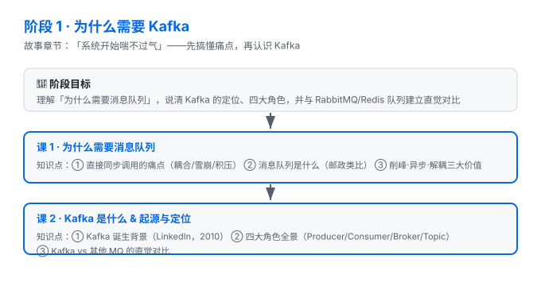

# 阶段 1：为什么需要 Kafka

> 所属课程：Kafka 系统学习 ｜ 故事章节：「系统开始喘不过气」 ｜ 上一阶段：无（起点）

## 🎯 本阶段目标

- 理解「为什么需要消息队列」，能说清直接同步调用的三大痛点
- 说清 Kafka 的定位、四大角色（Producer / Consumer / Broker / Topic）如何协作
- 对 Kafka 与其他 MQ（RabbitMQ、Redis 队列）建立直觉对比，知道各自适合什么

## 📍 学习重点

- **痛点真实感**：先让"系统耦合/雪崩/积压"成为你亲历的问题，再引入解药
- **角色全景**：Producer 生产、Broker 存储与分发、Consumer 消费、Topic 是通道
- **直觉对比**：Kafka 是"高吞吐分布式日志"，不是"一对一任务队列"

## ✅ 必须掌握的知识点

| 知识点 | 所属课 | 学完应能 |
|--------|--------|----------|
| 直接同步调用的痛点 | 课1 | 列举耦合/雪崩/积压并解释 |
| 消息队列是什么 | 课1 | 用类比说清 MQ 的本质 |
| 削峰·异步·解耦 | 课1 | 解释三大价值如何解决问题 |
| Kafka 起源与定位 | 课2 | 说清它从哪来、是干什么的 |
| 四大角色全景 | 课2 | 画出四角色协作关系 |
| Kafka vs 其他 MQ | 课2 | 给出选型直觉 |

## 🗺️ 本阶段路径图

## 本阶段产出

- [ ] `lessons/lesson-01-why-message-queue.md`
- [ ] `lessons/lesson-02-what-is-kafka.md`
