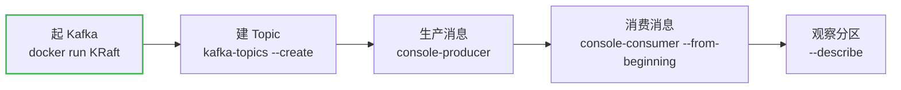

# 第 3 课：本地起 Kafka + CLI 快速上手

> 所属阶段：阶段 2《Kafka 核心架构》｜ 水平：零基础 ｜ 本课知识点：KRaft 一键起（Docker） / 创建 Topic + 生产消费 / CLI 观察 Partition
> 故事情节：主角从纸上走进现实——把 Kafka 跑起来，亲眼看它"建通道、发消息、收消息"
> 适用版本：Kafka 4.x（KRaft 模式，无需 ZooKeeper）；命令基于官方镜像 `apache/kafka:4.0.0`

## 🎯 本课目标

- 用 Docker 一条命令把 Kafka 跑起来（KRaft 单节点）
- 会创建 Topic、生产一条消息、消费一条消息
- 会用 `--describe` 亲眼看 Partition / 副本，回扣第 4 课的分片概念

---

## 第一幕：起源与场景引入

前两课你一直在"纸上谈兵"——聊为什么需要 Kafka、四大角色是什么。现在，我们**把那个物流中心真的建到你电脑上**，亲手投一票货、再亲手取出来。

只要本机装了 **Docker**，30 秒就能起一个 Kafka，不需要装 Java、不需要配一堆配置文件。

> 🎬 **场景**：你要在本地搭一个 Kafka，用来练习后面几课的生产者、消费者代码。以前的教程总要你先装 ZooKeeper 再装 Kafka，两个服务、一堆配置。现在呢？

---

## 第二幕：认知冲突

你可能会担心："装 Kafka 是不是很麻烦？是不是还得先弄个 ZooKeeper？"

好消息是——**不用了**。这正是第 2 课提过的 KRaft 变革：

- **旧时代**：Kafka 依赖 ZooKeeper 存元数据，你要维护两个分布式系统；
- **Kafka 4.0 起**：ZooKeeper 被彻底移除，Kafka 用内置的 **KRaft** 自己管自己，单机一键起。

> ❓ **问题**：既然如此，我能不能用**一条 Docker 命令**就把整个 Kafka 拉起来，然后立刻开始发消息？

---

## 第三幕：层层揭示

### 知识点 1：KRaft 一键起（Docker）

#### 直觉建立（类比）

`docker run` 就像**点一份"Kafka 全家桶外卖"**——镜像是菜谱，环境变量是"口味偏好"，容器跑起来就是一家现成的 Kafka 店，你不用自己搭。

#### 概念与原理

用官方镜像 `apache/kafka:4.0.0`，配好 KRaft 所需的环境变量，一条命令启动：

```bash
docker run -d \
  --name kafka \
  -p 9092:9092 \
  -e KAFKA_NODE_ID=1 \
  -e KAFKA_PROCESS_ROLES='broker,controller' \
  -e KAFKA_CONTROLLER_QUORUM_VOTERS='1@kafka:29093' \
  -e KAFKA_LISTENERS='PLAINTEXT://0.0.0.0:9092,CONTROLLER://0.0.0.0:29093' \
  -e KAFKA_ADVERTISED_LISTENERS='PLAINTEXT://localhost:9092' \
  -e KAFKA_CONTROLLER_LISTENER_NAMES='CONTROLLER' \
  -e KAFKA_LISTENER_SECURITY_PROTOCOL_MAP='CONTROLLER:PLAINTEXT,PLAINTEXT:PLAINTEXT' \
  -e KAFKA_LOG_DIRS='/tmp/kraft-logs' \
  -e CLUSTER_ID='MkU3OEVBNTcwNTJENDM2Qk' \
  apache/kafka:4.0.0
```

> 这些环境变量你不用逐条背，只需看懂 3 个关键点：
> - `KAFKA_PROCESS_ROLES='broker,controller'`：这一个节点**既当仓库又当管理员**（单节点 KRaft 的典型玩法）；
> - `KAFKA_CONTROLLER_QUORUM_VOTERS` + `CLUSTER_ID`：KRaft 集群的身份标识；
> - `KAFKA_ADVERTISED_LISTENERS='PLAINTEXT://localhost:9092'`：客户端从 `localhost:9092` 连进来。

启动后确认它活着：

```bash
docker logs kafka
# 看到类似 "Kafka Server started" 就说明起来了（首次启动会先格式化，稍等几秒）
```

> 💡 **类比的边界**：这条命令起的是"单节点演示版"——副本数只能是 1，不适合生产；生产要起 3 个以上 controller + 多 broker。但拿来学习足够了。

#### 一句话记住

**一条 `docker run` + KRaft 环境变量，30 秒起一个单节点 Kafka。**

---

### 知识点 2：创建 Topic + 生产消费一条消息

#### 直觉建立（类比）

Topic = 你给物流中心**开一条专用传送带**；生产 = 往传送带**投一件货**；消费 = 从传送带**取一件货**。

#### 概念与原理

Kafka 的 CLI 工具都在容器内的 `/opt/kafka/bin/` 下。三步走：

**① 建 Topic**（开传送带）：

```bash
docker exec -it kafka /opt/kafka/bin/kafka-topics.sh --create \
  --topic orders --partitions 3 --replication-factor 1 \
  --bootstrap-server localhost:9092
# 预期输出：Created topic orders.
```

**② 生产消息**（投货，回车后输入文字，Ctrl+C 退出）：

```bash
docker exec -it kafka /opt/kafka/bin/kafka-console-producer.sh \
  --topic orders --bootstrap-server localhost:9092
# 输入几行，例如：
> 第一个订单来了
> 第二个订单来了
```

**③ 消费消息**（取货，`--from-beginning` 表示从第 0 条开始读）：

```bash
docker exec -it kafka /opt/kafka/bin/kafka-console-consumer.sh \
  --topic orders --from-beginning --bootstrap-server localhost:9092
# 预期输出：刚才发的那两行文字原样打印出来
```

#### 一句话记住

**`kafka-topics.sh --create` 开通道，`console-producer` 投，`console-consumer --from-beginning` 取。**

---

### 知识点 3：用 CLI 观察 Partition

#### 直觉建立（类比）

第 4 课会细讲 Partition（分片）。现在先**偷看一眼**：你刚才建的 `orders` 有 3 个分区，它们长什么样？

#### 概念与原理

用 `--describe` 看一个 Topic 的分区详情：

```bash
docker exec -it kafka /opt/kafka/bin/kafka-topics.sh --describe \
  --topic orders --bootstrap-server localhost:9092
```

预期会看到类似这样的**三行**（每行一个 Partition）：

```
Topic: orders  PartitionCount: 3  ReplicationFactor: 1
Topic: orders  Partition: 0  Leader: 1  Replicas: 1  Isr: 1
Topic: orders  Partition: 1  Leader: 1  Replicas: 1  Isr: 1
Topic: orders  Partition: 2  Leader: 1  Replicas: 1  Isr: 1
```

再看所有 Topic：

```bash
docker exec -it kafka /opt/kafka/bin/kafka-topics.sh --list --bootstrap-server localhost:9092
# 预期：orders 以及系统内部的 __consumer_offsets
```

> 💡 现在你只需看懂一件事：`orders` 这一个 Topic，底层其实是 **3 个 Partition（0/1/2）**。这就是"逻辑一个、物理三个"的分片雏形，第 4 课会把它讲透。

#### 一句话记住

**`--describe` 一眼看穿 Topic 底下的 Partition 分布，是理解分片的第一手证据。**

---

## 第四幕：实操验证

把上面三步串成一条完整链路，亲手验证"生产 → 存储 → 消费"：

```bash
# 1. 起 Kafka
docker run -d --name kafka -p 9092:9092 \
  -e KAFKA_NODE_ID=1 \
  -e KAFKA_PROCESS_ROLES='broker,controller' \
  -e KAFKA_CONTROLLER_QUORUM_VOTERS='1@kafka:29093' \
  -e KAFKA_LISTENERS='PLAINTEXT://0.0.0.0:9092,CONTROLLER://0.0.0.0:29093' \
  -e KAFKA_ADVERTISED_LISTENERS='PLAINTEXT://localhost:9092' \
  -e KAFKA_CONTROLLER_LISTENER_NAMES='CONTROLLER' \
  -e KAFKA_LISTENER_SECURITY_PROTOCOL_MAP='CONTROLLER:PLAINTEXT,PLAINTEXT:PLAINTEXT' \
  -e KAFKA_LOG_DIRS='/tmp/kraft-logs' \
  -e CLUSTER_ID='MkU3OEVBNTcwNTJENDM2Qk' \
  apache/kafka:4.0.0

# 2. 建一个 3 分区的 topic
docker exec -it kafka /opt/kafka/bin/kafka-topics.sh --create \
  --topic orders --partitions 3 --replication-factor 1 --bootstrap-server localhost:9092

# 3. 观察分区
docker exec -it kafka /opt/kafka/bin/kafka-topics.sh --describe \
  --topic orders --bootstrap-server localhost:9092
```

> ✅ **回扣场景**：从"纸上谈兵"到"亲手看到 3 个 Partition"，你已经迈出关键一步。后面第 4 课讲分片、第 5 课讲生产者、第 6 课讲消费者时，**随时能用这个真集群做实验**，不用再干看文字。

用完可以这样收尾：

```bash
docker stop kafka && docker rm kafka   # 停掉并删除容器
```

---

## 第五幕：体系收束

> 📍 **全局定位**：从本课起，你手里有了一个**随时可用的真 Kafka**。这是整个"动手实操"目标的地基——之后的每一课，讲概念时都能配真命令验证。
> 🔗 **下一步**：下一课《第 4 课：Topic、Partition 与 Broker》会把你刚才看到的"3 个 Partition"背后的原理讲透——分片、顺序写、零拷贝、Broker 集群。

---

## 🐞 常见误区

1. **"忘了 `--from-beginning` 看不到旧消息"**：`kafka-console-consumer` 默认只读**启动之后新来的消息**；要读历史消息必须加 `--from-beginning`。
2. **"脚本路径找不到"**：命令工具在**容器内** `/opt/kafka/bin/`，必须用 `docker exec -it kafka /opt/kafka/bin/xxx.sh`，而不是直接敲 `kafka-topics.sh`（除非你宿主机也装了 Kafka）。
3. **"把 `-p 9092:9092` 端口改了就忘了 advertised 监听"**：对外监听地址由 `KAFKA_ADVERTISED_LISTENERS` 决定，客户端要连它，端口不匹配会连不上。

## 📋 命令速查卡

| 动作 | 命令 |
|------|------|
| 起 Kafka（KRaft 单节点） | `docker run -d --name kafka -p 9092:9092 -e KAFKA_NODE_ID=1 -e KAFKA_PROCESS_ROLES='broker,controller' -e KAFKA_CONTROLLER_QUORUM_VOTERS='1@kafka:29093' -e KAFKA_LISTENERS='PLAINTEXT://0.0.0.0:9092,CONTROLLER://0.0.0.0:29093' -e KAFKA_ADVERTISED_LISTENERS='PLAINTEXT://localhost:9092' -e KAFKA_CONTROLLER_LISTENER_NAMES='CONTROLLER' -e KAFKA_LISTENER_SECURITY_PROTOCOL_MAP='CONTROLLER:PLAINTEXT,PLAINTEXT:PLAINTEXT' -e KAFKA_LOG_DIRS='/tmp/kraft-logs' -e CLUSTER_ID='MkU3OEVBNTcwNTJENDM2Qk' apache/kafka:4.0.0` |
| 看日志/是否启动 | `docker logs kafka` |
| 建 Topic | `docker exec -it kafka /opt/kafka/bin/kafka-topics.sh --create --topic orders --partitions 3 --replication-factor 1 --bootstrap-server localhost:9092` |
| 列出 Topic | `docker exec -it kafka /opt/kafka/bin/kafka-topics.sh --list --bootstrap-server localhost:9092` |
| 看分区/副本 | `docker exec -it kafka /opt/kafka/bin/kafka-topics.sh --describe --topic orders --bootstrap-server localhost:9092` |
| 生产消息 | `docker exec -it kafka /opt/kafka/bin/kafka-console-producer.sh --topic orders --bootstrap-server localhost:9092` |
| 消费消息 | `docker exec -it kafka /opt/kafka/bin/kafka-console-consumer.sh --topic orders --from-beginning --bootstrap-server localhost:9092` |
| 停止并删除容器 | `docker stop kafka && docker rm kafka` |

## 📚 官方文档

- [Kafka 快速开始](https://kafka.apache.org/quickstart)：官方 Quickstart，含单节点 KRaft 启动与命令行生产/消费
- [Apache Kafka 官方文档](https://kafka.apache.org/documentation/)：`kafka-topics.sh`、console 工具等命令的完整参考

## 一图总结



## 课后小测

**Q1**：Kafka 4.0 单节点快速启动，关于 ZooKeeper 的说法正确的是？
- A. 必须先启动一个独立的 ZooKeeper 才能跑 Kafka
- B. 不需要 ZooKeeper，Kafka 用内置 KRaft 自己管理元数据
- C. ZooKeeper 仍然必须和 Kafka 一起启动，但可以单节点
- D. 需要启动两个 ZooKeeper 实例

<details><summary>答案与解析</summary>

**答案：B**。Kafka 4.0 已彻底移除 ZooKeeper，默认 KRaft 模式；单节点用 `KAFKA_PROCESS_ROLES='broker,controller'` 即一个节点同时承担 broker 和 controller 角色。

</details>

**Q2**：想看到 Topic 里"历史已有的消息"，`kafka-console-consumer.sh` 必须加哪个参数？
- A. `--from-beginning`
- B. `--all`
- C. `--offset 0`
- D. 不需要加，默认就能看到全部

<details><summary>答案与解析</summary>

**答案：A**。默认 console-consumer 只消费启动后新产生的消息；加 `--from-beginning` 才会从 offset 0 开始读历史消息。

</details>

## 🚀 下一批接力提示词

> 学完本批后，**复制下面这段文字发给 AI**，即可无缝进入下一批（无需重新描述上下文）：

```
继续学 Kafka。我的学习档案在 kafka-basics/00-学习档案.md，
刚学完阶段 2《Kafka 核心架构》的课《本地起 Kafka + CLI 快速上手》知识点 KRaft一键起、创建Topic生产消费、CLI观察Partition，
请按大纲继续讲解下一批知识点（课4：Topic、Partition 与 Broker）。
```

## 🧭 课程导航

⬅️ **上一课**：[课 2：Kafka 是什么 & 起源与定位](../../1-为什么需要Kafka/lessons/lesson-02-Kafka是什么与起源定位.md)

➡️ **下一课**：[课 4：Topic、Partition 与 Broker](lesson-04-Topic、Partition与Broker.md)

📚 **返回目录**：[课程目录](../../../02-课程目录.md)
