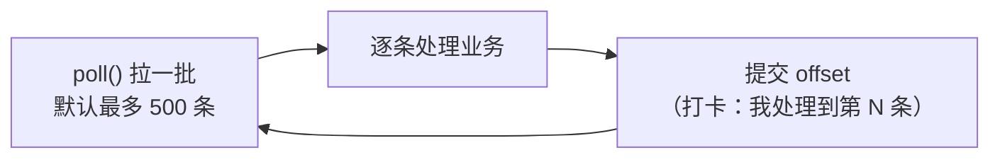
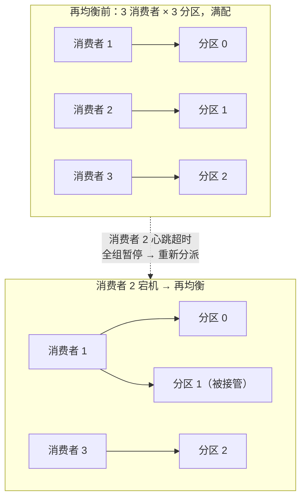
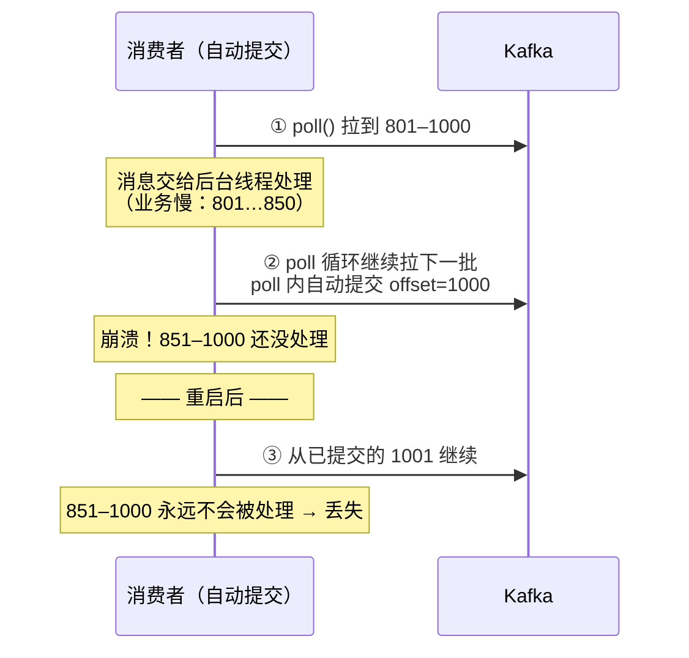
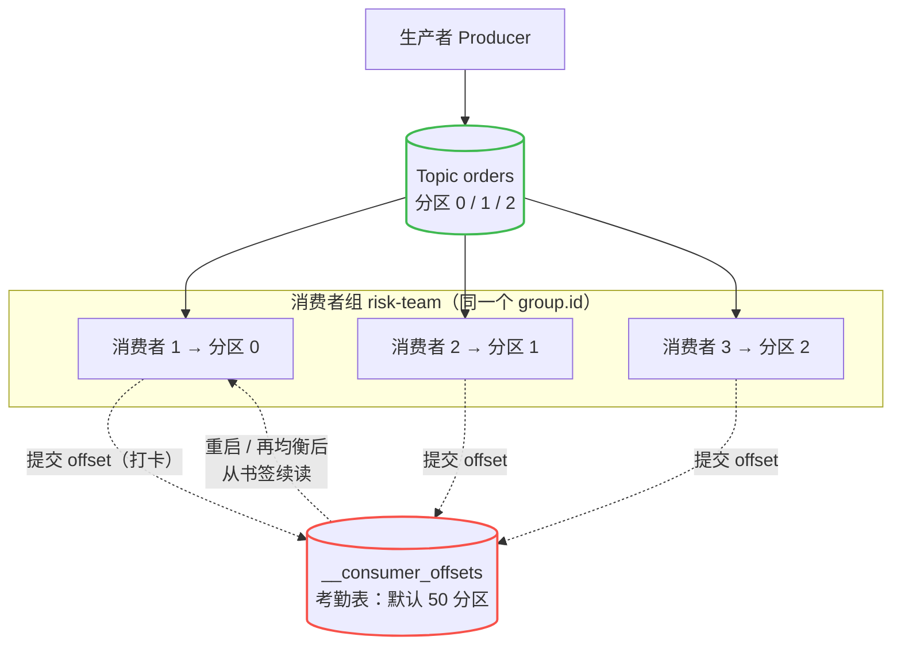

# 第 6 课：消费者与消费者组

> 所属阶段：阶段 2《Kafka 核心架构》｜ 水平：零基础 ｜ 本课知识点：消费模型与位移 offset / 消费者组与再均衡 / 位移提交与重复·丢失
> 故事情节：收货方上场——多个消费者怎么分工、怎么记住"读到哪了"、换人时怎么交接

## 🎯 本课目标

- 解释位移 offset 是什么、消费者如何沿 offset 顺序读取
- 说清消费者组如何分配分区、再均衡（rebalance）何时发生
- 解释自动/手动提交 offset 分别会带来"重复消费"还是"消息丢失"

---

## 第一幕：起源与场景引入

> 上一课我们跟完了「发货方」：一条消息怎么被生产者打包、选分区、送进 Broker。现在仓库里已经堆着订单消息了——这一课，**收货方上场**。故事里「消息的流动」终于要走出仓库、流进下游系统。

还是那家电商。`orders` 这个 Topic 里，下单服务（课 5 的生产者）每天往里写几十万条订单。现在下游有**三个团队**要读这份订单流：

- **风控团队**：每条订单都要检查一下有没有欺诈嫌疑，平时 1 个实例就够，大促要扩到 3 个；
- **积分团队**：每条订单都要给用户加积分；
- **短信团队**：每条订单都要给用户发一条确认短信。

> 🎬 **场景**：你是风控团队的负责人。消息已经进了 Kafka，但你的心里有三个没底的问题：
> 1. 消息是 Kafka 主动**推**给我的，还是我自己去**取**？我的服务怎么知道「该从哪条读起、读到哪了」？
> 2. 三个团队都要读订单，Kafka 要把消息**复制三份**吗？大促时我把风控扩到 3 个实例，会不会同一条订单被 3 个实例**各扣一次**风控？
> 3. 消费者是长期跑的服务，总要发版、重启、偶尔宕机。重启之后它怎么**接着上次的位置**继续读？换一台机器接手，怎么保证**不重不漏**？

这就是消费者（Consumer）要回答的三件事：**怎么读**（消费模型与 offset）、**怎么分工**（消费者组与再均衡）、**怎么记账**（位移提交与重复/丢失）。

---

## 第二幕：认知冲突

你可能觉得：「读消息嘛，不就是 Kafka 把数据发过来，我收着处理就行？」

三个矛盾马上冒出来：

- **谁主动？** 如果 Kafka 像「群发短信」一样把消息推给消费者——三个团队处理速度不一样：积分服务 1 秒能处理 1 万条，短信服务 1 秒只能发 100 条。推模式下，慢的那个会被活活撑死（消息堆在它内存里），快的那个却在等米下锅。**推，行不通。**
- **怎么分工？** `orders` 有 3 个分区（课 3 建的），风控现在只有 1 个实例、大促有 3 个。3 个实例面对 3 个分区，怎么分？谁认领哪个？如果 2 号实例半夜宕机了，它手里的分区谁接？接手的人**从哪条开始读**才能不重不漏？
- **进度记在哪？** 「读到哪了」这个进度（比如「分区 0 读到第 1024 条」）得记下来，重启才能续上。记在消费者自己内存里——重启就没了；记在消费者本地磁盘——换机器就没了。而且**记账的时机**很微妙：先记账再处理消息，崩溃时消息就漏了；先处理再记账，崩溃时消息就重了。**「不重」和「不漏」，看起来不可兼得？**

> ❓ **问题**：消费者需要三套机制——一套决定「谁拉、拉到哪」（消费模型 + offset），一套决定「组内怎么分分区、人变了怎么交接」（消费者组 + 再均衡），一套决定「进度怎么记、记早了记晚了各有什么后果」（位移提交）。这正是本课的三个知识点。

---

## 第三幕：层层揭示

### 知识点 1：消费模型与位移 offset

**一句话定义**：位移 offset 是分区里每条消息的编号（分区内从 0 开始、只增不减），消费者用「拉取 + 记住 offset」的方式按顺序消费。

#### 直觉建立（类比）

Kafka 是「**快递柜**」，不是「送货上门」：消息放进去，**消费者自己去取**（拉模式，pull），想一次取多少、多久取一次，都由消费者自己的节奏决定——短信服务再慢，也只是柜子里的件多放一会儿，不会被撑死。

那「读到哪了」呢？把每个分区想成一本**只往后写、从不撕页的流水账**，offset 就是**行号**：第 0 行、第 1 行、第 2 行……读者（消费者）在账本上夹一张**书签**：「我读到第 1024 行了」。下次翻开来，从 1025 行接着读。

> 💡 **类比的边界**：真实书的书签夹在书里、跟着书走；Kafka 的「书签」**跟着读者走，不跟着账本走**——风控的读者夹在 1024 行，积分的读者可以夹在 900 行，各夹各的（这正是知识点 2 的伏笔）。另外这本账本还在**不停往后长**（生产者一直在写），书签和账本末尾的差距，就叫**积压（lag）**。

#### 概念与原理

消费者是**拉模式**：它跑在一个循环里，主动到 Broker「拉一批、处理完、再拉一批」：



关键点：

1. **poll 拉取**：消费者调 `poll()` 向 Broker 要一批消息（默认单次最多 `max.poll.records=500` 条，核查于 2026-08）。**什么时候拉、拉多少，消费者说了算**——这就是拉模式的本质，消费速率由下游自己掌控。
2. **offset 是「分区级」编号**：还记得课 4 画过的分区内部结构吗？每个分区就是一条独立的日志，offset 在**分区内**从 0 单调递增、永不重复。**分区间互不相干**——分区 0 的第 5 条和分区 1 的第 5 条，是两条不相干的消息。
3. **书签有两个含义，别混淆**：消息的 offset（它排在第几位）是「客观位置」；消费者**提交的 offset**（我处理到哪了）是「主观进度」。后面所有「重复/丢失」的坑，都是「主观进度」和「客观处理」对不上造成的。

> 💡 **看一眼积压（lag）**：账本末尾的位置叫**末端位移（LOG-END-OFFSET）**，书签位置叫**当前位移（CURRENT-OFFSET）**，两者之差就是积压 lag——「柜子里还有多少件没人取」。实操环节我们会用命令亲眼看这三个数。

#### 一句话记住

**消费者是拉模式：poll 拉一批 → 处理 → 提交 offset（打卡），循环往复；offset 是分区内的行号，书签跟着消费者组走，不跟消息走。**

---

### 知识点 2：消费者组与再均衡

**一句话定义**：同一个 `group.id` 的消费者组成一个「消费者组」——组内每个分区同一时刻只归一个消费者消费（分工不重复），组与组之间各自独立拿到全量消息（互不影响）；成员或分区数一变，Kafka 就触发「再均衡」重新分派。

#### 直觉建立（类比）

消费者组 = 一个「**取货小组**」：

- **组内分工**：小组认领了仓库里的 3 条传送带（3 个分区），3 个组员（消费者）一人一条——**一条传送带同一时刻只归一个组员**，绝不可能两个人站同一条带子上抢件（所以组内不会重复消费）。人少带子多？一个人可以看多条带。
- **组间互不干扰**：风控小组、积分小组、短信小组是**三个不同的组**，每个组都各自把全部 3 条传送带取一遍——同一条件，风控取了一次、积分也取了一次，天经地义（这正是「一份消息、多方消费」不需要复制三份数据的原因）。
- **换班重排**：2 号组员请假了（宕机）、大促招了个新人（扩容）、仓库新加了一条传送带（分区扩容）——组长就要**重新分派**谁看哪条带。这个重新分派，就叫**再均衡（rebalance）**。

> 💡 **类比的边界**：真实换班可以「边干边交接」；但在经典协议下，Kafka 的再均衡是**全组先停一拍**——所有组员放下手里的传送带，等重新分完派再开干（学名叫 stop-the-world）。Kafka 4.0 的新协议把它改成了「只调整受影响的人」，后面原理部分细说。

#### 概念与原理

**1. 组的本质是一条规则**：一个 `group.id` 字符串就是一个组。规则只有一条——**组内，一个分区同一时刻只能被一个消费者消费**。这条规则直接回答了场景里的第 2 问：

| 人数 vs 分区数 | 局面 |
|--------------|------|
| 消费者 1 个，分区 3 个 | 一个人看 3 条带（并行度 = 1） |
| 消费者 3 个，分区 3 个 | 一人一条，满配（并行度 = 3） |
| 消费者 5 个，分区 3 个 | **3 个干活，2 个闲着**（并行度上限 = 分区数） |

> 💡 这正是课 4 课后小测考过的结论：**并行消费上限 = 分区数**。想更快？加分区，不是无脑加消费者。而「三个团队各拿全量」怎么办？——三个团队用**三个不同的 `group.id`**，天然各拿各的全量，Kafka 一份数据都不用复制。

**2. 再均衡什么时候发生？** 三种触发：

- **有成员变化**：新消费者加入（扩容）、消费者主动退出（发版下线）、消费者被判定死亡（心跳超时）；
- **分区数变化**：订阅的 Topic 加了分区；
- （心跳机制：消费者每 3 秒发一次心跳 `heartbeat.interval.ms=3000`，超过 `session.timeout.ms`（Kafka 3.0 起默认 45000ms）没收到心跳，协调者就认定它死了，触发再均衡；核查于 2026-08。另有一个隐蔽杀手 `max.poll.interval.ms` 默认 5 分钟——**一批消息处理太久、两次 poll 间隔超时**，消费者也会被踢出组，这是生产环境「莫名其妙再均衡」的头号原因。）



**3. 再均衡的代价与 4.0 的进化**：经典（classic）协议下，再均衡是**全组 stop-the-world**——期间整个组停止消费，组越大、触发越频繁，抖动越明显。**Kafka 4.0 起新一代再均衡协议（KIP-848）正式可用（GA）**：服务端默认已启用新协议能力，客户端需显式设置 `group.protocol=consumer` 才真正用上；新协议改为**增量式**再均衡——只迁移受影响的分区，不再全组踩刹车，且分区分配逻辑从消费者上移到了 Broker 端（核查于 2026-08）。

#### 一句话记住

**组内一分区一消费者（不重复），组间各自全量（互不影响）；人数一变就再均衡——经典协议全组踩刹车，人数别超过分区数，扩容前先想清楚。**

---

### 知识点 3：位移提交与重复/丢失

**一句话定义**：位移提交就是消费者向 Kafka 打卡「我处理到第 N 条了」，进度存在 Kafka 的内部主题 `__consumer_offsets` 里；打卡发生在「处理之前」会丢消息，发生在「处理之后」会重复消息——Kafka 的默认姿势是宁可重复、不可丢失，重复交给业务幂等去兜底。

#### 直觉建立（类比）

「书签」不能只夹在消费者脑子里（重启就没了），得**写进一张公共考勤表**——Kafka 替你保管这张表（内部主题 `__consumer_offsets`），换机器、重启都不丢。

但**什么时候往考勤表上写**，是一门玄学：

- **自动打卡机**（自动提交）：每 5 秒自动写一笔「当前读到的位置」。坑在——**打卡机不懂业务**！它记的是「读到了哪」，不是「处理完了哪」。
- **先打卡再干活**：拉到一批，先写考勤表再处理。中途崩溃？重启后从打卡处继续——干到一半的活**丢了**。
- **干完活再打卡**：处理完一批再写考勤表。中途崩溃？重启后从上次打卡处继续——已经干完但没来得及打卡的那部分，**重干一遍**。

> 💡 **类比的边界**：「重复」听起来是坏事，但对绝大多数业务，**重复是可以兜底的**（同一条订单的风控检查做两遍，结果一样——这叫幂等，阶段 3 细讲），而「丢失」兜不回来（欺诈订单漏检就是事故）。所以工程上的选择几乎一边倒：**宁可重复，不可丢失**。

#### 概念与原理

**1. 考勤表长什么样？** 消费者提交的位移，以普通消息的形式写进 Kafka 的内部主题 **`__consumer_offsets`**：默认 50 个分区、副本因子 3，采用日志压缩（compact）清理——每组（group）、每个主题、每个分区只保留最新一条「打卡记录」（核查于 2026-08）。第一次有消费者提交时它会自动创建，你不用管。

**2. 自动提交（默认开启）**：`enable.auto.commit=true`（默认）+ `auto.commit.interval.ms=5000`（默认，核查于 2026-08）。机制：消费者**每次调 poll() 时**检查距离上次提交是否超过 5 秒，超过了就把「**上一次 poll 拉到的最大 offset**」提交上去——**打卡的是「读到了哪」，不是「处理完了哪」**。只要「拉取」跑到了「处理」前面（最典型：消息拉回来交给后台线程慢慢处理，poll 循环继续往前拉），打卡点就可能越过还没处理完的消息，丢失窗口就此打开：



**3. 手动提交（生产推荐）**：`enable.auto.commit=false`，处理完一批后自己调 `commitSync()`（同步提交，失败自动重试，稳妥但慢）或 `commitAsync()`（异步提交，快但失败不重试）。「处理完再提交」的代价是**重复窗口**：处理完 801–1000、还没来得及提交就崩溃，重启后从 801 重新拉——这 200 条**重干一遍**。重复的业务代价，交给幂等设计兜底。

**4. 找不到书签怎么办？（`auto.offset.reset`）** 一个新组第一次上线、从没提交过位移，或者老位移已被清理——Kafka 得知道从哪开始读：

| 取值 | 行为 | 适合 |
|------|------|------|
| `latest`（**默认**） | 从最新一条之后开始，历史消息全部跳过 | 只关心「从现在起」的流 |
| `earliest` | 从头开始，读全部历史 | 新组要补历史数据 |
| `none` | 直接报错，逼你显式决定 | 关键链路，拒绝「默默出错」 |

> ⚠️ 新手大坑：第一次上线的消费组用默认 `latest`，上线前积压的几万条历史消息会被**静默跳过**——很多人以为「消费不到消息是 bug」，其实是书签从末尾开始。（Kafka 4.0 还新增了 `by_duration`，比如从 1 小时前的位置开始读，属于进阶选项，核查于 2026-08。）

#### 一句话记住

**提交 = 往 `__consumer_offsets` 打卡；自动提交按「读到了哪」打卡（有丢失窗口），手动提交按「处理完了哪」打卡（有重复窗口）；生产姿势：手动干完再提交 + 业务幂等兜底。**

---

## 第四幕：实操验证

> 我们用课 3 起的真集群，亲手验证三件事：**书签跟着组走**、**每个组各拿全量**、**亲眼看到 lag**。先确认容器在跑（`docker ps` 能看到 kafka），`orders` 是 3 分区（课 3/课 5 建过）。

**第 1 步：组内消费 + 书签记忆。** 用 `--group` 给消费者一个组名，先从头读一遍（`--from-beginning` 只对「没有书签的新组」生效，相当于把 `auto.offset.reset` 设成 `earliest`）：

```bash
docker exec -it kafka /opt/kafka/bin/kafka-console-consumer.sh \
  --topic orders --from-beginning --group risk-team \
  --bootstrap-server localhost:9092
```

会看到 `orders` 里全部历史消息（课 3 和课 5 你亲手发过的那些）。`Ctrl+C` 停掉，**再跑一次同样的命令但去掉 `--from-beginning`**：

```bash
docker exec -it kafka /opt/kafka/bin/kafka-console-consumer.sh \
  --topic orders --group risk-team \
  --bootstrap-server localhost:9092
```

**一条消息都不会输出**——因为 risk-team 的书签已经夹在末尾了。此时另开一个终端用课 5 的生产者发几条新消息，这边立刻能收到。

**第 2 步：换个组，全量重读。** 换一个新的组名（模拟积分团队）：

```bash
docker exec -it kafka /opt/kafka/bin/kafka-console-consumer.sh \
  --topic orders --from-beginning --group points-team \
  --bootstrap-server localhost:9092
```

同样的历史消息**又全部输出一遍**——points-team 是新组、新书签，从头开始读。**一份数据，两个组各读各的，互不干扰。**

**第 3 步：亲眼看「考勤表」。** 用管理脚本查看 risk-team 的进度（先 `Ctrl+C` 停掉消费者再执行）：

```bash
docker exec -it kafka /opt/kafka/bin/kafka-consumer-groups.sh \
  --describe --group risk-team \
  --bootstrap-server localhost:9092
```

预期输出大致是（offset 数字以你实际发过的条数为准，**关键看三列的关系**）：

```
GROUP      TOPIC   PARTITION  CURRENT-OFFSET  LOG-END-OFFSET  LAG  ...
risk-team  orders  0          4               4               0
risk-team  orders  1          6               6               0
risk-team  orders  2          2               2               0
```

- **CURRENT-OFFSET**：书签（打卡位置）；**LOG-END-OFFSET**：账本末尾；**LAG**：两者之差（积压）。
- 现在再发几条消息**先不消费**，重新执行上面的命令：LOG-END 涨了、LAG 变成正数——「柜子里的件没人取」；再启动一次 risk-team 的消费者消化掉，LAG 归零。

> ✅ **回扣场景**：风控、积分、短信三个团队 = 三个 `group.id`，一份订单流各拿各的全量（第 2 步验证）；风控重启后从书签续读、不重不漏（第 1 步验证）；「我们落后了多少」不用猜，LAG 一眼可见（第 3 步验证）。大促扩 3 个实例？`orders` 正好 3 分区，满配——再多加实例就是闲着。

---

## 第五幕：体系收束

> 📍 **全局定位**：故事主线「消息的流动」，到这一课走完了核心闭环——**存**（课 4：Topic/Partition/Broker 的存储骨架）、**进**（课 5：生产者的发送/分区/acks）、**出**（课 6：消费者的拉取/分工/记账）。一个「物流系统」的三大件齐了。
> 🔗 **下一步**：本课留下的「重复 vs 丢失」只是**消费者侧记账**的取舍。还有一个更根本的问题没回答：如果 **Broker 本身**挂了呢？磁盘上的消息安全吗？下一阶段《可靠性与高可用》先讲**副本与 ISR**（课 7：消息存三份、leader 挂了 follower 顶上），再用**交付语义**（课 8：at-most-once / at-least-once / exactly-once）把「重复与丢失」的终极答案收掉。

---

## 🐞 常见误区

1. **「每个消费者实例都能收到全量消息」**：错。**组内**一个分区只归一个消费者，超出分区数的实例在闲着。要「各拿全量」，靠的是**不同的组**（不同 `group.id`），不是往一个组里加实例。
2. **「消费者越多消费越快」**：并行度上限 = 分区数。5 个消费者配 3 个分区，2 个纯属浪费。想更快，先加分区。
3. **「自动提交省心又安全」**：错。自动提交打卡的是「读到了哪」，不是「处理完了哪」——崩溃时未处理的消息会被跳过，**丢失窗口**是默认行为的一部分。
4. **「offset 存在消费者本地」**：错。提交的位移存在 Kafka 的内部主题 `__consumer_offsets` 里（默认 50 分区、log compact 清理），换机器、重启都不丢。
5. **「再均衡没什么成本」**：经典协议下再均衡是全组 stop-the-world；一批消息处理太久（超过 `max.poll.interval.ms`）还会被误判死亡踢出组，触发连锁再均衡——生产环境消费抖动的常见元凶。

## 📚 官方文档

- [Kafka 消费者配置](https://kafka.apache.org/documentation/#consumerconfigs)：`enable.auto.commit`、`auto.offset.reset`、`session.timeout.ms` 等参数完整参考
- [Kafka 消费者再均衡协议（4.0+）](https://kafka.apache.org/43/operations/consumer-rebalance-protocol)：KIP-848 新一代再均衡协议的官方说明

## 一图总结



> 读法：**组内**三消费者各认领一个分区（不重复）；打卡进度统一进 `__consumer_offsets`（不丢）；换人、重启、再均衡后都从书签续读。**组间**（points-team、sms-team 未画出）各自独立重复这套流程。

## 课后小测

**Q1**：风控团队和积分团队分别用 `group.id=risk-team` 和 `group.id=points-team` 订阅同一个 `orders`（3 分区）。关于一条订单消息的投递，正确的是？
- A. 这条消息只会被 risk-team 或 points-team 其中一个组收到
- B. 两个组各自都能收到这条消息，且各自的消费进度（书签）互不影响
- C. 两个组会分别收到这条消息的一半
- D. 后启动的组会抢走先启动的组的消息

<details><summary>答案与解析</summary>

**答案：B**。「组内分工、组间广播」：同一条消息，risk-team 组内只被一个消费者处理一次，points-team 也组内处理一次——每个组独立拿到全量、独立记账。A/C/D 都把「组」当成了互斥的竞争单位，竞争只发生在**组内**的消费者之间。

</details>

**Q2**：`orders` 有 3 个分区，风控团队启动了 5 个消费者实例（同一 `group.id`）。有几个实例在真正消费？
- A. 5 个
- B. 3 个
- C. 2 个
- D. 0 个

<details><summary>答案与解析</summary>

**答案：B**。组内规则：一个分区同一时刻只归一个消费者，所以 3 个分区最多「喂饱」3 个消费者，剩下 2 个实例闲置。想提高并行度，先加分区（并想清楚课 5 讲过的 key 路由影响），不是无脑加实例。

</details>

**Q3**：某消费者使用默认自动提交。`poll()` 拉到 offset 801–1000 共 200 条后交给后台线程处理，自己继续 `poll()` 下一批（此时自动提交了 offset=1000）。后台线程处理到第 850 条时进程崩溃。重启后它会从哪里开始读？最可能的后果是？
- A. 从 801 开始，未处理的 150 条被重复处理
- B. 从 1001 开始，851–1000 这 150 条被跳过，造成消息丢失
- C. 从 851 开始，恰好无缝衔接
- D. 从 0 开始，全部重新消费

<details><summary>答案与解析</summary>

**答案：B**。自动提交打卡的是「**poll 拉到的位置**」（1000），不是「**处理进度**」（850）。崩溃前 1000 已被打上卡，重启后从 1001 继续，851–1000 永远不会被处理——这正是自动提交的**丢失窗口**（拉取领先于处理时才会出现）。生产环境的推荐姿势是「手动、处理完再提交」，把丢失窗口换成重复窗口，交给幂等兜底。

</details>

## 🚀 下一批接力提示词

> 🎉 **本阶段完成**：阶段 2《Kafka 核心架构》的 4 课全部学完——你已经能本地起真集群、说清存储模型（Topic/Partition/Broker）、讲透发货方（Producer）与收货方（Consumer），核心架构闭环达成。可以先做一轮课 4–6 的小测自检，再进入阶段 3《可靠性与高可用》。
> 学完本课后，**复制下面这段文字发给 AI**，即可无缝进入下一批（无需重新描述上下文）：

```
继续学 Kafka。我的学习档案在 kafka-basics/00-学习档案.md，
刚学完阶段 2《Kafka 核心架构》的课《消费者与消费者组》知识点 消费模型与位移offset、消费者组与再均衡、位移提交与重复/丢失，
请按大纲继续讲解下一批知识点（阶段 3 课7：副本机制与故障转移）。
```

## 🧭 课程导航

⬅️ **上一课**：[课 5：生产者 Producer](lesson-05-生产者Producer.md)

➡️ **下一课**：[课 7：副本机制与故障转移](../../3-可靠性与高可用/lessons/lesson-07-副本机制与故障转移.md)

📚 **返回目录**：[课程目录](../../../02-课程目录.md)
