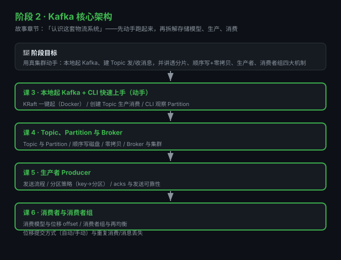

# 阶段 2：Kafka 核心架构

> 所属课程：Kafka 系统学习 ｜ 故事章节：「认识这套物流系统」 ｜ 上一阶段：[阶段 1](../1-为什么需要Kafka/overview.md)

## 🎯 本阶段目标

- 用真集群动手：本地起 Kafka（KRaft）、建 Topic、发/收消息、观察分区
- 说清 Topic / Partition / Broker 的存储模型，讲透顺序写 + 零拷贝的高吞吐原理
- 讲透生产者（发送流程/分区策略/acks）与消费者组（offset/再均衡/位移提交）

## 📍 学习重点

- **动手先行**：第 3 课先把 Kafka 跑起来，后面每个概念都能用真命令验证
- **分片即并行**：Partition 是 Kafka 并行与扩展的基石
- **高吞吐原理**：顺序写磁盘 + 零拷贝，打破"磁盘慢"的直觉
- **消费位移是命门**：offset 提交方式直接决定"重复消费"还是"消息丢失"

## ✅ 必须掌握的知识点

| 知识点 | 所属课 | 学完应能 |
|--------|--------|----------|
| KRaft 一键起（Docker） | 课3 | 本地起一个单节点 Kafka |
| 创建 Topic + 生产消费 | 课3 | 建通道、发一条、收一条 |
| CLI 观察 Partition | 课3 | 用 `--describe` 看分区 |
| Topic 与 Partition | 课4 | 解释分片模型与 offset 结构 |
| 顺序写磁盘 | 课4 | 解释为什么比随机写快 |
| 零拷贝 | 课4 | 说清数据如何从磁盘直达网卡 |
| Broker 与集群 | 课4 | 说清 Broker 角色与集群形态 |
| 生产者发送流程 | 课5 | 画出一条消息的发送路径 |
| 分区策略 | 课5 | 解释 key 如何影响分区 |
| acks 与可靠性 | 课5 | 说出 acks=0/1/all 的取舍 |
| 消费模型与 offset | 课6 | 解释 offset 是什么、怎么动 |
| 消费者组与再均衡 | 课6 | 说清组内如何分配分区 |
| 位移提交与重复/丢失 | 课6 | 解释自动/手动提交的坑 |

## 🗺️ 本阶段路径图

## 本阶段产出

- [x] `lessons/lesson-03-本地起Kafka与CLI快速上手.md`
- [x] `lessons/lesson-04-Topic、Partition与Broker.md`
- [ ] `lessons/lesson-05-生产者Producer.md`
- [ ] `lessons/lesson-06-消费者与消费者组.md`
