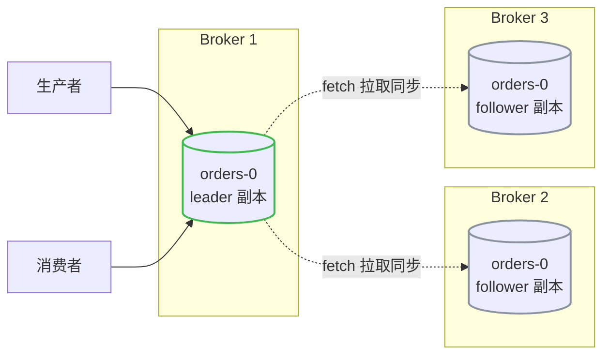
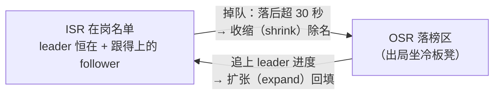
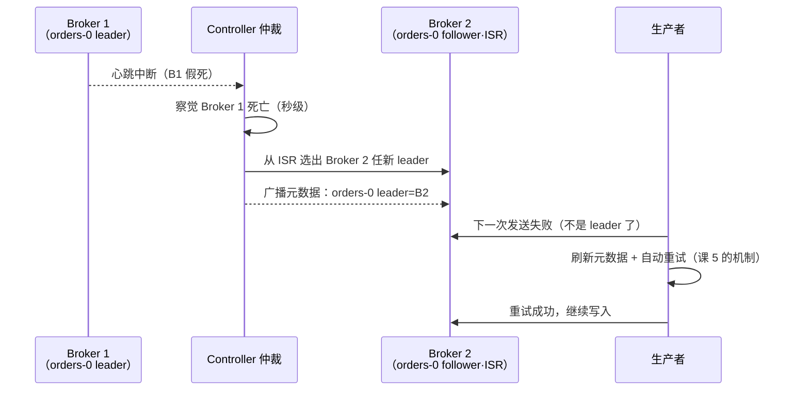
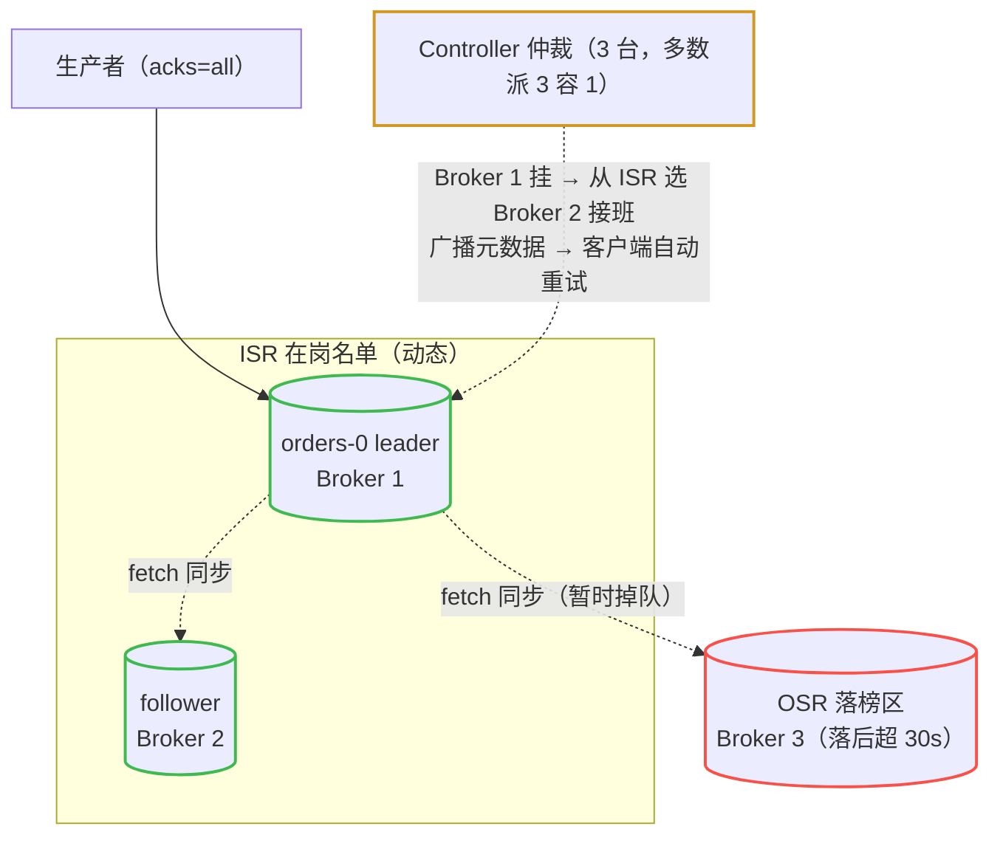

# 第 7 课：副本机制与故障转移

> 所属阶段：阶段 3《可靠性与高可用》｜ 水平：零基础 ｜ 本课知识点：副本与 leader/follower / ISR 机制 / 控制器选举与故障转移
> 故事情节：仓库着火了——主角怎么保证货不丢、换仓库时无缝衔接

## 🎯 本课目标

- 解释副本 replica 与 leader/follower 的读写分工
- 讲清 ISR（In-Sync Replicas）是什么、缩容/扩容的边界与丢消息风险
- 说清控制器 Controller 如何选举、leader 故障后如何转移

---

## 第一幕：起源与场景引入

> 上一课收尾时留了一个悬念：我们把消息的「进」（生产者）和「出」（消费者）都讲透了，但整套故事一直建立在一个没人质疑的假设上——**仓库（Broker）永远健在**。这一课，这个假设塌了。

时间来到**双十一前夜**。风控、积分、短信三个团队都跑在课 6 的消费链路上，`orders` 里的消息川流不息。凌晨两点，运维群炸了：**那台跑了半个月的 Kafka 容器所在的宿主机，没了动静**。所有的生产者连接超时，所有的消费者无消息可拉——整个订单链路，停摆。

你是被电话叫醒的架构负责人。复盘会上，所有人盯着三个问题：

> 🎬 **场景**：
> 1. `orders` 的消息在磁盘上**只有一份**（别惊讶，课 3 我们就是这么建的）。如果这次不是机器假死，而是**磁盘真的烧了**，几十万条订单怎么办？要怎么存，才敢说「货不丢」？
> 2. 听说生产环境的正确姿势是「**一份消息存三份**」。三台机器各存一份——那写入听谁的？三份各写各的，账本不就乱了吗？
> 3. 就算存了三份，万一**存「正本」的那台挂了**，另外两份谁接班？接班的那个要是**还没抄到最新几条**，已经确认过的消息去哪了？

这就是本课三个知识点要回答的三件事：**怎么存**（副本与 leader/follower）、**谁有资格接班**（ISR 机制）、**谁主持交接**（控制器选举与故障转移）。

---

## 第二幕：认知冲突

面对「机器挂了」这件事，你的直觉可能接连撞墙：

- **冲突一：「存三份 = 做三次备份」**。说到多存几份，你想到的是「定期备份」——每天凌晨导出一份存到别处。但备份是**冷的**：从备份恢复要小时级，双十一等不起；而且备份恢复前，服务一直瘫着。Kafka 要的是**秒级无缝接班**——挂一台，另外两台里立刻有一台顶上，客户毫无感知。这不是备份，是**随时待命的影子仓库**。可「实时同步的三份」又引出冲突二。
- **冲突二：「三台机器都能读写，顺便负载均衡？」**。听起来很美：三台机器分担流量。但想想课 4 的承诺——**分区内消息有序**，offset 由 Kafka 统一编号。如果三台机器同时接受写入，每台各自编号，那「分区 0 的第 100 条」到底是哪条？顺序性直接崩塌。**多写者 = 顺序没了**。
- **冲突三：「leader 挂了，公平竞选，谁快谁上」**。很民主，但很危险：如果上台的是个**落后了两百条没抄完**的副本，它当上正本的那一刻，账本「倒退」回两百条之前——生产者已经收到「写入成功」的那两百条消息，**凭空消失**。挂一台机器只是不可用，选错接班人却是**丢数据**，后者严重得多。那怎么判断「谁有资格」？谁来判断「leader 真挂了」？主持选举的这位「裁判」自己挂了又怎么办？

> ❓ **问题**：一次安全的故障转移，需要三套配套机制——一套决定「数据怎么冗余、谁说了算」（副本 + 单 leader），一套维护「有资格接班的名单」（ISR），一套负责「发现死亡 + 主持选举 + 通知全员」（控制器 + 仲裁）。

---

## 第三幕：层层揭示

### 知识点 1：副本与 leader/follower

**一句话定义**：副本（replica）是同一个分区在多个不同 Broker 上的拷贝，份数由副本因子（replication factor，RF）决定；每个分区任意时刻只有一个 leader 副本对外提供读写，其余 follower 副本只做一件事——从 leader 同步数据。

#### 直觉建立（类比）

把课 4 的「订单流水账」升级：同一个分区的账本，现在有 **3 本内容完全相同的账**，分别锁在 **3 个仓库**（Broker）的保险柜里。其中 **1 本是正本（leader）**，另外 2 本是**誊抄本（follower）**：

- 所有顾客——不管存订单（生产者）还是查订单（消费者）——**只跟正本打交道**。正本统一记账、统一编号，分区内的顺序永远只有一个权威版本。
- 誊抄本不接待顾客。每个誊抄学徒**主动跑到正本那里**，把新写的内容一页页抄回来。

> 💡 **类比的边界**：注意「主动跑过去抄」这个细节——follower 同步用的是 **fetch 拉取**，和课 6 的消费者一模一样！事实上 Kafka 内部就是这么实现的：**follower 就是一个特殊的「消费者」**，反复向 leader 发 fetch 请求要新数据。另外，誊抄本和「备份档案」有本质区别：备份是冷的、恢复以小时计；誊抄本是**热的**，秒级就能转正接班。**副本不是备份，是实时同步的冗余。**

#### 概念与原理



关键规则：

1. **RF 是分区级属性**：建 Topic 时指定 `--replication-factor 3`，意思是「每个分区 3 个副本」。Kafka 保证同一分区的多个副本**必须落在不同 Broker 上**——同一台机器存两份毫无容灾意义（机器一挂两份一起没）。这也解释了实操里会亲眼看到的报错：单 Broker 集群建不了 RF=3 的 Topic。
2. **读写都走 leader**：这是**单 leader 模型**。为什么不做「三台分担读写」？因为顺序。分区内的 offset 必须由唯一权威（leader）统一编号，多处可写 = 编号分裂 = 课 4 的顺序性承诺作废。（Kafka 新版本支持部分场景下消费者就近读 follower 的优化，属于进阶话题，初学阶段记住「读写找 leader」即可。）
3. **follower 的日常就是抄账**：不停地 fetch。抄账的进度，决定了它在下一个知识点里的「资格」。
4. **RF=1 意味着裸奔**：我们课 3 建的 `orders` 就是 RF=1。Broker 挂 → 分区不可用（数据还在磁盘上，但读不了写不了——**「不丢」和「可用」是两回事**）；磁盘坏 → 数据真丢。副本同时解决这两件事。

#### 一句话记住

**副本 = 同一分区抄在多台 Broker 上的热账本；正本（leader）统一记账、统一接待读写，学徒（follower）自己跑来抄——副本是实时同步的冗余，不是备份。**

---

### 知识点 2：ISR 机制

**一句话定义**：ISR（In-Sync Replicas，同步副本集合）是「跟得上 leader 的副本」名单——leader 自己，加上落后不超过 `replica.lag.time.max.ms`（默认 30 秒）的 follower；只有 ISR 成员有资格在新 leader 选举中上位。

#### 直觉建立（类比）

仓库联盟有个「**随时可顶班的在岗名单**」：

- 誊抄学徒平时表现合格（跟得上正本），名字就在名单上；
- 某学徒抄账掉队——超过 **30 秒**没跟上正本进度（网络抖、磁盘慢、机器卡）——立即**除名**（ISR **收缩** shrink）；
- 他恢复状态、重新抄齐了进度，名字**自动回填**（ISR **扩张** expand）。

这份名单是**动态**的，不是终身制。它的唯一用途就一句话：**正本出事时，接班人只从这份名单里选**——名单上的人抄齐了最新账目，上位后一条不多、一条不少。

> 💡 **类比的边界**：名单不是「多数派」。它只问「跟没跟上」，不问「人数过半」——ISR 完全可能只剩 leader 自己 1 个人（其他都被踢了），此时集群依然在跑，只是风险拉满。真正的「多数派投票」出现在知识点 3 的控制器仲裁里，两套规则别混。

#### 概念与原理

**1. 全家福：AR = ISR + OSR。** 一个分区的全部副本叫 AR（Assigned Replicas）；其中跟得上的叫 ISR，被踢出去落后的叫 OSR（Out-of-Sync Replicas）。学徒在两个集合间动态流动：



**2. ISR 与 acks=all 的联动（回扣课 5！）** 课 5 说 `acks=all` 时「等所有副本确认」——现在给出精确版：**等的是「当前 ISR 里所有成员」确认**，不是全部副本。这就有个隐蔽的退化：两个 follower 都被踢出 ISR 后，ISR 只剩 leader 自己，此时 `acks=all` 实际等到的只有 1 份确认——**配置还是 all，保障却缩水成了 1**。

**3. min.insync.replicas：给 ISR 上熔断。** 为了堵住上面的退化，Kafka 提供了「最小同步副本数」（默认 1）：**acks=all 的写入，若 ISR 人数低于这个下限，直接报错拒绝（NotEnoughReplicas）**。宁可让写入失败、让业务方立刻知道「现在不安全」，也不默默接受一份「虚假的安心」。

| 配置组合 | 行为 | 适用 |
|---------|------|------|
| RF=3 + min.insync.replicas=1 + acks=all | ISR 剩 1 个也照常写入 | 性能优先，有丢数据风险 |
| **RF=3 + min.insync.replicas=2 + acks=all** | **挂 1 台：照常写；挂 2 台：拒绝写** | **业界黄金组合（推荐）** |
| RF=3 + min.insync.replicas=3 + acks=all | 任何 1 台慢/挂都阻塞写入 | 极端保守，可用性差 |

**4. 极端情况：ISR 全军覆没。** leader 挂时 ISR 里已没有活着的人，Kafka 面临抉择：

- `unclean.leader.election.enable=false`（**默认**）：宁可分区暂时不可用，也不让落后的 OSR 上位——**保数据不保可用**；
- 设为 `true`：允许 OSR 里的「落榜生」紧急上位，分区恢复可用——但**已确认的消息可能丢失**（新 leader 没抄到的那几条，连同旧 leader 一起消失了）。

这是 CAP 取舍最赤裸的开关：**大多数业务（订单、支付）选默认 false；只有「日志、监控指标」这类丢了能重采的数据，才敢开 true**。

> 💡 **进阶小注**：follower 抄得慢，还会拖慢消息的「可见时间」——消费者只能读到**已被 ISR 全体同步**的消息（这条分界线叫高水位 High Watermark）。所以 ISR 抖动不仅关系容灾，也关系消费延迟，进阶话题，混个脸熟即可。

#### 一句话记住

**ISR = 「跟得上的在岗名单」（leader 恒在，30 秒跟不上就除名，追上就回填）；接班只从名单里选；配 min.insync.replicas=2 给名单上熔断，防止 acks=all 静默退化成「等 1 个」。**

---

### 知识点 3：控制器选举与故障转移

**一句话定义**：控制器（Controller）是集群的「总管」，负责发现 Broker 死亡、主持分区 leader 选举并广播元数据；KRaft 模式下控制器是一组节点组成的仲裁（quorum），按 Raft 多数派规则运转，其中一台为 active controller 主事。

#### 直觉建立（类比）

消防队长和他的**值班室**：

- 集群出事（Broker 挂）时，总要有人**第一个发现**、**主持交接**、**通知所有人**——这就是队长（active controller）的活；
- 队长不是终身制也不是独苗：**3 个队长组成值班室**，靠**多数派表决**处理事务（写元数据、做决策），任意时刻 1 个人主事，另外 2 个随时热备；
- 死 1 个队长：剩下 2:1 仍能过半，值班室正常运转，秒级选出新主事人。

> 💡 **类比的边界**：值班室的「多数派」和知识点 2 的 ISR「名单」是**两套不同的规则**——ISR 只看「跟没跟上」（可以只剩 1 人）；值班室必须「票数过半」（3 人死 1 个剩 2 个还行，死 2 个剩 1 个就瘫痪）。为什么？因为值班室管的是**决策**（元数据日志的提交），决策最怕「两个队长同时说了算」（脑裂），多数派从数学上杜绝了这一点。

#### 概念与原理

**1. Controller 的前世今生。** 老版本里，Kafka 依赖外部的 ZooKeeper 存元数据、选 controller（课 2 提过这段历史）。**Kafka 4.0 起 ZooKeeper 被彻底移除**，元数据本身变成一条 Raft 复制日志（`__cluster_metadata`），由 controller 仲裁自己管理——这就是课 3 见过的 **KRaft**。我们跑的单容器就是 combined 模式（broker + controller 同进程），官方定位是「开发环境专用」；生产环境要求至少 **3 个 controller**（多数派容错：**3 容 1、5 容 2，规则是 2f+1 容 f**）。

**2. 故障转移（failover）全流程。** 双十一那晚，如果订单集群是 3 Broker + 3 Controller 的生产配置，宿主机 1 假死时会发生什么：



拆开看五步：

1. **发现**：Broker 定期向 controller 心跳续约，心跳断了，controller 在秒级内把它「拉黑」（fence）；
2. **选主**：controller 从每个受影响分区的 **ISR** 里指定新 leader（知识点 2 的名单在此刻生效）；
3. **广播**：新 leader 信息写入元数据日志（Raft 多数派确认后生效），全集群可见；
4. **客户端自愈**：生产者下一批消息会收到「你不是 leader / 副本不可用」类的可重试错误，随即**自动刷新元数据、重试**——正是课 5 讲过的 retries 机制在兜底；消费者同样自动切换，无需任何人工干预；
5. **老将归队**：宿主机 1 修复后，Broker 1 回归，先以 follower 身份追进度，追齐后重新进入 ISR；配合默认开启的 leader 自动均衡，leader 角色还会逐步迁回，避免长期倾斜。

**3. Controller 自己挂了怎么办？** 其余 controller 按多数派在秒级内选出新 active controller。期间的微妙差别值得知道：**数据面（正常的读写收发）基本不受影响**——分区 leader 都还活着；暂时受阻的是**元数据操作**（建 Topic、再选 leader 这类「管理层」动作）。这也是为什么生产环境 controller 一定部署 3 台起步：值班室必须永远有多数派在场。

#### 一句话记住

**Controller 是主持交接的消防队长；KRaft 时代队长是一组人（quorum），多数派表决、3 容 1；Broker 挂 → 心跳断 → 从 ISR 选新 leader → 广播 → 客户端自动刷新元数据重试——全程无人值守，秒级完成。**

---

## 第四幕：实操验证

> 我们的单容器集群是 RF=1 + 1 controller 的「裸奔配置」——这恰好是绝佳的教具：先看清裸奔的现状，再亲手放一场「火」，体会没有副本的世界有多脆弱。老规矩，先确认容器在跑（`docker ps` 能看到 kafka）。

**第 1 步：看清现状——我们一直是 RF=1。** 查看课 3 建的 `orders`：

```bash
docker exec -it kafka /opt/kafka/bin/kafka-topics.sh \
  --describe --topic orders --bootstrap-server localhost:9092
```

看末尾三列（编号以你的实际输出为准，关键是三列的含义）：

```
Topic: orders  Partition: 0  Leader: 1  Replicas: 1  Isr: 1
Topic: orders  Partition: 1  Leader: 1  Replicas: 1  Isr: 1
Topic: orders  Partition: 2  Leader: 1  Replicas: 1  Isr: 1
```

- **Leader / Replicas / Isr 全是同一个数字**：每个分区只有 1 个副本，leader、副本、同步名单「三位一体」——单副本的裸奔模式，没有任何冗余。
- （若你的输出是 `0` 而不是 `1`，只是节点 ID 编号不同，不影响结论。）

**第 2 步：试试建一个 RF=3 的 Topic。** 既然副本这么重要，马上建一个？

```bash
docker exec -it kafka /opt/kafka/bin/kafka-topics.sh \
  --create --topic orders-ha --partitions 3 --replication-factor 3 \
  --bootstrap-server localhost:9092
```

会收到报错，大致是：`Replication factor: 3 larger than available brokers: 1`。**单个 Broker 养不活 3 个副本**——副本必须分散在不同机器上，这从物理上再次印证了知识点 1 的规则。

**第 3 步：看一眼「消防队长」。** KRaft 提供了专用命令查看 controller 仲裁状态：

```bash
docker exec -it kafka /opt/kafka/bin/kafka-metadata-quorum.sh \
  --bootstrap-server localhost:9092 describe --status
```

预期输出（数字以实际为准）：

```
ClusterId: fMCL8kv1...
LeaderId: 1
LeaderEpoch: 0
HighWatermark: ...
CurrentVoters: [1]
CurrentObservers: []
```

- **LeaderId: 1**：当前主事的 controller 是 1 号节点；**CurrentVoters: [1]**：投票成员只有它自己——**连消防队长都是单点**。生产环境要 3 个 controller 组成仲裁，多数派容错。（4.x 新版本的 `CurrentVoters` 可能显示为含 `id`、`directoryId` 的结构化列表，格式不同、含义一样，认准字段名即可。）
- 顺手记住这个命令：排查 KRaft 集群「谁是 active controller」全靠它。

**第 4 步：着火演习。** 重头戏来了——模拟双十一那晚：

```bash
docker stop kafka
```

现在试着进容器跑个命令（模拟客户端访问）：

```bash
docker exec -it kafka /opt/kafka/bin/kafka-topics.sh \
  --describe --topic orders --bootstrap-server localhost:9092
```

会直接报错：`Error response from daemon: Container kafka is not running`——**仓库大门都进不去了**。生产者、消费者、命令行，全线停摆。这就是没有副本的世界：Broker 一停，**「不丢」也救不了「不可用」**。

把「火」扑灭：

```bash
docker start kafka
```

等几秒让 Kafka 完全启动，再执行第 1 步的 `--describe`，一切如常；用课 6 的消费者（`--group risk-team`，不带 `--from-beginning`）连上去，也不会重吐任何消息——书签都在，数据都在磁盘上（注意：`stop` 只是暂停，容器文件系统还在；**千万别 `docker rm`，那才是真把仓库烧了**）。

> ✅ **回扣场景**：复盘会的三个问题——「磁盘烧了怎么办」→ 副本跨机器冗余（RF=3，第 2 步看到单机的极限）；「三份账听谁的」→ 单 leader 读写，follower 只同步（知识点 1）；「正本挂了谁接班」→ ISR 名单 + controller 主持选举，客户端自动重试（知识点 2/3）。而我们演习的结论很朴素：**单副本 + 单 controller = 大促之夜的定时炸弹**；生产的起步线是 3 Broker + RF=3 + min.insync.replicas=2 + 3 Controller。

> 🧗 **进阶挑战（可选）**：想亲眼看到 leader 切换？用 `docker compose` 起 3 个 `apache/kafka:4.0.0` 容器（combined 模式，改各自的 `KAFKA_NODE_ID` 和 `KAFKA_CONTROLLER_QUORUM_VOTERS`），建一个 RF=3 的 Topic，`docker stop` 掉 leader 所在的那台，再用 `--describe` 看 `Leader` 列的变化。配置涉及 3 节点网络与监听地址，有一定动手量，可作为本课程的「隐藏关卡」。

---

## 第五幕：体系收束

> 📍 **全局定位**：本课补上了可靠性拼图里「Broker 侧」的一块——课 5 的 `acks=all`（生产者等多久）+ 本课的 ISR 与 `min.insync.replicas=2`（Broker 侧同步的底线）= **「消息不丢」的完整闭环**。回头看故事主线：课 6 解决的是消费者「记账」层面的重复与丢失，本课解决的是仓库「存储」层面的丢失与可用，剩下最后一个对手——「重复」本身。
> 🔗 **下一步**：`at-most-once` / `at-least-once` / `exactly-once` 三种交付语义，加上幂等 producer 与事务（课 8），把「不丢不重」的最后一块拼图放进去——阶段 3 收官。

---

## 🐞 常见误区

1. **「副本就是备份」**：错。备份是冷的、恢复以小时计；副本是热的、实时同步、秒级接班。副本是为故障转移而生的**工作冗余**，不是躺在磁带库里的保险。
2. **「三副本可以分摊读写负载」**：错。读写都走 leader——单 leader 模型保住了分区内的顺序性（offset 单一权威）。消费者就近读 follower 只是新版本的进阶优化，不改变基本模型。
3. **「`acks=all` 就绝对不丢」**：不一定。`acks=all` 等的是**当前 ISR**，ISR 收缩后可能只剩 leader 自己，保障静默退化。生产姿势是三件套：**RF=3 + min.insync.replicas=2 + acks=all**。
4. **「ISR 空了就开 unclean election，先恢复要紧」**：危险。允许 OSR 上位 = 已确认的消息可能凭空消失。默认 false 是「宁停不丢」；只有日志、指标这类可重采的数据才考虑打开。
5. **「副本越多越可靠，RF 调到 5」**：副本越多写入放大越重、磁盘和网络开销越大，同步变慢反而更容易踢 ISR。业界默认甜点是 3：容忍 1 台故障，成本与可靠平衡。
6. **「Controller 挂了集群就瘫了」**：生产环境 controller 是 3/5 台多数派仲裁，死 1 台秒级换主，数据面读写基本不受影响。但单 controller（含我们课 3 的 combined 单容器）确实是单点——生产禁用。

## 📚 官方文档

- [Kafka 复制相关 Broker 配置](https://kafka.apache.org/documentation/#brokerconfigs)：`replica.lag.time.max.ms`、`unclean.leader.election.enable` 等参数完整参考
- [Kafka Topic 级配置](https://kafka.apache.org/documentation/#topicconfigs)：`min.insync.replicas` 的官方语义（含与 acks 联动的推荐组合）
- [KRaft 运维指南](https://kafka.apache.org/43/operations/kraft)：controller 仲裁、`kafka-metadata-quorum.sh` 工具说明

## 一图总结



> 读法：**绿的**是 ISR 在岗名单（leader 恒在 + 跟得上的 follower，接班只从这里选）；**红的**是掉队被除名的 OSR，追上后可回归；**黄的** controller 仲裁负责发现死亡、主持选举。`min.insync.replicas=2` 保证绿名单少于 2 人时拒绝写入（熔断），而不是默默降级。

## 课后小测

**Q1**：`orders`（RF=3）的分区 0，leader 在 Broker 1，follower 在 Broker 2、3。生产者和消费者的读写请求发给谁？Broker 2、3 上的 follower 副本平时在做什么？
- A. 三台 Broker 均分读写流量；follower 空闲待命
- B. 读写都发给 leader（Broker 1）；follower 持续从 leader fetch 拉取同步数据
- C. 写发给 leader，读随机发给任意副本
- D. 读写都发给 controller，由它转发

<details><summary>答案与解析</summary>

**答案：B**。单 leader 模型：读写都走 leader，保证分区内 offset 由唯一权威编号（顺序性）；follower 是「特殊的消费者」，用 fetch 拉取持续同步，随时准备接班。A/C 违背单 leader 模型；D 混淆了数据面与控制面——controller 只管元数据与选举，不碰业务数据。

</details>

**Q2**：某 Topic 配置 RF=3、`min.insync.replicas` 保持默认（1），生产者 `acks=all`。某时刻两个 follower 都因网络抖动落后、被踢出 ISR。此时写入还能成功吗？紧接着 leader 所在 Broker 宕机，会发生什么？
- A. 写入报错被拒绝；leader 挂后 OSR 直接上位，分区可用
- B. 写入报错被拒绝；leader 挂后分区不可用，等待原 leader 恢复
- C. 写入照常成功（ISR 只剩 leader 自己）；leader 挂后 ISR 已无幸存者，默认配置下分区不可用，直到 ISR 成员回归
- D. 写入照常成功；leader 挂后 controller 从 OSR 里选出最新者上位，不丢数据

<details><summary>答案与解析</summary>

**答案：C**。`min.insync.replicas=1` 时，ISR 剩 1 人（leader 自己）仍满足下限，`acks=all` 照常写入——但此时「all」实际只等到了 1 份确认，保障已静默退化。leader 挂后 ISR 无人幸存，默认 `unclean.leader.election.enable=false` 不允许 OSR 上位（上位会丢已确认消息），分区不可用直到有人追上。这正是生产推荐 `min.insync.replicas=2` 的原因：退化发生时写入会被**显式拒绝**（NotEnoughReplicas），而不是默默带病运行。

</details>

**Q3**：3 Broker 生产集群中，orders-0 的 leader（Broker 1）突然宕机。故障转移完成前的一瞬间，生产者的一批消息发送失败。之后的正确走向是？
- A. 生产者永久报错，需要人工重启服务才能恢复
- B. 生产者收到可重试错误 → 自动刷新元数据 → 在新 leader（Broker 2/3，来自 ISR）上重试成功，全程无人工干预
- C. 生产者自动切换为直接写本地磁盘，等 Broker 恢复后补传
- D. 生产者把消息转投给 controller，由 controller 代写

<details><summary>答案与解析</summary>

**答案：B**。客户端自愈是 Kafka 的设计哲学：发送失败的错误（如「不是 leader」）对生产者是**可重试错误**，它会刷新元数据、发现新 leader 并自动重试——这正是课 5 的 retries/delivery.timeout 机制在故障转移场景的实战。新 leader 由 controller 从 ISR 中指定（知识点 2 的名单制），保证不丢已确认消息。A/C/D 都把客户端想象得太脆或太玄。

</details>

## 🚀 下一批接力提示词

> 学完本课后，**复制下面这段文字发给 AI**，即可无缝进入下一批（无需重新描述上下文）：

```
继续学 Kafka。我的学习档案在 kafka-basics/00-学习档案.md，
刚学完阶段 3《可靠性与高可用》的课《副本机制与故障转移》知识点 副本与leader/follower、ISR机制、控制器选举与故障转移，
请按大纲继续讲解下一批知识点（课8：交付语义与幂等）。
```

## 🧭 课程导航

⬅️ **上一课**：[课 6：消费者与消费者组](../../2-核心架构/lessons/lesson-06-消费者与消费者组.md)

➡️ **下一课**：[课 8：交付语义与幂等](lesson-08-交付语义与幂等.md)

📚 **返回目录**：[课程目录](../../../02-课程目录.md)
