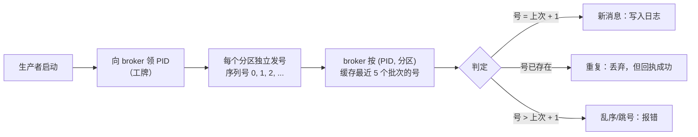
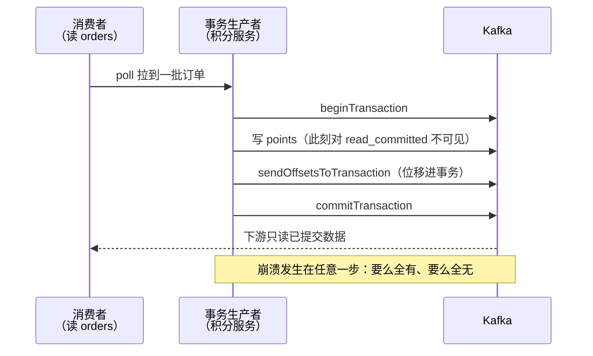

# 第 8 课：交付语义与幂等

> 所属阶段：阶段 3《可靠性与高可用》｜ 水平：零基础 ｜ 本课知识点：三种交付语义 / 幂等 producer / 事务简介
> 故事情节：发货方怕重复、怕漏发——主角怎么保证"该到的都到，且只到一次"

## 🎯 本课目标

- 区分 at-most-once / at-least-once / exactly-once 三种交付语义
- 解释幂等 producer 如何用"生产者 ID + 序列号"去重
- 知道事务解决"读-改-写"原子性，生产级不深入实现

---

## 第一幕：起源与场景引入

> 课 7 的复盘会（仓库着火）三天后，第二场复盘会开场。这次的问题不在仓库，在"发货"。

仓库侧的改造已经立项：RF=3、`min.insync.replicas=2`、3 Controller——消息不会再丢了。正要散会，财务同事推门进来，带着一沓新工单：**217 位用户收到了两条一模一样的积分到账短信，其中 3 位用户被重复扣款**。

> 🎬 **场景**：排查结果指向两类"重复"：
> 1. 查 `orders` 的分区日志：**同一条订单消息出现了两遍**。再看积分服务的生产者日志：当时发送请求超时 → 课 5 学的自动重试机制介入 → 重发成功。问题是：超时那次**其实已经写进去了**，重试又写了一遍。
> 2. 第二类更隐蔽：积分服务处理完一批消息、**还没来得及提交位移**就崩溃了。重启后从旧位移重读，刚处理过的那批又被处理了一遍（课 6 埋过的雷）。

复盘会上，三个问题被写上了白板：

1. 「消息到底送达几次」这件事，怎么系统地描述？丢了算谁的、重了算谁的？
2. 生产者重试造成的重复，能不能让 Kafka 自己挡住？
3. 积分服务这种「消费 → 处理 → 转发」的中间角色，崩溃时的「写成功了但位移没提交 / 位移提交了但没写」怎么破？

> 💡 **背景小注**：幂等与事务并非 Kafka 与生俱来的能力。2017 年 6 月发布的 0.11.0.0 才引入这两件套（KIP-98：幂等生产者与事务；KIP-129：Streams 恰好一次），在那之前 Kafka 只有 at-least-once，防重全靠应用自己。Confluent 团队打磨了一年多，设计目标就是把性能开销压在个位数百分比（核查于 2026-08）。

---

## 第二幕：认知冲突

面对"重复"这个问题，直觉会接连碰壁：

- **冲突一：「重试是保命机制，怎么能不重试？」** 课 5 教的 `retries` 是防丢的核心，现在它却成了重复的元凶。但「超时」≠「失败」：消息可能已经写进去了，只是**回执丢了**。不重试 → 丢消息；重试 → 可能重复。**丢和重是一枚硬币的两面**，纯靠调整重试策略无解——你需要先有一套语言来描述这个取舍（这就是知识点 1 的由来）。
- **冲突二：「让 Kafka 对消息内容查重不就行了？」** 集群每天流过百亿条消息，逐条比对内容性能爆炸；更致命的是**「内容相同」≠「重复」**——用户真的会在同一家店下两笔一模一样的订单（比如给同事带两杯同样的咖啡）。Kafka 不懂业务，无法判断两条内容相同的消息是「重试出来的」还是「用户真的做了两次」。按内容去重，此路不通。
- **冲突三：「把生产者管住就天下太平了？」** 积分服务是中间商：从 `orders` 消费、加工、写 `points`。崩溃的时机决定悲剧的形态：**写完 `points` 没提交位移** → 重启重读重写（重复）；**先提交位移没写 `points`** → 重启跳过（丢失）。要让「写 `points`」和「提交位移」绑成一个原子动作——可它们是两个完全不同的操作，怎么绑？

> ❓ **问题**：一次「不丢不重」的完整保障需要三块拼图——一套描述取舍的语言（三种交付语义）、一个生产端的去重机制（幂等 producer）、一个把"写"和"记账"绑死的机制（事务）。

---

## 第三幕：层层揭示

### 知识点 1：三种交付语义

**一句话定义**：交付语义（delivery semantics）描述系统对「一条消息被处理的次数」的承诺——at-most-once（最多一次）可能丢但绝不重复，at-least-once（至少一次）绝不丢但可能重复，exactly-once（恰好一次）不丢不重。

#### 直觉建立（类比）

快递签收的三种哲学：

- **at-most-once**：快递员把包裹放门口、拍照走人——省事，但丢了就丢了；
- **at-least-once**：送达后打电话确认，没打通就**再送一趟**——宁可你收两件，绝不让你收不到；
- **exactly-once**：既送到、且只送一次——快递员和收件人要配合一套「签收编号」机制，成本最高。

> 💡 **类比的边界**：交付语义不是「消息到达 Kafka」这一跳的属性，而是**全链路**的属性。消息每「跳」一次（生产者→Broker、Broker→消费者、处理器写下一跳）都有自己的语义，**端到端语义由最弱的一环决定**。

#### 概念与原理

| 语义 | 承诺 | 丢失 | 重复 | 代价 |
|------|------|------|------|------|
| at-most-once 最多一次 | 处理 0 次或 1 次 | 可能 | 不会 | 最低 |
| at-least-once 至少一次 | 保证处理 ≥ 1 次 | 不会 | 可能 | 中（需下游配合去重）|
| exactly-once 恰好一次 | 恰好 1 次 | 不会 | 不会 | 最高（需拼装整套机制）|

Kafka 链路上每一跳的**默认**行为（3.x 客户端，核查于 2026-08）：

| 环节 | 默认行为 | 默认语义 |
|------|----------|----------|
| 生产者 → Broker | `acks=all` + 无限重试（3.0 起默认） | at-least-once（重试可能重复写入）|
| 生产者 `acks=0` | 发出去就不管 | at-most-once |
| 消费者（先处理、后提交位移） | 崩溃后重读已处理的消息 | at-least-once |
| 消费者（先提交位移、后处理） | 崩溃后跳过未处理的消息 | at-most-once |
| 消费-处理-转发的处理器 | 重读 + 重写叠加 | at-least-once（两个重复源叠加）|

四条要点：

1. **语义是配置出来的，不是 Kafka 自带的**。同一个 Kafka，配置不同，语义就不同。
2. **端到端语义 = 链路最弱一环**。生产者做到了 exactly-once、消费者却是 at-most-once，整体就是最多一次。
3. **at-least-once 是 Kafka 的默认姿态**（可靠优先）；exactly-once 要显式拼装幂等 + 事务（见知识点 2/3）。
4. **工程现实**：大多数业务系统选择「at-least-once + 下游幂等（按业务 ID 去重）」——简单、通用、无性能税。exactly-once 留给金融扣款这类硬场景。

#### 一句话记住

**三种语义 = 快递签收的三种承诺（最多/至少/恰好一次）；at-least-once 是 Kafka 的默认，exactly-once 要显式拼装；端到端语义由链路上最弱的一环决定。**

---

### 知识点 2：幂等 producer

**一句话定义**：幂等 producer（idempotent producer）让「同一次发送的重试」在 broker 端只落一条——靠生产者 ID（PID）+ 分区级序列号识别重复批次并丢弃；`enable.idempotence` 自 3.0 起默认为 true（KIP-679）。

#### 直觉建立（类比）

奶茶店取餐口：

- 你（生产者）**上岗先领工牌**（PID，Producer ID）——broker 发的，全世界唯一；
- 你每做一杯就发一个**取餐号**（序列号，每个分区独立从 0 递增）；
- 取餐口（broker）记着「这个工牌叫到几号了」：**下一个号** → 出餐；**重复的号** → 这杯直接扔掉，但回你一声「好了」（免得你再喊）；**跳号** → 报错警告。

你没听到叫号，把 37 号又喊了一遍——取餐口对过记录：37 号出过了，直接回「好了」，**不会再多出一杯**。这就是重试去重。

> 💡 **类比的边界**：取餐口只认「自己发过的工牌 + 这个工牌的号」。换新工牌（生产者重启，PID 变了），旧账清零，对不上号；你自己手滑真下了两杯（应用代码调了两次 `send()`），那是**两个不同的取餐号**，取餐口无权拒绝——这正是冲突二「内容相同≠重复」的镜像。

#### 概念与原理



关键机制拆解：

1. **判定三规则**：下一个号 → 正常写入；重复号（在缓存窗口内）→ 丢弃但**回执成功**（让生产者安心停止重试）；跳号 → `OutOfOrderSequenceException`。
2. **为什么缓存 5 个**：`max.in.flight.requests.per.connection ≤ 5`（一条连接上最多 5 个未确认请求同时在飞）。重试的批次必须落在缓存窗口内才能被识别为重复——这就是幂等强制要求 in-flight ≤ 5 的原因。
3. **开启方式与连带效应**（3.0 起默认开启）：

```properties
enable.idempotence=true   # 3.0 起默认就是 true
# 连带强制生效：acks=all、retries=Integer.MAX_VALUE、max.in.flight ≤ 5
```

若你手动设置了冲突值（如 `acks=1`）且未显式开幂等 → **幂等被静默关闭**；若显式 `enable.idempotence=true` 且带冲突值 → 启动直接抛 `ConfigException`（早失败早发现）。

4. **三条边界（重中之重）**：
   - **会话级**：PID 是临时工牌，生产者**重启即换新**。跨重启的重复（重启前发了没确认，重启后重发）防不住；
   - **分区级**：序列号按「每个分区」独立计数，跨分区/跨 Topic 的原子性不管（那是事务的活）；
   - **只管内部重试**：客户端超时**自动重试** → 防住；应用代码 catch 异常**自己再 send() 一遍** → 新序列号，broker 视为新消息，照样两条。

#### 一句话记住

**幂等 producer = 工牌（PID）+ 取餐号（分区序列号），broker 靠它识别「同一次发送的重试」并丢弃；3.0 起默认开启；边界三件事——重启换牌、跨分区不管、应用层重发防不住。**

---

### 知识点 3：事务简介

**一句话定义**：Kafka 事务把「写多个分区」和「提交消费位移」打包成一个原子单元——要么全部生效、要么全部作废；由 `transactional.id` 标识、`initTransactions()` 等事务 API 驱动，配合下游消费者的 `read_committed` 实现 Kafka 内的端到端恰好一次。

#### 直觉建立（类比）

银行转账：A 账户扣款、B 账户到账，两个动作绑成一笔——**要么都成功，要么都没发生**，绝不许「扣了款没到账」。Kafka 事务更进一步：把「记账」（提交消费位移）也塞进同一笔转账。

回到积分服务的故事：「写 `points`」+「提交 `orders` 的位移」= 一笔事务。崩溃重启后，要么两个都干了、要么都没干——**「写一半」这个状态被彻底消灭**。

> 💡 **类比的边界**：这笔「转账」只在 Kafka 家的账户之间有效。积分服务若还要写 MySQL，写库动作**不在 Kafka 事务里**——崩溃照样可能「Kafka 提交了、MySQL 没写」。跨系统一致性要靠幂等消费（upsert / outbox 模式）等应用层手段。

#### 概念与原理

使用姿势（Java 客户端伪代码，课 9 亲手写）：

```java
props.put("transactional.id", "points-service-1");  // 稳定身份证：跨重启不变、每个实例唯一
producer.initTransactions();      // 上岗登记：领 PID + 提升 epoch（挡僵尸）
while (true) {
    records = consumer.poll(...);
    producer.beginTransaction();  // 开事务
    try {
        for (record : records) 处理并 producer.send(...);        // 写输出 topic
        producer.sendOffsetsToTransaction(位移, 消费组信息);      // 把"提交位移"塞进同一笔
        producer.commitTransaction();                            // 一笔提交
    } catch (KafkaException e) {
        producer.abortTransaction();  // 全部作废：输出不可见 + 位移不前进
    }
}
```



关键角色：

- **transactional.id**：业务方指定的**稳定身份**。跨重启不变（重启后接管旧事务）、部署多实例时各自唯一。设置它会自动开启幂等——事务是站在幂等肩膀上的。
- **initTransactions() 与僵尸围栏（zombie fencing）**：新实例上岗时 broker 把 epoch（世代号）+1，之后旧实例（假死没死透的那个）的一切请求都会被拒绝。课 6 再均衡时「旧成员还活着」的隐患，在这里被 epoch 机制强行拆掉。
- **read_committed**：下游消费者**必须显式**设置 `isolation.level=read_committed` 才「只读已提交的数据」。**默认是 read_uncommitted**——什么都不配，事务等于白开，中止的数据照样读得到。这是落地时最常见的翻车点。
- **代价**：事务提交有固定开销（官方 2017 基准：100ms 短提交间隔下吞吐降 15–30%，拉长间隔可摊薄到可忽略，核查于 2026-08）；**长事务会拖住**同分区上 read_committed 消费者的进度；`transaction.timeout.ms` 默认 60 秒，超时事务被协调者强制中止。

什么时候需要：多分区原子写、消费-处理-转发要恰好一次（如扣款链路）。什么时候不需要：一般业务「at-least-once + 消费端幂等」足够。Kafka Streams 用户则只需一个配置：`processing.guarantee=exactly_once_v2`（基于事务实现；v2 由 2.6 引入、3.0 起旧版废弃，默认值仍是 `at_least_once`）。

#### 一句话记住

**事务 = 把「写出去」和「记账（提交位移）」绑成一笔要么全有、要么全无的转账；transactional.id 是稳定身份证、initTransactions 挡僵尸、下游必须 read_committed；只在 Kafka 内部原子，出了 Kafka 就要靠业务幂等。**

---

## 第四幕：实操验证

> 老规矩，先确认容器在跑（`docker ps` 能看到 kafka）。本课在你自己的单节点集群上，把「重复」亲眼复现一遍，并认识两个新工具。

**第 1 步：亲手制造一次「重复」。** 进 console producer，把同一行**原样发两遍**：

```bash
docker exec -it kafka /opt/kafka/bin/kafka-console-producer.sh \
  --topic orders --bootstrap-server localhost:9092
```

输入两次同样的内容（每行回车一次），如：

```
order-8888 latte x2
order-8888 latte x2
```

然后 `Ctrl+C` 退出，换个新消费组从头消费：

```bash
docker exec -it kafka /opt/kafka/bin/kafka-console-consumer.sh \
  --topic orders --from-beginning --group audit-team \
  --bootstrap-server localhost:9092
```

`order-8888 latte x2` 出现了**两遍**。两条内容完全相同的消息，Kafka 照单全收——**Kafka 不按内容去重**。这正是冲突二的现场验证：只有业务知道 `order-8888` 是「重试出来的重复」还是「用户真买了两杯」。生产环境的标准做法是消费端按订单号做幂等去重。

**第 2 步：认识你一直在用的幂等生产者。** 3.0 起 `enable.idempotence` 默认为 true——你从课 3 用到现在的 console producer，**每次运行都默认是幂等的**。那第 1 步的两条为什么没被去重？因为那是**两次独立的 send()**（两个不同的序列号）。幂等挡的是「同一次发送的重试」，不是「你手动发两次」——知识点 2 的边界条款，现场版。

**第 3 步：看一眼事务工具。** Kafka 自带查看事务状态的 CLI（排查「消费者读不到数据」时要想到它——长事务会拖住 read_committed 消费者）：

```bash
docker exec -it kafka /opt/kafka/bin/kafka-transactions.sh \
  --bootstrap-server localhost:9092 list
```

当前没有事务型生产者在跑，预期输出为空列表或仅表头（若你的版本报参数错误，把子命令 `list` 放到最前面试试，不同版本参数顺序略有差异）。课 9 写代码时真正发起一个事务，回来跑这条命令就能看到 `Ongoing` 状态的事务——先混个脸熟。

> ✅ **回扣场景**：复盘会白板上的三个问题都有了答案——「送达几次怎么描述」→ 三种交付语义（知识点 1）；「生产者重试的重复」→ 幂等 producer 默认已开启，挡掉发送重试（知识点 2）；「中间商写一半崩溃」→ 事务把「写输出 + 提交位移」绑成原子（知识点 3）。同时直面遗留现实：幂等挡不住应用层重发、事务罩不住外部系统——所以**消费端幂等（按订单号去重）依然是工程标配**。

> 🧗 **进阶挑战（可选）**：给第 1 步的消费者加 `--property isolation.level=read_committed` 再跑一遍——当前没有事务在跑，输出与默认一致；课 9 写完事务代码后回来对比，你会看到差异。

---

## 第五幕：体系收束

> 📍 **全局定位**：阶段 3 的拼图至此完整——**课 5 的 `acks=all` + 课 7 的副本/ISR 解决「不丢」；本课的幂等 + 事务解决「不重」**。整条链路串起来：生产者（acks + 幂等 [+ 事务]）→ Broker（RF=3 + `min.insync.replicas=2` 熔断）→ 消费者（先处理后提交 [+ `read_committed` + 事务位移]）。**端到端语义 = 最弱一环**，每一跳都要自己挣来。
> 🎉 **阶段 3《可靠性与高可用》全部完成**。下一站是阶段 4《实战与架构落地》：课 9 用真正的代码写生产者与消费者（幂等、重试、位移提交全部亲手配置，事务 API 现场跑一遍），课 10 把 Kafka 放进你的项目架构（什么时候用、Topic 怎么设计、决策清单）。学完课 8 的你，已经把 Kafka 的「内脏」看得七七八八——剩下的就是把知识变成手艺。

---

## 🐞 常见误区

1. **「exactly-once 是 Kafka 的一个开关」**：错。它是链路上各环节配置**拼装**的结果，端到端语义由最弱一环决定；没有任何单个配置能一键全局生效。
2. **「开了幂等 producer 就不会重复」**：错。它只挡「同一次发送的自动重试」；应用层手动重发、生产者重启后的重发都防不住（重启换 PID）。
3. **「幂等的重复判定看消息内容」**：错。看的是 PID + 分区 + 序列号，与内容无关；内容相同的两条消息可以是两个合法的独立消息。
4. **「事务能让写 MySQL 一起回滚」**：错。Kafka 事务只覆盖 topic 写入与 `__consumer_offsets` 位移提交；外部系统要靠幂等消费、upsert 或 outbox 模式。
5. **「用了事务生产者，下游自然只读已提交」**：错。消费者默认 `read_uncommitted`，必须显式设置 `isolation.level=read_committed`，否则事务形同虚设。
6. **「要可靠就必须上事务」**：过重。多数业务「at-least-once + 消费端幂等」足够；事务留给金融扣款、消费-处理-转发恰好一次等硬场景。

## 📚 官方文档

- [Kafka Producer 配置](https://kafka.apache.org/documentation/#producerconfigs)：`enable.idempotence` / `transactional.id` / `transaction.timeout.ms`
- [Kafka Consumer 配置](https://kafka.apache.org/documentation/#consumerconfigs)：`isolation.level`
- [KafkaProducer Javadoc](https://kafka.apache.org/34/javadoc/org/apache/kafka/clients/producer/KafkaProducer.html)：幂等与事务 API 的官方示例代码
- [KIP-679](https://cwiki.apache.org/confluence/display/KAFKA/KIP-679%3A+Producer+will+enable+the+strongest+delivery+guarantee+by+default)：3.0 起默认开启幂等的提案原文

## 一图总结


> 读法：三跳各有各的语义保障——①靠幂等去重重试；②靠事务绑定「写 + 记账」；③靠 read_committed 只读已提交。**每一跳的保障加起来才是不丢不重**，任何一环掉链子，端到端语义就退化到那一环的水平。最后一道「按订单号幂等」是出 Kafka 之后的业务兜底。

## 课后小测

**Q1**：Kafka 3.x 客户端默认配置下（生产者 `acks=all` + 无限重试，消费者先处理后自动提交位移），一条订单消息从生产到消费的端到端语义是？
- A. exactly-once
- B. at-least-once
- C. at-most-once
- D. 取决于 Broker 的 ISR 配置

<details><summary>答案与解析</summary>

**答案：B**。生产者超时重试时，消息可能已写入成功，重试再写一遍 → 重复；消费者处理完还没提交位移就崩溃，重启后重读重处理 → 重复。两个环节都不丢消息（重试 + 位移滞后），但都可能重复，组合出 at-least-once。exactly-once 需要显式拼装幂等 + 事务；at-most-once 出现在「不重试」或「先提交位移后处理」的配置下；ISR 配置（课 7）决定的是 Broker 侧的持久性，不改变交付语义的次数框架。

</details>

**Q2**：幂等生产者（PID=100，某分区序列号已发到 50）发送超时后，**应用代码**在 catch 里对同一条数据又调用了一次 `send()`。broker 会怎么处理？
- A. 识别为重复，丢弃，topic 里只有一条
- B. 应用层重发携带新序列号 51，broker 视为新消息，写入第二条
- C. 抛 OutOfOrderSequenceException，拒绝写入
- D. 抛 ProducerFencedException，关闭生产者

<details><summary>答案与解析</summary>

**答案：B**。幂等的去重键是「PID + 分区 + 序列号」——应用层手动重发是一次**全新的 send() 调用**，拿到新序列号 51，broker 按规则正常写入。幂等只挡「客户端内部对同一次发送的自动重试」（重试复用原序列号）。这是幂等三条边界中最容易被误解的一条。C 的乱序异常发生在序列号跳跃且不在缓存窗口时；D 的围栏异常属于事务场景。

</details>

**Q3**：积分服务（消费 `orders`、加工、写 `points`）要升级为事务型生产者实现恰好一次。下列落地姿势正确的是？
- A. 设置稳定的 `transactional.id`，`initTransactions()` 后循环 `beginTransaction` → `send` → `sendOffsetsToTransaction` → `commitTransaction`；下游 `points` 的消费者设置 `isolation.level=read_committed`
- B. 只需设置 `transactional.id`，下游消费者无需任何改动
- C. 位移照常用 `consumer.commitSync()` 提交，事务里只包含写 `points`
- D. `transactional.id` 每次启动随机生成，避免多实例冲突

<details><summary>答案与解析</summary>

**答案：A**。事务闭环 = 生产者侧「写输出 + 位移入事务」（`sendOffsetsToTransaction`）+ 消费者侧 `read_committed`，缺一不可。B 错：消费者默认 `read_uncommitted`，不显式配置读得到未提交/已中止数据，事务白开；C 错：位移必须经 `sendOffsetsToTransaction` 进事务，用 `commitSync` 单独提交会把「记账」拆出事务，原子性破碎；D 错：`transactional.id` 必须跨重启稳定（围栏僵尸 + 接管旧事务靠它），多实例应各持唯一且稳定的 ID。

</details>

## 🚀 下一批接力提示词

> 🎉 **阶段 3《可靠性与高可用》已完成**（课 7 副本机制与故障转移 + 课 8 交付语义与幂等）。建议先消化本课、或让我出一份阶段自测，也可以直接进入阶段 4 实战：

```
继续学 Kafka。我的学习档案在 kafka-basics/00-学习档案.md，
刚学完阶段 3《可靠性与高可用》的课《交付语义与幂等》知识点 三种交付语义、幂等producer、事务简介，
请按大纲继续讲解下一批知识点（阶段 4 课9：代码开发实战）。
```

## 🧭 课程导航

⬅️ **上一课**：[课 7：副本机制与故障转移](lesson-07-副本机制与故障转移.md)

➡️ **下一课**：[课 9：代码开发实战](../../4-实战与架构落地/lessons/lesson-09-代码开发实战.md)

📚 **返回目录**：[课程目录](../../../02-课程目录.md)
