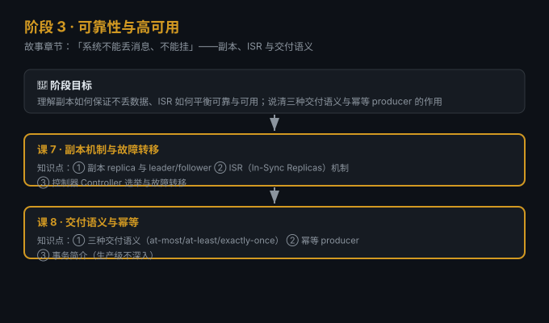

# 阶段 3：可靠性与高可用

> 所属课程：Kafka 系统学习 ｜ 故事章节：「系统不能丢消息、不能挂」 ｜ 上一阶段：[阶段 2](../2-核心架构/overview.md)

## 🎯 本阶段目标

- 理解副本（replica）如何保证数据不丢、leader/follower 如何分工
- 说清 ISR（In-Sync Replicas）机制如何平衡"可靠"与"可用"
- 讲透三种交付语义与幂等 producer，知道默认行为为何会重复

## 📍 学习重点

- **副本不是备份**：它是"实时同步的冗余"，为故障转移而生
- **ISR 是可靠性闸门**：ISR 缩容 / 扩容的边界决定了会不会丢消息
- **语义要靠配置换**：at-least-once 是默认，exactly-once 要显式开启幂等/事务

## ✅ 必须掌握的知识点

| 知识点 | 所属课 | 学完应能 |
|--------|--------|----------|
| 副本与 leader/follower | 课7 | 解释读写都走 leader、follower 只同步 |
| ISR 机制 | 课7 | 说清 ISR 缩小时会不会丢消息 |
| 控制器选举与故障转移 | 课7 | 解释 leader 挂了如何恢复 |
| 三种交付语义 | 课8 | 区分 at-most/at-least/exactly-once |
| 幂等 producer | 课8 | 解释如何避免重复写入 |
| 事务简介 | 课8 | 知道事务解决"读-改-写"原子性 |

## 🗺️ 本阶段路径图

## 本阶段产出

- [ ] `lessons/lesson-07-副本机制与故障转移.md`
- [ ] `lessons/lesson-08-交付语义与幂等.md`
