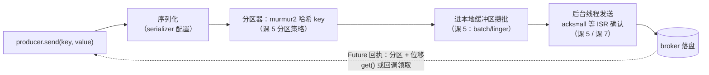
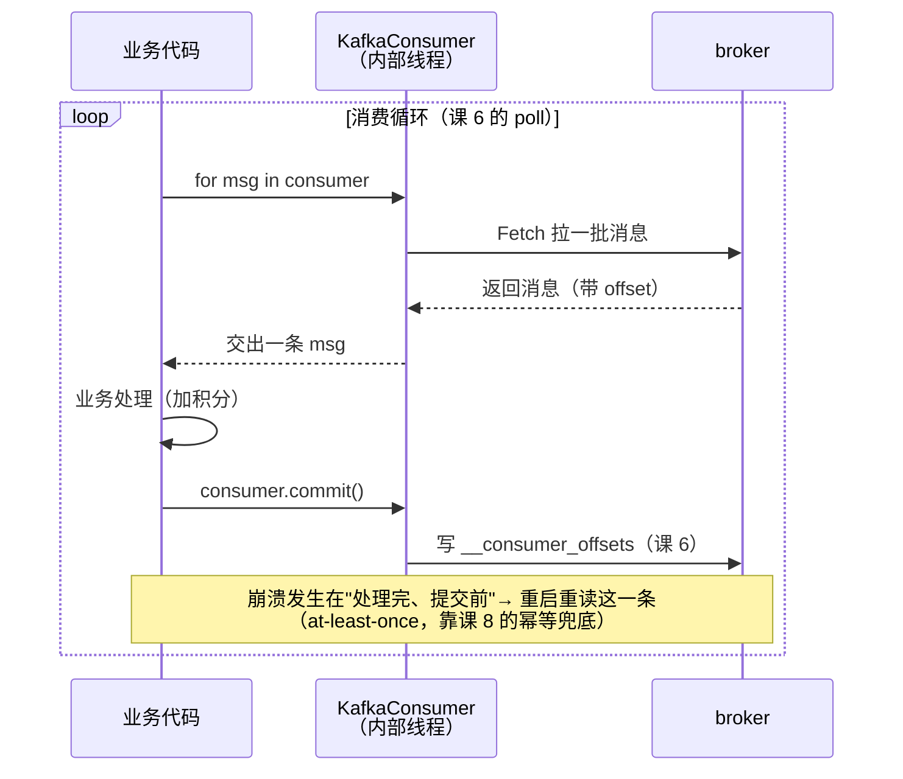
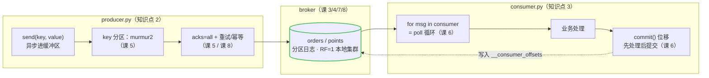

# 第 9 课：代码开发实战

> 所属阶段：阶段 4《实战与架构落地》｜ 水平：零基础 ｜ 本课知识点：选客户端与环境 / 写生产者 / 写消费者
> 故事情节：主角正式上岗——用代码把"生产者发货、消费者收货"落成真功能
> 代码版本：kafka-python 3.x（2026-06 起的版本线，Python 3.8+；事务 API 需 2.2.0+，2025-04 发布）；broker 为课 3 的 `apache/kafka:4.0.0`（核查于 2026-08）

## 🎯 本课目标

- 认识三大客户端（Java / confluent-kafka / kafka-python），会按场景选型
- 写出最小可用的生产者：配置、异步发送、回执、优雅关闭
- 写出带手动位移提交的消费者：消费循环、提交时机（回扣课 6 的坑）

---

## 第一幕：起源与场景引入

> 课 8 复盘会后一周，积分服务正式立项。这一课，主角从"敲命令的人"变成"写代码的人"。

先补一段客户端生态的小史。2011 年 Kafka 在 LinkedIn 开源时，**只有 Java 客户端**——它是 Kafka 的"亲儿子"，所有新特性（幂等、事务、KIP-848 新协议）都最先落在 Java 上。为了让其他语言也能接入，工程师 Magnus Edenhill 用 C 语言写了 **librdkafka**，后来由 Confluent 接手维护，成为其 Python/Go/.NET 客户端的统一底座；Python 世界由此有了两条路：Confluent 官方 2016 年发布的 **confluent-kafka**（包着 librdkafka 的 C 内核），和社区 2014 年起步的 **kafka-python**（纯 Python 实现）。后者命运多舛：2020 年 9 月发布 2.0.2 后一度停更四年半，2025 年初复活后一路狂奔——补齐事务（2.2.0，2025-04）、支持 Kafka 4.0、2026 年 6 月升上 3.0 大版本，如今月下载量近 3000 万（核查于 2026-08）。

> 🎬 **场景**：积分服务上线日。测试环境里，order 消息已经能用 console 命令手动发、手动收——但没人打算 7x24 小时坐在终端前替用户攒积分。CLI 是给人敲的：发一条敲一行、没有业务逻辑、Ctrl+C 就没了。你要写两个真正的程序：**一个生产者**（订单服务调它发货）、**一个消费者**（积分服务靠它收货记账）。从这一课起，前面的每一课——分区的 key、acks、消费者组、位移提交、幂等、事务——全部要在代码里落地。

## 第二幕：认知冲突

真动手前，直觉会连续碰壁：

- **冲突一：「装哪个库？」** 搜教程会看到三种代码：`from kafka import KafkaProducer`、`from confluent_kafka import Producer`、`import org.apache.kafka...`——连 import 都不一样。更迷惑的是旧帖子里"kafka-python 停更了别用"的警告，那说的是 2020–2024 年的事，**现在早已过时**。选错库，学的 API 换个团队就要重学。
- **冲突二：「发送不就是一行代码？」** `producer.send(topic, value)` 确实只有一行，但它**立即返回，消息还躺在内存缓冲区里**。如果 send 完直接 `print("发送成功")` 然后退出进程——消息可能根本没离开过你的电脑。新手最常见的"我发了但消费不到"，十有八九栽在这里。
- **冲突三：「消费不就是个 for 循环？」** 循环本体确实简单，但课 6 讲的位移提交陷阱全藏在循环里的**一行配置**上：自动提交开着，处理到一半崩溃会丢消息；关掉自动提交，什么时候手动提交又决定了重复还是丢失。理论课听懂了 ≠ 代码写对。
- **冲突四：「这些配置是必须的吗？」** `acks`、`enable_auto_commit`、`auto_offset_reset`……每个配置都在前几课出现过，但它们在 kafka-python 里的**默认值**与 Java 客户端的历史版本有过差异（详见知识点 2）。赌默认值，等于赌库的版本历史。

> ❓ **问题**：要跑通"订单进、积分出"，需要四块拼图：选对客户端并配好环境（知识点 1）、一个可靠的生产者（知识点 2）、一个不丢不乱提交的消费者（知识点 3），最后在你的 Docker 集群上把整条链路跑起来（实操）。

---

## 第三幕：层层揭示

### 知识点 1：选客户端与环境

**一句话定义**：三大客户端各有所长——Java（官方 `kafka-clients`，功能最全最及时）、confluent-kafka（C 内核 librdkafka，性能最强）、kafka-python（纯 Python，零编译依赖、API 贴 Java）；本课主线选 kafka-python，兼顾易装、易学、能覆盖本课全部知识点（含事务）。

#### 直觉建立（类比）

三种交通工具去同一个目的地（Kafka 集群）：**地铁（Java）**——官方修的，班次最新（新特性第一时间通车），但你得先装一整套站台（JVM + Maven）；**跑车（confluent-kafka）**——发动机是 C 写的 librdkafka，拉货最快，但引擎是进口的（预编译二进制）；**自行车（kafka-python）**——门到门、零门槛，装上就能骑，速度够日常通勤（中小吞吐）。

> 💡 **类比的边界**：三种客户端**走的是同一条路**——Kafka 的网络协议是公开的，所有客户端最终发的都是同样的协议请求。所以你在课 3–课 8 学的机制（分区、位移、ISR、事务）对任何客户端都成立，变的只是 API 皮。**机制是通用货币，API 只是方言。**

#### 概念与原理

| 维度 | Java（kafka-clients） | confluent-kafka | kafka-python |
|------|----------------------|-----------------|--------------|
| 实现 | 官方原生 | C（librdkafka）绑定 | 纯 Python |
| 性能 | 基准（Java 即标尺） | 高（贴近 Java） | 中（中小吞吐够用） |
| 安装 | JDK + Maven/Gradle | pip，自带预编译 C 二进制 | pip，纯装零编译 |
| 新特性时效 | 第一时间 | 跟随 librdkafka（Confluent 维护） | 2025 年起快速追赶 |
| 幂等/事务 | 0.11（2017）起 | 久经考验 | 2.2.0（2025-04）起 |
| 维护方 | Apache 官方 | Confluent 官方 | 社区（dpkp/mumrah） |

选型口诀：**学得动、装得上选 kafka-python；Python 生产要高吞吐选 confluent-kafka；企业核心链路、要全家桶（Streams/Connect）选 Java**。本课用 kafka-python——纯 pip 安装、API 与 Java 客户端几乎一一对应（`send()`/`poll()`/`commit()`，学的概念能平移），且 2.2.0 起支持事务，课 8 的承诺能在它身上兑现。

环境三件事（对着课 3 的 Docker 集群）：

1. **装库**：`python -m pip install kafka-python`（3.x 需 Python 3.8+）。
2. **连地址**：容器把 9092 映射到了宿主机，代码里写 `localhost:9092`——与课 3 的 CLI 同一个入口。
3. **客户端与 broker 版本兼容**：kafka-python 3.x 的协议支持达到 Kafka 3.0 基线，官方 README 明确标注支持 Kafka 4.0，连 4.0.0 的 KRaft 集群没有问题。

#### 一句话记住

**三大客户端走同一条协议路：Java 是官方亲儿子、confluent-kafka 是 C 内核跑车、kafka-python 是零门槛自行车；学的机制通用，API 只是方言。**

---

### 知识点 2：写生产者

**一句话定义**：生产者代码 = 一个配置齐全的 `KafkaProducer` + 异步的 `send()`（返回 Future）+ 回执确认（`get()`/回调）+ 优雅收尾（`flush()`/`close()`）。

#### 直觉建立（类比）

寄快递三步：`send()` = 把包裹**交给小区代收点**（客户端缓冲区）——你转身就能走；`future.get()` = **等签收单**（broker 的确认回执，写着放进哪个分区、第几个位置）；`flush()` = **催代收点立刻发车**（把攒着的包裹全部送出去）。漏了第三步就关门（进程退出），代收点里没发车的包裹就丢了。

#### 概念与原理

```python
import json
from kafka import KafkaProducer

producer = KafkaProducer(
    bootstrap_servers='localhost:9092',                        # 入口：课 3 的本地集群
    key_serializer=str.encode,                                 # key: str -> bytes
    value_serializer=lambda v: json.dumps(v).encode('utf-8'),  # value: dict -> JSON bytes
    acks='all',                                                # 课 5：等 ISR 全体确认
)

future = producer.send('orders', key='alice', value={'order_id': 1})
meta = future.get(timeout=10)      # 等回执：拿到了才算真正送达
print(f'已送达 {meta.topic}[{meta.partition}] @{meta.offset}')
```

逐行拆解，每一步都能在课 5 找到机制原型：

1. **bootstrap_servers**：只写一个入口地址即可，客户端会自动拉全量元数据（哪个分区在哪台 broker）。
2. **序列化器**：Kafka 只认字节，`key_serializer`/`value_serializer` 负责把你的对象变成 bytes——这一步对应课 5 发送流程的第一站。
3. **key 的用途**：`send()` 带 key，客户端用 **murmur2 哈希**把同一 key 的消息固定发到同一分区（课 5 分区策略）——alice 的所有订单永远排队在一起、保序。
4. **send() 是异步的**：调用返回时消息刚进本地缓冲区，后台线程负责攒批发送（课 5 的批次机制、课 4 的顺序写在背后支撑）。返回值是个 **Future（期货：一张将来才能兑现的凭证）**。
5. **两种确认方式**：教学/低流量用 `future.get(timeout=10)` 同步等（把异步变同步，逐条确认）；高流量用 `future.add_callback(...)` 注册回调不阻塞。**每条都 get 会拖垮吞吐**——演示可以，生产慎用。
6. **优雅收尾**：`flush()` 强制把缓冲区清空，`close()` 关后台线程。退出前不做这两步，缓冲区里未发出的消息全部蒸发。



一个必须刻进肌肉记忆的细节：**关键参数永远显式写**。kafka-python 3.0（2026-06）起生产者默认值已按 KIP-679 对齐 Java 3.0+（`enable_idempotence=True`、`acks='all'`），但 2.x 老版本默认还是 `acks=1`——不同库、不同版本默认值不同，显式写出既防升级翻车，也让读代码的人一眼看懂语义。

#### 一句话记住

**send() 只是把包裹交给代收点，Future 才是签收单；flush + close 是发车口令——三步缺一个，消息就可能半路蒸发；关键参数永远显式写。**

---

### 知识点 3：写消费者

**一句话定义**：消费者代码 = 配置好身份的 `KafkaConsumer`（组 ID、位移策略、提交模式）+ 消费循环（`for msg in consumer`，底层就是课 6 的 poll 循环）+ 位移提交时机的拿捏。

#### 直觉建立（类比）

接力读小说：`offset` 是**书签**（读到第几页），`commit()` 是**在登记表上写下书签位置**（`__consumer_offsets`）。写晚了——处理到第 100 页才记到第 50 页，中途崩溃重启会从 51 页**重读**（重复）；写早了——才读到第 50 页就记 100，崩溃重启直接**跳到 101**（丢失）。课 6 讲的先处理后提交 = 宁可重读不可跳页。

#### 概念与原理

```python
import json
from kafka import KafkaConsumer

consumer = KafkaConsumer(
    'orders',                          # 订阅的 topic
    bootstrap_servers='localhost:9092',
    group_id='points-service',         # 课 6：消费者组身份
    auto_offset_reset='earliest',      # 课 6：组内无位移记录时从头读
    enable_auto_commit=False,          # 关自动提交：提交时机自己拿捏
    key_deserializer=lambda k: k.decode('utf-8'),
    value_deserializer=lambda m: json.loads(m.decode('utf-8')),
)

try:
    for msg in consumer:               # 这一行背后 = 课 6 的 poll 循环
        print(f'{msg.topic}[{msg.partition}]@{msg.offset} key={msg.key} -> {msg.value}')
        # ...业务处理（给用户加积分）...
        consumer.commit()              # 处理完一条提交一条：先处理后提交
except KeyboardInterrupt:
    pass
finally:
    consumer.close()                   # 优雅退出：主动离组，触发再均衡
```

逐项拆解：

1. **group_id**：消费者组身份。同组多实例自动分摊分区（课 6 再均衡）；换一个组 ID 就是一套全新的进度——测试时想"从头再消费一遍"，换组比改位移方便得多。
2. **auto_offset_reset='earliest'**：只影响"组内从来没有位移记录"的场景（新组或位移过期被清理）。课 6 核实过默认值是 `latest`，本地实验建议显式 `earliest`，否则新组容易"什么也收不到"（从最新位置等新消息）。
3. **enable_auto_commit=False + 手动 commit()**：这就是课 6 位移提交陷阱的代码落点。自动提交（默认开启，每 5 秒）提交的是"轮询到的位置"，不是"处理完的位置"——处理中途崩溃就丢消息；手动在**业务处理完成后**提交，换来 at-least-once（崩溃重读，配合课 8 的消费端幂等兜底）。
4. **`for msg in consumer` 不是普通迭代**：每轮循环内部都执行 poll（拉消息 + 发心跳 + 响应再均衡）。消费完存量后循环会**安静地挂住**——不是死机，是长驻服务的常态：在等下一条消息。
5. **consumer.close() 的价值**：主动向协调器发 LeaveGroup，同组其他成员立刻触发再均衡接手分区；不 close 直接杀进程，组要等满 `session.timeout.ms`（默认 45s）才判定你掉线——分区最长闲置 45 秒。



再补一条工程红线：`KafkaProducer` 线程安全可全局共享，**`KafkaConsumer` 非线程安全**（官方文档明确警告）——一个进程一个消费者实例，别在多线程里共用。

#### 一句话记住

**消费者三件套：组 ID 定身份、earliest 定起点、处理完再 commit 定语义；for 循环挂住是常态，close 退出才体面。**

---

## 第四幕：实操验证

> 场地还是课 3 的 Docker 集群（`docker ps` 能看到 kafka 容器）。本课的 4 个代码文件已放在本课同目录的 `code/` 下，可直接运行；建议先手敲一遍 producer 再对照。

**第 0 步：装库 + 本机避坑（Windows）。**

```powershell
python3.11.exe -m pip install kafka-python
```

> ⚠️ **本机环境提示**（本课实操在你的 Windows + PowerShell 上验证）：
> 1. `python` 命令可能被 Microsoft Store 别名劫持，用 `python3.11.exe`（或 `python3.12.exe`）运行；
> 2. 控制台默认 GBK 编码，若 `print` 输出 emoji 等非 GBK 字符会抛 `UnicodeEncodeError`——本课代码的输出只用中文和 ASCII，若你自行改造后报编码错，在文件开头加 `sys.stdout.reconfigure(encoding='utf-8')`；
> 3. PowerShell 多条命令用 `;` 分隔，不支持 `&&`。

**第 1 步：跑生产者，验证 key 分区。** 先看一眼 orders 的分区数（课 3 建的 topic）：

```powershell
docker exec kafka /opt/kafka/bin/kafka-topics.sh --describe --topic orders --bootstrap-server localhost:9092
```

记下输出里的 `PartitionCount: N`——接下来 producer 输出的分区号范围就是 0 到 N-1；进阶挑战里两个消费者要分摊的也正是这 N 个分区。

然后运行 `code/producer.py`（发 10 条订单，alice/bob/carol 三个 key）：

```powershell
python3.11.exe code\producer.py
```

看输出：**同一用户（key）的订单全部落在同一分区**——murmur2 哈希的现场验证（课 5 知识点 2）。alice 的 offset 在她的分区里连续递增：同 key 保序，眼见为实。

**第 2 步：跑消费者，手动提交。** 换一个终端：

```powershell
python3.11.exe code\consumer.py
```

能看到 10 条订单依次处理（每条打印 topic/分区/offset/key/value 后才 commit）。消费完存量后程序**安静挂住**——正常，在等新消息；此时回第 1 步终端再跑一次 producer，消费者会自动收到新一批。`Ctrl+C` 退出，观察它打印"收到退出信号"后 close——再跑一次，**从头什么都读不到**（位移已提交，从上次的位置继续）。这就是课 6 的"位移即进度"在代码里的样子。

**第 3 步：事务现场——兑现课 8 的承诺。** 课 8 实操埋了两句话："课 9 写代码时真正发起一个事务，回来跑 `kafka-transactions.sh` 就能看到 Ongoing 状态"。现在兑现。先建 points topic，再启动事务脚本：

```powershell
docker exec kafka /opt/kafka/bin/kafka-topics.sh --create --topic points --partitions 1 --replication-factor 1 --bootstrap-server localhost:9092
python3.11.exe code\txn_producer.py
```

脚本的行为：事务 1 发 3 条（`txn-A-*`）并**提交**；事务 2 发 2 条（`txn-B-*`）后**故意挂 30 秒再中止**。趁挂住的 30 秒，另开一个终端跑课 8 认识的工具：

```powershell
docker exec -it kafka /opt/kafka/bin/kafka-transactions.sh --bootstrap-server localhost:9092 list
```

你会看到一个 **Ongoing** 状态的事务（协调器视角的"进行中"）——和课 8 预告的一致。30 秒后脚本 abort，这个事务转为已中止。

**第 4 步：read_committed 对比实验——兑现课 8 的进阶挑战。** 事务脚本跑完后：

```powershell
python3.11.exe code\consumer_committed.py
```

它以 `isolation_level='read_committed'` 只读已提交数据：**只能看到 3 条 `txn-A-*`**，被中止的 2 条 `txn-B-*` 永不可见。把代码里的 `isolation_level='read_committed',` 删掉再跑（默认 read_uncommitted）——5 条全出来，包括已作废的那 2 条。事务可见性、课 8 的"最常见的翻车点"（下游必须显式配置），一跑便知。

> ✅ **回扣场景**：积分服务的"收发货"闭环成型——producer.py 是发货侧（key 保序、acks=all 可靠投递），consumer.py 是收货侧（先处理后提交，at-least-once + 业务幂等），txn_producer.py 展示了要上恰好一时事务长什么样。第 10 课就把这套代码放进真实项目架构。

> 🧗 **进阶挑战（可选）**：开两个终端同时跑 `consumer.py`（同一个 group_id），再跑 producer——10 个分区被两个消费者分摊（课 6 消费者组负载分摊的现场版；若 orders 只有 1 个分区，会看到另一个消费者空手，想想为什么）。

---

## 第五幕：体系收束

> 📍 **全局定位**：这一课是"翻译课"——把课 3–课 8 的机制词汇翻译成代码：`acks='all'` 是课 5，key 分区是课 5，`group_id`/`auto_offset_reset`/`commit()` 是课 6，`isolation_level='read_committed'` 是课 8。**你写的每一行配置，都是前面某一课的机制选择**。下一课（也是最后一课）把视角拉到架构层：这套 producer/consumer 代码放进一个真实项目时，Kafka 适合扛什么、不适合什么、Topic 该怎么设计——决策比写法更值钱。

---

## 🐞 常见误区

1. **「kafka-python 停更了，不能用」**：过时信息。2020-09 到 2025-02 确实停更，但复活后迭代迅速，2026 年已到 3.0.x（月下载近 3000 万），事务/幂等齐备。
2. **「send() 返回了就是发送成功」**：错。send 返回只代表消息进了本地缓冲区；不 `get()`/不 `flush()`/不 `close()` 就退出进程，消息可能从未发出。
3. **「消费者卡住是 bug」**：不是。消费完存量后 `for msg in consumer` 挂住等待是长驻服务的正常形态；要退出用 Ctrl+C 走 close 流程。
4. **「换个库学的就白学了」**：不会。所有客户端说同一种协议、同一套机制（分区/位移/事务）；变的只是 API 拼写，机制是通用货币。
5. **「自动提交挺好，省一行代码」**：自动提交提交的是轮询位置而非处理位置，处理中途崩溃会丢消息；可靠性场景关掉它、处理完再手动提交（at-least-once + 下游幂等）。
6. **「多线程共用一个 consumer 提高吞吐」**：危险。`KafkaConsumer` 非线程安全（官方明确警告）；要扩吞吐就加实例（同组自动分摊分区），而不是在进程内共享实例。

## 📚 官方文档

- [kafka-python 官方文档（含事务与 read_committed 示例）](https://kafka-python.readthedocs.io/)
- [kafka-python PyPI](https://pypi.org/project/kafka-python/)
- [confluent-kafka Python 客户端（Confluent 官方）](https://docs.confluent.io/kafka-clients/python/current/overview.html)
- [Apache Kafka 官方文档（Java 客户端与配置）](https://kafka.apache.org/documentation/)

## 一图总结



> 读法：你写的两个脚本夹着 broker 各站一头，**每一处关键代码都对应前几课的一个机制**——发送侧管"进"（分区与可靠性），消费侧管"出"（进度与语义）。第 10 课把这套链路放进项目架构全景。

## 课后小测

**Q1**：三个团队需求——① 零基础学习 + Windows 上快速搭 demo；② Python 数据管道，日均千万级消息，要榨吞吐；③ 金融核心系统，要第一时间的官方新特性与企业级生态。分别选哪个客户端最合适？
- A. ① confluent-kafka ② kafka-python ③ Java
- B. ① kafka-python ② confluent-kafka ③ Java
- C. 全选 Java，学一个就够了
- D. ① kafka-python ② Java ③ confluent-kafka

<details><summary>答案与解析</summary>

**答案：B**。①学习/中小吞吐：kafka-python 纯 pip 安装零编译、API 贴 Java 便于概念平移；②Python 高吞吐：confluent-kafka 的 librdkafka C 内核性能贴近 Java 客户端；③核心企业链路：Java 是官方亲儿子，新特性（幂等、事务、KIP-848）第一时间落地，Streams/Connect 生态齐全。C 错在忽视语言栈约束（团队是 Python 就别硬上 JVM）；D 错在把 ② 和 ③ 的定位弄反。

</details>

**Q2**：同事写了这段代码抱怨"Kafka 丢消息"：`producer.send('orders', value=x); print('发送成功')`，然后函数返回、进程一分钟后退出。最可能的原因是？
- A. broker 副本因子不够，消息被 ISR 踢掉了
- B. send() 是异步的，消息还在本地缓冲区，进程退出时未 flush/close，缓冲区里的消息根本没发出
- C. acks 配置错了，应该设成 0
- D. Kafka 4.0 移除了 ZooKeeper 导致客户端不兼容

<details><summary>答案与解析</summary>

**答案：B**。send() 立即返回 Future，此刻消息只在客户端缓冲区，由后台线程攒批发送；print「发送成功」是程序自己的话，不代表 broker 确认。没有 `future.get()`/`flush()`/`close()` 任何一步，进程退出时缓冲区未发出的消息全部丢失。修复：退出前 `producer.flush()` + `producer.close()`，关键消息用 `future.get(timeout=10)` 逐条确认。A/C/D 与本场景无关（本地集群 RF=1 无 ISR 裁剪问题；acks=0 恰恰更不可靠；KRaft 对客户端透明）。

</details>

**Q3**：consumer.py 的配置是 `enable_auto_commit=False` + 每条消息**处理完成后**调用 `commit()`。若消费者在"处理完第 100 条、还没来得及 commit"时崩溃重启，会发生什么？业务上需要什么配套？
- A. 第 100 条丢失；应改回自动提交
- B. 从第 101 条继续消费；什么都不用做
- C. 第 100 条被重新消费（重复处理一次）；业务处理需幂等（如按订单号去重）
- D. 整个消费组解散，从头重新消费

<details><summary>答案与解析</summary>

**答案：C**。手动提交模式崩溃后，broker 记录的位移还停在第 99 条的提交点，重启从第 100 条重读——重复处理一次，这是 at-least-once 的必然代价（课 6/课 8 的理论落点）。配套手段就是课 8 讲的消费端幂等：按订单号/唯一键去重（upsert、setnx 等），重放不产生副作用。A 错：位移滞后只会重复不会丢（丢的是"先提交后处理"模式）；B 错：位移没提交就不会跳过；D 错：单实例崩溃与组解散无关，重启后仍按组位移续读。

</details>

## 🚀 下一批接力提示词

> 本课完成后，**复制下面这段文字发给 AI**，即可无缝进入下一课（无需重新描述上下文）：

```
继续学 Kafka。我的学习档案在 kafka-basics/00-学习档案.md，
刚学完阶段 4《实战与架构落地》的课《代码开发实战》知识点 选客户端与环境、写生产者、写消费者，
请按大纲继续讲解下一批知识点（课10：项目架构设计落地）。
```

## 🧭 课程导航

⬅️ **上一课**：[课 8：交付语义与幂等](../../3-可靠性与高可用/lessons/lesson-08-交付语义与幂等.md)

➡️ **下一课**：[课 10：项目架构设计落地](lesson-10-项目架构设计落地.md)

📚 **返回目录**：[课程目录](../../../02-课程目录.md)
