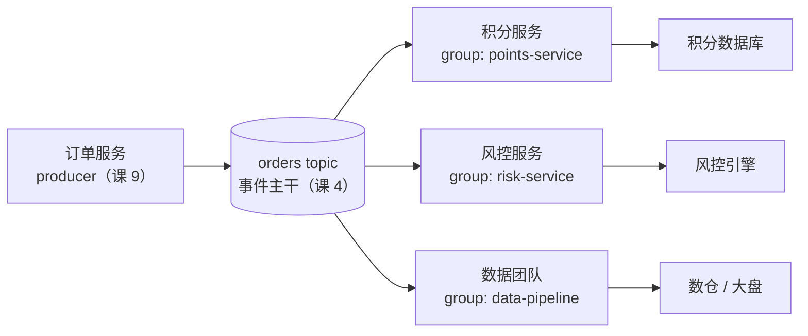
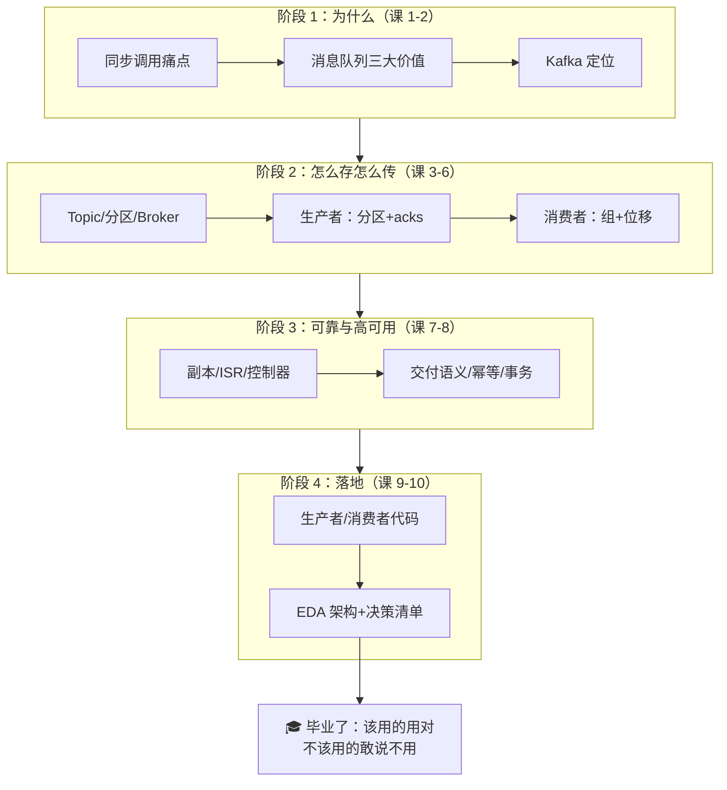

# 第 10 课：项目架构设计落地

> 所属阶段：阶段 4《实战与架构落地》｜ 水平：零基础 ｜ 本课知识点：事件驱动架构 EDA / 常见拓扑 / 决策清单
> 故事情节：主角毕业考——把它放进你的真实项目架构，并想清楚"该不该用"
> 事实核查：EDA/CQRS/事件溯源/Kappa 起源、Connect/Streams 诞生版本、share groups GA 时间线均已联网核实（核查于 2026-08）

## 🎯 本课目标

- 说清事件驱动架构（EDA）与 Kafka 的关系
- 列举常见拓扑：日志管道、流处理、CQRS、事件溯源
- 产出"该用 / 不该用 Kafka"的决策清单（一句话定位 Kafka Connect / Streams 生态）

---

## 第一幕：起源与场景引入

> 课 9 的积分服务上线一个月，运行平稳。这一课，它要面对毕业考——从"一个服务"长成"一套架构"。

先补一小段历史。"事件驱动"并不是 Kafka 发明的概念：早在 2003 年，Gartner 分析师 Roy Schulte 就在报告《The Growing Role of Events in Enterprise Applications》中系统提出了事件驱动架构（EDA，Event-Driven Architecture）这个词，并在当年称它为"下一个大事件"（核查于 2026-08）。那时 Kafka 还要等八年才出生——**EDA 是先有的思想，Kafka 只是后来最擅长实现它的那根管道**。

> 🎬 **场景**：积分服务跑通后，订单事件突然成了香饽饽。风控团队要实时识别异常下单，数据团队要实时大盘，BI 要把数据同步进数仓，审计团队要全量留痕。四个团队排着队来找订单团队："给我们开个接口""回调一下我们""每天导一份给我们"。订单团队发现：每多一个需求，自己就多一个要伺候的下游——**课 1 的同步调用痛点，换了个规模又回来了**。CTO 把架构图拍在桌上："你们都说 Kafka，那就两个问题：第一，这套架构到底怎么设计？第二——这个场景真的该用 Kafka 吗？"第一个问题是本课的知识点 1 和 2，第二个问题是知识点 3。**毕业考的残酷之处在于：既要会设计，还要敢说"不"。**

## 第二幕：认知冲突

动手画架构图之前，直觉会连续碰壁：

- **冲突一：「装了 Kafka 就等于有 EDA 吗？」** 不。Kafka 只是管道，EDA 的灵魂是**事件思维**。同样是往 topic 里发消息，`OrderCreated`（"订单已创建"——陈述事实）和 `SendEmail`（"去发邮件"——下达指令）是两种完全不同的东西。前者是事件，后者是命令。把命令塞进事件管道，下游之间会悄悄长回同步调用的耦合——管道铺好了，思想没跟上，架构照样烂。
- **冲突二：「每来一个新消费方，生产者都要改代码？」** 直觉上，风控要数据 = 订单服务加一次调用。这正是四个团队排队的原因。但如果课 6 学的消费者组真的发挥作用，答案应该是：**风控自己起一个消费者组订阅 orders，订单服务一行代码都不用改**。直觉与机制的差距，就是耦合与解耦的差距。
- **冲突三：「Kafka 无所不能？」** 课 1 对比过 MQ，但真到架构决策时，最大的敌人是"手里拿锤子，看什么都是钉子"。低延迟请求-响应、复杂路由、强一致事务场景，Kafka 反而是错误答案。更微妙的是：任务队列场景曾长期是 Kafka 的短板（消费者数不能超过分区数、不能单条确认）——**直到 2026 年 share groups 正式 GA，这个短板才补上**（核查于 2026-08）。决策清单必须跟着生态更新，否则拿的是三年前的旧地图。
- **冲突四：「架构图上画个 Kafka 就算设计完了？」** 图纸上最不起眼的一个框是 topic。按什么切 topic？按业务事件建（`orders`），还是按消费方建（`to-points-service`、`to-risk-service`）？选错一个，半年后每加一个下游都要生产者陪着改代码——**课 9 预告过的 Topic 设计问题，本课正面回答**。

> ❓ **问题**：毕业考需要三块能力：理解 EDA 的事件思维（知识点 1）、认识四种经典拓扑知道自己要画的是哪种图（知识点 2）、拿着决策清单敢对不合适的场景说不（知识点 3）。最后在实操里把广播特性和 Topic 设计原则亲手验证一遍。

---

## 第三幕：层层揭示

### 知识点 1：事件驱动架构 EDA

**一句话定义**：以"事件"为核心通信媒介的架构风格——服务之间不直接调用彼此，而是"发生什么就广播什么"，需要这个信息的服务自己订阅；Kafka 在其中扮演**事件主干（event backbone）**：全公司事件的中央管道。

#### 直觉建立（类比）

**公司公告群 vs 逐个打电话**。老做法（同步调用）：财务要报销单，逐个给每个相关部门打电话通知——你得知道谁要、几点打、对方占线就得等（课 1 的三大痛点）。新做法（EDA）：所有大事往公告群里发一条**已发生事实**——"报销单 RB-2026-001 已提交"。财务看到后自己处理审批，审计看到后自己归档，数据团队看到后自己入仓。**发公告的人不关心谁在看，看的人各自干各自的活。**

事件与命令的区别，就在这两句话里：

| 维度 | 事件 Event | 命令 Command |
|------|-----------|--------------|
| 语义 | 已发生的事实（过去式） | 要求对方做事（祈使句） |
| 例子 | `OrderCreated` 订单已创建 | `SendEmail` 去发邮件 |
| 发送方关心谁处理吗 | 不关心（广播） | 关心（指定接收方） |
| 接收方 | 任意多个，各自独立 | 通常一个，处理完要交代 |

> 💡 **类比的边界**：公告群是"阅后即焚"的，但 Kafka 的 topic 是**持久化日志**——消息不会随消费消失（课 6：消费只是移动位移），新订阅者可以从头补读（课 6 的 auto_offset_reset）。这比公告群强得多：**晚进群的成员也能翻全部历史公告**，这正是事件回放（知识点 2 的事件溯源）的技术基础。

#### 概念与原理

EDA 用 Kafka 的方式，就是把课 6 的消费者组按"服务"来组织：



图里藏着 EDA 的三重解耦，每一重都能回扣前面的课：

1. **空间解耦**：订单服务不知道下游是谁——发布者只管往 `orders` 发。风控团队明天上线、下线、扩三个实例，订单服务零感知（课 6 消费者组自动再均衡兜底）。
2. **同步解耦**：订单服务发完事件就返回，不等任何下游处理完——课 1 的"积分服务挂了订单也挂"彻底消失。
3. **时间解耦**：下游就算积压一万条事件，生产侧照常营业——课 1 的削峰本质。

**Kafka 与 EDA 的关系一句话**：EDA 是架构思想（2003 年就有了），Kafka 是当前最流行的事件主干实现——因为它天生就是**持久、可回放、多订阅者独立进度**的日志（课 4 + 课 6 的机制组合）。同一份数据，四个消费者组四个进度，互不干扰——**没有课 6 的"组内分摊、组间广播"，就没有 EDA**。

#### 一句话记住

**EDA = 广播事实而非下达命令；Kafka = 全公司的事件主干；三重解耦（空间/同步/时间）每一重都是课 1 痛点的解药。**

---

### 知识点 2：常见拓扑

**一句话定义**：四种在 Kafka 上长出来的经典架构形态——日志管道（搬运）、流处理（计算）、CQRS（读写分离）、事件溯源（事实即账本）；前两者用得最广，后两者是重武器。

#### 直觉建立（类比）

同一条高速公路（Kafka），跑着四种不同的车：**物流车（日志管道）**只管把货从 A 搬到 B；**加工车（流处理）**边跑边把原料算成成品；**双向专用道（CQRS）**把进货和出货分成两条道各跑各的；**全程行车记录仪（事件溯源）**不记"车现在在哪"，只记"每一脚油门和刹车"，要查位置就回放记录。

#### 概念与原理

**拓扑 1：日志/数据管道——Kafka 的老本行。** LinkedIn 造 Kafka 的最初动机就是活动日志管道（课 2 的起源）。今天这条路线的标配是 **Kafka Connect**（Kafka 0.9 引入，2015-11 发布）：一个专门跑"搬运工"的框架——source 连接器把数据库/日志灌进 Kafka，sink 连接器把 Kafka 灌进数仓/搜索/对象存储，**不用写生产者消费者代码，装个连接器配几行 JSON 就通**。数据团队的数仓同步、审计的全量留痕，走这条路。

**拓扑 2：流处理——管道上的计算。** **Kafka Streams**（Kafka 0.10 引入，2016-05）是一个嵌在 Java 应用里的流处理**库**（不是独立集群），Flink 则是独立的流处理引擎，两者都以 Kafka 为最常见的数据源。风控团队的"实时识别异常下单"就是典型流处理。这条路线还有个著名的架构主张——**Kappa 架构**：Jay Kreps（Kafka 作者之一）2014 年提出"如果流处理足够强，批处理层可以整个砍掉"：所有数据当流处理，要重算就**重放** Kafka 日志（核查于 2026-08）。重放能成立，靠的正是 Kafka 消息不删、位移可控的特性（课 4 + 课 6）。

**拓扑 3：CQRS——读写分离。** 全名 Command Query Responsibility Segregation，Greg Young 于 2010 年提出（前驱是 Meyer 1988 年的 CQS 原则，核查于 2026-08）。一句话：**写数据的模型和读数据的模型可以不是同一个**。命令侧（写）老老实实保事务，查询侧（读）建一张为查询优化的表（读模型），两边靠事件流同步。电商商品页（读多写少）是经典场景。**警告：这是重武器**——2026 年的工程实践共识是：简单 CRUD 硬上 CQRS，大概率是给团队挖坑，读写分离的收益要等流量真上来才兑现。

**拓扑 4：事件溯源——事实即账本。** Martin Fowler 2005 年成文的模式（核查于 2026-08）：**不存"当前状态"，只存"发生过的每个事件"**——账户余额不存余额字段，存的是"存入 100 / 取出 30 / 存入 50"这条事件序列，余额 = 回放。审计团队要的全量留痕，天生就是事件溯源。它与 Kafka 的天作之合在课 6 埋过伏笔：**log compaction（日志压实）**——`__consumer_offsets` 正是靠它每组只留最新一条；事件溯源同样用它实现"每个 key 只留最新状态、但完整历史可回放"。

| 拓扑 | 解决什么问题 | Kafka 的角色 | 火力提示 |
|------|-------------|--------------|----------|
| 日志管道 | 系统间批量搬运数据 | 传输带（Connect 是搬运工） | 入门首选，最稳 |
| 流处理 | 实时计算/监控/风控 | 数据源 +（Streams 场景下）状态存储 | 主流路线 |
| CQRS | 读写负载差异大 | 命令侧→查询侧的事件流 | 重武器，按需 |
| 事件溯源 | 审计/回放/状态重建 | 事件存储本体（配 log compaction） | 重武器，按需 |

#### 一句话记住

**四种拓扑一条主干：管道搬运（Connect）、流上计算（Streams/Flink）是日常；CQRS 读写分离、事件溯源以事为账是重武器——毕业考画图先问自己：我画的是哪一种？**

---

### 知识点 3：决策清单

**一句话定义**：一份"该用 / 不该用 Kafka"的判断清单——该用的看五个信号，不该用的看五个反信号（各配备选方案），真用了再按三条原则设计 Topic。

#### 直觉建立（类比）

选 Kafka 像雇一辆**重型卡车**：货多（高吞吐）、路远（多系统）、要回程（重放）时它无可替代；但如果只是每天送几份文件（低流量）、要按地址精确投递（复杂路由）、或者送的是不能磕碰的瓷器（强一致事务），叫卡车是浪费钱还容易出事。**清单的作用就是让你在下单前先看货。**

#### 概念与原理

**✅ 该用的五个信号**（命中越多越该用）：

1. **高吞吐事件流**：每天百万级以上消息，日志、埋点、订单流——顺序写 + 零拷贝的主场（课 4）。
2. **一份数据多方消费**：风控、积分、数仓都要同一份订单事件——消费者组广播（课 6）。
3. **削峰填谷**：大促流量洪峰要摊平处理（课 1）。
4. **需要回放 / 重算**：算法迭代要重跑历史数据（Kappa 拓扑）——消息保留 + 位移可控（课 4/课 6）。
5. **流处理**：实时计算类需求（拓扑 2）。

**❌ 不该用的五个反信号**（命中任意一条就要认真考虑备选）：

1. **低延迟请求-响应**：用户点"下单"要同步等到结果——这是 RPC/HTTP 的活，Kafka 的异步模型反而添乱。
2. **小流量 + 复杂路由**：每天几百条消息还要按规则路由到不同队列——RabbitMQ 更顺手（课 1 对比过）。
3. **强一致跨系统事务**：转账场景"A 扣款 B 入账必须同时成功"——Kafka 事务只覆盖 Kafka 内部（课 8 讲过边界），跨外部系统的一致性要靠别的方案，且应优先考虑同步事务。
4. **纯任务队列**：消息代表一个个待办任务、要单条确认、失败单独重投——历史上这是 Kafka 短板；**2026 年起 share groups（KIP-932）已在 Kafka 4.2 GA**（4.0 早期体验、4.1 预览、4.2 正式，核查于 2026-08），消费者数可超分区数、支持单条确认——短板刚补上，但生产案例还在积累，传统 MQ 依然是稳妥选择。
5. **小团队简单场景**：3 人团队一个单体应用——运维一套 Kafka 集群的复杂度远超收益，云托管服务（若团队已在云上）或轻量 MQ 更划算。

**📋 真用了：Topic 设计三原则**（兑现课 9 的预告）：

1. **按业务事件命名，不按消费方命名**：`orders`（订单事件流）✅，`to-points-service` ❌。后者意味着每加一个下游就建一个新 topic、生产者多写一份——耦合从代码转移到了管道上，EDA 白搭。
2. **一个 topic 一类事件**：订单创建、订单支付、订单发货是三个事件类型。粗放合并（`order-events` 大杂烩）会让不需要的消费者白拉一遍再过滤；极端拆细（每个字段变化一个 topic）则 topic 数爆炸。按业务领域的事件粒度切。
3. **分区数看吞吐与 key**：分区是并行度上限（课 4/课 6）：按目标吞吐估算分区数，且同一 key 必须落同一分区保序（课 5 的 murmur2）——key 的选择（订单 ID？用户 ID？）在画架构图时就要定下来。

**🤝 生态一句话**（阶段 4 概览的承诺）：**Kafka Connect 管搬（接外部系统）、Kafka Streams 管算（流处理库）——它们是 Kafka 的左右手**，你的项目 80% 的"和外部系统打交道"需求都有现成连接器/算子可用，动手写代码之前先查生态。

最后用提出 EDA 的分析师 Schulte 的原话收束本知识点（CIO Insight 采访）："**所有企业都部分事件驱动，但没有任何企业应该 100% 事件驱动**"——同步调用与事件流是互补关系，架构师的功力在于找到正确的混合比例。

#### 一句话记住

**五个信号该用、五个反信号该退（各配备选）；真用了就按事件建 topic；Connect 管搬、Streams 管算；同步与事件永远混着用——没有 100% 的 EDA。**

---

## 第四幕：实操验证

> 场地还是课 3 的 Docker 集群 + 课 9 的代码。Windows 避坑同课 9：用 `python3.11.exe` 运行、PowerShell 用 `;` 分隔命令、输出只用中文和 ASCII。

**第 1 步：广播实证——一份数据多方消费（EDA 的核心承诺）。** 课 9 的 `consumer.py` 就是"积分服务"。现在让风控和数据团队入场：把 `code/consumer.py` 复制两份，分别把 `group_id` 改成 `risk-service` 和 `data-pipeline`（各自的 print 文案改一下更好认）。开 **三个终端** 同时跑：

```powershell
python3.11.exe code\consumer.py
```

再开第四个终端跑生产者：

```powershell
python3.11.exe code\producer.py
```

看结果：**三个终端同时收到全部 10 条订单**——这就是"组间广播"：每个消费者组各自独立订阅同一份事件流，互不影响。**订单服务（producer）没有为任何一个新团队改过一行代码**——冲突二的答案，实证完毕。再用课 6 认识的工具看全公司的"服务清单"：

```powershell
docker exec kafka /opt/kafka/bin/kafka-consumer-groups.sh --bootstrap-server localhost:9092 --list
```

输出里躺着三个组名——在架构图上，这就等于三个下游服务的注册表。

**第 2 步：Topic 设计现场检查。** 对照三原则检查我们一路沿用的 `orders`：按业务事件命名 ✅（不是 to-points-service）；只放订单这一类事件 ✅；key 是用户名、同用户保序 ✅。然后做个思想实验：**如果当初按消费方建了 `to-points` 和 `to-risk` 两个 topic，今天数据团队要数据时会发生什么？**——生产者要再写一个 topic 的双写代码，或者积分和风控各自转发。今天的答案是：数据团队自己建个组就完事（第 1 步刚做过）。**差距就是三原则的价值。**

**第 3 步：决策演练——纸上架构考（本课的毕业答卷）。** 三个真实场景，每个 30 秒判断"该不该用 Kafka + 为什么"（答案在思考后再展开）：

> 场景 A：电商大促，峰值每秒 5 万笔订单，积分、风控、推荐、数仓四个下游要同一份数据。
> 场景 B：公司内部工单系统，每天 300 条，要按工单类型路由给不同处理组，处理完自动流转下一环节。
> 场景 C：银行转账核心链路，A 账户扣款和 B 账户入账必须强一致，不能出现一边成功一边失败。

<details><summary>参考判断（先自己想再看）</summary>

- **场景 A：教科书级该用**。命中信号 1（高吞吐）、2（多方消费）、3（削峰）——本课第一幕的原型场景。
- **场景 B：不该用**。命中反信号 2（小流量复杂路由）：每天 300 条的量级 + 按类型路由流转，RabbitMQ 的交换机模型正对口；上 Kafka 是杀鸡用牛刀，运维成本远超收益。
- **场景 C：不建议**。命中反信号 3（强一致跨系统事务）：Kafka 事务只覆盖 Kafka 内部 topic（课 8 的边界），扣款/入账在不同数据库里的原子性，同步事务才是正路（同一个数据库就一个事务搞定；跨数据库则用"先落库、再可靠投递"的最终一致方案，事后对账兜底）；事件流可以做事后通知与对账，但不是主链路。

</details>

> ✅ **回扣场景**：CTO 的两个问题都有了答案——架构图：订单服务 → `orders` 事件主干 → 三个消费者组（积分/风控/数据管道，数据管道可用 Connect 直连数仓）；该不该用：按信号清单判断（本场景命中信号 1+2，该用），但把"工单系统也上 Kafka"的提案打回去（反信号 2）。**毕业考通过的标准不是"全都用上"，而是"该用的用对、不该用的敢说不用"。**

## 第五幕：体系收束

> 📍 **全局定位**：这是最后一课，回到课程开始的地方收束整条故事线。这门课的主角是"**消息的流动**"——它从课 1 的同步调用之痛出发（耦合、积压、丢失、扛不住峰值），走过了四段旅程：**阶段 1** 认清为什么需要它（消息队列与 Kafka 定位）；**阶段 2** 拆开它的引擎（Topic/分区/Broker/生产者/消费者）；**阶段 3** 给它上保险（副本/ISR/控制器/交付语义）；**阶段 4** 让它上岗干活（代码实战 + 今天的架构设计）。今天之后，你能回答这门课最初的五个问题：**为什么需要消息系统（课 1）、Kafka 怎么组织数据（课 4）、消息怎么可靠送达（课 5/7/8）、怎么写出生产级代码（课 9）、以及什么时候该/不该用它（课 10）**。从下一站看：三条路任选——生成课程手册系统复习（Phase 3）、来一场全课程知识点对齐自测（Phase 4）、或直接在你自己的项目里画第一张事件驱动架构图。

---

## 🐞 常见误区

1. **「装了 Kafka 就等于有 EDA」**：Kafka 只是管道，事件思维才是灵魂。把 `SendEmail` 这类命令塞进事件流，下游耦合照样长回来。
2. **「事件和命令是一回事」**：事件是过去式事实（`OrderCreated`），命令是祈使句指令（`SendEmail`）。语义混了，架构图的解耦就全是假的。
3. **「Kafka 什么场景都适用」**：低延迟请求-响应、小流量复杂路由、强一致跨系统事务都是反信号；连任务队列这个老短板也是 2026 年（4.2 share groups GA）才补上的。
4. **「按消费方建 topic 清晰明了」**：`to-points-service` 这种命名把耦合从代码搬进管道，每加下游都要求生产者改造；按业务事件建 topic 才能兑现"加消费方零改造"。
5. **「CQRS / 事件溯源是现代标配」**：重武器。简单 CRUD 硬上，换来的多半是运维和一致性的双重负担；先用日志管道和流处理把 80% 的需求吃掉。
6. **「EDA 会取代同步调用」**：Schulte 在 2003 年就说清了：没有企业应该 100% 事件驱动。下单等结果、登录换 token 这类交互天然属于同步；架构师的功力是配比，不是站队。

## 📚 官方文档

- [Apache Kafka 官方文档：Introduction 与 Use Cases](https://kafka.apache.org/documentation/#uses)
- [Confluent：事件驱动架构介绍](https://www.confluent.io/learn/event-driven-architecture/)
- [KIP-932: Queues for Kafka（share groups）](https://cwiki.apache.org/confluence/display/KAFKA/KIP-932%3A+Queues+for+Kafka)
- [Kafka Connect 官方文档](https://kafka.apache.org/documentation/#connect)

## 一图总结



> 读法：这是整门课的知识地图——四个阶段一条主线（消息的流动），每一层为下一层铺路：动机（为什么）→ 机制（怎么工作）→ 保障（怎么可靠）→ 落地（怎么用对）。课 10 是地图的最后一块拼图，也是最接近真实工作的一块：**技术选型的答案永远是"看清单"，不是"看热度"。**

## 课后小测

**Q1**：以下四条消息，哪条最适合作为"事件"发进事件主干？
- A. `SendWelcomeEmail`：通知邮件服务给新用户发欢迎邮件
- B. `UserRegistered`：用户张三已完成注册
- C. `UpdatePoints`：要求积分服务把张三的积分加 100
- D. `CallRiskEngine`：让风控服务立即核查这笔订单

<details><summary>答案与解析</summary>

**答案：B**。事件是**过去式的事实陈述**（已发生、不可反驳），发布者不指定也不关心谁来处理。A/C/D 都是**命令**（祈使句，指定接收方并期待其执行）：A 指定邮件服务、C 指定积分服务、D 指定风控服务——把它们发进主干，等于把同步调用的耦合包了个异步的皮。正确做法：积分服务订阅 `UserRegistered` 自己决定加多少分；邮件服务也订阅它自己发邮件。

</details>

**Q2**：你的团队要给公司选订单事件的技术方案。以下哪个场景组合**最不该**用 Kafka？
- A. 日均 2000 万订单事件，四个下游系统各取所需
- B. 大促峰值每秒 8 万笔，需要把洪峰摊平慢慢处理
- C. 内部审批流，每天 500 条，按部门路由到不同处理人，处理完流转下一环节
- D. 推荐算法迭代，需要重放最近 30 天订单重新计算特征

<details><summary>答案与解析</summary>

**答案：C**。C 命中两个反信号：小流量（每天 500 条，谈不上吞吐）+ 复杂路由（按部门路由流转）——RabbitMQ 的交换机/路由模型正对口，运维成本也低得多。A 命中信号 1+2（高吞吐+多方消费）；B 命中信号 3（削峰，课 1 的核心场景）；D 命中信号 4（回放重算，Kappa 拓扑的日常操作，靠 Kafka 消息保留 + 位移可控实现）。杀鸡用牛刀不只是浪费——牛刀的运维复杂度（集群、监控、容量规划）对小场景是纯负担。

</details>

**Q3**：订单服务上线半年后，新来了第五个下游团队要消费订单数据。以下哪种当初的 Topic 设计能让新团队**零协调**接入？
- A. 每个下游一个 topic：`to-points`、`to-risk`、`to-data`……新团队来时建一个 `to-new-team`
- B. 一个大杂烩 topic `company-events`，全公司所有事件都往里发
- C. 按业务事件建 `orders` topic，各下游用各自的消费者组订阅
- D. 按事件类型拆到极细：`order-created-by-alice`、`order-created-by-bob`……

<details><summary>答案与解析</summary>

**答案：C**。按业务事件建 topic：新团队自己建一个新消费者组订阅 `orders`，从 `earliest`（或需要的位点）开始读，生产者和现有下游零改动——第 4 幕第 1 步亲手验证过的"组间广播"。A 把耦合搬进管道：新 topic 要生产者写双写代码，协调成本随下游数线性增长；B 走向另一个极端：所有事件混流，不需要的消费者白白拉取过滤，且无法按事件独立管理保留策略与权限；D 拆到字段级，topic 数爆炸且 key 保序失效（同一用户的订单散落在无数 topic 里）。**一个 topic 一类事件，粒度跟着业务领域走。**

</details>

## 🎉 全课程完成

> **恭喜！《Kafka 系统学习》4 个阶段 / 10 课 / 31 个知识点全部完成。** 从课 1 的"为什么不能直接同步调用"到今天"该用的用对、不该用的敢说不用"，整条故事线闭环。

**接下来三个方向任选**（复制对应提示词发给 AI 即可）：

**方向 1：生成课程手册（把 10 课汇总成一本可反复查阅的手册）**

```
我的 Kafka 课程已全部学完（kafka-basics/，10 课全部完成），
请把全部课程汇总成一本课程手册（final-课程手册.md）。
```

**方向 2：知识点对齐自测（考考自己，检验留存率）**

```
我的 Kafka 课程已全部学完（kafka-basics/），
请出 10 道选择题考我，覆盖全部 4 个阶段。
```

**方向 3：直接实战（在真实项目里画你的第一张事件驱动架构图）**

> 拿出你手头真实项目的架构图，套用本课三件套：按业务事件列 topic 清单、给每个下游标消费者组、对照五个信号/五个反信号做一次选型体检。

## 🧭 课程导航

⬅️ **上一课**：[课 9：代码开发实战](lesson-09-代码开发实战.md)

🎉 **下一课**：本课程已全部完成，[返回课程目录](../../../02-课程目录.md)查看汇总手册入口
