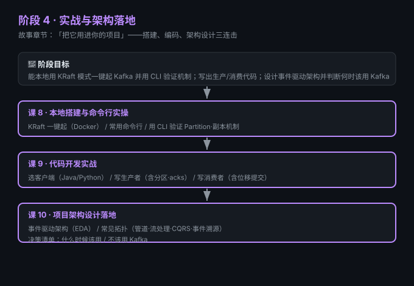

# 阶段 4：实战与架构落地

> 所属课程：Kafka 系统学习 ｜ 故事章节：「把它用进你的项目」 ｜ 上一阶段：[阶段 3](../3-可靠性与高可用/overview.md)

## 🎯 本阶段目标

- 能本地用 KRaft 模式一键起 Kafka，并用命令行验证前几课的机制
- 写出最小可用的生产者 / 消费者代码（Java 或 Python 二选一即可）
- 设计基于 Kafka 的事件驱动架构，并判断"什么时候该用 / 不该用 Kafka"

## 📍 学习重点

- **KRaft 是现在唯一模式**：ZooKeeper 已在 Kafka 4.0 移除，搭建直接走 KRaft
- **代码回扣架构**：生产者/消费者代码是为"项目架构"服务的，不是孤立练习
- **决策比写法更重要**：知道 Kafka 不适合什么，比会写代码更值钱

## ✅ 必须掌握的知识点

| 知识点 | 所属课 | 学完应能 |
|--------|--------|----------|
| KRaft 一键起（Docker） | 课8 | 本地起一个单节点 Kafka |
| 常用命令行 | 课8 | 创建 topic、生产、消费 |
| CLI 验证机制 | 课8 | 用命令验证 Partition/副本 |
| 选客户端与环境 | 课9 | 配好 Java/Python 客户端 |
| 写生产者 | 课9 | 写出发送消息的代码 |
| 写消费者 | 课9 | 写出带位移提交的消费代码 |
| 事件驱动架构 EDA | 课10 | 说清 EDA 与 Kafka 的关系 |
| 常见拓扑 | 课10 | 列举管道/流处理/CQRS/事件溯源 |
| 决策清单 | 课10 | 给出该不该用 Kafka 的判断 |

## 🗺️ 本阶段路径图

## 本阶段产出

- [ ] `lessons/lesson-08-setup-cli.md`
- [ ] `lessons/lesson-09-coding.md`
- [ ] `lessons/lesson-10-architecture-patterns.md`
