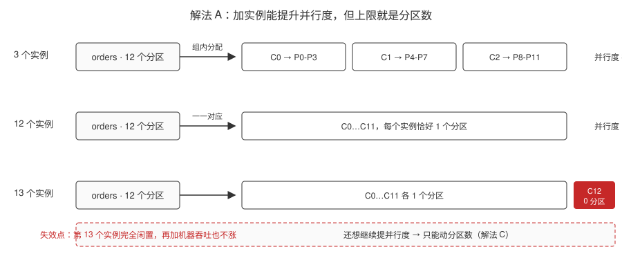
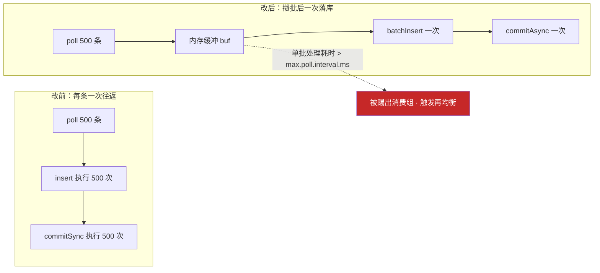
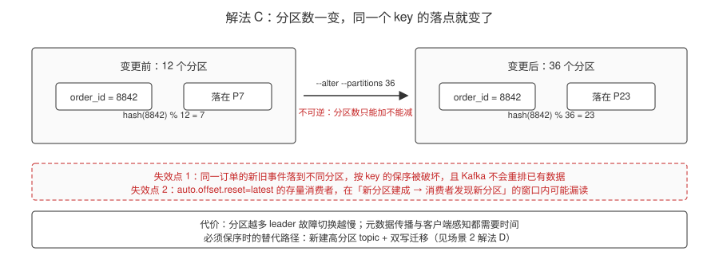
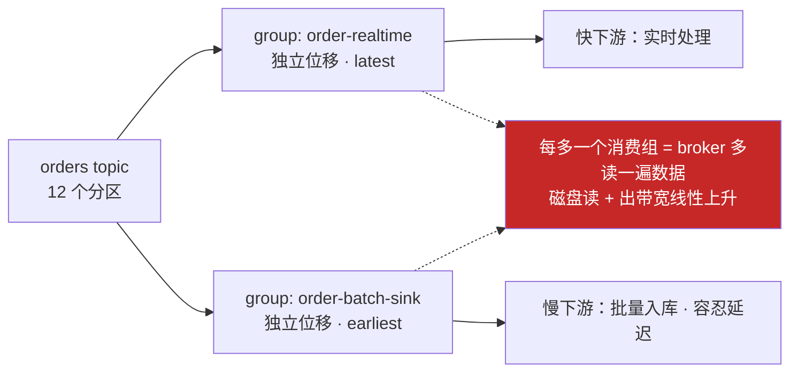
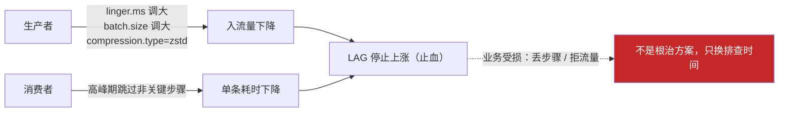
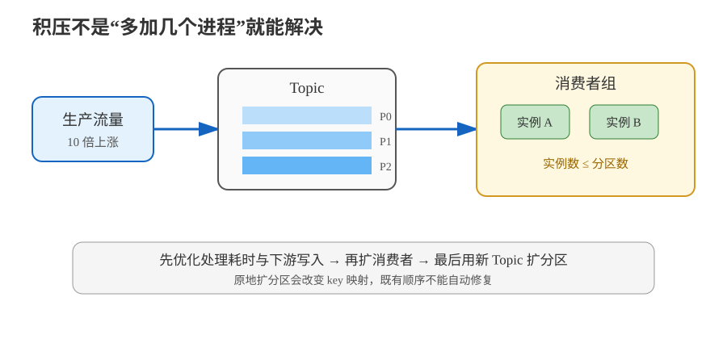

# 场景 1：流量涨 10 倍，消费者追不上（规模压力题）

**场景描述**：`orders` topic 12 个分区，消费组 `order-processor` 有 3 个实例。大促开始后 40 分钟，`records-lag-max` 从 1 万涨到 50 万且仍在上涨，下游报表延迟超过 1 小时。

**🔒 先自己想 30 秒**：第一反应是"加机器"吗？加到几个才有效？如果加了 20 个还不够呢？

<details><summary>💡 提示（分层 / 分维度想）</summary>

- **量**：当前并行度是多少？并行度的上限由什么决定？
- **质**：是"每个消费者都慢"，还是"只有个别分区特别慢"？
- **不可逆性**：分区数这个开关，按下去了还能退回来吗？

</details>

<details><summary>📖 展开解法</summary>

### 解法一览（效果按题定制：并行度上限 / 保序风险）

| 解法 | 并行度上限 / 保序风险 | 代价 | 适用边界 |
|------|----------------------|------|---------|
| **A · 扩消费者实例** | 并行度：3 → 12（吃满分区数）；保序风险：无 | 超过分区数的实例完全闲置（一个分区在同一组内只能被一个消费者消费）；加实例会触发再均衡 | 分区数有余量 && 消费逻辑本身不慢 |
| **B · 优化单条消费逻辑** | 并行度：不变；保序风险：无（吞吐靠单条提速） | 开发改造成本；需要定位瓶颈（批量写库 / 异步 IO / 减少同步远程调用） | 消费者是"真慢"而非"不够多"时，收益最大 |
| **C · 扩分区（12→36）** | 并行度：12 → 36；保序风险：**已有 key 的映射被破坏** | **不可逆**（官方明确：Kafka 不支持减少分区数）；改变 key→分区映射破坏保序；元数据传播延迟；`auto.offset.reset=latest` 的消费者可能漏读新分区；更多分区 = 更长的 leader 故障切换时间 | 确认**长期**容量需求且不依赖 key 保序时 |
| **D · 拆出独立消费组** | 并行度：各下游按自己的组独立计算；保序风险：无（组内位移互不干扰） | 同一份数据被读多遍，带宽与 broker 负载上升 | 一个 topic 有多个速度差异大的下游消费者 |
| **E · 生产端限流 / 消费端降级** | 并行度：不提升（只让 LAG 停止上涨）；保序风险：无 | 业务受损（丢弃非关键步骤 / 拒绝部分流量） | 仅作为**止血手段**，不是根治方案 |

> **扩分区的具体副作用**（Confluent 官方最佳实践文档，核查于 2026-08）：
> ① `hash(key) % 分区数` 的映射逻辑随分区数变化，同一个 key 扩容后可能落到不同分区，**已有 key 的顺序保证会被破坏**，且 Kafka **不会**自动重排已有数据；
> ② 配置为 `auto.offset.reset=latest` 的存量消费者，在"新分区建成"到"消费者发现新分区"的窗口内可能漏消息；
> ③ 分区数变多会拉长 leader 故障切换时间。

### 各解法详解（思路 + 关键代码）

#### 解法 A · 扩消费者实例

**思路**：同一消费组内，一个分区只能被一个消费者消费。3 个实例时每人分摊 4 个分区；扩到 12 个实例，每人 1 个分区，并行度吃满。**加到 13 个，第 13 个完全闲置**。

关键是让实例数与分区数匹配，并控制每次加入的节奏（一次全上会触发多轮再均衡）：



> 读图指引：同样是 12 个分区——3 个实例时每人分 4 个，12 个实例时一一对应、并行度吃满，**加到 13 个时第 13 个（红框）分不到任何分区**，再加机器也不会更快。

```bash
# 1. 先看当前 LAG 分布：是全局慢，还是热分区？
kafka-consumer-groups.sh --bootstrap-server localhost:9092 \
  --describe --group order-processor

# 关注三列：LAG（总积压）、CURRENT-OFFSET、LOG-END-OFFSET
# 若某个分区 LAG 远高于其他 → 热分区，加实例无效（转解法 B/场景 2）
```

```java
// 2. 扩实例时避免"一次全上触发多轮再均衡"：
//    用静态成员资格，滚动重启期间不触发再均衡
props.put(ConsumerConfig.GROUP_INSTANCE_ID_CONFIG, "order-processor-" + podIndex);
// 配合调大 session.timeout.ms，给滚动重启留足时间
props.put(ConsumerConfig.SESSION_TIMEOUT_MS_CONFIG, 45_000);
```

> ⚠️ `group.instance.id` 必须**每个实例唯一**（用 Pod 序号 / 主机名）。重复会导致两个实例互相顶掉，表现为反复再均衡。

#### 解法 B · 优化单条消费逻辑

**思路**：吞吐 = 并发数 × 单条处理速度。A 提升前者，B 提升后者。最常见的瓶颈是"每条消息一次数据库往返"——改成批量写 + 异步 IO：



> 读图指引：上排是改前每条一次数据库往返 + 一次同步提交，下排是攒够 500 条一次写入、一次异步提交。**红框是失效点**：批量越大单批耗时越长，一旦超过 `max.poll.interval.ms`（默认 300000ms）消费者会被踢出组，优化直接变成事故。


```java
// 反例：每条一次往返，1 万条 = 1 万次 DB 往返
for (ConsumerRecord<String, Order> r : records) {
    orderDao.insert(r.value());          // ❌ N 次往返
    consumer.commitSync();               // ❌ 每条同步提交
}

// 正例：批量拉取 + 批量落库 + 批量提交位移
final int BATCH = 500;
List<Order> buf = new ArrayList<>(BATCH);
while (true) {
    ConsumerRecords<String, Order> rs = consumer.poll(Duration.ofMillis(1000));
    for (ConsumerRecord<String, Order> r : rs) {
        buf.add(r.value());
        if (buf.size() >= BATCH) {
            orderDao.batchInsert(buf);   // ✅ 1 次往返写 500 条
            buf.clear();
            consumer.commitAsync();      // ✅ 异步提交
        }
    }
}
```

```python
# 同理，Python 侧用批量写 + 手动提交
from confluent_kafka import Consumer

c = Consumer({
    "bootstrap.servers": "localhost:9092",
    "group.id": "order-processor",
    "enable.auto.commit": False,      # 关自动提交，处理完再提交
    "max.poll.records": 500,          # 一次多拉点，摊薄 poll 开销
})

buf = []
while True:
    msg = c.consume(timeout=1.0)      # 或 consume(num_messages=500)
    if msg is None:
        continue
    buf.append(msg.value())
    if len(buf) >= 500:
        db.batch_insert(buf)          # 批量落库
        buf.clear()
        c.commit(asynchronous=True)   # 异步提交
```

> ⚠️ 批量化的隐含约束：`max.poll.records` 调大后，**单批处理时间必须仍小于 `max.poll.interval.ms`**（默认 300000ms），否则被踢出组。批量越大，越要盯这个指标——这是"优化"变成"事故"的经典路径。

#### 解法 C · 扩分区（12 → 36）

**思路**：分区数是并行度的硬上限。扩分区能突破它，但**不可逆**。



> 读图指引：同一个 `order_id` 在 12 分区时落在 P7，扩到 36 分区后落在 P23——落点变了，这个订单的新旧事件就分居两个分区，**按 key 的保序随之断裂且无法回退**；红框另标出 `auto.offset.reset=latest` 的存量消费者在感知新分区之前的漏读窗口。

```bash
# 扩分区（只能加，不能减）
kafka-topics.sh --bootstrap-server localhost:9092 --alter \
  --topic orders --partitions 36

# 扩完务必确认新分区都有 leader
kafka-topics.sh --bootstrap-server localhost:9092 --describe --topic orders
```

```java
// 生产者侧：如果要保序，必须显式指定 key
// 不指定 key（或 key=null）→ 粘性分区器轮转，同一订单的不同事件会散到不同分区
producer.send(new ProducerRecord<>("orders", order.getId(), event));
//                                            ↑ key = order_id，保序的关键
```

> ⚠️ **扩分区会改变 key→分区映射**：`hash(key) % 36` ≠ `hash(key) % 12`，同一个订单的事件可能落到不同分区，**保序被破坏且无法回退**。必须保序就别走这条路，改走[场景 2](场景-02-保序与并发.md) 解法 D（新建高分区 topic + 双写迁移）。

#### 解法 D · 拆出独立消费组

**思路**：一个 topic 有多个速度差异大的下游时，慢的会拖累快的（因为它们共享同一个消费组的位移）。拆成不同 `group.id`，各自按自己的节奏消费：



> 读图指引：同一个 topic 被两个 `group.id` 各读一遍，快慢下游的位移互不干扰，慢的再也拖不住快的。**红框是代价**：组数不是免费的，每加一个组 broker 就多读一遍数据。

```java
// 快速下游：实时处理，从最新开始
props.put(ConsumerConfig.GROUP_ID_CONFIG, "order-realtime");
props.put(ConsumerConfig.AUTO_OFFSET_RESET_CONFIG, "latest");

// 慢速下游：批量入库，容忍延迟，独立位移互不干扰
props.put(ConsumerConfig.GROUP_ID_CONFIG, "order-batch-sink");
props.put(ConsumerConfig.AUTO_OFFSET_RESET_CONFIG, "earliest");
props.put(ConsumerConfig.MAX_POLL_RECORDS_CONFIG, 2000);  // 慢下游一次多拉
```

> ⚠️ 每多一个消费组，broker 就要多读一遍数据。组数不是免费的——会线性增加磁盘读与网络出带宽。

#### 解法 E · 生产端限流 / 消费端降级（止血）

**思路**：这不是根治方案，是"让 LAG 先别涨了，赢得排查时间"。



> 读图指引：生产端攒批压缩、消费端降级两条箭头都指向同一个目标——让 LAG 停止上涨。**红框是它的本质**：这是用业务受损换时间，并行度与单条耗时这两个根因一个都没解决。


```java
// 生产者侧限流：牺牲吞吐换 LAG 稳定
props.put(ProducerConfig.LINGER_MS_CONFIG, 100);       // 攒批更久，批次更大更少
props.put(ProducerConfig.BATCH_SIZE_CONFIG, 65536);    // 64KB
props.put(ProducerConfig.COMPRESSION_TYPE_CONFIG, "zstd");  // 压缩降带宽
```

```java
// 消费端降级：跳过非关键步骤，只保核心链路
if (!isPeakHours()) {
    enrichWithUserProfile(order);   // 高峰期跳过 enrichment，直接落库
}
```

### 替代路线（非 Kafka 技术栈）

| 替代方案 | 思路 | 与 Kafka 方案的差异 |
|---|---|---|
| **Pulsar** | 将 broker 接入层与持久化层分开，按计算或存储压力分别扩展 | 扩容边界不同，但仍要做分区、消费者并行度和积压治理；不是自动消除热点 |
| **托管流平台** | 让平台承担 broker 节点和部分容量调度，团队聚焦消费逻辑与下游 | 少做底层迁移，但费用、扩容时机和故障排查权限受平台约束 |

### 推荐路径（递进，不是一次全上）

1. **先分诊**：按 [故障模式 1](../08-实战经验.md) 判断是全局性积压还是热分区——**热分区加实例完全无效**。
2. **优化消费逻辑**（B）：批量写库、异步 IO、把非关键步骤挪出主链路。这是性价比最高的一步。
3. **扩消费者到分区数**（A）：3 → 12 个实例，注意观察再均衡是否稳定。
4. **仍不够再考虑扩分区**（C）：若必须保序，改走**新建高分区 topic + 双写迁移**（见[场景 2](场景-02-保序与并发.md) 的解法 D），而不是原地 `--alter`。
5. **全程保留 E 作为止血开关**：限流让 LAG 先停住，赢得排查时间。

### 知识点挂钩

- 分区数决定最大消费并行度 → 阶段 2 · [课 4 Topic、Partition 与 Broker](../stages/2-核心架构/lessons/lesson-04-Topic、Partition与Broker.md)
- 一个分区在组内只被一个消费者消费、再均衡 → 阶段 2 · [课 6 消费者与消费者组](../stages/2-核心架构/lessons/lesson-06-消费者与消费者组.md)
- key → 分区的映射、粘性分区 → 阶段 2 · [课 5 生产者 Producer](../stages/2-核心架构/lessons/lesson-05-生产者Producer.md)
- **解法映射**：A/B/D → [课 6](../stages/2-核心架构/lessons/lesson-06-消费者与消费者组.md)；C → [课 4](../stages/2-核心架构/lessons/lesson-04-Topic、Partition与Broker.md) + [课 5](../stages/2-核心架构/lessons/lesson-05-生产者Producer.md)；E → [课 15](../stages/6-运维与可观测/lessons/lesson-15-监控与可观测.md)

### 什么情况下此方案不适用

- **要求全局严格保序**：扩分区会直接破坏保序，只能先优化消费逻辑或走双写迁移（见[场景 2](场景-02-保序与并发.md)）。
- **瓶颈在下游数据库**：消费再快，写库慢也是白搭——先解决下游容量，否则只是把积压从 Kafka 搬到应用内存。

### 做错会踩的坑

- 未分诊就加机器 → 热分区场景白加（[故障模式 1](../08-实战经验.md)）。
- 单批处理时间超过 `max.poll.interval.ms` → 消费者被踢出组引发再均衡，越加越乱（[故障模式 7](../08-实战经验.md)）。
- 原地扩分区 → 保序被破坏且无法回退（本场景解法 C）。

</details>



> 读图指引：从左到右看"流量 → 分区 → 消费者组"；底部强调扩实例受分区数约束，扩分区必须伴随迁移与顺序评估。

---

➡️ **返回**：[场景解法库索引](INDEX.md) ｜ **下一场景**：[场景 2 既要保序又要并发](场景-02-保序与并发.md)
