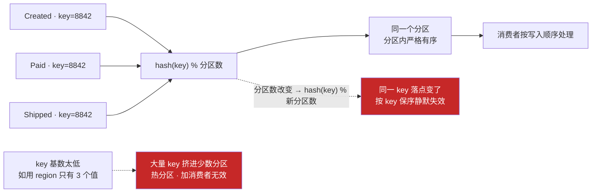
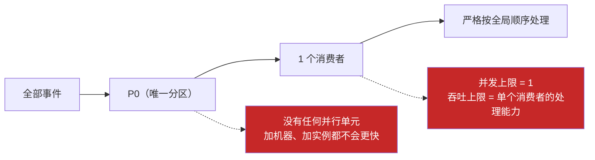
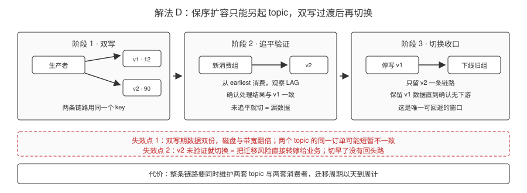
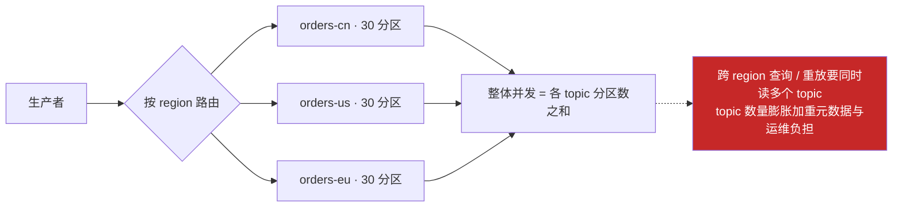
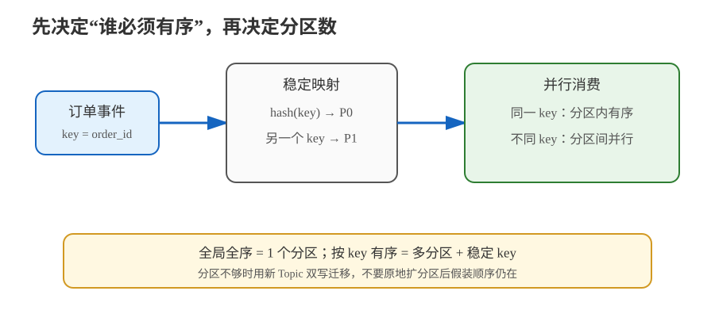

# 场景 2：既要保序又要并发（经典设计题）

**场景描述**：订单状态机严格要求"同一订单的 `Created → Paid → Shipped` 必须按顺序处理"，乱序会导致状态回退。同时业务量要求至少 30 个并发消费者。当前 topic 只有 12 个分区。

**🔒 先自己想 30 秒**：保序的**粒度**是什么？是"所有订单全局有序"，还是"单个订单内有序"？这两句话对应完全不同的设计。

<details><summary>💡 提示（分维度想）</summary>

- **粒度**：先确认要的是"全局全序"还是"按 key 有序"——大多数业务其实只要后者。
- **约束**：保序要求 key→分区映射稳定，那"扩容"和"保序"的冲突点在哪？
- **退路**：如果投递顺序保证不了，能不能在消费端补救？

</details>

<details><summary>📖 展开解法</summary>

### 解法一览（效果按题定制：保序粒度 / 并发上限）

| 解法 | 保序粒度 / 并发上限 | 代价 | 适用边界 |
|------|--------------------|------|---------|
| **A · 按业务键分区（key = order_id）+ 分区数一次建够** | 保序粒度：单个 key（同一订单）；并发上限：= 分区数（建 topic 时定） | 分区数在建 topic 时就锁死（后续扩容会破坏映射）；key 基数太低会造成热分区 | 绝大多数"按实体保序"场景的正解 |
| **B · 单分区（1 个分区）** | 保序粒度：**全局全序**；并发上限：**1（单点）** | 吞吐完全无法扩展，单点上限 | 只有配置变更、全局序列号这类低吞吐强全序场景 |
| **C · 消费端重排（按版本号/序号缓冲）** | 保序粒度：投递可乱序、处理前按序号重排（受窗口限制）；并发上限：= 分区数 | 消费端复杂度显著上升；需要定义"乱序窗口"（等多久算齐） | 生产者无法控制分区策略，或需要容忍乱序的高吞吐场景 |
| **D · 新建高分区 topic + 双写迁移** | 保序粒度：单个 key（迁移期两版本短暂不一致）；并发上限：= 新 topic 分区数 | 需要双写一段时间、迁移期数据双份、切换有风险 | 原 topic 分区数不够且必须保序时的**唯一稳妥扩容路径** |
| **E · 按维度拆分 topic**（如按 region 拆 `orders-cn`、`orders-us`） | 保序粒度：每个子 topic 内单 key 有序（跨 topic 无全局序）；并发上限：= 各 topic 分区数之和 | topic 数量膨胀；跨 region 的查询/重放变复杂 | key 本身有天然的高层分类维度 |

### 各解法详解（思路 + 关键代码）

#### 解法 A · 按业务键分区 + 分区数一次建够（默认解）

**思路**：保序的真正粒度是「同一 key 落到同一分区」。用 `order_id` 当 key，同一个订单的所有事件必然进同一分区，而分区内是严格有序的。



> 读图指引：带同一个 `order_id` 的三个事件经同一个哈希落到同一分区，分区内天然有序，这就是"按 key 保序"的全部机制。**红框是两个失效点**：分区数一旦改变，落点跟着变、保序静默失效；key 基数太低则全部挤进少数分区形成热分区。

```java
// 指定 key —— 这一行决定了保序与否
producer.send(new ProducerRecord<>("orders", orderId, event));
//                                          ↑ key：同 key → 同分区 → 分区内有序
```

```bash
# 建 topic 时把分区数一次建够（只能加不能减，事后再改会破坏 key 映射）
# 预期最大并发 30 → 建 60~90 个分区（留 2~3 倍余量）
kafka-topics.sh --bootstrap-server localhost:9092 --create \
  --topic orders --partitions 90 --replication-factor 3
```

```python
# Python 侧同理：key 是保序的开关
producer.produce("orders", key=str(order_id), value=json.dumps(event))
#                          ↑ 不传 key → 轮转发散 → 同一订单的事件乱序
```

> ⚠️ key 的选择直接决定负载均衡：用 `order_id`（高基数）能均匀分散；用 `region`（低基数，如只有 3 个值）会造成严重热分区。

#### 解法 B · 单分区（真·全局全序）

**思路**：只有在确实需要全局全序时才用。1 个分区 = 全局有序，但吞吐完全无法扩展。



> 读图指引：所有事件只有一条路可走，全局顺序天然成立——**代价也全在这条路上**：并行度被锁死为 1，吞吐上限就是单个消费者的处理能力，加机器没有任何帮助。

```bash
# 只有 1 个分区，所有消息按写入顺序被消费
kafka-topics.sh --bootstrap-server localhost:9092 --create \
  --topic global-seq --partitions 1 --replication-factor 3
```

> ⚠️ 吞吐上限约为**单个消费者的处理能力**。只适合配置变更、全局序列号这类低吞吐场景。

#### 解法 C · 消费端重排（生产者不可控时）

**思路**：允许投递乱序，在消费端按序号缓冲排序后再处理。关键是定义「乱序窗口」——等多久算齐了。


> 读图指引：乱序到达的事件先按 `order_id` 分组、按序号排序，只有从期望序号开始的连续段才往前推。**红框是它的代价**：缺号会一直占着缓冲（必须定义超时），且重启会丢缓冲——所以它是最后手段，不是默认方案。

```java
// 按 order_id 分组，在窗口内按 seq 排序后处理
Map<String, TreeMap<Integer, OrderEvent>> pending = new HashMap<>();
Map<String, Integer> expected = new HashMap<>();

void onEvent(OrderEvent e) {
    pending.computeIfAbsent(e.orderId(), k -> new TreeMap<>()).put(e.seq(), e);
    TreeMap<Integer, OrderEvent> g = pending.get(e.orderId());
    int want = expected.getOrDefault(e.orderId(), 0);
    // 只处理从期望序号开始的连续段
    while (!g.isEmpty() && g.firstKey() == want) {
        process(g.pollFirstEntry().getValue());
        want++;
        expected.put(e.orderId(), want);
    }
}
```

> ⚠️ 三条硬约束：① 必须定义超时，否则等不到的序号会永久占用内存；② 重启会丢缓冲，需持久化或接受重放；③ 窗口越大延迟越高。**这是最后手段，不是默认方案**。

#### 解法 D · 新建高分区 topic + 双写迁移（保序扩容的唯一稳妥路径）

**思路**：原地扩分区会破坏 key 映射，所以另起一个高分区 topic，双写一段时间再切。



> 读图指引：从左到右走三步——双写 v1+v2、新消费组从 `earliest` 追平验证、停写 v1 并下线旧消费组。**红框是它的代价与失效点**：双写期数据双份、两个 topic 的同一订单可能短暂不一致，而 v2 没验证就切换等于把迁移风险直接交给业务。

```java
// 迁移期：双写 v1 + v2（v2 为 90 分区的新 topic）
producer.send(new ProducerRecord<>("orders-v1", orderId, event));
producer.send(new ProducerRecord<>("orders-v2", orderId, event));
```

```bash
# 1. 新消费者组从 earliest 消费 v2，观察是否追平
kafka-consumer-groups.sh --bootstrap-server localhost:9092 \
  --group order-processor-v2 --describe

# 2. 确认 v2 消费无异常后，停写 v1、下线旧消费者组
```

> ⚠️ 双写期数据双份（磁盘与带宽翻倍）；两个 topic 的同一订单可能短暂不一致。切换前必须确认 v2 消费无异常。

#### 解法 E · 按维度拆分 topic

**思路**：key 本身有天然分类维度时（如 region），按维度拆成多个 topic，每个 topic 内保序，整体并发度是各 topic 分区数之和。



> 读图指引：按高层维度拆成多个 topic，每个 topic 内各自保序，并发度是各 topic 分区数之和。**红框是代价**：跨 region 的查询与重放要同时读多个 topic，且 topic 数量膨胀会加重元数据与运维负担。

```java
// 按 region 路由到不同 topic
String topic = "orders-" + order.getRegion();   // orders-cn / orders-us / orders-eu
producer.send(new ProducerRecord<>(topic, orderId, event));
```

> ⚠️ 跨 region 的查询与重放会变复杂（要同时读多个 topic）；topic 数量膨胀会增加元数据与运维负担。

### 替代路线（非 Kafka 技术栈）

| 替代方案 | 思路 | 与 Kafka 方案的差异 |
|---|---|---|
| **RabbitMQ 分片队列** | 低吞吐场景按业务键把任务路由到固定队列，每个队列内部有序 | 队列确认和路由更直接，但队列数量、重放能力和大规模日志保留不如 Kafka 友好 |
| **数据库序列化写入** | 由数据库序列号或单 worker 生成全局顺序，适合低并发强顺序 | 实现简单但吞吐上限低，数据库会成为唯一瓶颈；不适合高吞吐事件流 |

### 推荐路径

1. **先确认保序粒度**：要"全局全序"就只能 B（1 分区），别挣扎；要"按订单有序"就走 A。
2. **A 是默认解**：建 topic 时就把分区数按"预期最大并发 × 2-3"建够——因为分区数只能加不能减，**建的时候多留余量的成本，远低于事后迁移的成本**。
3. **分区不够且必须保序** → 走 D：新建 `orders-v2`（36 分区）→ 生产者双写 v1+v2 → 消费者组切换到 v2 且从 earliest 消费验证 → 观察无误后停写 v1。
4. **C 是兜底**：只有当生产者不可控（第三方发送）时才考虑消费端重排。

### 知识点挂钩

- key → 分区映射、粘性分区器 → 阶段 2 · [课 5 生产者 Producer](../stages/2-核心架构/lessons/lesson-05-生产者Producer.md)
- 分区内有序、分区是并行度单位 → 阶段 2 · [课 4 Topic、Partition 与 Broker](../stages/2-核心架构/lessons/lesson-04-Topic、Partition与Broker.md)
- 消费端幂等与重复处理 → 阶段 3 · [课 8 交付语义与幂等](../stages/3-可靠性与高可用/lessons/lesson-08-交付语义与幂等.md)
- **解法映射**：A → [课 4](../stages/2-核心架构/lessons/lesson-04-Topic、Partition与Broker.md) + [课 5](../stages/2-核心架构/lessons/lesson-05-生产者Producer.md)；B/E → [课 4](../stages/2-核心架构/lessons/lesson-04-Topic、Partition与Broker.md)；C → [课 6](../stages/2-核心架构/lessons/lesson-06-消费者与消费者组.md)；D → [课 5](../stages/2-核心架构/lessons/lesson-05-生产者Producer.md) + [课 8](../stages/3-可靠性与高可用/lessons/lesson-08-交付语义与幂等.md)

### 什么情况下此方案不适用

- **真·全局全序**：任何多分区方案都给不了，只有 1 分区或消费端重排。
- **key 分布极度不均**（如 90% 流量来自同一个大客户）：保序和负载均衡会直接打架，此时需要给 key 加后缀打散，但**打散后就不再保序**——这是必须做取舍的地方。

### 做错会踩的坑

- 原地扩分区 → key 映射改变，保序静默失效（Confluent 官方明确警告，见[场景 1](场景-01-消费者追不上.md) 引用）。
- key 基数太低（用常量 / `None` / 布尔值当 key）→ 所有消息挤进少数分区，形成热分区（[故障模式 1](../08-实战经验.md)）。
- 本地同步重试导致分区阻塞 → 再均衡（[故障模式 7](../08-实战经验.md)）。

</details>



> 读图指引：先沿着业务 key 看它如何稳定落到分区，再看不同 key 如何并行；底部是全局全序与多分区并发的不可兼得关系。

---

➡️ **返回**：[场景解法库索引](INDEX.md) ｜ **上一场景**：[场景 1](场景-01-消费者追不上.md) ｜ **下一场景**：[场景 3](场景-03-双写一致性.md)
