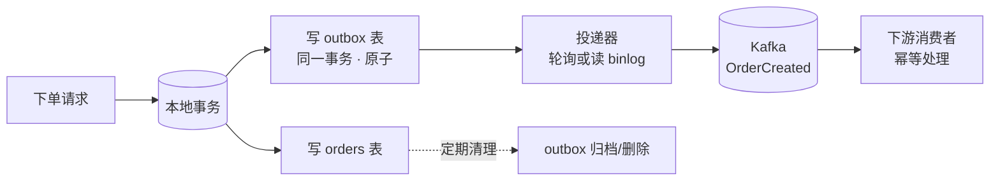

# 场景 3：数据库写 + 发消息的一致性（经典设计题）

**场景描述**：下单服务要"写 MySQL 订单表"并"发 `OrderCreated` 事件"。上线后出现过两次事故：一次是数据库写成功但发消息前进程崩溃，下游永远不知道有这个订单；一次是消息发出去了但本地事务回滚，下游处理了一个不存在的订单。

**🔒 先自己想 30 秒**："把写库和发消息放进一个事务"——这个想法能实现吗？Kafka 的事务能管到 MySQL 吗？

<details><summary>💡 提示（分维度想）</summary>

- **边界**：Kafka 事务的作用域到底覆盖哪些东西？
- **顺序**：先写库还是先发消息？两种顺序各自在什么时刻会出错？
- **兜底**：如果允许"短暂不一致"，靠什么收敛？

</details>

<details><summary>📖 展开解法</summary>

### 解法一览

| 解法 | 能解决到 | 代价 | 适用边界 |
|------|---------|------|---------|
| **A · 双写 + 消费端幂等 + 定时对账** | 不消除不一致，但保证**最终一致** | 需要一个对账/补偿任务；存在分钟级不一致窗口 | 流量不大、能接受短暂不一致的绝大多数业务 |
| **B · 事务性发件箱（Transactional Outbox）** | 写库与"待发消息"在同一本地事务内，原子 | 多一张 outbox 表（会膨胀，需定期清理）；需要一个投递器（轮询或 CDC） | **通用正解**：要求"不丢"且不允许凭空多出消息 |
| **C · CDC 直连 binlog（如 Debezium）** | 不改业务代码即可把数据变更变成事件 | 引入 CDC 组件与运维复杂度；表结构变更需要同步维护；捕获的是"数据变更"而非"业务意图" | 多表/遗留系统，或希望业务代码零侵入 |
| **D · Kafka 事务** | 仅保证 **Kafka 内部** 多 topic + 位移的原子性 | **管不到数据库**——写库与发消息分属两个系统，它无法把它们绑成一个事务 | 消费-处理-再生产（Kafka → Kafka）的流式链路 |
| **E · 先发消息、后写库**（或反之） | 简化顺序，仍需幂等兜底 | 两个动作之间的崩溃必然产生不一致，只是方向不同 | 只能作为 A 的变体，不是独立解法 |

### 各解法详解（思路 + 关键代码）

#### 解法 A · 双写 + 消费端幂等 + 定时对账

**思路**：不消除不一致，而是承认它、兜住它。双写后靠消费端幂等消除重复，靠对账任务消除遗漏。

```java
// 消费端幂等：以业务主键做 upsert，重复消费自动收敛
// 用"插入冲突则按需更新"替代"先查再插"（后者有竞态）
String sql = """
    INSERT INTO order_projection (order_id, user_id, amount, status, updated_at)
    VALUES (?, ?, ?, ?, ?)
    ON CONFLICT (order_id) DO UPDATE SET
        status = EXCLUDED.status,
        updated_at = EXCLUDED.updated_at
    WHERE order_projection.updated_at < EXCLUDED.updated_at   -- 只被更新的数据覆盖
    """;
```

```sql
-- 定时对账：找出"库里有但事件没发出"的订单
SELECT o.order_id
FROM orders o
LEFT JOIN outbox ob ON ob.aggregate_id = o.order_id
WHERE o.created_at > NOW() - INTERVAL '1 hour'
  AND ob.id IS NULL;      -- 有订单无 outbox 记录 = 漏发
```

> ⚠️ `WHERE updated_at < EXCLUDED.updated_at` 这行是幂等的关键——没有它，一条迟到的旧消息会覆盖新状态。

#### 解法 B · 事务性发件箱（Transactional Outbox）

**思路**：把"待发消息"写成业务库里的一行，与业务数据**同一个本地事务**。写库成功 = 消息一定会被发出（投递器负责重试）。

```sql
-- outbox 表：与业务表同库，共享事务
CREATE TABLE outbox (
    id              BIGSERIAL PRIMARY KEY,
    aggregate_type  VARCHAR(100) NOT NULL,   -- 'Order'
    aggregate_id    VARCHAR(100) NOT NULL,   -- 订单号
    event_type      VARCHAR(100) NOT NULL,   -- 'OrderCreated'
    payload         JSONB        NOT NULL,
    created_at      TIMESTAMPTZ  NOT NULL DEFAULT NOW(),
    published_at    TIMESTAMPTZ              -- 非空 = 已投递
);
CREATE INDEX idx_outbox_unpublished ON outbox (id) WHERE published_at IS NULL;
```

```java
// 关键：业务写入与 outbox 写入在同一个本地事务里
@Transactional
public void createOrder(CreateOrderCmd cmd) {
    Order order = orderRepository.save(Order.create(cmd));   // 1. 写业务表
    outboxRepository.save(OutboxEvent.of(                     // 2. 写 outbox
        "Order", order.getId(), "OrderCreated", toJson(order)));
}   // 同一 @Transactional —— 要么都成功，要么都回滚
```

```java
// 投递器（轮询版）：独立进程，读未投递记录 → 发 Kafka → 标记已投递
@Scheduled(fixedDelay = 1000)
public void publish() {
    for (OutboxEvent e : outboxRepo.findUnpublished(500)) {
        kafkaTemplate.send("OrderCreated", e.aggregateId(), e.payload()).get();
        outboxRepo.markPublished(e.id());   // 至少一次：可能重发，靠消费端幂等兜底
    }
}
```

> ⚠️ 投递器是**至少一次**语义（发完 Kafka 后、标记前崩溃 = 重发），消费端幂等仍必需——outbox 解决"丢"，幂等解决"重"，两者配套。
> ⚠️ outbox 表会持续膨胀，必须有清理任务（如删除 7 天前 `published_at IS NOT NULL` 的记录）。

#### 解法 C · CDC 直连 binlog（Debezium）

**思路**：不写业务代码，直接捕获数据库 binlog 变成事件。业务零侵入。

```json
{
  "name": "orders-connector",
  "config": {
    "connector.class": "io.debezium.connector.postgresql.PostgresConnector",
    "database.hostname": "192.0.2.10",
    "database.dbname": "shop",
    "table.include.list": "public.orders",
    "topic.prefix": "dbserver1",
    "transforms": "outbox",
    "transforms.outbox.type": "io.debezium.transforms.outbox.EventRouter",
    "transforms.outbox.route.by.field": "event_type"
  }
}
```

> ⚠️ CDC 捕获的是**数据变更**（"某行某列从 A 变成 B"），不是**业务意图**（"用户下单了"）。表结构变更需同步维护连接器配置。
> ⚠️ 示例 IP 用文档专用地址 `192.0.2.x`（RFC 5737），切勿写真实内网地址。

#### 解法 D · Kafka 事务（仅限 Kafka 内部链路）

**思路**：事务保证"写多个 topic + 提交位移"原子，适合消费-处理-再生产的流式链路。**管不到数据库**。

```java
// 正确用法：Kafka → Kafka 的流式链路
producer.beginTransaction();
try {
    for (ConsumerRecord<String, String> r : records) {
        producer.send(new ProducerRecord<>("risk-result", r.key(), process(r.value())));
    }
    producer.sendOffsetsToTransaction(offsets, consumer.groupMetadata());
    producer.commitTransaction();     // 结果与位移一起生效
} catch (Exception e) {
    producer.abortTransaction();
    throw e;
}
```

```java
// 消费端必须配合：只读取已提交的消息，否则会读到回滚数据
props.put(ConsumerConfig.ISOLATION_LEVEL_CONFIG, "read_committed");
```

> ⚠️ **这是本场景最容易犯的错**：试图用 Kafka 事务包住数据库写入。`producer.beginTransaction()` 只能管住 Kafka 的 topic 与位移，MySQL 的提交不在其管辖范围——崩溃时依然不一致。

#### 解法 E · 调整写入顺序（仍需幂等兜底）

**思路**：无论"先写库后发消息"还是"先发消息后写库"，两个动作之间的崩溃必然产生不一致，只是方向不同。只能是 A 的变体，不是独立解法。

```java
// 先写库后发消息：崩溃 → 有订单无事件（下游不知道）
orderRepo.save(order);
kafkaTemplate.send("OrderCreated", event);   // ← 这里崩了

// 先发消息后写库：崩溃 → 有事件无订单（下游处理了不存在的订单）
kafkaTemplate.send("OrderCreated", event);   // ← 这里崩了
orderRepo.save(order);
```

> ⚠️ 两种顺序都需消费端幂等 + 对账补偿才能收敛。挑一个方向，然后靠 A 兜住它。

### 推荐路径

**关键认知**：**Kafka 事务只覆盖 Kafka 内部的 topic 与 `__consumer_offsets`**（阶段 3 课 8 已讲）。它保证不了"数据库事务 + 消息投递"的原子性。想用 Kafka 事务解决跨系统一致性，是把工具的边界记错了。

**B · 事务性发件箱**的做法（microservices.io 的 Transactional Outbox 模式，Debezium 官方文档亦收录其 outbox 实现，核查于 2026-08）：



> 读图指引：业务只负责"把消息写进本地库"，投递交给独立进程。**写库成功 = 消息最终一定会被发出**（投递器可重试），因为两者在同一个本地事务里。

### 推荐路径

1. **先接受现实**：跨系统强一致是不可能的，目标是**最终一致 + 可观测**。
2. **起步用 A**：双写 + 消费端幂等（业务主键去重）+ 对账补偿任务。成本最低，能覆盖 80% 场景。
3. **要求"绝不丢"时用 B**：引入 outbox 表，投递器用轮询（简单）或 CDC（更实时、更低侵入）。
4. **多表/遗留系统用 C**：Debezium 捕获 binlog，业务代码零改动。
5. **D 只用在 Kafka 内部的流式链路**（如风控消费订单事件后写回另一个 topic），不要拿它跨数据库。

### 知识点挂钩

- 三种交付语义、幂等 producer、事务边界 → 阶段 3 · [课 8 交付语义与幂等](../stages/3-可靠性与高可用/lessons/lesson-08-交付语义与幂等.md)
- 先处理后提交、重复是必然 → 阶段 2 · [课 6 消费者与消费者组](../stages/2-核心架构/lessons/lesson-06-消费者与消费者组.md)
- 事件驱动中的事件契约 → 阶段 4 · [课 10 项目架构设计落地](../stages/4-实战与架构落地/lessons/lesson-10-项目架构设计落地.md)

### 什么情况下此方案不适用

- **要求跨系统的强一致（要么都成功要么都失败）**：Kafka 给不了，也不该由消息系统给——应改用同步事务 + 事件补偿，或重新审视这个需求本身是否成立。
- **outbox 表写入量极大且无人运维**：表膨胀会拖垮主库，必须配套清理任务与监控。

### 做错会踩的坑

- 用 Kafka 事务试图覆盖数据库 → 边界记错，问题依旧（[故障模式 6](../08-实战经验.md)）。
- 消费端没有幂等 → 至少一次语义下重复必然发生，重复扣款/重复发货（[故障模式 6](../08-实战经验.md)）。
- outbox 表无清理策略 → 主库表无限膨胀。

</details>

---

➡️ **返回**：[场景解法库索引](INDEX.md) ｜ **上一场景**：[场景 2](场景-02-保序与并发.md) ｜ **下一场景**：[场景 4](场景-04-历史数据重放.md)
