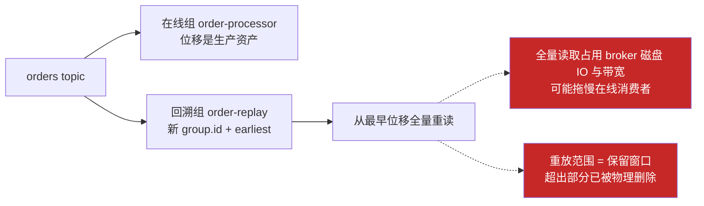
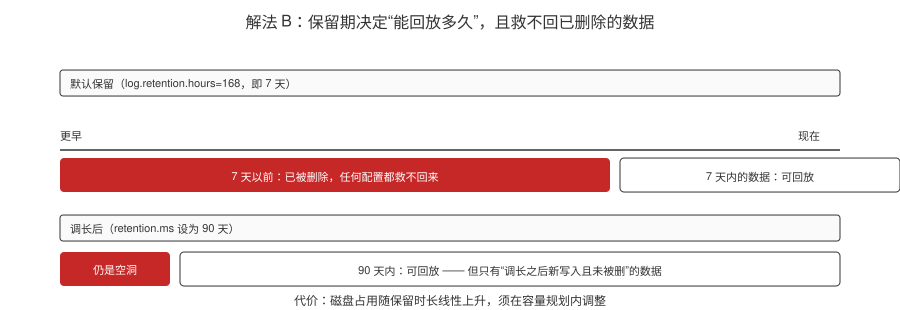
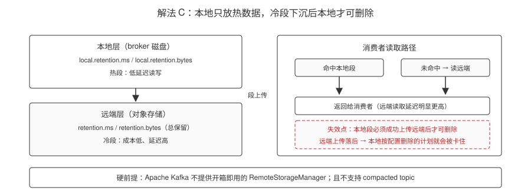
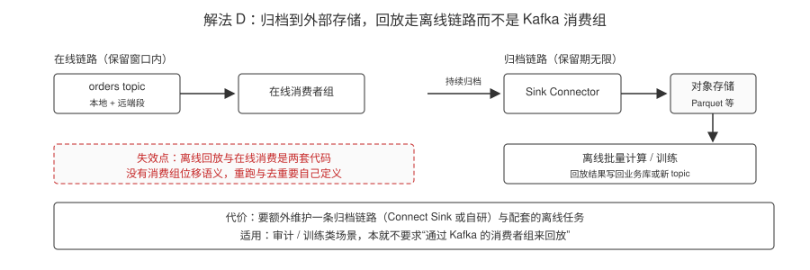
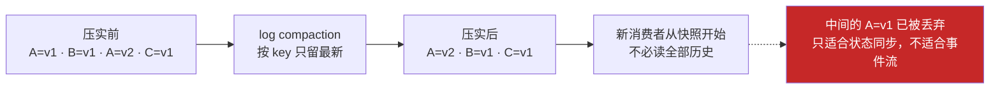
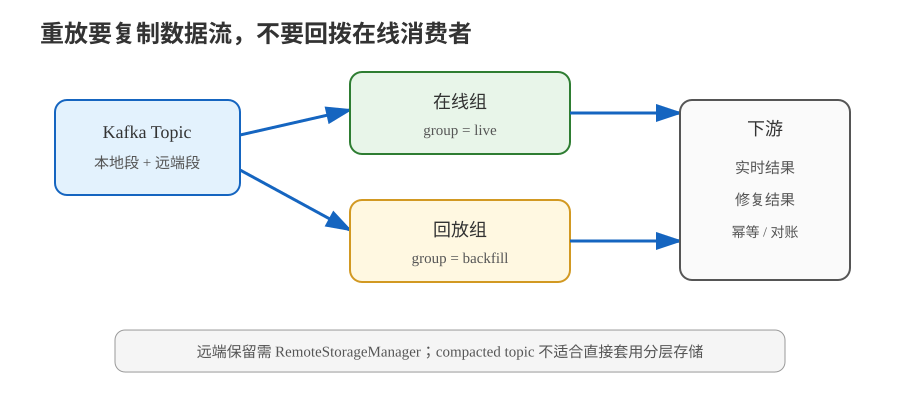

# 场景 4：新业务要消费全部历史数据（规模压力题）

**场景描述**：新上的风控服务需要"过去 90 天的全部订单"来训练与回溯。但 `orders` topic 用的默认保留策略（broker 默认 `log.retention.hours=168`，即 7 天），最早的 83 天数据早就被 Kafka 删掉了。

**🔒 先自己想 30 秒**：能不能把现有消费者组的位移重置到 90 天前，让它重新读一遍？这样做会发生什么？

<details><summary>💡 提示（分维度想）</summary>

- **安全性**：位移是**消费者组级别**的——重置它会影响到谁？
- **可行性**：数据还在吗？保留窗口之外的数据去哪了？
- **代价**：一次性读 90 天全量数据，会占用什么资源？对在线消费有什么影响？

</details>

<details><summary>📖 展开解法</summary>

### 解法一览（效果按题定制：可回放范围 / 在线影响）

| 解法 | 可回放范围 / 在线影响 | 代价 | 适用边界 |
|------|----------------------|------|---------|
| **A · 新建独立 `group.id` + `auto.offset.reset=earliest` 重放** | 可回放范围：保留窗口内全量；在线影响：**高**（抢磁盘 IO 与带宽） | 全量读取会占用 broker 带宽与磁盘 IO，**可能影响在线消费者**；处理量大时追平需要很久 | 紧急回溯，且数据在保留窗口内 |
| **B · 提前调长保留期**（`retention.ms` / `retention.bytes`） | 可回放范围：保留窗口被拉长（**只对调长之后的数据有效**）；在线影响：低 | 磁盘成本线性上升；需在容量规划内 | 已知未来会有回溯需求的 topic |
| **C · 分层存储（Tiered Storage）** | 可回放范围：本地热数据 + 远端冷数据，保留期大幅延长；在线影响：低（读远端延迟高） | 需 broker 端配置 `remote.log.storage.system.enable=true` 并**自行提供 RemoteStorageManager 实现**（Apache Kafka 不提供开箱即用实现）；**不支持 compacted topic**；远程读取每个请求只服务一个分区，可能成为吞吐瓶颈 | 数据量大、保留期长、且能接受引入远程存储组件 |
| **D · 归档到外部存储 + 离线回放** | 可回放范围：**无限**（在 Kafka 之外）；在线影响：**无**（走离线链路） | 需要额外的归档链路（Connect Sink / 自研）；离线回放与在线消费是两套代码 | 审计/训练类场景，不要求通过 Kafka 回放 |
| **E · compact topic 维护"最新状态"** | 可回放范围：**只有每个 key 的最新值**（无历史过程）；在线影响：低 | 只保留每个 key 的最新值，**会丢掉中间状态变化历史** | 状态同步类（如用户资料缓存）而**非**事件流场景 |

### 各解法详解（思路 + 关键代码）

#### 解法 A · 新建独立 group.id + earliest 重放

**思路**：回溯必须新建消费组。在线消费者组的位移是生产资产，seek 回去会让线上消费停滞。



> 读图指引：回溯必须另起 `group.id` 并从 `earliest` 读，在线组的位移不能动——**红框是两条代价**：全量读会跟在线消费者抢磁盘 IO 与带宽，而能读到的范围严格等于保留窗口。

```bash
# 1. 先确认最早一条数据的时间戳（判断数据在不在保留窗口内）
kafka-console-consumer.sh --bootstrap-server localhost:9092 \
  --topic orders --from-beginning --max-messages 1 \
  --property print.timestamp=true
```

```java
// 2. 新建独立消费组，从最早开始读
props.put(ConsumerConfig.GROUP_ID_CONFIG, "risk-backfill");   // 必须新名字
props.put(ConsumerConfig.AUTO_OFFSET_RESET_CONFIG, "earliest");
props.put(ConsumerConfig.ENABLE_AUTO_COMMIT_CONFIG, false);    // 自己控制提交节奏
```

```java
// 3. 重放要限流：一次少拉点，避免打满 broker 带宽
props.put(ConsumerConfig.MAX_POLL_RECORDS_CONFIG, 100);        // 默认 500，这里主动压小
// 或在低峰期执行；或用 pause()/resume() 做令牌桶式节流
ConsumerRecords<String, Order> rs = consumer.poll(Duration.ofMillis(1000));
for (TopicPartition tp : rs.partitions()) {
    if (brokerLoadTooHigh()) {
        consumer.pause(List.of(tp));     // 压力大就暂停该分区
    }
}
```

> ⚠️ **只新建 group.id 还不够**：全量读取会占满 broker 带宽，可能拖垮同集群的在线 topic。限流 + 低峰期执行是配套动作。

#### 解法 B · 提前调长保留期

**思路**：保留期是 topic 级配置，可以在建 topic 时就规划好"回溯窗口"。



> 读图指引：上条是默认 7 天保留——红色区间的数据已被删除，事后调长保留期也救不回来；下条是调到 90 天后，可回放范围变长，但**最左边那段空洞仍在**。**红框是它的边界**：保留期只对"调长之后新写入且未被删"的数据有效，且磁盘占用随保留时长线性上升。

```bash
# 按时间保留：改为 90 天
kafka-configs.sh --bootstrap-server localhost:9092 --alter \
  --entity-type topics --entity-name orders \
  --add-config retention.ms=7776000000     # 90 * 24 * 3600 * 1000

# 按大小保留（可选，与时间取"先到先删"）
  --add-config retention.bytes=107374182400   # 100GB
```

> ⚠️ 磁盘成本线性上升。改之前先算：日增数据量 × 保留天数 × 副本数 = 实际占用。

#### 解法 C · 分层存储（Tiered Storage）

**思路**：本地只留热数据，冷数据下沉到远程存储。保留期大幅延长而成本更低。



> 读图指引：左边两层是本地热段与远端冷段，段要先成功上传远端，本地才允许删除；右边是消费者的读取路径，命中本地就低延迟返回，未命中要回远端读。**红框是失效点**：一旦远端上传落后，本地"按配置删除"的计划就会被卡住；底部的硬前提是 Apache Kafka 不提供开箱即用的 RemoteStorageManager，且不支持 compacted topic。

```properties
# broker 端启用分层存储
remote.log.storage.system.enable=true
remote.log.storage.manager.class.name=org.apache.kafka.server.log.remote.storage.NoOpRemoteStorageManager
# ⚠️ 上面这个 NoOp 实现仅用于测试/预览，生产必须替换为真实的 RemoteStorageManager 实现
remote.log.metadata.manager.impl.prefix=rlmm.config.
rlmm.config.remote.log.metadata.topic.replication.factor=3
```

```bash
# topic 级设置：本地只留 1 小时，远端保留 90 天
kafka-configs.sh --bootstrap-server localhost:9092 --alter \
  --entity-type topics --entity-name orders \
  --add-config local.retention.ms=3600000,retention.ms=7776000000
```

> ⚠️ 三个硬约束：① **Apache Kafka 不提供开箱即用的 RemoteStorageManager**，需自行实现或选第三方；② **不支持 compacted topic**；③ 远程读取每个请求只服务一个分区，可能成为吞吐瓶颈。

#### 解法 D · 归档到外部存储 + 离线回放

**思路**：审计/训练类数据不必通过 Kafka 回放。用 Sink Connector 归档到对象存储，离线再处理。



> 读图指引：左边是在线链路（受保留窗口限制），右边是归档链路——Kafka 持续归档到对象存储，回放改由离线批量计算完成。**红框是它的代价**：离线回放与在线消费是两套代码，没有消费组位移语义，重跑与去重都得自己定义。

```json
{
  "name": "orders-s3-sink",
  "config": {
    "connector.class": "io.confluent.connect.s3.S3SinkConnector",
    "topics": "orders",
    "s3.bucket.name": "example-orders-archive",
    "s3.region": "us-east-1",
    "flush.size": "10000",
    "storage.class": "io.confluent.connect.s3.storage.S3Storage",
    "format.class": "io.confluent.connect.s3.format.parquet.ParquetFormat",
    "partitioner.class": "io.confluent.connect.storage.partitioner.TimeBasedPartitioner",
    "path.format": "'dt'=YYYY-MM-dd",
    "locale": "zh-CN",
    "timezone": "Asia/Shanghai"
  }
}
```

> ⚠️ 离线回放与在线消费是两套代码，需分别维护。归档链路本身也要监控（归档失败往往静默）。

#### 解法 E · compact topic 维护"最新状态"

**思路**：只保留每个 key 的最新值。新消费者从"当前快照"开始，不必读全部历史——但**会丢掉中间状态变化**。



> 读图指引：压实按 key 只保留最新值，新消费者从"当前快照"开始，省掉全量重放。**红框是它的边界**：中间状态变化被永久丢弃，所以它解决的是"同步当前状态"，不是"重放事件历史"。

```bash
# 启用压缩：同 key 只保留最新一条
kafka-configs.sh --bootstrap-server localhost:9092 --alter \
  --entity-type topics --entity-name orders \
  --add-config cleanup.policy=compact,min.cleanable.dirty.ratio=0.5
```

```java
// 生产者必须传 key —— 没有 key，压缩无从谈起
producer.send(new ProducerRecord<>("user-profile", userId, latestProfile));
```

> ⚠️ **只适合状态同步，不适合事件流**：`Created → Paid → Shipped` 三条事件会被压缩成最后一条 `Shipped`，中间过程永久丢失。订单状态机**不能**用 compact。

### 关键边界（回放前先判数据层）

> **重放的铁律**：回溯必须用**新的 `group.id`**。直接把在线消费者组的位移 seek 回去，会让生产环境的消费者停止处理新数据——这属于"为了修数据把线上业务搞挂"。

### 替代路线（非 Kafka 技术栈）

| 替代方案 | 思路 | 与 Kafka 方案的差异 |
|---|---|---|
| **对象存储数据湖 + Spark** | 以 Parquet 等格式归档事实数据，回放时离线扫描并写入修复结果 | 保留成本和批量计算更友好，但不具备 Kafka 消费组的实时位移语义 |
| **数据库快照 + 增量表** | 以快照承载当前状态，增量表承载近期变化，按版本回补 | 查询当前状态更快，但事件历史和多下游重放需要另行建模 |

### 推荐路径

1. **先确认数据是否还在**：用控制台消费者从最早位置试读（`kafka-console-consumer.sh --topic orders --from-beginning --max-messages 1`），看最早一条的时间戳落在哪天。保留窗口外的数据**已经物理删除**，任何配置都找不回来。
2. **数据还在 → 用 A 紧急回溯**：新建 `group.id=risk-backfill`，`auto.offset.reset=earliest`，从 earliest 开始读。
3. **重放要限流**：全量读取会打满 broker 带宽。通过限制消费者实例数、`max.poll.records` 或在低峰期执行来降低对在线消费的冲击。
4. **长期规划**：明确每个 topic 的"回溯需求窗口"，用 B（调长保留）或 C（分层存储）落地；审计类数据用 D 归档。
5. **若只需要"当前状态"**：考虑 E（compact topic），但要先确认能否接受丢掉历史变更。

### 知识点挂钩

- offset 与位移提交、`auto.offset.reset` → 阶段 2 · [课 6 消费者与消费者组](../stages/2-核心架构/lessons/lesson-06-消费者与消费者组.md)
- 日志分段、顺序写与保留策略 → 阶段 2 · [课 4 Topic、Partition 与 Broker](../stages/2-核心架构/lessons/lesson-04-Topic、Partition与Broker.md)
- `__consumer_offsets` 是位移的存储载体 → 阶段 3 · [课 7 副本机制与故障转移](../stages/3-可靠性与高可用/lessons/lesson-07-副本机制与故障转移.md)
- **解法映射**：A → [课 6](../stages/2-核心架构/lessons/lesson-06-消费者与消费者组.md)；B/E → [课 4](../stages/2-核心架构/lessons/lesson-04-Topic、Partition与Broker.md)；C/D → [课 14](../stages/5-生产落地延伸/lessons/lesson-14-分层存储与配置进阶.md) + [课 15](../stages/6-运维与可观测/lessons/lesson-15-监控与可观测.md)

### 什么情况下此方案不适用

- **保留窗口外的数据**：没有任何 Kafka 侧的方案能找回，只能从归档（D）或上游数据库重建。
- **要求重放且不影响在线消费**：全量读取必然消耗带宽，必须用独立消费组 + 限流 + 低峰期执行，做不到"零影响"。

### 做错会踩的坑

- 重置在线消费者组的位移 → 线上消费停滞，业务中断（[故障模式 1](../08-实战经验.md)）。
- 全量重放不限流 → 打满带宽，拖垮同集群的其他 topic。
- 对 compacted topic 启用分层存储 → 官方明确**不支持**。

</details>



> 读图指引：在线组与回放组从同一 Topic 分叉；回放使用新的 group.id，远端保留层只是数据来源，不改变在线组的位移。

---

➡️ **返回**：[场景解法库索引](INDEX.md) ｜ **上一场景**：[场景 3](场景-03-双写一致性.md) ｜ **下一场景**：[场景 5](场景-05-大消息.md)
