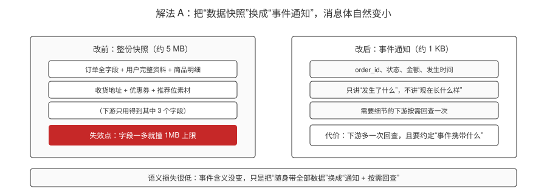
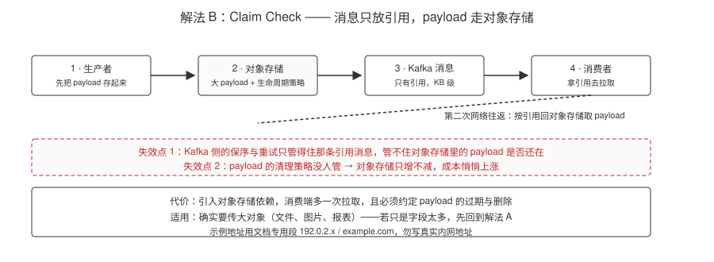
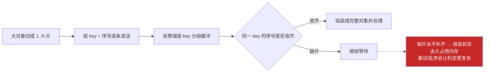
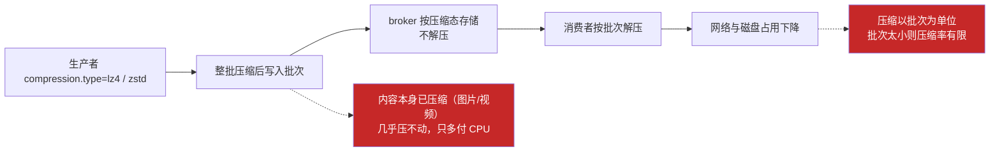
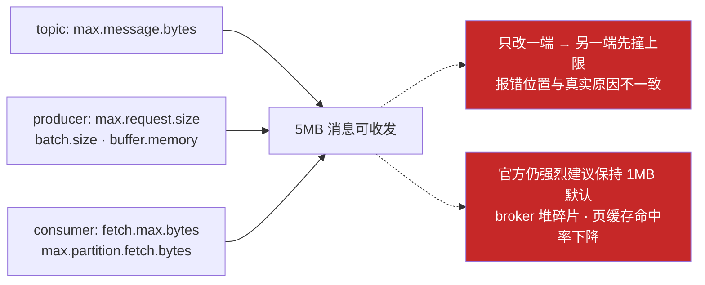
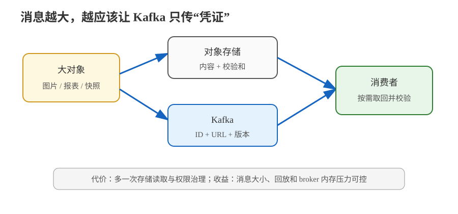

# 场景 5：消息体太大（经典设计题）

**场景描述**：订单服务要把"订单完整快照"（含商品明细、优惠明细，JSON 约 5MB）发到 Kafka。生产者直接报 `RecordTooLargeException`，或者消费者报 `RecordTooLargeException`（消息能发但取不回来）。

**🔒 先自己想 30 秒**：第一反应是不是"把 `message.max.bytes` 调大"？调大之后，Kafka 的哪些设计假设会被破坏？

<details><summary>💡 提示（分维度想）</summary>

- **本质**：Kafka 的高吞吐建立在"大量小消息批量传输"之上。5MB 的消息破坏了什么？
- **配置面**：要改的不止一个参数——生产者、broker、topic、消费者各要改哪些？
- **替代**：消息里真的必须带全部内容吗？

</details>

<details><summary>📖 展开解法</summary>

### 解法一览（效果按题定制：消息体降幅 / 语义损失）

| 解法 | 消息体降幅 / 语义损失 | 代价 | 适用边界 |
|------|----------------------|------|---------|
| **A · 消息瘦身：只发变更字段 / 只发 ID** | 消息体降幅：**大**（5MB → KB 级）；语义损失：低（事件含义不变，下游按需回查） | 下游需要回查（增加一次查询）；需要约定"事件携带什么"的规范 | **首选**：事件应是"发生了什么"，不是"数据快照" |
| **B · Claim Check（大 payload 存对象存储，消息只放引用）** | 消息体降幅：**大**（消息只剩引用）；语义损失：中（消费端多一次拉取，且要管 payload 生命周期） | 引入对象存储依赖；消费端多一次拉取；需要清理策略 | 确实需要传输大对象（文件、图片、报表） |
| **C · 拆分消息**（拆成多条带序号的小消息，消费端按 key+序号组装） | 消息体降幅：**大**（拆成多条小消息）；语义损失：中高（要维护组装状态，丢一条就卡住） | 消费端要维护组装状态；部分消息丢失会导致组装卡住；与保序/重试交互复杂 | 大对象本身可切分（如分片上传、大批量明细） |
| **D · 压缩**（`compression.type=lz4` / `zstd`） | 消息体降幅：中（取决于内容）；语义损失：**无** | 对已压缩内容（图片/视频）几乎无效；增加 CPU 开销 | 消息是文本且未压缩 |
| **E · 调大上限**（topic `max.message.bytes` + producer `max.request.size`/`batch.size`/`buffer.memory` + consumer `fetch.max.bytes`/`max.partition.fetch.bytes`） | 消息体降幅：**0**（消息没变小，只是放宽上限）；语义损失：无 | **官方强烈建议保持 1MB 默认上限**；大消息会导致 broker 堆碎片、页缓存命中率下降、客户端缓冲区需全部重调 | 最后的妥协手段，且必须在**topic 级**设置而非 broker 级 |

> **官方立场**（Confluent 生产最佳实践文档，核查于 2026-08）：强烈建议遵守 **1MB** 的默认消息上限。必须调大时要注意三类影响——broker 堆碎片、脏页缓存（大消息让页缓存能容纳的消息数骤减）、客户端缓冲区（默认按 <1MB 调优）。配套配置为：topic 级 `max.message.bytes`、producer 级 `max.request.size`/`batch.size`/`buffer.memory`、consumer 级 `fetch.max.bytes`/`max.partition.fetch.bytes`。
> 相关默认值（Kafka 4.3 官方 broker/producer 配置文档）：broker `message.max.bytes` 默认 **1048588**；producer `max.request.size` 默认 **1048576**、`batch.size` 默认 **16384**。

### 各解法详解（思路 + 关键代码）

#### 解法 A · 消息瘦身（首选）

**思路**：事件是**事实通知**，不是数据快照。先问"消费者真正需要哪些字段"。



> 读图指引：左边是"整份快照"——字段一多就撞 1MB 上限（红框）；右边是"事件通知"——只讲发生了什么，消息体降到 KB 级。**代价是底部那句**：下游需要细节时多一次回查，且团队要先约定"事件到底携带什么"。

```java
// 反例：把整个聚合根塞进消息
record OrderCreated(Order order, List<OrderItem> items,
                    List<Coupon> coupons, UserProfile user) {}   // ❌ 5MB

// 正例：只带"发生了什么" + 关键字段，明细让下游按需回查
record OrderCreated(String orderId, String userId,
                    long amountFen, String currency,
                    Instant occurredAt) {}                        // ✅ ~200B
```

```java
// 下游需要明细时，按 orderId 回查（带缓存，避免放大查询）
OrderDetail detail = cache.get(orderId, () -> orderApi.fetchDetail(orderId));
```

> ⚠️ 回查会把 Kafka 的压力转移到订单服务。高频消费场景下给回查加缓存，或改用解法 B。

#### 解法 B · Claim Check（大 payload 存对象存储）

**思路**：消息里只放引用，payload 放对象存储。消息体保持 KB 级。



> 读图指引：payload 先落地到对象存储，Kafka 里只传引用，消费者拿到引用再回对象存储取（虚线是第二次网络往返）。**红框是两条失效点**：Kafka 的保序与重试只管得住那条引用消息、管不住 payload 还在不在；payload 清理策略没人管就会只增不减。

```java
// 生产端：先存对象存储，再发引用
String url = objectStore.put("order-snapshots/" + orderId + ".json", bigPayload);
producer.send(new ProducerRecord<>("orders", orderId,
    new OrderSnapshotEvent(orderId, url, sha256(bigPayload))));
```

```java
// 消费端：拿到 url 再去拉，处理完可释放
OrderSnapshotEvent e = record.value();
byte[] payload = objectStore.get(e.url());
verifySha256(payload, e.checksum());      // 校验完整性
process(payload);
```

> ⚠️ 两个必须配套的东西：① **校验和**（对象可能被覆盖或损坏）；② **清理策略**（payload 的生命周期与消息保留期不一致，需独立回收）。

#### 解法 C · 拆分消息

**思路**：大对象可切分时，拆成多条带序号的小消息，消费端按 key + 序号组装。



> 读图指引：切片按 key + 序号发出，消费端按 key 分组、收齐后再组装。**红框是它的代价**：任何一片丢失都会让组装卡住，必须定义超时与丢弃策略；这与保序、重试相互纠缠，是五个解法里消费端最复杂的一个。

```java
// 生产端：切片 + 序号 + 总数，同 key 保证落到同一分区（从而有序）
int total = (payload.length + CHUNK - 1) / CHUNK;
for (int i = 0; i < total; i++) {
    byte[] chunk = Arrays.copyOfRange(payload, i * CHUNK, Math.min((i + 1) * CHUNK, payload.length));
    producer.send(new ProducerRecord<>("orders-chunks", orderId,
        new Chunk(orderId, i, total, chunk)));
}
```

```java
// 消费端：攒齐再组装
Map<String, Chunk[]> assembling = new HashMap<>();
void onChunk(Chunk c) {
    Chunk[] arr = assembling.computeIfAbsent(c.orderId(), k -> new Chunk[c.total()]);
    arr[c.index()] = c;
    if (Arrays.stream(arr).allMatch(Objects::nonNull)) {    // 齐了
        process(concat(arr));
        assembling.remove(c.orderId());                     // 必须清理，否则内存泄漏
    }
}
```

> ⚠️ 三个必须处理的边界：① **部分丢失会导致组装永久卡住**，需超时丢弃；② `assembling` 必须清理，否则内存泄漏；③ 与重试/DLQ 交互复杂（某一片进 DLQ 了怎么办）。

#### 解法 D · 压缩

**思路**：对文本/JSON 效果显著，对已压缩内容（图片/视频）几乎无效。是纯收益，可与 A/B/C 叠加。



> 读图指引：压缩在**批次**层面生效，broker 按压缩态存储、消费者整批解压，这是它"几乎不损失语义却省带宽"的原因。**红框是两条边界**：对已压缩内容（图片/视频）基本无效只多付 CPU；批次太小则压缩率有限。

```java
// 生产者开启压缩
props.put(ProducerConfig.COMPRESSION_TYPE_CONFIG, "zstd");   // 或 lz4（更快）/ gzip（更省）
```

```bash
# 验证压缩是否生效：看 broker 端消息的平均压缩率
kafka-run-class.sh kafka.tools.GetOffsetShell \
  --bootstrap-server localhost:9092 --topic orders --time -1
# 对比 topic 磁盘占用与原始消息大小，估算压缩比
```

> ⚠️ 压缩是 CPU 换带宽。CPU 已是瓶颈时，压缩会让情况更糟。

#### 解法 E · 调大上限（最后的妥协）

**思路**：让 5MB 消息能正常收发。**必须在 topic 级设置**，且生产端、broker 端、消费端要配套改——只改一端会报出莫名其妙的错。



> 读图指引：大消息要打通，topic / producer / consumer 三端参数必须一起调，缺任何一端都会在**另一端**报出看似莫名的错误。**红框是两条代价**：它没让消息变小，官方仍强烈建议保持 1MB 默认上限——broker 堆碎片与页缓存命中率下降是真实成本。

```bash
# broker/topic 侧（topic 级优先，不要动 broker 级默认值）
kafka-configs.sh --bootstrap-server localhost:9092 --alter \
  --entity-type topics --entity-name orders \
  --add-config max.message.bytes=5242880        # 5MB
```

```java
// 生产者侧：三个参数必须同步调大
props.put(ProducerConfig.MAX_REQUEST_SIZE_CONFIG, 5 * 1024 * 1024);
props.put(ProducerConfig.BATCH_SIZE_CONFIG,       5 * 1024 * 1024);
props.put(ProducerConfig.BUFFER_MEMORY_CONFIG,   64 * 1024 * 1024L);  // 默认 32MB 不够

// 消费者侧：同样要调，否则"能发但取不回"
props.put(ConsumerConfig.FETCH_MAX_BYTES_CONFIG, 5 * 1024 * 1024);
props.put(ConsumerConfig.MAX_PARTITION_FETCH_BYTES_CONFIG, 5 * 1024 * 1024);
```

> ⚠️ **只改一端的典型症状**：broker 改了、消费者没改 → 生产者能发，消费者报 `RecordTooLargeException`，错误信息与根因相距甚远，极难排查。

### 替代路线（非 Kafka 技术栈）

| 替代方案 | 思路 | 与 Kafka 方案的差异 |
|---|---|---|
| **对象存储 + 预签名 URL** | 文件直接走 HTTP/对象存储，消息或回调只传资源地址 | 大对象传输路径更合适，但需要单独治理权限、过期和删除，不提供 Kafka 日志回放语义 |
| **gRPC 流式传输** | 服务间直接传输可切分的内容，应用层控制流量 | 低延迟交互更自然，但没有 Kafka 的多下游独立消费与长期保留能力 |

### 推荐路径

1. **先做 A**：问一句"这条消息里有多少字段是消费者真正需要的"。事件驱动里的事件是**事实通知**——`OrderCreated { order_id, user_id, amount }` 就够了，明细让下游按需回查。
2. **大对象走 B**（claim check）：payload 写对象存储，Kafka 消息里放 `{"order_id": "...", "snapshot_url": "s3://..."}`。
3. **可切分的内容用 C**：拆成多条 + 序号，消费端组装。
4. **文本消息叠一层 D**：压缩是纯收益（CPU 换带宽），可以和 A/B/C 叠加。
5. **E 只在无法改动生产者/无法引入外部存储时**使用，且必须 topic 级设置，并把生产者/消费者缓冲区同步调大——**只改一端会报出看起来莫名其妙的错**。

### 知识点挂钩

- 批次累积与 `batch.size`/`linger.ms`、压缩 → 阶段 2 · [课 5 生产者 Producer](../stages/2-核心架构/lessons/lesson-05-生产者Producer.md)
- 页缓存与顺序写、为什么小消息更契合 → 阶段 2 · [课 4 Topic、Partition 与 Broker](../stages/2-核心架构/lessons/lesson-04-Topic、Partition与Broker.md)
- 单条超大消息会阻塞分区 → 阶段 2 · [课 6 消费者与消费者组](../stages/2-核心架构/lessons/lesson-06-消费者与消费者组.md)
- **解法映射**：A/B → [课 10](../stages/4-实战与架构落地/lessons/lesson-10-项目架构设计落地.md)；C → [课 4](../stages/2-核心架构/lessons/lesson-04-Topic、Partition与Broker.md) + [课 8](../stages/3-可靠性与高可用/lessons/lesson-08-交付语义与幂等.md)；D/E → [课 5](../stages/2-核心架构/lessons/lesson-05-生产者Producer.md) + [课 4](../stages/2-核心架构/lessons/lesson-04-Topic、Partition与Broker.md)

### 什么情况下此方案不适用

- **生产者完全不可控**（第三方系统直写）：A/B/C 都用不上，只能走 E，并接受其性能代价。
- **要求消息自带完整上下文且不可回查**（跨组织事件契约）：此时 C 或 B 更合适，不要让 broker 扛 5MB 消息。

### 做错会踩的坑

- 只改 broker 不改生产/消费端 → 一边能发一边取不回，报错信息与根因相距甚远。
- 单条超大消息处理超时 → 触发再均衡（[故障模式 7](../08-实战经验.md)）。
- 大消息导致页缓存效率下降 → 整体吞吐下降，且表现为"莫名其妙变慢"而非报错。
- 缓冲区参数只改一端 → 生产者能发、消费者取不回，报错信息（如 `RecordTooLargeException`）与根因相距甚远。

</details>



> 读图指引：大对象走对象存储，Kafka 只承载 ID、引用和校验信息；消费者按需取回，重点观察额外读取延迟与权限边界。

---

➡️ **返回**：[场景解法库索引](INDEX.md) ｜ **上一场景**：[场景 4](场景-04-历史数据重放.md) ｜ **下一场景**：[场景 6](场景-06-跨机房容灾.md)
