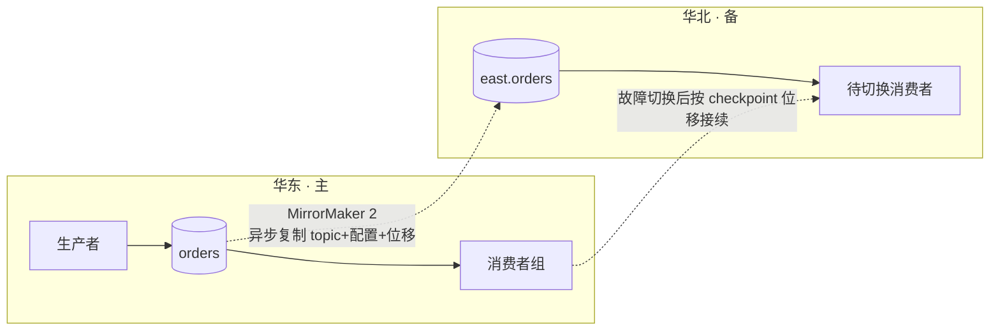
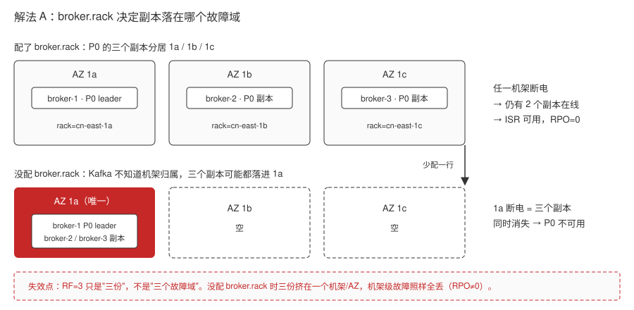
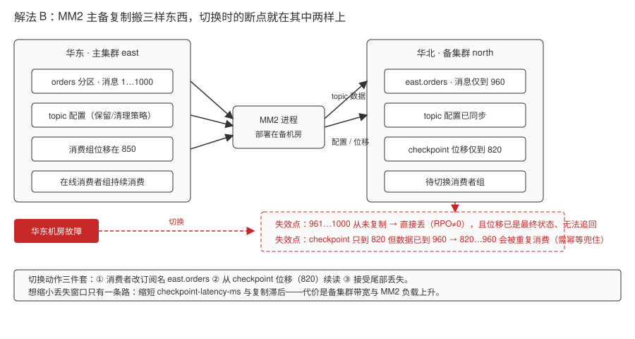
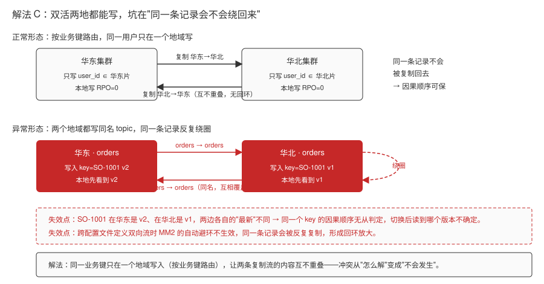
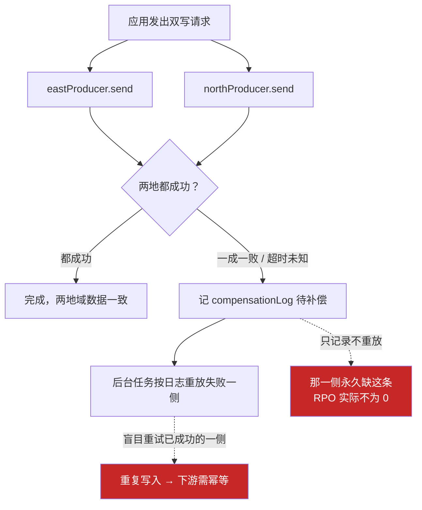
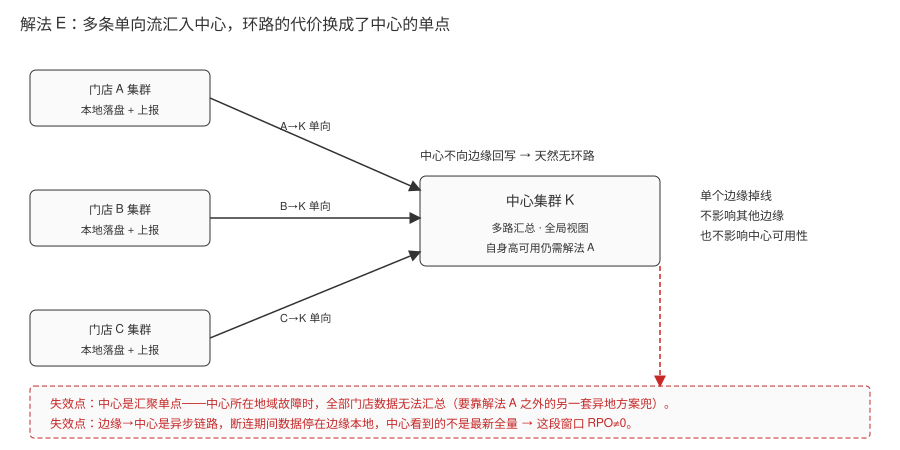
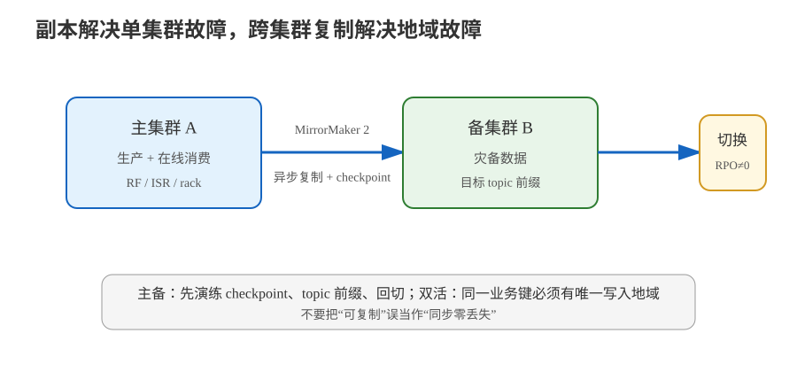

# 场景 6：跨机房容灾与多活（经典设计题）

**场景描述**：公司在华东有完整机房。监管要求"机房级故障后消息服务仍可用"，同时希望华北用户就近接入以降低延迟。当前所有 broker 都在华东单机房。

**🔒 先自己想 30 秒**：副本因子设为 3，能扛住"整个机房断电"吗？副本是跨机架还是跨机房？

<details><summary>💡 提示（分维度想）</summary>

- **故障域**：单机故障 / 单机架故障 / 单机房故障 —— 三种故障域各自对应什么机制？
- **复制方向**：数据是"异步复制"还是"同步复制"？机房故障时会不会丢最后几条？
- **切换成本**：备用机房起来后，消费者从哪个位移继续消费？

</details>

<details><summary>📖 展开解法</summary>

### 解法一览（效果按题定制：抗故障域 / RPO）

| 解法 | 抗故障域 / RPO | 代价 | 适用边界 |
|------|----------------|------|---------|
| **A · 单集群跨机架/跨 AZ + `broker.rack` 机架感知 + RF≥3 + `min.insync.replicas≥2`** | 抗故障域：抗**单机 / 单机架 / 单可用区**，**抗不了整个地域**；RPO：**0**（`acks=all` + `min.insync.replicas≥2` 时写入成功的消息不丢） | 只抗机房**内部**故障域，抗不了整个地域故障；跨 AZ 网络延迟会体现在写入延迟上 | 绝大多数"高可用"需求的**第一步**，必须先做扎实 |
| **B · MirrorMaker 2 主备复制（`A->B`）** | 抗故障域：抗**整个地域**故障；RPO：**不为 0**（异步复制，主集群挂掉时未复制完的尾部数据会丢，实际 RPO ≈ checkpoint-latency-ms / 复制滞后） | 异步复制，主集群故障时**未复制完的数据会丢**；目标端 topic 名默认带源集群前缀（`us-west.orders`），切换时消费者要改 topic 名；需运维一套 MM2 集群（基于 Kafka Connect） | 有明确 RPO 容忍度的异地容灾 |
| **C · 双活（`A->B, B->A`）** | 抗故障域：抗**整个地域**故障，且两地**都可写**（就近接入）；RPO：**每个地域只对本地写入为 0**，跨地域看到的对方数据仍有异步滞后 | 需要处理复制环路（同一配置文件定义双向流时 MM2 会自动避免，但跨配置需显式排除）；**同名 topic 的冲突与因果顺序难以保证** | 有强就近写入需求且能接受冲突处理的复杂组织 |
| **D · 应用双写**（应用同时写两个集群） | 抗故障域：取决于应用对"写失败目标"的处理，**两个集群都可写**所以地域级可抗；RPO：**理论 0，实际取决于补偿是否落地**（部分成功只记待补偿，不重试就丢） | 一致性与重试逻辑全部落在应用侧；写失败处理复杂 | 只有少量关键 topic 需要异地冗余 |
| **E · 边缘聚合**（边缘集群 → 中心集群，`A->K, B->K, C->K`） | 抗故障域：抗**单个边缘节点**故障（其他边缘继续上报），但**中心是单点**、不抗中心所在地域故障；RPO：**不为 0**（边缘→中心异步，链路断连期间的边缘数据停在边缘） | 中心集群成为单点；边缘到中心链路需监控 | 分支/门店/ IoT 数据上收 |

**MirrorMaker 2 的关键事实**（Apache Kafka 4.3 官方 Geo-Replication 文档，核查于 2026-08）：

- MM2 **基于 Kafka Connect 框架**构建，通过 connector 从源集群消费、向目标集群生产。
- 可复制 **topic 数据 + topic 配置 + 消费者组及其位移 + ACL**，并保持分区不变。
- 目标端 topic 默认命名为 **`{源集群别名}.{原 topic 名}`**（`DefaultReplicationPolicy`，分隔符可用 `replication.policy.separator` 改）。
- 消费位移由 **MirrorCheckpointConnector** 负责复制，并提供 `checkpoint-latency-ms` 指标——**切换后能不能接着消费，全看这条链路**。
- 推荐部署姿势："**远端消费、本地生产**"——把 MM2 进程部署在**目标集群**所在机房（生产者对高延迟网络比消费者更敏感），并用 `--clusters` 参数声明本地集群。
- 专有 MM2 集群自 **3.5.0** 起支持 exactly-once（需配置 `exactly.once.source.support` 与 `dedicated.mode.enable.internal.rest`）。



> 读图指引：MM2 把"数据"和"消费位移"一起搬过去，备用集群才具备"接得上"的能力。只复制数据不复制位移，切换后要么全量重放要么丢数据。

### 各解法详解（思路 + 关键代码）

#### 解法 A · 单集群跨机架/跨 AZ + 机架感知（第一步，必须先做扎实）

**思路**：让副本分布在不同的故障域。没有 `broker.rack`，Kafka 不知道哪些 broker 在同一机架，可能把三个副本都放在同一个机架上。



> 读图指引：正常路径看上半部分——`broker.rack` 把三个 broker 分别标成 1a/1b/1c，P0 的三个副本就分散到三个故障域，任一机架断电仍有 2 个副本在线，写入成功的消息不丢（RPO=0）。**红框处为什么失效**：下半部分只少配了一行 `broker.rack`，Kafka 就无从判断机架归属，三个副本可能全挤进 1a——此时 RF=3 只是"三份"而非"三个故障域"，1a 断电三个副本同时消失。

```properties
# 每个 broker 各自配置自己所在的机架/AZ
broker.rack=cn-east-1a      # 华东 1a；其他 broker 分别填 1b / 1c
```

```bash
# 建 topic 时保证副本跨机架
kafka-topics.sh --bootstrap-server localhost:9092 --create \
  --topic orders --partitions 12 --replication-factor 3

# 确认副本确实分散在不同 rack
kafka-topics.sh --bootstrap-server localhost:9092 --describe --topic orders
```

```properties
# 配套的可靠性配置
min.insync.replicas=2
unclean.leader.election.enable=false    # 宁可短暂不可用，不要数据不一致
acks=all                                 # 生产者侧配合
```

> ⚠️ `broker.rack` 配了才有效，**没配 = 三个副本可能在同一机架**，此时 RF=3 扛不住单机架故障。

#### 解法 B · MirrorMaker 2 主备复制（A→B）

**思路**：用 MM2 把主集群的数据、配置、消费位移复制到备集群。关键是**位移也要复制**，否则切换后接不上。



> 读图指引：正常路径是"主集群三样东西（topic 数据、topic 配置、消费组位移）经 MM2 进程进备集群"——把位移也搬过去，备用集群才具备"接得上"的能力，而不是只能全量重放。**红框处为什么失效**：切换瞬间两条链路各自落后——数据只复制到 960，961…1000 从未过河，直接丢（这就是 RPO≠0 的来源）；而 checkpoint 位移只到 820，数据却已到 960，从 820 续读会把 820…960 重复消费一遍。两者一个丢、一个重，必须靠下游幂等兜住。

```properties
# mm2.properties
clusters = east, north
east.bootstrap.servers = east-kafka.example.com:9092
north.bootstrap.servers = north-kafka.example.com:9092

# 只启用 A → B 的主备复制
east->north.enabled = true
north->east.enabled = false

# 复制哪些 topic（正则）
east->north.topics = orders|payments|inventory

# 复制消费组与位移 —— 切换后能接着消费，全靠这个
east->north.sync.group.offsets.enabled = true
east->north.emit.checkpoints.interval.seconds = 10
replication.factor = 3

# 目标端 topic 命名：默认 {源集群别名}.{原 topic}，可改分隔符
replication.policy.separator = .
```

```bash
# 启动 MM2（部署在目标集群所在机房，"远端消费、本地生产"）
kafka-mirror-maker.sh --clusters north \
  --consumer.config east-consumer.properties \
  --producer.config north-producer.properties \
  --replication.config mm2.properties
```

```bash
# 监控复制滞后 —— 这是容灾的"健康度"指标
# 关注 MirrorCheckpointConnector 的 checkpoint-latency-ms
curl -s localhost:8083/connectors/mirror-heartbeat-connector/status
```

> ⚠️ 目标端 topic 名默认带源集群前缀（`east.orders`），**切换时消费者要改 topic 名**。这是容灾演练必须走一遍的步骤。

#### 解法 C · 双活（A↔B）

**思路**：两地都可写，就近接入。难点是复制环路与同名 topic 的冲突。



> 读图指引：正常路径看上半部分——按业务键把用户切成华东片和华北片，华东只写自己的片、华北只写自己的片，两条复制流内容互不重叠，同一条记录不会绕回来，各自的因果顺序都成立。**红框处为什么失效**：下半部分两个地域都写同名 `orders`，SO-1001 在华东是 v2、在华北是 v1，两边各自的"最新"不同，谁先谁后无从判定；而跨配置文件定义双向流时 MM2 的自动避环不生效，记录还会被反复绕圈放大。

```properties
# 同一配置文件里定义双向流时，MM2 自动避免环路（不要把一条记录复制回去）
east->north.enabled = true
north->east.enabled = true
east->north.topics = orders
north->east.topics = orders    # ⚠️ 同名 topic 双向复制 = 冲突温床
```

> ⚠️ 真双活必须解决冲突：推荐**按业务键路由**（同一用户只在一个地域写入），而不是让两个地域都写同一个 key。同名 topic 双向复制会导致因果顺序无法保证。

#### 解法 D · 应用双写

**思路**：应用同时写两个集群。实现直白，但一致性逻辑全落在应用侧。



> 读图指引：正常路径是两条 `send` 都成功，两个地域一致、RPO=0。**红框是失效点**：真实世界会卡在"一成一败 / 超时未知"这个分支——此时只有把它记进 `compensationLog` 并真的重放，RPO 才成立；只记录不重放，失败那一侧就永久缺这条数据（红框一）。重放若不做去重，又会把已成功的一侧写第二遍（红框二）。双写看起来最直白，复杂度其实全压在这条分支上。

```java
// 双写：两地的 send 都要处理失败
CompletableFuture<?> east  = eastProducer.send(new ProducerRecord<>("orders", k, v));
CompletableFuture<?> north = northProducer.send(new ProducerRecord<>("orders", k, v));
try {
    CompletableFuture.allOf(east, north).get(5, TimeUnit.SECONDS);
} catch (Exception e) {
    // ⚠️ 难点：一个成功一个失败怎么办？必须记录待补偿，不能简单重试
    compensationLog.record(k, v, east.isDone(), north.isDone());
}
```

> ⚠️ 只适合少量关键 topic。双写的失败处理（部分成功）比看起来复杂得多。

#### 解法 E · 边缘聚合（A→K, B→K, C→K）

**思路**：多分支数据汇总到中心集群。中心是汇聚点，不是双活场。



> 读图指引：正常路径是三条单向流 `A→K / B→K / C→K` 各自汇入中心，中心不向边缘回写，所以天生不会出现解法 C 那种回环；单个边缘掉线也只是它自己停报，其他边缘和中心照常。**红框处为什么失效**：这套拓扑把"环路"的代价换成了"单点"的代价——中心是唯一汇聚点，中心所在地域故障时全部门店数据失去汇总出口；同时边缘→中心是异步链路，断连窗口内数据停在边缘本地，中心看到的并非最新全量。

```properties
# 每个边缘集群一条单向流，汇聚到中心
clusters = branch-a, branch-b, branch-c, central
branch-a->central.enabled = true
branch-b->central.enabled = true
branch-c->central.enabled = true
# 中心不向边缘回写，天然无环路
```

> ⚠️ 中心集群是单点，需要自己的高可用方案（回到解法 A）；边缘到中心的链路必须监控断连。

### 替代路线（非 Kafka 技术栈）

| 替代方案 | 思路 | 与 Kafka 方案的差异 |
|---|---|---|
| **Pulsar Geo-Replication** | 由命名空间级策略复制到另一地域，再按订阅切换 | 复制和订阅模型不同，需要重新验证顺序、位移与故障切换；不能直接复用 Kafka 客户端配置 |
| **云厂商托管跨地域流复制** | 由平台托管复制链路、监控和切换工具 | 运维投入较低，但 RPO、命名规则、回切和费用仍需按平台能力实测 |

### 推荐路径

1. **先做 A**：`broker.rack` 打上机架/AZ 标签，让副本跨故障域分布；RF≥3、`min.insync.replicas≥2`、`unclean.leader.election.enable=false`（宁可短暂不可用，不要数据不一致）。这一步能解决 90% 的"高可用"诉求。
2. **有异地容灾硬性要求再上 B**：先主备（`A->B`），把切换演练做扎实（改 topic 名、按 checkpoint 位移接续、回切流程）。
3. **双活（C）是组织级决策**：需要明确"同一业务键只在一个地域写入"的路由规则，否则冲突无解。
4. **多分支汇总用 E**，避免把中心集群变成双活冲突场。

### 知识点挂钩

- 副本、ISR、leader 选举、`min.insync.replicas`、unclean 选举 → 阶段 3 · [课 7 副本机制与故障转移](../stages/3-可靠性与高可用/lessons/lesson-07-副本机制与故障转移.md)
- broker 与集群、分区分布 → 阶段 2 · [课 4 Topic、Partition 与 Broker](../stages/2-核心架构/lessons/lesson-04-Topic、Partition与Broker.md)
- 事件驱动的多集群拓扑 → 阶段 4 · [课 10 项目架构设计落地](../stages/4-实战与架构落地/lessons/lesson-10-项目架构设计落地.md)
- **解法映射**：A → [课 7](../stages/3-可靠性与高可用/lessons/lesson-07-副本机制与故障转移.md)；B/C/E → [课 10](../stages/4-实战与架构落地/lessons/lesson-10-项目架构设计落地.md) + [课 16](../stages/6-运维与可观测/lessons/lesson-16-集群运维操作.md)；D → [课 8](../stages/3-可靠性与高可用/lessons/lesson-08-交付语义与幂等.md)

### 什么情况下此方案不适用

- **要求零数据丢失的异地容灾**：MM2 是异步复制，RPO 不为 0。要 RPO=0 就得同步复制，代价是写入延迟与可用性——这是 CAP 层面的取舍，不是配置能绕过的。
- **单集群跨地域部署**（broker 分散在两地但同属一个集群）：跨地域网络延迟会让 KRaft 元数据同步与 ISR 维护变得极其脆弱，**不推荐**；宁可用 MM2 做两个集群。

### 做错会踩的坑

- 以为 RF=3 就能抗机房故障 → 三个副本可能都在同一机架/同一 AZ（未配 `broker.rack`）。
- 只复制数据不复制消费位移 → 切换后无法接续（本场景 B）。
- 忽略目标端 topic 名前缀 → 切换后消费者订阅不到 topic。
- 打开 `unclean.leader.election` 追求"可用性" → 换来数据不一致（机制见 [课 7 副本机制与故障转移](../stages/3-可靠性与高可用/lessons/lesson-07-副本机制与故障转移.md)，排障见 [09-排障速查手册.md · 8. 分区不可用](../09-排障速查手册.md)）。

</details>



> 读图指引：主集群通过 MirrorMaker 2 异步复制到备集群；切换时同时核对 checkpoint、topic 命名与 RPO，双活还要补上业务键路由。

---

➡️ **返回**：[场景解法库索引](INDEX.md) ｜ **上一场景**：[场景 5](场景-05-大消息.md) ｜ **下一场景**：[场景 7](场景-07-事件结构演进.md)
