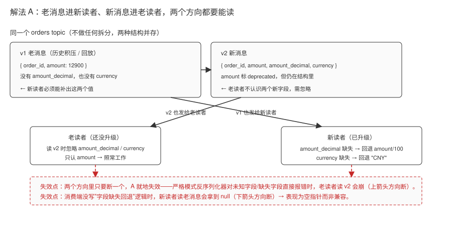
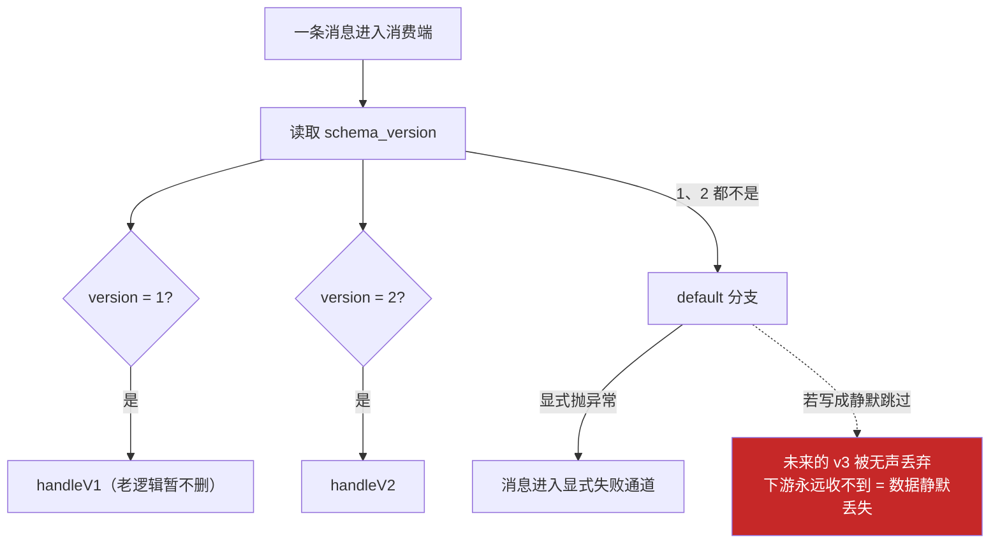
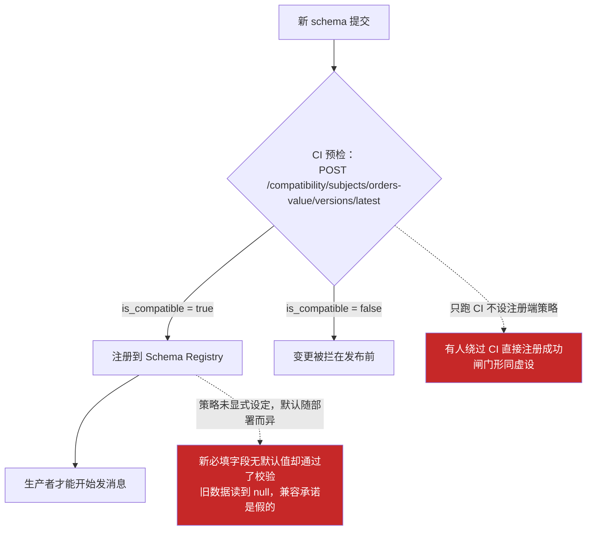
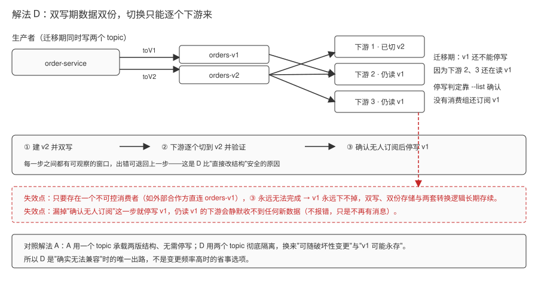
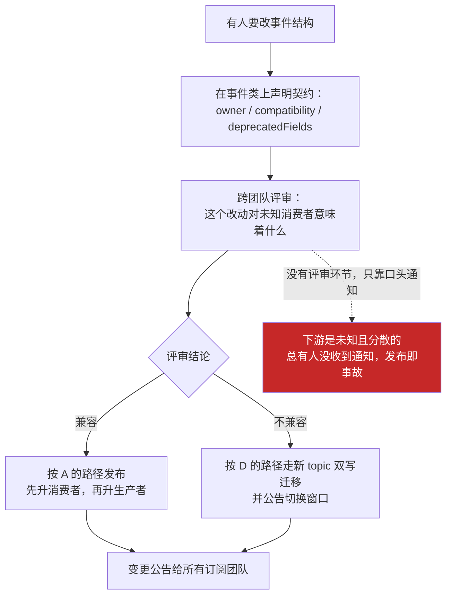
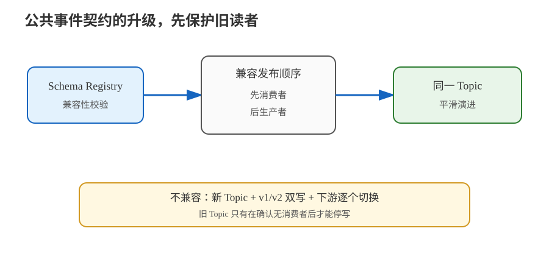

# 场景 7：事件结构要升级（经典设计题）

**场景描述**：`OrderCreated` 事件要改造：把 `amount` 字段从"整数分"改成"decimal 字符串"，并新增 `currency` 字段。下游有 5 个消费服务、3 个团队，**不可能在同一时刻全部上线**。

**🔒 先自己想 30 秒**：事件和 REST 接口有什么本质区别？为什么"发个通知让大家周五晚上一起上线"在事件驱动里行不通？

<details><summary>💡 提示（分维度想）</summary>

- **契约**：事件的消费者是**未知且分散**的，生产者改结构时下游没有任何协商环节。
- **兼容方向**：加字段、删字段、改类型——哪些改动旧消费者能容忍？哪些会让旧消费者直接崩？
- **治理**：能不能让"不兼容的变更"在**发布前**就被拦下来，而不是等下游崩溃？

</details>

<details><summary>📖 展开解法</summary>

### 解法一览（效果按题定制：兼容强度 / 治理成本）

| 解法 | 兼容强度 / 治理成本 | 代价 | 适用边界 |
|------|---------------------|------|---------|
| **A · 只做向后兼容变更**（加可选字段并给默认值、新增而非修改、废弃字段保留一段时间） | 兼容强度：**强**——同一份结构新旧消费者都能读（旧读新靠忽略未知字段 + 回退默认值）；治理成本：**低**（靠约定，无需额外组件） | 字段"只增不减"，事件会渐渐臃肿；需要约定废弃字段的下线流程 | **默认要求**：能用兼容变更解决的，绝不做破坏性变更 |
| **B · 版本号字段 + 消费端多版本分支** | 兼容强度：**强到能并存不兼容版本**（同一 topic 内多版本结构同时可读）；治理成本：**中偏高**——每个消费端都要长期维护全部版本分支，分支数随时间只增不减 | 消费端代码要长期维护多套解析分支 | 变更频率高、无法统一节奏的中期过渡 |
| **C · Schema Registry + 兼容性校验** | 兼容强度：**强且可强制**（支持 backward / forward / full 等兼容策略，不兼容的 schema 注册不上去）；治理成本：**高**（多一个要运维的组件 + 序列化切换到 Avro/Protobuf/JSON Schema） | 引入一个额外组件（Confluent Schema Registry，开源替代有 Karapace、Apicurio 等 ⏳ 置信度：中，开源方案生态变化快，选型前请核实）；序列化需切换到 Avro/Protobuf/JSON Schema | 服务数量多、事件契约需要强治理的组织 |
| **D · 新建 `orders-v2` topic + 双写 + 灰度迁移 + 下线 v1** | 兼容强度：**不需要兼容**（新旧彻底隔离在两个 topic，可以随意破坏性变更）；治理成本：**最高**——双写、逐个切换、下线判定缺一不可，且 v1 可能永远下不掉 | 双写期数据双份、迁移周期长、切换需要严密的验证 | **确实无法兼容**的破坏性变更 |
| **E · 治理手段：事件即公共契约** | 兼容强度：**间接提升**（用流程把破坏性变更挡在评审环节，本身不改任何结构）；治理成本：**中**——需要跨团队评审与公告机制，不产生技术债但持续占用沟通成本 | 需要跨团队协作与评审机制，不是技术手段 | 所有场景的配套要求 |

### 各解法详解（思路 + 关键代码）

#### 解法 A · 只做向后兼容变更（默认要求）

**思路**：加字段并给默认值、新增字段替代旧字段（旧字段保留并标注废弃）。新旧消费者可同时工作。



> 读图指引：正常路径看中间那层——topic 不拆也不建新版本，v1 老消息和 v2 新消息混在同一条流里，然后走两个方向：v2 新消息也发给还没升级的老读者（它忽略不认识的 `amount_decimal` / `currency`），v1 老消息也发给已升级的新读者（它对缺失字段回退到 `amount/100` 和 `"CNY"`）。**红框处为什么失效**：这两个方向是"与"关系而不是"或"关系——只要反序列化器是严格模式、读到未知字段就报错，上面那个方向立刻断，老读者直接崩；消费端没写回退逻辑，下面那个方向也会拿到 `null`，兼容演进的通路两头都断，A 就失效了。

```json
// v1：原结构
{ "order_id": "SO-1001", "amount": 12900 }

// v2：兼容演进 —— 加 currency（有默认值）、保留 amount 但标废弃
{
  "order_id": "SO-1001",
  "amount": 12900,           // deprecated：整数分，保留至少一个大版本
  "amount_decimal": "129.00", // 新增：decimal 字符串
  "currency": "CNY"           // 新增：有默认值，旧消费者忽略即可
}
```

```java
// 消费端：新字段缺失时回退到旧字段，保证两种版本都能读
BigDecimal amt = e.amountDecimal() != null
    ? new BigDecimal(e.amountDecimal())
    : BigDecimal.valueOf(e.amount(), 2);      // 旧消息没有 amount_decimal
String cur = e.currency() != null ? e.currency() : "CNY";   // 旧消息默认 CNY
```

> ⚠️ 消费端必须能容忍"字段缺失"。**严格模式的反序列化器（未知字段报错/缺失字段报错）会让兼容演进失效**——先修消费端，再谈演进。

#### 解法 B · 版本号字段 + 消费端多版本分支

**思路**：同一 topic 内并存多版本结构，消费端按版本号分支解析。



> 读图指引：正常路径是消息进来先读 `schema_version`，为 1 走 `handleV1`、为 2 走 `handleV2`，两套分支长期并存所以能混跑。**红框是失效点**：这个解法的安全底线全压在 `default` 分支上——它必须显式抛异常。一旦图省事写成"忽略未知版本/静默跳过"，将来 v3 上线时所有老消费端都会悄悄把这批消息扔掉，下游收不到也没有任何报错，变成无声的数据丢失；同时每加一个版本就要长期多养一套分支，这是它治理成本只增不减的原因。

```json
{ "schema_version": 2, "order_id": "SO-1001", "amount_decimal": "129.00", "currency": "CNY" }
```

```java
switch (json.get("schema_version").asInt()) {
    case 1 -> handleV1(json);      // 老逻辑，暂不删
    case 2 -> handleV2(json);
    default -> throw new UnknownSchemaVersionException(json);   // 必须显式报错
}
```

> ⚠️ `default` 分支必须显式抛异常，不能静默跳过——静默跳过会让"未来的新版本"变成无声的数据丢失。

#### 解法 C · Schema Registry + 兼容性校验

**思路**：把兼容性从口头约定变成**发布前的强制校验**。不兼容的 schema 根本注册不上去，风险前移。



> 读图指引：正常路径是"新 schema → CI 预检接口 → 兼容则注册 → 生产者才发得出去"，不兼容的变更压根进不了注册表，风险从"下游崩溃后才发现"前移到发布前。**红框是失效点**：这道闸门有两个漏洞——兼容策略（backward / forward / full）没显式设定时，校验口径随部署而变，"无默认值的必填字段"可能被放过，旧数据读到 `null`，兼容承诺就是假的；如果只把这个接口放在 CI 里而不在注册端强制策略，绕开 CI 直接注册也能成功，闸门形同虚设。

```java
// 生产者侧：序列化时自动注册并校验兼容性
props.put(ProducerConfig.VALUE_SERIALIZER_CLASS_CONFIG, KafkaAvroSerializer.class);
props.put("schema.registry.url", "http://schema-registry.example.com:8081");
// 关键：设置兼容策略为 BACKWARD（新 schema 能读旧数据）
// 注册时若违反兼容性，直接抛异常 → 变更被拦在生产端
```

```bash
# 发布前主动检查兼容性（CI 里跑这一步）
curl -X POST http://schema-registry.example.com:8081/compatibility/subjects/orders-value/versions/latest \
  -H "Content-Type: application/vnd.schemaregistry.v1+json" \
  -d '{"schema": "{...新 schema...}"}'
# 返回 {"is_compatible": false} → 这个变更不能上
```

```json
// Avro schema 演进示例：新增字段必须给默认值，才能通过 BACKWARD 校验
{
  "type": "record",
  "name": "OrderCreated",
  "fields": [
    {"name": "order_id", "type": "string"},
    {"name": "amount",   "type": "long"},
    {"name": "currency", "type": "string", "default": "CNY"}   // ← 默认值是关键
  ]
}
```

> ⚠️ 兼容策略要显式设定（backward / forward / full 语义不同）。**没设默认值的必填字段 = 必然不兼容**。

#### 解法 D · 新建 orders-v2 topic + 双写迁移

**思路**：确实无法兼容时的唯一出路。新建 topic，双写，逐个下游切换。



> 读图指引：正常路径是下方那条阶段条——① 建 `orders-v2` 并开始双写 → ② 下游逐个切到 v2 并各自验证 → ③ 用 `--list` 确认没有任何消费组还订阅 v1 → 才停写 v1；每一步之间都有可观察窗口，出错能退回上一步，这是它比"直接改结构"安全的原因。**红框处为什么失效**：阶段 ③ 有一个前提——所有订阅方能被协调。只要存在一个不可控消费者（比如外部合作方直连 `orders-v1`），③ 就永远完不成，v1 也永远下不掉，双写、双份存储和两套转换逻辑被迫长期存续；若跳过"确认无人订阅"就停写，仍读 v1 的下游会静默收不到新数据（不报错，只是不再有新消息）。

```java
// 迁移期双写
producer.send(new ProducerRecord<>("orders-v1", orderId, toV1(event)));
producer.send(new ProducerRecord<>("orders-v2", orderId, toV2(event)));
```

```bash
# 逐个下游切换：改 v1 → v2，验证无误后停写 v1
# 停写前务必确认无消费者仍订阅 v1
kafka-consumer-groups.sh --bootstrap-server localhost:9092 --list | grep orders
```

> ⚠️ 双写期数据双份；迁移周期长；**v1 可能永远无法下线**（存在不可控的外部消费者时）。

#### 解法 E · 治理：事件即公共契约

**思路**：这是流程手段而非技术手段，但决定了 A~D 是否能落地。



> 读图指引：正常路径是"要改结构 → 在事件类上声明契约（负责人 / 兼容承诺 / 废弃字段）→ 跨团队评审 → 按结论分流走 A 或 D → 变更公告"，它本身不改任何一行结构，只是决定 A~D 哪条能落地。**红框是失效点**：事件的消费者是未知且分散的，跳过评审只靠口头通知，永远会有人没收到——发布当天就是那群人的事故现场。治理的难点从来不是技术，是跨团队的评审节奏与通知覆盖。

```java
// 落地形式举例：事件类上标注契约信息与负责人
@EventContract(
    topic = "orders",
    owner = "order-team@example.com",
    compatibility = Compatibility.BACKWARD,   // 声明兼容承诺
    deprecatedFields = {"amount"}
)
public record OrderCreatedV2(String orderId, String amountDecimal, String currency) {}
```

> ⚠️ 治理的难点从来不是技术，是**跨团队的变更通知与评审节奏**。技术手段只能降低风险，不能替代沟通。

### 替代路线（非 Kafka 技术栈）

| 替代方案 | 思路 | 与 Kafka 方案的差异 |
|---|---|---|
| **版本化 HTTP/gRPC API** | 不把公共事件暴露给外部方，按 API major version 并行维护和灰度切换 | 契约边界清晰、实时调用更直接，但失去 Kafka 的事件留存、独立消费与历史回放能力 |
| **Pulsar Schema** | 使用另一套流平台的 schema 和兼容策略管理事件演进 | 可避免自建兼容校验，但迁移成本高，客户端和订阅语义都要重新验证 |

### 推荐路径

1. **先判断能否兼容**：加字段、给默认值、新增字段替代旧字段（旧字段保留并标注 deprecated）→ 走 A。这是成本最低的路径。
2. **明确升级顺序**：向后兼容（新消费者能读旧数据）时，**先升级所有消费者，再升级生产者**。顺序反了，旧消费者会先遇到读不懂的新数据。
3. **服务多了上 C**：Schema Registry 把"兼容性"从口头约定变成**发布前的强制校验**——不兼容的 schema 根本注册不上去，风险前移。
4. **真不兼容就走 D**：新建 `orders-v2` topic → 生产者双写 v1 + v2 → 各下游逐个切到 v2 并验证 → 确认无消费者订阅 v1 后停写。
5. **E 贯穿全程**：事件是跨团队的公共契约，变更应有评审与公告。

### 知识点挂钩

- 事件驱动中的事件设计与契约 → 阶段 4 · [课 10 项目架构设计落地](../stages/4-实战与架构落地/lessons/lesson-10-项目架构设计落地.md)
- 序列化器的作用与配置 → 阶段 4 · [课 9 代码开发实战](../stages/4-实战与架构落地/lessons/lesson-09-代码开发实战.md)
- 消费端必须幂等、坏消息要有出口 → 阶段 3 · [课 8 交付语义与幂等](../stages/3-可靠性与高可用/lessons/lesson-08-交付语义与幂等.md)
- **解法映射**：A/B/D/E → [课 10](../stages/4-实战与架构落地/lessons/lesson-10-项目架构设计落地.md) + [课 13](../stages/5-生产落地延伸/lessons/lesson-13-协议与消息格式.md)；C → [课 9](../stages/4-实战与架构落地/lessons/lesson-09-代码开发实战.md) + [课 13](../stages/5-生产落地延伸/lessons/lesson-13-协议与消息格式.md)

### 什么情况下此方案不适用

- **存在完全不可控的消费者**（外部合作方直连你的 topic，无法协调升级）：只能走 D，并且**永远不要下线旧 topic**，或者为外部方提供独立的出口 topic。
- **消费端对未知字段直接报错**（如严格模式的 JSON 反序列化）：A 的"加字段"也会出问题——先修消费端的严格模式，再谈演进。

### 做错会踩的坑

- 破坏性变更直接上线 → 旧消费者批量崩溃，且因为"不提交位移"形成**毒药消息阻塞分区**（[故障模式 2](../08-实战经验.md)）。
- 升级顺序搞反（先升生产者）→ 旧消费者读到新结构，同样触发毒药消息。
- 消费端反序列化失败且无异常出口 → 死循环重试（[故障模式 2](../08-实战经验.md)）。

</details>



> 读图指引：兼容变更沿上方链路发布，先保护旧读者；不兼容变更沿下方迁移路径走新 Topic 双写与逐个切换。

---

➡️ **返回**：[场景解法库索引](INDEX.md) ｜ **上一场景**：[场景 6](场景-06-跨机房容灾.md) ｜ **下一场景**：[场景 8](场景-08-任务队列语义.md)
