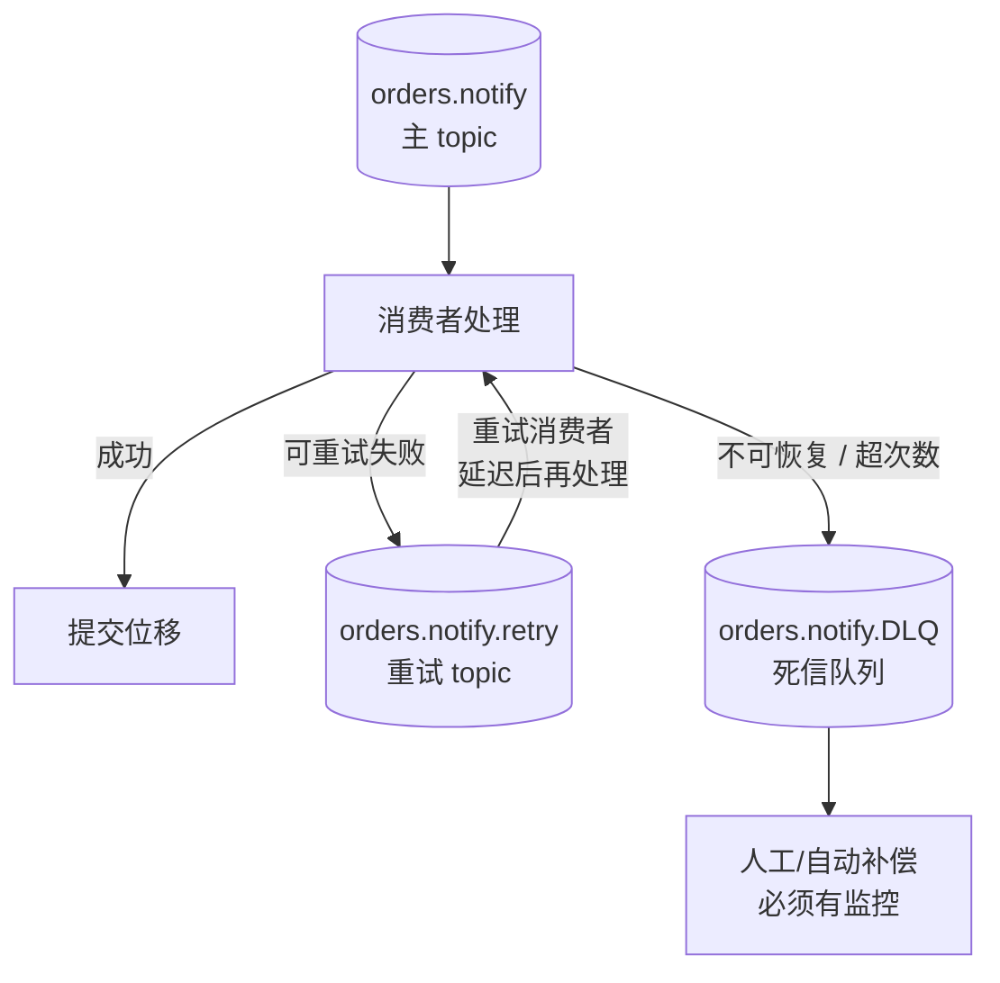

# 场景 8：我要"任务队列"语义（经典设计题）

**场景描述**：通知服务要消费"发送短信/推送"任务。需求是：① 处理失败的**单条**任务要重试，而不是整个分区卡住；② 消费者要能扩到 50 个实例，而 topic 只有 12 个分区；③ 失败的任务要能延迟 5 分钟后重投。

**🔒 先自己想 30 秒**：50 个消费者订阅 12 个分区的 topic，会有多少消费者在空转？"单条确认"在 Kafka 的位移模型里靠什么近似实现？

<details><summary>💡 提示（分维度想）</summary>

- **模型**：Kafka 的消费进度是**分区级位移**，不是"每条消息一个状态"。这个差别决定了什么？
- **阻塞**：一条消息失败就在本地无限重试，对同一分区后面的消息意味着什么？
- **新工具**：Kafka 4.x 有没有补上"队列语义"的官方方案？

</details>

<details><summary>📖 展开解法</summary>

### 解法一览

| 解法 | 能解决到 | 代价 | 适用边界 |
|------|---------|------|---------|
| **A · 重试 topic + 死信队列（DLQ）** | 失败任务不阻塞主分区；可延迟重投；最终失败有出口 | 需要额外 topic 与投递逻辑；重试 topic 的延迟靠"消费者定时暂停/恢复"或分级 topic 近似实现，不是精确定时 | **通用正解**，几乎所有需要失败重试的场景都该有 |
| **B · Share Groups（KIP-932）** | 消费者数**可超过分区数**；**单条确认**；内置投递次数上限（broker 默认 `group.share.delivery.count.limit=5`，取值范围 2-10） | 需 Kafka **4.2+**（4.0 EA → 4.1 Preview → 4.2 GA）；生产案例仍在积累；语义与传统 consumer group 不同，客户端需按 share group 协议接入 | 新版本集群 + 明确的队列型负载 |
| **C · 换用传统 MQ 承接任务语义** | 天然支持单条确认、延迟队列、优先级 | 多一个组件；事件流与任务队列分离，架构复杂度上升 | 任务语义是核心诉求（精确延迟、优先级、超高并发实例数） |
| **D · 消费者 `pause()` / `resume()` + 本地重试队列** | 保序的同时重试失败消息 | **会阻塞该分区**——暂停期间后面的消息全部等待，与吞吐直接冲突 | 必须严格保序的小流量场景 |
| **E · 分级延迟 topic**（`retry-1m`、`retry-5m`、`retry-30m` + 到点才消费） | 实现"延迟重投" | 延迟粒度固定，不精确；需要按等级建 topic 并控制消费时机 | 可接受固定档位延迟的重试策略 |

**重试链路（A）的典型形态**：



> 读图指引：主 topic 的消费者**永远不因单条失败而停下**——失败就转投别处并继续前进。这是与"本地死循环重试"最本质的区别。

### 各解法详解（思路 + 关键代码）

#### 解法 A · 重试 topic + 死信队列（通用正解）

**思路**：失败不阻塞主分区。主消费者遇到失败就转投重试 topic 并**提交位移继续前进**；重试 N 次仍失败则进 DLQ。

```java
// 主消费者：失败不重试，转投重试 topic 并提交位移
for (ConsumerRecord<String, Task> r : records) {
    try {
        process(r.value());
    } catch (RetryableException e) {
        int attempt = retryCount(r) + 1;
        if (attempt > MAX_RETRY) {
            // 超次数 → 死信队列，必须有监控告警
            dlqProducer.send(new ProducerRecord<>("orders.notify.DLQ", r.key(),
                withError(r.value(), e)));
            log.error("sent to DLQ after {} attempts, key={}", attempt, r.key());
        } else {
            retryProducer.send(new ProducerRecord<>("orders.notify.retry", r.key(),
                withAttempt(r.value(), attempt)));
        }
    }
    // 无论成功还是转投，都继续前进
}
consumer.commitSync();     // 关键：异常路径也要提交位移，否则毒药消息卡死分区
```

```java
// 重试消费者：消费 retry topic，失败则再投回 retry（次数 +1）
// 延迟通过"定时暂停"近似实现，不是精确定时
for (ConsumerRecord<String, Task> r : retryRecords) {
    try {
        process(r.value());
    } catch (RetryableException e) {
        if (retryCount(r) + 1 > MAX_RETRY) {
            dlqProducer.send(new ProducerRecord<>("orders.notify.DLQ", r.key(), r.value()));
        } else {
            retryProducer.send(new ProducerRecord<>("orders.notify.retry", r.key(),
                withAttempt(r.value(), retryCount(r) + 1)));
        }
    }
}
```

> ⚠️ **最关键的一行是 `commitSync()` 放在 catch 之外**：异常路径不提交位移 = 毒药消息死循环，整个分区卡死。这是本场景排名第一的坑。

#### 解法 B · Share Groups（KIP-932，Kafka 4.2+）

**思路**：官方队列语义——消费者数可超过分区数，支持单条确认。改变的是消费模型本身。

```java
// 消费端：group.protocol 改为 share，而非传统的 consumer
props.put(ConsumerConfig.GROUP_PROTOCOL_CONFIG, "share");
props.put(ConsumerConfig.GROUP_ID_CONFIG, "notify-share-group");
// 单条确认模型：逐条 ack/nack，不再依赖分区级位移
```

```properties
# broker 端（Kafka 4.2+，share groups 已 GA）
group.share.delivery.count.limit=5     # 投递次数上限，默认 5，范围 2-10
group.share.record.lock.duration.ms=30000
```

> ⚠️ 三条限制：① 需 **Kafka 4.2+**（4.0 EA → 4.1 Preview → 4.2 GA）；② 语义与传统 consumer group 不同，客户端需按 share group 协议接入；③ 仍可能重复投递，消费端幂等照常需要。

#### 解法 C · 换用传统 MQ 承接任务语义

**思路**：精确延迟、优先级、超高并发实例数是传统 MQ 的主场。硬用 Kafka 实现会得到一堆脆弱的自制组件。

```java
// 事件流用 Kafka，任务队列用 MQ —— 各司其职
// 订单事件（流式，多下游广播）→ Kafka
producer.send(new ProducerRecord<>("orders", orderId, event));

// 发短信任务（队列语义，单条确认 + 延迟）→ RabbitMQ / RocketMQ
mqTemplate.convertAndSend("notify.delay.exchange", "notify.sms",
    smsTask, msg -> {
        msg.getMessageProperties().setDelay(5 * 60 * 1000);   // 精确延迟 5 分钟
        return msg;
    });
```

> ⚠️ 多一个组件 = 多一份运维。但对"精确延迟 / 优先级"这类需求，自研的复杂度远超引入一个 MQ。

#### 解法 D · pause()/resume() + 本地重试队列

**思路**：必须严格保序的小流量场景，暂停分区做本地重试。代价是**该分区完全停滞**。

```java
// 遇到失败：暂停该分区，本地重试
consumer.pause(List.of(partition));
try {
    retryLocally(record, 3);      // 本地重试 3 次
    consumer.resume(List.of(partition));
} catch (Exception e) {
    // 仍失败：不能一直停着，会超 max.poll.interval.ms 被踢出组
    sendToDlq(record);
    consumer.resume(List.of(partition));    // 必须恢复
}
```

> ⚠️ `pause()` 期间**后面的消息全部等待**，与吞吐直接冲突；且暂停时间计入 `max.poll.interval.ms`，超时会被踢出组引发再均衡。仅限小流量 + 必须保序的场景。

#### 解法 E · 分级延迟 topic

**思路**：用"到点才消费"的固定档位 topic 近似延迟重投。

```bash
# 建固定档位的重试 topic
kafka-topics.sh --bootstrap-server localhost:9092 --create --topic notify.retry.1m  --partitions 6 --replication-factor 3
kafka-topics.sh --bootstrap-server localhost:9092 --create --topic notify.retry.5m  --partitions 6 --replication-factor 3
kafka-topics.sh --bootstrap-server localhost:9092 --create --topic notify.retry.30m --partitions 6 --replication-factor 3
```

```java
// 失败第 N 次投递到对应档位
String retryTopic = switch (attempt) {
    case 1 -> "notify.retry.1m";
    case 2 -> "notify.retry.5m";
    default -> "notify.retry.30m";
};
producer.send(new ProducerRecord<>(retryTopic, key, withAttempt(task, attempt)));

// 各档位的消费者用定时器控制"到点才消费"，实现近似延迟
```

> ⚠️ 延迟粒度固定（1m/5m/30m），做不到任意时间；档位 topic 数量会膨胀。

### 推荐路径

1. **先把 A 做扎实**：主 topic + 重试 topic + DLQ 三件套，配合"失败 N 次进 DLQ 并提交位移"的检测逻辑。这是**无论用不用 share groups 都该有的基线**。
2. **确认瓶颈是分区数限制**再考虑 B：如果消费者需要显著超过分区数，且集群已是 4.2+，可以评估 share groups（注意它改变的是消费模型，不只是"多几个实例"）。
3. **延迟需求**：E（分级延迟 topic）够用就用；需要精确到秒的任意延迟 → 走 C。
4. **D 仅限必须严格保序的小流量**：务必算清楚暂停时间对 `max.poll.interval.ms` 的影响。

### 知识点挂钩

- 消费者数与分区数的约束、位移提交、再均衡 → 阶段 2 · [课 6 消费者与消费者组](../stages/2-核心架构/lessons/lesson-06-消费者与消费者组.md)
- 分区是并行度单位、分区数只能加不能减 → 阶段 2 · [课 4 Topic、Partition 与 Broker](../stages/2-核心架构/lessons/lesson-04-Topic、Partition与Broker.md)
- 事件 vs 命令、什么时候不该用 Kafka → 阶段 4 · [课 10 项目架构设计落地](../stages/4-实战与架构落地/lessons/lesson-10-项目架构设计落地.md) 与 [08-实战经验.md · 适用边界](../08-实战经验.md)

### 什么情况下此方案不适用

- **需要精确延迟（任意时间）/ 优先级队列 / 大量消费者实例**：这些是传统 MQ 的主场。硬用 Kafka 实现会得到一堆脆弱的自制组件——回看 [08-实战经验.md](../08-实战经验.md) 的适用边界表，Kafka 在"纯任务队列"上本就不是最优解。
- **要求严格的逐条确认且不重复**：share groups 提供单条确认，但仍需消费端幂等兜底（至少一次语义下重复是必然）。

### 做错会踩的坑

- 失败就在本地无限重试 → 超过 `max.poll.interval.ms` 被踢出组，再均衡把停顿扩散到全组（[故障模式 7](../08-实战经验.md)）。
- 异常路径不提交位移 → 毒药消息死循环，整个分区卡死（[故障模式 2](../08-实战经验.md)）。
- DLQ 没有监控与告警 → 换个地方静默丢弃，问题被推迟到业务投诉时才暴露。
- 加消费者实例到 50 个却发现只有 12 个在工作 → 超出分区数的实例完全闲置（[故障模式 1](../08-实战经验.md)）。

</details>

---

➡️ **返回**：[场景解法库索引](INDEX.md) ｜ **上一场景**：[场景 7](场景-07-事件结构演进.md)
