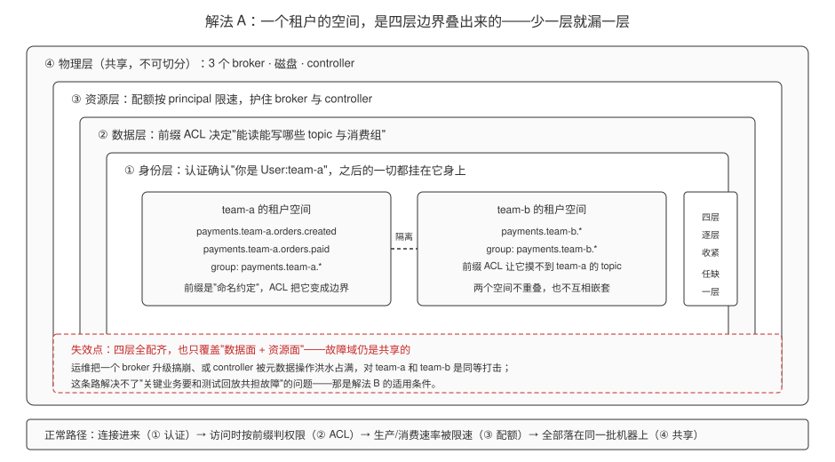
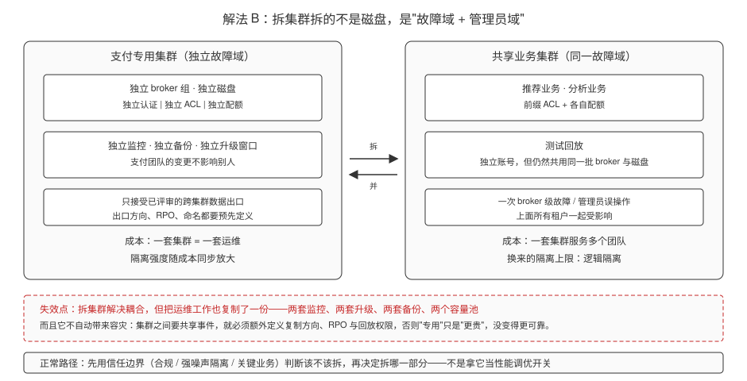
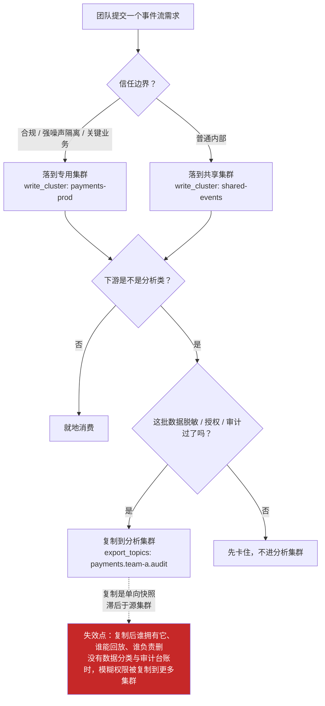
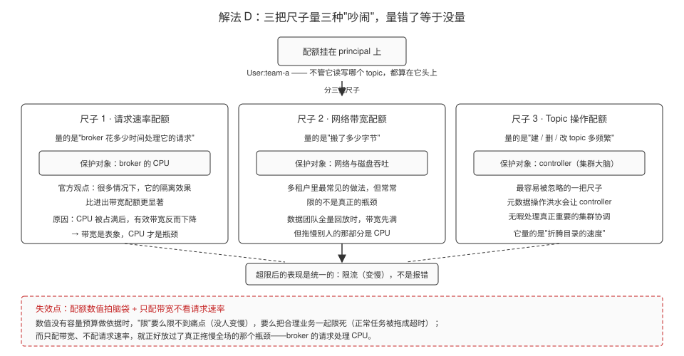
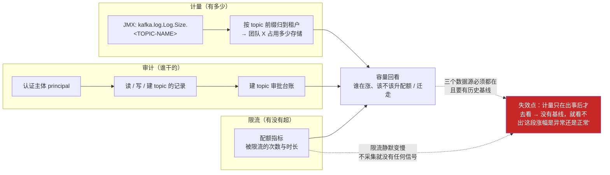
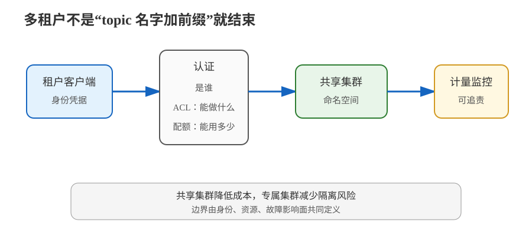

# 场景 9：多个团队共用一个 Kafka 集群（经典设计题）

**场景描述**：支付、推荐、数据分析和测试团队共用 3 个 broker。支付事件不能被推荐团队读取；某个团队批量回放时，不能把其他团队的生产延迟和 broker CPU 一起拖高；管理员还要能回答“谁在读、谁在写、谁超额”。

**🔒 先自己想 30 秒**：把 topic 名改成 `team-a.orders` 就算隔离了吗？认证、ACL、配额和专用集群，分别解决哪一种风险？

<details><summary>💡 提示（分维度想）</summary>

- **身份**：broker 如何确认“这是支付服务”，而不是只知道有一条 TCP 连接？
- **权限**：认证通过后，能不能只读写自己前缀下的 topic，并限制消费组操作？
- **资源**：一个租户的突发写入会占满带宽，还是会先占满 broker 的请求处理 CPU？
- **故障域**：逻辑隔离挡不住 broker 级故障；哪些租户值得专用集群或跨集群复制？

</details>

<details><summary>📖 展开解法</summary>

### 解法一览（效果按题定制）

| 解法 | 隔离强度 / 成本 | 代价 | 适用边界 |
|---|---|---|---|
| **A · 共享集群：命名空间 + 前缀 ACL + 认证 + 配额** | 数据访问：强；资源隔离：中；成本：低 | 仍共享 broker、磁盘和 controller；命名规则与权限模板必须有人维护 | 多数内部团队、能接受共享故障域的场景 |
| **B · 按信任边界拆专用集群** | 数据/资源/故障隔离：强；成本：高 | 多一套集群、监控、升级、备份和容量规划 | 合规、强噪声隔离、关键业务或不同生命周期 |
| **C · 混合分层：普通租户共享，关键租户专用，跨集群只复制需要的数据** | 在成本和隔离之间折中 | 路由、数据复制和权限矩阵更复杂；跨集群复制有滞后 | 业务重要性分层明显、组织规模中大型 |
| **D · 请求速率配额 + 元数据操作限流** | 资源隔离：**强**（限的是 broker 请求处理 CPU 与 controller）；成本：低（只是换尺子） | 数值必须来自容量预算，拍脑袋配等于没限；限流是静默的，不配监控看不见 | 共享集群里已经做了认证与 ACL、但只配了带宽配额的场景 |
| **E · 计量 + 审计 + 容量回看** | 可回答性：**强**（"谁在读、谁在写、谁超额"变成可查的事实）；成本：低（复用现有 JMX 与审计） | 需要持续采集与保留历史，只在出事时查一次等于没有；指标名要与 exporter 实际输出核对 | 所有多租户场景的配套要求，与 A~D 并行做 |

### 各解法详解

#### 解法 A · 共享集群的四道边界（默认起点）

**思路**：把“一个团队的空间”定义为 topic 前缀；认证确认主体，前缀 ACL 限定数据面，配额限制资源面，监控负责把超额变成可见信号。



> 读图指引：从外往里读这四层——最外是**物理层**（三个 broker、磁盘、controller，所有租户共用，切不开）；往里是**资源层**（配额按 principal 限速）；再往里是**数据层**（前缀 ACL 决定能读能写哪些 topic 与消费组）；最里才是**身份层**（认证确认"你是 `User:team-a`"，上面三层全挂在它身上）。中间两个框是结果：`team-a` 与 `team-b` 的租户空间**互不重叠、也不互相嵌套**，前缀是命名约定，ACL 才把它变成真边界。**红框处为什么失效**：四层配齐也只覆盖数据面和资源面，**最外那层物理边界没动**——一个 broker 升级搞崩或 controller 被元数据洪水占满时，两个租户同等受害。这正是"共享集群永远给不了故障隔离"的原因。

```bash
# 命名：payments.team-a.orders.created
# 给 team-a 只授予自己前缀下的生产权限；前缀 ACL 是数据隔离的核心
kafka-acls.sh --bootstrap-server localhost:9092 \
  --add --allow-principal User:team-a-producer \
  --producer --resource-pattern-type prefixed \
  --topic payments.team-a.

# 读权限还要绑定消费组前缀，不能只给 topic 权限
kafka-acls.sh --bootstrap-server localhost:9092 \
  --add --allow-principal User:team-a-consumer \
  --consumer --resource-pattern-type prefixed \
  --topic payments.team-a. --group payments.team-a.

# 配额主体必须与认证后的 principal 对得上；数值只是示例，实际值按容量预算制定
kafka-configs.sh --bootstrap-server localhost:9092 --alter \
  --entity-type users --entity-name team-a-producer \
  --add-config 'producer_byte_rate=10485760'
kafka-configs.sh --bootstrap-server localhost:9092 --alter \
  --entity-type users --entity-name team-a-consumer \
  --add-config 'consumer_byte_rate=20971520'
```

> **代价 / 坑**：前缀 ACL 省管理量，但会把命名规则变成安全边界；还要关闭普通用户的随意建 topic 能力，并对 topic 管理操作做限流。配额只在主体身份能稳定区分时才有意义。

**来源**：Apache Kafka [Multi-Tenancy](https://kafka.apache.org/43/operations/multi-tenancy/)（命名空间、前缀 ACL、配额与计量，核查于 2026-09）；[Authorization and ACLs](https://kafka.apache.org/43/security/authorization-and-acls/)（授权）。

#### 解法 B · 按信任边界拆专用集群

**思路**：把“不能被同一故障域或同一管理员边界影响”作为拆集群条件，而不是把专用集群当作性能调优开关。支付集群只承载支付域，测试回放集群不与生产 broker 共用磁盘和连接资源。



> 读图指引：左右两边是**同一批租户**的两种摆放方式。左边把支付**移出去**：它拿到独立的 broker、磁盘、认证、ACL、配额、监控、备份和升级窗口——支付团队自己的变更和管理员误操作，影响不到别人。右边是留在一起：推荐、分析、测试回放虽然各有前缀 ACL 和配额，但**底下那批 broker 和磁盘仍然是同一份**，一次 broker 级故障或管理员误操作，上面所有租户一起受影响。**红框处为什么失效**：拆集群拆掉的是耦合，代价是**运维工作也复制一份**（两套监控、升级、备份、容量池），而且它**不自动等于容灾**——跨集群要共享数据，方向、RPO、回放权限都得另外定义，否则只是"更贵"，没更可靠。

```text
生产支付集群
  ├─ 支付生产者/消费者
  ├─ 独立认证、ACL、监控、备份
  └─ 只接受已评审的跨集群数据出口

共享业务集群
  ├─ 推荐
  ├─ 分析
  └─ 测试回放（配额 + 独立账号）
```

> **代价 / 坑**：拆集群解决的是数据面、资源面和故障面的耦合，同时也复制了运维工作。若两个集群之间要共享事件，必须额外定义复制方向、RPO、topic 命名和回放权限；专用集群不是“自动拥有容灾”。

**来源**：Apache Kafka [Datacenters](https://kafka.apache.org/43/operations/datacenters/) 与 [Geo-Replication](https://kafka.apache.org/43/operations/geo-replication-cross-cluster-data-mirroring/)（跨集群边界与复制取舍，核查于 2026-09）。

#### 解法 C · 混合分层

**思路**：用一张租户分级表决定部署位置：普通内部事件进入共享集群；敏感或高优先级事件进入专用集群；只把经过脱敏、授权和审计的数据复制到分析集群。



> 读图指引：正常路径是**一棵两问三出口的判定树**——先问信任边界决定落在哪个集群，再问是不是分析类下游，最后问脱敏/授权/审计是否齐备，齐备才允许复制出岛。**红框处为什么失效**：混合分层真正难的不是这套判定规则，而是**复制出去的那份数据归属谁**——它已经离开原租户的集群，谁能回放、谁负责删除、滞后期间算谁的数据，这些问题没有数据分类和审计台账回答时，方案只是把共享集群的模糊权限**复制到了更多集群**。所以 C 的前置条件是 A 的账要记得清楚。

```yaml
# 这是路由策略示意，不是 Kafka 内置配置
tenant_policy:
  team-a:
    trust_boundary: dedicated
    write_cluster: payments-prod
    export_topics: [payments.team-a.audit]
  team-b:
    trust_boundary: shared
    write_cluster: shared-events
    quota_profile: standard
```

> **代价 / 坑**：混合分层的难点不是 YAML，而是“复制后的数据是否仍属于原租户、谁能回放、谁负责删除”。没有数据分类和审计记录时，混合方案会把共享集群的模糊权限复制到更多集群。

**来源**：Apache Kafka [Multi-Tenancy](https://kafka.apache.org/43/operations/multi-tenancy/)（租户空间、配额、计量与跨集群数据共享，核查于 2026-09）。

#### 解法 D · 请求速率配额与元数据操作限流

**思路**：A 的配额只是"四道边界"之一，容易被简化成"给每个租户配一条带宽配额"。这里要做的是**换尺子**：先配请求速率配额（它保护的是 broker 处理请求的 CPU），再配 `controller_mutation_rate` 限制建 / 删 / 改 topic 这类元数据操作的速率（它保护的是 controller）。为什么优先请求速率？官方观点是：**在很多情况下，用请求速率配额隔离用户的效果比设置进出带宽配额更显著**——因为过度的 CPU 占用会降低 broker 能服务的有效带宽。**带宽是表象，CPU 才是瓶颈。**



> 读图指引：顶部说清一个重要前提——**配额挂在 principal 上，和它读写哪个 topic 无关**，管的是"人"不是"数据"；往下是并列的三把尺子：请求速率量"broker 花多少时间处理你的请求"（护 CPU）、带宽量"搬了多少字节"（护网络与磁盘吞吐）、`controller_mutation_rate` 量"建删改多频繁"（护 controller）。三者的落点是同一个：**超限表现为限流变慢，不是报错**。**红框处为什么失效**：红线有两条——① 配额数值是**拍脑袋拍出来的**（没有容量预算做依据时，要么限不到痛点，要么把合理业务一起限死）；② **只配带宽不看请求速率**，恰好放过了真正拖垮全场的那个瓶颈（broker 的请求处理 CPU）。所以这张图要记住的不是"配三个值"，而是"先选对尺子，再用容量预算定数值"。

```bash
# 尺子 1：请求速率配额 —— 保护 broker 的请求处理 CPU
# 数值仅为示例，实际值按容量预算制定
kafka-configs.sh --bootstrap-server localhost:9092 --alter \
  --entity-type users --entity-name team-a-consumer \
  --add-config 'request_percentage=200'

# 尺子 2：带宽配额 —— 保护网络与磁盘吞吐（辅，不是主）
kafka-configs.sh --bootstrap-server localhost:9092 --alter \
  --entity-type users --entity-name team-a-consumer \
  --add-config 'consumer_byte_rate=20971520'

# 尺子 3：元数据操作配额 —— 限制建 / 删 / 改 topic 的速率，保护 controller
kafka-configs.sh --bootstrap-server localhost:9092 --alter \
  --entity-type users --entity-name team-a-admin \
  --add-config 'controller_mutation_rate=10'
```

> **代价 / 坑**：① 限流是**静默的**——客户端只会"变慢"，没有任何错误，**不配监控就看不出自己被限了**（这也是为什么它是 D 与 E 的天然组合）；② 请求速率配额的数值必须来自容量预算，不能照抄别人的数字；③ 元数据操作配额护的是 controller，而 controller 的负载**和带宽配额完全没有关系**——只配带宽是防不住"高频建 topic 打崩 controller"的；④ 配额只对**主体身份能稳定区分**的租户有效，principal 分不清时先回去补 A 的认证。

**来源**：Apache Kafka [Multi-Tenancy](https://kafka.apache.org/43/operations/multi-tenancy/)（配额三类尺子与"请求速率隔离效果更显著"的官方观点，核查于 2026-09）；[Broker Configs](https://kafka.apache.org/43/configuration/broker-configs/)（`controller_mutation_rate` 等配额配置项）；KIP-599（Topic 操作配额，`controller_mutation_rate`）。

#### 解法 E · 计量、审计与容量回看

**思路**：A~D 解决的是"怎么划定边界和限额"，E 解决的是**"出事了能不能回答"**——场景描述里的第三个诉求（"谁在读、谁在写、谁超额"）本质上是计量与审计问题，不是隔离问题。要做三件事：① **按 topic 计量**，用 JMX 指标 `kafka.log.Log.Size.<TOPIC-NAME>` 跟踪分区大小，把存储用量落到具体租户头上；② **建 topic 走审批**，让"谁在什么时候建了这个 topic"有台账；③ **把访问与超额记进审计日志**，让"谁在读、谁在写"可回答。配完之后，容量回看才有基线：这个月团队 X 涨了多少、是不是该升配额或该迁移。



> 读图指引：正常路径是**三条信息汇总到同一个回看动作**——"有多少"来自按 topic 的存储计量，"谁干的"来自认证主体 + 建 topic 审批台账，"有没有超"来自配额指标；三者汇到一起，容量规划才从"猜"变成"看曲线"。**红框处为什么失效**：这套东西的价值完全建立在**时间序列**上。如果只在事故复盘时才去查一次，你拿到的只是一个孤立数字——**没有基线，就分不出"这条涨幅是业务自然增长还是有人在偷跑回放"**；同理，配额被触发是静默变慢，不持续采集配额指标，等于限额从头到尾都没生效过。所以 E 的纪律是"**平时就在记**"，不是"出事才去查"。

```bash
# ① 按 topic 计量存储：JMX 指标 kafka.log.Log.Size.<TOPIC-NAME>
#    把它按 topic 前缀聚合成"租户用量"（指标名以 exporter 实际吐出的为准）
curl -s http://localhost:17071/metrics | grep 'kafka_log_log_size' | head

# ② 建 topic 走审批：先关掉自动创建，避免出现没人认领的 topic
kafka-configs.sh --bootstrap-server localhost:9092 --alter \
  --entity-type brokers --entity-default \
  --add-config auto.create.topics.enable=false

# ③ 审计：查看现有 ACL，核对"谁被授予了读写谁的空间"
kafka-acls.sh --bootstrap-server localhost:9092 --list --topic payments.team-a.

# ④ 配额指标：确认限流行为真的被采集到（否则限额形同虚设）
kafka-configs.sh --bootstrap-server localhost:9092 --describe \
  --entity-type users --entity-name team-a-producer
```

```text
容量回看时至少要能回答的四个问题（把答案做成看板，而不是临时查）：
  1. 团队 X 这个月占了多少存储？趋势是向上还是已经趋平？
  2. 团队 X 有没有被限流过？被限流的是哪类请求（请求速率 / 带宽 / 元数据操作）？
  3. 有没有 topic 是没人认领的（不在审批台账里）？
  4. 团队 X 的配额还剩多少余量？按当前增速多久会被打满？
```

> **代价 / 坑**：① 计量只在**出事后才去看**，等于没有计量——没有历史序列就没有基线，无法判断涨幅是否异常（这是本解法最容易走的偏）；② 指标名要与 exporter 实际输出的名字核对，**别照抄教程里的名字**；③ 审计日志本身会增长，需要保留策略；④ 关掉自动创建后，必须同时把"代建 topic"的流程（脚本 / 平台）准备好，否则开发会被卡住——这是治理动作的配套成本。

**来源**：Apache Kafka [Multi-Tenancy](https://kafka.apache.org/43/operations/multi-tenancy/)（配额与计量、命名空间与建 topic 治理，核查于 2026-09）；[Monitoring](https://kafka.apache.org/43/operations/monitoring/)（`kafka.log.Log.Size.<TOPIC-NAME>` 等 JMX 指标与配额指标）。

### 替代路线（非本课程技术栈）

| 替代方案 | 思路 | 与 Kafka 方案的差异 |
|---|---|---|
| **RabbitMQ vhost + exchange/queue 权限** | 用 vhost 划分命名空间，用用户权限限制 exchange/queue，再按策略限流 | 更贴近队列路由和权限隔离；不提供 Kafka 分区日志的长时间重放模型 |
| **云消息服务的租户/项目边界** | 让云平台承担账号、配额和审计，应用只使用分配好的资源 | 运维负担更低，但迁移、成本和厂商约束更强 |

### 推荐路径（递进）

1. **先做 A**：统一命名、认证、最小权限、配额、计量和建 topic 审批。这是所有后续步骤的地基。
2. **配额上换尺子（D）**：别停在"每个租户一条带宽配额"——补上请求速率配额（护 broker CPU，官方认为隔离效果通常更显著），再加 `controller_mutation_rate` 护住 controller（防高频建 / 删 topic）。
3. **同步做 E**：按 topic 计量存储、建 topic 走审批、配额超限被采集——**"谁在读、谁在写、谁超额"必须是能查的，而不是出事后现查**。E 与 A/D 并行，不是最后一步。
4. **把对资源和数据有硬隔离要求的租户升级到 B**：判断依据是信任边界（合规、强噪声隔离、关键业务），不是"哪个团队流量大"。
5. **组织规模扩大后用 C**：把专用集群和共享集群的跨集群数据出口纳入统一治理——前提是 E 的数据分类和审计台账已经建好，否则只会把模糊权限复制到更多集群。

### 知识点挂钩

- 认证、授权、加密、listeners → 阶段 5 · [课 11 Kafka 安全体系](../stages/5-生产落地延伸/lessons/lesson-11-Kafka安全体系.md)
- 租户空间、配额与限流 → 阶段 5 · [课 12 多租户与配额](../stages/5-生产落地延伸/lessons/lesson-12-多租户与配额.md)
- 指标、计量与用户影响 → 阶段 6 · [课 15 监控与可观测](../stages/6-运维与可观测/lessons/lesson-15-监控与可观测.md)
- **解法映射**：A → [课 11 Kafka 安全体系](../stages/5-生产落地延伸/lessons/lesson-11-Kafka安全体系.md) + [课 12 多租户与配额](../stages/5-生产落地延伸/lessons/lesson-12-多租户与配额.md)；B → [课 12 多租户与配额](../stages/5-生产落地延伸/lessons/lesson-12-多租户与配额.md)；C → [课 10](../stages/4-实战与架构落地/lessons/lesson-10-项目架构设计落地.md) + [课 15 监控与可观测](../stages/6-运维与可观测/lessons/lesson-15-监控与可观测.md)；D → [课 12 多租户与配额](../stages/5-生产落地延伸/lessons/lesson-12-多租户与配额.md) + [课 11 Kafka 安全体系](../stages/5-生产落地延伸/lessons/lesson-11-Kafka安全体系.md)；E → [课 15 监控与可观测](../stages/6-运维与可观测/lessons/lesson-15-监控与可观测.md) + [课 12 多租户与配额](../stages/5-生产落地延伸/lessons/lesson-12-多租户与配额.md)

### 什么情况下此方案不适用

- 只配 SASL 认证、不配 ACL：认证通过不等于只能访问自己的 topic。
- 只依赖 topic 前缀、不限制建 topic：有权限的用户仍可能绕过约定制造资源和审计盲区。
- 合规要求故障域、管理员域都隔离：共享集群的逻辑边界不能替代专用集群。
- **场景描述里第三问（“谁在读、谁在写、谁超额”）不能只靠 A~D 回答**：那是计量与审计问题，必须显式做 E；只做隔离不做计量，出事时仍然答不出来。
- **组织里没有容量预算流程时**：D 的配额数值无据可依，应先建"配额数值怎么定、谁来定"的流程，而不是先抄一组数字上线。

### 做错会踩的坑

- 把“认证成功”当成“已授权” → 回看 [08 实战经验](../08-实战经验.md) 的安全边界与 [09 排障速查手册](../09-排障速查手册.md) 的连接/权限条目。
- 只配带宽配额、不看请求处理 CPU 和管理操作速率 → 租户仍可能成为 noisy neighbor（解法 D）。
- 高频建 / 删 topic 打崩 controller → 元数据操作洪水与带宽配额无关，必须单独用 `controller_mutation_rate` 限住（解法 D）。
- 配额数值拍脑袋定 → 要么限不到痛点，要么把合理业务一起限死；数值必须来自容量预算（解法 D）。
- 计量只在出事后才去看、没有历史基线 → 拿到一个孤立数字，分不出"业务自然增长"还是"有人在偷跑回放"（解法 E）。
- 限流是静默的（变慢不报错），不采集配额指标 → 限额到底有没有生效，永远不知道（解法 D + E）。

</details>



> 读图指引：左侧是共享集群的命名空间、ACL 和配额三道逻辑边界；右侧是把关键租户移到独立故障域，差别在于右侧多付运维成本换来更强的资源与信任边界。

➡️ **返回**：[场景解法库索引](INDEX.md) ｜ **上一场景**：[场景 8](场景-08-任务队列语义.md) ｜ **下一场景**：[场景 10](场景-10-新增broker与分区重分配.md)
