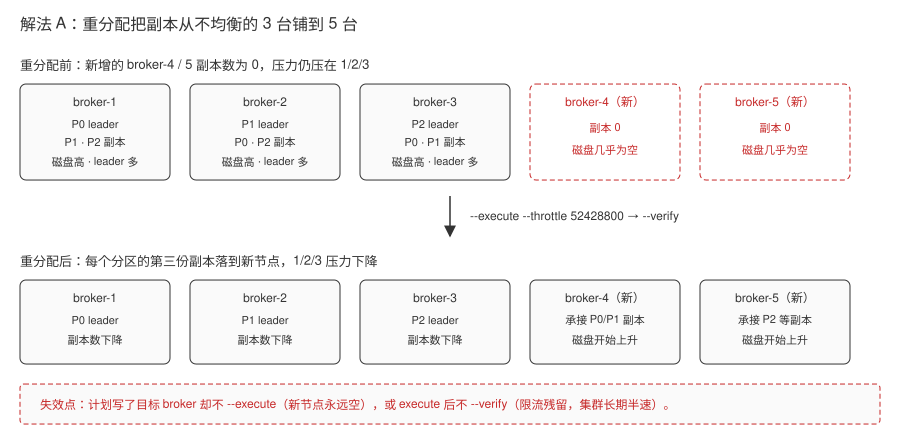
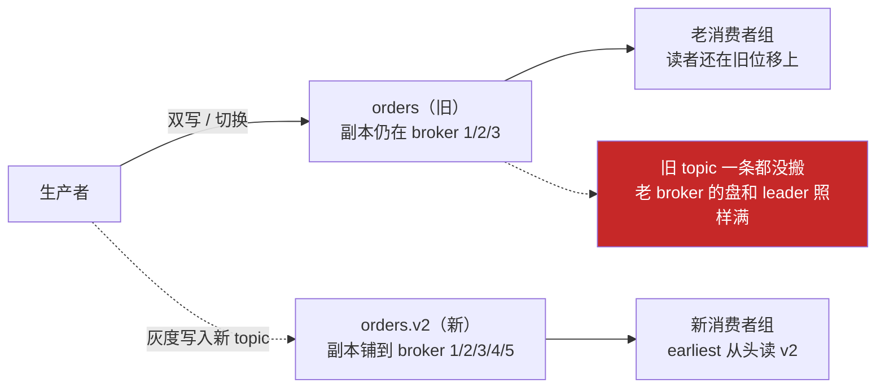
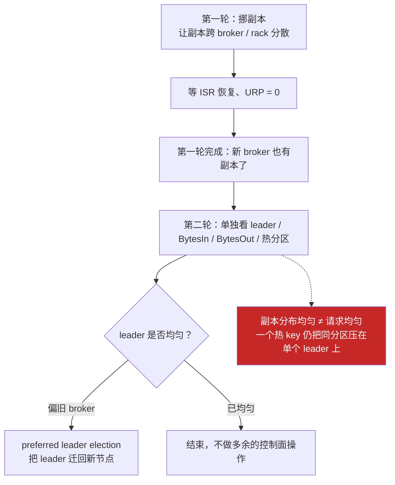
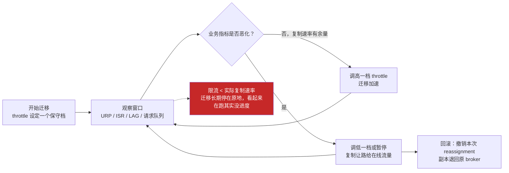
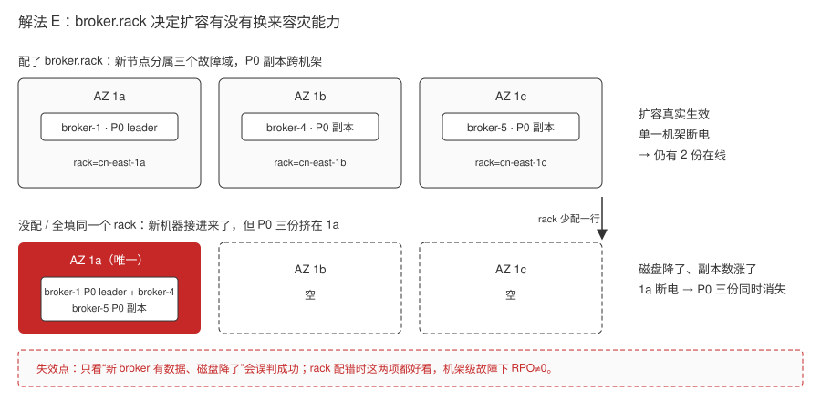
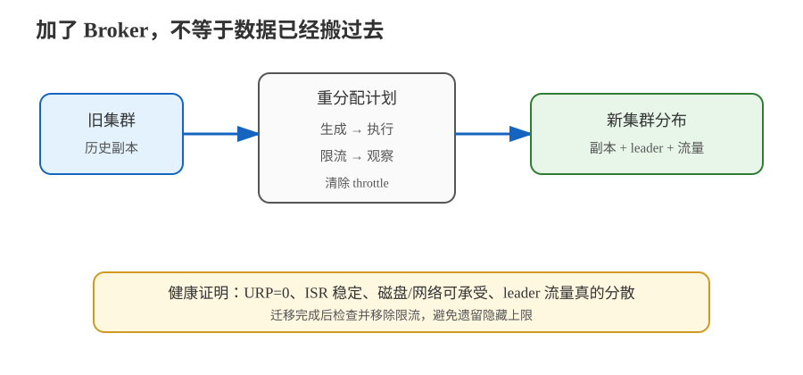

# 场景 10：新增 broker 后数据还是不动（规模压力题）

**场景描述**：集群从 3 台 broker 扩到 5 台，磁盘和网络预算已经批下来，但新 broker 的磁盘几乎为空，老 broker 的 `BytesIn`、磁盘使用率和 leader 数仍然很高。团队要求迁移期间业务不停、不能把复制流量打满，还要能证明“扩容真的生效”。

**🔒 先自己想 30 秒**：加 broker 为什么不会自动接走已有分区？如果直接把所有分区搬过去，最先受伤的是生产延迟、消费者 LAG，还是副本健康度？

<details><summary>💡 提示（分维度想）</summary>

- **容量对象**：新 broker 要承接的是副本、leader、读流量，还是三者都要？
- **迁移过程**：谁生成目标副本清单？限流只限制什么？什么时候算迁移完成？
- **健康证明**：除了“新磁盘有数据”，还要观察 ISR、URP、请求队列和业务 LAG 的什么变化？

</details>

<details><summary>📖 展开解法</summary>

### 解法一览（效果按题定制）

| 解法 | 扩容效果 / 业务风险 | 代价 | 适用边界 |
|---|---|---|---|
| **A · 显式分区重分配 + throttle + verify** | 存量数据真正搬迁；风险可控 | 需要规划 JSON、迁移窗口、限流和回滚/暂停策略 | 默认的存量扩容路径 |
| **B · 只让新 topic 使用新布局，旧 topic 不搬** | 新流量分布立即改善；旧数据迁移风险最低 | 老 topic 仍可能是瓶颈；应用要接受新旧 topic 并存 | 旧数据可留原处、业务正在拆域时 |
| **C · 先搬副本，再做 leader/热点治理** | 同时改善存储和读写 leader 分布 | 两轮操作，判断难度更高；搬副本不等于热点 key 被打散 | leader 不均或热 topic 明显时 |
| **D · 限流分档 + 可暂停、可回滚的迁移节奏** | 存量搬迁过程可控；业务延迟不因复制而抖 | 需要人盯盘调档；档位定低了迁移长期不前进 | 迁移窗口长、业务对延迟敏感时 |
| **E · 机架感知与故障域前置规划** | 扩容同时换来真正的跨机架容灾能力 | 需要提前规划 `broker.rack`，改名/改机架要重分配才生效 | 新增节点与业务容灾目标绑定时 |

### 各解法详解

#### 解法 A · 显式重分配，分批且可证明

**思路**：先生成“哪些分区去哪些 broker”的计划，审核后执行；用 throttle 控制复制带宽，周期性 verify 并在完成后清除限流。



> 读图指引：上排是重分配前的分布——新加的 broker-4/5 副本数为 0，存储和 leader 全压在 1/2/3 上；下排是重分配后的目标分布，每个分区第三份副本落到新节点。**红框是失效点**：只在计划里写目标 broker、却不跑 `--execute`，或跑了 execute 却不跑 `--verify`，集群会长期停在“限流已设但数据没搬”的半速状态。

```bash
# 目标 broker 列表只是示例；命令输出的 JSON 必须先人工审核
kafka-reassign-partitions.sh --bootstrap-server localhost:9092 \
  --topics-to-move-json-file move-topics.json \
  --broker-list "1,2,3,4,5" --generate > reassignment-plan.txt

# 把审核后的计划写入 reassignment.json，并设置临时复制限流
kafka-reassign-partitions.sh --bootstrap-server localhost:9092 \
  --reassignment-json-file reassignment.json \
  --execute --throttle 52428800

# 迁移期间周期性验证；完成后再执行不带 throttle 的变更以移除限流
kafka-reassign-partitions.sh --bootstrap-server localhost:9092 \
  --reassignment-json-file reassignment.json --verify
```

> **代价 / 坑**：Kafka 不会替管理员决定“该搬哪些分区”，而 throttle 低于实际复制速率时迁移会长期不前进。只跑 execute、不跑 verify，限流可能长期残留；验收至少要同时看新 broker 磁盘、分区副本分布、`UnderReplicatedPartitions`、`IsrShrinksPerSec` 和业务 LAG。

**来源**：Apache Kafka [Basic Kafka Operations](https://kafka.apache.org/43/operations/basic-kafka-operations/)（分区重分配与副本分布，核查于 2026-09）；[Monitoring](https://kafka.apache.org/43/operations/monitoring/)（监控指标）。

#### 解法 B · 新 topic 先用新布局

**思路**：如果旧数据不需要立即搬迁，先创建副本数、分区数和 rack 布局正确的新 topic，让新流量直接落在新增 broker；旧 topic 按生命周期慢慢退出。



> 读图指引：正常路径是新流量走 `orders.v2`，新副本直接铺到 5 台 broker，新节点立刻吃到读写。**红框是它的边界**：这条路线完全不动旧数据，`orders` 的历史分区和 leader 仍压在 broker 1/2/3 上，老 broker 过载一点没缓解；且双写期间同一业务事件会同时存在于新旧 topic，切换前必须校验 key、顺序与位移策略。

```bash
# 新 topic 的分区和副本布局在创建时确定；分区数按长期并发预留
# 这是命令示意；生产环境还要核对 broker.rack 与实际副本是否跨故障域
kafka-topics.sh --bootstrap-server localhost:9092 --create \
  --topic orders.v2 --partitions 48 --replication-factor 3

# 生产者灰度双写或切换到 v2；切换前验证 key、顺序、重放和消费者位移策略
```

> **代价 / 坑**：这不是无成本扩容：双写会带来重复、顺序和切换一致性问题，旧 topic 的历史数据也不会自动出现在 v2。若新旧 topic 共享相同 key 语义，要把迁移方案与[场景 2](场景-02-保序与并发.md)的保序约束一起评审。

**来源**：Apache Kafka [Basic Kafka Operations](https://kafka.apache.org/43/operations/basic-kafka-operations/)（分区数决定数据处理上限与消费者并行度，核查于 2026-09）。

#### 解法 C · 副本迁移后再治理 leader 与热点

**思路**：把“数据在哪”和“谁承接读写”分成两次决策。第一轮让副本跨 broker/rack 分散；第二轮确认 leader 是否均匀、热 topic 是否集中，必要时做 preferred leader election 或调整 topic/key 设计。



> 读图指引：这条路把一次扩容拆成两个可独立验收的阶段——先决定“数据在哪”（第一轮），再决定“谁承接读写”（第二轮），第二轮只在有指标证据时才动手。**红框是它容易误判的地方**：第一轮结束后副本分布已经很好看，但请求压力仍可能全集中在一个热分区的 leader 上，搬副本解决不了它，得回去改 key 或分区设计（见[场景 2](场景-02-保序与并发.md)）。

```text
第一轮：旧 broker ──复制副本──> 新 broker
                         │
                         └─ 等 ISR 恢复、URP=0
第二轮：检查 leader / BytesIn / BytesOut / 热分区
                         │
                         └─ 只对确认的热点做 leader 或分区策略治理
```

> **代价 / 坑**：副本已经分布均匀，并不代表请求就均匀；一个热 key 仍会把同一分区压在单个 leader 上。反过来，盲目移动 leader 会增加网络和控制面操作，必须先有指标证据。

**来源**：Apache Kafka [Basic Kafka Operations](https://kafka.apache.org/43/operations/basic-kafka-operations/)（rack 与 leader 分布，核查于 2026-09）；[Broker Configs](https://kafka.apache.org/43/configuration/broker-configs/#brokerconfigs_broker.rack)（`broker.rack`）。

#### 解法 D · 限流分档 + 可暂停、可回滚的迁移节奏

**思路**：解法 A 里的 throttle 不是“配一次就完事”的常数。它是复制带宽的**上限**，档位要和当前业务压力一起调：业务高峰时把限流压低甚至暂停，低谷时调高；每一档都要留下“调到多少、观察什么、什么条件下回滚”的记录。当限流低于副本实际能追上的速率，迁移就会长期不前进。



> 读图指引：正常路径是“设保守档 → 观察 → 有余量就升档 / 指标恶化就降档或暂停 → 再观察”，档位跟着业务指标走。**红框是这条路线最隐蔽的坑**：throttle 设得过低时迁移不会报错，它只是慢到几乎不动，`--verify` 也一直显示进行中，人很容易以为“正在搬”而放过它。所以每一档都要能答出“现在复制速率是多少、还剩多少分区没搬完”。

```bash
# 调档：不带 throttle 的 execute 会移除限流；带新值的会覆盖旧值
#   - 保守起步，例如 20 MB/s
kafka-reassign-partitions.sh --bootstrap-server localhost:9092 \
  --reassignment-json-file reassignment.json \
  --execute --throttle 20971520

#   - 观察后确认有余量，升档到 100 MB/s
kafka-reassign-partitions.sh --bootstrap-server localhost:9092 \
  --reassignment-json-file reassignment.json \
  --execute --throttle 104857600

# 暂停 / 回滚：本次迁移还没完成时，可以取消该次 reassignment
kafka-reassign-partitions.sh --bootstrap-server localhost:9092 \
  --reassignment-json-file reassignment.json --cancel
```

> ⚠️ 每次调档都是一次控制面操作，不要一两分钟就改一次——观察窗口要留够，否则只是把抖动放大。迁移全部完成后务必再跑一次**不带 `--throttle`** 的 execute 清掉限流，否则新集群会长期带着老限流运行。

> **代价 / 坑**：分档调优是人工成本，需要有人在迁移窗口内持续看盘。档位定得保守 → 迁移长期不前进；定得激进 → 抢占在线流量的磁盘和网络。`--cancel` 是把迁移退回原布局，不是“继续搬但慢一点”，要清楚它和你想要的“暂停一会儿再继续”不是同一件事。

**来源**：Apache Kafka [Basic Kafka Operations](https://kafka.apache.org/43/operations/basic-kafka-operations/)（reassignment 的 execute / verify / cancel 与限流，核查于 2026-09）；[Broker Configs](https://kafka.apache.org/43/configuration/broker-configs/)（复制相关配置）。

#### 解法 E · 机架感知与故障域前置规划

**思路**：扩容不只是“多几台机器”，还要让新机器落在正确的故障域里。Kafka 用 `broker.rack` 判断 broker 属于哪个机架/AZ，副本分配时会尽量把同一分区的副本分散到不同 rack。**如果新增 broker 的 rack 配错或没配，副本可能全挤进同一个机架**——机器多了、磁盘大了，但一次机架级故障就能让整个分区不可用，扩容反而没换来容灾能力。



> 读图指引：左侧是新 broker 的 `broker.rack` 正确配置时，同一分区的三份副本分居 1a/1b/1c，任一机架断电仍有两个副本在线；右侧是 rack 配置缺失或全填成同一个值时，新节点虽然加进来了，但同一分区的副本全落在 1a。**红框是失效点**：扩容验收只看“新 broker 有数据、磁盘降下来了”是不够的，rack 配错时这两项指标都很好看，容灾能力却是零。

```properties
# 每个新增 broker 的 server.properties：写它真实所在的机架 / AZ
# 三台新节点必须取不同的值；填成同一个值等于没有机架感知
broker.rack=cn-east-1a
# broker-4: cn-east-1b
# broker-5: cn-east-1c
```

```bash
# 配好 rack 后，用一个临时 topic 验证副本是否真的跨机架分布
kafka-topics.sh --bootstrap-server localhost:9092 --create \
  --topic rack-check --partitions 1 --replication-factor 3 \
  --replica-assignment 1:2:3   # 显式指定三台分属不同 rack 的 broker

kafka-topics.sh --bootstrap-server localhost:9092 \
  --describe --topic rack-check
# 看 Replicas 一列里的 broker 是否分属不同 rack
```

> ⚠️ `broker.rack` 是 broker 启动配置，改完要重启该 broker 才生效；而且**已经分配好的副本不会因为改了 rack 就自动重排**——想让存量分区享受新的机架感知，还得再走一次[解法 A](#解法-a--显式重分配分批且可证明)的重分配。⏳ 置信度：低（rack 生效需重启与重新分配这一点与官方描述一致，但具体某版本下的自动重排行为建议以本地实测为准）。

> **代价 / 坑**：机架感知是**前置**工作，不是扩容后补救项。若节点的物理/AZ 归属已经定好却晚配了 rack，就得额外付一次重分配成本才能纠正。另外 rack 划分粒度要和真实故障域一致——把同一台物理机上的两个 broker 标成不同 rack，等于自欺欺人。

**来源**：Apache Kafka [Broker Configs](https://kafka.apache.org/43/configuration/broker-configs/)（`broker.rack` 与机架感知副本分配，核查于 2026-09）；[Basic Kafka Operations](https://kafka.apache.org/43/operations/basic-kafka-operations/)（分区与副本分布）。

### 替代路线（非本课程技术栈）

| 替代方案 | 思路 | 与 Kafka 方案的差异 |
|---|---|---|
| **Pulsar 分离 broker 与 bookie** | 让计算接入层和持久化层分别扩容 | 存储扩容不必按 Kafka broker 副本重分配，但系统组件更多、运维模型不同 |
| **云托管流平台弹性扩容** | 由服务商完成节点扩展和部分布局管理 | 少做底层运维，但迁移、费用和可观测权限受平台约束 |

### 推荐路径（递进）

1. **先做 E 的前置检查**：确认新增 broker 的 `broker.rack` 反映真实故障域——这是扩容能不能换来容灾能力的前提，事后补要再付一次重分配成本。
2. **先用 B 处理未来流量**，避免把“新增 broker”误认为会自动消化旧数据；新 topic 从创建时就带上正确的分区/副本/rack 布局。
3. **需要释放旧 broker 的存储/吞吐时，用 A 小批量重分配**，配 throttle、verify 和暂停开关；整个过程用 **D 的分档节奏**管理，让复制给在线流量让路。
4. **老 topic 存量搬完后，再用 C 证明 leader、热点和故障域都符合目标**，而不是只看磁盘使用率。

### 知识点挂钩

- 分区、副本、leader 与 rack → 阶段 2 · [课 4 Topic、Partition 与 Broker](../stages/2-核心架构/lessons/lesson-04-Topic、Partition与Broker.md)；阶段 3 · [课 7 副本机制与故障转移](../stages/3-可靠性与高可用/lessons/lesson-07-副本机制与故障转移.md)
- 指标、URP、请求队列与 LAG → 阶段 6 · [课 15 监控与可观测](../stages/6-运维与可观测/lessons/lesson-15-监控与可观测.md)
- 重分配、限流、优雅运维 → 阶段 6 · [课 16 集群运维操作](../stages/6-运维与可观测/lessons/lesson-16-集群运维操作.md)
- 请求处理咽喉与“为什么搬迁影响延迟” → 阶段 7 · [课 17 网络层与请求处理模型](../stages/7-实现原理/lessons/lesson-17-网络层与请求处理模型.md)
- **解法映射**：A → [课 4](../stages/2-核心架构/lessons/lesson-04-Topic、Partition与Broker.md) + [课 16](../stages/6-运维与可观测/lessons/lesson-16-集群运维操作.md)；B → [课 4](../stages/2-核心架构/lessons/lesson-04-Topic、Partition与Broker.md)；C → [课 7](../stages/3-可靠性与高可用/lessons/lesson-07-副本机制与故障转移.md) + [课 15](../stages/6-运维与可观测/lessons/lesson-15-监控与可观测.md)；D → [课 16](../stages/6-运维与可观测/lessons/lesson-16-集群运维操作.md) + [课 15](../stages/6-运维与可观测/lessons/lesson-15-监控与可观测.md)；E → [课 7](../stages/3-可靠性与高可用/lessons/lesson-07-副本机制与故障转移.md) + [课 4](../stages/2-核心架构/lessons/lesson-04-Topic、Partition与Broker.md)

### 什么情况下此方案不适用

- 只是想提高消费者并发，却没有检查 topic 分区数；先看[场景 1](场景-01-消费者追不上.md)。
- 热点来自单一 key；搬 broker 不会把一个分区拆成多个并行单元，先处理[场景 2](场景-02-保序与并发.md)的保序/打散冲突。
- 集群当前已经出现 URP、离线分区或 controller 不稳定；先止血和恢复健康，再做扩容迁移。

### 做错会踩的坑

- 只加 broker、不做 reassignment → 新节点空着，旧节点继续过载。
- 只跑 execute、不跑 verify → 限流残留，集群长期半速运行。
- 限流小于复制实际速率 → 迁移看似运行，副本 lag 不下降（解法 D 的红框）。
- 扩容只盯磁盘和副本数，不检查 `broker.rack` → 副本挤在同一机架/AZ，做了一次“没有容灾收益”的扩容（解法 E 的红框）。
- 迁移中途业务告警却只会硬等 → 没有按解法 D 分档降速/暂停，把容量治理做成了延迟事故。
- 迁移完成不清除限流 → 用一次不带 `--throttle` 的 execute 收尾（解法 A/D）。

</details>



> 读图指引：左侧是“新增 broker 但不自动承接数据”，中间是显式重分配和临时限流，右侧是用副本健康、leader 分布和业务 LAG 共同验收，扩容从“有机器”变成“有证据”。

➡️ **返回**：[场景解法库索引](INDEX.md) ｜ **上一场景**：[场景 9](场景-09-多租户安全与隔离.md) ｜ **下一场景**：[场景 11](场景-11-滚动升级与协议兼容.md)
