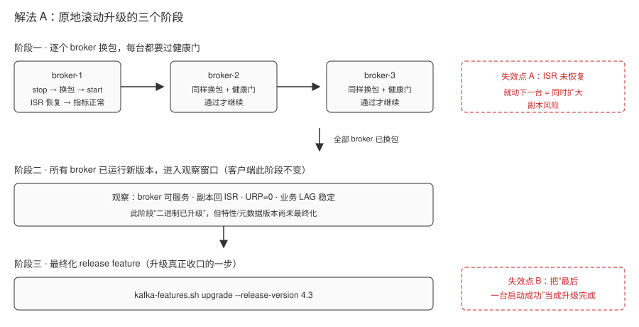
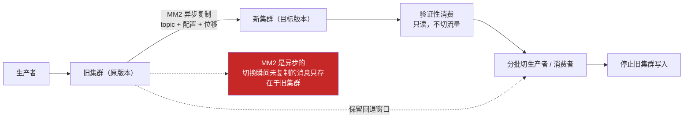
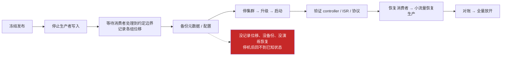
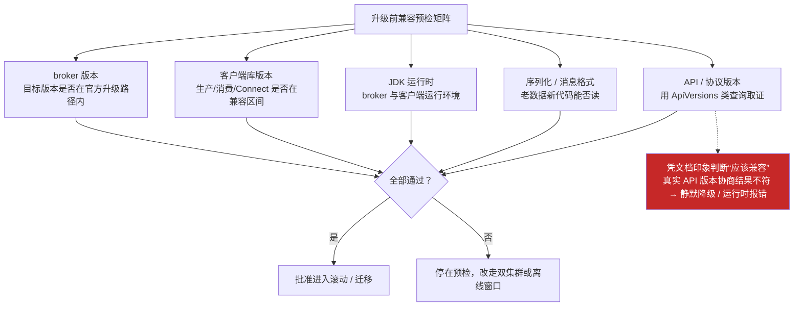
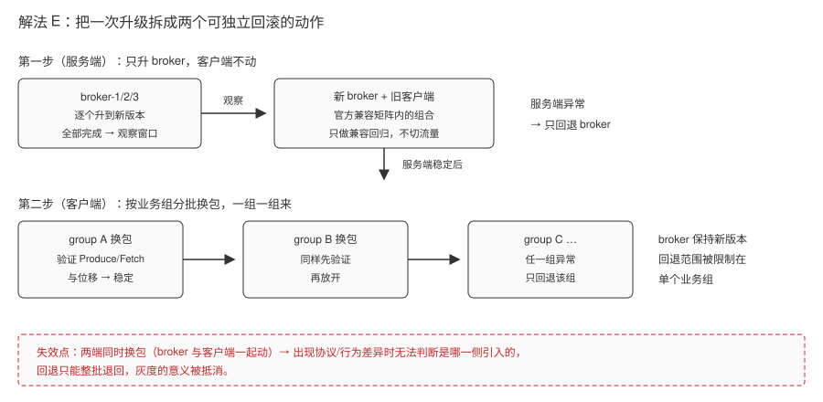
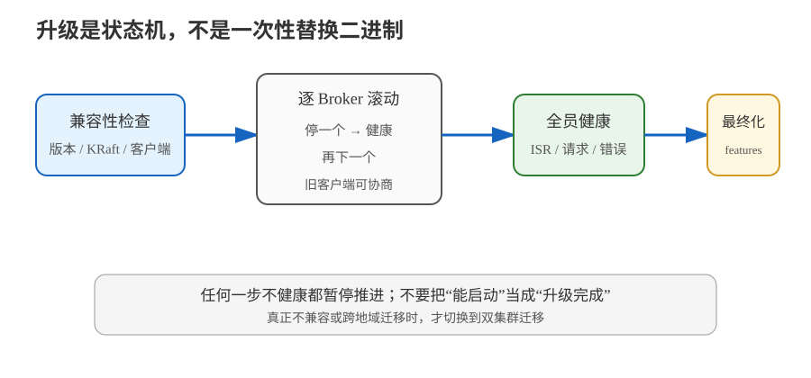

# 场景 11：版本要升级，但业务不能停（规模压力题）

**场景描述**：现有 KRaft 集群需要升级到 Kafka 4.3，生产者、消费者和 Connect 不能同一天全部换包。要求升级期间持续服务，升级后能确认客户端没有因为协议或 Java 运行时不兼容而静默降级；若验证失败，要知道能回到哪一步，不能把“回滚”写成一句口号。

**🔒 先自己想 30 秒**：服务器二进制能滚动升级，是否代表所有客户端都能继续工作？“已经重启到新版本”和“已经完成升级”在 Kafka 里是同一个状态吗？

<details><summary>💡 提示（分维度想）</summary>

- **三种兼容**：旧客户端能否和新 broker 对话？新客户端能否和旧 broker 对话？应用/序列化数据是否仍能读？
- **升级边界**：二进制升级、特性/元数据版本最终化、客户端切换分别在哪一步发生？
- **替代方案**：如果版本差异、JDK 或旧协议不满足滚动条件，是否该新建集群迁移，而不是硬滚？

</details>

<details><summary>📖 展开解法</summary>

### 解法一览（效果按题定制）

| 解法 | 可用性 / 切换风险 | 代价 | 适用边界 |
|---|---|---|---|
| **A · 原地滚动升级 + 逐节点健康门** | 停机：低；数据切换风险：中低 | 需要 KRaft/Java/客户端预检、逐节点等待 ISR、灰度和最终化 | 版本在官方兼容窗口内，能控制发布节奏 |
| **B · 新旧集群并行 + MirrorMaker 2 迁移** | 停机：低；切换面：可控 | 双集群成本、复制滞后、topic 名与位移切换复杂 | 客户端或集群不满足原地滚动条件 |
| **C · 维护窗口离线升级** | 过程最简单；停机：高 | 需要业务停写/停读、备份和明确恢复点 | 低流量、短窗口，或官方不支持滚动的版本跳跃 |
| **D · 协议与运行时兼容预检矩阵** | 不直接切流量，但把“能不能升”变成可判定清单 | 需要逐项取证（客户端、JDK、ApiVersions、序列化格式），前置工作量大 | 所有升级路线的第一步，任何路线都要先做 |
| **E · 先升 broker、再分批灰度客户端** | 两端解耦，出问题能定位到具体一侧；可独立回滚 | 需要维护“服务端已升、客户端未齐”的中间状态，灰度周期拉长 | 客户端数量多、由不同团队/业务组维护时 |

### 各解法详解

#### 解法 A · 原地滚动升级

**思路**：先验证前置条件，再一次只动一个 broker；每台恢复后确认 broker 可服务、分区副本回到 ISR、核心指标正常，再动下一台。所有 broker 已运行新软件后，才按官方步骤最终化 release feature。



> 读图指引：从左到右是三个阶段——逐个 broker 换包（每台都要过“健康门”才动下一台）、全部 broker 已运行新版本、最后才最终化 release feature。**红框是失效点**：把“最后一台 broker 启动成功”当成“升级已完成”，跳过最终化；或者某台起来了但 ISR 还没恢复就继续下一台，等于在同一时刻扩大副本风险。

```bash
# 先查当前 feature/metadata 状态；输出格式随版本变化，以本机 --help 为准
kafka-features.sh --bootstrap-server localhost:9092 describe

# 每次只停止一个 broker，优雅退出后换包并启动；等待 ISR 和业务指标恢复
# 逐节点执行：stop -> upgrade binary/JDK -> start -> verify -> next

# 所有 broker 运行新版本且观察通过后，再最终化目标 release
kafka-features.sh --bootstrap-server localhost:9092 \
  upgrade --release-version 4.3
```

> **代价 / 坑**：Kafka 4.3 官方升级指南要求 KRaft 集群满足版本前置条件；4.3 只支持 KRaft，ZooKeeper 集群不能直接把 broker 换成 4.3。官方还明确区分“逐 broker 升级”和“最终化升级”，两者之间要留观察窗口；不要把最后一台启动成功当成特性已经最终化。

**来源**：Apache Kafka [Upgrading](https://kafka.apache.org/43/getting-started/upgrade/)（4.3 滚动升级步骤与 KRaft 前置条件，核查于 2026-09）；[Compatibility](https://kafka.apache.org/43/getting-started/compatibility/)（客户端、服务端与 JDK 兼容矩阵）。

#### 解法 B · 双集群蓝绿迁移

**思路**：新建目标集群，用 MirrorMaker 2 复制 topic 数据、配置和需要的消费组位移；先让目标端验证性消费，再按业务组分批切换生产者和消费者，最后停止旧集群写入。



> 读图指引：正常路径是旧集群继续服务，MM2 把数据/配置/位移异步搬到新集群，验证性消费通过后按业务组分批切生产者与消费者，最后停旧写。**红框是它的固有代价**：MM2 不是同步复制，切换那一刻两端存在复制滞后，未同步的消息只在新集群缺失、只在旧集群存在——这决定了 RPO 不为零，切换前必须把 RPO 写成可接受数字，并保留旧集群可写的回退窗口。

```properties
# mm2.properties：示意，真正上线前按目标版本的 Connect/MM2 配置核对
clusters=old,new
old.bootstrap.servers=old-kafka.example.com:9092
new.bootstrap.servers=new-kafka.example.com:9092
old->new.enabled=true
old->new.topics=orders|payments
old->new.groups=order-processor|risk-checker
```

```text
旧集群写入 ──MM2──> 新集群验证消费
     │                   │
     └─ 保留回退窗口 ─────┘
             ↓
       分批切生产者/消费者
             ↓
       对账复制滞后、位移、业务结果
```

> **代价 / 坑**：MM2 是异步复制，切换前必须定义 RPO；目标 topic 的默认命名策略、消费位移 checkpoint、ACL 和回切路径都要实测。新集群可用不等于业务已经切换成功。

**来源**：Apache Kafka [Geo-Replication](https://kafka.apache.org/43/operations/geo-replication-cross-cluster-data-mirroring/)（MM2 数据/配置/位移复制与切换取舍，核查于 2026-09）。

#### 解法 C · 维护窗口离线升级

**思路**：适用于无法满足滚动升级前置条件的版本跳跃或低流量环境：停写、等待消费者处理到约定边界、做备份/快照、停集群升级、启动后做协议与业务验收，再恢复流量。



> 读图指引：整条链是“先冻结再动手”——停写、等消费到边界、记录位移、备份、升级、验证、小流量恢复、对账、全量放开。**红框是这条路线唯一的保命绳**：这条路把风险从“兼容性与双写切换”换成了“停机窗口与恢复口”，一旦位移没记全、备份不可用或恢复步骤没演练过，停机时间就不是升级时间，而是不可预估的停摆。

```text
冻结发布 → 停止生产者写入 → 记录各组位移
       → 备份元数据/配置 → 停集群升级
       → 启动并验证 controller/ISR/协议 → 恢复消费者
       → 小流量恢复生产 → 对账 → 全量放开
```

> **代价 / 坑**：这条路线把复杂度从“兼容性与双写切换”换成“停机窗口与恢复验证”。如果没有记录位移、明确备份和可演练的恢复步骤，所谓离线升级并不比滚动升级安全。

**来源**：Apache Kafka [Upgrading](https://kafka.apache.org/43/getting-started/upgrade/)（滚动与版本前置条件，核查于 2026-09）；[Basic Kafka Operations](https://kafka.apache.org/43/operations/basic-kafka-operations/)（集群操作与副本健康）。

#### 解法 D · 协议与运行时兼容预检矩阵

**思路**：把“能不能升”从感觉变成一张**逐项可勾选的清单**。升级前对每一条依赖分别取证：broker 版本、各客户端库版本、JDK 版本、序列化/消息格式、以及客户端实际使用的 API/协议版本。取证不是翻文档猜，而是让客户端和 broker 互相“报出”各自支持的协议版本——Apache Kafka 提供了 ApiVersions 一类的协议交互用来查询支持范围。清单一格不通过，就不再往下滚。



> 读图指引：正常路径是五类依赖逐项取证，全部通过才放行到滚动或迁移。**红框是它要防的东西**：兼容性不能凭“文档上写着兼容”下结论，客户端实际协商到的 API 版本、实际加载的消息格式才是判据；预检没做，问题就会以“静默降级”或运行时报错的形式推迟到生产。⏳ 置信度：低（ApiVersions 的具体查询方式与输出格式随版本和客户端库而异，落地时以本地 `--help` 与官方文档为准）。

```bash
# 1. 查 broker 当前特性/元数据版本状态（输出格式随版本变化）
kafka-features.sh --bootstrap-server localhost:9092 describe

# 2. 查客户端实际连接的 broker 版本与 API 版本协商结果
kafka-broker-api-versions.sh --bootstrap-server localhost:9092
# 看每个 broker 支持的 API key 与版本区间

# 3. 客户端侧：记录库版本与运行时版本，纳入升级清单
#    - 生产者/消费者/Connect 各自版本
#    - JDK 版本
#    - 关键序列化库版本
```

> ⚠️ 预检矩阵的价值在于“留证”。把每一项的**取值、取证方式、判据、结论**写进升级记录，出问题时才能回答“我们当时凭什么认为可以升”。只写“已确认兼容”四个字，等于没做预检。

> **代价 / 坑**：这一步不切换任何流量，所以很容易被当成走过场。它的成本是前置工时——尤其客户端数量多、由不同团队维护时，收集真实版本信息本身就是协调工作。但不做的代价是：兼容问题在滚动到一半或切换当天才暴露，回退成本远高于预检。

**来源**：Apache Kafka [Upgrading](https://kafka.apache.org/43/getting-started/upgrade/)（版本前置条件与升级路径，核查于 2026-09）；[Compatibility](https://kafka.apache.org/43/getting-started/compatibility/)（客户端、broker 与 JDK 兼容矩阵）。

#### 解法 E · 先升 broker、再分批灰度客户端

**思路**：把一次升级拆成**两个可独立回滚的动作**。第一步只升 broker，把所有 broker 换成新版本并观察一段时间；服务端稳定后，第二步才按业务组分批换客户端包。这样任何一侧出问题，都能明确回答“是服务端还是客户端”，而不是两端同时变化、只能整体回退。



> 读图指引：上半部分是第一步——所有 broker 先完成升级并进入观察窗口，此时客户端仍是旧版本，属于官方支持的“新 broker + 旧客户端”组合；下半部分是第二步——客户端按业务组分批换包，每组独立验证、独立回滚。**红框是失效点**：如果两端同时换，一旦出现协议或行为差异，无法判断是 broker 还是客户端引入的，回退也只能整批退回，灰度的意义被抵消。

```text
第一步（服务端）：broker-1 → broker-2 → broker-3 逐个升级 → 观察窗口
                  客户端保持旧版本，只做兼容性回归

第二步（客户端）：按业务组灰度，一组一组换包
                  group A 换包 → 验证 Produce/Fetch/位移 → 稳定后再动 group B
                  任一组异常 → 只回退该组，broker 保持新版本
```

> ⚠️ 中间会长期存在“服务端已升、客户端未齐”的状态，必须确认这个组合在官方兼容矩阵内（见[解法 D](#解法-d--协议与运行时兼容预检矩阵)），并且运维团队要清楚当前处于哪一步、哪些客户端还没换。

> **代价 / 坑**：灰度周期被拉长，中间状态的配置、监控和文档都要跟着维护；且“先升 broker”意味着要接受一段时间的新旧客户端混跑。换来的是可定位性——出问题时只需在单一维度上判断，而不是在两端同时变化的组合里排查。

**来源**：Apache Kafka [Upgrading](https://kafka.apache.org/43/getting-started/upgrade/)（broker 与客户端升级顺序、观察窗口，核查于 2026-09）；[Compatibility](https://kafka.apache.org/43/getting-started/compatibility/)（新旧客户端与 broker 的双向兼容，核查于 2026-09）。

### 替代路线（非本课程技术栈）

| 替代方案 | 思路 | 与 Kafka 方案的差异 |
|---|---|---|
| **Pulsar 双集群切换** | 用复制策略把消息同步到目标集群，再切换租户/命名空间流量 | 迁移模型不同，存储与 broker 解耦；需要重新验证客户端和订阅语义 |
| **云托管 Kafka 的受控升级** | 由云平台执行 broker 替换和兼容检查，应用只按窗口配合 | 降低底层操作量，但仍需验证客户端、schema、位移和回退；服务商能力不是协议兼容的替代品 |

### 推荐路径（递进）

1. **先做 D 的兼容预检矩阵**：broker 版本、客户端库版本、JDK、序列化格式、API/协议版本逐项取证。清单不通过就不进入下一步，这是所有路线共用的第一道门。
2. 预检通过则走 **A 的原地滚动**：逐节点换包，每台过健康门，全部完成后才最终化 release feature。
3. **服务端稳定后用 E 分批灰度客户端**：先升 broker、再按业务组换客户端包，让两端可独立定位、独立回滚。
4. 任一硬前置不满足（D 的清单有项不过）→ 切 **B 双集群迁移**：接受复制滞后，用分批切换换回退空间。
5. 低流量且明确可停机时才选 **C**；无论哪条路线，都把“验证窗口”和“回退边界”写成可执行步骤。

### 知识点挂钩

- listeners、安全端口与在线迁移 → 阶段 5 · [课 11 Kafka 安全体系](../stages/5-生产落地延伸/lessons/lesson-11-Kafka安全体系.md)
- 消息格式、wire protocol 与兼容性 → 阶段 5 · [课 13 协议与消息格式](../stages/5-生产落地延伸/lessons/lesson-13-协议与消息格式.md)；阶段 7 · [课 19 协议版本与兼容性](../stages/7-实现原理/lessons/lesson-19-协议版本与兼容性.md)
- 请求处理、controller/协调者健康 → 阶段 7 · [课 17 网络层与请求处理模型](../stages/7-实现原理/lessons/lesson-17-网络层与请求处理模型.md)；[课 18 消费者位移与协调者](../stages/7-实现原理/lessons/lesson-18-消费者位移与协调者.md)
- **解法映射**：A → [课 11](../stages/5-生产落地延伸/lessons/lesson-11-Kafka安全体系.md) + [课 19](../stages/7-实现原理/lessons/lesson-19-协议版本与兼容性.md)；B → [课 10](../stages/4-实战与架构落地/lessons/lesson-10-项目架构设计落地.md) + [课 19](../stages/7-实现原理/lessons/lesson-19-协议版本与兼容性.md)；C → [课 16](../stages/6-运维与可观测/lessons/lesson-16-集群运维操作.md) + [课 19](../stages/7-实现原理/lessons/lesson-19-协议版本与兼容性.md)；D → [课 19](../stages/7-实现原理/lessons/lesson-19-协议版本与兼容性.md) + [课 13](../stages/5-生产落地延伸/lessons/lesson-13-协议与消息格式.md)；E → [课 19](../stages/7-实现原理/lessons/lesson-19-协议版本与兼容性.md) + [课 16](../stages/6-运维与可观测/lessons/lesson-16-集群运维操作.md)

### 什么情况下此方案不适用

- ZooKeeper 集群未先完成 KRaft 迁移，却直接按 Kafka 4.3 滚动升级。
- 旧客户端仍处于官方兼容矩阵之外，或依赖已移除的协议/API，却把“broker 能启动”当成兼容证明。
- 不能接受 MM2 异步复制产生的 RPO，却把双集群迁移当作零丢失方案。

### 做错会踩的坑

- 升级一台后未等 ISR 恢复就继续下一台 → 把滚动升级变成同时扩大副本风险（解法 A 的红框）。
- 只验证端口能连，不验证 Produce/Fetch/消费组位移和业务事件 → 协议兼容问题被推迟到生产。
- 只写“失败就回滚”，没有规定回滚点、位移、旧集群写入状态和对账标准 → 回滚不可执行。
- 跳过 D 的兼容预检，凭“文档上写着兼容”就开滚 → 真实 API 版本协商不符时静默降级或运行时报错。
- 两端同时换包（broker 和客户端一起动）→ 出问题无法定位是哪一侧引入的，灰度失去意义（解法 E 的红框）。
- 把“最后一台启动成功”当成“升级完成” → 漏掉最终化，特性/元数据版本并未真正升上去（解法 A）。

</details>



> 读图指引：从左到右先做兼容预检，再分流到原地滚动、双集群迁移或维护窗口；“二进制已升级”只是中间节点，业务验收和特性最终化才是收口。

➡️ **返回**：[场景解法库索引](INDEX.md) ｜ **上一场景**：[场景 10](场景-10-新增broker与分区重分配.md)
