# Kafka 系统学习 · 课程手册

> 本手册汇总 `kafka/` 全部教学内容：4 个阶段 10 课 + 综合实战项目 + 实战经验与排障速查手册。
> **定位**：复习与速查用的"一本书"。想系统学请回到各课原文（本手册每课都给了链接），想查问题直接翻 [实战与排障](#四实战与排障)。
> 汇总完成时间：2026-08-31

## 怎么用这本手册

| 你的目的 | 看哪里 |
|---------|--------|
| 快速回忆全课讲了什么 | [一、阶段总览](#一阶段总览) → 各阶段章节 |
| 忘了某一课的细节 | [二、全部课时汇总](#二全部课时汇总)，按阶段找到该课的一图总结 + 链接 |
| 想知道"我该不该用 Kafka" | [课 10 决策清单](#课-10项目架构设计落地) + [适用边界](08-实战经验.md) |
| 线上出问题了 | [四、实战与排障](#四实战与排障)（排障手册按症状倒查） |
| 新要求来了怎么设计 | [四、实战与排障](#四实战与排障)（场景解法库：多解法权衡，先想后看） |
| 想动手练 | [三、综合实战项目](#三综合实战项目电商订单事件中心) |

## 故事主线

- **主角**：消息的流动（数据 / 事件如何在系统之间流转）
- **冲突**：系统之间直接调用导致耦合、积压、丢失、扛不住流量峰值
- **收束**：能基于 Kafka 设计事件驱动架构，并写出生产级的生产者 / 消费者代码

---

## 一、阶段总览

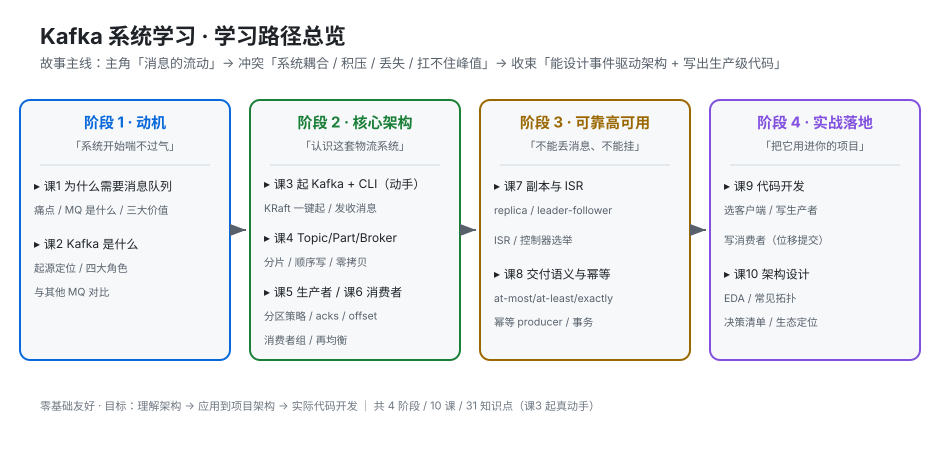

| 阶段 | 主题 | 目标 | 必须掌握 | 对应课 |
|------|------|------|---------|--------|
| 1 | 为什么需要 Kafka（动机） | 搞懂「为什么需要消息队列」，说清 Kafka 的定位与四大角色 | 能解释「为什么不能直接同步调用」「Kafka 是哪四个角色在协作」 | 课 1-2 |
| 2 | Kafka 核心架构（真动手） | 用真集群动手，说清 Topic/Partition/Broker 存储模型，讲透生产者与消费者机制 | 能跑通"建 Topic → 发 → 收"；能画出数据流并解释 offset 与再均衡 | 课 3-6 |
| 3 | 可靠性与高可用 | 理解副本如何保证不丢数据，说清三种交付语义与幂等 | 能说清「ISR 缩小时会不会丢消息」「为什么默认至少一次会重复」 | 课 7-8 |
| 4 | 实战与架构落地 | 写生产/消费代码、设计事件驱动架构 | 跑通最小可用 demo；能画出基于 Kafka 的项目架构图 | 课 9-10 |
| 5 | 生产落地延伸（2026-09-10 新增） | 补上主线未覆盖的生产必备域，从「会写 demo」走到「敢上生产」 | 能配通 SASL+ACL 最小安全集群；能说清一个 ProduceRequest 在字节层面长什么样；能判断哪些主题适合开分层存储 | 课 11-14 |
| 6 | 运维与可观测（2026-09-14 新增） | 从「敢上生产」走到「上生产之后活得下去」——知道集群好不好、能安全改动它 | 能说出 5 个「正常值应为 0」的关键指标；能独立跑完一次带限流的分区重分配并确认限流已清除；能解释为什么加了新 broker 却不分担数据 | 课 15-16 |
| 7 | 实现原理（2026-09-14 新增） | 从「会用」走到「知道为什么」——把机制追到实现依据 | 能画出请求从网卡到落盘的链路并指出咽喉；能解释 CoordinatorLoadInProgressException 为何是自愈过程；能说清为什么升级可先升一边且不停服 | 课 17-19 |

> 六个阶段一条主线：**动机（为什么）→ 机制（怎么工作）→ 保障（怎么可靠）→ 落地（怎么用对）→ 上生产（怎么敢用）→ 上线后（怎么活得下去）**。阶段 5、6 均属延伸补充，主线 10 课不依赖它们。

---

## 二、全部课时汇总

## 阶段 1：为什么需要 Kafka

### 课 1：为什么需要消息队列

**知识点**：直接同步调用的痛点 · 消息队列是什么 · 削峰/异步/解耦三大价值

**一图总结**

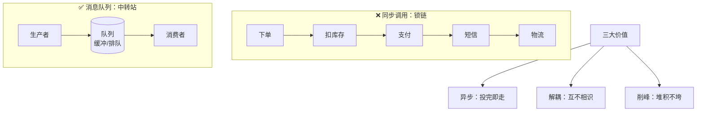
```mermaid
flowchart TD
    subgraph 同步调用[❌ 同步调用：锁链]
        A1[下单] --> B1[扣库存] --> C1[支付] --> D1[短信] --> E1[物流]
    end
    subgraph 消息队列[✅ 消息队列：中转站]
        P2[生产者] --> Q2[(队列<br/>缓冲/排队)]
        Q2 --> C2[消费者]
    end
    V[三大价值] --> V1[异步：投完即走]
    V --> V2[解耦：互不相识]
    V --> V3[削峰：堆积不垮]
```

**核心结论**：同步调用是锁链，任一环节超时会拖死整条链路（雪崩）。消息队列把锁链拆成"投递 + 排队 + 处理"，换来三大价值——**异步**（投完即走）、**解耦**（互不相识）、**削峰**（堆积不垮，洪峰过后慢慢追）。

> 📖 [课 1 全文](stages/1-为什么需要Kafka/lessons/lesson-01-为什么需要消息队列.md)

### 课 2：Kafka 是什么 & 起源与定位

**知识点**：Kafka 起源与定位 · 四大角色全景 · Kafka vs 其他 MQ（直觉对比）

**一图总结**

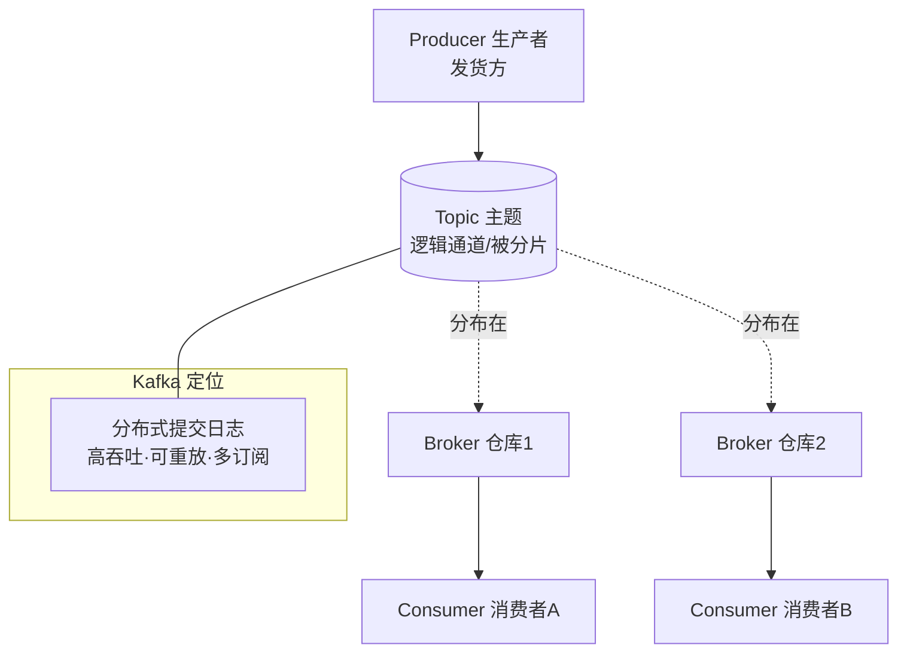
```mermaid
flowchart TD
    P[Producer 生产者<br/>发货方] --> T[(Topic 主题<br/>逻辑通道/被分片)]
    T -.分布在.-> B1[Broker 仓库1]
    T -.分布在.-> B2[Broker 仓库2]
    B1 --> C1[Consumer 消费者A]
    B2 --> C2[Consumer 消费者B]
    subgraph 定位[Kafka 定位]
        D[分布式提交日志<br/>高吞吐·可重放·多订阅]
    end
    T --- D
```

**核心结论**：Kafka 的本质是**分布式提交日志**——消息读后不删（受 retention 控制），每个消费者各自维护 offset，因此可重放、多订阅。四大角色：Producer / Topic / Broker / Consumer。**选型直觉**：Kafka 强在海量事件流与可重放；RabbitMQ 强在复杂路由的业务解耦；需要按规则分发且吞吐中等时，别硬上 Kafka。

> 📖 [课 2 全文](stages/1-为什么需要Kafka/lessons/lesson-02-Kafka是什么与起源定位.md)

## 阶段 2：Kafka 核心架构

### 课 3：本地起 Kafka + CLI 快速上手

**知识点**：KRaft 一键起（Docker） · 创建 Topic + 生产消费一条消息 · 用 CLI 观察 Partition

**一图总结**

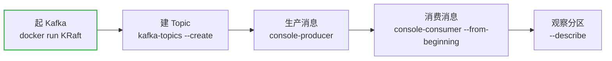
```mermaid
flowchart LR
    A[起 Kafka<br/>docker run KRaft] --> B[建 Topic<br/>kafka-topics --create]
    B --> C[生产消息<br/>console-producer]
    C --> D[消费消息<br/>console-consumer --from-beginning]
    D --> E[观察分区<br/>--describe]
    style A stroke:#3fb950,stroke-width:2px
```

**核心结论**：Kafka 4.0 已**彻底移除 ZooKeeper**，默认 KRaft 模式，单节点用 `KAFKA_PROCESS_ROLES='broker,controller'` 一个节点兼两职。看历史消息必须加 `--from-beginning`（默认只消费启动后的新消息）。

> 📖 [课 3 全文](stages/2-核心架构/lessons/lesson-03-本地起Kafka与CLI快速上手.md)

### 课 4：Topic、Partition 与 Broker

**知识点**：Topic 与 Partition（分片思想） · 顺序写磁盘（为什么快 · 上） · 零拷贝（为什么快 · 下） · Broker 与集群

**一图总结**

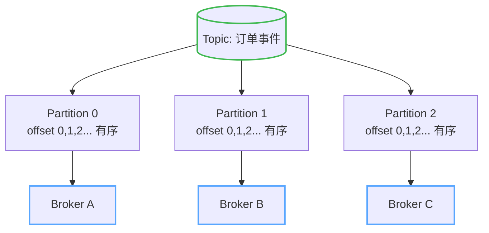
```mermaid
flowchart TD
    T[(Topic: 订单事件)] --> P0[Partition 0<br/>offset 0,1,2... 有序]
    T --> P1[Partition 1<br/>offset 0,1,2... 有序]
    T --> P2[Partition 2<br/>offset 0,1,2... 有序]
    P0 --> B1[Broker A]
    P1 --> B2[Broker B]
    P2 --> B3[Broker C]
    style T stroke:#3fb950,stroke-width:2px
    style B1 stroke:#58a6ff,stroke-width:2px
    style B2 stroke:#58a6ff,stroke-width:2px
    style B3 stroke:#58a6ff,stroke-width:2px
```

**核心结论**：Topic 是逻辑通道，**Partition 才是真家伙**——分片带来并行，分区数 = 并行度上限。Kafka 快的两根支柱：**顺序写磁盘**（避免随机寻道）+ **零拷贝**（数据不经过用户态，直接从页缓存发到网卡）。有序性是**分区级**的：分区内严格有序，跨分区不保证。

> 📖 [课 4 全文](stages/2-核心架构/lessons/lesson-04-Topic、Partition与Broker.md)

### 课 5：生产者 Producer

**知识点**：生产者发送流程 · 分区策略 · acks 与发送可靠性

**一图总结**

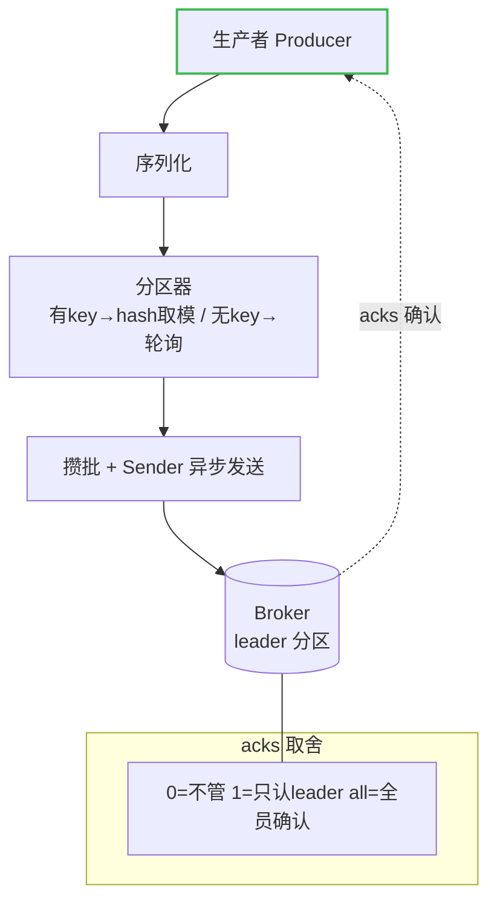
```mermaid
flowchart TD
    A["生产者 Producer"] --> B["序列化"]
    B --> C["分区器<br/>有key→hash取模 / 无key→轮询"]
    C --> D["攒批 + Sender 异步发送"]
    D --> E[("Broker<br/>leader 分区")]
    E -.acks 确认.-> A
    subgraph 可靠性["acks 取舍"]
        F["0=不管 1=只认leader all=全员确认"]
    end
    E --- F
    style A stroke:#3fb950,stroke-width:2px
```

**核心结论**：发送链路是 **序列化 → 分区器 → 攒批 → Sender 异步发送**。指定 key 时用 murmur2 哈希取模固定分区（**同 key 必同分区，这是保序的手段**），无 key 则轮询。`acks=1` 只等 leader 写本地日志就返回，那段「未同步窗口」正是 leader 宕机丢消息的根源——**真正不丢要 `acks=all`**。

> 📖 [课 5 全文](stages/2-核心架构/lessons/lesson-05-生产者Producer.md)

### 课 6：消费者与消费者组

**知识点**：消费模型与位移 offset · 消费者组与再均衡 · 位移提交与重复/丢失

**一图总结**

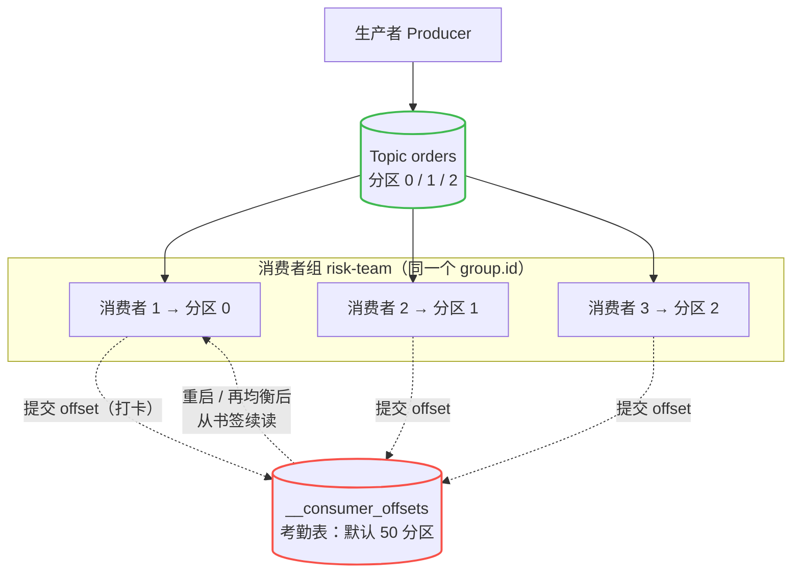
```mermaid
flowchart TD
    P["生产者 Producer"] --> T[("Topic orders<br/>分区 0 / 1 / 2")]
    subgraph group["消费者组 risk-team（同一个 group.id）"]
        C1["消费者 1 → 分区 0"]
        C2["消费者 2 → 分区 1"]
        C3["消费者 3 → 分区 2"]
    end
    T --> C1
    T --> C2
    T --> C3
    C1 -. 提交 offset（打卡）.-> OC[("__consumer_offsets<br/>考勤表：默认 50 分区")]
    C2 -. 提交 offset .-> OC
    C3 -. 提交 offset .-> OC
    OC -. 重启 / 再均衡后<br/>从书签续读 .-> C1
    style T stroke:#3fb950,stroke-width:2px
    style OC stroke:#f85149,stroke-width:2px
```

**核心结论**：口诀是**组内分工、组间广播**——竞争只发生在组内（一个分区同一时刻只能被组内一个消费者消费，所以并行上限 = 分区数），不同组各自拿到全量、各自记账。位移存在 `__consumer_offsets` 里当"书签"。**位移提交时机决定语义**：先处理后提交 = 不丢但可能重复；先提交后处理 = 可能丢。

> 📖 [课 6 全文](stages/2-核心架构/lessons/lesson-06-消费者与消费者组.md)

## 阶段 3：可靠性与高可用

### 课 7：副本机制与故障转移

**知识点**：副本与 leader/follower · ISR 机制 · 控制器选举与故障转移

**一图总结**

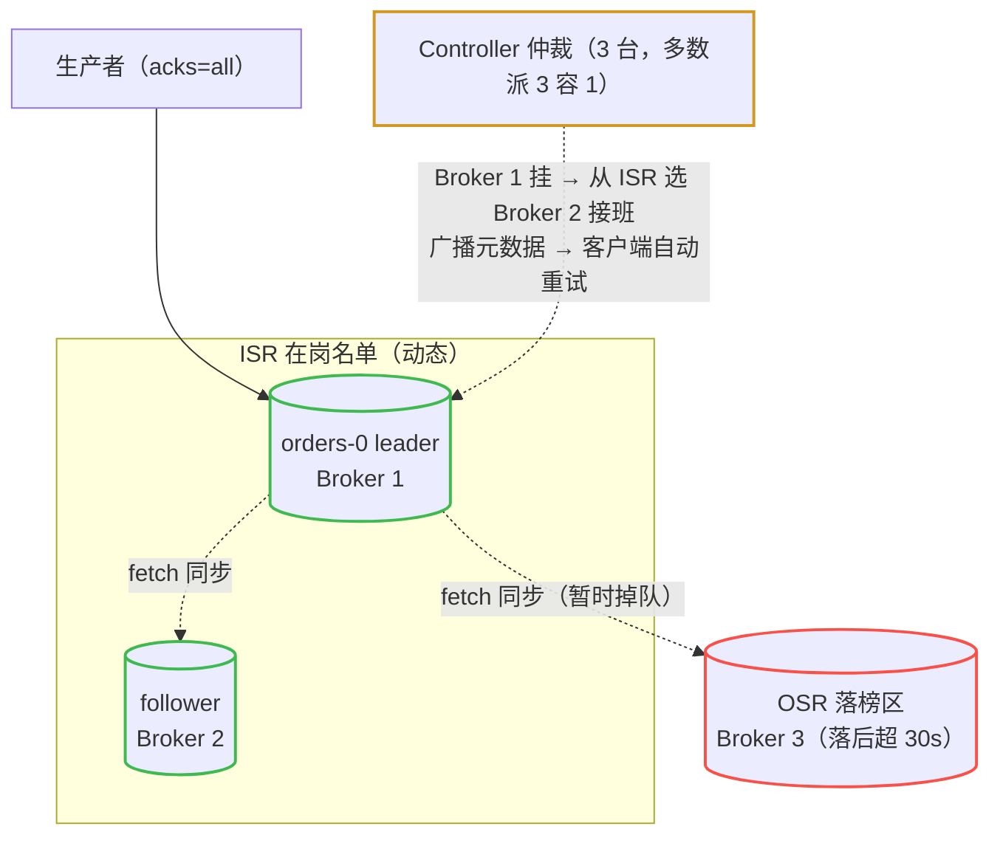
```mermaid
flowchart TD
    P["生产者（acks=all）"] --> L[("orders-0 leader<br/>Broker 1")]
    subgraph ISR["ISR 在岗名单（动态）"]
        L
        F1[("follower<br/>Broker 2")]
    end
    F2[("OSR 落榜区<br/>Broker 3（落后超 30s）")]
    L -. fetch 同步 .-> F1
    L -. fetch 同步（暂时掉队）.-> F2
    CT["Controller 仲裁（3 台，多数派 3 容 1）"]
    CT -. "Broker 1 挂 → 从 ISR 选 Broker 2 接班<br/>广播元数据 → 客户端自动重试" .-> L
    style L stroke:#3fb950,stroke-width:2px
    style F1 stroke:#3fb950,stroke-width:2px
    style F2 stroke:#f85149,stroke-width:2px
    style CT stroke:#d29922,stroke-width:2px
```

**核心结论**：**单 leader 模型**——读写都走 leader（保证 offset 由唯一权威编号），follower 是"特殊的消费者"，持续 fetch 同步待命。ISR 是在岗名单，接班只从 ISR 选；掉队的进 OSR，追上可回归。**最反直觉的一点**：`min.insync.replicas=1`（默认）时 ISR 只剩 leader 也能写入，`acks=all` 照常成功——但保障已**静默退化**（"all"实际只等到 1 份确认）。生产推荐 `min.insync.replicas=2`，让退化为**显式拒绝**而非带病运行。

> 📖 [课 7 全文](stages/3-可靠性与高可用/lessons/lesson-07-副本机制与故障转移.md)

### 课 8：交付语义与幂等

**知识点**：三种交付语义 · 幂等 producer · 事务简介

**一图总结**

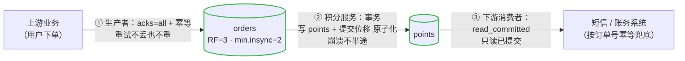
```mermaid
flowchart LR
    A["上游业务<br/>（用户下单）"] -->|"① 生产者：acks=all + 幂等<br/>重试不丢也不重"| ORD[("orders<br/>RF=3 · min.insync=2")]
    ORD -->|"② 积分服务：事务<br/>写 points + 提交位移 原子化<br/>崩溃不半途"| PTS[("points")]
    PTS -->|"③ 下游消费者：read_committed<br/>只读已提交"| C["短信 / 账务系统<br/>（按订单号幂等兜底）"]
    style ORD stroke:#3fb950,stroke-width:2px
    style PTS stroke:#3fb950,stroke-width:2px
```

**核心结论**：Kafka 3.x 默认配置（acks=all + 无限重试 + 先处理后自动提交位移）的端到端语义是 **at-least-once**，不是 exactly-once——两处都可能重复。**每一跳的保障加起来才是不丢不重，任何一环掉链子就退化到那一环的水平**。
**幂等最容易误解的边界**：去重键是「PID + 分区 + 序列号」，它只挡**客户端内部对同一次发送的自动重试**；应用代码手动再调一次 `send()` 会拿到新序列号，broker 当成新消息正常写入。exactly-once 要显式拼装幂等 + 事务，且**事务只覆盖 Kafka 内部**（topic + `__consumer_offsets`），一旦要写数据库就失效，仍需业务幂等兜底。

> 📖 [课 8 全文](stages/3-可靠性与高可用/lessons/lesson-08-交付语义与幂等.md)

## 阶段 4：实战与架构落地

### 课 9：代码开发实战

**知识点**：选客户端与环境 · 写生产者 · 写消费者

**一图总结**

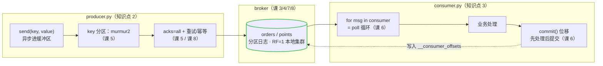
```mermaid
flowchart LR
    subgraph 生产侧 ["producer.py（知识点 2）"]
        S1["send(key, value)<br/>异步进缓冲区"] --> S2["key 分区：murmur2<br/>（课 5）"]
        S2 --> S3["acks=all + 重试/幂等<br/>（课 5 / 课 8）"]
    end
    subgraph broker ["broker（课 3/4/7/8）"]
        T[("orders / points<br/>分区日志 · RF=1 本地集群")]
    end
    subgraph 消费侧 ["consumer.py（知识点 3）"]
        C1["for msg in consumer<br/>= poll 循环（课 6）"] --> C2["业务处理"]
        C2 --> C3["commit() 位移<br/>先处理后提交（课 6）"]
    end
    S3 --> T --> C1
    C3 -.->|写入 __consumer_offsets| T
    style T stroke:#3fb950,stroke-width:2px
```

**核心结论**：**每一处关键代码都对应前几课的一个机制**——发送侧管"进"（分区 + 可靠性），消费侧管"出"（进度 + 语义）。客户端选型：学习/中小吞吐用 **kafka-python**（纯 pip 零编译），Python 高吞吐用 **confluent-kafka**（librdkafka C 内核），企业核心链路用 **Java**（新特性第一时间落地）。
**"Kafka 丢消息"的头号原因**：`send()` 是异步的，消息还在本地缓冲区；进程退出时没有 `flush()`/`close()`，缓冲区里的消息根本没发出。修复：退出前 `flush()` + `close()`，关键消息用 `future.get(timeout=10)` 逐条确认。

> 📖 [课 9 全文](stages/4-实战与架构落地/lessons/lesson-09-代码开发实战.md)

### 课 10：项目架构设计落地

**知识点**：事件驱动架构 EDA · 常见拓扑 · 决策清单

**一图总结**

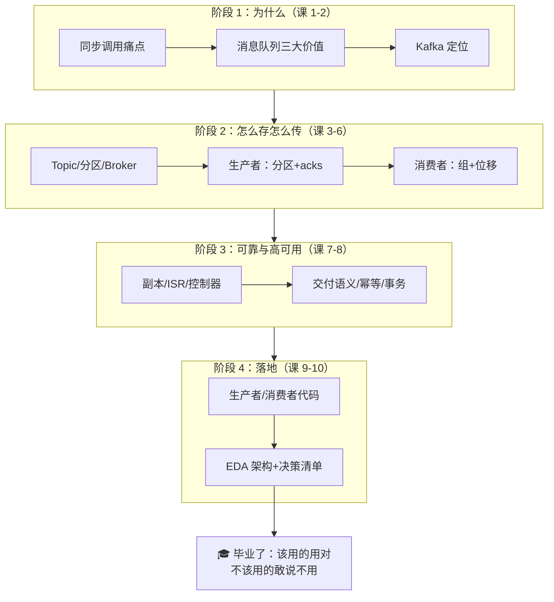
```mermaid
flowchart TB
    subgraph L1 ["阶段 1：为什么（课 1-2）"]
        A1["同步调用痛点"] --> A2["消息队列三大价值"]
        A2 --> A3["Kafka 定位"]
    end
    subgraph L2 ["阶段 2：怎么存怎么传（课 3-6）"]
        B1["Topic/分区/Broker"] --> B2["生产者：分区+acks"]
        B2 --> B3["消费者：组+位移"]
    end
    subgraph L3 ["阶段 3：可靠与高可用（课 7-8）"]
        C1["副本/ISR/控制器"] --> C2["交付语义/幂等/事务"]
    end
    subgraph L4 ["阶段 4：落地（课 9-10）"]
        D1["生产者/消费者代码"] --> D2["EDA 架构+决策清单"]
    end
    L1 --> L2 --> L3 --> L4
    D2 --> E["🎓 毕业了：该用的用对<br/>不该用的敢说不用"]
```

**核心结论**：**事件是过去式的事实陈述，命令是祈使句**。`UserRegistered` 是事件（发布者不关心谁处理），`SendWelcomeEmail` / `UpdatePoints` / `CallRiskEngine` 都是命令——把它们发进事件主干，等于**把同步调用的耦合包了个异步的皮**。正确姿势：积分服务订阅 `UserRegistered` 自己决定加多少分。
**技术选型的答案永远是"看清单"，不是"看热度"**：日均 2000 万事件多下游、大促削峰、需要重放历史——适合 Kafka；每天 500 条、按部门路由、处理完流转下一环节的审批流——不该用 Kafka（那是工作流引擎的活）。

> 📖 [课 10 全文](stages/4-实战与架构落地/lessons/lesson-10-项目架构设计落地.md)

---

## 阶段 5：生产落地延伸

> 2026-09-10 对照 Apache Kafka 4.3 官方文档索引（`web-index/kafka/`）核对主线 10 课后新增，补上生产必备但主线未覆盖的四个域。

### 课 11：Kafka 安全体系

**知识点**：认证·授权·加密 · listeners 与协议映射

**一图总结**

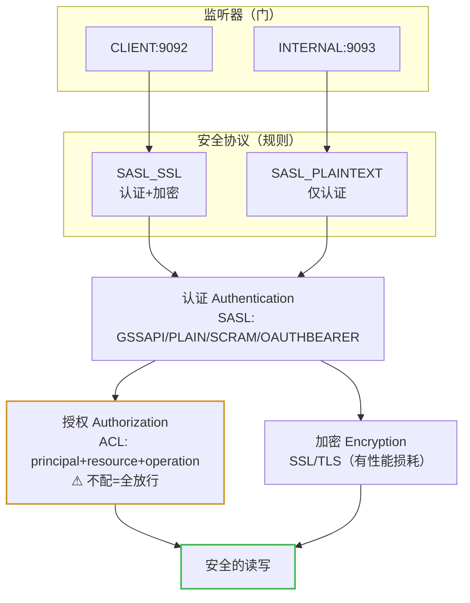
```mermaid
flowchart TD
    subgraph L["监听器（门）"]
        L1["CLIENT:9092"]
        L2["INTERNAL:9093"]
    end
    subgraph P["安全协议（规则）"]
        P1["SASL_SSL<br/>认证+加密"]
        P2["SASL_PLAINTEXT<br/>仅认证"]
    end
    L1 --> P1
    L2 --> P2
    P1 --> A["认证 Authentication<br/>SASL: GSSAPI/PLAIN/SCRAM/OAUTHBEARER"]
    P2 --> A
    A --> B["授权 Authorization<br/>ACL: principal+resource+operation<br/>⚠ 不配=全放行"]
    A --> C["加密 Encryption<br/>SSL/TLS（有性能损耗）"]
    B --> D["安全的读写"]
    C --> D
    style D stroke:#3fb950,stroke-width:2px
    style B stroke:#d29922,stroke-width:2px
```

**核心结论**：**认证 = 你是谁，授权 = 你能干什么，加密 = 路上防偷看**——三者独立、可渐进开启、可混用。最容易踩的坑是「开了认证没配 ACL」：Kafka 默认授权器在无 ACL 时**允许所有操作**，等于刷了工牌就全楼通行。四件套必须成套配：`listeners` 开端口、`listener.security.protocol.map` 定规则、`inter.broker.listener.name` 选内部通道、`advertised.listeners` 告诉客户端真地址（容器/NAT 环境下漏它是排障头号高频问题）。开 ACL 前**务必先设 `super.users`**，否则会把自己锁在门外。

> 📖 [课 11 全文](stages/5-生产落地延伸/lessons/lesson-11-Kafka安全体系.md)

---

### 课 12：多租户与配额

**知识点**：多租户隔离与配额

**一图总结**

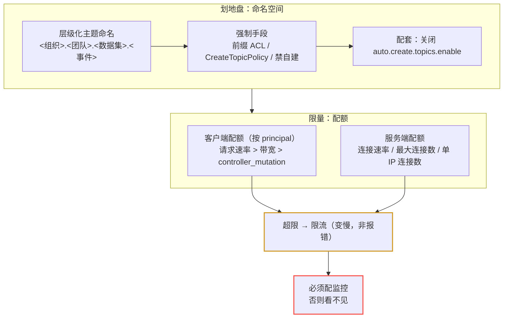
```mermaid
flowchart TD
    subgraph NS["划地盘：命名空间"]
        N1["层级化主题命名<br/>&lt;组织&gt;.&lt;团队&gt;.&lt;数据集&gt;.&lt;事件&gt;"]
        N2["强制手段<br/>前缀 ACL / CreateTopicPolicy / 禁自建"]
        N3["配套：关闭 auto.create.topics.enable"]
        N1 --> N2 --> N3
    end
    subgraph QU["限量：配额"]
        CQ["客户端配额（按 principal）<br/>请求速率 &gt; 带宽 &gt; controller_mutation"]
        SQ["服务端配额<br/>连接速率 / 最大连接数 / 单 IP 连接数"]
    end
    NS --> QU
    CQ --> TH["超限 → 限流（变慢，非报错）"]
    SQ --> TH
    TH --> MON["必须配监控<br/>否则看不见"]
    style TH stroke:#d29922,stroke-width:2px
    style MON stroke:#f85149,stroke-width:2px
```

**核心结论**：**多租户 = 用命名规范划地盘 + 用配额限量**。共享集群的诉求是降本，隔离只是手段，一个团队一套集群的运维成本不现实。配额优先该限的是**请求速率**而非带宽——官方明确指出，请求速率配额的隔离效果往往比带宽配额更显著，因为瓶颈是 broker CPU，带宽只是表象。最关键的一条：**配额超限是限流（throttling），客户端表现为「变慢」而不是「报错」**，所以不配监控根本发现不了自己被限流了。

> 📖 [课 12 全文](stages/5-生产落地延伸/lessons/lesson-12-多租户与配额.md)

---

### 课 13：协议与消息格式

**知识点**：wire protocol 与消息格式

**一图总结**

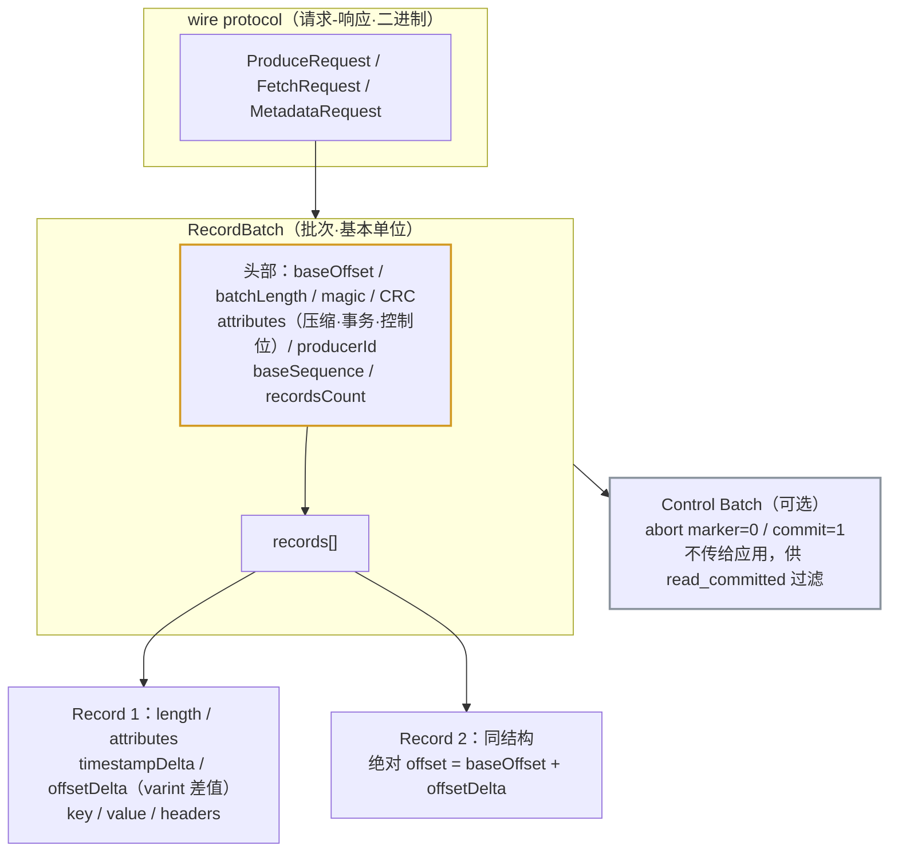
```mermaid
flowchart TD
    subgraph P["wire protocol（请求-响应·二进制）"]
        REQ["ProduceRequest / FetchRequest / MetadataRequest"]
    end
    REQ --> BATCH
    subgraph BATCH["RecordBatch（批次·基本单位）"]
        direction TB
        BH["头部：baseOffset / batchLength / magic / CRC<br/>attributes（压缩·事务·控制位）/ producerId<br/>baseSequence / recordsCount"]
        REC["records[]"]
        BH --> REC
    end
    REC --> R1["Record 1：length / attributes<br/>timestampDelta / offsetDelta（varint 差值）<br/>key / value / headers"]
    REC --> R2["Record 2：同结构<br/>绝对 offset = baseOffset + offsetDelta"]
    BATCH --> CB["Control Batch（可选）<br/>abort marker=0 / commit=1<br/>不传给应用，供 read_committed 过滤"]
    style BH stroke:#d29922,stroke-width:2px
    style CB stroke:#8b949e,stroke-width:2px
```

**核心结论**：**消息永远按批写入——批量是格式的基本假设，不是优化**。这解释了压缩为什么有效（作用于整批，能利用批内重复的 schema）。Record 里**不存绝对 offset**，只存相对批次的 `offsetDelta`（varint 变长编码），批内差值都是 0/1/2 这种小数字，一个字节就够，单条消息的元数据开销因此被压到极低。三个易错细节：整批大小 = `batchLength` + 12 字节；CRC 覆盖 attributes 到批次末尾、**不含 partitionLeaderEpoch**（该字段 broker 收到后才赋值，纳入校验就得每批重算）；`magic` 是版本锚点，必须先解析它才能解释后续字节——这正是新老客户端能共存的技术基础。

> 📖 [课 13 全文](stages/5-生产落地延伸/lessons/lesson-13-协议与消息格式.md)

---

### 课 14：分层存储与配置进阶

**知识点**：分层存储与配置进阶

**一图总结**

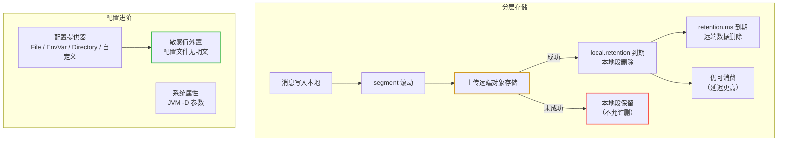
```mermaid
flowchart TD
    subgraph TS["分层存储"]
        W["消息写入本地"] --> ROLL["segment 滚动"]
        ROLL --> UP["上传远端对象存储"]
        UP -- "成功" --> LR["local.retention 到期<br/>本地段删除"]
        UP -- "未成功" --> KEEP["本地段保留<br/>（不允许删）"]
        LR --> RR["retention.ms 到期<br/>远端数据删除"]
        LR --> CON["仍可消费<br/>（延迟更高）"]
    end
    subgraph CFG["配置进阶"]
        CP["配置提供器<br/>File / EnvVar / Directory / 自定义"]
        SP["系统属性<br/>JVM -D 参数"]
        CP --> OUT["敏感值外置<br/>配置文件无明文"]
    end
    style KEEP stroke:#f85149,stroke-width:2px
    style UP stroke:#d29922,stroke-width:2px
    style OUT stroke:#3fb950,stroke-width:2px
```

**核心结论**：**分层存储把存储与计算解耦**——热数据留本地 SSD，冷数据挪远端对象存储，不必按副本倍数加 broker。两级保留务必分清：`local.retention.*` 管本地段、`retention.*` 管远端总保留，且**本地段必须上传成功后才具备删除资格**（保证数据不会两边都没有）。四条限制里最要命的两条：**不支持 compacted topic**；**关集群级开关前必须先删光所有分层 topic**，否则 broker 启动抛异常。另外 Apache Kafka **不提供开箱即用的 RemoteStorageManager**，需自建或选第三方实现。配置提供器则解决「密码进 Git」——把敏感值外置为引用，文件里只留别名。

> 📖 [课 14 全文](stages/5-生产落地延伸/lessons/lesson-14-分层存储与配置进阶.md)

---

## 阶段 6：运维与可观测

> 2026-09-14 对照 Apache Kafka 4.3 官方文档索引（`web-index/kafka/`）二次核对后新增，补上最后两类缺口：官方 `operations/monitoring` 与 `basic-kafka-operations` 两整页此前零覆盖，`hardware-and-os`、`java-version` 亦未展开。
> ✅ 两课结论**全部基于本机真实实测**：3 节点 KRaft 集群 + JMX Exporter + Prometheus + Grafana（工程见 [assets/stage6-observability](assets/stage6-observability)）。

---

### 课 15：监控与可观测

**知识点**：监控与可观测

**一图总结**

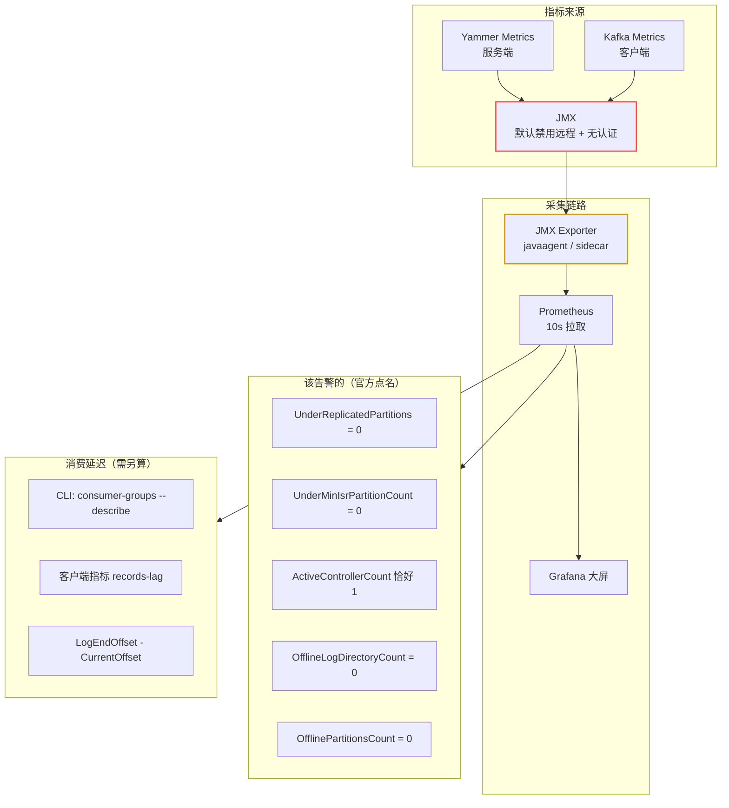
```mermaid
flowchart TB
    subgraph SRC["指标来源"]
        YM["Yammer Metrics<br/>服务端"] --> JMX["JMX<br/>默认禁用远程 + 无认证"]
        KM["Kafka Metrics<br/>客户端"] --> JMX
    end
    subgraph COL["采集链路"]
        JMX --> EXP["JMX Exporter<br/>javaagent / sidecar"]
        EXP --> PROM["Prometheus<br/>10s 拉取"]
        PROM --> GRAF["Grafana 大屏"]
    end
    subgraph ALT["该告警的（官方点名）"]
        A1["UnderReplicatedPartitions = 0"]
        A2["UnderMinIsrPartitionCount = 0"]
        A3["ActiveControllerCount 恰好 1"]
        A4["OfflineLogDirectoryCount = 0"]
        A5["OfflinePartitionsCount = 0"]
    end
    subgraph LAG["消费延迟（需另算）"]
        L1["CLI: consumer-groups --describe"]
        L2["客户端指标 records-lag"]
        L3["LogEndOffset - CurrentOffset"]
    end
    PROM --> ALT
    PROM --> LAG
    style JMX stroke:#f85149,stroke-width:2px
    style EXP stroke:#d29922,stroke-width:2px
```

**核心结论**：**指标不缺，缺的是优先级**——单个 broker 实测暴露 **1511** 个指标（初创无 topic 时约 834，随 topic 数增长），而官方已明确标注哪些「正常值应为 0」：UnderReplicatedPartitions、UnderMinIsrPartitionCount、OfflineLogDirectoryCount、OfflinePartitionsCount。两个最容易写错的判据：**`ActiveControllerCount` 的正常值是「恰好一个 broker 为 1」，不是 0**——写成 `> 0` 会一直告警；**消费延迟 lag 不在 broker 指标里**，broker 不维护消费者的实时读进度，需用 CLI 或客户端 `records-lag` 算。安全上：**远程 JMX 默认禁用且默认无认证**，开了等于给未授权者一个**能控制 broker** 的后门，生产必须配认证 + SSL。

> 📖 [课 15 全文](stages/6-运维与可观测/lessons/lesson-15-监控与可观测.md)

---

### 课 16：集群运维操作

**知识点**：集群运维操作

**一图总结**

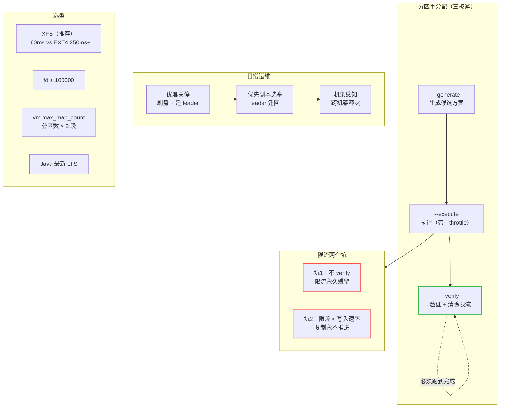
```mermaid
flowchart TB
    subgraph RA["分区重分配（三板斧）"]
        G["--generate<br/>生成候选方案"] --> E["--execute<br/>执行（带 --throttle）"]
        E --> V["--verify<br/>验证 + 清除限流"]
        V -. "必须跑到完成" .-> V
    end
    subgraph TR["限流两个坑"]
        T1["坑1：不 verify<br/>限流永久残留"]
        T2["坑2：限流 < 写入速率<br/>复制永不推进"]
    end
    subgraph OPS["日常运维"]
        S["优雅关停<br/>刷盘 + 迁 leader"] --> P["优先副本选举<br/>leader 迁回"]
        P --> R["机架感知<br/>跨机架容灾"]
    end
    subgraph HW["选型"]
        H1["XFS（推荐）<br/>160ms vs EXT4 250ms+"]
        H2["fd ≥ 100000"]
        H3["vm.max_map_count<br/>分区数 × 2 段"]
        H4["Java 最新 LTS"]
    end
    E --> TR
    style V stroke:#3fb950,stroke-width:2px
    style T1 stroke:#f85149,stroke-width:2px
    style T2 stroke:#f85149,stroke-width:2px
```

**核心结论**：**加机器 ≠ 扩容**——新 broker **不会自动分到任何分区**，必须显式跑重分配（`--generate` → `--execute` → `--verify`，三模式互斥）。限流有两个必须知道的坑：①**不跑 `--verify`，限流会永久残留**，集群长期半速运行（本课实测捕获官方警告原文 "You must run --verify periodically... to ensure the throttle is removed."）；②**限流值低于写入速率**（`max(BytesInPerSec) > throttle`）**复制永不推进**，判据是 `FetcherLagMetrics` 的 lag 应持续下降。另外：重分配工具**不会自动均衡数据分布**，该搬哪些要管理员自己判断；**目标 broker 数必须 ≥ 副本因子**（RF=3 迁到 2 个 broker 实测报 `InvalidReplicationFactorException`）。选型上官方给了硬数据：**XFS 160ms vs EXT4 250ms+ 且 XFS 免调优**（EXT4 的性能选项在故障场景下可能损坏文件系统）；文件描述符至少 10 万；**官方推荐禁用应用级 fsync**——持久性靠副本而非本地刷盘。

> 📖 [课 16 全文](stages/6-运维与可观测/lessons/lesson-16-集群运维操作.md)

---

## 阶段 7：实现原理

> 2026-09-14 新增。补齐阶段 6 登记的三项「已知未覆盖」底层实现内容。

**阶段目标**：从「会用」走到「知道为什么」——把前面反复出现的机制，追到它们的实现依据。

### 课 17：网络层与请求处理模型

**知识点**：网络层与请求处理模型

**一图总结**

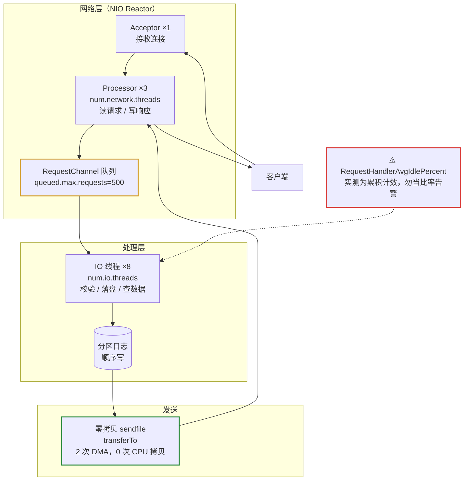
```mermaid
flowchart TD
    subgraph NET["网络层（NIO Reactor）"]
        A["Acceptor ×1<br/>接收连接"]
        P["Processor ×3<br/>num.network.threads<br/>读请求 / 写响应"]
        Q["RequestChannel 队列<br/>queued.max.requests=500"]
    end
    subgraph IO["处理层"]
        H["IO 线程 ×8<br/>num.io.threads<br/>校验 / 落盘 / 查数据"]
        L[("分区日志<br/>顺序写")]
    end
    subgraph SEND["发送"]
        ZC["零拷贝 sendfile<br/>transferTo<br/>2 次 DMA，0 次 CPU 拷贝"]
    end
    C["客户端"] --> A
    A --> P
    P --> Q
    Q --> H
    H --> L
    L --> ZC
    ZC --> P
    P --> C
    M["⚠️ RequestHandlerAvgIdlePercent<br/>实测为累积计数，勿当比率告警"] -.-> H
    style Q stroke:#d29922,stroke-width:2px
    style ZC stroke:#238636,stroke-width:2px
    style M stroke:#da3633,stroke-width:2px
```

**核心结论**：网络层是标准 Reactor NIO——1 个 acceptor + N 个 processor（**默认 3**）+ M 个 IO 线程（**默认 8**），用请求队列解耦。**排查性能问题先看队列积压，再调线程数**：实测 processor 空闲比 1.0、队列 0 积压，说明 33 MB/s 是单客户端压测上限而非集群上限。⚠️ **`RequestHandlerAvgIdlePercent` 实测是单调累积计数**（5 次采样 2.36e11→2.62e11），不是 0~1 比率，照抄教程配 `< 0.3` 告警将**永不触发**；改用 `RequestQueueSize` + `TotalTimeMs`。零拷贝只在消费拉取路径生效，靠 `TransferableRecords.writeTo` → `transferTo` 把 4 次拷贝（含 2 次 CPU）降到 2 次 DMA。

> 📖 [课 17 全文](stages/7-实现原理/lessons/lesson-17-网络层与请求处理模型.md)

---

### 课 18：消费者位移与协调者

**知识点**：消费者位移与协调者

**一图总结**

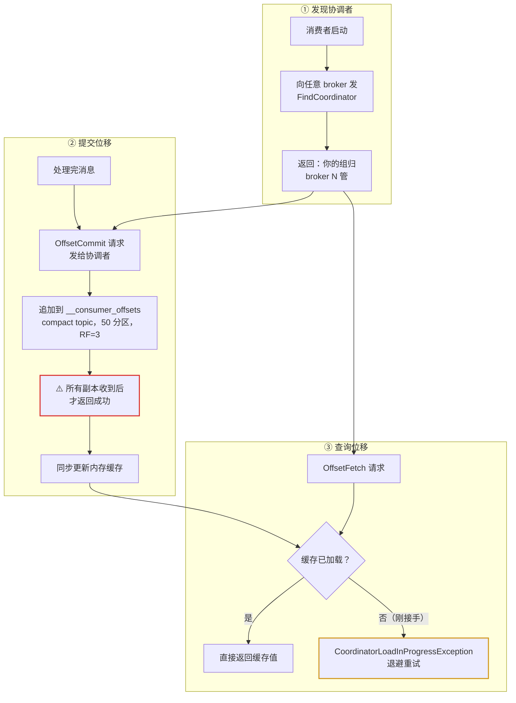
```mermaid
flowchart TD
    subgraph DISCOVER["① 发现协调者"]
        C1["消费者启动"] --> C2["向任意 broker 发<br/>FindCoordinator"]
        C2 --> C3["返回：你的组归<br/>broker N 管"]
    end
    subgraph COMMIT["② 提交位移"]
        D1["处理完消息"] --> D2["OffsetCommit 请求<br/>发给协调者"]
        D2 --> D3["追加到 __consumer_offsets<br/>compact topic，50 分区，RF=3"]
        D3 --> D4["⚠️ 所有副本收到后<br/>才返回成功"]
        D4 --> D5["同步更新内存缓存"]
    end
    subgraph FETCH["③ 查询位移"]
        E1["OffsetFetch 请求"] --> E2{"缓存已加载？"}
        E2 -->|"是"| E3["直接返回缓存值"]
        E2 -->|"否（刚接手）"| E4["CoordinatorLoadInProgressException<br/>退避重试"]
    end
    C3 --> D2
    C3 --> E1
    D5 --> E2
    style D4 stroke:#da3633,stroke-width:2px
    style E4 stroke:#d29922,stroke-width:2px
```

**核心结论**：**每个消费组有专属协调者 broker**，按 `hash(group.id) % 50` 决定归属分区，该分区的 leader 即协调者；消费者通过 `FindCoordinator` 发现（**可向任意 broker 发起**，自举设计）。**提交成功要求所有副本都收到**才返回，不是 leader 单独确认。**`CoordinatorLoadInProgressException` 是正常自愈过程**——协调者变更后新协调者加载缓存期间拒绝查询，客户端自动退避重试（实测：停 broker 2 → 协调者变为 broker 3）。`__consumer_offsets` 是 compact topic，且 **`segment.bytes` 被特意调小到 100MB**（默认 1GB）以加快压实。

> 📖 [课 18 全文](stages/7-实现原理/lessons/lesson-18-消费者位移与协调者.md)

> ⚠️ **主题偏差**：本课原定「分区分配算法」，抓取官方 4.3 原文后发现 `implementation/distribution` 页面已改为只讲 Consumer Offset Tracking（**无副本分配算法原文**），机架感知已在课 16 覆盖，故改题。详见[阶段 7 概览](stages/7-实现原理/overview.md)。

---

### 课 19：协议版本与兼容性

**知识点**：协议版本与兼容性

**一图总结**

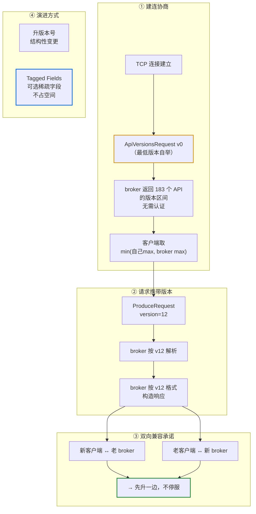
```mermaid
flowchart TD
    subgraph HANDSHAKE["① 建连协商"]
        A1["TCP 连接建立"] --> A2["ApiVersionsRequest v0<br/>（最低版本自举）"]
        A2 --> A3["broker 返回 183 个 API<br/>的版本区间<br/>无需认证"]
        A3 --> A4["客户端取<br/>min(自己max, broker max)"]
    end
    subgraph REQ["② 请求携带版本"]
        B1["ProduceRequest<br/>version=12"] --> B2["broker 按 v12 解析"]
        B2 --> B3["broker 按 v12 格式<br/>构造响应"]
    end
    subgraph COMPAT["③ 双向兼容承诺"]
        C1["新客户端 ↔ 老 broker"]
        C2["老客户端 ↔ 新 broker"]
        C3["→ 先升一边，不停服"]
    end
    subgraph EVOLVE["④ 演进方式"]
        D1["升版本号<br/>结构性变更"]
        D2["Tagged Fields<br/>可选稀疏字段<br/>不占空间"]
    end
    A4 --> B1
    B3 --> C1
    B3 --> C2
    C1 --> C3
    C2 --> C3
    style A2 stroke:#d29922,stroke-width:2px
    style C3 stroke:#238636,stroke-width:2px
    style D2 stroke:#0969da,stroke-width:2px
```

**核心结论**：**Kafka 承诺双向兼容**——新客户端能连老 broker、老客户端能连新 broker，因此**可先升一边、全程不停服**。版本在建连时协商，取双方都支持的最高版本：**实测 Fetch 支持 `4 to 17` 且客户端用 17、Metadata `0 to 13` 用 13、ApiVersions `0 to 4` 用 4，均等于 broker usable 上界**。`ApiVersions` 用最低版本 v0 发送且**无需认证**（KIP-35，自 0.10.0.0 起），**结果只对当前连接有效**，断线必须重问。broker 会**按请求声明的版本格式构造响应**——不同版本客户端连同一 broker 拿到的字节格式不同，各自都能解析。演进有两条路：结构性变更升版本号；可选稀疏字段用 **Tagged Fields**（不升版、未设置时不占空间）。本环境 API 共 **183** 个，其中 **UNSUPPORTED 33** 个。

> 📖 [课 19 全文](stages/7-实现原理/lessons/lesson-19-协议版本与兼容性.md)

---

## 三、综合实战项目：电商订单事件中心

> 📦 [项目根目录](projects/电商订单事件中心/)

**一句话需求**：订单服务把 `OrderCreated` / `OrderPaid` / `OrderCancelled` 三类事件发进 Kafka，下游的**积分、风控、审计**三个服务各自独立消费同一份数据，且必须做到**不丢消息、不重复记账、坏消息不阻塞主链路**。

**完成即达成**：一份事件流被 3 个下游独立消费（各自有独立进度）· 积分服务不重复加分 + 坏消息进 DLQ · 风控服务用事务保证「读-处理-写」原子 · 一个命令看清各服务消费进度与积压。

### 跨阶段整合（4 个阶段全覆盖）

| 阶段 | 覆盖知识点 | 项目落点 |
|------|-----------|---------|
| 阶段 1（2 点） | 三大价值 · Kafka vs 其他 MQ 对比 | 订单服务改发事件；选 Kafka 因为一份数据 3 下游 + 可回放 |
| 阶段 2（6 点） | 创建 Topic 与 CLI 观察 · Topic 与分区 · 分区策略 · acks · 消费者组 · 位移提交 | 初始化 3 个 topic；`user_id` 作 key 保序；`acks='all'`；3 个服务 = 3 个 group；手动提交 |
| 阶段 3（4 点） | ISR · 三种交付语义 · 幂等 · 事务 | 取「至少一次 + 消费端幂等」；风控用事务实现原子 |
| 阶段 4（4 点） | 生产者/消费者代码 · EDA · 拓扑 · 决策清单 | 代码基于课 9 骨架；事件命名用过去式；按业务事件建 topic |

> 合计 16 个知识点落点（2 + 6 + 4 + 4），与 [项目 README 知识点地图](projects/电商订单事件中心/README.md) 逐行一致；不等同于全课程 31 个知识点（部分知识点属认知铺垫，未落地为本项目代码）。

### 代码结构

```
projects/电商订单事件中心/
├── README.md           # 需求、覆盖地图、运行方式
├── 设计决策.md          # 两个真权衡点（含候选方案对比与代价）
├── 反例对照.md          # "能跑但很糟"的版本，逐条对照
├── 验收清单.md          # 逐项勾选的验收标准
└── 实现/
    ├── init_topics.py      # 初始化 orders / orders.DLQ / risk.result
    ├── order_producer.py   # 订单服务：三种事件 + 故意制造的坏消息
    ├── points_consumer.py  # 积分服务：幂等记账 + 坏消息进 DLQ
    ├── risk_consumer.py    # 风控服务：事务消费-处理-生产
    ├── audit_consumer.py   # 审计服务：全量留痕（事件溯源雏形）
    └── common.py           # 公共配置
```

### 运行方式

> Windows 避坑同课 9：用 `python3.11.exe` 运行、PowerShell 用 `;` 分隔命令。

```powershell
docker ps
python3.11.exe 实现\init_topics.py
python3.11.exe 实现\order_producer.py
```

再开**三个**终端分别跑下游：

```powershell
python3.11.exe 实现\points_consumer.py
python3.11.exe 实现\risk_consumer.py
python3.11.exe 实现\audit_consumer.py
```

看全局进度（改 `--group` 即可看另外两个服务：`risk-service` / `audit-service`）：

```powershell
docker exec kafka /opt/kafka/bin/kafka-consumer-groups.sh --bootstrap-server localhost:9092 --describe --group points-service
```

> 重点看 `LAG` 列：**持续上涨 = 消费能力不足**（扩容消费者，但上限是分区数）；**某一分区 LAG 卡死不动 = 毒药消息**（转 [09 手册第 2 条](09-排障速查手册.md)）。

**建议路径**：先读 [设计决策.md](projects/电商订单事件中心/设计决策.md)（理解为什么这么选）→ 再读 [反例对照.md](projects/电商订单事件中心/反例对照.md)（看"能跑但很糟"长什么样）→ 跑起来后逐项勾选 [验收清单.md](projects/电商订单事件中心/验收清单.md)。

### 两个设计决策（本项目的精华）

**决策 1：整体取「至少一次 + 消费端幂等」，事务只用于风控服务。**
理由是**事务的边界决定了它不能包打天下**——Kafka 事务只覆盖 topic 与 `__consumer_offsets`，积分服务要写数据库、审计服务要写对象存储，事务的原子性到不了这些外部系统，用了照样得写幂等，白付吞吐代价（约降 15%–30%）。风控是例外：它是纯 Kafka 内闭环，事务能真正生效，且判定结果重复会造成误拦截。
代价：正确性从"不重复"**降格为"重复无害"**——只能承诺"重复了结果也对"，需要向上下游说清楚。

**决策 2：坏消息失败 3 次后进 DLQ，不原地重试。**
理由是原地重试的失败模式**灾难性且反直觉**：一条毒药消息卡死消费者 → 超过 `max.poll.interval.ms` 被踢出组 → 触发再均衡 → 该组所有分区全部暂停 → 积压扩散 → 坏消息分给下一个消费者再次卡死，正反馈死循环。DLQ 的额外好处是**积压量本身就是"有多少坏消息"的指标**，且数据没丢，修好后可重放。
判据：**消息内容有问题（必然重复失败）→ DLQ；环境有问题（重试可能成功）→ 退避重试**。生产常两者结合，本项目即先退避重试 3 次再进 DLQ。

---

## 四、实战与排障

三份产物互补：**08 是学习态**（理解为什么），**09 是使用态**（出事时按症状倒查），**10 是设计态**（新要求来了怎么设计）。

### [08 实战经验](08-实战经验.md)（学习态）

- **适用边界与反模式**：明确别用的场景 · 三个高频反模式（用了 Kafka 但用错了）
- **7 个高频故障模式**（五段式：症状 → 根因 → 检测 → 修复 → 预防）：消费者积压 · 毒药消息 · 批次过期 · 连不上/元数据 · NOT_LEADER_OR_FOLLOWER 刷屏 · 位移提交时机 · 再均衡风暴
- **上线 Checklist**：生产者 / 消费者 / Topic 与集群 / 可观测性 四组投产前必查项

### [09 排障速查手册](09-排障速查手册.md)（使用态 · 机长 QRH 式）

每条按「一眼识别 → 止血 → 定位 → 修复 → 若无效」组织，按症状倒查：

| # | 症状 | 首要止血动作 |
|---|------|-------------|
| 1 | 消费者积压 | 先看 Lag 是否持续上涨，扩容消费者（≤ 分区数）或提吞吐 |
| 2 | 毒药消息阻塞分区 | 定位卡住的分区与 offset，旁路到 DLQ 后恢复主链路 |
| 3 | 生产者批次过期 | 调 `linger.ms` / `batch.size` 或降发送速率 |
| 4 | 连不上或拿不到元数据 | 查 `bootstrap.servers` 与网络/鉴权，别急着改业务代码 |
| 5 | NOT_LEADER_OR_FOLLOWER | 多数是正常leader切换，**不要告警轰炸**，确认是否持续 |
| 6 | 重复消费或消息丢失 | 先定位是"提交时机"还是"重试"导致，再对症处理 |
| 7 | 再均衡风暴 | 查 `max.poll.interval.ms` 与处理耗时，先稳住组成员 |
| 8 | 分区不可用 | 查 ISR 与 `unclean.leader.election`，确认是否要人工介入 |

> 手册末尾还有**通用命令速查**，可直接复制执行。

### [10 场景解法库](10-场景解法库.md)（设计态 · 先想后看）

8 道开放设计题，每道给 ≥3 个解法（含代价与适用边界）+ 推荐路径 + 知识点挂钩：

| # | 场景 | 核心矛盾 |
|---|------|---------|
| 1 | 流量涨 10 倍，消费者追不上 | 并行度被分区数锁死，分区数只能加不能减 |
| 2 | 既要保序又要并发 | 保序要求分区映射稳定，扩容必然破坏它 |
| 3 | 数据库写 + 发消息的一致性 | Kafka 事务管不到数据库 |
| 4 | 新业务要消费全部历史数据 | 默认只留 7 天，重放要靠提前设计 |
| 5 | 消息体太大 | Kafka 为小消息高吞吐优化 |
| 6 | 跨机房容灾与多活 | 副本抗不了整个地域故障 |
| 7 | 事件结构要升级 | 事件是跨服务契约，下游无法同时上线 |
| 8 | 我要"任务队列"语义 | 分区绑定的流式消费 ≠ 单条确认队列 |

> 解法全部折叠，**先自己想 30 秒再展开**。文末有「六问思考框架」，用于应对没见过的场景。

---

## 五、知识点总索引

| 课 | 阶段 | 知识点 |
|----|------|--------|
| 课 1 | 1 | 直接同步调用的痛点 · 消息队列是什么 · 削峰/异步/解耦三大价值 |
| 课 2 | 1 | Kafka 起源与定位 · 四大角色全景 · Kafka vs 其他 MQ |
| 课 3 | 2 | KRaft 一键起（Docker） · 创建 Topic + 生产消费 · CLI 观察 Partition |
| 课 4 | 2 | Topic 与 Partition · 顺序写磁盘 · 零拷贝 · Broker 与集群 |
| 课 5 | 2 | 生产者发送流程 · 分区策略 · acks 与发送可靠性 |
| 课 6 | 2 | 消费模型与位移 · 消费者组与再均衡 · 位移提交与重复/丢失 |
| 课 7 | 3 | 副本与 leader/follower · ISR 机制 · 控制器选举与故障转移 |
| 课 8 | 3 | 三种交付语义 · 幂等 producer · 事务简介 |
| 课 9 | 4 | 选客户端与环境 · 写生产者 · 写消费者 |
| 课 10 | 4 | 事件驱动架构 EDA · 常见拓扑 · 决策清单 |

> 全课程合计 **10 课 · 31 个知识点 · 4 个阶段**，另有 1 个综合实战项目 + 实战经验 + 排障速查手册 + 场景解法库。

---

## 🚀 接下来可以做什么

- **练设计**：打开 [10 场景解法库](10-场景解法库.md)，挑一个场景先自己设计，再对照解法。
- **复盘**：复制"考我一下 Kafka，针对 {薄弱点}"进行知识点对齐。
- **进阶**：告诉我下一步想深入的方向，我会基于当前档案调整大纲继续。
